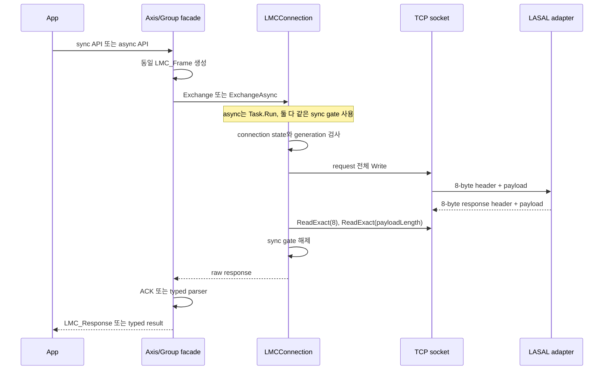
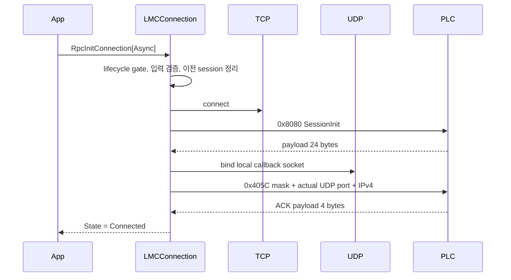
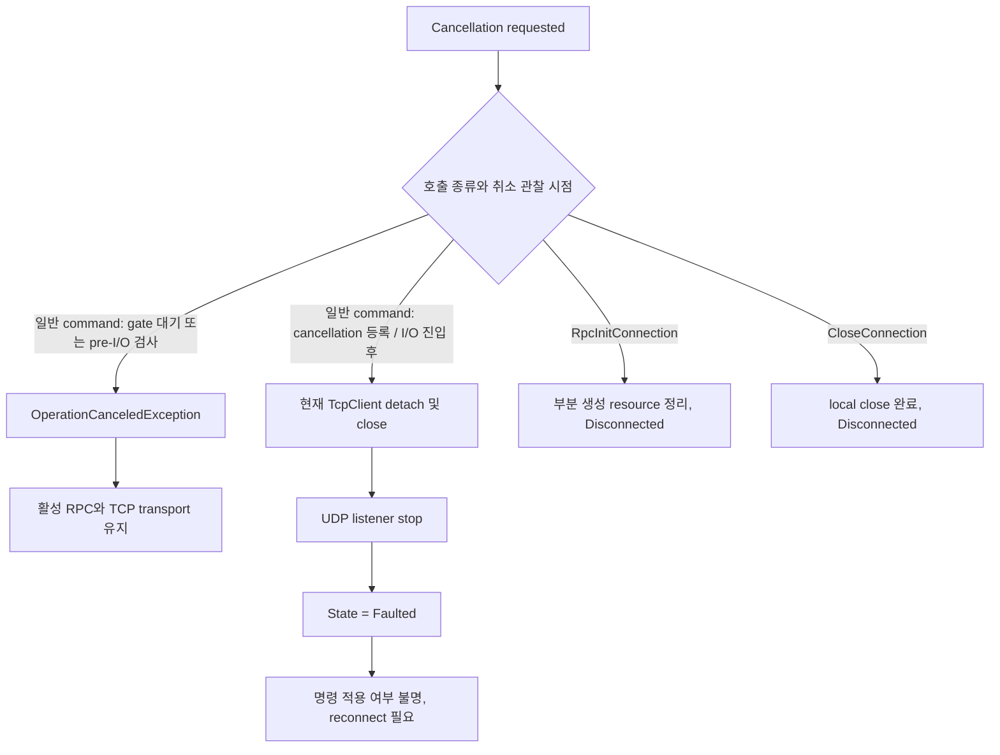
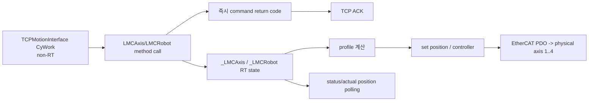

# LasalMotionControlLib 내부 코드 및 실행 구조 설명서

- 문서 버전: `2.1`
- 작성 기준: `2026-07-21`
- 적용 API: `LasalMotionControlLib 0.9.1-preview`
- motion baseline branch/commit: `main` / `f9bc88a7f78dab5214186689198414fa9a203a32`
- diagnostics 기준: 2026-07-21 current source
- 대상 독자: C# API, LASAL TCP adapter, MotionLib 연결과 배포 패키지를 유지보수하는 개발자

이 문서는 공개 API의 signature와 인자를 다시 나열하는 문서가 아니다. 사용자 코드에서
호출한 API가 C# facade, TCP frame, LASAL request queue, `_LMCAxis` 또는
`_LMCRobotBase` 호출과 response parser를 거쳐 결과로 돌아오는 실제 구현 경로를
설명한다.

검토 대상인 Distribution DOCX
`LMC_Library/LMC_API_Distribution/03_API_User_Manual/LASAL_Motion_Control_API_User_Manual_KO.docx`
문서 버전 `1.0`은 빠른 API 참조다. 각 기능에서 sync/async signature를 함께 보여 주지만
두 메서드가 내부적으로 같은 transport와 command를 공유한다는 사실은 설명하지 않는다.
현재 내부 사용자 매뉴얼 원본은 [API_USER_MANUAL_KO.md](API_USER_MANUAL_KO.md) 문서
버전 `1.4`다. 이 문서는 그 사용자 매뉴얼을 대체하지 않고 구현 이해와 유지보수를 보완한다.

> **상태 경고:** `0.9.1-preview`는 production 승인본이 아니다. 2026-07-21 current
> source는 PC 자동 시험 101/101과 LASAL 정적 계약을 통과했다. D0-D4 통합 source의
> IDE Rebuild/Link와 implementation smoke도 통과했지만 이후 Recorder Stop 멱등
> 패치는 최신 source Rebuild 대기다. 기존 motion command의 실제 PLC E2E는 여전히 `0/25`이며,
> diagnostics D1~D3와 D4 single-bank Ring/Trigger도 PLC runtime 시험과 packet 재캡처를
> 수행하지 않았다. D4 Double과 D5 PLC 실행은 capability-off다.
> 아래 설명에서 `구현됨`은 current source에 경로가 존재한다는 뜻이며 실기 완료를 뜻하지 않는다.

## 1. 먼저 바로잡아야 할 핵심 오해

| 오해 | 실제 구현 |
|---|---|
| sync API와 async API가 서로 다른 PLC 기능이다 | 같은 command ID, 같은 payload builder, 같은 parser를 사용한다. |
| async API는 비동기 socket I/O 또는 PLC-side async command다 | blocking `ExchangeCore()`를 `Task.Run`으로 실행하는 caller-thread 비차단 wrapper다. |
| 여러 async API를 동시에 호출하면 TCP request도 병렬 처리된다 | connection의 단일 `sync` gate 때문에 request/response가 한 건씩 직렬 처리된다. |
| response를 request ID로 매칭한다 | request ID와 pending-response map이 없다. gate를 잡은 호출이 바로 다음 response를 직접 읽는다. |
| `LMC_Response.IsSuccess == true`면 이동 또는 Power 전이가 완료됐다 | 대부분의 ACK는 명령 접수 또는 MotionLib method의 즉시 반환 결과다. 완료는 status/position polling으로 확인한다. |
| callback 등록이 있으므로 motion-complete event도 구현됐다 | PC raw UDP listener와 PLC endpoint 등록만 있다. PLC event sender와 typed payload schema는 없다. |
| cancellation, timeout, `CloseConnection`, `Dispose`가 축을 정지시킨다 | motion Stop을 보내지 않는다. in-flight cancellation은 TCP transport를 폐기할 수 있다. |

가장 중요한 한 문장으로 요약하면 다음과 같다.

> **sync/async는 호출자 대기 방식의 차이일 뿐이며, 내부 wire와 PLC 실행 경로는 같다.**

## 2. System of Record와 디렉터리 책임

| 경로 | 책임 | 판정 |
|---|---|---|
| `LMC_Library/LMC_API_Delivery/src` | C# API의 canonical source | 구현 판단 우선 |
| `LMC_Library/LMC_API_Delivery/tests` | request golden, parser, fake RPC, LASAL 정적 계약 | 회귀 기준 |
| `LMC_Library/LMC_API_Delivery/docs/DINT_PACKET_MAP.txt` | command별 byte 계약 | source와 함께 변경 |
| `LMC_Library/LasalApiWpfTestApp` | canonical API source를 직접 참조하는 개발/실기 앱 | 내부 기준 앱 |
| `LMC_Library/LMC_API_Distribution` | 외부 DLL, binary-reference 예제, 사용자 DOCX/PDF | 배포 기준 |
| `Lasal_PRG/Elmo_EtherCAT_Test_4Axis` | canonical PLC TCP/RPC adapter와 motion network | LASAL 수정 기준 |
| `Codex_PMAS_WPF` | Elmo MMCLib 기능 비교 기준 | LASAL wire 구현 아님 |
| `Codex_LASAL_WPF` | 실제 TCP와 simulation/no-op이 섞인 legacy hybrid | 신규 구현 근거로 사용 금지 |
| `LMC_Library/LMC_API/LMC_API` | `0.9.0-pc-api` 보관본 | 개발/배포 사용 금지 |

현재 상태와 과거 문서가 충돌하면 current source,
[DINT_PACKET_MAP.txt](../LMC_API_Delivery/docs/DINT_PACKET_MAP.txt),
[현재 아키텍처 및 릴리스 상태](../../docs/architecture/ELMO_MASTER_CURRENT_ARCHITECTURE_AND_RELEASE_STATUS_2026-07-16.md)
순서로 판단한다.

## 3. 전체 실행 구조

```mermaid
flowchart LR
    APP["사용자 프로그램 / WPF"] --> FACADE["LMCSingleAxis / LMCGroupAxis"]
    FACADE --> FRAME["LMC_Frame serializer"]
    FRAME --> CONN["LMCConnection\n단일 exchange gate"]
    CONN -->|"TCP LASAL-DINT v1"| SERVER["_TCPIPServer1 : 4000"]
    SERVER --> RESP["Response()\ningress only"]
    RESP --> QUEUE["request queue\ndepth 8"]
    QUEUE --> CY["TCPMotionInterface.CyWork()"]
    CY --> PARSER["MsgPaser()"]
    PARSER --> AXIS["_LMCAxis1..9 Control"]
    PARSER --> ROBOT["_LMCRobotBase1 Control"]
    AXIS --> RT["1 ms motion realtime/profile"]
    ROBOT --> RT
    RT --> PDO["physical axis 1..4 / EtherCAT PDO"]
    PARSER -->|"direct response"| SERVER
    SERVER --> CONN
    CONN --> RESULT["ACK / typed result parser"]
    SERVER -. "UDP endpoint 등록만" .-> CONN
```



실행 책임은 다음 네 층으로 나뉜다.

| 층 | 책임 | 하지 않는 일 |
|---|---|---|
| 사용자/WPF | UNIT 변환, 안전 gate, 상태 polling, UI thread marshal | wire byte 직접 조립 |
| C# DLL | 입력 검증, frame 생성, TCP lifecycle, response 파싱 | 자동 UNIT 변환, motion 완료 대기 |
| LASAL TCP adapter | session/descriptor/payload 검증, queue, MotionLib method 호출 | EtherCAT RT profile 계산 자체 |
| MotionLib/drive | profile 실행, 상태 전이, physical EtherCAT output | PC RPC concurrency 관리 |

## 4. sync/async API의 실제 내부 동작

### 4.1 공통 호출 파이프라인

Axis와 Group의 public method는 다음 형태로 수렴한다.

```text
public API
  -> LMC_Frame request builder
  -> LMCConnection.Exchange 또는 ExchangeAsync
  -> ExchangeCore
  -> TCP Write
  -> response header 8 bytes ReadExact
  -> declared payload ReadExact
  -> ACK 또는 typed result parser
```

- sync API는 호출한 thread에서 `ExchangeCore()`가 끝날 때까지 block한다.
- async API는 `Task.Run(() => ExchangeCore(...))`로 worker thread에서 같은 blocking
  작업을 수행한다.
- Axis/Group async facade는 같은 `LMC_Frame` builder와 parser를 사용하고
  `ConfigureAwait(false)`로 library 내부 continuation을 실행한다.
- async 전용 command ID, async response, PLC completion event는 없다.

근거:

- `LmcConnection.cs:157-203` - connection init/close async wrapper
- `LmcConnection.cs:390-470` - 공통 `ExchangeCore`와 `Task.Run`
- `LmcAxis.cs:437-455` - Axis 공통 send/send-async
- `LmcGroup.cs:459-499` - Group 공통 send/send-async



### 4.2 연결당 한 건만 in-flight

`LMCConnection`에는 request ID, correlation ID, `TaskCompletionSource` map 또는 상시
TCP reader loop가 없다. `sync` monitor가 request 송신부터 response 전체 수신까지
보호한다. header의 `Reference`는 Axis/Group descriptor이며 request ID가 아니다.
`HeaderReserved`도 보존만 하며 correlation에 사용하지 않는다.

따라서 다음 호출은 worker thread 수와 관계없이 wire에서 순차 처리된다.

```csharp
await Task.WhenAll(
    axis1.GetActualPositionResultAsync(token),
    axis2.GetActualPositionResultAsync(token),
    group.GroupReadStatusResultAsync(token));
```

위 코드는 세 작업을 논리적으로 동시에 시작하지만 한 `LMCConnection`에서는 최대 한
RPC만 송수신된다. 현재 PC API는 PLC의 depth-8 queue를 burst pipeline으로 사용하지 않는다.

### 4.3 sync와 async의 선택 기준

| 상황 | 권장 |
|---|---|
| UI thread에서 호출 | async API 사용 |
| background worker에서 짧은 진단 호출 | sync 또는 async 모두 가능 |
| 높은 throughput을 위한 병렬 RPC | 현재 API로 불가능, protocol redesign 필요 |
| 명령 완료 대기 | async 여부와 무관하게 typed status/position polling 필요 |
| 취소 가능한 사용자 동작 | async + token을 쓸 수 있으나 취소를 Stop으로 취급하면 안 됨 |

`ReadStatus()`와 `GetActualPosition()` 같은 scalar compatibility helper는 sync 전용이다.
async에서는 `ReadStatusResultAsync()`와 `GetActualPositionResultAsync()`처럼 diagnostic
field를 보존하는 typed API를 사용한다.

## 5. Connection lifecycle과 session generation

### 5.1 초기화 순서

실제 `RpcInitConnection[Async]` 순서는 다음과 같다.

1. address, port, timeout과 callback 인자를 검증한다.
2. `lifecycleSync` gate를 획득한다.
3. 이전 connection이 있으면 local resource를 정리한다.
4. 지정한 local IPv4에 ephemeral TCP endpoint를 만들고 PLC에 연결한다.
5. `0x8080` session-init을 보내고 정확한 24-byte payload를 검증한다.
6. local UDP callback listener를 bind한다.
7. 실제 bind된 UDP port, event mask, local IPv4로 `0x405C`를 보낸다.
8. 정확한 4-byte ACK가 성공하면 `Connected`로 전이한다.



기본 option은 다음과 같다.

| Option | 기본값 | 적용 방식 |
|---|---:|---|
| Connect timeout | 3000 ms | `BeginConnect` + wait timeout |
| Send timeout | 3000 ms | synchronous `NetworkStream.Write` 기반 |
| Receive timeout | 3000 ms | synchronous `NetworkStream.Read` 기반 |
| Callback thread join | 500 ms | listener 종료 시 background thread join |
| Callback source validation | `true` | controller IPv4가 다르면 datagram 폐기 |

### 5.2 상태와 fault

| State | 의미 |
|---|---|
| `Disconnected` | local TCP/UDP resource가 닫힘 |
| `Connecting` | TCP와 RPC/callback 초기화 진행 중 |
| `Connected` | command exchange 허용 |
| `Closing` | close ACK와 local cleanup 진행 중 |
| `Faulted` | timeout, transport 오류 또는 in-flight cancellation로 stream 신뢰 상실 |

자동 retry와 자동 reconnect는 없다. `Faulted` 이후 애플리케이션이 다시
`RpcInitConnection[Async]`를 수행해야 한다.

### 5.3 Axis/Group handle과 generation

새 `TcpClient`를 만들 때 local `sessionGeneration`이 증가한다. Axis와 Group 객체는
생성 당시 generation과 lookup descriptor를 저장한다. 각 호출 전과 exchange gate 안에서
현재 generation인지 확인하므로 reconnect 후 예전 객체는 `InvalidOperationException`으로
거부된다.

```text
Connection A generation 10
  -> axis handle(reference 1, generation 10)
  -> disconnect/reconnect
Connection A generation 11
  -> old axis handle 사용: 거부
  -> CreateAsync로 새 handle 생성: 정상
```

descriptor는 PLC pointer가 아니다. current deployment의 opaque local 값은 Axis `1..9`,
Group `0x0100`이며 session 밖에서 영속 identifier로 저장하면 안 된다.

### 5.4 cancellation의 실제 의미



- gate 대기 중 또는 gate 획득 직후의 pre-I/O token 검사에서 취소를 관찰하면 다른 active
  request와 현재 transport를 건드리지 않는다.
- 일반 command가 pre-I/O 검사를 지나 cancellation callback 등록과 transport I/O에 진입한
  뒤 취소되면 command bytes가 이미 전송됐을 수 있다. 이때 command 적용 여부와 TCP
  stream 위치를 확정할 수 없으므로 transport를 폐기하고 `Faulted`로 전환한다.
- `RpcInitConnection[Async]` 취소는 부분 생성 resource를 정리하고 `Disconnected`로 끝난다.
- `CloseConnection[Async]` 취소도 local close를 완료하고 `Disconnected`로 끝난다.
- cancellation token은 motion Stop token이 아니다.

`CloseConnection()`은 `0x405D` ACK를 시도한 뒤 local TCP/UDP를 닫는다. ACK가 실패해도
local resource는 정리된다. `Dispose()`는 close 오류를 외부로 다시 던지지 않는다.
어느 경로도 Axis/Group Stop을 자동 전송하지 않는다.

## 6. Axis와 Group 객체 생성

### 6.1 Axis 생성

`new LMCSingleAxis(connection, name)` 또는 `CreateAsync()`는 단순 local object 생성이 아니다.

1. printable ASCII 1..79-byte name을 `0x103C` 80-byte payload로 전송한다.
2. PLC가 실제 연결 object의 `_GetObjName()`과 대소문자를 무시해 비교한다.
3. 성공하면 6-byte lookup response의 offset 4에서 nonzero descriptor를 읽는다.
4. descriptor로 `0x202B AxisInfo`를 추가 전송한다.
5. 8-byte ACK의 frame, command status와 exact shape를 검증한다.
6. descriptor와 session generation을 handle에 저장한다.

sync constructor와 async factory는 동일한 두 RPC를 순서대로 수행한다. async factory가
두 요청을 동시에 보내는 것은 아니다.

### 6.2 Group 생성

Group은 `0x1042` name lookup 한 번으로 current descriptor `0x0100`을 얻는다.
current PLC에는 한 `LMCRobot` registry 대상만 있다. Group handle도 session generation을
저장한다.

`GetGroupMembersInfoResult[Async]`는 별도 `0x20D2` command다. response는 16개 reference,
16개 device ID, 16개의 80-byte name slot, function status/error와 axis count로 구성된다.
현재 PLC 성공 조건은 Axis 1..9와 Robot client가 모두 연결된 상태다.

## 7. Wire protocol과 response correlation

### 7.1 request header

모든 integer와 DINT는 little-endian이다. `SetKinTransformCartesian4Axis()`의 matrix/node
값은 IEEE-754 64-bit `DOUBLE`을 little-endian으로 직렬화한다.

| Offset | 크기 | 의미 |
|---:|---:|---|
| 0 | 2 | Command ID |
| 2 | 2 | Reserved, 현재 0 |
| 4 | 2 | Payload length |
| 6 | 2 | object descriptor/reference |
| 8 | N | command payload |

### 7.2 response header

| Offset | 크기 | 의미 |
|---:|---:|---|
| 0 | 2 | Header status |
| 2 | 2 | Payload length |
| 4 | 4 | Reserved |
| 8 | N | response payload |

C#은 response header 8 bytes를 먼저 `ReadExact()`하고 offset 2의 `UInt16` 길이만큼
payload를 다시 `ReadExact()`한다. raw 크기가 정확히 `8 + PayloadLength`일 때만
`IsFrameValid`가 된다.

현재 protocol에는 magic, version, request ID, command echo와 CRC가 없다. 순서가 어긋난
stream을 재동기화할 방법도 없다. 그래서 timeout, EOF, partial send와 in-flight
cancellation 뒤에는 transport 재사용을 금지한다.

### 7.3 response shape

| shape | payload | 사용 |
|---|---:|---|
| short ACK/error | 4 bytes | `Status UINT16 + ErrorId INT16` |
| long ACK | 8 bytes | opaque/reference DINT + status/error |
| Axis status | 12 bytes | state + function status/error + axis error + reserved status word |
| Axis position | 8 bytes | DINT position + function status/error |
| Group status | 12 bytes | state + function status/error + group error + padding |
| Group position | 68 bytes | DINT[16] + function status/error |
| Group members | 1350 bytes | 16-member metadata + function status/error/count |

typed response parser는 정상 command별 고정 길이 또는 4-byte short error만 허용한다.
정상 status/position payload가 없는 4-byte success response는 성공값으로 만들지 않고
`InvalidDataException`으로 거부한다.

## 8. C# API 내부 계층

### 8.1 파일별 책임

| 파일 | 책임 |
|---|---|
| `LmcProtocol.cs` | command ID, request builder, little-endian read/write, wire-level validation |
| `LmcConnection.cs` | lifecycle, exchange serialization, exact read, response parser, callback thread |
| `LmcAxis.cs` | Axis facade, lookup/AxisInfo, request 선택, typed/scalar 결과 |
| `LmcGroup.cs` | Group facade, lookup, kinematic axis validation, Group request 선택 |
| `LmcGroupModels.cs` | public motion option과 internal captured kinematic model |
| `LmcResults.cs` | typed result, status mask, command/axis/group success 판정 |
| `LmcConnectionModels.cs` | lifecycle state와 timeout/callback option |
| `LmcUnits.cs` | caller용 UNIT 상수, 자동 변환 로직 아님 |

### 8.2 command facade의 반환 방식

Power, Reset, Stop과 Move 계열은 다음 방식이다.

```text
public command
  -> request 생성
  -> Exchange[Async]
  -> ParseCommandAcknowledgement
  -> LMC_Response 반환
```

일반 command는 valid ACK의 command status가 실패여도 대체로 예외로 바꾸지 않는다.
호출자가 `response.IsSuccess`, `Status`, `ErrorId`를 확인해야 한다. transport 오류나
malformed ACK는 예외다.

반면 다음 경로는 실패를 예외화한다.

- session init과 callback registration
- explicit close ACK
- Axis lookup/AxisInfo와 Group lookup
- scalar compatibility read인 `ReadStatus()`, `GetActualPosition()`, `GroupReadStatus()`

### 8.3 typed read와 scalar compatibility read

| API | 실패 처리 | diagnostic 정보 |
|---|---|---|
| `ReadStatusResult[Async]` | 정상 error envelope를 result로 반환 | 모두 보존 |
| `GetActualPositionResult[Async]` | 정상 error envelope를 result로 반환 | 모두 보존 |
| `GroupReadStatusResult[Async]` | 정상 error envelope를 result로 반환 | 모두 보존 |
| `ReadStatus()` | result 실패 시 `InvalidOperationException` | out response 사용 시 일부 확인 |
| `GetActualPosition()` | result 실패 시 `InvalidOperationException` | out response 사용 시 일부 확인 |
| `GroupReadStatus()` | result 실패 시 `InvalidOperationException` | out response 사용 시 일부 확인 |

신규 애플리케이션은 typed result API를 기본으로 사용한다.

## 9. LASAL TCP ingress, queue와 dispatcher

### 9.1 task와 고정 자원

`_TCPIPServer1`과 `TCPMotionInterface1`은 같은 non-RT cyclic task에서 1 ms 주기로
등록되며 TCP server가 먼저 실행된다.

| 자원 | 크기/값 |
|---|---:|
| TCP port | 4000 |
| Max connections | 1 |
| receive accumulator | 2048 bytes |
| active request buffer | 1328 bytes |
| queue payload maximum | 1320 bytes |
| send staging buffer | 2048 bytes |
| request queue depth | 8 |
| 한 `CyWork`에서 처리하는 request | 최대 1 |

### 9.2 `_TCPIPServer`에서 `Response()`까지

`_TCPIPServer.CyWork()`는 socket의 available byte 수를 확인하고
`TCPMotionInterface.DataHandling()`에 이번 scan에서 읽을 크기를 묻는다. OS receive 뒤
`Response()` callback을 호출한다.

`Response()`의 책임은 ingress뿐이다.

1. fragment를 `ReceiveBuf`에 누적한다.
2. 8-byte header에서 payload length를 읽는다.
3. payload가 1320 bytes를 넘는지 검사한다.
4. 완전한 frame이 될 때까지 기다린다.
5. command, descriptor, payload와 session epoch를 queue entry에 복사한다.
6. entry state를 마지막에 `READY`로 publish한다.
7. callback에 여러 frame이 붙어 있으면 남은 bytes를 앞으로 옮겨 반복한다.

`Response()`는 motion method를 호출하거나 TCP response를 보내지 않는다. 이 invariant는
TCP callback에서 MotionLib를 직접 호출하지 않기 위한 핵심 경계다.

### 9.3 queue state와 `CyWork()`

```text
FREE -> WRITING -> READY -> ACTIVE -> FREE
```

`CyWork()`는 read index의 `READY` entry 하나를 `ActiveRequest`로 복사하고 queue slot을
해제한다. request header를 `RequestBuf`에 재구성한 후 `MsgPaser()`를 동기 호출한다.
handler가 MotionLib client를 호출하고 response를 보내기까지 같은 CyWork invocation에서
수행된다.

queue entry에는 `Sequence`가 있지만 현재 response correlation이나 duplicate detection에는
사용하지 않는다. session이 끊기거나 close되면 `SessionEpoch`가 바뀌며 이전 epoch의
stale queue entry는 실행하지 않는다.

### 9.4 ingress fault

| 상황 | local error | 동작 |
|---|---:|---|
| 잘못된 socket/session | `-1` | request 거부 |
| payload > 1320 | `-5` | frame 폐기, boundary 불명확 시 reconnect 요구 |
| receive accumulator overflow | `-8` | ingress block/quarantine |
| queue full | `-8` | 앞서 수락된 응답 뒤 fault response |
| unknown command | `-4` | short error response |
| direct partial/failed send | transport quarantine | session epoch 변경, reconnect 필요 |

하나의 TCP callback에 oversized frame 뒤 다음 frame 일부가 이미 포함돼 boundary를 확정할 수
없으면 reconnect만 안전한 복구 방법으로 취급한다.

### 9.5 session gate

일반 command는 같은 socket에서 다음 두 단계가 모두 끝난 뒤에만 허용된다.

1. `0x8080` session init
2. `0x405C` callback endpoint registration

callback event sender가 아직 없더라도 registration은 현재 PLC session gate의 일부다.
protocol header에 session ID는 없고 socket과 local `SessionEpoch`가 session을 구분한다.

## 10. MotionLib와 realtime 경계

`TCPMotionInterface`는 non-RT `CyWork` object다. 실제 `_LMCAxis1..9`는
`RealtimeTask=true`, `CyclicTask=false`인 motion object다. Axis control client를 통해
호출된 method는 profile/state machine을 설정하고 실제 profile 진행과 EtherCAT output은
Axis realtime 경로에서 이어진다.



MotionLib source는 `_LMCAxis` method caller가 Axis realtime thread와 같은 core이며 realtime
thread보다 같거나 낮은 priority여야 한다고 명시한다. current source/static contract만으로
실제 PLC의 core/priority 배치가 이 조건을 만족한다고 확정할 수 없다. LASAL IDE와 PLC에서
task ID, core, priority와 jitter를 확인해야 한다.

축 범위도 구분한다.

| 범위 | 의미 |
|---|---|
| Axis 1..4 | physical Elmo/DS402 연결 |
| Axis 5..9 | software object, simulation mode |
| Robot member 1..9 | software wiring 존재 |
| Cartesian SetKin/Lock/Move | X/Y/Z/U Axis 1..4만 승인 |

## 11. 대표 command의 end-to-end walkthrough

### 11.1 `MoveAbsoluteEx`

1. `LMCSingleAxis.MoveAbsoluteEx()`가 현재 session인지 확인한다.
2. `LMC_Frame.LMCAxisMoveAbsolute()`가 `0x209F`, descriptor와 32-byte payload를 만든다.
3. C#은 direction이 `Shortest(2)`인지 검증하고 모든 DINT를 little-endian으로 기록한다.
4. `LMCConnection.Exchange[Async]`가 단일 gate를 획득해 request를 전송한다.
5. PLC `Response()`가 frame을 조립해 depth-8 queue에 publish한다.
6. `TCPMotionInterface.CyWork()`가 request 하나를 꺼내 `MsgPaser()`를 호출한다.
7. handler가 payload length, Axis `1..9`, direction, buffer mode와 execute를 검증한다.
8. Axis reference에 따라 `LMCAxisN.MoveShortestWay(Position, Speed, Accel, Decel, Jerk)`를 호출한다.
9. MotionLib 즉시 return code를 16-bit status/error로 정리해 8-byte ACK payload를 전송한다.
10. C# `ParseCommandAcknowledgement()`가 `LMC_Response`를 반환한다.
11. 애플리케이션은 `ReadStatusResult[Async]`와 `GetActualPositionResult[Async]`를 polling해
    standstill/in-position과 최종 위치를 별도로 확인한다.

Request payload:

| Payload offset | 값 |
|---:|---|
| 0 | Position DINT |
| 4 | Velocity DINT |
| 8 | Acceleration DINT |
| 12 | Deceleration DINT |
| 16 | Jerk DINT |
| 20 | Direction DINT, current `2` only |
| 24 | BufferMode DINT, current `1` |
| 28 | Execute DINT, `1` |

ACK 성공은 profile method가 요청을 받아들였다는 뜻이지 target 도착을 뜻하지 않는다.

### 11.2 `ReadStatusResult`

1. C#이 `0x2028`, descriptor와 payload 내부 reference/execute를 보낸다.
2. PLC가 descriptor와 payload reference가 일치하는지 확인한다.
3. 해당 `LMCAxisN.ReadAxisStatus()`와 `ReadAxisError()`를 호출한다.
4. 12-byte payload에 native `_LMCAXIS_STATUS`, function status/error, axis error와 reserved
   status word를 기록한다.
5. C# parser가 `LMCReadStatusResult`를 만든다.

현재 주요 status bit는 다음과 같다.

| Property | Native state mask | 의미 |
|---|---:|---|
| `IsPowerOn` | `0x00000001` | LASAL Axis power state |
| `IsReferenced` | `0x00000002` | reference/home-complete state |
| `IsStandstill` | `0x02000000` | Axis standstill |

`StatusWord` response slot은 현재 `0`으로 채우는 reserved field다. DS402 StatusWord 진단값으로
사용하면 안 된다.

### 11.3 정상 Group 실행 순서

```text
Group/Axis handle 생성
  -> GetGroupMembersInfoResult
  -> GroupPowerOn
  -> GroupReadStatusResult.IsPowerOn poll
  -> Axis 1..4 IsReferenced 확인
  -> SetKinTransformCartesian4Axis
  -> GroupEnable (LockProfile)
  -> GroupReadStatusResult.IsStandby poll
  -> MoveLinearAbsoluteEx
  -> Group status/position으로 완료 확인
  -> 필요 시 GroupStop 후 in-position 확인
  -> GroupDisable (UnlockProfile)
  -> GroupPowerOff
  -> IsPowerOn == false 확인
```

`GroupEnable/Disable`은 servo power 명령이 아니라 profile lock/unlock이다.
`GroupDisable`은 profile in-position을 확인한 뒤에만 `UnlockProfile()`을 호출한다.

`SetKinTransformCartesian4Axis()`는 dynamic kinematic model을 생성하지 않는다. captured
1320-byte X/Y/Z/U identity payload 전체와 unique Axis references를 검증하고 PLC의
`GroupKinematicReady` flag를 설정한다. profile lock은 별도 `GroupEnable()`이 수행한다.

## 12. API와 PLC handler 매핑

### 12.1 Lifecycle과 lookup

| Public/API 단계 | Command | Request/Success payload | PLC 동작 |
|---|---:|---:|---|
| `RpcInitConnection[Async]` 내부 | `0x8080` | 1 / 24 | socket을 RPC session으로 지정 |
| 동일 초기화 내부 | `0x405C` | 12 / 4 | callback mask/port/IPv4 저장 |
| `CloseConnection[Async]` | `0x405D` | 1 / 4 | ACK 후 session state/epoch 정리 |
| `LMCSingleAxis` 생성 | `0x103C` | 80 / 6 | 실제 object name -> descriptor `1..9` |
| Axis 생성 2단계 | `0x202B` | 12 / 8 | payload 길이와 descriptor `1..9`만 확인; mode/enable 값과 client 연결은 재검증하지 않음 |
| `LMCGroupAxis` 생성 | `0x1042` | 80 / 6 | Robot name -> descriptor `0x0100` |

### 12.2 Single Axis

| Public sync/async pair | Command | Request/Success payload | LASAL method/값 | 완료 확인 |
|---|---:|---:|---|---|
| `PowerOn[Async]` | `0x2023` | 8 / 8 | `LMCAxisN.PowerOn` | `ReadStatusResult.IsPowerOn` |
| `PowerOff[Async]` | `0x2023` | 8 / 8 | `LMCAxisN.PowerOff` | `IsPowerOn == false` |
| `Reset[Async]` | `0x2024` | 1 / 8 | `QuitError()` | status/error 재조회 |
| `Stop[Async]` | `0x2022` | 16 / 8 | `StopMove` | `IsStandstill`과 position |
| `ReadStatusResult[Async]` | `0x2028` | 8 / 12 | `ReadAxisStatus`, `ReadAxisError` | response 자체 |
| `GetActualPositionResult[Async]` | `0x202E` | 1 / 8 | `ReadPosition(ACTPOS_APPUNIT)` | response 자체 |
| `MoveAbsoluteEx[Async]` | `0x209F` | 32 / 8 | `MoveShortestWay` | status/position polling |
| `MoveRelativeEx[Async]` | `0x20A0` | 32 / 8 | `MoveRelative` | status/position polling |
| `MoveVelocityEx[Async]` | `0x20A2` | 24 / 8 | `MoveEndless` | status, 명시적 Stop |

Axis Reset의 `QuitError()`는 반환값이 없다. client가 연결되어 호출됐다는 이유로 ACK가 성공할
수 있으므로 실제 error 해제는 status polling으로 확인한다.

### 12.3 Group

| Public sync/async pair | Command | Request/Success payload | LASAL method/값 | 완료 확인 |
|---|---:|---:|---|---|
| `GetGroupMembersInfoResult[Async]` | `0x20D2` | 1 / 1350 | object/member metadata 수집 | response 자체 |
| `GroupPowerOn[Async]` | `0x204A` | 1 / 8 | `RobotOn(_ACTIVE)` | `IsPowerOn` poll |
| `GroupPowerOff[Async]` | `0x204B` | 1 / 8 | `RobotOff()` | `IsPowerOn == false` |
| `GroupEnable[Async]` | `0x2047` | 1 / 8 | Axis1..4 `LockProfile` | `IsStandby/IsEnabled` |
| `GroupDisable[Async]` | `0x2048` | 1 / 8 | in-position 확인 후 `UnlockProfile` | `IsDisabled` |
| `GroupReset[Async]` | `0x2049` | 1 / 8 | `AxQuitError(AxisNo:=0)` | Group/Axis error 재조회 |
| `GroupStop[Async]` | `0x2085` | 16 / 8 | `StopMove(Mode:=3)` | status/in-position |
| `GroupReadStatusResult[Async]` | `0x2045` | 8 / 12 | power/lock/in-position/error 조합 | response 자체 |
| `GroupReadActualPosition[Async]` | `0x2051` | 8 / 68 | `GetRobotPosition` | response 자체 |
| `MoveLinearAbsoluteEx[Async]` | `0x20A4` | 96 / 8 | `MoveLinearCoord` | status/position polling |
| `SetKinTransformCartesian4Axis[Async]` | `0x20E7` | 1320 / 4 | identity payload 검증, ready flag | 이후 Lock/status |

current `GroupStop` handler는 `StopMove()`가 반환한 command number를 저장하지만 오류 판정에
사용하지 않는다. Robot client가 연결되어 있으면 ACK가 성공할 수 있으므로 실제 정지는
Group status와 in-position을 다시 읽어 확인한다.

`0x204A`와 `0x204B`는 PMAS packet capture에 없는 project-local LASAL extension이다.

Group linear request는 DINT position 16개를 예약하지만 current PLC는 앞의 X/Y/Z/U 4개만
사용하고 slot 5..16이 모두 0인지 검사한다. 승인된 옵션은 다음뿐이다.

- Coordinate system: `None(0)`
- Transition: `ExactStop(0)`, `ContinuousDirect(2)`
- Buffer: `Aborting(1)`, `Buffered(2)`
- Execute: `true`

## 13. Response, error와 완료 판정

### 13.1 오류 계층

| 계층 | 예 | C# 동작 | connection 영향 |
|---|---|---|---|
| argument validation | 잘못된 direction, name, vector | `ArgumentException` 계열 | 없음 |
| session/handle | disconnected, stale generation | `InvalidOperationException` | 현재 상태 유지 |
| transport | timeout, EOF, socket 오류 | I/O 예외 | `Faulted`, reconnect 필요 |
| frame shape | 잘못된 payload length/ACK shape | `InvalidDataException` | parser 단계라 자동 fault 아님 |
| command result | valid ACK의 nonzero status/error | `LMC_Response.IsSuccess == false` | transport 유지 가능 |
| typed function result | function/axis/group error | typed `IsSuccess == false` | transport 유지 가능 |
| motion completion | ACK 후 아직 이동 중 | polling 결과로 판단 | 정상 |

### 13.2 `LMC_Response`

- `HeaderStatus`: response envelope 상태
- `PayloadLength`: header에 선언된 payload 크기
- `HeaderReserved`: 보존되는 opaque 값
- `CommandStatus`: ACK 또는 typed function status
- `ErrorId`: signed adapter/MotionLib error
- `Status`: command result가 있으면 `CommandStatus`, 없으면 `HeaderStatus`
- `IsFrameValid`: exact `8 + payload length` shape
- `IsSuccess`: valid frame, header success, command status/error success의 조합

`Status` 하나만 기록하면 header error와 command error를 구분하지 못한다. 진단 로그에는
`HeaderStatus`, `CommandStatus`, `ErrorId`, raw payload length를 따로 남긴다.

### 13.3 typed result

typed `IsSuccess`는 다음 조건을 추가로 본다.

```text
frame valid
and HeaderStatus == 0
and ErrorId == 0
and (FunctionStatus & 0x0010) == 0
and AxisErrorId 또는 GroupErrorId == 0   // 해당 result에 존재할 때
```

`LMCReadStatusResult.StatusWord`는 현재 reserved `0`이다. `_LMCAXIS_STATUS`의 native state와
DS402 StatusWord를 혼동하지 않는다.

### 13.4 current adapter local error

다음 값은 current `TCPMotionInterface`에서 사용하는 local 의미다. 모든 미래 command에
영구적인 public enum으로 고정된 계약은 아니다.

| ErrorId | current local 의미 |
|---:|---|
| `-1` | RPC/session 상태 오류 |
| `-2` | lookup 실패 또는 LASAL client 미연결 |
| `-3` | descriptor/payload/request shape 오류 |
| `-4` | unknown command |
| `-5` | ingress payload가 1320 bytes를 넘는 oversized frame |
| `-6` | wire로 보존할 수 없는 MotionLib error 또는 Robot 상태 불일치 |
| `-7` | 지원하지 않는 motion 인자 조합 |
| `-8` | queue/transport framing 오류 |

MotionLib의 넓은 error bit field가 16-bit wire error 범위를 벗어나면 `-6`으로 축약될 수 있다.
원인 진단에는 PLC-side native error와 상태 readback이 추가로 필요하다.

## 14. Callback 구현과 현재 한계

PC에는 별도 background UDP listener thread가 있다.

- local IPv4/port에 `UdpClient` bind
- 기본적으로 controller source IPv4 검증
- source port는 검증하지 않음
- raw payload는 defensive copy하고 remote endpoint와 UTC timestamp를 event로 전달
- `CallbackReceived` handler는 listener thread에서 직접 호출
- handler 예외는 `CallbackListenerError`로 전달
- WPF UI update는 애플리케이션이 Dispatcher로 marshal

PLC `0x405C` handler는 event mask, port와 IPv4를 저장하고 ACK한다. 현재 canonical source에는
해당 endpoint로 UDP datagram을 보내는 typed event sender가 없다. 따라서 callback은
motion-complete, fault 또는 Recorder event 계약으로 사용할 수 없다.

`ConnectionStateChanged` handler도 library thread에서 직접 실행되며 UI marshal을 하지 않는다.
handler 예외는 connection 동작에 전파되지 않도록 무시된다.

## 15. UNIT과 safety 책임 경계

DLL은 UNIT을 자동으로 곱하거나 나누지 않는다.

```text
송신 DINT = 물리값 x PLC application UNIT
표시 물리값 = 수신 DINT / 동일 UNIT
Jerk DINT = (물리 jerk / 1000) x PLC application UNIT
```

current Git의 `_LMCAxis1..9`는 `IntUnits=1 mm`, 즉 `10000 DINT` 기준이다.
`ExUnits=8388608`은 encoder/transmission ratio이며 PC motion 인자에 곱하는 UNIT이 아니다.

| 책임 | 담당 |
|---|---|
| DINT conversion, checked overflow, 반올림 | 사용자/WPF |
| frame field type와 지원 enum 검증 | C# DLL |
| descriptor, payload shape와 MotionLib mode 제한 | PLC adapter |
| E-stop, hardware/software limit, Home/reference, 이동 범위 승인 | 장비/PLC 안전 설계 |

`CloseConnection`, `Dispose`, timeout과 cancellation은 safe stop이 아니다. 통신과 독립적인
E-stop/drive safety chain이 반드시 필요하다.

## 16. 검증 수준과 알려진 위험

### 16.1 현재 확인된 범위

| 항목 | 상태 |
|---|---|
| PC request/parser/fake-RPC/diagnostics 합계 | 101/101 PASS |
| LASAL source/full-network static contract | PASS |
| LASAL IDE rebuild/link | D0-D4 통합 source 0 error; 이후 Recorder Stop 멱등 패치는 최신 source Rebuild 대기 |
| `Find in Implementation` smoke | 위 통합 source 3/3 PASS, 신규 `CInvalidArgException` 0건 |
| LASAL diagnostics command contract | active 19/handled 24: D0~D3 18 + D4 `TriggerRecorder` 1 active, D5 계열 5개 fail-closed |
| 전체 성공 응답 capable PLC active path | 44개: 기존 motion/group 25 + diagnostics 19 |
| C#/dispatcher/wire handled contract | 49개: active 44 + capability-off diagnostics 5 |
| 기존 motion PLC download 및 25 command E2E | 0/25 |
| diagnostics D1~D3 및 D4 single-bank Ring/Trigger PLC runtime | 미실시 |
| actual TCP/UDP recapture | 미검증 |
| core/priority/jitter | 미검증 |

PC 시험은 serializer, parser, loopback TCP/UDP lifecycle을 검증한다. 실제 MotionLib 상태 전이,
EtherCAT, Axis hardware와 PLC task 배치를 검증하지 않는다.

### 16.2 현재 주요 위험

1. `GroupReadActualPosition` handler는 `_LMCPROF_POS`의 Pos1..Pos9를 response slot 1..9에
   복사할 수 있지만 기존 공개 설명은 4축 중심이다. production 계약이 미확정이다.
2. None/ACS/MCS/PCS group position 입력은 현재 CalcModel 없이 모두 `CoordSystem:=0` static
   identity read로 처리된다.
3. `SetKinTransformCartesian4Axis`는 dynamic transform 생성이 아니라 exact identity payload
   validation과 ready flag 설정이다.
4. `_LMCAxis` method caller의 core/priority 조건을 실제 PLC에서 확인하지 않았다.
5. `_TCPIPServer` base가 OS receive의 short-read를 어떻게 보장하는지 실기/매뉴얼 확인이 필요하다.
6. `RobotPowerOn/Off/Lock/UnLock` legacy writable server channel은 queue/session을 우회해
   Robot method를 직접 호출한다. 외부 연결 금지 또는 제거가 필요하다.
7. callback endpoint 등록은 필수지만 event sender가 없다.
8. TCP port 4000, one connection 구조에 authentication, encryption과 multi-PC motion-owner
   arbitration이 없다.
9. C# reader는 command별 상한을 적용하기 전에 response header의 `UInt16` payload length를
   읽는다. 비정상 peer가 최대 65535-byte 대기/할당을 유발할 수 있다.

### 16.3 EtherCAT diagnostics 확장의 내부 실행 경로

2026-07-21 source에는 `LMCConnection.Diagnostics`가 추가됐다. 이 facade도 기존 motion
API와 같은 TCP connection, 직렬 exchange gate와 LASAL-DINT request/response 경로를
사용한다. 별도 UDP data transport가 아니다.

```text
EtherCAT PDO update
  -> LMCEcatInputLatch.RtWork (304-byte scalar snapshot publish)
     -> D1 Health / 24-entry Catalog / PI Read
     -> D2 same-snapshot Bulk
     -> LMCRecorderStore.AppendSnapshot (fixed 1,280,000-byte bank)
        -> LMCDiagnosticsService non-RT request handling
           -> TCPMotionInterface diagnostics response/chunk
              -> LMCDiagnostics typed parser
                 -> WPF plot / CSV
```

- D0 `0x7E00`은 schema, capability, payload 상한, map revision과 retained
  `DiagnosticsBootId`를 협상한다.
- D1은 현재 활성 PDO 24개를 정적 Catalog로 제공하고, RT가 publish한 image에서
  Health와 PI를 읽는다. PI Read는 SDO가 아니다.
- D2 Bulk는 TCP 요청 시 여러 server를 순차 read하지 않고 하나의 published snapshot을
  identity와 cycle/timestamp를 포함해 반환한다.
- D3 Recorder는 single-bank manual/no-trigger finite capture의 기반 경로를 제공한다.
  header와 최대 1,280-byte data chunk를 분리하고, reconnect 뒤 동일 BootId인 frozen
  record를 `AdoptRecorder`로 인계한다.
- D4 single-bank Ring/Trigger는 PLC에 활성화돼 있다. edge/window/mask 및 forced trigger를
  지원하지만 물리 bank는 하나뿐이며 Double capability bit는 0이다.
- D4 Double과 D5 PI/SDO operation은 C# sync/async contract와 개발 WPF 흐름까지
  존재하지만 PLC capability는 0이다. exact request는 `UnsupportedFeature`를 반환하고
  write allowlist는 empty다.
- diagnostics 상태 변경 async 호출의 cancellation은 송신 전까지만 취소한다. PLC가
  요청을 수락한 뒤에는 handle/ticket/result identity를 잃지 않도록 응답을 끝까지
  수신한다. Recorder PC download cancellation은 PLC recording이나 motion stop이 아니다.

세부 byte layout과 RT/non-RT 경계는
[LMC EtherCAT PI/Bulk/Recorder 구현 설계](../../docs/architecture/LMC_ETHERCAT_PI_BULK_RECORDER_IMPLEMENTATION_DESIGN_2026-07-20.md),
실기 순서는
[내부 PLC 시험 가이드](../../docs/architecture/LMC_DIAGNOSTICS_INTERNAL_PLC_TEST_GUIDE_2026-07-21.md)를
따른다.

## 17. command 추가 또는 변경 절차

새 API를 추가할 때 public sync/async method만 추가하면 구현이 끝난 것이 아니다.

1. command ID와 packet 근거를 확정한다.
2. `LmcProtocol.cs`에 request builder와 input validation을 추가한다.
3. 필요하면 `LmcResults.cs`와 `LmcConnection.cs`에 exact response parser를 추가한다.
4. Axis/Group 또는 별도 facade에서 sync/async가 같은 builder/parser를 공유하게 한다.
5. `TCPMotionInterface.st`의 session gate, payload validation, client call과 response shape를
   함께 구현한다.
6. 최대 request가 1320-byte queue payload, 최대 response가 2048-byte send staging을 넘는지
   확인한다.
7. [DINT_PACKET_MAP.txt](../LMC_API_Delivery/docs/DINT_PACKET_MAP.txt)를 byte offset 단위로 갱신한다.
8. request golden, malformed/short error parser와 fake RPC lifecycle test를 추가한다.
9. LASAL source-only/full-network static contract를 갱신한다.
10. C# DLL, 개발 WPF와 binary-reference 배포 예제를 빌드한다.
11. LASAL IDE Rebuild/Link, `Find in Implementation` smoke와 새 `CInvalidArgException` 부재를
    확인한다.
12. PLC E2E, response 상태와 packet recapture를 정적 시험과 별도로 기록한다.

PI, Bulk 또는 Recorder처럼 대용량/연속 데이터를 추가할 경우 현재 command queue에 전체
record를 한 응답으로 싣지 않는다. control/config command와 chunk upload를 분리하고 현재
1320-byte request 및 2048-byte send staging 한계를 유지해야 한다.

## 18. 빌드와 정적 검증

VS2019 full MSBuild를 사용한다. classic WPF는 .NET Framework 4.8 Developer Pack과 WPF
targets가 필요하다.

```powershell
$msbuild = 'C:\Program Files (x86)\Microsoft Visual Studio\2019\Professional\MSBuild\Current\Bin\MSBuild.exe'

& $msbuild LMC_Library\LMC_API_Delivery\src\LasalMotionControlLib.csproj `
  /t:Rebuild /p:Configuration=Release /nologo

& $msbuild LMC_Library\LMC_API_Delivery\tests\LasalMotionControlLib.Tests\LasalMotionControlLib.Tests.csproj `
  /t:RunTests /p:Configuration=Release /nologo

& $msbuild LMC_Library\LMC_API_Delivery\tests\LasalMotionControlLib.Tests\LasalMotionControlLib.Tests.csproj `
  /t:RunLasalNetworkContract /p:Configuration=Release /nologo
```

source-only verifier를 직접 실행할 수도 있다.

```powershell
& LMC_Library\LMC_API_Delivery\tests\LasalMotionControlLib.Tests\Verify-LasalContract.ps1 `
  -RepositoryRoot (Get-Location)
```

정적 PASS를 LASAL IDE build 또는 PLC E2E PASS로 기록하지 않는다.

이 문서의 standalone HTML은 다음 명령으로 재생성한다.

```powershell
& 'C:\Program Files\Pandoc\pandoc.exe' `
  LMC_Library\LMC_API\API_DEVELOPMENT_GUIDE.md `
  --standalone --metadata 'title=API_DEVELOPMENT_GUIDE' `
  --include-in-header=LMC_Library\LMC_API\API_DEVELOPMENT_GUIDE_PRINT_STYLE.html `
  --output=LMC_Library\LMC_API\API_DEVELOPMENT_GUIDE.html
```

## 19. 주요 소스 탐색 지도

| 확인 목적 | 시작 위치 |
|---|---|
| sync/async 공통 exchange | `LMC_API_Delivery/src/LmcConnection.cs:390-470` |
| cancellation/fault | `LmcConnection.cs:1392-1448`, `1508-1520` |
| callback listener | `LmcConnection.cs:1064-1196` |
| frame와 command ID | `LmcProtocol.cs:113-185` |
| Axis facade/lookup | `LmcAxis.cs:27-109`, `123-455` |
| Group facade/validation | `LmcGroup.cs:15-99`, `101-536` |
| typed result semantics | `LmcResults.cs:5-210` |
| TCP buffer/queue 선언 | `TCPMotionInterface.st:96-174` |
| PLC queue consumer | `TCPMotionInterface.st:474-570` |
| TCP accumulator/producer | `TCPMotionInterface.st:645-914` |
| PLC session/dispatcher | `TCPMotionInterface.st:917-2248` |
| Axis adapter methods | `TCPMotionInterface.st:2255-2783` |
| Group adapter methods | `TCPMotionInterface.st:2808-2927` |
| network wiring | `Network/Comm_Network/Comm_Network.lcn:5-29`, `179-265` |
| command별 byte map | `LMC_API_Delivery/docs/DINT_PACKET_MAP.txt` |

## 20. 유지보수 판단 기준

- 공개 API 이름보다 실제 command ID, payload shape와 PLC handler를 먼저 본다.
- sync와 async 구현을 복제하지 않고 같은 request builder/parser를 공유한다.
- ACK 성공과 motion/state 완료를 별도 상태로 기록한다.
- source-active, static PASS, IDE PASS, PLC E2E PASS를 같은 완료 상태로 합치지 않는다.
- physical Axis 1..4, simulated Axis 5..9, Cartesian Group 1..4의 범위를 섞지 않는다.
- PMAS/MMCLib wire와 current LASAL-DINT v1 wire를 호환 protocol로 취급하지 않는다.
- `TCPMotionInterface.st`, `LmcProtocol.cs`, `DINT_PACKET_MAP.txt`, golden/parser/static tests를
  한 변경 단위로 유지한다.
