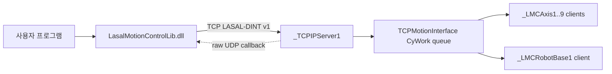

# LasalMotionControlLib 내부 개발 설명서

작성 기준: 2026-07-15

적용 버전: `0.9.1-preview`

대상 독자: API, LASAL 어댑터, 배포 패키지를 유지보수하는 개발자

## 1. 디렉터리와 책임

| 경로 | 책임 | 외부 배포 |
|---|---|---|
| `LMC_API_Delivery/src` | C# API의 유일한 소스 | 소스는 배포하지 않음 |
| `LMC_API_Delivery/tests` | request golden, parser, fake RPC, LASAL 정적 계약 | 배포하지 않음 |
| `LMC_API_Delivery/docs` | 설계 결정과 구현 이력 | 내부용 |
| `LasalApiWpfTestApp` | API 개발/실기 진단용 ProjectReference 예제 | 그대로 배포하지 않음 |
| `LMC_API_Distribution` | `01_API`, `02_Example_Program`, `03_API_User_Manual` | 배포 기준 |
| `LMC_API/Elmo_API_Packet2` | 캡처에서 추출한 명령 근거 | 배포하지 않음 |
| `LMC_API/LMC_API` | 0.9.0 legacy snapshot | 사용 및 배포 금지 |
| `Lasal_PRG/Elmo_EtherCAT_Test_4Axis` | PLC TCP/RPC 어댑터와 motion object wiring | 별도 PLC 산출물 |

개발 소스, 개발 예제와 배포 폴더를 섞지 않는다. 특히 배포 예제가
`LMC_API_Delivery/src/LasalMotionControlLib.csproj`를 참조하면 저장소 밖에서
빌드할 수 없으므로 결함으로 취급한다.

## 2. 시스템 구조



- PC DLL은 이미 변환된 DINT를 little-endian으로 직렬화한다.
- LASAL `TCPMotionInterface`는 TCP 수신/파싱/dispatch를 non-RT `CyWork()`에서
  수행한다. interface 전용 RT Task와 `RtWork()` mailbox를 사용하지 않는다.
- 단축 object name은 PLC registry에서 찾아 opaque descriptor `1..9`로 바꾼다.
- 현재 group descriptor는 `0x0100`이며 Cartesian 구성은 X/Y/Z/U 4축이다.
- TCP exchange는 연결당 한 건씩 직렬화한다. 여러 스레드가 호출해도 wire에
  동시에 두 request를 outstanding 상태로 만들지 않는다.

## 3. 공개 객체 모델

### 3.1 `LMCConnection`

연결, RPC 초기화, callback listener, request 직렬화와 session generation을
소유한다.

- `RpcInitConnection` / `RpcInitConnectionAsync`
- `CloseConnection` / `CloseConnectionAsync`
- `ConnectionStateChanged`
- `CallbackReceived`: raw UDP payload만 제공
- `CallbackListenerError`

기본 timeout은 connect/send/receive 각 3000 ms, callback thread join 500 ms다.
callback source-address 검증은 기본 활성이다. `CloseConnection`과 `Dispose`는
motion Stop을 전송하지 않는다.

### 3.2 `LMCSingleAxis`

권장 생성법은 `CreateAsync(connection, objectName, token)`이다. 생성 시
`0x103C` name lookup과 `0x202B` AxisInfo를 수행한다. `LMCAxis`는 호환 alias다.

- Power: `PowerOn`, `PowerOff`
- State: `Reset`, `Stop`, `ReadStatusResult`, `GetActualPositionResult`
- Motion: `MoveAbsoluteEx`, `MoveRelativeEx`, `MoveVelocityEx`
- 모든 command에 대응하는 async overload 제공

typed status는 `IsPowerOn`, `IsReferenced`, `IsStandstill`, `AxisErrorId`와
`StatusWord`를 제공한다. home 동작 명령 자체는 API 범위가 아니며
`IsReferenced`로 완료 상태만 확인한다.

### 3.3 `LMCGroupAxis`

권장 생성법은 `CreateAsync`이며 `LMCGroup`은 호환 alias다.

- `GetGroupMembersInfoResult`
- `GroupPowerOn`, `GroupPowerOff`
- `GroupEnable`, `GroupDisable`
- `GroupReset`, `GroupStop`
- `GroupReadStatusResult`, `GroupReadActualPosition`
- `SetKinTransformCartesian4Axis`
- `MoveLinearAbsoluteEx`

`GroupPowerOn/Off`는 servo power mode-change 요청이다. ACK는 최종 완료가 아니다.
`GroupEnable`은 `LockProfile`, `GroupDisable`은 `UnlockProfile`이며 power와
다른 상태다.

## 4. Wire protocol

### 4.1 기본 frame

모든 정수는 little-endian이다. 기본 header는 8 bytes다.

Request:

| Offset | 크기 | 의미 |
|---:|---:|---|
| 0 | 2 | Command ID |
| 2 | 2 | reserved |
| 4 | 2 | payload length |
| 6 | 2 | object reference/descriptor |

Response:

| Offset | 크기 | 의미 |
|---:|---:|---|
| 0 | 2 | header status |
| 2 | 2 | payload length |
| 4 | 4 | reserved |

payload 세부 offset은 `LmcProtocol.cs`, LASAL parser와
`LMC_API_Delivery/docs/DINT_PACKET_MAP.txt` 세 파일을 항상 함께 변경한다.

### 4.2 현재 command matrix

| 구분 | ID | 기능 |
|---|---:|---|
| Session | `0x8080` | RPC session init |
| Session | `0x405C` | callback registration |
| Session | `0x405D` | close |
| Lookup | `0x103C` | axis by object name |
| Lookup | `0x1042` | group by object name |
| Lookup | `0x202B` | AxisInfo/lookup acknowledgement |
| Axis | `0x2023` | Power On/Off |
| Axis | `0x2024` | Reset |
| Axis | `0x2022` | Stop |
| Axis | `0x2028` | Read Status |
| Axis | `0x202E` | Read Position |
| Axis | `0x209F` | Move Absolute |
| Axis | `0x20A0` | Move Relative |
| Axis | `0x20A2` | Move Velocity |
| Group | `0x20D2` | Get Members |
| Group | `0x2045` | Read Status |
| Group | `0x2047` | Enable/LockProfile |
| Group | `0x2048` | Disable/UnlockProfile |
| Group | `0x2049` | Reset |
| Group | `0x204A` | Power On, project-local extension |
| Group | `0x204B` | Power Off, project-local extension |
| Group | `0x2085` | Stop |
| Group | `0x2051` | Read Position, DINT v1 response only |
| Group | `0x20A4` | Move Linear Absolute |
| Group | `0x20E7` | Set Cartesian 4-axis identity transform |

현재 request/public/source-active path는 25개다. 그중 lifecycle과 name/member
metadata handler를 제외한 CyWork axis/group control·read·motion command는
18개다. lookup과 `0x20D2`도 client metadata를 읽으므로 18을 전체 client-call
수로 해석하면 안 된다. 이 숫자는 PLC E2E 완료 수도 아니다. 실제 PLC
E2E/재캡처 완료는 현재 0/25다.

## 5. 연결, callback과 session lifetime

정상 초기화 순서는 다음과 같다.

1. callback UDP socket을 PC local IPv4/port에 bind한다.
2. TCP에 연결한다.
3. `0x8080` RPC init을 보낸다.
4. `0x405C`에 callback endpoint와 event mask를 등록한다.
5. 상태를 `Connected`로 바꾼다.

name lookup으로 만든 axis/group object에는 생성 당시 connection generation이
저장된다. reconnect 후 이전 handle은 stale이므로 폐기하고 다시 생성해야 한다.

callback은 payload schema가 캡처되지 않아 `LMCCallbackEventArgs.Payload`로
raw datagram만 제공한다. typed event, motion completed event 또는 callback을
근거로 한 자동 상태 전이는 추가하지 않는다.

timeout, send/receive 오류 또는 in-flight cancellation은 response 정렬을
보장할 수 없으므로 transport를 `Faulted`로 폐기한다. cancellation은 Stop이
아니며, 명령이 PLC에 적용됐는지 불명확할 수 있다.

## 6. 응답 판정

`LMC_Response.IsSuccess`만 보고 motion 완료로 판단하지 않는다.

- `IsFrameValid`: header/payload 길이와 command별 shape 검증
- `HeaderStatus`: transport/RPC envelope 상태
- `CommandStatus`: command 결과 또는 function-status bit field
- `ErrorId`: signed LASAL adapter/MotionLib 오류
- typed result `IsSuccess`: command별 function/error 필드까지 포함

읽기에는 scalar 호환 overload보다 typed async API를 기본으로 사용한다.
scalar overload는 실패 시 예외 또는 값/응답 분리를 요구해 진단 정보가 줄어든다.

negative adapter 오류와 positive MotionLib 오류를 구분한다. 동일 숫자를 모든
command에 공통 해석하지 않는다. malformed frame은 값 `0` 성공으로 바꾸지 않는다.

## 7. 단위 계약

DLL은 자동 단위 변환을 하지 않는다.

```text
송신 DINT = 물리값 x PLC application UNIT
표시 물리값 = 수신 DINT / 동일 UNIT
Jerk DINT = (물리 jerk / 1000) x 축 application UNIT
```

`LMC_Units`는 caller helper 상수다. 현재 Git의 `_LMCAxis1..9`는
`IntUnits=1 mm` macro, 즉 10000 DINT로 저장돼 있다. `ExUnits=8388608`은
encoder/transmission ratio이며 PC 입력에 곱하지 않는다. 실제 다운로드 PLC의
값이 Git과 다르면 사용 프로그램의 UNIT과 안전 한계를 그 PLC에 맞춰야 한다.

모든 conversion은 `checked`와 명시적 반올림을 사용한다. UI의 raw DINT 모드는
이미 변환된 정수만 허용한다.

## 8. 단축 제약

- object name은 printable ASCII 1~79 bytes다.
- 현재 LASAL dispatcher는 `_LMCAxis1..9`를 지원한다.
- Absolute/Relative direction은 현재 `Shortest`만 승인됐다.
- Relative direction은 signed distance로 결정한다.
- Velocity direction은 Positive/Negative만 사용한다.
- MoveVelocity의 deceleration은 wire 계약상 0이며 감속 정지는 `Stop`으로 한다.
- ACK 뒤 `ReadStatusResult`와 `GetActualPositionResult`로 실제 상태를 확인한다.

## 9. Group 제약과 권장 순서

현재 Cartesian group은 X/Y/Z/U 4축 static identity mapping이다. 5~9축은
single-axis dispatcher에만 포함되고 group transform/motion에는 포함되지 않는다.

단, current `GroupReadActualPosition` handler는 `_LMCPROF_POS`의 Pos1..Pos9를
DINT[16] response slot 1..9에 복사한다. 기존 4축-only read 문서와 충돌하므로
PLC 재캡처 뒤 4축 read로 제한할지 9축 readback을 공개할지 확정해야 한다.
이 readback 문제는 SetKin/Lock/Move의 4축 제한을 9축으로 넓히지 않는다.

승인 옵션:

- Coordinate: `None`
- Transition: `ExactStop`, `ContinuousDirect`
- Buffer: `Aborting`, `Buffered`
- Position array: 1~4만 X/Y/Z/U, 5~16은 0

public enum에는 다른 값도 선언돼 있지만 현재 PLC adapter가 지원하지 않는다.
`MoveCircle`, generic/dynamic kinematics는 공개 계약에 없다.

권장 순서:

1. group 및 X/Y/Z/U axis handle 생성
2. `GetGroupMembersInfoResult`
3. `GroupPowerOn`
4. `GroupReadStatusResult.IsPowerOn` poll
5. 네 축 `ReadStatusResult.IsReferenced` 확인
6. `SetKinTransformCartesian4Axis`
7. `GroupEnable` 후 `IsStandby/IsEnabled` poll
8. `MoveLinearAbsoluteEx`
9. status/position으로 완료 확인
10. 필요 시 `GroupStop`
11. `GroupDisable` 후 `IsDisabled` 확인
12. `GroupPowerOff` 후 `IsPowerOn == false` 확인

## 10. LASAL execution rule

`TCPMotionInterface` 변경 시 다음을 유지한다.

- TCP parsing, string/name lookup, queue dispatch와 TCP I/O를 RT Task에서 실행하지
  않는다.
- `Response()`는 최대 frame을 accumulator에서 조립하고 완전한 request만 queue에
  넣는다.
- depth-8 queue overflow, malformed payload, invalid descriptor를 명시적으로
  실패시킨다.
- single-axis client 1~9 wiring과 registry/name table을 같이 변경한다.
- group client와 4축 static identity 범위를 임의로 9축 group으로 확장하지 않는다.
- `.st`/network 변경 후 LASAL IDE Rebuild, Find in Implementation smoke와
  `%TEMP%\Lasal2.log`의 신규 `CInvalidArgException`을 확인한다.

## 11. 변경 절차

### C# request/response 변경

1. packet 근거와 command ID를 문서화한다.
2. `LmcProtocol.cs` builder/parser를 변경한다.
3. public API는 실제 기능당 하나만 추가한다.
4. golden request, malformed response, fake RPC integration test를 추가한다.
5. `DINT_PACKET_MAP.txt`와 LASAL parser offset을 대조한다.
6. 개발 예제와 배포 예제를 모두 빌드한다.

### LASAL command 변경

1. `TCPMotionInterface.st`의 validation, queue, response를 함께 변경한다.
2. client/object/network 연결도를 확인한다.
3. PC request byte offset과 exact response shape를 대조한다.
4. source-only와 full-network static contract를 실행한다.
5. IDE Rebuild/Link, PLC smoke, pcap 재캡처 결과를 정적 테스트와 별도로 기록한다.

### 공개 API 변경

breaking change면 assembly minor version을 올린다. 같은 AssemblyVersion으로
서로 다른 public surface를 배포하지 않는다. preview patch라도 FileVersion과
InformationalVersion을 올리고 Distribution 밖의 승인 기록과 내부
`BUILD_METADATA_YYYY-MM-DD.md` hash snapshot을 새로 만든다. current Distribution
안에는 manifest/metadata 파일을 넣지 않는다. API DLL project는 deterministic
build를 유지해 동일 source/toolchain의 반복 빌드 hash가 흔들리지 않게 한다.

## 12. 빌드와 검증

VS2019 full MSBuild를 사용한다. classic WPF는 .NET Framework 4.8 Developer
Pack과 WPF targets가 필요하다.

```powershell
$msbuild = 'C:\Program Files (x86)\Microsoft Visual Studio\2019\Professional\MSBuild\Current\Bin\MSBuild.exe'

& $msbuild LMC_Library\LMC_API_Delivery\src\LasalMotionControlLib.csproj `
  /t:Rebuild /p:Configuration=Release /nologo

& $msbuild LMC_Library\LMC_API_Delivery\tests\LasalMotionControlLib.Tests\LasalMotionControlLib.Tests.csproj `
  /t:RunTests /p:Configuration=Release /nologo

& $msbuild LMC_Library\LMC_API_Delivery\tests\LasalMotionControlLib.Tests\LasalMotionControlLib.Tests.csproj `
  /t:RunLasalNetworkContract /p:Configuration=Release /nologo
```

`RunTests`는 PC 46 cases, LASAL source-only contract, 개발 예제와 배포 예제
빌드를 포함한다. 숫자는 테스트가 추가되면 함께 갱신한다.

## 13. 배포 생성

내부 script `Build-LmcApiDistribution.ps1`를 사용한다. 핵심 gate는 다음과 같다.

1. API Release rebuild
2. canonical DLL을 `LMC_API_Distribution/01_API`에 복사
3. 배포 예제 clean Release rebuild
4. 예제 runtime DLL과 canonical DLL SHA-256 동일성 확인
5. PC tests와 LASAL full-network static contract
6. 사용자 편집 DOCX/PDF 존재, 페이지/구조와 canonical 파일명 확인
7. DLL assembly/file/product version, 크기와 SHA-256 확인
8. 배포 폴더를 저장소 밖 임시 경로에 복사해 Debug/Release 독립 빌드
9. `ProjectReference`, absolute repo path, internal source path가 없는지 검색

사용자 매뉴얼은 `LMC_API_Distribution/03_API_User_Manual`의 DOCX가 편집 원본이고
동일 폴더 PDF가 배포본이다. 내부 Markdown/Python 생성기는 최초 초안용이며 이
script는 사용자가 수정한 문서를 재생성하거나 덮어쓰지 않는다.

배포 DLL은 strong-name/AuthentiCode 서명이 없다. 서명이 필요한 고객에게는
별도 승인된 signing pipeline을 적용하고 새 hash를 발급한다.

## 14. 현재 미완료 및 release gate

- current group/9-axis source의 LASAL IDE Rebuild/Link: 미검증
- Find in Implementation smoke: 미검증
- CyWork와 motion RT thread core/priority/jitter: 미검증
- 실제 PLC command E2E와 Wireshark 재캡처: 0/25
- `GroupReadActualPosition` slot 5..9 공개 계약: 미결정
- typed callback schema: 없음
- 다중 PC motion-owner arbitration: 없음
- Home 실행 API: 없음, `IsReferenced` 확인만 가능
- MoveCircle 및 generic kinematics: 없음

따라서 `0.9.1-preview`는 개발/통합 시험용이다. production 승인 전에 위 항목 중
적용 장비에 필요한 gate를 시험 기록과 함께 닫아야 한다.
