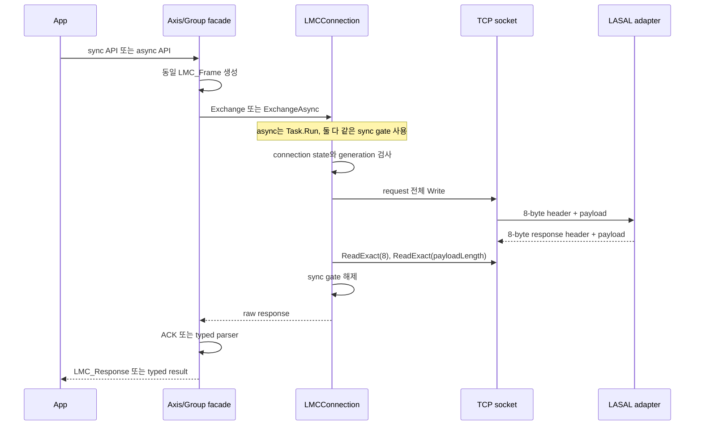
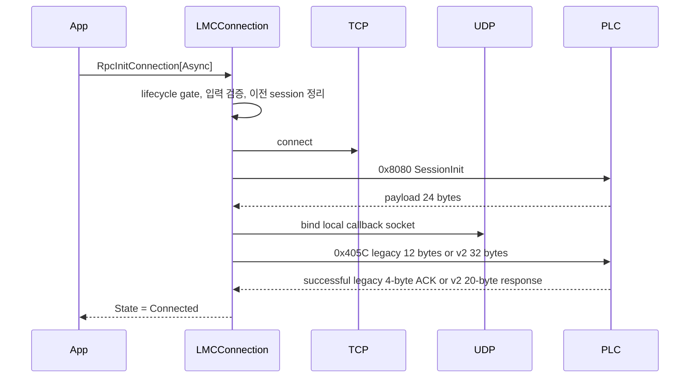
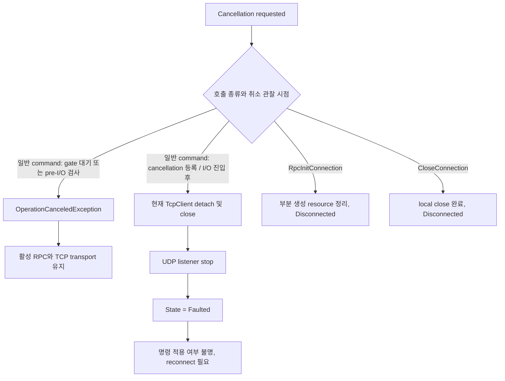
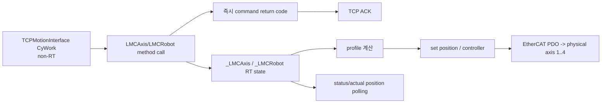

# LasalMotionControlLib 내부 코드 및 실행 구조 설명서

- 문서 버전: `2.7`
- 작성 기준: `2026-08-11` / executable gate `cbf2548`, verifier compatibility
  `ad4af91`, reconnect policy `14ccf58`
- 적용 API: `LasalMotionControlLib 0.9.1-preview`
- motion baseline branch/commit: `main` / `f9bc88a7f78dab5214186689198414fa9a203a32`
- diagnostics/admin/release/reconnect 기준: 2026-08-11 current source
- 대상 독자: C# API, LASAL TCP adapter, MotionLib 연결과 배포 패키지를 유지보수하는 개발자

이 문서는 공개 API의 signature와 인자를 다시 나열하는 문서가 아니다. 사용자 코드에서
호출한 API가 C# facade, TCP frame, LASAL request queue, `_LMCAxis` 또는
`_LMCRobotBase` 호출과 response parser를 거쳐 결과로 돌아오는 실제 구현 경로를
설명한다.

검토 대상인 Distribution DOCX
`LMC_Library/LMC_API_Distribution/03_API_User_Manual/LASAL_Motion_Control_API_User_Manual_KO.docx`
와 PDF의 표지 버전은 `1.9`지만 current source와 같은 내용이 아니다. 두 artifact는 Axis1
SDO Write와 stale recovery retirement가 들어가기 전 gate-off Distribution snapshot이다.
각 기능에서 sync/async signature를 함께 보여 주지만 두 메서드가 내부적으로 같은
transport와 command를 공유한다는 사실은 설명하지 않는다.
현재 내부 사용자 매뉴얼 원본은 [API_USER_MANUAL_KO.md](API_USER_MANUAL_KO.md) 문서
버전 `2.3-candidate`다. 이 문서는 그 사용자 매뉴얼을 대체하지 않고 구현 이해와 유지보수를 보완한다.

> **상태 경고:** `0.9.1-preview`는 production 승인본이 아니다. 2026-08-11 current
> `cbf2548`은 PC 자동 시험 Debug/Release direct runner 각각 1133/1133, WPF
> Debug/Release Rebuild PASS, 기존 full smoke 339/339과 reconnect targeted 6/6을 통과했다.
> 별도 actual-EXE relaunch gate도 Debug/Release 각각 1/1 PASS했지만 PC loopback 증거이며
> 실제 PLC cleanup/disarm/readiness나 사용자 PLC 재접속 완료 증거가 아니다.
> 2026-07-31 LASAL checkpoint는 `ExpectedSdoWriteAxis=1`의
> `IntegratedReadOwnerDormant` SourceOnly/full 정적 계약, fresh IDE Rebuild/Link
> `0 errors / 20 warnings`와 3-class implementation smoke를 통과했다.
> `Classes.lcb`의 general `TryStartRead`와 SDO executor declaration도 현재 source와 동기화되어 있다.
> legacy `0x13F` PLC capture의 `0x1000:0` UInt32 4-byte SDO Read는 BootId 5에서 축 1~4
> 모두 Completed/Success를 반환했다. 과거 BootId 6의 `0x213F` 캡처에서는 executor
> 재사용 결함으로 Submit이 `ResourceBusy(9)`로 거부됐고, callback/rollback/release 상태
> 전이를 수정했다. 이후 사용자가 general-inline 1/2/4-byte runtime 정상 동작을 확인했다.
> 최종 확인에 대한 신규 pcap/log와 D5 fault matrix는 없고, motion command의 실제 PLC
> E2E는 여전히 `0/25`이며 diagnostics D1~D4도 미실시다.
> D4 Double, PI Write와 extended SDO result는 capability-off다. SDO Write는 Axis 1의 exact
> `0x2F00:24 Int32/4` target만 source-active이고 Axis 2..4와 비승인 target은 fail-closed다.
> current PLC download와 live Motion/Power/SDO Write 증거는 아직 없다.
> EtherCAT topology read-owner는 464-byte coherent snapshot과 `0x7E13/0x7E22` route/handler까지
> source/static/IDE build가 완료됐지만 capability bits 15~17은 OFF다. `0x7E23`은 없으며
> current PLC raw read, disconnect/recovery와 physical DI correlation은 아직 검증하지 않았다.
> Phase 1 read-only Admin `0x7D00/0x7D10/0x7D20`, typed drive read, PI/Bulk facade,
> PC-local error catalog와 Phase 2 `0x7D22 GroupMoveLinearRelative`는 source와
> 자동/정적 시험까지 구현했고 current LASAL IDE Rebuild/Link도 PASS했다. PLC download와
> 실물 값/UNIT/relative-motion 검증은 아직 수행하지 않았다.
> 아래 설명에서 `구현됨`은 current source에 경로가 존재한다는 뜻이며 실기 완료를 뜻하지 않는다.

## 1. 먼저 바로잡아야 할 핵심 오해

| 오해 | 실제 구현 |
|---|---|
| sync API와 async API가 서로 다른 PLC 기능이다 | 같은 command ID, 같은 payload builder, 같은 parser를 사용한다. |
| async API는 비동기 socket I/O 또는 PLC-side async command다 | blocking `ExchangeCore()`를 `Task.Run`으로 실행하는 caller-thread 비차단 wrapper다. |
| 여러 async API를 동시에 호출하면 TCP request도 병렬 처리된다 | connection의 단일 `sync` gate 때문에 request/response가 한 건씩 직렬 처리된다. |
| response를 request ID로 매칭한다 | request ID와 pending-response map이 없다. gate를 잡은 호출이 바로 다음 response를 직접 읽는다. |
| `LMC_Response.IsSuccess == true`면 이동 또는 Power 전이가 완료됐다 | 대부분의 ACK는 명령 접수 또는 MotionLib method의 즉시 반환 결과다. 완료는 status/position polling으로 확인한다. |
| callback 등록이 있으므로 motion-complete event까지 실기 검증됐다 | legacy raw listener와 opt-in version-2 typed wake 수신, Gate D one-attempt sender/broker candidate까지 구현됐다. typed wake는 D5 terminal 가능성을 알리는 non-authoritative hint이며 live 52-byte UDP와 causal TCP `0x7E03` capture는 아직 없다. |
| cancellation, timeout, `CloseConnection`, `Dispose`가 축을 정지시킨다 | motion Stop을 보내지 않는다. in-flight cancellation은 TCP transport를 폐기할 수 있다. |

가장 중요한 한 문장으로 요약하면 다음과 같다.

> **sync/async는 호출자 대기 방식의 차이일 뿐이며, 내부 wire와 PLC 실행 경로는 같다.**

## 2. System of Record와 디렉터리 책임

| 경로 | 책임 | 판정 |
|---|---|---|
| `LMC_Library/LMC_API_Delivery/src` | C# API의 canonical source | 구현 판단 우선 |
| `LMC_Library/LMC_API_Delivery/tests` | request golden, parser, fake RPC, LASAL 정적 계약 | 회귀 기준 |
| `LMC_Library/LMC_API_Delivery/docs/DINT_PACKET_MAP.txt` | command별 byte 계약 | source와 함께 변경 |
| `LMC_Library/LasalApiWpfTestApp` | canonical API source를 직접 참조하는 개발/실기 앱 | 내부 기준 앱 |
| `LMC_Library/LMC_API_Distribution` | 외부 DLL, binary-reference 예제, 사용자 DOCX/PDF | 배포 기준 |
| `Lasal_PRG/Elmo_EtherCAT_Test_4Axis` | canonical PLC TCP/RPC adapter와 motion network | LASAL 수정 기준 |
| `Codex_PMAS_WPF` | Elmo MMCLib 기능 비교 기준 | LASAL wire 구현 아님 |
| `Codex_LASAL_WPF` | 실제 TCP와 simulation/no-op이 섞인 legacy hybrid | 신규 구현 근거로 사용 금지 |
| `LMC_Library/LMC_API/LMC_API` | `0.9.0-pc-api` 보관본 | 개발/배포 사용 금지 |

현재 상태와 과거 문서가 충돌하면 current source,
[DINT_PACKET_MAP.txt](../LMC_API_Delivery/docs/DINT_PACKET_MAP.txt),
[현재 아키텍처 및 릴리스 상태](../../docs/architecture/ELMO_MASTER_CURRENT_ARCHITECTURE_AND_RELEASE_STATUS_2026-07-16.md)
순서로 판단한다.

## 3. 전체 실행 구조

```mermaid
flowchart LR
    APP["사용자 프로그램 / WPF"] --> FACADE["LMCSingleAxis / LMCGroupAxis\nDiagnostics / Admin"]
    FACADE --> FRAME["LMC_Frame serializer"]
    FRAME --> CONN["LMCConnection\n단일 exchange gate"]
    CONN -->|"TCP LASAL-DINT v1"| SERVER["_TCPIPServer1 : 4000"]
    SERVER --> RESP["Response()\ningress only"]
    RESP --> QUEUE["request queue\ndepth 8"]
    QUEUE --> CY["TCPMotionInterface.CyWork()"]
    CY --> PARSER["MsgPaser()"]
    PARSER --> AXIS["_LMCAxis1..9 Control"]
    PARSER --> ROBOT["_LMCRobotBase1 Control"]
    AXIS --> RT["1 ms motion realtime/profile"]
    ROBOT --> RT
    RT --> PDO["physical axis 1..4 / EtherCAT PDO"]
    PARSER -->|"direct response"| SERVER
    SERVER --> CONN
    CONN --> RESULT["ACK / typed result parser"]
    SERVER -. "UDP endpoint 등록만" .-> CONN
```



실행 책임은 다음 네 층으로 나뉜다.

| 층 | 책임 | 하지 않는 일 |
|---|---|---|
| 사용자/WPF | UNIT 변환, 안전 gate, 상태 polling, UI thread marshal | wire byte 직접 조립 |
| C# DLL | 입력 검증, frame 생성, TCP lifecycle, response 파싱 | 자동 UNIT 변환, motion 완료 대기 |
| LASAL TCP adapter | session/descriptor/payload 검증, queue, MotionLib method 호출 | EtherCAT RT profile 계산 자체 |
| MotionLib/drive | profile 실행, 상태 전이, physical EtherCAT output | PC RPC concurrency 관리 |

## 4. sync/async API의 실제 내부 동작

### 4.1 공통 호출 파이프라인

Axis와 Group의 public method는 다음 형태로 수렴한다.

```text
public API
  -> LMC_Frame request builder
  -> LMCConnection.Exchange 또는 ExchangeAsync
  -> ExchangeCore
  -> TCP Write
  -> response header 8 bytes ReadExact
  -> declared payload ReadExact
  -> ACK 또는 typed result parser
```

- sync API는 호출한 thread에서 `ExchangeCore()`가 끝날 때까지 block한다.
- async API는 `Task.Run(() => ExchangeCore(...))`로 worker thread에서 같은 blocking
  작업을 수행한다.
- Axis/Group async facade는 같은 `LMC_Frame` builder와 parser를 사용하고
  `ConfigureAwait(false)`로 library 내부 continuation을 실행한다.
- async 전용 command ID, async response, PLC completion event는 없다.

근거:

- `LmcConnection.cs:157-203` - connection init/close async wrapper
- `LmcConnection.cs:390-470` - 공통 `ExchangeCore`와 `Task.Run`
- `LmcAxis.cs:437-455` - Axis 공통 send/send-async
- `LmcGroup.cs:459-499` - Group 공통 send/send-async



### 4.2 연결당 한 건만 in-flight

`LMCConnection`에는 request ID, correlation ID, `TaskCompletionSource` map 또는 상시
TCP reader loop가 없다. `sync` monitor가 request 송신부터 response 전체 수신까지
보호한다. header의 `Reference`는 Axis/Group descriptor이며 request ID가 아니다.
`HeaderReserved`도 보존만 하며 correlation에 사용하지 않는다.

따라서 다음 호출은 worker thread 수와 관계없이 wire에서 순차 처리된다.

```csharp
await Task.WhenAll(
    axis1.GetActualPositionResultAsync(token),
    axis2.GetActualPositionResultAsync(token),
    group.GroupReadStatusResultAsync(token));
```

위 코드는 세 작업을 논리적으로 동시에 시작하지만 한 `LMCConnection`에서는 최대 한
RPC만 송수신된다. 현재 PC API는 PLC의 depth-8 queue를 burst pipeline으로 사용하지 않는다.

### 4.3 sync와 async의 선택 기준

| 상황 | 권장 |
|---|---|
| UI thread에서 호출 | async API 사용 |
| background worker에서 짧은 진단 호출 | sync 또는 async 모두 가능 |
| 높은 throughput을 위한 병렬 RPC | 현재 API로 불가능, protocol redesign 필요 |
| 명령 완료 대기 | async 여부와 무관하게 typed status/position polling 필요 |
| 취소 가능한 사용자 동작 | async + token을 쓸 수 있으나 취소를 Stop으로 취급하면 안 됨 |

`ReadStatus()`와 `GetActualPosition()` 같은 scalar compatibility helper는 sync 전용이다.
async에서는 `ReadStatusResultAsync()`와 `GetActualPositionResultAsync()`처럼 diagnostic
field를 보존하는 typed API를 사용한다.

## 5. Connection lifecycle과 session generation

### 5.1 초기화 순서

실제 `RpcInitConnection[Async]` 순서는 다음과 같다.

1. address, port, timeout과 callback 인자를 검증한다.
2. `lifecycleSync` gate를 획득한다.
3. 이전 connection이 있으면 local resource를 정리한다.
4. 지정한 local IPv4에 ephemeral TCP endpoint를 만들고 PLC에 연결한다.
5. `0x8080` session-init을 보내고 정확한 24-byte payload를 검증한다.
6. local UDP callback listener를 bind한다.
7. 실제 bind된 UDP port, event mask, local IPv4로 `0x405C`를 보낸다. 기본
   `LegacyRaw`는 12-byte request를, 명시적 `Version2WakeHint`는 32-byte request를 사용한다.
8. legacy의 정확한 4-byte ACK 또는 version 2의 정확한 20-byte response가 성공해야
   `Connected`로 전이한다. callback registration 실패는 terminal이며 WPF outer retry 대상이 아니다.



기본 option은 다음과 같다.

| Option | 기본값 | 적용 방식 |
|---|---:|---|
| Connect timeout | 3000 ms | `BeginConnect` + wait timeout |
| Send timeout | 3000 ms | synchronous `NetworkStream.Write` 기반 |
| Receive timeout | 3000 ms | synchronous `NetworkStream.Read` 기반 |
| Callback thread join | 500 ms | listener 종료 시 background thread join |
| Callback source validation | `true` | controller IPv4가 다르면 datagram 폐기 |
| Callback registration mode | `LegacyRaw` | 명시적 `Version2WakeHint`에서만 32/20 typed 계약 사용 |
| Callback requested max datagram | 512 bytes | version 2 요청값, 허용 범위 `52..512` |

### 5.2 상태와 fault

| State | 의미 |
|---|---|
| `Disconnected` | local TCP/UDP resource가 닫힘 |
| `Connecting` | TCP와 RPC/callback 초기화 진행 중 |
| `Connected` | command exchange 허용 |
| `Closing` | close ACK와 local cleanup 진행 중 |
| `Faulted` | timeout, transport 오류 또는 in-flight cancellation로 stream 신뢰 상실 |

일반적이거나 무제한인 자동 retry/reconnect는 없다. SDK가 자동으로 수행하는 예외는
명시적 version 2의 exact canonical `-1` session-init failure를 같은 TCP socket에서
20 ms 뒤 한 번 재시도하는 것뿐이며, SDK 자체는 새 TCP를 만들지 않는다. 개발 WPF만 초기
또는 동일 프로세스 내 후속 Connect의 첫 candidate에서 두 exact `-1`과 RPC/callback
미시작 증거가 모두 맞을 때 100 ms 뒤 fresh TCP를 정확히 한 번 더 연다. 그 밖의
`Faulted` 상태에서는 애플리케이션이 명시적으로 새 연결을 시작해야 한다.

### 5.3 Axis/Group handle과 generation

새 `TcpClient`를 만들 때 local `sessionGeneration`이 증가한다. Axis와 Group 객체는
생성 당시 generation과 lookup descriptor를 저장한다. 각 호출 전과 exchange gate 안에서
현재 generation인지 확인하므로 reconnect 후 예전 객체는 `InvalidOperationException`으로
거부된다.

```text
Connection A generation 10
  -> axis handle(reference 1, generation 10)
  -> disconnect/reconnect
Connection A generation 11
  -> old axis handle 사용: 거부
  -> CreateAsync로 새 handle 생성: 정상
```

descriptor는 PLC pointer가 아니다. current deployment의 opaque local 값은 Axis `1..9`,
Group `0x0100`이며 session 밖에서 영속 identifier로 저장하면 안 된다.

### 5.4 cancellation의 실제 의미



- gate 대기 중 또는 gate 획득 직후의 pre-I/O token 검사에서 취소를 관찰하면 다른 active
  request와 현재 transport를 건드리지 않는다.
- 일반 command가 pre-I/O 검사를 지나 cancellation callback 등록과 transport I/O에 진입한
  뒤 취소되면 command bytes가 이미 전송됐을 수 있다. 이때 command 적용 여부와 TCP
  stream 위치를 확정할 수 없으므로 transport를 폐기하고 `Faulted`로 전환한다.
- `RpcInitConnection[Async]` 취소는 부분 생성 resource를 정리하고 `Disconnected`로 끝난다.
- `CloseConnection[Async]` 취소도 local close를 완료하고 `Disconnected`로 끝난다.
- cancellation token은 motion Stop token이 아니다.

`CloseConnection()`은 `0x405D` ACK를 시도한 뒤 local TCP/UDP를 닫는다. ACK가 실패해도
local resource는 정리된다. `Dispose()`는 close 오류를 외부로 다시 던지지 않는다.
어느 경로도 Axis/Group Stop을 자동 전송하지 않는다.

## 6. Axis와 Group 객체 생성

### 6.1 Axis 생성

`new LMCSingleAxis(connection, name)` 또는 `CreateAsync()`는 단순 local object 생성이 아니다.

1. printable ASCII 1..79-byte name을 `0x103C` 80-byte payload로 전송한다.
2. PLC가 실제 연결 object의 `_GetObjName()`과 대소문자를 무시해 비교한다.
3. 성공하면 6-byte lookup response의 offset 4에서 nonzero descriptor를 읽는다.
4. descriptor로 `0x202B AxisInfo`를 추가 전송한다.
5. 8-byte ACK의 frame, command status와 exact shape를 검증한다.
6. descriptor와 session generation을 handle에 저장한다.

sync constructor와 async factory는 동일한 두 RPC를 순서대로 수행한다. async factory가
두 요청을 동시에 보내는 것은 아니다.

### 6.2 Group 생성

Group은 `0x1042` name lookup 한 번으로 current descriptor `0x0100`을 얻는다.
current PLC에는 한 `LMCRobot` registry 대상만 있다. Group handle도 session generation을
저장한다.

`GetGroupMembersInfoResult[Async]`는 별도 `0x20D2` command다. response는 16개 reference,
16개 device ID, 16개의 80-byte name slot, function status/error와 axis count로 구성된다.
현재 PLC 성공 조건은 Axis 1..9와 Robot client가 모두 연결된 상태다.

## 7. Wire protocol과 response correlation

### 7.1 request header

모든 integer와 DINT는 little-endian이다. `SetKinTransformCartesian4Axis()`의 matrix/node
값은 IEEE-754 64-bit `DOUBLE`을 little-endian으로 직렬화한다.

| Offset | 크기 | 의미 |
|---:|---:|---|
| 0 | 2 | Command ID |
| 2 | 2 | Reserved, 현재 0 |
| 4 | 2 | Payload length |
| 6 | 2 | object descriptor/reference |
| 8 | N | command payload |

### 7.2 response header

| Offset | 크기 | 의미 |
|---:|---:|---|
| 0 | 2 | Header status |
| 2 | 2 | Payload length |
| 4 | 4 | Reserved |
| 8 | N | response payload |

C#은 response header 8 bytes를 먼저 `ReadExact()`하고 offset 2의 `UInt16` 길이만큼
payload를 다시 `ReadExact()`한다. raw 크기가 정확히 `8 + PayloadLength`일 때만
`IsFrameValid`가 된다.

현재 protocol에는 magic, version, request ID, command echo와 CRC가 없다. 순서가 어긋난
stream을 재동기화할 방법도 없다. 그래서 timeout, EOF, partial send와 in-flight
cancellation 뒤에는 transport 재사용을 금지한다.

### 7.3 response shape

| shape | payload | 사용 |
|---|---:|---|
| short ACK/error | 4 bytes | `Status UINT16 + ErrorId INT16` |
| long ACK | 8 bytes | opaque/reference DINT + status/error |
| Axis status | 12 bytes | state + function status/error + axis error + reserved status word |
| Axis position | 8 bytes | DINT position + function status/error |
| Group status | 12 bytes | state + function status/error + group error + padding |
| Group position | 68 bytes | DINT[16] + function status/error |
| Group members | 1350 bytes | 16-member metadata + function status/error/count |

typed response parser는 정상 command별 고정 길이 또는 4-byte short error만 허용한다.
정상 status/position payload가 없는 4-byte success response는 성공값으로 만들지 않고
`InvalidDataException`으로 거부한다.

## 8. C# API 내부 계층

### 8.1 파일별 책임

| 파일 | 책임 |
|---|---|
| `LmcProtocol.cs` | command ID, request builder, little-endian read/write, wire-level validation |
| `LmcConnection.cs` | lifecycle, exchange serialization, exact read, response parser, callback thread |
| `LmcAxis.cs` | Axis facade, lookup/AxisInfo, request 선택, typed/scalar 결과 |
| `LmcGroup.cs` | Group facade, lookup, kinematic axis validation, Group request 선택 |
| `LmcGroupModels.cs` | public motion option과 internal captured kinematic model |
| `LmcResults.cs` | typed result, status mask, command/axis/group success 판정 |
| `LmcAxisDriveReads.cs`, `LmcDriveModels.cs` | D5 SDO 기반 operation mode와 non-atomic drive status composite |
| `LmcAdmin*.cs` | `0x7D00/10/20` read와 `0x7D22` relative motion의 builder/parser/facade와 semantic result |
| `LmcDiagnosticsPIBulkFacade*.cs` | D1/D2 재사용 PI alias와 local Bulk builder/reader |
| `LmcErrorCatalog.cs` | project-local error domain별 versioned description/resolution |
| `LmcConnectionModels.cs` | lifecycle state와 timeout/callback option |
| `LmcUnits.cs` | caller용 UNIT 상수, 자동 변환 로직 아님 |

### 8.2 command facade의 반환 방식

Power, Reset, Stop과 Move 계열은 다음 방식이다.

```text
public command
  -> request 생성
  -> Exchange[Async]
  -> ParseCommandAcknowledgement
  -> LMC_Response 반환
```

일반 command는 valid ACK의 command status가 실패여도 대체로 예외로 바꾸지 않는다.
호출자가 `response.IsSuccess`, `Status`, `ErrorId`를 확인해야 한다. transport 오류나
malformed ACK는 예외다.

반면 다음 경로는 실패를 예외화한다.

- session init과 callback registration
- explicit close ACK
- Axis lookup/AxisInfo와 Group lookup
- scalar compatibility read인 `ReadStatus()`, `GetActualPosition()`, `GroupReadStatus()`

### 8.3 typed read와 scalar compatibility read

| API | 실패 처리 | diagnostic 정보 |
|---|---|---|
| `ReadStatusResult[Async]` | 정상 error envelope를 result로 반환 | 모두 보존 |
| `GetActualPositionResult[Async]` | 정상 error envelope를 result로 반환 | 모두 보존 |
| `GroupReadStatusResult[Async]` | 정상 error envelope를 result로 반환 | 모두 보존 |
| `ReadStatus()` | result 실패 시 `InvalidOperationException` | out response 사용 시 일부 확인 |
| `GetActualPosition()` | result 실패 시 `InvalidOperationException` | out response 사용 시 일부 확인 |
| `GroupReadStatus()` | result 실패 시 `InvalidOperationException` | out response 사용 시 일부 확인 |

신규 애플리케이션은 typed result API를 기본으로 사용한다.

`GetDriveOperationMode[Async]`와 `ReadDriveStatus[Async]`는 D5 ticket이 terminal 상태가
될 때까지 bounded poll한다. 실패 terminal은 `LMCSdoReadOperationException`, PC-side poll
한계는 `LMCSdoReadPollingTimeoutException`으로 ticket/status를 보존한다. async token 취소는
PC wait만 중단하고 이미 제출한 PLC ticket을 자동 cancel하지 않는다. poll 간격은
capability의 `BaseCycleTimeUs`를 millisecond ceiling으로 변환하고, 최대 poll 수는
`TimeoutCycles+32`다. `BaseCycleTimeUs=0`은 fail-fast한다. 제출 뒤 취소는 ticket을
보존한 `LMCSdoReadWaitCanceledException`이다. ticket 제출 뒤 진행 중인 status RPC는
caller token으로 transport를 끊지 않고 응답을 끝까지 수신한 다음 취소를 관찰한다.
따라서 같은 connection에서 보존된 ticket을 다시 조회할 수 있다.

## 9. LASAL TCP ingress, queue와 dispatcher

### 9.1 task와 고정 자원

`_TCPIPServer1`과 `TCPMotionInterface1`은 같은 non-RT cyclic task에서 1 ms 주기로
등록되며 TCP server가 먼저 실행된다.

| 자원 | 크기/값 |
|---|---:|
| TCP port | 4000 |
| Max connections | 1 |
| receive accumulator | 2048 bytes |
| active request buffer | 1328 bytes |
| queue payload maximum | 1320 bytes |
| send staging buffer | 2048 bytes |
| request queue depth | 8 |
| 한 `CyWork`에서 처리하는 request | 최대 1 |

### 9.2 `_TCPIPServer`에서 `Response()`까지

`_TCPIPServer.CyWork()`는 socket의 available byte 수를 확인하고
`TCPMotionInterface.DataHandling()`에 이번 scan에서 읽을 크기를 묻는다. OS receive 뒤
`Response()` callback을 호출한다.

`Response()`의 책임은 ingress뿐이다.

1. fragment를 `ReceiveBuf`에 누적한다.
2. 8-byte header에서 payload length를 읽는다.
3. payload가 1320 bytes를 넘는지 검사한다.
4. 완전한 frame이 될 때까지 기다린다.
5. command, descriptor, payload와 session epoch를 queue entry에 복사한다.
6. entry state를 마지막에 `READY`로 publish한다.
7. callback에 여러 frame이 붙어 있으면 남은 bytes를 앞으로 옮겨 반복한다.

`Response()`는 motion method를 호출하거나 TCP response를 보내지 않는다. 이 invariant는
TCP callback에서 MotionLib를 직접 호출하지 않기 위한 핵심 경계다.

### 9.3 queue state와 `CyWork()`

```text
FREE -> WRITING -> READY -> ACTIVE -> FREE
```

`CyWork()`는 read index의 `READY` entry 하나를 `ActiveRequest`로 복사하고 queue slot을
해제한다. request header를 `RequestBuf`에 재구성한 후 `MsgPaser()`를 동기 호출한다.
handler가 MotionLib client를 호출하고 response를 보내기까지 같은 CyWork invocation에서
수행된다.

queue entry에는 `Sequence`가 있지만 현재 response correlation이나 duplicate detection에는
사용하지 않는다. session이 끊기거나 close되면 `SessionEpoch`가 바뀌며 이전 epoch의
stale queue entry는 실행하지 않는다.

### 9.4 ingress fault

| 상황 | local error | 동작 |
|---|---:|---|
| 잘못된 socket/session | `-1` | request 거부 |
| payload > 1320 | `-5` | frame 폐기, boundary 불명확 시 reconnect 요구 |
| receive accumulator overflow | `-8` | ingress block/quarantine |
| queue full | `-8` | 앞서 수락된 응답 뒤 fault response |
| unknown command | `-4` | short error response |
| direct partial/failed send | transport quarantine | session epoch 변경, reconnect 필요 |

하나의 TCP callback에 oversized frame 뒤 다음 frame 일부가 이미 포함돼 boundary를 확정할 수
없으면 reconnect만 안전한 복구 방법으로 취급한다.

### 9.5 session gate

일반 command는 같은 socket에서 다음 두 단계가 모두 끝난 뒤에만 허용된다.

1. `0x8080` session init
2. `0x405C` callback endpoint registration

Gate D source에 one-attempt sender/broker와 production-path candidate caller가 있더라도,
승인된 exact downloaded producer와 live callback 증거는 아직 없다. registration은 현재
PLC session gate의 일부다.
protocol header에 session ID는 없고 socket과 local `SessionEpoch`가 session을 구분한다.

## 10. MotionLib와 realtime 경계

`TCPMotionInterface`는 non-RT `CyWork` object다. 실제 `_LMCAxis1..9`는
`RealtimeTask=true`, `CyclicTask=false`인 motion object다. Axis control client를 통해
호출된 method는 profile/state machine을 설정하고 실제 profile 진행과 EtherCAT output은
Axis realtime 경로에서 이어진다.



MotionLib source는 `_LMCAxis` method caller가 Axis realtime thread와 같은 core이며 realtime
thread보다 같거나 낮은 priority여야 한다고 명시한다. current source/static contract만으로
실제 PLC의 core/priority 배치가 이 조건을 만족한다고 확정할 수 없다. LASAL IDE와 PLC에서
task ID, core, priority와 jitter를 확인해야 한다.

축 범위도 구분한다.

| 범위 | 의미 |
|---|---|
| Axis 1..4 | physical Elmo/DS402 연결 |
| Axis 5..9 | software object, simulation mode |
| Robot member 1..9 | software wiring 존재 |
| Cartesian SetKin/Lock/Move | X/Y/Z/U Axis 1..4만 승인 |

## 11. 대표 command의 end-to-end walkthrough

### 11.1 `MoveAbsoluteEx`

1. `LMCSingleAxis.MoveAbsoluteEx()`가 현재 session인지 확인한다.
2. `LMC_Frame.LMCAxisMoveAbsolute()`가 `0x209F`, descriptor와 32-byte payload를 만든다.
3. C#은 direction이 `Shortest(2)`인지 검증하고 모든 DINT를 little-endian으로 기록한다.
4. `LMCConnection.Exchange[Async]`가 단일 gate를 획득해 request를 전송한다.
5. PLC `Response()`가 frame을 조립해 depth-8 queue에 publish한다.
6. `TCPMotionInterface.CyWork()`가 request 하나를 꺼내 `MsgPaser()`를 호출한다.
7. handler가 payload length, Axis `1..9`, direction, buffer mode와 execute를 검증한다.
8. Axis reference에 따라 `LMCAxisN.MoveShortestWay(Position, Speed, Accel, Decel, Jerk)`를 호출한다.
9. MotionLib 즉시 return code를 16-bit status/error로 정리해 8-byte ACK payload를 전송한다.
10. C# `ParseCommandAcknowledgement()`가 `LMC_Response`를 반환한다.
11. 애플리케이션은 `ReadStatusResult[Async]`와 `GetActualPositionResult[Async]`를 polling해
    standstill/in-position과 최종 위치를 별도로 확인한다.

Request payload:

| Payload offset | 값 |
|---:|---|
| 0 | Position DINT |
| 4 | Velocity DINT |
| 8 | Acceleration DINT |
| 12 | Deceleration DINT |
| 16 | Jerk DINT |
| 20 | Direction DINT, current `2` only |
| 24 | BufferMode DINT, current `1` |
| 28 | Execute DINT, `1` |

ACK 성공은 profile method가 요청을 받아들였다는 뜻이지 target 도착을 뜻하지 않는다.

### 11.2 `ReadStatusResult`

1. C#이 `0x2028`, descriptor와 payload 내부 reference/execute를 보낸다.
2. PLC가 descriptor와 payload reference가 일치하는지 확인한다.
3. 해당 `LMCAxisN.ReadAxisStatus()`와 `ReadAxisError()`를 호출한다.
4. 12-byte payload에 native `_LMCAXIS_STATUS`, function status/error, axis error와 reserved
   status word를 기록한다.
5. C# parser가 `LMCReadStatusResult`를 만든다.

현재 주요 status bit는 다음과 같다.

| Property | Native state mask | 의미 |
|---|---:|---|
| `IsPowerOn` | `0x00000001` | LASAL Axis power state |
| `IsReferenced` | `0x00000002` | reference/home-complete state |
| `IsStandstill` | `0x02000000` | Axis standstill |

`StatusWord` response slot은 현재 `0`으로 채우는 reserved field다. DS402 StatusWord 진단값으로
사용하면 안 된다.

### 11.3 정상 Group 실행 순서

```text
Group/Axis handle 생성
  -> GetGroupMembersInfoResult
  -> GroupPowerOn
  -> GroupReadStatusResult.IsPowerOn poll
  -> Axis 1..4 IsReferenced 확인
  -> SetKinTransformCartesian4Axis
  -> GroupEnable (LockProfile)
  -> GroupReadStatusResult.IsStandby poll
  -> MoveLinearAbsoluteEx
  -> Group status/position으로 완료 확인
  -> 필요 시 GroupStop 후 in-position 확인
  -> GroupDisable (UnlockProfile)
  -> GroupPowerOff
  -> IsPowerOn == false 확인
```

`GroupEnable/Disable`은 servo power 명령이 아니라 profile lock/unlock이다.
`GroupDisable`은 profile in-position을 확인한 뒤에만 `UnlockProfile()`을 호출한다.

`SetKinTransformCartesian4Axis()`는 dynamic kinematic model을 생성하지 않는다. captured
1320-byte X/Y/Z/U identity payload 전체와 unique Axis references를 검증하고 PLC의
`GroupKinematicReady` flag를 설정한다. profile lock은 별도 `GroupEnable()`이 수행한다.

## 12. API와 PLC handler 매핑

### 12.1 Lifecycle과 lookup

| Public/API 단계 | Command | Request/Success payload | PLC 동작 |
|---|---:|---:|---|
| `RpcInitConnection[Async]` 내부 | `0x8080` | 1 / 24 | socket을 RPC session으로 지정 |
| 동일 초기화 내부 | `0x405C` | legacy 12 / 4, explicit v2 32 / 20 | callback mask/port/IPv4 또는 v2 fence 저장 |
| `CloseConnection[Async]` | `0x405D` | 1 / 4 | ACK 후 session state/epoch 정리 |
| `LMCSingleAxis` 생성 | `0x103C` | 80 / 6 | 실제 object name -> descriptor `1..9` |
| Axis 생성 2단계 | `0x202B` | 12 / 8 | payload 길이와 descriptor `1..9`만 확인; mode/enable 값과 client 연결은 재검증하지 않음 |
| `LMCGroupAxis` 생성 | `0x1042` | 80 / 6 | Robot name -> descriptor `0x0100` |

SDK의 exact canonical v2 init failure만 같은 TCP socket에서 20 ms 뒤 `0x8080`을 한 번
재시도한다. `LastRpcSessionInitializationEvidence`는 outcome, attempt count, canonical retry,
첫/마지막 ACK를 cleanup 뒤에도 보존한다. WPF policy `14ccf58`은 초기 또는 동일 프로세스
내 후속 Connect의 첫 candidate가 두 exact `-1` ACK로 `Outcome=Failed`, `AttemptCount=2`,
`CanonicalRetryUsed=true`이고 RPC/callback 미시작일 때만 100 ms 뒤 fresh
`LMCConnection`/TCP 하나를 연다. 두 번째 candidate 실패,
`ErrorId=0`, 다른 ErrorId, malformed/transport/cancellation/callback-stage failure에는 outer
retry가 없다. 한 UI Connect의 최대치는 TCP 2개/`0x8080` 4회이고 `0x405C`는 init 성공
뒤에만 전송된다. 정상 registration response까지 성공해야 Connect가 완료되며 `0x405C`
실패는 terminal이고 WPF outer retry 대상이 아니다.

### 12.2 Single Axis

| Public sync/async pair | Command | Request/Success payload | LASAL method/값 | 완료 확인 |
|---|---:|---:|---|---|
| `PowerOn[Async]` | `0x2023` | 8 / 8 | `LMCAxisN.PowerOn` | `ReadStatusResult.IsPowerOn` |
| `PowerOnAndWaitForStableStateAsync` + `ResumePowerOnWaitForStableStateAsync` | fresh `0x2023` 1회, accepted/resume `0x2028` 반복 | 8 / 8, 8 / 12 | `LMCAxisN.PowerOn`, `ReadAxisStatus`, `ReadAxisError` | accepted continuation + `IsReadSuccessful && PowerOn=true` 기본 3회 연속 |
| `PowerOff[Async]` | `0x2023` | 8 / 8 | `LMCAxisN.PowerOff` | `IsPowerOn == false` |
| `BeginPowerOffWaitForStableStateAsync` + `ResumePowerOffWaitForStableStateAsync` (`PowerOffAndWaitForStableStateAsync` 조합 제공) | Begin `0x2023` 1회, Resume `0x2028` 반복 | 8 / 8, 8 / 12 | `LMCAxisN.PowerOff`, `ReadAxisStatus`, `ReadAxisError` | accepted continuation + `IsSuccess && PowerOn=false && Standstill=true` 기본 3회 연속 |
| `Reset[Async]` | `0x2024` | 1 / 8 | `QuitError()` | status/error 재조회 |
| `BeginResetWaitForStableErrorClearanceAsync` + `ResumeResetWaitForStableErrorClearanceAsync` (`ResetAndWaitForStableErrorClearanceAsync` 조합 제공) | Begin `0x2024` 1회, Resume `0x2028` 반복 | 1 / 8, 8 / 12 | `QuitError()`, `ReadAxisStatus`, `ReadAxisError` | accepted continuation + `IsReadSuccessful && AxisErrorId == 0` 기본 3회 연속 |
| `Stop[Async]` | `0x2022` | 16 / 8 | `StopMove`; deceleration > 0, jerk >= 0 | `IsStandstill`과 position |
| `BeginStopWaitForStableStandstillAsync` + `ResumeStopWaitForStableStandstillAsync` (`StopAndWaitForStableStandstillAsync` 조합 제공) | Begin `0x2022` 1회, Resume `0x2028` 반복 | 16 / 8, 8 / 12 | `StopMove`, `ReadAxisStatus`, `ReadAxisError` | accepted continuation + `IsSuccess && IsStandstill` 기본 3회 연속 |
| `ReadStatusResult[Async]` | `0x2028` | 8 / 12 | `ReadAxisStatus`, `ReadAxisError` | response 자체 |
| `GetActualPositionResult[Async]` | `0x202E` | 1 / 8 | `ReadPosition(ACTPOS_APPUNIT)` | response 자체 |
| `MoveAbsoluteEx[Async]` | `0x209F` | 32 / 8 | `MoveShortestWay` | status/position polling |
| `MoveRelativeEx[Async]` | `0x20A0` | 32 / 8 | `MoveRelative` | status/position polling |
| `MoveVelocityEx[Async]` | `0x20A2` | 24 / 8 | `MoveEndless` | status, 명시적 Stop |

Axis Reset의 `QuitError()`는 반환값이 없다. client가 연결되어 호출됐다는 이유로 ACK가 성공할
수 있으므로 실제 error 해제는 status polling으로 확인한다.
`BeginResetWaitForStableErrorClearanceAsync`는 `0x2024`를 정확히 한 번만 보내고 status를 읽지
않는다. valid success ACK와 latest pending continuation은 connection session/send-priority
publication 안에서 원자적으로 설치된다. `ResumeResetWaitForStableErrorClearanceAsync`는
`0x2028`의 LASAL `AxisErrorId == 0`을 기본 3회 연속 확인하며 `0x2024`를 replay하지 않는다.
Resume epoch마다 stable count는 0에서 다시 시작하고 poll count와 마지막 status는 누적한다.
compound facade는 Begin/Resume을 같은 elapsed total deadline으로 조합한다. invalid, foreign,
stale-session, superseded, completed continuation과 concurrent second Resume은 zero-wire로 거부된다.

timeout/cancel/response loss에도 ACK, 마지막 status, poll count, submission outcome과
expected/observed mutation generation을 typed evidence로 보존한다. write 뒤 ACK/status 무응답이
total deadline을 넘으면 connection을 `Faulted`로 전환하고
`TransportInvalidatedAtDeadline`을 표시한다. final proof publication은 session, send-priority,
mutation generation과 deadline을 함께 선형화한다. proof commit 뒤의 늦은 cancel/deadline은 성공을
뒤집지 않고, 먼저 관찰된 cancel/deadline은 continuation을 pending으로 남긴다. current
`StatusWord` slot은 reserved 0이므로 이 결과를 DS402 Fault 또는 drive error register 해제
증거로 해석하지 않는다.

`PowerOnAndWaitForStableStateAsync`는 fresh Power On `0x2023`을 한 번만 보내고 success ACK를
session/axis-bound pending continuation으로 설치한 뒤 accepted observer를 호출한다. WPF observer는
이 경계에서 durable `AcceptedAwaitingProof`를 저장한다. timeout/cancel 뒤
`ResumePowerOnWaitForStableStateAsync`는 `0x2028`만 보내며 `0x2023`을 replay하지 않는다.
submission은 `NotAttempted/Rejected/OutcomeUncertain/Accepted`로 분리하고 ACK, 마지막 status,
poll/stable count와 `TransportInvalidatedAtDeadline`을 evidence로 보존한다. gate/ACK/status/delay는
한 total deadline을 사용한다. post-write ACK 무응답은 `OutcomeUncertain`과 `Faulted` transport,
accepted status 무응답은 exact pending continuation과 `Faulted` transport를 남긴다. 최종
pre-write 취소는 zero-wire `NotAttempted`이고 connection을 재사용한다. restart용
`WaitForPowerStateAsync`도 deadline-aware `0x2028`만 사용하며 ACK를 재사용했다고 표시하지 않는다.

`BeginPowerOffWaitForStableStateAsync`는 `enabled=false`인 `0x2023`을 정확히 한 번만
보내고 success ACK를 session/axis-bound continuation으로 반환한다. Begin은 status gate를
잡지 않으며 mutation gate를 ACK, PowerOff mutation generation과 continuation의 session/send-priority
atomic publication까지 유지해 concurrent Begin을 wire 순서로 직렬화한다.
`ResumePowerOffWaitForStableStateAsync`는 원 generation을 확인하고 `0x2028`의
`IsSuccess && PowerOn=false && Standstill=true`를 기본 3회 연속 확인하며 PowerOff를
replay하지 않는다. Resume 시작과 timeout/cancel/status-fail/preemption 경계에서는 exact pending
Power On continuation의 PowerOff proof도 reset하므로 끊어진 Resume epoch를 합산하지 않는다.
compound API는 이 두 phase를 조합한다.
Begin ACK 또는 Resume status가 write 뒤 total deadline을 넘으면 connection을 `Faulted`로
전환하고 transport invalidation evidence를 남긴다. accepted continuation은 evidence로 보존되지만
faulted session에 묶여 reconnect 뒤 재사용할 수 없고 `0x2023`을 자동 재전송하지 않는다.
Resume은 status wire 전, publication과 final resolution에서 원 generation을 다시 확인한다. later
same-axis `LMCSingleAxis` mutation은 `LMCAxisPowerOffInterferenceException`과
expected/observed/intervening evidence를 반환하고 pending을 유지하며 PowerOff를 replay하지 않는다.
final proof보다 먼저 관찰된 cancel/deadline/generation change는 pending을 보존하고 proof commit 뒤
late cancel/deadline은 성공을 뒤집지 않는다. 외부 PLC/client/direct SDO/group mutation은
process-local generation 범위 밖이다. WPF Power Off 버튼은 Begin을 안전 송신 phase, Resume을 preemptible monitor phase에
배치하여 검증 중 새 Stop/PowerOff를 계속 허용한다.

Axis Stop의 local DINT 계약은 `deceleration > 0`, `jerk >= 0`,
`BufferMode=Aborting(1)`, `Execute=1`이다. SDK는 감속도 0/음수 또는 음수 jerk를 frame 생성 전에
거부하고, LASAL handler도 같은 semantic 오류를 `ErrorId=-7`로 거부하여 `StopMove`를 호출하지
않는다. PMAS/MMCLib의 `MMC_Stop`과 달리 이 명령은 SIGMATEK `_LMCAxis.StopMove` adapter이며,
success ACK는 정지 완료가 아니다. 완료는 `0x2028`의 안정된 `IsStandstill`로 별도 확인한다.

`BeginStopWaitForStableStandstillAsync`는 mutation gate 안에서 `0x2022`를 정확히 한 번 보내고
valid success ACK를 latest session/axis-bound continuation으로 게시한다.
`ResumeStopWaitForStableStandstillAsync`는 status-observation gate에서 `0x2028`만 poll하여
`IsSuccess && IsStandstill`을 기본 3회 연속 확인한다. timeout/cancel/status
실패와 ACK response loss에도 Stop을 자동 replay하지 않으며 submission outcome,
`CommandMayHaveBeenSent`, ACK, 마지막 status, poll/stable count와 경과 시간을 immutable evidence로
보존한다.
compound facade는 같은 elapsed deadline으로 Begin과 Resume을 조합한다. WPF는 Begin을 priority
safety-send, Resume을 preemptible monitor로 분리해 status 확인 중에도 새 Stop/Power Off를
허용한다. stale/superseded/completed continuation과 concurrent second Resume은 zero-wire로 거부한다.

SDK는 connection session + `AxisReference` 범위의 process-local axis mutation generation을
공유한다. `LMCSingleAxis` raw sync/async Power On/Off, Reset, Stop, Move
Absolute/Relative/Velocity와 accepted-wait write는 may-have-been-sent boundary에서 generation을
증가시킨다. Stop과 Reset Resume은 status 송신 전, status publication과 final resolution에서
원 command generation을 재검사한다. later same-axis mutation이면 각각
`LMCAxisStopInterferenceException` 또는 `LMCAxisResetInterferenceException`을 반환하고 pending
continuation을 유지하며 command를 replay하지 않는다. zero-wire validation/cancel은 generation을
바꾸지 않고 다른 AxisReference는 간섭하지 않는다. 외부 PLC logic, 다른 RPC client, direct
SDO write와 group operation은 이 process-local 귀속 범위 밖이다. intentional post-Reset Power On도
Reset 귀속을 무효화하므로 이후에는 명시적 새 Reset이 필요하다. pending Power On proof는 status를
관찰할 수 있지만 Stop helper가 자동 해제하지 않는다.

### 12.3 Group

| Public sync/async pair | Command | Request/Success payload | LASAL method/값 | 완료 확인 |
|---|---:|---:|---|---|
| `GetGroupMembersInfoResult[Async]` | `0x20D2` | 1 / 1350 | object/member metadata 수집 | response 자체 |
| `GroupPowerOn[Async]` | `0x204A` | 1 / 8 | `RobotOn(_ACTIVE)` | `IsPowerOn` poll |
| `GroupPowerOff[Async]` | `0x204B` | 1 / 8 | `RobotOff()` | `IsPowerOn == false` |
| `GroupEnable[Async]` | `0x2047` | 1 / 8 | Axis1..4 `LockProfile` | `IsStandby/IsEnabled` |
| `GroupEnableAndWaitForLockedStandbyAsync` + `ResumeGroupEnableWaitForLockedStandbyAsync` | fresh `0x2047` 1회, accepted/resume `0x2045` 반복 | 1 / 8, 8 / 12 | `LockProfile`, group status read | accepted continuation + `PowerOn && IsStandby` 기본 3회 연속 |
| `GroupDisable[Async]` | `0x2048` | 1 / 8 | in-position 확인 후 `UnlockProfile` | `IsDisabled` |
| `GroupReset[Async]` | `0x2049` | 1 / 8 | `AxQuitError(AxisNo:=0)` | Group/Axis error 재조회 |
| `BeginGroupResetWaitForStableErrorClearanceAsync` + `AttachGroupResetDurableRecoveryAsync` + `ResumeGroupResetWaitForStableErrorClearanceAsync` | fresh Begin `0x20D2` 뒤 `0x2049` 1회, durable attach `0x20D2` 1회와 `0x2049` 0회, Resume `0x2045` + pinned member별 `0x2028` 반복 | 1 / 1350, 1 / 8, 8 / 12, 8 / 16 | command-before/exact member evidence, `AxQuitError(AxisNo:=0)`, group/member status read | same-session 또는 exact durable recovery continuation + group/member error all-clear 기본 3회 연속 |
| `GroupStop[Async]` | `0x2085` | 16 / 8 | `StopMove(Mode:=3)` | status/in-position |
| `BeginGroupStopWaitForStableStandbyAsync` + `ResumeGroupStopWaitForStableStandbyAsync` (`GroupStopAndWaitForStableStandbyAsync` 조합 제공) | Begin `0x2085` 1회, Resume `0x2045` 반복 | 16 / 8, 8 / 12 | `StopMove(Mode:=3)`, group status read | accepted continuation + `IsStandby` 기본 3회 연속 |
| `GroupReadStatusResult[Async]` | `0x2045` | 8 / 12 | power/lock/in-position/error 조합 | response 자체 |
| `GroupReadActualPosition[Async]` | `0x2051` | 8 / 68 | `GetRobotPosition` | response 자체 |
| `MoveLinearAbsoluteEx[Async]` | `0x20A4` | 96 / 8 | `MoveLinearCoord` | status/position polling |
| `MoveLinearRelativeEx[Async]` | `0x7D22` | 104 / 16 | `MoveRelativeCoord` | Admin ACK 뒤 status/position polling |
| `SetKinTransformCartesian4Axis[Async]` | `0x20E7` | 1320 / 4 | identity payload 검증, ready flag | 이후 Lock/status |

`GroupEnableAndWaitForLockedStandbyAsync`는 mutation/status gate 대기, fresh `0x2047`, 모든
`0x2045`와 poll delay를 하나의 total deadline으로 제한한다. final write commit 전 취소/deadline은
`NotAttempted`, zero wire, mutation generation/proof 불변이며 connection을 재사용한다. actual write
commit의 `onWriteCommitted`에서만 mutation generation을 갱신하고 pending proof를 0으로 reset한다. caller cancel이 write 뒤 발생하면
response를 drain하고 accepted ACK/status를 먼저 게시한 뒤 typed cancellation을 반환하므로 transport를
재사용할 수 있다. ACK 무응답 deadline은 `OutcomeUncertain`, continuation 없음, connection
`Faulted`이고, accepted 뒤 status 무응답은 `Accepted`, exact pending continuation, connection
`Faulted`다. 두 경우 모두 `TransportInvalidatedAtDeadline=true`다. rejected ACK는 `Rejected`이며
continuation을 만들지 않는다. accepted continuation의
`ResumeGroupEnableWaitForLockedStandbyAsync`는 `0x2045`만 보내고 `0x2047`을 replay하지 않는다.
이 경계는 Group Enable 전용 fake-RPC 회귀 35개로 확인했으며 PLC runtime proof는 아니다.

raw `GroupReset[Async]`의 success ACK는 dispatch acceptance다. stable Begin은 성공한
`0x20D2` observed snapshot의 `1..16`개 nonzero/unique axis reference를 고정하고 `0x2049`를
한 번만 보낸다. Resume은 각 full round에서 `0x2045` 뒤 pinned 순서의 모든 `0x2028`을 읽고
group/member error가 모두 0인 round를 기본 3회 연속 요구한다. snapshot은 expected topology나
현재 PLC build attestation이 아니다. timeout/cancel/status failure는 same-session continuation을
보존하며 split Resume은 새 status-only timeout epoch와 stable count로 시작한다. prepared observer는
`0x2049` 직전에 operation ID와 exact snapshot을 제공하고 throw/reentrant mutation은 zero Reset
wire다. WPF durable journal은 exact endpoint/build/BootId/Map/group/member identity를 command 전에
저장한다. reconnect/restart의 `AttachGroupResetDurableRecoveryAsync`는 current PLC의 fresh `0x20D2`
count/order/name/reference/device가 모두 일치할 때만 status-only continuation을 게시하며 Reset을
replay하지 않는다. accepted 또는 outcome-uncertain Stop/PowerOff/safe Disable이나 pinned-member
mutation은 terminal supersede이고, valid safety NACK와 pre-wire failure는 Reset continuation을
보존한다. captured-member Axis safety coordinator는
`SupersedePendingGroupResetAfterCapturedMemberSafetyMutation`으로 exact continuation/member와
actual generation mismatch를 검증해 SDK pending을 즉시 terminalize할 수 있다. 이 proof는 DS402 Fault, drive error, power/profile lock 또는 motion-ready를
증명하지 않는다.

current `GroupStop` handler의 `StopMove()` 반환은 오류가 아니라 정지가 끝날
profile-buffer `StopCmdNo`다. ACK는 입력 검증, Robot client 연결과 method dispatch를
뜻하며 실제 정지 완료와 profile error는 Group status/in-position을 다시 읽어 확인한다.

`BeginGroupStopWaitForStableStandbyAsync`는 `0x2085`를 정확히 한 번 보내고 success ACK를
connection/session/group/latest-pending에 묶인 `LMCGroupStopWaitContinuation`으로 반환한다.
이 phase에서는 `0x2045`를 보내지 않는다. `ResumeGroupStopWaitForStableStandbyAsync`는 exact
continuation으로 `0x2045`만 poll하여 `IsStandby`를 기본 3회 연속 확인하며 원 Stop을 replay하지
않는다. timeout/cancel/status failure와 priority preemption 뒤에도 accepted continuation과 typed
evidence를 보존한다. `TransportInvalidatedAtDeadline=true`이면 owner session은 faulted라 그
continuation을 Resume할 수 없으며, reconnect 뒤에도 Stop을 자동 replay하지 않는다. stale,
superseded, completed continuation과 concurrent second Resume은 wire 송신 전에 거부한다. 새 accepted
Begin은 이전 pending continuation을 supersede한다. 기존 compound facade는 Begin과 Resume을 하나의
elapsed total deadline으로 조합한다.

`0x204A`와 `0x204B`는 PMAS packet capture에 없는 project-local LASAL extension이다.

Group linear request는 DINT position 16개를 예약하지만 current PLC는 앞의 X/Y/Z/U 4개만
사용하고 slot 5..16이 모두 0인지 검사한다. 승인된 옵션은 다음뿐이다.

- Coordinate system: `None(0)`
- Transition: `ExactStop(0)`, `ContinuousDirect(2)`
- Buffer: `Aborting(1)`, `Buffered(2)`
- Execute: `true`

C# request builder도 topology, 양수 velocity/acceleration/deceleration, 0 이상 jerk와
위 option whitelist를 RPC 전에 검사한다. `0x2051` position read는 None/ACS만 static
member-slot alias로 허용하고 MCS/PCS는 C# fail-fast/PLC `-7`로 거부한다. 응답 slot
1..9는 software group member 순서, slot 10..16은 0이다.

### 12.4 Admin extension

| Public sync/async pair | Command | Request/Success payload | LASAL method/값 | 제한 |
|---|---:|---:|---|---|
| `connection.Admin.GetCapabilities[Async]` | `0x7D00` | 8 / 40 | schema/features/mask/limit 광고 | schema v1, RequestId nonzero |
| `ReadAxisParameter[Async]` | `0x7D10` | 12 / 28 | `_LMCAxis.ReadSWEndPos/ReadParameter` | physical axis 1..4, 한 key |
| `ReadGroupParameters[Async]` | `0x7D20` | 12 / 32 | `LMCRobot.ReadGroupParameter` | group `0x0100`, 최대 3개 선택 |
| `LMCGroupAxis.MoveLinearRelativeEx[Async]` | `0x7D22` | 104 / 16 | `LMCRobot.MoveRelativeCoord` | X/Y/Z/U, None, transition 0/2, buffer 1/2 |

Admin response는 16-byte common prefix에 schema, flags, command status/error,
RequestId echo와 detail code를 둔다. C#은 각 read 전에 `0x7D00` capability와 key mask를
확인하고 stale session/다른 connection 소유 axis/group를 거부한다.

axis v1 key는 `SoftwareMinPosition`, `SoftwareMaxPosition`,
`EndPositionToleranceWindow`, `MaxVelocity`, `MaxAcceleration`, `ReferencePosition`이다.
`EndPositionToleranceWindow`는 profile in-position 상태가 아니라 축의 end-position
tolerance parameter다. 모든 axis 결과는 Int32이고 unit은 key별 schema에 고정한다.

group v1 selection은 `PathVelocityLimit`, `PathAccelerationLimit`, `JerkTime`이다.
각각 application units/s, application units/s2, milliseconds로 해석한다. raw private
MotionLib enum 또는 임의 parameter number를 wire에 노출하지 않는다.

`0x7D22` request는 공통 Admin 8바이트 뒤에 DINT distance 16개와 dynamics/options
8개를 둔다. slot 5..16은 0이어야 하며 success ACK는 profile queue 수락일 뿐 완료가
아니다. 완료/error는 `0x2045 GroupReadStatus`로 확인한다. detail 9는 motion parameter,
10은 client/kinematic/power/profile-lock 상태, 11은 native GroupProfile 거부다.

WPF처럼 Stop/PowerOff 우선순위 gate가 있는 caller는 capability preflight를 gate 밖에서
완료한 뒤 session-bound `LMCAdminCapabilities`를 받는 prepared overload를 gate 안에서
호출한다. 이 overload는 capability session/feature/group-reference를 다시 검사하지만
`0x7D00`을 재전송하지 않아, gate 안의 live motion 단계가 단일 `0x7D22` exchange가 된다.

Phase 2 PLC의 FeatureBits `0x00000007`은 새 PC DLL과 paired rollout한다. 기존 DLL은
알 수 없는 feature bit를 strict reject하므로 PLC만 먼저 배포하면 기존 Admin read도
capability negotiation에서 차단된다.

### 12.5 D5 typed drive read와 PI/Bulk compatibility facade

- `GetDriveOperationMode[Async]`는 D5 SDO `0x6061:0 Int8/1`을 읽는다. 알려지지 않은
  manufacturer-specific signed 값도 `RawValue`에 보존한다.
- `ReadDriveStatus[Async]`는 `ReadStatus` -> DS402 `0x6041:0 BitField16/2` ->
  `0x6061:0 Int8/1` 순서로 읽는다. `IsAtomicSnapshot`은 항상 false이며 LASAL axis error,
  software/hardware limit와 DS402 internal-limit indication을 source별로 보존한다.
  `HasDs402Fault`는 이 실제 `0x6041` 값의 bit 3에서만 계산하며 `0x2028`의 reserved
  `StatusWord=0`을 사용하지 않는다.
- `GetDriveErrorCode[Async]`는 별도 D5 ticket으로 `0x603F:0 UInt16/2`를 정확히 한 번
  읽는다. 기존 Drive Status composite에 세 번째 SDO를 추가하지 않으므로 그 API의
  non-atomic 2-SDO/failure-context 계약은 바뀌지 않는다.
- 세 API는 adapter의 physical axis/slave mapping 1..4만 허용한다.
- `AxisErrorId`, `0x6041` Fault bit와 `0x603F` error code는 서로 다른 관측이다.
  하나가 0이라는 이유로 나머지 둘의 해제를 추정하지 않는다.
- `Diagnostics.ReadPI(catalog, alias)`는 catalog entry의 SignalId/type/MapRevision을 사용한다.
- `CreatePIBulkBuilder(catalog)`는 readable entry, exact MapRevision, 최대 32개와 중복을
  검사한다. Configure 후 builder는 frozen되고, reader는 `Upload[Async]` 후
  `GetEntry/TryGetEntry`로 최신 snapshot을 조회한다. 별도 wire command는 없다.

## 13. Response, error와 완료 판정

### 13.1 오류 계층

| 계층 | 예 | C# 동작 | connection 영향 |
|---|---|---|---|
| argument validation | 잘못된 direction, name, vector | `ArgumentException` 계열 | 없음 |
| session/handle | disconnected, stale generation | `InvalidOperationException` | 현재 상태 유지 |
| transport | timeout, EOF, socket 오류 | I/O 예외 | `Faulted`, reconnect 필요 |
| frame shape | 잘못된 payload length/ACK shape | `InvalidDataException` | parser 단계라 자동 fault 아님 |
| command result | valid ACK의 nonzero status/error | `LMC_Response.IsSuccess == false` | transport 유지 가능 |
| typed function result | function/axis/group error | typed `IsSuccess == false` | transport 유지 가능 |
| motion completion | ACK 후 아직 이동 중 | polling 결과로 판단 | 정상 |

### 13.2 `LMC_Response`

- `HeaderStatus`: response envelope 상태
- `PayloadLength`: header에 선언된 payload 크기
- `HeaderReserved`: 보존되는 opaque 값
- `CommandStatus`: ACK 또는 typed function status
- `ErrorId`: signed adapter/MotionLib error
- `Status`: command result가 있으면 `CommandStatus`, 없으면 `HeaderStatus`
- `IsFrameValid`: exact `8 + payload length` shape
- `IsSuccess`: valid frame, header success, command status/error success의 조합

`Status` 하나만 기록하면 header error와 command error를 구분하지 못한다. 진단 로그에는
`HeaderStatus`, `CommandStatus`, `ErrorId`, raw payload length를 따로 남긴다.

### 13.3 typed result

typed `IsSuccess`는 다음 조건을 추가로 본다.

```text
frame valid
and HeaderStatus == 0
and ErrorId == 0
and (FunctionStatus & 0x0010) == 0
and AxisErrorId 또는 GroupErrorId == 0   // 해당 result에 존재할 때
```

`LMCReadStatusResult.StatusWord`는 현재 reserved `0`이다. `_LMCAXIS_STATUS`의 native state와
DS402 StatusWord를 혼동하지 않는다.

### 13.4 current adapter local error

다음 값은 current `TCPMotionInterface`에서 사용하는 local 의미다. 모든 미래 command에
영구적인 public enum으로 고정된 계약은 아니다.

| ErrorId | current local 의미 |
|---:|---|
| `-1` | RPC/session 상태 오류 |
| `-2` | lookup 실패 또는 LASAL client 미연결 |
| `-3` | descriptor/payload/request shape 오류 |
| `-4` | unknown command |
| `-5` | ingress payload가 1320 bytes를 넘는 oversized frame |
| `-6` | wire로 보존할 수 없는 MotionLib error 또는 Robot 상태 불일치 |
| `-7` | 지원하지 않는 motion 인자 조합 |
| `-8` | queue/transport framing 오류 |

MotionLib의 넓은 error bit field가 16-bit wire error 범위를 벗어나면 `-6`으로 축약될 수 있다.
원인 진단에는 PLC-side native error와 상태 readback이 추가로 필요하다.

### 13.5 PC-local error catalog

`LMCErrorCatalog.TryDescribe(domain, code, out description)`은 다음 domain만 다룬다.

- `AdapterCommand`: current adapter local `-1..-8`
- `AdminDetail`: read-only Admin schema detail code `0..8`
- `DiagnosticsDetail`: diagnostics schema detail code
- `GroupProfile`: current `_LMCProfile/_LMCRobotBase` profile error 값

반환되는 `LMCErrorDescription`은 Symbol, Description, Resolution, CatalogVersion과
SourceVersion을 가진다. 숫자 충돌 가능성 때문에 domain을 생략하거나 서로 바꿔 해석하지
않는다. 이 catalog는 Elmo Maestro Personality database가 아니며 unknown 값은 false다.

## 14. Callback 구현과 현재 한계

PC에는 별도 background UDP listener thread가 있다. Library default는 legacy raw
12/4이고 explicit `Version2WakeHint`는 32/20 registration과 strict typed 52-byte wake를
사용한다.

- local IPv4/port에 `UdpClient` bind
- 기본적으로 controller source IPv4 검증
- source port는 검증하지 않음
- raw payload는 defensive copy하고 remote endpoint와 UTC timestamp를 event로 전달
- `CallbackReceived` handler는 listener thread에서 직접 호출
- handler 예외는 `CallbackListenerError`로 전달
- WPF UI update는 애플리케이션이 Dispatcher로 marshal
- typed v2 wake는 source/session/BootId/cookie/sequence fence를 통과해도
  non-authoritative이며 exact retained D5 ticket의 TCP `0x7E03` 결과만 UI state를 바꿈

PLC `0x405C` handler는 event mask, port와 IPv4를 validate-then-commit하고 ACK한다. Gate D
source에는 D5 terminal one-attempt broker와 production-path candidate `PublishEvent(...)`
caller가 있다. 그러나 live 52-byte UDP와 causal `0x7E03` packet, reviewed production
approval이 없으므로 callback runtime PASS로 취급하지 않는다.

WPF 내부 replacement와 창 X는 공용 cleanup에서 최대 두 번 `Dispose`한 뒤 complete local
disconnected postcondition을 요구한다. 이전 `RpcCloseResponse`/`LastCloseException`은
진단용으로 남는다. X는 postcondition 미완료 시 취소되고 strict Close 버튼은 cleanup 뒤
close 오류를 다시 throw한다. startup identity는
`ReconnectPolicy=RPC_INIT_FRESH_TCP_ONCE_V1`, `SdkPath`, `SdkBuildUtc`를 기록하고 topology
marker V5를 유지한다.

Current `cbf2548`의 별도 actual-EXE relaunch gate는 Debug/Release 각각 `1/1` PASS했다.
Parent runner가 실제 EXE PID/HWND에 외부 `WM_SYSCOMMAND/SC_CLOSE`를 보내 owner의 X
close를 실행하고, `0x405D` exact `-1` 뒤 bounded cleanup/process exit를 확인한다. live
owner 중 contender는 default mutex에서 exit `2`/TCP `0`이고, owner exit 뒤 같은 exact
EXE successor가 mutex를 재획득한다. Successor의 첫 TCP candidate는 `0x8080` exact
`-1` 두 번과 `0x405C/0x405D` 0회, fresh candidate는 init/registration/close 성공이며
전체 session/request는 `3/28 (13,2,13)`이다. malformed probe는 exit `64`, owned temp
write `0`, TCP `0`이다. EXE/SDK DLL/optional config identity는 시험 전후 동일하다.

100 ms PC backoff와 loopback immediate reaccept는 PLC readiness/cleanup proof가 아니다.
wire `-1`의 내부 원인은 disarm `-8`/`-9` 또는 다른 lifecycle/ownership rejection일 수
있고 PC cleanup은 PLC disarm 성공이 아니다. 실제 MotionLib/축 상태와 사용자 PLC에서 X
종료 후 동일 EXE 재접속은 아직 검증하지 않았다. private state를 force-clear하지 않는다.

`ConnectionStateChanged` handler도 library thread에서 직접 실행되며 UI marshal을 하지 않는다.
handler 예외는 connection 동작에 전파되지 않도록 무시된다.

## 15. UNIT과 safety 책임 경계

DLL은 UNIT을 자동으로 곱하거나 나누지 않는다.

```text
송신 DINT = 물리값 x PLC application UNIT
표시 물리값 = 수신 DINT / 동일 UNIT
Jerk DINT = (물리 jerk / 1000) x PLC application UNIT
```

current Git의 `_LMCAxis1..9`는 `IntUnits=1 mm`, 즉 `10000 DINT` 기준이다.
`ExUnits=8388608`은 encoder/transmission ratio이며 PC motion 인자에 곱하는 UNIT이 아니다.

| 책임 | 담당 |
|---|---|
| DINT conversion, checked overflow, 반올림 | 사용자/WPF |
| frame field type와 지원 enum 검증 | C# DLL |
| descriptor, payload shape와 MotionLib mode 제한 | PLC adapter |
| E-stop, hardware/software limit, Home/reference, 이동 범위 승인 | 장비/PLC 안전 설계 |

`CloseConnection`, `Dispose`, timeout과 cancellation은 safe stop이 아니다. 통신과 독립적인
E-stop/drive safety chain이 반드시 필요하다.

## 16. 검증 수준과 알려진 위험

### 16.1 현재 확인된 범위

| 항목 | 상태 |
|---|---|
| PC request/parser/fake-RPC/diagnostics/admin 합계 | current `cbf2548` Debug/Release direct 각 1133/1133 PASS; 2026-07-31 baseline 1042/1042 |
| 개발 WPF | current `cbf2548` Debug/Release Rebuild PASS; 기존 full smoke 339/339, reconnect targeted 6/6, 별도 actual-EXE relaunch Debug/Release 각 1/1 PASS; 2026-07-31 baseline 297/297 |
| LASAL SourceOnly static contract | historical `GateDVisualLayout` checkpoint에서 `Phase5TransportClean / IntegratedReadOwnerDormant`, `ExpectedSdoWriteAxis=1` PASS; current `ad4af91` PS5.1 `RunLasalContract`는 verifier compatibility 경계를 통과한 뒤 current `Classes.lcb` sanctioned Gate D identity STOP에서 exit 1 |
| LASAL full static contract | historical checkpoint에서 `IntegratedReadOwnerDormant`, `ExpectedSdoWriteAxis=1` PASS 및 generated metadata/topology/same-peer 구조 동기화 확인; current `ad4af91` PS5.1 `RunLasalNetworkContract`는 같은 Gate D identity STOP에서 exit 1 |
| LASAL IDE rebuild/link | current Axis 1 gate-on source `0 errors / 20 warnings`, Linker Done; PLC download는 미실시 |
| implementation smoke | `LMCEcatInputLatch`, `LMCDiagnosticsService`, `TCPMotionInterface` direct implementation open 성공; current PID 신규 `CInvalidArgException` 0건 |
| LASAL diagnostics command contract | capability-advertised active 24 + dormant read-owner `0x7E13/0x7E22` 2 / handled 32; reserved D5 2와 dormant D4 4 포함 |
| 전체 성공 응답 capable PLC active path | 53개: 기존 motion/group 25 + diagnostics 24 + admin 4 |
| C#/dispatcher/wire handled contract | 61개: capability-advertised active 53 + dormant read-owner 2 + reserved/dormant diagnostics 6; C#-only route는 `0x7E23` 1개 |
| EtherCAT topology read-owner | 464-byte coherent snapshot, `0x7E13/0x7E22` route/handler와 IDE/static PASS; bits 15~17 OFF, `0x7E23` 없음, current PLC/raw/physical proof 미실시 |
| Admin LASAL IDE/PLC | `0x7D00/10/20/22` source/static 및 current IDE Rebuild/Link PASS; current PLC download와 실물 E2E 미실시 |
| 기존 motion PLC download 및 25 command E2E | 0/25 |
| diagnostics D1~D4 및 D5 general-inline SDO Read PLC runtime | legacy 축 1~4와 general-inline 1/2/4-byte 사용자 실기 PASS; 최종 확인 신규 pcap/log, D5 fault와 D1~D4 시험은 없음 |
| actual TCP/UDP recapture | D5 PC-PLC TCP capture 확보; 기존 motion/group 미검증 |
| core/priority/jitter | 미검증 |

독립 callback/reconnect review는 `9/9`, P0/P1 없음이다. PC 시험은 serializer, parser,
loopback TCP/UDP lifecycle을 검증한다. Historical restart case는 같은 test process의 새
`MainWindow`이고, 별도 actual-EXE gate가 process exit/default mutex reacquire/fresh TCP와
binary identity를 추가로 검증한다. 어느 쪽도 실제 MotionLib 상태 전이, PLC session
cleanup/disarm/readiness, EtherCAT, Axis hardware와 PLC task 배치 또는 사용자 PLC 재접속을
검증하지 않는다.

### 16.2 현재 주요 위험

1. `GroupReadActualPosition`은 None/ACS member-slot alias와 slot 1..9/10..16 zero 계약으로
   고정했지만 ACS의 실물 동등성은 PLC 시험/재캡처가 남아 있다.
2. `SetKinTransformCartesian4Axis`는 dynamic transform 생성이 아니라 exact identity payload
   validation과 ready flag 설정이다.
3. `_LMCAxis` method caller의 core/priority 조건을 실제 PLC에서 확인하지 않았다.
4. `_TCPIPServer` base가 OS receive의 short-read를 어떻게 보장하는지 실기/매뉴얼 확인이 필요하다.
5. `RobotPowerOn/Off/Lock/UnLock` legacy writable server channel은 queue/session을 우회해
   Robot method를 직접 호출한다. 외부 연결 금지 또는 제거가 필요하다.
6. callback sender/broker candidate는 있으나 exact downloaded artifact와 live UDP/TCP causal
   capture가 없어 runtime/production 승인이 아니다.
7. TCP port 4000, one connection 구조에 authentication, encryption과 multi-PC motion-owner
   arbitration이 없다.
8. C# reader는 command별 상한을 적용하기 전에 response header의 `UInt16` payload length를
   읽는다. 비정상 peer가 최대 65535-byte 대기/할당을 유발할 수 있다.

### 16.3 EtherCAT diagnostics 확장의 내부 실행 경로

2026-07-22 source의 `LMCConnection.Diagnostics`와 `LMCConnection.Admin`도 기존 motion
API와 같은 TCP connection, 직렬 exchange gate와 LASAL-DINT request/response 경로를
사용한다. 별도 UDP data transport가 아니다.

```text
EtherCAT PDO update
  -> LMCEcatInputLatch.RtWork (304-byte scalar snapshot publish)
     -> D1 Health / 24-entry Catalog / PI Read
     -> D2 same-snapshot Bulk
     -> LMCRecorderStore.AppendSnapshot (fixed 1,280,000-byte bank)
        -> LMCDiagnosticsService non-RT request handling
           -> TCPMotionInterface diagnostics response/chunk
              -> LMCDiagnostics typed parser
                 -> WPF plot / CSV
```

- D0 `0x7E00`은 schema, capability, payload 상한, map revision과 retained
  `DiagnosticsBootId`를 협상한다.
- D1은 현재 활성 PDO 24개를 정적 Catalog로 제공하고, RT가 publish한 image에서
  Health와 PI를 읽는다. PI Read는 SDO가 아니다.
- D2 Bulk는 TCP 요청 시 여러 server를 순차 read하지 않고 하나의 published snapshot을
  identity와 cycle/timestamp를 포함해 반환한다.
- D3 Recorder는 single-bank manual/no-trigger finite capture의 기반 경로를 제공한다.
  header와 최대 1,280-byte data chunk를 분리하고, reconnect 뒤 동일 BootId인 frozen
  record를 `AdoptRecorder`로 인계한다.
- D4 single-bank Ring/Trigger는 PLC에 활성화돼 있다. edge/window/mask 및 forced trigger를
  지원하지만 물리 bank는 하나뿐이며 Double capability bit는 0이다.
- D5 general-inline SDO Read는 bit 8+13, MaxSDO=4로 활성이다. Slave 1..4,
  nonzero ObjectIndex, 임의 U8 SubIndex와 ValueType에 정확히 맞는 1/2/4-byte를 허용한다.
  legacy 축 1~4와 general-inline 1/2/4-byte runtime은 사용자가 정상 동작을 확인했다.
  최종 확인에 대한 신규 pcap/log와 fault matrix는 없다.
  D4 Double, PI Write와 extended result는 C# contract가 있어도 PLC capability/route gate가
  0이다. D5 SDO Write는 축 1의 `0x2F00:24`, Int32/4-byte 한 건만 SDK/PLC source에서
  허용하고 bit 9를 광고한다. WPF 일반 수동 Write는 같은 exact connection/session과
  `DiagnosticsBuild`/`BootId`/`MapRevision`에서 baseline, pre-Write guard, same-value Write,
  exact readback의 서로 다른 4개 ticket qualification이 PASS한 뒤에만 열린다. proof는
  reconnect 또는 PLC identity/target 변경 시 재사용하지 않는다. mismatch/disconnect를 한 번
  관측하면 proof를 영구 폐기하고, SDK identity-pinned submit의 mutation gate가 fresh
  Build/BootId/MapRevision/target을 exact 비교해 drift 시 `NotAttempted`/`0x7E50` 0회로 닫는다.
  다만 current PLC download와
  live write/readback 증거가 없어 production 승인 상태는 아니다. 축 2~4와 다른 target의
  write allowlist는 계속 empty다.
- diagnostics 상태 변경 async 호출의 cancellation은 송신 전까지만 취소한다. PLC가
  요청을 수락한 뒤에는 handle/ticket/result identity를 잃지 않도록 응답을 끝까지
  수신한다. Recorder PC download cancellation은 PLC recording이나 motion stop이 아니다.
- WPF가 durable recovery record와 현재 PLC identity 불일치를 발견하면
  read-only quarantine으로 전환한다. 운영자가 physical state와 unknown old outcome을 명시적으로
  확인한 `Archive and Retire Stale Recovery`만 immutable archive + exact journal CAS로 stale
  record를 retire할 수 있다. 이 절차는 PLC command를 0개 보내고 connection close/app restart를
  강제하며, fresh process/reconnect 전에는 control admission을 다시 열지 않는다. 혼합
  record에서는 current-endpoint stale subset만 retire하고 exact-current와 other-endpoint record는
  보존한다. 남은 exact record의 status-only recovery 완료 전에는 Motion/Power/approved SDO
  Write admission이 열리지 않는다. 기존 recovery
  record는 BootId/MapRevision을 비교하고, Build-bearing Group Reset record는
  DiagnosticsBuild/BootId/MapRevision을 모두 비교한다. retirement ledger format 2는 source/current
  Build를 보존하며 format 1 entry read compatibility를 유지한다.

세부 byte layout과 RT/non-RT 경계는
[LMC EtherCAT PI/Bulk/Recorder 구현 설계](../../docs/architecture/LMC_ETHERCAT_PI_BULK_RECORDER_IMPLEMENTATION_DESIGN_2026-07-20.md),
실기 순서는
[내부 PLC 시험 가이드](../../docs/architecture/LMC_DIAGNOSTICS_INTERNAL_PLC_TEST_GUIDE_2026-07-21.md)를
따른다.

## 17. command 추가 또는 변경 절차

새 API를 추가할 때 public sync/async method만 추가하면 구현이 끝난 것이 아니다.

1. command ID와 packet 근거를 확정한다.
2. `LmcProtocol.cs`에 request builder와 input validation을 추가한다.
3. 필요하면 `LmcResults.cs`와 `LmcConnection.cs`에 exact response parser를 추가한다.
4. Axis/Group 또는 별도 facade에서 sync/async가 같은 builder/parser를 공유하게 한다.
5. `TCPMotionInterface.st`의 session gate, payload validation, client call과 response shape를
   함께 구현한다.
6. 최대 request가 1320-byte queue payload, 최대 response가 2048-byte send staging을 넘는지
   확인한다.
7. [DINT_PACKET_MAP.txt](../LMC_API_Delivery/docs/DINT_PACKET_MAP.txt)를 byte offset 단위로 갱신한다.
8. request golden, malformed/short error parser와 fake RPC lifecycle test를 추가한다.
9. LASAL source-only/full-network static contract를 갱신한다.
10. C# DLL, 개발 WPF와 binary-reference 배포 예제를 빌드한다.
11. LASAL IDE Rebuild/Link 뒤 Object Network Server/Client는 `Find in Implementation`을
    실행하고, 변경 function/method는 `Edit Method` 또는 `Enter`로 exact Implementation header를
    직접 연다. smoke 시작 이후 새 `CInvalidArgException` 부재는 IDE log로 확인한다.
12. PLC E2E, response 상태와 packet recapture를 정적 시험과 별도로 기록한다.

PI, Bulk 또는 Recorder처럼 대용량/연속 데이터를 추가할 경우 현재 command queue에 전체
record를 한 응답으로 싣지 않는다. control/config command와 chunk upload를 분리하고 현재
1320-byte request 및 2048-byte send staging 한계를 유지해야 한다.

## 18. 빌드와 정적 검증

VS2019 full MSBuild를 사용한다. classic WPF는 .NET Framework 4.8 Developer Pack과 WPF
targets가 필요하다.

```powershell
$msbuild = 'C:\Program Files (x86)\Microsoft Visual Studio\2019\Professional\MSBuild\Current\Bin\MSBuild.exe'

& $msbuild LMC_Library\LMC_API_Delivery\src\LasalMotionControlLib.csproj `
  /t:Rebuild /p:Configuration=Release /nologo

& $msbuild LMC_Library\LMC_API_Delivery\tests\LasalMotionControlLib.Tests\LasalMotionControlLib.Tests.csproj `
  /t:RunTests /p:Configuration=Release /nologo

& $msbuild LMC_Library\LMC_API_Delivery\tests\LasalMotionControlLib.Tests\LasalMotionControlLib.Tests.csproj `
  /t:RunLasalNetworkContract /p:Configuration=Release /nologo
```

source-only verifier를 직접 실행할 수도 있다.

```powershell
& LMC_Library\LMC_API_Delivery\tests\LasalMotionControlLib.Tests\Verify-LasalContract.ps1 `
  -RepositoryRoot (Get-Location) `
  -SourceOnly `
  -ControlServiceCheckpoint Phase5TransportClean `
  -TopologyIoCheckpoint IntegratedReadOwnerDormant `
  -ExpectedSdoWriteAxis 1
```

정적 PASS를 LASAL IDE build 또는 PLC E2E PASS로 기록하지 않는다.

### 18.1 Transactional Distribution candidate

`Build-LmcApiDistribution.ps1`은 기존 `LMC_API_Distribution`을 갱신하는 스크립트가 아니다.
current SDK/WPF source와 read-only 외부 DOCX/PDF를 같은 volume의 sibling staging에 모으고,
다음 gate를 모두 통과할 때만 존재하지 않는 `LMC_API_Distribution_candidate_*`로 한 번
rename한다.

1. 시작/종료 release input tree SHA-256 일치
2. 시작/승격 전/승격 후 canonical file-set 및 content SHA-256 일치
3. SDK Debug/Release test와 LASAL network/static contract PASS
4. 개발 WPF Debug/Release smoke PASS
5. binary-reference candidate example Debug/Release build PASS
6. candidate `Run` copy 직후, manifest 전 actual-EXE relaunch gate PASS
7. candidate WPF source set/content와 current 개발 project exact 일치
8. SDK/LASAL/WPF/DINT/README/DOCX/PDF 15-check semantic policy PASS
9. source/API/runtime DLL byte identity PASS
10. `bin/obj/.vs`, Reports, captures와 내부 source path 부재
11. schema 2 manifest atomic write와 즉시 재검증 PASS
12. tested EXE/final EXE SHA-256 equality PASS 뒤 transaction completion

transaction은 sibling `FileShare.None` lock, staging seal, input/canonical drift 검사를 사용한다.
commit 전 실패는 검증된 staging만 제거한다. canonical과 이미 commit된 candidate는 자동으로
삭제하거나 되돌리지 않는다.

clean release candidate는 다음처럼 만든다.

```powershell
powershell.exe -NoProfile -ExecutionPolicy Bypass `
  -File LMC_Library\LMC_API\Build-LmcApiDistribution.ps1 `
  -RepositoryRoot C:\work\Elmo\Elmo_Master
```

`-AllowDirty`는 개발 fail-path 검증용이며 production candidate에는 사용하지 않는다.
`-CandidatePath`를 지정할 때는 canonical의 존재하지 않는 direct sibling이어야 한다.

schema 2 `RELEASE_MANIFEST.md`는 source commit/worktree state, assembly/file/product version,
release input tree SHA-256, semantic policy SHA-256/result와 package 파일별 size/SHA-256을
기록한다.

2026-07-31 current input 전체 실행은 build/test와 DOCX 구조 검사를 통과한 뒤
`MANUAL_SDO_WRITE_SCOPE`에서 차단됐다. 외부 DOCX/PDF가 Axis 1 exact
`0x2F00:24 Int32/4`, current-session `DiagnosticsBuild`/`BootId`/`MapRevision`/target identity,
four-ticket same-value proof와 Axis 2~4 차단을 아직 설명하지 않기 때문이다. candidate는
생성되지 않았고 canonical tree hash는 전후 동일했으며 staging/lock residue는 0이었다.
이것은 release fail-closed 검증이지 PLC/live proof가 아니다.

Current `cbf2548`에서 별도 temp binary-reference candidate(`ProjectReference=0`, config
absent)는 actual-EXE gate를 PASS했다. EXE SHA-256은
`829AC3314E1B5113696DFA06E64418A95C305035335F73DEB4404449CF910F79`, SDK SHA-256은
`7D179781BCE9EB2FE6DB071C3D45F085A5BC127F9DBD0E15300E38A6181A7ED8`이고 전후 identity는
같았다. 그러나 2026-08-11 full Distribution 첫 attempt는 gate보다 앞선
`Verify-LasalContract.ps1:7571` `$macroMatches[-1]`의 PowerShell 5.1 비호환 tooling bug에서
중단됐다. pwsh7은 last Match를 반환하지만 powershell 5.1은 null을 반환해
`lastMacroEnd=0`과 false macro-to-custom drift를 만들었다. PLC/source/Classes/`cbf2548`
blocker가 아니며 transaction residue는 `0`이다. 후속 pwsh7 focused
`-AxisOwnershipReserveVerifierSelfTestOnly`는 exit `0`, negative fixture `62/62` reject와
comment-only fixture accept를 64.3초에 PASS했다. Compatibility commit `ad4af91`은
verifier 한 파일의 PS5.1 negative-index 접근만 수정했고 targeted PS5/PS7 Publish+Reserve를
PASS했다. 수정 뒤 PS5.1 Release `RunLasalContract`/`RunLasalNetworkContract`는 해당
경계를 통과한 다음 각각 177.7초/174.9초에 기존 intentional
`LASAL.UdpCallbackContract blocker: Classes.lcb sanctioned Gate D identity drifted`로 exit
`1`이었다. 사용자 current `Classes.lcb`는 수정하지 않았다. 따라서 full Distribution
prerequisite가 STOP이고 new EXE gate/manifest에 도달하지 않아 full Distribution, actual
candidate gate, manifest 또는 publish PASS로 기록하지 않는다.

단위 회귀는 다음처럼 실행한다.

```powershell
powershell.exe -NoProfile -ExecutionPolicy Bypass `
  -File LMC_Library\LMC_API\Test-LmcReleaseManifest.ps1

powershell.exe -NoProfile -ExecutionPolicy Bypass `
  -File LMC_Library\LMC_API\Test-LmcDistributionSemanticPolicy.ps1

powershell.exe -NoProfile -ExecutionPolicy Bypass `
  -File LMC_Library\LMC_API\Test-LmcApiDistributionPipeline.ps1
```

세부 설계와 실제 fail-path 증거는
[LMC API transactional Distribution candidate 설계](../../docs/architecture/LMC_API_TRANSACTIONAL_DISTRIBUTION_CANDIDATE_2026-07-31.md)를
따른다.

이 문서의 standalone HTML은 다음 명령으로 재생성한다.

```powershell
& 'C:\Program Files\Pandoc\pandoc.exe' `
  LMC_Library\LMC_API\API_DEVELOPMENT_GUIDE.md `
  --standalone --metadata 'title=API_DEVELOPMENT_GUIDE' `
  --include-in-header=LMC_Library\LMC_API\API_DEVELOPMENT_GUIDE_PRINT_STYLE.html `
  --output=LMC_Library\LMC_API\API_DEVELOPMENT_GUIDE.html
```

## 19. 주요 소스 탐색 지도

| 확인 목적 | 시작 위치 |
|---|---|
| sync/async 공통 exchange | `LMC_API_Delivery/src/LmcConnection.cs:390-470` |
| cancellation/fault | `LmcConnection.cs:1392-1448`, `1508-1520` |
| callback listener | `LmcConnection.cs:1064-1196` |
| frame와 command ID | `LmcProtocol.cs:113-185` |
| Axis facade/lookup | `LmcAxis.cs:27-109`, `123-455` |
| Group facade/validation | `LmcGroup.cs:15-99`, `101-536` |
| typed result semantics | `LmcResults.cs:5-210` |
| TCP buffer/queue 선언 | `TCPMotionInterface.st:96-174` |
| PLC queue consumer | `TCPMotionInterface.st:474-570` |
| TCP accumulator/producer | `TCPMotionInterface.st:645-914` |
| PLC session/dispatcher | `TCPMotionInterface.st:917-2248` |
| Axis adapter methods | `TCPMotionInterface.st:2255-2783` |
| Group adapter methods | `TCPMotionInterface.st:2808-2927` |
| network wiring | `Network/Comm_Network/Comm_Network.lcn:5-29`, `179-265` |
| command별 byte map | `LMC_API_Delivery/docs/DINT_PACKET_MAP.txt` |

## 20. 유지보수 판단 기준

- 공개 API 이름보다 실제 command ID, payload shape와 PLC handler를 먼저 본다.
- sync와 async 구현을 복제하지 않고 같은 request builder/parser를 공유한다.
- ACK 성공과 motion/state 완료를 별도 상태로 기록한다.
- source-active, static PASS, IDE PASS, PLC E2E PASS를 같은 완료 상태로 합치지 않는다.
- physical Axis 1..4, simulated Axis 5..9, Cartesian Group 1..4의 범위를 섞지 않는다.
- PMAS/MMCLib wire와 current LASAL-DINT v1 wire를 호환 protocol로 취급하지 않는다.
- `TCPMotionInterface.st`, `LmcProtocol.cs`, `DINT_PACKET_MAP.txt`, golden/parser/static tests를
  한 변경 단위로 유지한다.
