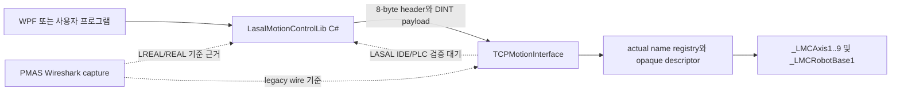

# LASAL Motion Control Lib API Development Backlog

Date: 2026-07-10

Latest update: 2026-07-21

Analysis baseline: `996686d`

Current audit base: `f8f99a299f72c118c9a243d0165368d666d0cd0f`

Status: Open

> **읽는 법:** 이 문서는 날짜별 개발 backlog와 당시 snapshot을 함께 보존한다.
> `2026-07-10 진행 내용`, `2026-07-13 진행 내용` 같은 절은 그 날짜의 상태이며
> 현재 범위가 아니다. 최신 전체 상태는
> `../../../docs/architecture/ELMO_MASTER_CURRENT_ARCHITECTURE_AND_RELEASE_STATUS_2026-07-16.md`와
> `../../LMC_API/API_DEVELOPMENT_GUIDE.md`를 우선한다.

## 결론

현재 API 개발은 완료 상태가 아니다.

Wireshark 자료에는 고유 command ID 23개가 있다. 여기에 기존 캡처 명령이 아닌
LASAL project-local extension `GroupPowerOn(0x204A)`과
`GroupPowerOff(0x204B)` 2개를 추가했다. 기존 motion/group 범위는 캡처 기반 23개와
local extension 2개를 합한 25개다. 2026-07-14에 `GroupReset(0x2049)`,
`GroupStop(0x2085)`, `GroupReadActualPosition(0x2051)`,
`MoveLinearAbsoluteEx(0x20A4)`, `SetKinTransformEx(0x20E7)` handler를
활성화해 이전 deterministic unsupported 5개를 해소했다.
2026-07-21 current source의 LASAL-local diagnostics namespace에는 정확히 24개
command ID가 있다. D0~D3 18개는 capability, Health/Catalog/PI Read, Bulk와
single-bank manual Recorder의 성공 응답 경로가 있고, D4/D5 6개는 exact wire를
검사한 뒤 capability-off `UnsupportedFeature`로 fail-closed한다. 따라서 성공 응답
capable PLC active 범위는 기존 25 + diagnostics D0~D3 18 = 43개이고,
dispatcher/wire handled contract는 D4/D5 6개를 더한 49개다.

현재 runtime gate는 non-RT `CyWork()`에서 아래 18개 axis/group
control·read·motion command를 허용한다. lifecycle과 name/member metadata
handler는 이 수에서 제외한다.

- Axis: `0x2023`, `0x2024`, `0x2022`, `0x2028`, `0x202E`, `0x209F`,
  `0x20A0`, `0x20A2`
- Group: `0x204A`, `0x204B`, `0x2047`, `0x2048`, `0x2045`, `0x2049`, `0x2085`, `0x20A4`,
  `0x2051`, `0x20E7`

`TCPMotionInterface`의 RT Task, RtWork override와 typed mailbox는 제거했다.
receive accumulator 2,048 bytes, request buffer 1,328 bytes, queue payload
1,320 bytes로 exact `0x20E7` frame도 같은 CyWork queue에서 처리한다. source
실행 허용, 정적 계약 통과, IDE build 완료, PLC 실기 완료를 구분해야 한다.

현재 task/network 기준은
`LASAL_CYWORK_ONLY_TCP_EXECUTION_DESIGN_2026-07-13.md`를 따른다.

C#에는 command별 typed parser, strict ACK, `0x2051` LASAL-DINT vector,
`0x20E7` exact Cartesian4 serializer, local group power와 typed group state,
group mode 옵션, timeout/state/async와
callback source 검증을 반영했다. tracked LASAL에는 RPC lifecycle, 실제
object-name lookup, opaque descriptor와 9축 single-axis/4축 Cartesian group
DINT dispatcher를 반영했다.

현재 source는 C# 자동 테스트 100/100, LASAL source-only/full-network static
contract와 개발 WPF VS2019 MSBuild Debug/Release `TreatWarningsAsErrors` build를
통과했다. LASAL IDE Rebuild/Link는 0 error, C78 project와 C81 library/compiler
version mismatch warning 3건이며, InputLatch/RecorderStore/
TCPMotionInterface.Diagnostics implementation-search smoke 3건과 smoke 이후 신규
`CInvalidArgException` 0건을 확인했다. PLC download와 실제 packet 재캡처는 아직
없으므로 기존 motion/group E2E는 0/25이고 diagnostics PLC 시험 matrix는 미실시다.

PC packet API와 현재 공개 LASAL handler의 남은 핵심 blocker는 신규 frame이나 IDE
build가 아니다. 먼저 아래 PLC/실기 검증을 끝내야 한다.

1. CyWork와 motion RT thread의 CPU core/priority 조건 확인
2. 기존 motion/group 25 command의 PLC smoke와 재캡처
3. diagnostics D0~D3 runtime 및 D4/D5 exact fail-closed PLC 시험 matrix
4. static identity group coordinate/kinematic 제약의 장비 적용 승인
5. 실제 callback sender/payload와 multi-PC session/ownership 정책

## 현재 구현 완료도 판정

| 구분 | 상태 | 완료 판정 |
|---|---:|---|
| Wireshark 기준 대상 command | 23개 | 전체 범위 |
| LASAL project-local extension | 2개 | `0x204A/0x204B`; 기존 캡처 명령이 아님 |
| LASAL diagnostics extension | 24개 | D0~D3 active 18 + D4/D5 exact fail-closed 6 |
| 성공 응답 capable PLC active path | 43개 | 기존 motion/group 25 + diagnostics D0~D3 18 |
| C#/dispatcher/wire handled contract | 49개 | active 43 + D4/D5 exact fail-closed 6 |
| 캡처 기반 LASAL deterministic unsupported | 0/23 | 기존 group 5개 command source 활성화 |
| 현재 CyWork control/read/motion 범위 | 18개 | axis 8개와 group 10개; diagnostics/lifecycle/metadata 제외 |
| C# 자동 테스트 | 100/100 PASS | fake/synthetic/loopback/source contract 검증 |
| LASAL source-only/full-network static contract | PASS | diagnostics D0~D5 wire/network 계약 포함 |
| 개발 WPF VS2019 MSBuild | Debug/Release `TreatWarningsAsErrors` PASS | PLC 동작 승인이 아님 |
| 현재 LASAL IDE build/smoke | 0 error, 3 version warnings, smoke 3/3 PASS | 신규 `CInvalidArgException` 0건 |
| 기존 motion/group PLC E2E 및 재캡처 | 0/25 | diagnostics와 분리 |
| diagnostics PLC 시험 matrix | 미실시 | D0~D3 runtime + D4/D5 expected fail-closed |

`0x2051 GroupReadActualPosition`은 exact 68-byte LASAL-DINT response
(`DINT[16] + status/error`)를 반환한다. 현재 프로젝트에는 dynamic CalcModel이
없으므로 None/ACS/MCS/PCS 요청을 모두 같은 static axis-order identity 위치로
읽는다. captured PMAS 136-byte LREAL response는 거부한다. `0x20E7`은 exact
1320-byte Cartesian X/Y/Z/U identity 요청 전체를 검증하고 static mapping만
설정한다. profile lock은 `0x2047 GroupEnable`이 별도로 수행하며 이것은 dynamic
kinematic transform 생성 기능이 아니다.

정상 순서는 `0x204A PowerOn -> GroupReadStatus.IsPowerOn(0x00040000) ->
0x20E7 SetKin -> 0x2047 Enable/LockProfile -> motion ->
0x2048 Disable/UnlockProfile -> 0x204B PowerOff -> IsPowerOn=false 확인`이다.
`0x204A/0x204B` ACK는
비동기 `RobotOn`/`RobotOff` 요청 접수이며 최종 완료가 아니다. `0x00040000`만
LASAL local Power Ready다. `0x00020000=NC_GROUP_STANDBY_MASK`와
`0x00010000=NC_GROUP_DISABLED_MASK`는 Maestro 표준이며, 현재 어댑터가 각각
locked standby와 unlocked disabled 조건에 연결한다.

따라서 완료 범위는 다음처럼 구분한다.

- **single-PC P0 MVP:** PC core와 LASAL source는 기존 motion/group 25개와
  diagnostics handled contract 24개를 갖췄고, 성공 응답 capable PLC active 범위는
  총 43개다. runtime axis/group control/read/motion command는 위 18개까지 열려 있다.
  same-core/priority 확인, PLC smoke와 재캡처가 남았다.
- **기존 motion 23+2 command API:** source와 정적 계약은 완료됐지만 실제 callback sender,
  session/ownership과 기존 motion/group 25개 PLC 검증이 남아 있다. diagnostics는
  별도 PLC matrix로 검증한다. 현재 preview는 assembly/file
  `0.9.1.0`, product `0.9.1-preview`다. current Distribution 내부 manifest는 없다.

`MoveCircle`은 현재 공개 C# API와 승인된 LASAL-DINT command ID/payload 계약에
없으며 캡처 기반 23 + local extension 2 범위에 포함되지 않는다.

## 2026-07-10 진행 내용

- canonical 변경 대상은 Git 추적 중인
  `Lasal_PRG/Elmo_EtherCAT_Test_4Axis`로 정했다.
- caller가 물리값에 `LMC_Units`를 곱해 DINT로 전달하는 배포 매뉴얼을
  추가했다. DLL과 PLC는 재변환하지 않는다.
- C# callback port `0` 처리와 4-byte ACK parser를 교정했다.
- tracked LASAL에 receive bound/header 검증과 `0x8080`, `0x405C`,
  `0x405D` 단일-session handler를 추가했다.
- callback 등록 전 command와 non-owner socket command를 차단했다.
- Maestro manual로 callback transport가 UDP임을 확인했다.
- 실제 callback event payload와 LASAL UDP sender는 캡처/명세가 없어
  의도적으로 구현하지 않았다.
- `_LMCAxis1..4`와 `_LMCRobotBase1`의 실제 LASAL object name을 startup 때
  읽어 opaque descriptor를 발급하고, 4개 typed client channel로 dispatch한다.
- Axis Power/Reset/Stop/Read/Move DINT handler와 Group lookup/members/
  enable(profile lock)/disable(profile unlock)/status/linear handler를 tracked project에 반영했다.
- GroupReset/GroupStop은 안전한 LASAL 대응 method 확정 전까지 deterministic
  `-5` error를 반환한다.
- command별 typed parser, WPF response 안전 판정과 23-bit dummy profile
  표기, NuGet 없는 .NET Framework 4.8 자동 테스트와 LASAL static contract
  suite를 추가했다.
- PC에 `GroupReadActualPosition(0x2051)` coordinate request와 LASAL-DINT v1
  68-byte typed vector result를 추가하고 legacy 136-byte LREAL response를
  명시적으로 거부했다.
- PC에 `SetKinTransformCartesian4Axis(0x20E7)` exact 1320-byte serializer를
  추가했다. 공개 범위는 캡처된 Cartesian X/Y/Z/U identity-shift,
  `Buffered(2)` profile로 제한한다.
- group position 배열/enum validation과 coordinate/transition/buffer/execute
  옵션을 public API에 반영했다.
- connection timeout/state/error, 취소 가능한 async API, callback remote
  source 검증과 payload 방어 복사를 반영했다.
- timeout/전송 오류와 in-flight 취소는 해당 transport를 폐기해 `Faulted`로
  전환하고, queue 대기 중 취소는 active request를 건드리지 않게 했다.
- invalid reconnect input은 기존 session을 유지하고, reconnect 뒤 이전
  axis/group object는 session generation mismatch로 거부한다.
- initialization/transport/close 오류를 분리 보존하고 close nonzero ACK는
  local cleanup 뒤 호출자에게 예외로 전달한다.
- callback typed parser는 실제 datagram payload 근거가 없어 의도적으로
  추가하지 않았다. raw payload event가 현재 PC 완료 범위다.

## 2026-07-13 진행 내용 (당시 스냅샷)

- 사용자 결정에 따라 `TCPMotionInterface`의 RT Task, typed RT mailbox와
  `RtWork()` override를 제거했다. request를 검증한 뒤 non-RT `CyWork()`
  context에서 axis Power/Reset/Stop/Read/Move 8개와 group Enable/Disable/ReadStatus
  3개를 실행한다.
- success response는 PC 계약과 같은 12-byte payload를 사용한다: native
  `_LMCAXIS_STATUS` 32-bit state, function status/error, lower 16-bit axis error,
  reserved status-word `0`.
- `0x2049`, `0x2085`, `0x20A4`, `0x2051`, `0x20E7`은 source에서
  deterministic `-5`를 유지한다.
- static contract는 RT symbol/atomic 부재, queue direct state transition,
  `Response()` callback isolation, 활성 command의 request/response와 unsupported
  command의 `-5`를 검사한다.
- LASAL IDE 동기화로 legacy `LMCAxis`를 `LMCAxis1`로 바꾸고 4축 client를
  연결했다. TCP transport는 일반 `_TCPIPServer1`, `Config=0`,
  `MaxConnections=1`이며 `TCPMotionInterface1`은 CyclicTime 1 ms만 사용한다.
  최종 project save와 generated RT task table에서 interface 제거를 확인해야 한다.
- IDE load/build check는 설치된 MotionLib가 참조하는 vendor header
  `_DriveMngBase/DriveComL2.h` 누락으로 `E0015`가 발생했다. C78 project와 C81
  library 간 version warning 5개도 유지된다. 이 환경 문제를 해결하기 전에는
  build/link 0-error 판정을 할 수 없다.

## 2026-07-14 진행 내용

- `GroupReset(0x2049)`을 `LMCRobot.AxQuitError(AxisNo:=0)`로 활성화했다.
  이는 axis/hardware error reset이며 robot profile error 전체 reset이 아니다.
  ACK 뒤 `GroupReadStatus`로 실제 error 해제를 확인한다.
- `GroupStop(0x2085)`을 `LMCRobot.StopMove(Mode:=3, Decel, Jerk)`로 활성화했다.
  `Aborting(1)`, `Execute=1`, nonnegative deceleration/jerk를 검사하고 nonzero
  jerk에는 positive deceleration을 요구한다. ACK는 정지 완료가 아니라 stop
  command 접수다.
- `MoveLinearAbsoluteEx(0x20A4)`는 현재 static 4축만 허용한다. position slot
  1..4만 사용하고 5..16은 0이어야 한다. coordinate `None(0)`, transition
  `ExactStop(0)`/`ContinuousDirect(2)`, buffer `Aborting(1)`/`Buffered(2)`만
  `LMCRobot.MoveLinearCoord`에 mapping한다.
- group nonzero Jerk가 실제 적용되도록 canonical `_LMCRobotBase1`의
  `MoveType=_JERK_PROFILE`, `JMax=50000 mm`와 generated table을 맞췄다.
- `GroupReadActualPosition(0x2051)`은 68-byte DINT 응답을 만든다. dynamic
  CalcModel이 없는 현재 프로젝트에서는 None/ACS/MCS/PCS를 모두 동일한 static
  axis-order 위치로 읽는다. 현재 tracked handler는 `_LMCPROF_POS`의 Pos1..Pos9를
  복사하므로 과거 first-4-only 설명과 충돌한다. PLC 재캡처 뒤 4축 또는 9축
  readback 계약을 확정해야 한다.
- `SetKinTransformCartesian4Axis(0x20E7)`은 1,320-byte X/Y/Z/U identity 요청
  전체를 검증해 static mapping만 설정한다. `LockProfile`은 별도
  `GroupEnable(0x2047)`이 수행하며 dynamic transform을 생성하지 않는다.
- LASAL local extension `GroupPowerOn(0x204A)`/`GroupPowerOff(0x204B)`은 각각
  비동기 `RobotOn`/`RobotOff` 시작 요청을 접수한다. ACK는 최종 servo 상태를
  보장하지 않으며 `GroupReadStatus`의 local Power Ready bit로 후속 확인한다.
- receive accumulator를 2,048 bytes, request buffer를 1,328 bytes, queue
  payload를 1,320 bytes로 확장해 exact `0x20E7` frame을 같은 queue에 담는다.
- C# 자동 테스트 46/46, LASAL source-only/full-network static contract와 WPF
  VS2019 MSBuild Debug는 통과했다.
- 현재 group source 반영 뒤 LASAL IDE Rebuild/Link, Find in Implementation,
  CPU core/priority와 PLC E2E는 아직 검증하지 않았다.
- `MoveCircle`은 공개 API와 승인된 wire contract가 없어 이번 범위에서 제외했다.

## 분석 기준

이 문서는 다음을 교차 대조했다.

- C# source: `LMC_Library/LMC_API_Delivery/src/**`
- WPF example: `LMC_Library/LasalApiWpfTestApp/LasalApiWpfTestApp/**`
- tracked LASAL server:
  `Lasal_PRG/Elmo_EtherCAT_Test_4Axis/Class/TCPMotionInterface/**`
- untracked candidate:
  `Lasal_PRG/Elmo_EtherCAT_Test_4Axis_Edit/**`
- dummy/reference implementation:
  `Codex_LASAL_WPF/PmasApiWpfTestApp/Services/SigmatekTcpIpDummyMMCLib.cs`
- packet evidence:
  `LMC_Library/LMC_API/Elmo_API_Packet2/WireShark/*.pcapng`
- packet analysis: `LMC_Library/LMC_API/Elmo_API_Packet2/PACKET_ANALYSIS.md`
- Maestro manual extraction: `output/pdf/maestro_api_md/**`
- current API docs: `API_LIST.md`, `LMC_PACKET_MAP.md`, delivery design docs
- history handoff: `docs/history/260710/99_analysis_summary.md`

## 상태와 우선순위 정의

- C# 구현: public/internal call path와 request builder가 존재한다.
- 부분 구현: parser, error semantics, public result 또는 test가 부족하다.
- E2E 차단: LASAL handler/response가 없어 실제 PLC 왕복이 불가능하다.
- P0: 다음 motion test 전에 해결해야 하는 blocker 또는 오동작 위험.
- P1: P0 contract 위에서 완료할 기능.
- P2: 품질, 사용성, 배포 정리.

C# 구현은 PLC 통합 완료를 의미하지 않는다.

## 현재 데이터 흐름

tracked canonical project와 delivery C#은 현재 구현 범위에서 LASAL-DINT
header/payload를 맞췄다. `Codex_LASAL_WPF` dummy와 untracked `_Edit`는
legacy/hybrid 참고 자료이며 canonical source가 아니다.

## Command 구현 매트릭스

### Connection과 lookup

| ID | 기능 | C# DLL | canonical tracked LASAL | 판정 |
|---:|---|---|---|---|
| `0x8080` | Session Init | frame와 응답 대기 구현 | tracked 단일-session response 코드 반영 | P0: LASAL IDE/PLC 검증 대기 |
| `0x405C` | Callback Register | UDP listener, 실제 bound port, 4B ACK parser | tracked endpoint 저장/ACK 코드 반영 | P0: event 송신 제외, PLC 검증 대기 |
| `0x405D` | Close | 재연결/종료 frame 구현 | tracked ACK 후 state clear 코드 반영 | P0: PLC 검증 대기 |
| `0x103C` | Axis lookup | reference parser 구현 | 실제 object-name registry, descriptor 1..9 | source 반영, IDE/PLC 검증 대기 |
| `0x1042` | Group lookup | reference parser 구현 | 실제 `_LMCRobotBase1` name, descriptor `0x0100` | source/build 완료, PLC 검증 대기 |
| `0x202B` | AxisInfo | 8B ACK 보존·검증 | descriptor 검증 후 8B ACK | source/자동 테스트 완료, PLC 검증 대기 |

### Single Axis

| ID | 기능 | C# DLL | canonical tracked LASAL | 판정 |
|---:|---|---|---|---|
| `0x2023` | Power | DINT 16-byte request | CyWork에서 PowerOn/PowerOff dispatch | source/build 완료, PLC 검증 대기 |
| `0x2024` | Reset | 9-byte request | CyWork에서 QuitError dispatch | source/build 완료, PLC 검증 대기 |
| `0x2022` | Stop | DINT 24-byte request | CyWork에서 StopMove dispatch | source/build 완료, PLC 검증 대기 |
| `0x2028` | ReadStatus | 12B typed result | CyWork에서 status/error snapshot | source/build 완료, PLC golden 대기 |
| `0x202E` | ReadPosition | 8B DINT typed result | depth-8 queue와 CyWork direct read | source/build 완료, PLC golden 대기 |
| `0x209F` | MoveAbsoluteEx | DINT 40-byte request | CyWork에서 MoveShortestWay dispatch | source/build 완료, PLC 검증 대기 |
| `0x20A0` | MoveRelativeEx | DINT 40-byte request | CyWork에서 MoveRelative dispatch | source/build 완료, PLC 검증 대기 |
| `0x20A2` | MoveVelocityEx | DINT 32-byte request | CyWork에서 MoveEndless dispatch | source/build 완료, PLC 검증 대기 |

현재 source/class model은 `LMCAxis1..9`와 `LMCRobot` client를 가진다. tracked
network의 `TCPMotionInterface1.LMCAxis1..9 -> _LMCAxis1..9.Control` 연결은
full-network static contract를 통과했다. physical 1..4와 simulated 5..9의 실제
IDE Rebuild/Link, download와 online 연결 상태는 별도로 확인해야 한다.

### Group

| ID | 기능 | C# DLL | canonical tracked LASAL | 판정 |
|---:|---|---|---|---|
| `0x20D2` | GetGroupMembersInfo | exact 1350B typed parser | AxisCount 9, descriptor/name slot 1..9의 1350B response | source/자동 테스트 완료, PLC 검증 대기 |
| `0x204A` | GroupPowerOn | local extension request/ACK parser | CyWork에서 비동기 `RobotOn` 시작 요청 | LASAL-local source/자동 테스트 완료, 기존 캡처 명령 아님, PLC 검증 대기 |
| `0x204B` | GroupPowerOff | local extension request/ACK parser | CyWork에서 비동기 `RobotOff` 시작 요청 | LASAL-local source/자동 테스트 완료, 기존 캡처 명령 아님, PLC 검증 대기 |
| `0x2047` | GroupEnable | request/ACK parser | CyWork에서 `LockProfile` dispatch | source/자동 테스트 완료, LASAL IDE/PLC 검증 대기 |
| `0x2048` | GroupDisable | request/ACK parser | `ProfileInPosition` 확인 뒤 CyWork에서 `UnlockProfile` dispatch | source/정적 gate 완료, LASAL IDE/PLC 검증 대기 |
| `0x2049` | GroupReset | request/ACK parser | CyWork에서 `AxQuitError(AxisNo:=0)` dispatch | source/정적 계약 완료, IDE/PLC 검증 대기 |
| `0x2045` | GroupReadStatus | 12B typed result, `IsPowerOn`/`IsStandby`/`IsEnabled`/`IsDisabled` | local `0x40000` Power Ready와 표준 `0x20000` Standby/`0x10000` Disabled mask; adapter가 lock/unlock 조건에 mapping | source/build 완료, mask 출처 구분, PLC 검증 대기 |
| `0x2085` | GroupStop | DINT 24-byte request | CyWork에서 `StopMove(Mode:=3)` dispatch | source/정적 계약 완료, IDE/PLC 검증 대기 |
| `0x20A4` | MoveLinearAbsoluteEx | DINT 104-byte request, public mode options | static 4축/None/승인 mode만 `MoveLinearCoord` dispatch | source/정적 계약 완료, IDE/PLC 검증 대기 |
| `0x2051` | GroupReadActualPosition | coordinate request + exact 68B DINT[16] typed result | static identity axis-order `GetRobotPosition`과 68B response | source/정적 계약 완료, IDE/PLC 검증 대기 |
| `0x20E7` | SetKinTransformCartesian4Axis | exact 1320B captured-profile serializer | exact identity mapping validation/config only; 1320B queue, profile lock 없음 | source/정적 계약 완료, dynamic transform 아님, IDE/PLC 검증 대기 |

## 현재 코드의 주요 결함

### Response parser

1. 4-byte ACK와 8-byte ACK 구분은 2026-07-10에 교정했다.
   - 4-byte ACK: status/error가 payload offset `0`/`2`
   - 8-byte ACK: handle/reserved 뒤 payload offset `4`/`6`
   - command별 구조가 아닌 payload 길이 기반 분기이므로 structured/value
     response를 generic ACK parser에 넣으면 안 된다.
2. `GetGroupMembersInfo`, AxisInfo와 typed read parser는 교정했고 malformed
   payload는 `InvalidDataException`으로 구분한다.
3. RPC init 24-byte payload의 첫 DWORD `64` 의미는 아직 확정되지 않았고,
   실제 UDP callback payload도 캡처되지 않았다. PC close는 ACK 오류를
   호출자에게 전달하면서 transport cleanup을 수행하도록 교정했다.
4. PC connection은 timeout, 상태 전이, transport/close 오류, 취소 가능한
   async path와 callback source-address 검증을 제공한다. 이 기능은 LASAL의
   session ownership 정책을 대신하지 않는다.
5. timeout 또는 in-flight cancellation 이후 transport는 폐기돼 재사용되지
   않는다. queued cancellation은 active RPC를 중단하지 않고, reconnect 뒤
   stale axis/group descriptor도 거부한다.

### WPF test app

1. `8388608` 배율은 caller-side 23-bit encoder dummy profile로 명시했다.
   DLL 자동 변환이 아니며 production caller는 PLC 설정에 맞는 UNIT/scale로
   교체해야 한다.
2. `Result()`와 polling read는 `IsFrameValid`/`IsSuccess`를 검사하며 실패값
   `0`을 상태 판정에 사용하지 않는다. Power/Standstill 판정도 PMAS mask가
   아니라 LASAL `_LMCAXIS_STATUS.PowerOn` bit 0과 `Standstill` bit 25를 쓴다.
3. callback state/error와 raw payload/endpoint/time을 UI thread로 marshal해
   표시한다. 실제 payload 명세가 없으므로 typed event로 해석하지 않는다.
4. 모든 네트워크/polling path를 async/cancellation으로 바꾸고 Cancel 버튼과
   비동기 delay를 적용했다. axis/group lookup도 취소 가능한 async factory를
   사용하고 window 종료 시 RPC close/dispose 완료를 기다린다.
5. `GroupPowerOn/Off`, profile lock/unlock status, `GroupReadActualPosition`,
   `SetKinTransformCartesian4Axis`, group coordinate/transition/buffer option을 UI에 노출했다.

WPF Debug/Release build와 LASAL source/static 계약은 성공했지만 현재 source의
LASAL IDE build와 PLC 검증은 아직 없다. 따라서 UI 기능이 존재한다는 이유로
실제 motion을 production-safe로 판정하면 안 된다.

### Input과 public API

- object name은 null/빈 값, printable ASCII 이외 문자와 79 bytes 초과를
  frame 생성 전에 명시적으로 거부한다.
- group position 배열은 null 없이 1..16개로 검증하고 남는 wire slot만
  0 padding한다. 16개 초과와 잘못된 enum은 전송 전에 거부한다.
- `MoveLinearAbsoluteEx`의 coordinate system, transition mode, buffer mode와
  execute는 `LMCGroupMotionOptions`로 공개했다.
- callback port `0`은 UDP listener의 실제 ephemeral port를 registration
  frame에 쓰도록 교정했다.
- typed result, request/response golden과 LASAL static contract suite가 추가됐다.

## 캡처에서 추가로 확정한 구조

### `0x20D2 GetGroupMembersInfo`

Response payload 1350 bytes:

| Offset | 구조 |
|---:|---|
| 0 | AxisReference `UINT16[16]` |
| 32 | DeviceId `UINT16[16]` |
| 64 | Status `UINT16` |
| 66 | ErrorId `INT16` |
| 68 | AxisName `CHAR[16][80]` |
| 1348 | NumAxes `BYTE` |
| 1349 | padding |

### `0x2051 GroupReadActualPosition`

Request payload는 coordinate-system DINT, enable BYTE, padding 3 bytes다.
Response payload는 `double[16]`, status, error ID, padding 4 bytes다.
padding을 17번째 position으로 해석하면 안 된다.

LASAL-DINT v1 local contract는 response를 exact 68 bytes,
`DINT[16] + UINT16 status + INT16 error`로 확정했다. PC typed parser는 이
형태만 받고 captured legacy 136-byte LREAL response를 거부한다. LASAL은
PMAS coordinate enum(None/ACS/MCS/PCS)을 검증하지만, dynamic CalcModel이 없는
현재 static 4축 프로젝트에서는 모두 `GetRobotPosition`의 동일 axis-order
axis-order 위치로 mapping한다. 현재 tracked source는 `_LMCPROF_POS` 9개 값을
slot 1..9에 복사한다. Move/SetKin/Lock은 계속 4축이므로 readback slot 범위는
PLC 재캡처 뒤 별도 계약으로 확정한다.

### `0x20E7 SetKinTransformEx/Cartesian`

1320-byte payload는 legacy `MMC_SETKINTRANSFORM_IN`이 아니라
`MMC_SETKINTRANSFORMEX_IN`/Cartesian wrapper와 맞는다.

| Payload offset | 구조 |
|---:|---|
| 0..639 | `MC_KIN_NODE_DEF[16]`, 각 40 bytes |
| 640 | `iNumAxes = 4` |
| 644..1303 | `MC_KIN_REF` union remainder |
| 1304 | `eKinType = 0` Cartesian |
| 1308 | buffer mode = `2` |
| 1312 | execute BYTE = `1` |
| 1313..1319 | ABI padding |

두 pcap의 application frame은 byte-identical해서 unique sample은 1개다.
구조는 captured Cartesian4 serializer 개발에 충분하다. PC 공개 API는
고유 X/Y/Z/U axis reference, identity shift, `Buffered(2)`로 제한해 구현했다.
축 수, 계수, node type, buffer mode를 바꾼 generic 기능을 열려면 추가
캡처가 필요하다. LASAL은 2,048-byte receive accumulator, 1,328-byte request
buffer와 1,320-byte queue payload로 exact frame을 수용한다. handler는 전체
identity shape와 axis reference 1..4를 검증하고 static identity mapping만
설정한다. `LockProfile`은 후속 `0x2047 GroupEnable`이 수행한다. dynamic
CalcModel을 생성하거나 coefficients를 적용하는 generic transform은 아니다.

## P0 개발 목록

| ID | 작업 | 완료 조건 |
|---|---|---|
| P0-01 | canonical LASAL project 확정 | tracked `Elmo_EtherCAT_Test_4Axis`에 승인된 변경만 반영하고 untracked `_Edit` 의존 제거 |
| P0-02 | LASAL-DINT protocol v1 명세 고정 | 캡처 기반 23 command와 local extension 2개의 header, request, response, type, error schema를 구분해 문서화 |
| P0-03 | RPC lifecycle 구현 | LASAL에 `0x8080`, `0x405C`, `0x405D` handler/response 추가, 요청 `dSock`으로 응답 |
| P0-04 | target dispatcher 구현 | LASAL actual object name lookup 후 opaque descriptor가 `_LMCAxis1~4`/robot으로 정확히 route |
| P0-05 | 기존 C# command의 LASAL handler 완성 | 캡처 기반 23 + local 2 공개 범위가 DINT contract로 실제 실행되거나 유효한 조회 응답을 만들고 잘못된 조합은 deterministic error 반환 |
| P0-06 | response parser 교정 | 4B/8B ACK, lookup, value, AxisInfo, 0x20D2를 command별 parser로 처리 |
| P0-07 | WPF test app 안전 수정 | 23-bit dummy가 caller profile임을 명시, `IsFrameValid`/`IsSuccess` 확인, 실패값 0과 PMAS state mask 사용 금지 |
| P0-08 | 자동화 test 기반 | request golden bytes, captured response parser, malformed frame, fake TCP server integration test 추가 |
| P0-09 | LASAL receive/실행 context 안전성 | 일반 TCP server와 interface가 동일 non-RT CyWork task를 사용하고 callback은 frame 복사/queue까지만 수행하며 승인된 `_LMCAxis`/`_LMCRobot` 호출은 해당 motion RT thread와 같은 core의 CyWork에서 실행; bound/partial/combined frame 검증 |

진행 상태:

- P0-01: 이번 변경부터 tracked project를 canonical 변경 대상으로 사용
- P0-02: PC의 캡처 기반 23 + local 2 request/response schema와 UNIT 책임, LASAL `0x2051`
  static identity mapping/68B response와 `0x20E7` exact identity/4B ACK를
  문서화했다. callback event payload는 실제 캡처 뒤 확정 필요
- P0-03: PC/LASAL phase-1 코드 반영, LASAL IDE와 PLC E2E 검증 대기
- P0-04: actual-name registry, single-axis descriptor 1..9와 9축 client wiring,
  group descriptor `0x0100`/4축 Cartesian 경계 source 반영,
  LASAL IDE/PLC 검증 대기
- P0-05: axis Power/Reset/Stop/Read/Move 8개와 group PowerOn/PowerOff/
  Enable/Disable/ReadStatus/Reset/Stop/MoveLinear/ReadActualPosition/SetKin 10개
  control/read/motion runtime을 CyWork에서 활성화했다. 캡처 기반 23-command 범위의
  `-5` 차단은 없고 local extension 2개도 별도 계약으로 활성화됐다.
- P0-06: exact 4B/8B ACK, typed read, AxisInfo, `0x20D2`, `0x2051` parser와
  legacy/truncated shape tests 완료
- P0-07: WPF dummy profile 표기, response 실패 판정, LASAL PowerOn/Standstill
  mask, async/cancel, raw callback/state 표시와 신규 group UI 반영 완료.
  실제 PLC 장시간 polling/motion 검증은 남음
- P0-08: request golden, captured/synthetic parser, malformed frame와 fake RPC/
  UDP callback/lifecycle 통합 test 46/46 PASS. source-first generated table/offset와
  axis 1..9 link는 `RunLasalContract`와 `RunLasalNetworkContract` PASS. 이것은
  정적 검증이며 LASAL IDE/PLC 확인은 남았다.
- P0-09: `Response -> depth-8 queue -> CyWork execute -> response` 경로와
  위 18개 활성 control/read/motion command를 반영했다. 2,048-byte receive,
  1,328-byte request, 1,320-byte queue payload로 `0x20E7`도 같은 경로를 쓴다.
  LASAL IDE class model의 `LMCAxis1`, 일반
  `_TCPIPServer1`, CyclicTime 1 ms, `Config=0`, `MaxConnections=1`을 반영했다.
  interface RealTime assignment는 제거했다. 현재 source의 LASAL IDE build,
  CyWork/axis core와 priority 확인 및 PLC 검증은 남았다. 상세 적용 경계는
  `LASAL_CYWORK_ONLY_TCP_EXECUTION_DESIGN_2026-07-13.md`에 기록했다.

tracked `.st`는 CodeGenerator export이다. 이번 group handler와 확장된
session/accumulator/queue 변수가 Rebuild/Link 뒤에도 유지되는지 확인해야 현재
변경을 IDE 보존 상태로 판정한다.

P0가 끝나기 전에는 현재 WPF test app으로 실제 motion을 수행하지 않는 것이
맞다.

## P1 개발 목록

| ID | 작업 | 완료 조건 |
|---|---|---|
| P1-01 | `GetGroupMembersInfo` typed API (source/test 완료) | `LMCGroupMembersInfoResult`가 16축 reference/device/name/count/status/error를 반환 |
| P1-02 | `GroupReadActualPosition(0x2051)` (source 완료) | exact 68B DINT result와 static identity axis-order LASAL mapping 완료; IDE build/PLC 재캡처 필요 |
| P1-03 | `SetKinTransformCartesian4Axis(0x20E7)` (source 완료) | exact 1320B identity validation/config와 queue 적용 완료; profile lock은 별도 `0x2047`, dynamic transform 아님, IDE build/PLC 재캡처 필요 |
| P1-04 | group motion mode API (source 완료) | static 4축, None, ExactStop/ContinuousDirect, Aborting/Buffered mapping 완료; IDE build/PLC 검증 필요 |
| P1-05 | typed read 결과 (완료), lookup 결과 (부분) | 정상값 0과 실패를 구분하고 response/error context 보존 |
| P1-06 | session/ownership | LASAL dSock session table, axis/group ownership, busy error, disconnect/timeout cleanup |
| P1-07 | callback 검증 | PC raw listener 완료; 실제 payload 캡처 후에만 LASAL sender/typed parser 추가 |
| P1-08 | 실제 PLC 재캡처 | handshake, lookup, 4축 routing, 성공/실패 ACK, read/motion/group packet 저장 및 문서 갱신 |

`0x2051`과 `0x20E7`은 PC/LASAL source와 정적 계약까지 구현됐다. 다만 static
identity 전용이며 현재 source의 IDE build와 PLC 실기가 끝나지 않았으므로
production 지원으로 표시하지 않는다.

## P2 개발 목록

- configurable timeout, cancellation/async, state/error 분리와 session
  generation/stale-handle 차단: PC 반영
- group array length/enum validation: PC 반영; application별 motion range는 caller 정책
- typed callback: 실제 payload capture 전에는 구현 금지, raw event 유지
- test app UI-thread blocking 제거, raw callback/group UI, UNIT/DINT 검사,
  live-command arm, MoveVelocity stop 추적, 정확한 `-5` 판정과 member PowerOn
  rollback 반영 완료; 실제 PLC 검증은 남음
- assembly version `0.9.1.0`, product `0.9.1-preview`와 신규 Distribution 반영 완료
- package DLL/EXE를 current source에서 Release rebuild하고 SHA-256 동일성 확인 완료;
  release artifact commit에서 ignored `bin` DLL도 명시적으로 추적
- sample/function TXT/API list/packet map 문서는 current PC API로 교체 완료
- `LMC_API_Delivery`, package, packet analysis의 링크와 용어 최종 통일

## 배포 패키지 상태

`LMC_Library/LMC_API/LMC_API`는 2026-07-13의 구버전 보관본으로 고정한다.
현재 PC preview 산출물은 `LMC_Library/LMC_API_Distribution`에 조립한다.

- README, API list, packet map, sample과 function/Command ID TXT를 현재
  캡처 기반 23 + LASAL local extension 2 PC public API 범위에 맞췄다.
- `0.9.1.0` DLL/EXE를 current Release source에서 재빌드했다. build script는
  source/`01_API`/`Run` DLL hash 동일성을 검사하고 hash를 console에 출력한다.
  current Distribution 내부에는 `RELEASE_MANIFEST.md`를 두지 않는다.
- old tracked binary를 제거하고 새 이름의 package/Delivery DLL과 test-app
  DLL/EXE를 release artifact commit에서 명시적으로 추적했다.

현재 산출물은 PC API source/test용 preview다. LASAL/PLC 검증 뒤 실제 release를
만들 때는 확정 source commit으로 다시 빌드하고 build console의 source와 SHA-256을
distribution 외부 승인 기록에 보존해야 한다.

## 설계 결정 및 미결정 항목

1. canonical LASAL source
   - 결정 완료: Git tracked `Lasal_PRG/Elmo_EtherCAT_Test_4Axis`만 개발
     대상으로 사용하고 `_Edit` 복제본은 무시한다.
2. protocol identity
   - 권장: PMAS wire-compatible라고 부르지 말고 `LASAL-DINT v1`로 명시한다.
3. `0x2051` response type
   - 결정 완료: LASAL-DINT v1 exact 68B `DINT[16]+status/error`.
   - 현재 프로젝트는 dynamic CalcModel이 없어 None/ACS/MCS/PCS를 동일 static
     axis-order identity 위치로 mapping한다.
4. `0x20E7` 적용 방식
   - 결정 완료: PC는 exact 1320-byte captured Cartesian4 serializer를 사용.
   - LASAL은 exact identity shape를 1320-byte queue에서 검증하고 static 4축
     mapping만 설정한다. `LockProfile`은 `0x2047 GroupEnable`이 별도로 수행하며
     dynamic CalcModel 변경 기능이 아니다.
5. callback event protocol
   - transport는 Maestro manual 기준 UDP로 확정했다.
   - event mask bit, datagram payload, 재전송/유실 정책은 실제 callback
     capture 또는 승인된 LASAL-local 명세 후 확정한다.
6. multi-PC ownership
   - 읽기는 공유하고 motion/control은 axis/group owner만 허용하는 LASAL
     server 정책을 기본안으로 한다. PC DLL만으로 완료 처리하지 않는다.

## 권장 실행 순서

1. `LMCAxis1..9`, depth-8 queue와 CyWork-only 활성 18개 control/read/motion command 정적 검증 유지
2. 현재 group source를 LASAL IDE에서 Rebuild/Link하고 Find in Implementation smoke 수행
3. 일반 `_TCPIPServer1` link, CyclicTime 1 ms, RealTime assignment 부재,
   same-core, `Config=0`, `MaxConnections=1`을 strict contract로 확인
4. 현재 LASAL IDE Rebuild 결과를 기준으로 PLC download, RPC/lookup/single-axis
   descriptor 1..9와 group descriptor `0x0100` 재캡처
5. ReadActualPosition -> read/admin -> Power/Stop -> Move 순서로 명령별 CyWork handler/E2E
6. 나머지 single-axis command E2E
7. Group 정상 순서 `0x204A PowerOn -> IsPowerOn(0x40000) -> 0x20E7 SetKin ->
   0x2047 Enable/LockProfile -> MoveLinear -> 0x2048 Disable/UnlockProfile ->
   0x204B PowerOff -> IsPowerOn=false` E2E
8. GroupReset/GroupStop과 `0x2051` static identity position/68B response를 별도 E2E
9. 실제 UDP callback payload 캡처 뒤 LASAL sender/typed parser 구현
10. multi-PC ownership, 실제 pcap, release package 완료

## Definition of Done

각 command는 아래를 모두 만족해야 완료로 표시한다.

1. C# public API 또는 명시된 internal operation이 존재한다.
2. request golden bytes가 protocol 문서와 일치한다.
3. LASAL parser가 같은 header/type/offset으로 수신한다.
4. 올바른 axis/group object로 dispatch하고 실제 동작 또는 값을 만든다.
5. success와 error response schema가 문서화되고 parser test를 통과한다.
6. fake server integration test와 실제 PLC smoke test를 통과한다.
7. Wireshark 재캡처가 request/response 문서와 일치한다.
8. API list, packet map, test app, package 문서를 같은 변경에서 갱신한다.
9. C# build와 `git diff --check`를 통과한다.

## 범위에서 제외

- 캡처와 실제 LASAL 요구가 없는 Maestro 전체 API 복제
- 제거된 `LMC_*Cmd` method alias 복구
- DLL 내부 자동 unit conversion
- `PowerMembers` 같은 반복 helper를 protocol command로 추가
- 공개 API와 승인된 wire contract가 없는 `MoveCircle`을 vendor method 이름만으로 추가

## 후속 개발 트랙: EtherCAT PI/Bulk/Recorder

현재 motion/control API 구조 검증 뒤 진행할 diagnostics 기능은 아래 단계로
분리한다. 상세 구조, wire schema, RT/Non-RT 경계와 검증 gate는
`docs/architecture/LMC_ETHERCAT_PI_BULK_RECORDER_IMPLEMENTATION_DESIGN_2026-07-20.md`를
기준으로 한다.

| 단계 | 범위 | 현재 상태 |
|---|---|---|
| D0 | `0x7E00..0x7EFF` capability/contract와 skeleton | source 구현, PC/정적 PASS, IDE/PLC 미검증 |
| D1 | EtherCAT Health + read-only Signal Catalog/PI | RT ordering/IDE network gate 확인 필요 |
| D2 | 동일 cycle Bulk Snapshot | 설계 완료, 미구현 |
| D3 | single fixed-bank Recorder + TCP chunk + WPF/CSV | 설계 완료, 미구현 |
| D4 | pre-trigger + edge/window/mask + double bank | 후속 설계, 미구현 |
| D5 | allowlist PI Write + ticket 기반 SDO | 후속 설계, 미구현 |
| D6 | Elmo식 static/handle compatibility facade | 마지막 후속 구현 |

2026-07-20 D0 반영 상태:

- C#에 `connection.Diagnostics.GetCapabilities()` sync/async API, diagnostics common
  envelope, capability model/parser를 추가했다.
- PLC `TCPMotionInterface`의 기존 queue/CyWork dispatcher에 project-local
  `0x7E00 GetDiagnosticsCapabilities`를 추가했다.
- D0는 `CapabilityBits=0`, `DiagnosticsBootId=0` sentinel만 반환한다. retained
  nonzero BootId 구현 전에는 Bulk/Recorder/PI Write/SDO capability를 켜지 않는다.
- VS2019 전체 `RunTests`에서 PC 53/53, LASAL source contract와 두 WPF 예제 build가
  통과했고 full-network static contract도 별도로 통과했다.
- 남은 D0 gate는 LASAL IDE Rebuild/Link, implementation smoke, PLC download와 실제
  정상/malformed `0x7E00` packet recapture다.
- D1 RT producer는 새 LASAL class/network 등록과 함께 모든 slave input callback 뒤,
  motion 계산 전 실행 순서를 IDE/System Trace로 증명해야 한다. 현재 master wrapper에는
  확인된 public post-input hook이 없으므로 source-only 임의 구현은 진행하지 않는다.

중요한 경계:

- RT Recorder는 모든 input PDO callback 뒤 1 ms RT 경로에서 sample한다.
- TCP/문자열/파일/SDO/dynamic allocation은 RT에서 금지한다.
- 현재 활성 PDO와 class에만 존재하는 비활성 server를 Catalog에서 구분한다.
- 물리축 1~4와 software/simulated 축 5~9를 구분한다.
- v1 32채널 x 31,250 samples는 bank 하나당 4,000,000 bytes다. 실제 PLC free
  RAM과 RT jitter 측정 전에는 production 상한으로 확정하지 않는다.
- 현재 instance `LMCConnection` core를 유지한다. static facade는 wire/PLC 안정화
  뒤 adapter로만 추가한다.

## 관련 문서

- [Current API development guide](../../LMC_API/API_DEVELOPMENT_GUIDE.md)
- [Current LASAL-DINT packet map](DINT_PACKET_MAP.txt)
- [Legacy 0.9.0 API list](../../LMC_API/LMC_API/docs/API_LIST.md)
- [Legacy 0.9.0 C# packet map](../../LMC_API/LMC_API/docs/LMC_PACKET_MAP.md)
- [Current project architecture and release status](../../../docs/architecture/ELMO_MASTER_CURRENT_ARCHITECTURE_AND_RELEASE_STATUS_2026-07-16.md)
- [Internal 0.9.1-preview build metadata](BUILD_METADATA_2026-07-16.md)
- [PMAS packet analysis](../../LMC_API/Elmo_API_Packet2/PACKET_ANALYSIS.md)
- [API structure decision](API_STRUCTURE_DECISION_2026-07-09.md)
- [EtherCAT PI/Bulk/Recorder implementation design](../../../docs/architecture/LMC_ETHERCAT_PI_BULK_RECORDER_IMPLEMENTATION_DESIGN_2026-07-20.md)
- [Response model](RESPONSE_MODEL_DESIGN_2026-07-09.md)
- [RPC packet decision](RPC_CONNECTION_PACKET_DECISION_2026-07-09.md)
- [RPC and UDP callback implementation](RPC_INITIALIZATION_CALLBACK_IMPLEMENTATION_2026-07-10.md)
- [UNIT conversion manual](UNIT_CONVERSION_MANUAL_2026-07-10.md)
- [LASAL command queue / RtWork design](LASAL_COMMAND_QUEUE_RTWORK_DESIGN_2026-07-10.md)
- [LASAL CyWork-only TCP execution design](LASAL_CYWORK_ONLY_TCP_EXECUTION_DESIGN_2026-07-13.md)
- [Group API implementation](GROUP_API_IMPLEMENTATION_2026-07-14.md)
- [Session management design](SESSION_MANAGEMENT_DESIGN_2026-07-09.md)
- [History handoff](../../../docs/history/260710/99_analysis_summary.md)
