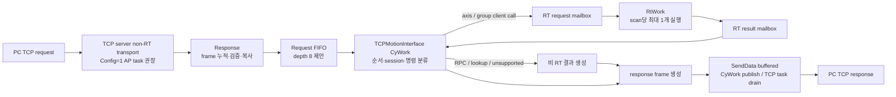

# LASAL Command Queue / RtWork 구현 설계안

작성일: 2026-07-10
상태: **설계 전용 / 구현 미승인**

> **2026-07-13 폐기 결정:** 사용자 요청에 따라 `TCPMotionInterface` RT Task와
> typed RT mailbox는 사용하지 않는다. 이 문서는 과거 대안 검토 기록으로만
> 보존한다. 현재 구현과 task/core 기준은
> `LASAL_CYWORK_ONLY_TCP_EXECUTION_DESIGN_2026-07-13.md`가 우선한다.

> 2026-07-10 구현 결정: 이 문서는 D0~D15 대안을 보존한 pre-implementation
> 설계 기록이다. 현재 source-first 최소 구현과 충돌하는 항목은
> `LASAL_SOURCE_QUEUE_AND_NETWORK_APPLY_PLAN_2026-07-10.md`가 우선한다.
> 선택된 P0 값은 `Config=0` CyWork transport owner, direct ordered small TX,
> depth-8/96-byte queue, declared-length bounded discard, `0x202E` typed RtWork
> first path다. `Config=1 AP`, buffered TX, `SizeOfTXBuffer=4096`은 후속 대안이다.
> 아래 RtWork/mailbox 권장안은 더 이상 적용하지 않는다.

## 1. 결론

권장 구조는 아래와 같다.



핵심 원칙은 다음 네 가지다.

1. TCP/Linux stack 처리는 `RtWork`에서 제거하고 non-RT transport task 하나만
   소유한다.
2. `Response()`는 callback의 `pData`를 보관하지 않고 고정 크기 queue에
   복사하는 데서 끝낸다.
3. `_LMCAxis`와 `_LMCRobot` client 호출만 지정된 동일 core의 `RtWork`에서
   scan당 command 최대 하나씩 실행한다.
4. response frame 생성과 TCP 송신은 `CyWork`가 단독 소유한다.

이 문서는 구현을 승인하는 문서가 아니다. 아래 **D0~D15 결정 항목을 함께
확정한 뒤** LASAL IDE에서 구현을 시작한다.

## 2. 이번 문서의 변경 금지선

이번 단계에서는 다음을 하지 않는다.

- `TCPMotionInterface.st`, `_TCPIPServer_RT.st`, `Motion_Network.lcn` 수정
- LASAL class/channel/type 추가
- CodeGenerator table 수동 수정
- LASAL IDE build 또는 PLC download
- 실제 Power/Move/Stop 실행

tracked `TCPMotionInterface.st`와 `Motion_Network.lcn`에는 이전 단계의 RPC
lifecycle, object registry, 4축 dispatcher 프로토타입이 checkpoint commit
`da4a912`로 보존돼 있다. 이 설계 작업에서는 그 구현을 추가 수정하거나
되돌리지 않았다. 후속 구현 착수 전에 D0에서 refactor 기준을 먼저 결정한다.

## 3. 확인한 현재 상태

아래는 현재 소스에서 확인한 사실이다.

- `_TCPIPServer_RT::RtWork()`가 `CyclicCall()`을 무조건 호출한다.
- `_TCPIPServer_RT::CyWork()`도 `bdStatus.CyclicTask = true`이면
  `CyclicCall()`을 호출할 수 있다.
- `_TCPIPServer_RT1.Config`는 값을 지정하지 않아 현재 `0`이다. base
  `_TCPIPServer`는 `Config bit0=0`이면 CyWork, `1`이면 내장 AP async task에서
  `CyclicCall()`을 실행한다. 현재 wrapper의 RtWork 호출과 base CyWork 경로가
  겹칠 수 있다.
- `TCPMotionInterface::Response()`는 TCP stream을 `ReceiveBuf`에 누적하고
  complete frame마다 `MsgPaser()`를 직접 호출한다.
- `MsgPaser()`와 하위 함수가 object-name 문자열 비교, response 생성,
  `SendData(..., bDirect := TRUE)`, `_LMCAxis`/`_LMCRobot` 호출을 한 경로에서
  수행한다.
- `TCPMotionInterface::CyWork()`는 현재 비어 있다.
- `TCPMotionInterface::RtWork()`는 object-name registry를 만들면서
  `_GetObjName`, `_strlen`을 실행한다.
- `_TCPIPServer_RT1.SizeOfTXBuffer`는 network에서 값을 지정하지 않았다.
  `_TCPIPServer` 구현은 값이 `0`이면 `1024` byte를 사용한다. 이름과 달리 이
  값 하나로 공용 receive buffer, socket별 TX ring, socket별 send-wait buffer를
  모두 할당한다.
- `_TCPIPServer_RT1.MaxConnections=0`은 base class에서 `16`개 연결로 해석된다.
- `TCPMotionInterface.ReceiveBuf`는 `1024` byte이고 `DataHandling()`을 override하지
  않아 server가 읽은 chunk 전체가 `Response()`로 전달된다.
- 현재 가장 큰 구현 response는 `0x20D2`의 payload `1350` byte, 전체 frame
  `1358` byte다. 현재 direct send의 상한 `1452` byte에는 들어가지만, 제안한
  buffered send의 기본 `1024` byte ring에는 들어가지 않는다.
- 현재 구현 대상 중 가장 큰 request는 `0x20A4`의 payload `96` byte,
  전체 frame `104` byte다.
- C# `LmcConnection.Exchange()`는 connection 내부 lock으로 request/response를
  직렬화한다. 공식 PC API 한 connection에서는 동시에 여러 request를
  보내지 않는다.

따라서 현재 문제는 단순히 `MsgPaser()` 호출 위치 하나만 옮기는 문제가
아니다. TCP stack의 task 위치, request 순서, session 수명, RT handoff,
response 송신 소유권을 같이 정해야 한다.

## 4. 목표와 비목표

### 목표

- split/combined TCP frame을 안전하게 누적한다.
- request를 유실하거나 덮어쓰지 않는다.
- request socket과 session generation을 response까지 보존한다.
- disconnect된 과거 request가 재사용된 socket에서 실행되지 않게 한다.
- axis/group client 호출의 실행 context와 최대 실행량을 고정한다.
- request/response 순서를 유지한다.
- queue full, stale session, 내부 상태 오류를 deterministic하게 처리한다.
- RT scan에 TCP, 문자열, 동적 메모리, blocking lock을 넣지 않는다.

### 비목표

- LASAL-DINT v1 wire format 변경
- DLL 내부 UNIT 변환 추가
- actual object name / opaque descriptor 정책 변경
- UDP callback event payload 정의
- multi-PC ownership 구현
- `0x2051` GroupReadActualPosition 구현
- `0x20E7` 1320-byte request 구현
- GroupReset/GroupStop의 의미 추정
- 기능상 Stop을 safety-rated emergency stop으로 취급

UNIT 책임은 기존 결정대로 유지한다. PC 개발자가 PLC 설정에 맞는 UNIT을
곱해 DINT로 전송하고, LASAL은 받은 DINT를 다시 변환하지 않는다.

## 5. 구조 대안

| 안 | 구조 | 장점 | 한계 | 판단 |
|---|---|---|---|---|
| A | `Response -> 단일 RT mailbox -> RtWork -> result` | 변경량이 작고 첫 read-only 검증이 쉽다 | combined frame과 burst를 받을 여유가 없고 RPC/lookup/RT 명령의 순서 처리가 어색하다 | 검증용 1단계로만 사용 |
| B | `Response -> depth-8 FIFO -> CyWork coordinator -> RT mailbox -> RtWork -> result -> CyWork send` | FIFO, session, RT 격리, 큰 response를 한 구조에서 처리할 수 있다 | task 간 publish 규칙과 LASAL IDE model 변경이 필요하다 | **권장 목표 구조** |
| C | TCP communication, parser/queue, motion executor를 새 LASAL class로 완전히 분리 | 장기 유지보수와 8~12축 확장에 가장 유리하다 | 첫 적용 범위가 크고 기존 prototype 이식 위험이 높다 | B 검증 후 후속 refactor |

권장 방식은 B를 목표로 하되, 실제 PLC 첫 검증은 A 수준의 one-slot
`ReadActualPosition(0x202E)`만 먼저 통과시키는 것이다. 첫 검증이 끝나기 전에
Power 또는 Move까지 한 번에 옮기지 않는다.

## 6. 실행 context별 책임

### 6.1 `_TCPIPServer` non-RT transport

권장안은 `_TCPIPServer_RT1.Config bit0=1`로 base class의 내장 AP async task를
사용하는 것이다. 이 task가 accept/receive/TX ring drain과 `Response()` callback의
유일한 producer가 된다. 기본 AP task priority는 현재 source에서 `14`지만,
실제 CPU의 priority 의미와 motion RT task보다 낮은 우선순위인지 LASAL IDE에서
확인한다. `_MultiTask` client 사용 가능 여부, semaphore 생성과 `TaskName`/
async-task error 상태도 online에서 확인해야 한다.

`Config=0`으로 CyWork에서 처리하는 안도 가능하지만 AP task와 CyWork를 동시에
사용하지 않는다. 어느 쪽을 선택해도 `_TCPIPServer_RT::RtWork()`의
`CyclicCall()`은 제거하고 no-op으로 둔다. 현재 class의 `RealtimeTask=true`,
`CyclicTask=true` 속성과 실제 object task assignment도 IDE model에서 함께
정리한다.

TCP data retrieval은 Linux stack을 통하므로 motion RT scan에 넣지 않는다.
한 transport iteration에서 application-level 무제한 loop를 추가하지 않는다.

### 6.2 `TCPMotionInterface::Response`

허용 작업:

- `DataHandling()`에서 normal parsing 중에는
  `min(available, 1024 - ReceiveFill)`만 읽고, discard-only 상태에서는 최대
  `1024` byte만 읽도록 제한
- `pData`를 accumulator로 즉시 복사
- 8-byte header, payload length, command/reference 검증
- partial/combined frame 분리
- owner socket/session의 1차 검증
- complete frame을 `RequestEntry`에 복사
- queue publish

금지 작업:

- callback 종료 뒤 `pData` 저장
- `_LMCAxis`/`_LMCRobot` client 호출
- object-name lookup과 문자열 registry 생성
- response용 공용 `Sendbuf` 조립
- `SendData()` 직접 호출
- wait, retry loop, 동적 메모리 할당

완전한 frame이지만 command/reference/payload가 잘못된 경우에는 일반 request
entry로 순서를 부여하고 CyWork가 error response를 만든다. framing fault나
queue-full도 공용 `Sendbuf`를 callback과 공유하지 않는다. 별도 고정 크기
`IngressFaultMailbox`에 socket, epoch, sequence, error를 publish하고 CyWork가
앞선 sequence를 처리한 뒤 송신한다. 이 mailbox까지 이미 차 있으면 기존
error를 덮어쓰지 않고 해당 session을 `Faulted`로 격리한다.

header의 declared payload가 `96` byte보다 큰 경우 raw payload를 queue에
복사하지 않는다. `4096` byte 이하는 정확한 declared 길이만큼 bounded chunk로
drain해 stream 경계를 보존한 뒤 ordered error marker를 만든다. 그보다 큰
길이 또는 fault 중 추가 data는 parsing하지 않고 discard-only 상태로 소비한다.

### 6.3 `TCPMotionInterface::CyWork`

- request FIFO의 유일한 consumer가 된다.
- 한 번에 하나의 active request만 관리한다.
- session epoch, socket, command, payload length, descriptor를 재검증한다.
- RPC/lookup/unsupported 같은 비 RT 명령을 처리한다.
- axis/group 명령을 고정 크기 typed RT mailbox로 변환한다.
- RT result를 받아 response frame을 만든다.
- `SendData(..., bDirect := FALSE)`를 호출한다.
- `SendData(FALSE)`의 `-11`은 TX full과 socket-not-found를 구분하지 못한다.
  다음 cycle에 `(socket, epoch, Connected)`를 먼저 재검사하고, stale이면 결과를
  폐기한다. 같은 session이면 TX ring/backend 실패로 추정해 cycle당 한 번만
  재시도하되 단순 congestion으로 단정하지 않는다.
- response가 TX queue에 수락된 뒤에만 active request를 완료 처리한다.

### 6.4 `TCPMotionInterface::RtWork`

- RT request mailbox가 `READY`일 때만 동작한다.
- session epoch와 target client 연결 상태를 다시 확인한다.
- scan당 command를 최대 하나 실행한다. 하나의 read command가 승인된 고정
  method 묶음을 요구하면 그 묶음까지만 실행한다. 예를 들어 `0x2028`은
  `ReadAxisStatus()`와 `ReadAxisError()` 두 값을 같은 snapshot으로 읽는다.
- compact result만 RT result mailbox에 기록한다.
- result mailbox가 비어 있지 않으면 다음 command를 실행하지 않는다.

금지 작업:

- TCP `SendData()`
- `OS_MT_WAIT`, `CriticalSection.SectionStart()` 같은 blocking primitive
- `Malloc`/`Free`
- `_strcmp`, `_strlen`, `_GetObjName` 등 문자열 처리
- queue 전체를 비우는 loop
- 1358-byte response frame 조립
- motion 완료까지 기다리는 blocking loop

현재 `CriticalSection::SectionStart()`는 내부에서 `OS_MT_WAIT()`를 호출하므로
RT queue lock으로 사용하지 않는다.

### 6.5 object-name registry

registry는 active motion scan의 `RtWork`에서 만들지 않는다. 권장 위치는 모든
client 연결이 끝난 뒤의 Init/PostInit 또는 one-shot CyWork다.

`_GetObjName()`은 `256` byte 임시 buffer로 읽고 길이가 `1..79`일 때만 public
80-byte lookup name으로 복사한다. registry가 완성되기 전에는 RPC application
request를 받지 않는다.

단, `_GetObjName()`이 반드시 motion object와 같은 core에서만 허용되는지는
LASAL IDE/library 기준 확인이 필요하다. 그런 제한이 확인되면 network accept
전에 실행되는 one-shot initialization gate에서만 만들고, registry가 immutable로
확정된 뒤 TCP request를 받는다.

## 7. 데이터 구조 제안

실제 LASAL type 이름은 IDE에서 확정하되 의미는 아래와 같이 고정한다.

### 7.1 Request FIFO

```text
RequestEntry
  State           FREE / WRITING / READY / ACTIVE
  Sequence        local monotonic UDINT
  Socket          request dSock
  SessionEpoch    socket/session generation
  CommandId       UINT
  Reference       UINT
  PayloadLength   UINT
  Payload[0..95]  BYTE snapshot
```

- 고정 depth `8`을 제안한다.
- producer는 `Response()` 하나, consumer는 `CyWork()` 하나인 SPSC로 제한한다.
- slot의 모든 field를 쓴 뒤 `READY`를 마지막에 publish한다.
- consumer는 local/active storage로 복사한 뒤 slot을 `FREE`로 돌린다.
- full일 때 oldest/newest 어느 쪽도 덮어쓰지 않는다.
- `0x20E7`의 1320-byte payload는 이 queue 범위 밖이다. 후속 명령을 추가할 때
  queue slot을 무작정 1320 byte로 키우지 않고 별도 serializer/transfer 설계를
  다시 승인한다.

### 7.2 RT request mailbox

```text
RtRequestMailbox
  State
  Sequence / Socket / SessionEpoch
  CommandId / Reference
  Args[0..23] DINT 또는 command별 typed field
```

CyWork가 endian, payload offset과 argument validity를 먼저 검사한다. RtWork는
raw byte parsing을 반복하지 않는다.

### 7.3 RT result mailbox

```text
RtResultMailbox
  State
  Sequence / Socket / SessionEpoch
  ResultKind
  Status / ErrorId
  scalar value 또는 작은 fixed snapshot
```

큰 group-member response와 object-name 문자열은 이 mailbox에 넣지 않는다.
그 응답은 CyWork가 immutable registry에서 생성한다.

### 7.4 ingress fault mailbox

```text
IngressFaultMailbox
  State
  Sequence / Socket / SessionEpoch
  ErrorKind
  FaultAfterResponse
  DiscardRemaining
```

- request FIFO가 full이어도 overload 사실을 기록할 수 있도록 별도 한 slot을
  예약한다.
- 동일 socket의 앞선 request보다 먼저 error response를 보내지 않는다.
- declared frame length가 허용 범위를 벗어나도 가능한 경우 정확한 payload
  길이만큼 drain한 뒤 error를 보낸다. header 중간에서 임의로 다음 header를
  검색하지 않는다.
- fault slot이 이미 차 있거나 declared length가 운영 상한을 넘으면 session을
  `Faulted`로 두고 이후 data를 discard-only 처리한다.
- fault slot이 `READY`가 된 동안 producer는 같은 session의 새 normal request를
  FIFO에 publish하지 않는다. CyWork는 fault보다 작은 sequence의 FIFO entry를
  먼저 처리하고 fault response를 처리한 뒤에만 ingress를 다시 연다.
- 현재 `_TCPIPServerInterface`에는 특정 socket을 즉시 닫는 공개 method가 없다.
  P0는 local fault/quarantine 후 PC의 error 처리 또는 3000 ms receive timeout에
  따른 disconnect를 기다리는 안을 권장한다. 강제 close API 추가는 별도 승인
  사항이다.

### 7.5 session epoch

- P0 범위는 현재와 같은 single-active-session이며 server
  `MaxConnections=1`을 권장한다. 두 번째 socket과 per-socket accumulator는
  multi-PC phase에서 session table과 함께 설계한다.
- socket connect/owner session 생성 때 epoch를 발급한다.
- disconnect, close 완료, session fault 때 epoch를 증가시킨다.
- queue entry는 `Socket + SessionEpoch`를 같이 저장한다.
- `ConnSocketInfo(DISCONNECT)`에서 queue head/tail을 강제로 재설정하지 않는다.
  epoch mismatch로 stale entry를 무효화한다.
- stale entry는 절대 motion client를 호출하지 않는다.
- 이미 socket이 끊겼으면 error response를 억지로 보내지 않고 drop count/log만
  남긴다.

## 8. 명령 분류

### CyWork에서 끝나는 명령

| Command | 이유 |
|---|---|
| `0x8080`, `0x405C`, `0x405D` | session lifecycle / callback endpoint |
| `0x103C`, `0x1042` | immutable object-name registry lookup |
| `0x202B` | descriptor 검증과 AxisInfo response |
| `0x20D2` | immutable group-member/name response, 최대 1358-byte frame |
| `0x2049`, `0x2085` | 현재 deterministic unsupported `-5` |
| legacy `0x2081..0x2084` | 제거된 구형 alias, deterministic unsupported `-4` |
| unknown command | unsupported command `-4` |

### RtWork에서 client call이 필요한 명령

| Command | RtWork 호출 범위 |
|---|---|
| `0x2023` | axis PowerOn/PowerOff |
| `0x2024` | axis QuitError |
| `0x2022` | axis StopMove |
| `0x2028` | `ReadAxisStatus()` + `ReadAxisError()` snapshot; trailing reserved/status-word field는 현재 `0` |
| `0x202E` | axis actual-position snapshot |
| `0x209F`, `0x20A0`, `0x20A2` | axis move method 한 번 호출 |
| `0x2047`, `0x2048` | group RobotOn/RobotOff |
| `0x2045` | 현재 `ProfileInPosition()` + 마지막 `GroupMoveRetCode`; 실제 robot error snapshot 아님 |
| `0x20A4` | migration 대상이지만 group mode/kinematic 승인 전 live call 금지 |

`0x2051`, `0x20E7`은 현재 분류 대상이 아니며 구현 전에는 deterministic
unsupported/fault 정책을 따른다.

## 9. FIFO, ACK와 Close 의미

### request 순서

- 기본 정책은 strict FIFO다.
- active request의 response가 TX queue에 수락되기 전에는 다음 request를
  실행하지 않는다.
- active request가 없을 때 arbiter는 FIFO head와 ingress fault 중 sequence가
  더 작은 항목을 선택한다. `min(FifoHead.Sequence, Fault.Sequence)` 규칙을
  예외 없이 사용한다.
- combined frame에 여러 request가 들어와도 wire 순서를 유지한다.
- 공식 C# API는 현재 한 connection의 `Exchange()`를 lock으로 직렬화하므로
  depth 8은 정상 처리량보다 burst/combined-frame 방어 여유의 의미가 크다.

### motion ACK

- success ACK는 LASAL client method가 반환된 뒤 만든다.
- 이 ACK의 의미는 **명령이 LASAL motion object에 전달되어 accepted/started
  되었다**는 뜻이다.
- 목표 위치 도달 또는 motion 완료를 뜻하지 않는다.
- 완료 확인은 ReadStatus/InPosition polling 또는 향후 승인된 callback event로
  분리한다.

### Close `0x405D`

- Close는 FIFO barrier다.
- 그 앞 request의 response를 모두 처리한 뒤 Close를 처리한다.
- Close ACK가 TX queue에 수락되기 전에 session state를 지우지 않는다.
- ACK 수락 후 epoch 증가, owner state/callback endpoint 정리 순서로 처리한다.

## 10. 동시성 규칙

queue와 mailbox에는 blocking mutex를 쓰지 않는다.

기본 publish 규칙:

1. producer가 `WRITING` slot의 모든 data field를 기록한다.
2. producer가 `READY`를 마지막에 기록한다.
3. consumer가 `READY`를 확인한 뒤 local copy를 만든다.
4. consumer가 처리를 넘긴 뒤 `FREE`를 기록한다.

다만 이 규칙만으로 compiler/CPU memory ordering이 보장된다고 아직 확인하지
않았다. 구현 전에 아래 둘 중 하나를 확정해야 한다.

- Config=0/CyWork 대안을 쓸 경우 같은 core와 LASAL task 실행 순서가 publish
  ordering을 보장한다는 SIGMATEK 근거를 확보한다.
- LASAL/SigCLib가 제공하는 RT-safe atomic 또는 release/acquire primitive를
  사용한다.

Config=1 AP async task는 다른 task/core에서 producer가 실행될 수 있으므로 이
경우에는 검증된 atomic/memory barrier 사용을 기본 요구로 본다.

`CriticalSection`은 이 결정의 대안이 아니다. wait가 발생할 수 있기 때문이다.

## 11. overload와 error 정책 제안

기존 error code `-1..-7`과 충돌하지 않도록 아래 값을 제안하지만 아직
승인하지 않았다.

아래는 LASAL-DINT wire의 local command error다. `_TCPIPServer.ErrorCode`의
base transport error `-8..-15`와 이름이 같아도 별도 namespace로 기록한다.

| Error | 제안 의미 | 처리 |
|---:|---|---|
| `-8` | request queue full | request 실행 금지, deterministic error |
| `-9` | stale/closing session | 실행 금지, socket이 유효할 때만 error |
| `-10` | queue/mailbox internal state fault | session fault, motion 실행 금지 |

추가 규칙:

- queue full에서 overwrite/drop-success를 하지 않는다.
- RT result mailbox가 차 있으면 다음 RT command를 실행하지 않는다.
- buffered send `-11`이면 다음 cycle의 session 재검증 뒤에만 재시도한다.
  동일 session이어도 원인은 TX full로 확정하지 않고 backend failure counter를
  같이 남긴다.
- 같은 session에서의 TX retry 상한은 `1000 ms`를 제안한다. PC DLL의 현재
  receive timeout `3000 ms`보다 짧아야 하며 어느 한쪽 값을 바꾸면 양쪽 문서를
  같이 수정한다.
- timeout을 넘기면 local session을 `Faulted`로 두고 motion 실행을 금지한다.
  실제 socket 강제 close 여부는 D15에서 확정한다.

## 12. buffer 크기

| 항목 | 현재/최대 | 제안 |
|---|---:|---:|
| request payload | 현재 최대 96 byte | slot당 96 byte |
| request FIFO | 없음 | depth 8 |
| largest response frame | 1358 byte | 그대로 유지 |
| server `SizeOfTXBuffer` | 미지정 시 1024 byte | **4096 byte 권장**; RX + socket별 TX ring/wait에 공용 |
| `DataHandling` read cap | 현재 server available data 전체 | normal: `min(available, 1024 - ReceiveFill)`; discard: 최대 1024 |
| interface accumulator | 1024 byte | 1024 byte 유지 |
| server connections | `0`이므로 내부 16 | P0는 1 |

buffered `SendData(..., bDirect := FALSE)`로 바꾸려면 1358-byte response와
4-byte ring header가 함께 들어가야 한다. `4096` ring에는 이 entry가 약 3개
들어가므로 즉시 full 가능성을 낮춘다. 반대로 같은 `4096`이 receive read 크기도
키우므로 `DataHandling()`의 1024-byte cap을 반드시 같이 적용한다.

`MaxConnections=1`일 때 base server가 이 값으로 할당하는 receive/TX ring/wait
buffer 부분은 약 12 KB다. 기본 16 connections를 유지하면 약 136 KB가 되므로
P0 single-session에 불필요하다. 실제 값은 D3/D11 승인 후 LASAL IDE network
channel에서 함께 반영한다.

## 13. 구현 단계와 승인 gate

### Gate 0: 기존 prototype 처리

- checkpoint `da4a912`의 tracked `.st/.lcn` prototype을 기준으로 승인된
  설계만 IDE에서 refactor할지 결정한다.
- clean base가 필요하더라도 사용자 확인 없이 reset/revert하지 않는다.
- revert를 선택하면 현재 LASAL static contract test가 4-axis/generated
  prototype을 전제로 한다는 점도 같이 조정해야 한다.

### Gate 1: D0~D15 승인

이 문서 마지막 표의 결정을 함께 확정한다.

### Gate 2: LASAL IDE model만 구성

- `docs/architecture/SIGMATEK_LASAL_programming_error_prevention_guide.md`의
  기준 프로젝트, ASCII, CodeGenerator, IDE smoke-test 규칙을 먼저 적용한다.
- queue/mailbox type과 member/channel을 IDE class model에 등록한다.
- CodeGenerator 재생성 diff를 검토한다.
- 이 단계에서는 PLC motion을 실행하지 않는다.

### Gate 3: read-only one-slot 검증

- `0x202E ReadActualPosition` 하나만 mailbox 경로로 통과시킨다.
- task/core, sequence, socket, epoch, typed value response framing을 확인한다.
- split/combined request와 reconnect를 확인한다.

### Gate 4: FIFO와 read/admin 명령

- depth-8 FIFO를 활성화한다.
- RPC, lookup, AxisInfo, GroupMembers, ReadStatus, ReadPosition을 옮긴다.
- queue full, stale epoch, TX retry를 검증한다.

### Gate 5: 제한된 상태 변경

- Power와 기능상 Stop을 옮긴다.
- 실제 장비에서는 drive enable 조건, local safety chain, 저속/무부하 조건을
  별도 확인한다.

### Gate 6: motion

- MoveAbsolute를 낮은 속도/짧은 거리로 먼저 확인한다.
- 이후 MoveRelative, MoveVelocity 순서로 확장한다.
- 각 단계에서 packet 재캡처 후 다음 단계로 간다.

### Gate 7: group

- group lookup/members/status code migration은 먼저 할 수 있지만 live RobotOn과
  RobotOff, MoveLinearCoord는 D14 승인 전 실행하지 않는다.
- coordinate system, transition, buffer, superimposed, kinematic/UNIT profile을
  별도 group test sheet로 확정한 뒤 group enable -> status -> linear 순서로 연다.

## 14. 검증 계획

### 정적 검사

- `Response()`에서 `MsgPaser()`와 axis/group client call이 사라졌는지 확인
- `_TCPIPServer_RT::RtWork()`에서 `CyclicCall()`이 사라졌는지 확인
- `_TCPIPServer` `CyclicCall()` owner가 AP task 또는 CyWork 하나뿐인지 확인
- `DataHandling()` free-space/discard read cap, accumulator 1024,
  `MaxConnections=1` 확인
- `TCPMotionInterface::RtWork()`에 `SendData`, 문자열 함수, `Malloc`,
  `SectionStart`, wait loop가 없는지 확인
- 모든 queue slot이 socket과 session epoch를 저장하는지 확인
- request payload 96-byte bound와 frame length를 byte offset 단위로 검사
- payload 96-byte 초과 frame의 drain/discard-only 상태와 stream resync 검사
- generated XML channel, class member, `@CT_`, `@STD`, user function count 일치
- Git diff에 새로 추가된 LASAL 구현 라인의 비ASCII 문자 없음
- C# golden packet/response test와 `git diff --check`,
  `git diff --cached --check` 통과

### LASAL IDE

- class/type/network regenerate
- compile error 0, 기존 warning 분류 완료, 새 warning 0
- AP task 생성, `_MultiTask`/semaphore, task priority와 RtWork core assignment 확인
- queue/mailbox variable online watch 가능 여부 확인
- 변경 class의 `Find in Implementation` smoke test와 smoke 시작 이후
  `Lasal2.log`의 새 `CInvalidArgException` 부재 확인

### PLC 단계 시험

1. partial header / partial payload
2. combined two-frame / depth-8 burst
3. queue full에서 overwrite 없음
4. disconnect 직후 queued command 미실행
5. reconnect/socket 재사용 시 old epoch 미실행
6. response socket과 request socket 일치
7. request/response FIFO 순서 일치
8. 1358-byte GroupMembers buffered 송신
9. `SendData(FALSE)=-11`에서 disconnect와 TX congestion 분기
10. AP task/CyWork/RtWork cycle jitter 비교
11. ReadActualPosition -> ReadStatus -> Power -> Stop -> low-risk axis Move 순서

자동 test 통과만으로 LASAL IDE compile이나 실제 PLC 동작을 대체하지 않는다.

## 15. 함께 결정할 항목

| ID | 질문 | 권장안 | 상태 |
|---|---|---|---|
| D0 | checkpoint LASAL prototype을 어떻게 다룰 것인가 | `da4a912`를 비교 기준으로 보존하고 구현 시 IDE에서 승인된 부분만 refactor | 미승인 |
| D1 | 목표 pipeline | depth-8 FIFO + CyWork coordinator + RT request/result mailbox | 미승인 |
| D2 | queue depth | 8 | 미승인 |
| D3 | shared server buffer | request 96 byte, `SizeOfTXBuffer=4096`, free-space 기반 `DataHandling`, accumulator 1024 | 미승인 |
| D4 | task 간 publish 보장 | AP task 사용 시 SIGMATEK RT-safe atomic 필수; Config=0 대안만 근거가 확인된 same-core 규칙 검토 | 미승인 |
| D5 | success ACK 의미 | method return 후 accepted/started, motion complete 아님 | 미승인 |
| D6 | `0x2022` axis Stop 우선순위 | 첫 버전은 strict FIFO, emergency stop은 별도 safety chain; `0x2085` group Stop은 계속 unsupported | 미승인 |
| D7 | overload error | `-8` queue full, `-9` stale, `-10` internal fault | 미승인 |
| D8 | TX retry timeout | session 재검증 후 cycle당 1회, 1000 ms 제안; PC timeout 3000 ms보다 짧게 유지 | 미승인 |
| D9 | 첫 PLC 검증 command | `0x202E ReadActualPosition` one-slot | 미승인 |
| D10 | TCP/RT task 배치 | `Config=1` AP async task와 `_MultiTask`/semaphore 확인, wrapper RtWork no-op, interface RtWork는 axis와 동일 core; Config=0 CyWork는 대안 | 미승인 |
| D11 | P0 connection 수 | `MaxConnections=1`; multi-PC에서 per-socket accumulator/session table 추가 | 미승인 |
| D12 | object registry | 256-byte temp 조회, 1..79-byte name만 등록, ready 전 request gate | 미승인 |
| D13 | read/status field 의미 | `0x2028` trailing field 0, `0x2045`는 in-position + last move result임을 명시 | 미승인 |
| D14 | group state-changing call | group mode/kinematic/UNIT test sheet 승인 전 `0x2047`, `0x2048`, `0x20A4` live call 차단 | 미승인 |
| D15 | oversize/fault 종료 | 4096 byte까지 exact drain + ordered error, 초과는 local quarantine; force-close API는 후속 선택 | 미승인 |

D4와 D10이 가장 먼저 확인할 기술 항목이다. 특히 Config=1을 선택한 상태에서
승인된 atomic/memory barrier를 찾지 못하면 구현 Gate 1을 통과하지 않는다.
producer/consumer task와 memory ordering 근거 없이 queue code를 먼저 작성하지
않는다. D6의 Stop은 기능상 정지일 뿐 safety-rated stop이 아니므로, API queue
우선순위를 비상정지 대용으로 사용하지 않는다.

## 16. 구현 승인 후 예상 변경 파일

아래는 예상 범위이며 지금 수정하지 않는다.

- `Lasal_PRG/Elmo_EtherCAT_Test_4Axis/Class/TCPMotionInterface/TCPMotionInterface.st`
- `Lasal_PRG/Elmo_EtherCAT_Test_4Axis/Class/_TCPIPServer_RT/_TCPIPServer_RT.st`
- `Lasal_PRG/Elmo_EtherCAT_Test_4Axis/Network/Motion_Network/Motion_Network.lcn`
- `Lasal_PRG/Elmo_EtherCAT_Test_4Axis/Network/Motion_Network/ONE_Motion_Network_Table.st`
- `Lasal_PRG/Elmo_EtherCAT_Test_4Axis/Networks.lcb`
- LASAL IDE가 생성하는 관련 type/class table
- `LMC_Library/LMC_API_Delivery/tests/Verify-LasalContract.ps1`
- command/error 문서와 실제 PLC packet capture 문서

D15에서 강제 close API 추가를 선택할 때만
`Class/_TCPIPServerInterface/_TCPIPServerInterface.st`와
`Class/_TCPIPServer/_TCPIPServer.st`도 별도 검토 대상이 된다. vendor/base
class 변경은 P0 기본안에 포함하지 않는다.

가능하면 통신 facade, parser/queue, motion executor를 별도 class로 분리하는 C안은
B안의 실제 PLC 검증 후 진행한다. 첫 구현에서 구조 분리와 모든 command 이식을
동시에 하지 않는다.

## 17. 설계 근거

- `docs/architecture/SIGMATEK_LASAL_coding_rules.md`
- `docs/architecture/SIGMATEK_LASAL_programming_method_study.md`
- `docs/architecture/MotionTCPDemo_vs_Elmo_EtherCAT_Test_4Axis_Analysis_2026-07-03.md`
- `LASAL_OBJECT_DISPATCHER_DESIGN_2026-07-10.md`
- `SESSION_MANAGEMENT_DESIGN_2026-07-09.md`
- tracked `_TCPIPServer`, `_TCPIPServer_RT`, `TCPMotionInterface` source
