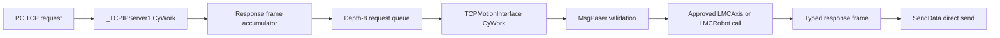

# LASAL CyWork 전용 TCP 실행 설계

작성일: 2026-07-13
대상: `Lasal_PRG/Elmo_EtherCAT_Test_4Axis`
상태: 소스/네트워크/CodeGenerator 반영 및 LASAL IDE Rebuild 완료, PLC 검증 대기

`Motion_Network.lcn`과 `ONE_Motion_Network_Table.st`는 no-RT 설정으로 함께
재생성됐다. `_TCPIPServer1.Config=0`, `MaxConnections=1`이며
`TCPMotionInterface1`은 cyclic table에만 있고 RT task entry가 없다. canonical
프로젝트 Rebuild/Link는 `0 error`, `0 warning`으로 완료했다.

## 1. 결정

`TCPMotionInterface`에는 RT Task를 사용하지 않는다.

- `TCPMotionInterface.RealtimeTask=false`
- `TCPMotionInterface.CyclicTask=true`, `DefCyclictime=1 ms`
- TCP transport는 일반 `_TCPIPServer1`을 사용한다.
- `_TCPIPServer1.Config=0`으로 별도 AP task를 만들지 않고 CyWork 하나가
  `CyclicCall()`을 소유한다.
- `_TCPIPServer1.MaxConnections=1`로 현재 single-session 구현과 맞춘다.
- RT request/result mailbox, `RtWork()` override, `sigclib_atomic_*` 호출은
  `TCPMotionInterface`에서 사용하지 않는다.

이 결정은 TCP API interface에만 적용된다. EtherCAT과 motion 제어에 필요한
`_LMCAxis1..4`의 기존 RT task까지 제거한다는 뜻은 아니다.

## 2. 빌드 에러 원인

LASAL IDE가 queue/mailbox `State`를 enum 타입인 `_TCPMI_QUEUE_STATE`와
`_TCPMI_RT_STATE`로 생성했지만, 기존 코드는 이 주소를 `UDINT` 전용
`sigclib_atomic_*U32` 함수에 전달했다. 따라서 다음 형태의 E0012가 발생했다.

```text
Different types: using '_TCPMI_RT_STATE' instead of 'UDINT'
Different types: using '_TCPMI_QUEUE_STATE' instead of 'UDINT'
```

단순 캐스팅으로 덮지 않았다. RT mailbox 자체를 제거하고, 동일 cyclic task에서
순차 실행되는 queue 상태를 enum 직접 대입으로 바꿨다.

## 3. 현재 실행 경로



queue 상태 전이는 다음과 같다.

- producer `Response()`: `FREE -> WRITING -> READY`
- consumer `CyWork()`: `READY -> ACTIVE -> FREE`
- 한 CyWork scan에서 최대 한 요청만 실행한다.
- `Response()`는 parser, axis call, TCP send를 직접 실행하지 않는다.

이 plain enum 전이는 `_TCPIPServer1` callback과 `TCPMotionInterface1.CyWork`가
동일 cyclic task에서 순차 실행된다는 조건에서만 유효하다. 다른 task나 AP async
task로 분리하면 data race가 생기므로 현재 구현을 그대로 사용하면 안 된다.

## 4. 활성 명령 범위

| 명령 | 실행 위치 | 동작 |
|---|---|---|
| `0x2023 Power` | `MsgPaser()`의 CyWork context | `LMCAxis1..4.PowerOn()` 또는 `PowerOff()` 호출, ACK |
| `0x2024 Reset` | `MsgPaser()`의 CyWork context | `LMCAxis1..4.QuitError()` 호출, ACK |
| `0x2022 Stop` | `MsgPaser()`의 CyWork context | `LMCAxis1..4.StopMove()` 호출, ACK |
| `0x202E ReadActualPosition` | `MsgPaser()`의 CyWork context | 연결 확인 후 `LMCAxis1..4.ReadPosition()` 호출, 16바이트 응답 |
| `0x2028 ReadStatus` | `MsgPaser()`의 CyWork context | 연결 확인 후 `ReadAxisStatus()`와 `ReadAxisError()` 호출, 20바이트 응답 |
| `0x209F MoveAbsoluteEx` | `MsgPaser()`의 CyWork context | `LMCAxis1..4.MoveShortestWay()` 호출, ACK |
| `0x20A0 MoveRelativeEx` | `MsgPaser()`의 CyWork context | `LMCAxis1..4.MoveRelative()` 호출, ACK |
| `0x20A2 MoveVelocityEx` | `MsgPaser()`의 CyWork context | `LMCAxis1..4.MoveEndless()` 호출, ACK |
| `0x2047 GroupEnable` | `MsgPaser()`의 CyWork context | `LMCRobot.RobotOn()` 호출, ACK |
| `0x2048 GroupDisable` | `MsgPaser()`의 CyWork context | `LMCRobot.RobotOff()` 호출, ACK |
| `0x2045 GroupReadStatus` | `MsgPaser()`의 CyWork context | `ProfileInPosition()` 결과를 status bit `0x00020000`에 반영하고, `_ROBOT_ERROR`이면 `ReadProfileError()`의 error number를 전달하는 20바이트 응답 반환 |
| RPC init/callback/close, name lookup | CyWork | 기존 non-motion 처리 유지 |

다음 명령은 source에서 deterministic unsupported error `-5`를 반환한다.

| 명령 | 차단 이유 |
|---|---|
| `0x2049 GroupReset` | 승인된 LASAL reset method 없음 |
| `0x2085 GroupStop` | 승인된 LASAL stop method 없음 |
| `0x20A4 MoveLinearAbsoluteEx` | group coordinate/transition/buffer semantics 미승인 |
| `0x2051 GroupReadActualPosition` | coordinate mapping과 68-byte response handler 미구현 |
| `0x20E7 SetKinTransformEx` | 1320-byte staging과 LASAL apply method 미구현 |

여기서 `0x2051`과 `0x20E7`의 `-5`는 LASAL 측 상태다. PC API에는 두
command의 request/public path와 response 또는 serializer 처리가 이미 구현돼 있다.

각 활성 command는 canonical C# serializer와 같은 payload length, descriptor,
execute/direction/buffer field를 검사한다. `0x2028`은 header/payload descriptor
일치와 `Execute=1`도 검사한다. `0x202E`은 payload 길이 1, payload byte 0,
descriptor 1..4를 검사한다. client 미연결은 `-2`, 잘못된 요청은 `-3`이다.

### 기존 DummyMMCLib와 byte offset 대조

`Codex_LASAL_WPF/PmasApiWpfTestApp/Services/SigmatekTcpIpDummyMMCLib.cs`도
확인했지만 이 파일은 일부 PMAS/LREAL legacy frame을 의도적으로 보존한 별도
dummy다. 현재 LASAL-DINT serializer와 무조건 같은 계약으로 취급하지 않는다.

| 명령 | DummyMMCLib | 현재 `LmcProtocol`/LASAL | 판정 |
|---|---|---|---|
| `0x202E` | 9B, header 8B + payload byte `0` | 동일 | offset 일치 |
| `0x209F` | 64B, payload 56B, motion `INT64` 5개 | 40B, payload 32B, motion DINT 5개 + direction/buffer/execute | legacy와 LASAL-DINT 의도적 차이 |
| `0x2045` | 16B지만 header ref를 0으로 강제하고 offset 4/6을 `UINT16` 두 개로 기록 | 16B, payload length `UDINT=8`, header/payload descriptor `0x0100`, execute `1` | current descriptor 계약 사용 |
| `0x20A4` | 312B LREAL vector/dynamics, 내부에서 `10000` 곱셈 | 104B DINT payload 96B, DLL 내부 UNIT 변환 없음 | legacy와 의도적 차이, 현재 PLC는 `-5` |

따라서 current test에는 `LasalMotionControlLibTestApp`과
`LMC_API_Delivery/src/LmcProtocol.cs`를 사용한다. DummyMMCLib의 LREAL offset을
`TCPMotionInterface`에 다시 적용하지 않는다.

Power/Stop/Move와 group enable/disable은 source에서 활성화됐지만 IDE rebuild와
PLC 안전 시험 전에는 production 동작으로 승인하지 않는다.

## 5. task와 core 조건

RT Task를 제거했다고 해서 task/core 제약이 사라지는 것은 아니다.

1. `_TCPIPServer1`과 `TCPMotionInterface1`은 같은 cyclic task에서 실행한다.
2. `Config=0`을 명시해 server callback owner를 CyWork 하나로 고정한다.
3. `_LMCAxis` method 호출 thread는 axis realtime thread와 같은 CPU core에 두고,
   우선순위는 axis realtime task와 같거나 낮게 둔다.
4. TCP 처리까지 그 core에 들어가므로 PLC에서 RT cycle jitter를 측정한다.

현재 `.lcn`에는 server/interface 모두 `CyclicTime=1 ms`가 설정돼 있다. 생성
테이블에서 같은 cyclic task인지 확인할 수 있지만 CPU core는 LASAL IDE의 task
설정과 online 상태에서 다시 확인해야 한다.

## 6. LASAL IDE 적용 절차

1. 외부 변경 파일을 reload한다.
2. `TCPMotionInterface` class property에서 RealTime Task를 비활성화하고 Cyclic
   Task만 `1 ms`로 둔다.
3. `TCPMotionInterface1` object의 `RealTime` assignment가 없는지 확인한다.
4. `_TCPIPServer1.Config=0`, `MaxConnections=1`, `CyclicTime=1 ms`를 확인한다.
5. `_TCPIPServer_RT1`은 `TCPMotionInterface1`에 연결하거나 task에 배치하지 않는다.
6. Network와 CodeGenerator를 저장·재생성한다.
7. 생성 RT task table에 `TCPMotionInterface1`이 없고 cyclic table에만 있는지
   확인한다.
8. Build/Rebuild/Link를 수행한다.
9. `TCPMotionInterface`의 Find in Implementation smoke test를 수행한다.
10. smoke 시작 이후 `%TEMP%\Lasal2.log`에 새 `CInvalidArgException`이 없는지
    확인한다.

## 7. 검증 기준

정적 계약은 아래를 검사한다.

- RT mailbox symbol, `RtWork()` override, `sigclib_atomic_*` 0건
- depth-8 queue와 direct enum 상태 전이
- `Response()` callback isolation
- axis Power/Reset/Stop/Read/Move 8개 command의 request validation, 4축 dispatch와 ACK/typed response
- group Enable/Disable/ReadStatus 3개 command의 group descriptor와 response
- `0x2049`, `0x2085`, `0x20A4`, `0x2051`, `0x20E7`의 deterministic `-5`
- 일반 `_TCPIPServer1` 연결, `Config=0`, `MaxConnections=1`
- `TCPMotionInterface1` RealTime assignment 부재

PLC에서는 추가로 아래를 확인한다.

- axis 1..4에서 `0x202E` 값이 실제 위치와 일치
- axis 1..4에서 `0x2028` status/error가 native 값과 일치
- Power/Reset/Stop은 local safety chain을 준비한 상태에서 command ACK와 실제 상태를 대조
- MoveAbsolute/Relative/Velocity는 무부하·저속·짧은 이동으로 순차 검증
- GroupEnable/Disable/ReadStatus는 robot profile 상태와 응답을 대조
- unsupported 5개 command가 실제 client를 호출하지 않고 `-5`를 반환
- fragmented/combined/burst frame 순서 유지
- disconnect/reconnect 후 이전 session 요청 폐기
- 1 ms cyclic task 및 motion RT cycle jitter
- TCP send 실패 시 session quarantine와 reconnect 동작

LASAL IDE build까지는 완료했다. PLC runtime 검증과 packet 재캡처 전에는 실기
완료 또는 production 승인으로 표시하지 않는다.
