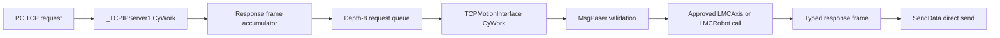

# LASAL CyWork 전용 TCP 실행 설계

작성일: 2026-07-13
대상: `Lasal_PRG/Elmo_EtherCAT_Test_4Axis`
상태: 2026-07-16 9축 dispatcher와 group API/large frame queue 반영,
LASAL IDE Rebuild/PLC 재검증 대기

`Motion_Network.lcn`과 `ONE_Motion_Network_Table.st`는 no-RT 설정으로 함께
재생성됐다. `_TCPIPServer1.Config=0`, `MaxConnections=1`이며
`TCPMotionInterface1`은 cyclic table에만 있고 RT task entry가 없다. 이전
no-RT baseline의 Rebuild/Link는 성공했지만 2026-07-14 group handler와 buffer
확장 뒤 현재 source는 아직 Rebuild/Link하지 않았다.

## 1. 결정

`TCPMotionInterface`에는 RT Task를 사용하지 않는다.

- `TCPMotionInterface.RealtimeTask=false`
- `TCPMotionInterface.CyclicTask=true`, `DefCyclictime=1 ms`
- TCP transport는 일반 `_TCPIPServer1`을 사용한다.
- `_TCPIPServer1.Config=0`으로 별도 AP task를 만들지 않고 CyWork 하나가
  `CyclicCall()`을 소유한다.
- `_TCPIPServer1.MaxConnections=1`로 현재 single-session 구현과 맞춘다.
- RT request/result mailbox, `RtWork()` override, `sigclib_atomic_*` 호출은
  `TCPMotionInterface`에서 사용하지 않는다.

이 결정은 TCP API interface에만 적용된다. physical 축 1..4와 simulated 축
5..9의 `_LMCAxis` RT task까지 제거한다는 뜻은 아니다.

## 2. 빌드 에러 원인

LASAL IDE가 queue/mailbox `State`를 enum 타입인 `_TCPMI_QUEUE_STATE`와
`_TCPMI_RT_STATE`로 생성했지만, 기존 코드는 이 주소를 `UDINT` 전용
`sigclib_atomic_*U32` 함수에 전달했다. 따라서 다음 형태의 E0012가 발생했다.

```text
Different types: using '_TCPMI_RT_STATE' instead of 'UDINT'
Different types: using '_TCPMI_QUEUE_STATE' instead of 'UDINT'
```

단순 캐스팅으로 덮지 않았다. RT mailbox 자체를 제거하고, 동일 cyclic task에서
순차 실행되는 queue 상태를 enum 직접 대입으로 바꿨다.

## 3. 현재 실행 경로



queue 상태 전이는 다음과 같다.

- producer `Response()`: `FREE -> WRITING -> READY`
- consumer `CyWork()`: `READY -> ACTIVE -> FREE`
- 한 CyWork scan에서 최대 한 요청만 실행한다.
- `Response()`는 parser, axis call, TCP send를 직접 실행하지 않는다.
- receive accumulator는 2,048 bytes, request buffer는 1,328 bytes, 각 queue
  entry의 payload는 1,320 bytes다. 따라서 8-byte header와 1,320-byte
  `0x20E7` payload를 같은 accumulator/queue 경로에서 처리한다.

이 plain enum 전이는 `_TCPIPServer1` callback과 `TCPMotionInterface1.CyWork`가
동일 cyclic task에서 순차 실행된다는 조건에서만 유효하다. 다른 task나 AP async
task로 분리하면 data race가 생기므로 현재 구현을 그대로 사용하면 안 된다.

### Request entry를 local DINT로 복사하는 규칙

queue entry의 `CommandId`, `Reference`, `PayloadLength`, `Reserved`는 연속된
`UINT`다. postfix `$DINT`로 각 필드를 읽으면 32비트 숫자 변환이 아니라 인접
필드까지 포함한 memory overlay가 된다. 실제 PLC 디버거에서 정상 AxisInfo
request가 다음처럼 손상되는 것을 확인했다.

| 값 | 기대값 | 잘못된 `$DINT` 결과 |
|---|---:|---:|
| Command ID | `0x202B` / 8235 | `0x0001202B` / 73771 |
| Axis reference | `1` | `0x000C0001` / 786433 |
| Payload length | `12` | `12` (`Reserved=0`이라 우연히 일치) |

따라서 CyWork는 세 값을 각각 `TO_DINT(...)`로 숫자 확대한다. byte buffer의
wire overlay는 유지하지만 typed scalar field의 확대 변환에는 postfix cast를
사용하지 않는다.

## 4. 활성 명령 범위

protocol 범위는 기존 캡처 기반 23개와 LASAL project-local extension 2개
(`0x204A/0x204B`)로 구분한다. local extension 2개를 캡처 명령 수에 포함하지
않는다. 아래 runtime axis/group control·read·motion 범위는 axis 8개 + group
10개, 총 18개다. lifecycle과 name/member metadata handler는 이 수에서 제외한다.

| 명령 | 실행 위치 | 동작 |
|---|---|---|
| `0x2023 Power` | `MsgPaser()`의 CyWork context | `LMCAxis1..9.PowerOn()` 또는 `PowerOff()` 호출, ACK |
| `0x2024 Reset` | `MsgPaser()`의 CyWork context | `LMCAxis1..9.QuitError()` 호출, ACK |
| `0x2022 Stop` | `MsgPaser()`의 CyWork context | `LMCAxis1..9.StopMove()` 호출, ACK |
| `0x202E ReadActualPosition` | `MsgPaser()`의 CyWork context | 연결 확인 후 `LMCAxis1..9.ReadPosition()` 호출, 16바이트 응답 |
| `0x2028 ReadStatus` | `MsgPaser()`의 CyWork context | 연결 확인 후 `ReadAxisStatus()`와 `ReadAxisError()` 호출, 20바이트 응답 |
| `0x209F MoveAbsoluteEx` | `MsgPaser()`의 CyWork context | `LMCAxis1..9.MoveShortestWay()` 호출, ACK |
| `0x20A0 MoveRelativeEx` | `MsgPaser()`의 CyWork context | `LMCAxis1..9.MoveRelative()` 호출, ACK |
| `0x20A2 MoveVelocityEx` | `MsgPaser()`의 CyWork context | `LMCAxis1..9.MoveEndless()` 호출, ACK |
| `0x204A GroupPowerOn` | `MsgPaser()`의 CyWork context | LASAL project-local extension. 비동기 `LMCRobot.RobotOn()` 시작 요청, 접수 ACK |
| `0x204B GroupPowerOff` | `MsgPaser()`의 CyWork context | LASAL project-local extension. 비동기 `LMCRobot.RobotOff()` 시작 요청, 접수 ACK |
| `0x2047 GroupEnable` | `MsgPaser()`의 CyWork context | 검증된 static mapping을 `LMCRobot.LockProfile()`로 lock, ACK |
| `0x2048 GroupDisable` | `MsgPaser()`의 CyWork context | `ProfileInPosition` 확인 뒤 `LMCRobot.UnlockProfile()`로 profile unlock, ACK |
| `0x2045 GroupReadStatus` | `MsgPaser()`의 CyWork context | local `0x00040000=Power Ready`, Maestro 표준 `0x00020000=NC_GROUP_STANDBY_MASK`/`0x00010000=NC_GROUP_DISABLED_MASK`를 현재 lock/unlock 조건에 mapping하고 profile error 반환 |
| `0x2049 GroupReset` | `MsgPaser()`의 CyWork context | 축/하드웨어 오류용 `LMCRobot.AxQuitError(AxisNo:=0)` 호출, ACK |
| `0x2085 GroupStop` | `MsgPaser()`의 CyWork context | `LMCRobot.StopMove(Mode:=3, Decel, Jerk)` 호출, command 접수 ACK |
| `0x20A4 MoveLinearAbsoluteEx` | `MsgPaser()`의 CyWork context | static 4축과 승인된 mode를 검사해 `LMCRobot.MoveLinearCoord()` 호출, ACK |
| `0x2051 GroupReadActualPosition` | `MsgPaser()`의 CyWork context | `GetRobotPosition()`의 Pos1..Pos9를 현재 source가 복사, 76바이트 frame/68바이트 payload 반환; 공개 4-vs-9 read 계약 재확정 필요 |
| `0x20E7 SetKinTransformCartesian4Axis` | `MsgPaser()`의 CyWork context | exact 1,320-byte X/Y/Z/U identity 요청의 static mapping 검증/설정만 수행, 4바이트 ACK payload; profile lock은 하지 않음 |
| RPC init/callback/close, name lookup | CyWork | 기존 non-motion 처리 유지 |

기존 deterministic unsupported 5개는 source에서 활성화됐다. 다음 제한은
runtime에서 검사하며 위반 시 `-7`을 반환한다.

| 명령 | 현재 승인 범위 |
|---|---|
| `0x2085 GroupStop` | `Aborting(1)`, `Execute=1`, decel/jerk nonnegative, jerk>0이면 decel>0 |
| `0x20A4 MoveLinearAbsoluteEx` | position 4축만 사용, slot 5..16=0, coordinate None, ExactStop/ContinuousDirect, Aborting/Buffered |
| `0x2051 GroupReadActualPosition` | None/ACS는 static member-slot alias, MCS/PCS는 `-7`, unknown enum은 `-3`으로 거부 |
| `0x20E7 SetKinTransformCartesian4Axis` | exact X/Y/Z/U identity-shift, axis reference 1..4, Cartesian, Buffered만 허용; dynamic transform 생성 아님 |

`GroupReset` ACK는 axis/hardware error reset 호출이 실행됐다는 뜻이다. robot
profile error 전체 해제를 보장하지 않는다. `GroupStop` ACK도 정지 완료가 아니라
stop command 접수 결과이므로 두 명령 모두 후속 `GroupReadStatus` 확인이 필요하다.
nonzero group Jerk를 적용하기 위해 canonical `_LMCRobotBase1`은
`MoveType=_JERK_PROFILE`, `JMax=50000 mm`로 저장한다.

정상 group 순서는 `0x204A PowerOn -> 0x2045 IsPowerOn(0x00040000) 확인 ->
0x20E7 SetKin -> 0x2047 Enable/LockProfile -> motion ->
0x2048 Disable/UnlockProfile -> 0x204B PowerOff -> IsPowerOn=false 확인`이다.
`0x204A/0x204B` ACK는
비동기 `RobotOn`/`RobotOff` 시작 요청 접수이며 최종 servo ready/off 완료가 아니다.
두 command는 기존 23개 캡처 명령이 아니라 승인된 LASAL local extension이다.

`MoveCircle`은 공개 C# API와 승인된 LASAL-DINT command ID/payload 계약이 없어
현재 활성 명령 범위가 아니다.

각 활성 command는 canonical C# serializer와 같은 payload length, descriptor,
execute/direction/buffer field를 검사한다. `0x2028`은 header/payload descriptor
일치와 `Execute=1`도 검사한다. `0x202E`은 payload 길이 1, payload byte 0,
descriptor 1..9를 검사한다. client 미연결은 `-2`, 잘못된 frame/descriptor는
`-3`, 지원 범위 밖 motion 조합은 `-7`이다.

### 기존 DummyMMCLib와 byte offset 대조

`Codex_LASAL_WPF/PmasApiWpfTestApp/Services/SigmatekTcpIpDummyMMCLib.cs`도
확인했지만 이 파일은 일부 PMAS/LREAL legacy frame을 의도적으로 보존한 별도
dummy다. 현재 LASAL-DINT serializer와 무조건 같은 계약으로 취급하지 않는다.

| 명령 | DummyMMCLib | 현재 `LmcProtocol`/LASAL | 판정 |
|---|---|---|---|
| `0x202E` | 9B, header 8B + payload byte `0` | 동일 | offset 일치 |
| `0x209F` | 64B, payload 56B, motion `INT64` 5개 | 40B, payload 32B, motion DINT 5개 + direction/buffer/execute | legacy와 LASAL-DINT 의도적 차이 |
| `0x2045` | 16B지만 header ref를 0으로 강제하고 offset 4/6을 `UINT16` 두 개로 기록 | 16B, payload length `UINT16=8`[4], descriptor `0x0100`[6], execute `1` | current descriptor 계약 사용 |
| `0x2047/0x2048` | 빈 `GroupEnable/GroupDisable` method라 송신 frame 없음 | 9B, command[0], payload length 1[4], descriptor `0x0100`[6], Execute=1[8] | current LASAL profile Lock/Unlock 계약 사용 |
| `0x204A/0x204B` | 대응 method/frame 없음 | 위와 같은 9B ExecuteOnly frame | 기존 dummy/capture가 아닌 LASAL-local Group Power extension |
| `0x20A4` | 312B LREAL vector/dynamics, 내부에서 `10000` 곱셈 | 104B DINT payload 96B, DLL 내부 UNIT 변환 없음 | legacy와 의도적 차이, current LASAL source는 static 4축 제한으로 활성 |

따라서 current test에는 `LMC_Library/LasalApiWpfTestApp` 예제와
`LMC_API_Delivery/src/LmcProtocol.cs`를 사용한다. DummyMMCLib의 LREAL offset을
`TCPMotionInterface`에 다시 적용하지 않는다.

Power/Stop/Move와 현재 group API는 source에서 활성화됐지만 current IDE rebuild와
PLC 안전 시험 전에는 production 동작으로 승인하지 않는다.

## 5. task와 core 조건

RT Task를 제거했다고 해서 task/core 제약이 사라지는 것은 아니다.

1. `_TCPIPServer1`과 `TCPMotionInterface1`은 같은 cyclic task에서 실행한다.
2. `Config=0`을 명시해 server callback owner를 CyWork 하나로 고정한다.
3. `_LMCAxis` method 호출 thread는 axis realtime thread와 같은 CPU core에 두고,
   우선순위는 axis realtime task와 같거나 낮게 둔다.
4. TCP 처리까지 그 core에 들어가므로 PLC에서 RT cycle jitter를 측정한다.

현재 `.lcn`에는 server/interface 모두 `CyclicTime=1 ms`가 설정돼 있다. 생성
테이블에서 같은 cyclic task인지 확인할 수 있지만 CPU core는 LASAL IDE의 task
설정과 online 상태에서 다시 확인해야 한다.

## 6. LASAL IDE 적용 절차

1. 외부 변경 파일을 reload한다.
2. `TCPMotionInterface` class property에서 RealTime Task를 비활성화하고 Cyclic
   Task만 `1 ms`로 둔다.
3. `TCPMotionInterface1` object의 `RealTime` assignment가 없는지 확인한다.
4. `_TCPIPServer1.Config=0`, `MaxConnections=1`, `CyclicTime=1 ms`를 확인한다.
5. `_TCPIPServer_RT1`은 `TCPMotionInterface1`에 연결하거나 task에 배치하지 않는다.
6. Network와 CodeGenerator를 저장·재생성한다.
7. 생성 RT task table에 `TCPMotionInterface1`이 없고 cyclic table에만 있는지
   확인한다.
8. Build/Rebuild/Link를 수행한다.
9. `TCPMotionInterface`의 Find in Implementation smoke test를 수행한다.
10. smoke 시작 이후 `%TEMP%\Lasal2.log`에 새 `CInvalidArgException`이 없는지
    확인한다.

## 7. 검증 기준

정적 계약은 아래를 검사한다.

- RT mailbox symbol, `RtWork()` override, `sigclib_atomic_*` 0건
- depth-8 queue와 direct enum 상태 전이
- request entry의 `UINT` 필드 세 개를 `TO_DINT(...)`로 숫자 확대하고
  `ActiveRequest.<field>$DINT`를 사용하지 않음
- `Response()` callback isolation
- axis Power/Reset/Stop/Read/Move 8개 command의 request validation, 1..9축 dispatch와 ACK/typed response
- group 10개 runtime control/read/motion command의 descriptor, payload validation, LASAL method와 response
- receive 2,048 bytes, request 1,328 bytes, queue payload 1,320 bytes와
  fragmented/combined large-frame bound
- `0x20A4` static 4축/mode 제한, `0x2051` exact 68-byte response,
  `0x20E7` exact identity/4-byte ACK 계약
- 일반 `_TCPIPServer1` 연결, `Config=0`, `MaxConnections=1`
- `TCPMotionInterface1` RealTime assignment 부재

PLC에서는 추가로 아래를 확인한다.

- physical axis 1..4와 simulated software axis 5..9에서 `0x202E` 값이 각
  LASAL object의 실제 위치와 일치
- physical axis 1..4와 simulated software axis 5..9에서 `0x2028`
  status/error가 각 native 값과 일치
- Power/Reset/Stop은 local safety chain을 준비한 상태에서 command ACK와 실제 상태를 대조
- MoveAbsolute/Relative/Velocity는 무부하·저속·짧은 이동으로 순차 검증
- GroupPowerOn ACK 뒤 `IsPowerOn(0x00040000)`까지 확인하고, PowerOff ACK도 실제 off 상태와 대조
- GroupEnable/Disable은 각각 `LockProfile`/`UnlockProfile`과 `0x00020000`/`0x00010000` 상태를 대조
- GroupReset/GroupStop은 실제 error/stop 상태와 ACK를 대조
- MoveLinear는 static 4축, None, 승인된 transition/buffer 조합에서만 짧게 검증
- GroupReadActualPosition은 tracked handler가 채우는 slot 1..9와 실제
  axis-order position을 대조하고, PLC 재캡처 뒤 4축-only 또는 9축 readback 중
  하나를 공개 계약으로 확정
- SetKin은 exact 1,320-byte identity request, 4-byte ACK와 static mapping만 대조하고 profile lock을 기대하지 않음
- 승인 범위 밖 group mode가 `-7`이고 client motion을 시작하지 않는지 확인
- fragmented/combined/burst frame 순서 유지
- disconnect/reconnect 후 이전 session 요청 폐기
- 1 ms cyclic task 및 motion RT cycle jitter
- TCP send 실패 시 session quarantine와 reconnect 동작

기존 no-RT network의 LASAL IDE build는 완료했지만 2026-07-14 group handler와
buffer 확장 이후 Rebuild/Link와 PLC download는 다시 수행해야 한다. PLC runtime
검증과 packet 재캡처 전에는 실기 완료 또는 production 승인으로 표시하지 않는다.
