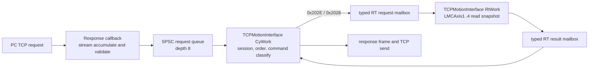

# LASAL Source Queue and Network Apply Plan

작성일: 2026-07-10

최종 갱신: 2026-07-13

대상 프로젝트: `Lasal_PRG/Elmo_EtherCAT_Test_4Axis`

상태: **2026-07-13 RT mailbox 안 폐기 / 과거 적용 기록**

> 현재 구현은 `TCPMotionInterface` RT Task와 RtWork mailbox를 제거한
> CyWork-only 구조다. 아래 본문 중 RtWork, typed mailbox, RealTime=1 ms 설정은
> 더 이상 적용하지 않는다. 아래의 4축 client 설명도 현재 9축 single-axis
> dispatcher 범위가 아니다. 현재 System of Record는
> `LASAL_CYWORK_ONLY_TCP_EXECUTION_DESIGN_2026-07-13.md`와
> `../../../docs/architecture/ELMO_MASTER_CURRENT_ARCHITECTURE_AND_RELEASE_STATUS_2026-07-16.md`다.

## 1. 결론

이번 단계는 `TCPMotionInterface`의 첫 번째 axis client 이름을 `LMCAxis`에서
`LMCAxis1`로 명확히 바꾸고, TCP callback에서 motion object를 직접 호출하던
경로를 queue와 `CyWork`/`RtWork` 경계로 분리하는 소스 구현이다.

현재 source에서 허용한 실제 실행 범위는 read-only `0x202E
ReadActualPosition`과 `0x2028 ReadStatus`다. 기존
handler body가 있더라도 다른 axis/group client call과 state-changing command는
해당 명령을 안전한 mailbox 경로로 옮기기 전까지 deterministic error `-5`를
반환해야 한다. 이 제한은 기능 삭제가 아니라 실제 장비 오동작을 막는 migration
gate다.

LASAL IDE 동기화로 legacy `LMCAxis` client는 제거되고 `LMCAxis1` client와
`RealTime/CyclicTime=1 ms`가 저장됐다. axis 1 connection은 사용자가 IDE에서
완료했으며 이 작업에서는 네트워크를 더 수정하지 않는다. 최종 project save와
strict network contract로 생성 결과를 확인해야 한다. LASAL IDE compile, PLC
download, 실제 packet 재캡처는 아직 완료되지 않았으므로 production 완료로
판정하지 않는다.

2026-07-13 IDE load/build check에서는 설치된 MotionLib가 참조하는
`_DriveMngBase/DriveComL2.h`를 읽지 못해 `E0015`가 발생했다. project compiler
C78과 Hardware/MotionLib/OS Interface/System/Tools library C81 간 version
warning도 남아 있다. 이 오류는 현재 `TCPMotionInterface` source contract와
별개지만 build/link 0-error 증거를 막는다.

## 2. 소스 구현 범위

### 2.1 client 이름

- `TCPMotionInterface` 첫 번째 typed client의 source 이름을 `LMCAxis1`로 바꾼다.
- client type은 기존과 같은 `CltChCmd__LMCAxis`다.
- `_LMCAxis` class/type 이름과 PC public API의 `LMCAxis` 이름은 바꾸지 않는다.
- CodeGenerator client-name hash는 `LMCAxis1` 기준 `1663666918`을 사용하고,
  `_LMCAxis` type hash `1422175863`은 유지한다.

### 2.2 실행 pipeline



역할은 다음처럼 고정한다.

| 실행 위치 | 허용 작업 | 금지 작업 |
|---|---|---|
| `Response()` | TCP stream 누적, header/payload bound 검사, 완성 frame 복사, queue publish | `MsgPaser()`, client call, response 송신 |
| `CyWork()` | queue consume, socket/epoch 검증, non-RT RPC·lookup 처리, RT mailbox publish, result framing과 송신 | TCP command path에서 `_LMCAxis`/`_LMCRobot` method 직접 호출 |
| `RtWork()` | typed mailbox의 승인된 client call을 scan당 최대 1개 실행, typed result publish | TCP, 문자열 lookup, 동적 메모리, wait, `SendData()` |

request queue는 depth 8의 고정 SPSC queue다. 각 entry는 최소한 sequence,
socket, session epoch, command ID, reference, payload length와 최대 96-byte
payload를 보존한다. queue full에서는 기존 entry를 덮어쓰지 않고 local
command error `-8`을 예약한다.

queue와 RT request/result mailbox의 상태 전이는 LASAL/SigCLib의 32-bit atomic
primitive로 publish한다. state field는 32-bit aligned first field로 두며,
producer는 data를 모두 기록한 뒤 `READY`를 마지막에 publish하고 consumer는
`READY`를 claim한 뒤에만 data를 읽는다.

96-byte를 넘는 request는 accumulator에 끝까지 복사하지 않는다. header에서
declared frame 길이를 확정한 뒤 error `-5`를 예약하고
`IngressDiscardRemaining`만큼 bounded discard하여 다음 TCP frame 경계를
회복한다. fault response와 discard 중 늦게 끝나는 쪽까지 ingress를 막는다.
rejected frame 뒤의 partial frame까지 이미 accumulator에 섞였거나
`DataHandling()` contract를 벗어난 overflow가 발생하면 경계를 증명할 수 없으므로
P0는 해당 socket을 quarantine하고 PC reconnect를 요구한다. 정상 exact drain이
끝난 경우에만 같은 connection을 다시 연다.

### 2.3 read-only 실행 command

첫 command인 `0x202E ReadActualPosition`은 다음 경로를 연다.

1. `CyWork()`가 descriptor 1..4와 session을 검증한다.
2. typed RT request mailbox에 reference와 request identity를 publish한다.
3. `RtWork()`가 descriptor에 맞는 `LMCAxis1..4` client에서
   `ReadPosition(LMCAXIS_ACTPOS_APPUNIT)`을 실행한다.
4. `RtWork()`가 position, status/error와 request identity를 typed result
   mailbox에 publish한다.
5. `CyWork()`가 exact LASAL-DINT response frame을 만들고 request socket으로
   전송한다.

P0의 작은 RPC/axis response는 `CyWork()`에서 `bDirect=TRUE` 한 방식으로만
보낸다. buffered response와 direct response를 섞으면 뒤 request의 response가
먼저 wire에 나갈 수 있으므로, buffered TX 전환은 ordered TX state machine과
함께 별도 단계로 수행한다. `SendData()` override는 exact full-size return만
성공으로 인정한다. partial/error return은 동일 frame을 재전송하지 않고 session
epoch를 폐기하고 socket을 quarantine하여 reconnect를 요구한다.

두 번째 read-only command인 `0x2028 ReadStatus`도 같은 mailbox를 사용한다.
`CyWork()`는 payload의 duplicated descriptor와 exact `execute=1` field를 검증하고,
`RtWork()`는 선택한 축의 `ReadAxisStatus()`와 `ReadAxisError()`를 호출한다.
response는 12-byte payload로 native status 32-bit, function status/error,
lower 16-bit axis error와 reserved status-word `0`을 반환한다.

PC가 보내는 `0x202E`/`0x2028` request와 LASAL response offset은 canonical
`LMC_Library/LMC_API_Delivery/src` serializer/parser 및 golden test와 byte
단위로 대조한다. `Codex_LASAL_WPF` dummy는 legacy PMAS/hybrid frame이 남아
있어 이 계약의 E2E client로 사용하지 않는다. RT result가 준비되기 전에는
다음 active request를 완료 처리하지 않는다.

### 2.4 차단 범위

기존 source에 handler body가 있어도 아래 client-call command는 mailbox로
migration하기 전까지 실행하지 않고 error `-5`를 반환한다.

- Axis: `0x2023`, `0x2024`, `0x2022`, `0x209F`, `0x20A0`, `0x20A2`
- Group: `0x2047`, `0x2048`, `0x2045`, `0x20A4`
- 이미 unsupported인 GroupReset `0x2049`, GroupStop `0x2085`

RPC lifecycle, object lookup, AxisInfo, GroupMembers처럼 motion client call이
없는 command는 `CyWork()`에서 처리할 수 있다. unknown command는 기존
unsupported command `-4`를 유지한다. `0x2051`과 `0x20E7`은 별도 payload 및
mapping 구현 전까지 실행 범위가 아니다.

`RobotPowerOn/Off/Lock/UnLock::Write`는 기존 server-channel write handler이며
TCP command parser 경로 밖에 남아 있다. 따라서 “client call은 RtWork만 실행”
규칙은 이번 단계에서는 TCP API 경로에 한정한다. 이 네 legacy channel은
production 전에 network에서 미사용을 확인하거나 mailbox로 이관해야 한다.

### 2.5 TCP wrapper

`_TCPIPServer_RT::RtWork()`에서는 `CyclicCall()`을 호출하지 않는다. TCP
accept/receive/send backend의 owner는 하나여야 하며 P0 network 적용안은
`Config=0`의 CyWork owner 하나다. `TCPMotionInterface::RtWork()`는 TCP를
처리하지 않고 motion mailbox만 소비한다.

## 3. 이번 단계에서 하지 않는 변경

아래 항목은 LASAL IDE/network 적용 단계로 남긴다.

- `Motion_Network.lcn` 직접 수정
- `ONE_Motion_Network_Table.st`, `Classes.lcb`, `Networks.lcb`, project `.lcb`
  수동 편집
- LASAL IDE class model/CodeGenerator 재생성
- LASAL IDE build와 PLC download
- Power, Reset, Stop, Move, group client call 활성화
- `0x2051`, `0x20E7`, 실제 UDP callback event 구현

미추적 복제본 `Elmo_EtherCAT_Test_4Axis_Edit`는 대상이 아니다.

## 4. LASAL IDE와 network 적용 설계

### 4.1 class model

LASAL IDE에서 canonical project를 연 뒤 `TCPMotionInterface` class model의 첫
client 이름을 `LMCAxis`에서 `LMCAxis1`로 바꾼다. queue entry, RT request/result,
atomic state, discard/fault state, `DataHandling()`/`SendData()` override와
session/sequence member도 source 선언과 동일하게 model에 등록한다. 생성 영역을
수동으로 덮어쓰는 방식으로 끝내면 다음 IDE 저장에서 소스가 사라질 수 있으므로
CodeGenerator 재생성 diff를 반드시 검토한다.

### 4.2 network 연결

첫 번째 axis 연결은 아래 한 쌍으로 적용한다.

```text
TCPMotionInterface1.LMCAxis1 -> _LMCAxis1.Control
```

나머지 연결은 이름과 target을 그대로 유지한다.

```text
TCPMotionInterface1.LMCAxis2 -> _LMCAxis2.Control
TCPMotionInterface1.LMCAxis3 -> _LMCAxis3.Control
TCPMotionInterface1.LMCAxis4 -> _LMCAxis4.Control
TCPMotionInterface1.LMCRobot -> _LMCRobotBase1.Control
```

source를 먼저 바꾼 현재 상태에서 network가 여전히 `LMCAxis`를 가리키면 첫
axis client는 연결 완료로 볼 수 없다. 임시 alias를 추가하지 말고 IDE에서
source와 network 이름을 `LMCAxis1`로 일치시킨다.

### 4.3 task와 server channel 값

IDE network/property에서 아래 값을 적용한다.

| 대상 | 값 | 목적 |
|---|---:|---|
| `TCPMotionInterface1.CyclicTime` | `1 ms` | queue coordinator와 response owner 주기 |
| `TCPMotionInterface1.CyWork` task/core | `_TCPIPServer_RT1.CyWork`와 동일 | callback/session/fault state의 단일 cyclic owner |
| `TCPMotionInterface1.RealTime` | `1 ms` | typed RT mailbox 실행 주기 |
| `TCPMotionInterface1.RtWork` core | `_LMCAxis1..4`와 같은 RT core | client method same-core 조건 |
| `_TCPIPServer_RT1.Config` | `0` | TCP backend를 CyWork 한 곳에서만 실행 |
| `_TCPIPServer_RT1.MaxConnections` | `1` | P0 single-session과 accumulator 전제 고정 |

`_TCPIPServer_RT1.SizeOfTXBuffer=4096`은 buffered TX와 1358-byte
GroupMembers response를 활성화하는 후속 단계에서 적용한다. 값을 키우면 같은
buffer 설정이 RX read에도 영향을 주므로 `DataHandling()`의 free-space/read
cap을 같이 구현·검증하기 전에는 이번 `0x202E` 단계의 완료 조건으로 넣지
않는다.

### 4.4 예상 생성·등록 파일

IDE class/network 변경 후 최소한 아래 파일의 생성 diff를 검토한다.

- `Lasal_PRG/Elmo_EtherCAT_Test_4Axis/Class/TCPMotionInterface/TCPMotionInterface.st`
- `Lasal_PRG/Elmo_EtherCAT_Test_4Axis/Class/Classes.lcb`
- `Lasal_PRG/Elmo_EtherCAT_Test_4Axis/Network/Motion_Network/Motion_Network.lcn`
- `Lasal_PRG/Elmo_EtherCAT_Test_4Axis/Network/Motion_Network/ONE_Motion_Network_Table.st`
- `Lasal_PRG/Elmo_EtherCAT_Test_4Axis/Network/Networks.lcb`
- `Lasal_PRG/Elmo_EtherCAT_Test_4Axis/Elmo_EtherCAT_Test_4Axis.lcb`

프로젝트/IDE 버전에 따라 추가 registration file이 바뀌면 생성된 전체 diff를
검토하되 `ProjectInternal/`, `.lba`, `.lob`, `.ldi`는 설계 근거나 기본 Git
추적 대상으로 사용하지 않는다.

## 5. 검증 gate

### Gate A: source 정적 검사

- standalone first-client 이름 `LMCAxis`가 없고 `LMCAxis1`만 있는지 확인
- `LMCAxis1` name hash `1663666918`, `_LMCAxis` type hash `1422175863` 확인
- `Response()`에 `MsgPaser()`, client call, `SendData()`가 없는지 확인
- request queue depth 8, payload bound 96, socket/epoch/sequence 보존 확인
- oversize exact discard와 partial-following-frame quarantine 분기 확인
- queue/mailbox state가 32-bit atomic으로 마지막에 publish되는지 확인
- RT result/fault response가 partial send에서 full-frame retry되지 않는지 확인
- `TCPMotionInterface::RtWork()`에 TCP, 문자열, wait, 동적 메모리가 없는지 확인
- `_TCPIPServer_RT::RtWork()`에 `CyclicCall()`이 없는지 확인
- `0x202E`, `0x2028` 외 client/state-changing command가 `-5`로 끝나는지 확인
- canonical C# API와 `0x202E`/`0x2028` request/response offset 대조
- 새 LASAL custom source에 7-bit ASCII 이외 문자가 없는지 확인
- `git diff --check`와 관련 static contract test 실행

현재 `RunLasalContract`는 `-SourceOnly`로 source-first gate를 검사한다.
`RunLasalNetworkContract`는 IDE network까지 포함한 strict gate다. 사용자가
완료한 axis 1 connection과 아래 task/config를 최종 저장한 뒤 strict gate도
PASS해야 한다.

### Gate B: LASAL IDE model/network

- class/type/network를 IDE에서 regenerate하고 compile error 0 확인
- 기존 warning을 분류하고 새 warning 0 확인
- generated client count, member/type, `@CT_`, `@STD`와 source 일치 확인
- `LMCAxis1 -> _LMCAxis1.Control` link 확인
- CyclicTime/RealTime `1 ms`, server/interface 동일 CyWork task/core, RT core,
  Config `0`, MaxConnections `1` 확인
- Object Network Server/Client에서 `Find in Implementation` smoke test 수행
- 변경 function/method는 `Edit Method` 또는 `Enter`로 exact Implementation header 직접 open
- smoke 시작 이후 `%TEMP%\Lasal2.log`에 새 `CInvalidArgException`이 없는지 확인

### Gate C: PLC read-only 시험

1. RPC init, callback register, axis lookup과 descriptor 1..4를 확인한다.
2. 각 descriptor의 `0x202E`가 서로 다른 실제 axis position을 반환하는지 본다.
3. 각 descriptor의 `0x2028`이 해당 축의 native status/error snapshot을 반환하는지 본다.
4. invalid reference는 다른 axis를 호출하지 않고 정해진 error로 끝나야 한다.
5. 차단된 Power/Stop/Move/group command는 `-5`를 반환하고 실제 상태를 바꾸지
   않아야 한다.
6. partial header/payload, combined frame, depth-8 burst와 queue full을 시험한다.
7. disconnect/reconnect 뒤 old epoch request가 실행되지 않는지 확인한다.
8. response socket, sequence와 request 순서가 일치하는지 확인한다.
9. 1 ms CyWork/RtWork에서 cycle jitter와 mailbox 지연을 기록한다.
10. PC request/LASAL response를 Wireshark로 재캡처한다.

Gate C가 끝나기 전에는 `0x202E`와 `0x2028`을 실제 PLC 검증 완료로 표시하지 않는다.

## 6. 후속 migration 순서

1. `0x202E ReadActualPosition`, `0x2028 ReadStatus` read-only E2E
2. 나머지 read/admin command
3. Power, Reset, 기능상 Stop
4. MoveAbsolute, MoveRelative, MoveVelocity
5. group lookup/read 경로
6. 승인된 group enable/disable/motion semantics
7. `0x2051`, `0x20E7`, callback event와 multi-PC ownership

각 단계는 mailbox type, response contract, PLC smoke와 packet 재캡처를 함께
끝낸 뒤 다음 단계로 넘어간다. API queue의 Stop은 safety-rated emergency stop을
대체하지 않는다.

## 7. 현재 완료 판정

| 항목 | 상태 |
|---|---|
| canonical source 대상 | `Lasal_PRG/Elmo_EtherCAT_Test_4Axis`로 고정 |
| `LMCAxis1` source rename | source와 IDE class model 반영, 최종 network save/strict 확인 대기 |
| depth-8 queue/CyWork/typed mailbox | 소스 반영 완료, LASAL compile·runtime 검증 대기 |
| 실제 client-call 허용 | read-only `0x202E`, `0x2028` 허용 |
| 다른 client/state-changing command | migration 전 `-5` 차단 |
| network/task property | axis 1 connection은 사용자 완료, `Config/MaxConnections`와 task/core 확인 대기 |
| PLC E2E | `0/23`, `0x202E`/`0x2028` 포함 모두 미검증 |
| production 배포 | 불가 |

관련 상세 설계는
`LASAL_COMMAND_QUEUE_RTWORK_DESIGN_2026-07-10.md`와
`LASAL_OBJECT_DISPATCHER_DESIGN_2026-07-10.md`를 함께 본다. 이전 queue 문서의
“설계 전용 / 구현 미승인” 표기는 당시 checkpoint의 상태이며, 이번 문서는
사용자가 승인한 source-first 최소 구현 범위와 남은 IDE 적용 경계를 기록한다.
