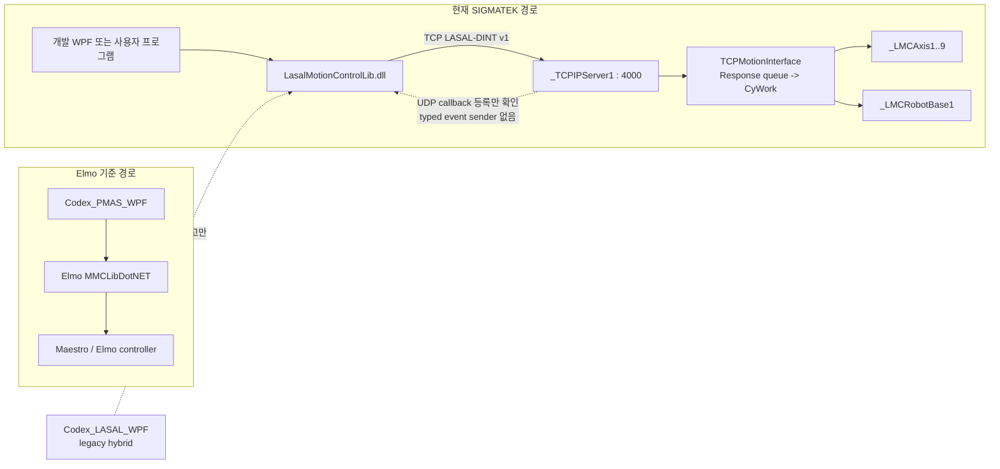

# Elmo Master 현재 아키텍처 및 릴리스 상태 재분석

- 감사일: 2026-07-16
- 마지막 source 상태 검토: 2026-07-22 diagnostics D1~D4 single-bank 및 PMAS native
  capture 정렬
- 기준 branch: `main`
- 감사 시작 기준 commit: `f8f99a299f72c118c9a243d0165368d666d0cd0f`
- 현재 API 표기: `LasalMotionControlLib 0.9.1-preview`
- 판정: PC source와 LASAL 정적 계약은 통과했지만 production 승인본은 아님

이 문서는 현재 Git source를 다시 대조해 프로젝트 전체의 역할, 구현 범위,
검증 수준과 남은 위험을 한곳에 고정한 기준 문서다. 날짜가 더 오래된 설계·분석
문서와 충돌하면 현재 source, 자동 계약 검사, 이 문서 순서로 판단한다.

## 1. 판정 용어

이 문서에서는 다음 상태를 구분한다.

- **확인**: 현재 Git source, tracked network 또는 이번 감사에서 직접 실행한 빌드로 확인했다.
- **정적 검증**: serializer/parser/source/network의 문자열·offset·shape 계약을 자동 검사했다.
- **미검증**: LASAL IDE, 다운로드된 PLC 또는 실제 장비에서 확인한 증거가 없다.
- **추정**: source 구조로 가능성을 판단했지만 runtime 증거가 없다.

`source-active`, `build PASS`, `static contract PASS`는 PLC 동작 완료와 같은 뜻이 아니다.

## 2. 핵심 결론

| 항목 | 현재 상태 | 판정 |
|---|---|---|
| PMAS/MMCLib 기준 앱 | `Codex_PMAS_WPF` | 비교·벤치마크 기준, LASAL 배포 앱이 아님 |
| 구 LASAL WPF | `Codex_LASAL_WPF` | 실제 TCP 일부와 local simulation/no-op이 섞인 legacy hybrid 참고 앱 |
| 현재 PC API source | `LMC_Library/LMC_API_Delivery/src` | canonical |
| 현재 개발·실기 진단 WPF | `LMC_Library/LasalApiWpfTestApp` | canonical API source ProjectReference 사용 |
| 외부 배포 예제 | `LMC_Library/LMC_API_Distribution` | 내부 PLC 시험 종료 전 동결; 현재 완료 기준에서 제외 |
| 현재 PLC source | `Lasal_PRG/Elmo_EtherCAT_Test_4Axis` | canonical tracked LASAL project |
| single-axis 범위 | descriptor `1..9` | 축 1~4 physical, 축 5~9 simulated |
| Cartesian group move/lock | X/Y/Z/U 축 1~4 | 9축 group interpolation이 아님 |
| 기존 motion/group command | 25개 | 캡처 기반 23 + local motion extension 2 |
| diagnostics PLC test 범위 | D0~D4 single-bank | capability, Health/Catalog/PI Read, Bulk, single-bank Recorder Ring/Trigger |
| diagnostics 계약-only 범위 | D4 Double/D5 | C#/WPF contract는 존재, PLC capability off/fail-closed |
| 성공 응답 capable PLC active command | 44개 | 기존 motion/group 25 + diagnostics D0~D4 single-bank 19 |
| dispatcher/wire handled contract | 49개 | active 44 + D5 exact fail-closed 5 |
| CyWork axis/group control·read·motion command | 18개 | 축 8 + 그룹 10; metadata lookup 제외 |
| PC 자동 테스트 | diagnostics 포함 102/102 PASS | 2026-07-22 current source 기준 |
| 개발 WPF build | Debug/Release `TreatWarningsAsErrors` PASS | VS2019 MSBuild |
| LASAL 정적 계약 | source-only/full-network PASS | PLC 시험이 아님 |
| LASAL IDE | 2026-07-21 16:02 Rebuild/Link 0 error, version warnings; implementation smoke 3/3 PASS | 17:56 Recorder Stop 멱등 패치 전 결과이므로 최신 source는 PLC download 전 재실행 필요 |
| 기존 motion/group PLC E2E·재캡처 | 0/25 | production blocker |
| diagnostics PLC 시험 matrix | 미실시 | D0~D4 single-bank runtime과 D4 Double/D5 expected fail-closed를 별도 기록 |

프로젝트 폴더명에는 `4Axis`가 남아 있지만 현재 의미는 다음처럼 나눠야 한다.

```text
API 및 software axis        1..9
physical Elmo/DS402 axis    1..4
simulated software axis     5..9
Cartesian group move/lock   1..4 (X/Y/Z/U)
```

## 3. 전체 구조



두 경로는 API 이름과 시험 의도를 비교할 수 있지만 wire 호환으로 취급하면 안 된다.
PMAS 캡처에는 LREAL/REAL ABI가 있고 현재 LASAL adapter는 caller가 변환한 DINT를
전송하는 별도 `LASAL-DINT v1` 계약이다.

## 4. 디렉터리별 책임

| 경로 | 현재 책임 | 사용 판단 |
|---|---|---|
| `Codex_PMAS_WPF` | Elmo MMCLib 기능, cycle/group benchmark 기준 | 유지 |
| `Codex_LASAL_WPF` | 초기 TCP 이식 실험, PMAS UI parity, benchmark 비교 | 신규 기능 기준으로 사용 금지 |
| `LMC_Library/LMC_API_Delivery/src` | C# API 유일 source | 수정 기준 |
| `LMC_Library/LMC_API_Delivery/tests` | PC request/parser/fake RPC와 LASAL 정적 계약 | 회귀 기준 |
| `LMC_Library/LasalApiWpfTestApp` | 현재 source를 직접 참조하는 개발/실기 앱 | 내부 기준 앱 |
| `LMC_Library/LMC_API_Distribution` | DLL, 독립 예제, 사용자 매뉴얼 | 외부 전달 기준 |
| `LMC_Library/LMC_API/Elmo_API_Packet2` | PMAS packet 근거와 field 분석 | evidence, 현재 LASAL 상태와 분리 |
| `LMC_Library/LMC_API/LMC_API` | `0.9.0-pc-api` 보관본 | 배포·개발 사용 금지 |
| `Lasal_PRG/Elmo_EtherCAT_Test_4Axis` | current PLC adapter, axis/group/network | LASAL 수정 기준 |
| `test/packet_capture`, `test/profile_capture` | packet/profile 실험 증거 | 원본 evidence |
| `test/Reports_PMAS`, `test/Reports_Lasal` | 비교 시험 결과 | 결과 원본 |
| `docs/history/260716` | 대형 작업 히스토리 분할본과 이어하기 요약 | 과거 맥락 |

## 5. PC API와 wire 계약

### 5.1 공개 모델

- `LMCConnection`: TCP/RPC lifecycle, UDP listener, timeout, 상태와 session generation 소유
- `LMCDiagnostics`: 같은 connection/session/wire를 사용하는 diagnostics capability 진입점
- `LMCSingleAxis`: lookup 후 descriptor를 보관하고 축 1~9에 같은 API 제공
- `LMCGroupAxis`: group descriptor `0x0100`, member/state/power/lock/motion API 제공
- `LMC_Response`와 typed result: frame shape, command status와 error를 분리
- DLL은 UNIT을 자동 변환하지 않음

TCP request/response는 connection별 하나의 exchange gate로 직렬화된다. reconnect 뒤
이전 axis/group object는 stale generation으로 거부된다. async API는 현재 blocking
socket 작업을 `Task.Run`으로 감싸므로 비동기 wire pipelining을 제공하는 구조는 아니다.

### 5.2 command matrix

| 구분 | ID | 기능 | source 상태 |
|---|---|---|---|
| Lifecycle | `0x8080`, `0x405C`, `0x405D` | init, callback 등록, close | active |
| Diagnostics negotiation | `0x7E00` | capability/envelope | D1~D3 test capability, retained BootId 실패 시 fail-closed |
| Diagnostics D1 | `0x7E01`, `0x7E02`, `0x7E10`, `0x7E20` | Catalog, Health, PI Read | internal test source 활성, PLC runtime 미검증 |
| Diagnostics D2 | `0x7E30`~`0x7E33` | Bulk configure/status/snapshot/release | internal test source 활성, PLC runtime 미검증 |
| Diagnostics D3 | `0x7E40`, `0x7E41`, `0x7E43`~`0x7E49` | single-bank Recorder lifecycle/upload | internal test source 활성, PLC runtime 미검증 |
| Diagnostics D4 single-bank | `0x7E40`, `0x7E42` | Ring capture, Edge/Window/Mask/forced Trigger | internal test source 활성, PLC runtime 미검증; Double은 거부 |
| Diagnostics D5 | `0x7E03`, `0x7E04`, `0x7E21`, `0x7E50`, `0x7E51` | PI/SDO ticket/chunk | public C#/WPF contract, PLC capability off/UnsupportedFeature |
| Lookup | `0x103C`, `0x1042`, `0x202B` | axis/group lookup, AxisInfo | active |
| Axis control | `0x2023`, `0x2024`, `0x2022` | power, reset, stop | active, 축 1..9 |
| Axis read | `0x2028`, `0x202E` | status, position | active, 축 1..9 |
| Axis motion | `0x209F`, `0x20A0`, `0x20A2` | absolute, relative, velocity | active, 축 1..9 |
| Group member | `0x20D2` | member info | 16-slot 응답, AxisCount 9 source |
| Group state | `0x2045` | status | active |
| Group lock | `0x2047`, `0x2048` | LockProfile, UnlockProfile | active, 축 1..4 mask |
| Group reset/stop | `0x2049`, `0x2085` | error reset, stop | active |
| Group power | `0x204A`, `0x204B` | RobotOn, RobotOff | project-local extension |
| Group position | `0x2051` | DINT position vector | active, 반환 slot 계약 재확정 필요 |
| Group motion | `0x20A4` | MoveLinearAbsolute | active, X/Y/Z/U 4축 제한 |
| Kinematics | `0x20E7` | Cartesian4 identity 설정 | active, dynamic transform 아님 |

현재 성공 응답 capable PLC active 고유 ID는 44개다. 기존 motion/group 25개와
diagnostics D0~D4 single-bank 19개를 합한 값이다. D5 exact fail-closed 5개까지 포함하면
dispatcher/wire가 처리하는 contract는 49개다. `0x204A/0x204B`와 diagnostics 24개는
PMAS 캡처에 없는 LASAL-local extension이다. 18개라는 CyWork 수치는 lifecycle,
diagnostics와 name/member metadata handler를 제외한 axis/group
control·read·motion 명령의 합계다. 축 8개와 그룹 10개다.
lookup과 `0x20D2`도 `_GetObjName` client metadata를 읽으므로 “전체 client-call
수”라고 부르면 안 된다.

### 5.3 frame과 단위

request header는 8 bytes다.

| Offset | 크기 | 의미 |
|---:|---:|---|
| 0 | 2 | command ID, little-endian |
| 2 | 2 | reserved |
| 4 | 2 | payload length |
| 6 | 2 | opaque object descriptor |

단위 책임은 호출자에 있다.

```text
송신 DINT = 물리값 x PLC application UNIT
표시 물리값 = 수신 DINT / 같은 UNIT
Jerk DINT = (물리 jerk / 1000) x application UNIT
```

현재 tracked network의 `_LMCAxis1..9`는 모두 다음 값이다.

- `ExUnits=8388608`
- `IntUnits=1 mm`, 즉 `10000 DINT`
- `MoveType=_JERK_PROFILE`
- `JMax=75000 mm`
- `SWMinPos=-10000 mm`, `SWMaxPos=10000 mm`

`ExUnits`는 encoder/transmission ratio이며 PC application UNIT이 아니다. 과거
문서의 `IntUnits=10 mm(100000)`은 현재 Git과 다르다.

또한 현재 비율에서 zero offset 기준 signed DINT의 한쪽 raw coordinate 창은 약
`255.9999 mm`다. 따라서 network에 표시된 `±10000 mm` software limit만 보고
실제 도달 가능한 위치 범위가 확보됐다고 판단하면 안 된다. 다운로드된 PLC의
MaxModulo, BinOffset, absolute reference offset과 실제 기계 limit를 함께 읽어야 한다.

## 6. LASAL runtime과 topology

### 6.1 task와 queue

- `TCPMotionInterface`: RealtimeTask false, CyclicTask true, 기본 1 ms
- client channel: `_StdLib` 1 + motion client 10 (`LMCAxis1..9`, `LMCRobot`)
- `@CT_`: server 20, client 11
- receive accumulator: 2048 bytes
- request buffer: 1328 bytes
- queue payload: 1320 bytes
- queue depth: 8
- TCP server: port 4000, `MaxConnections=1`

`Response()`가 완전한 frame을 queue에 게시하고 non-RT `CyWork()`가 parser와
client call을 실행한다. interface 전용 RT task, `RtWork()` mailbox와 atomic
state는 현재 사용하지 않는다. 각 `_LMCAxis` object 자체는 1 ms realtime task를
사용하므로 가상축 5개를 포함한 CPU load와 jitter는 PLC에서 확인해야 한다.

### 6.2 axis와 group 경계

| 대상 | 축 1..4 | 축 5..9 |
|---|---|---|
| `_LMCAxis` software object | 있음 | 있음 |
| `SimulateMode` | 0 | 1 |
| physical Elmo/DS402 연결 | tracked network에서 확인 | 없음 |
| single-axis descriptor/API | 지원 | 지원 |
| robot software member 연결 | 있음 | 있음 |
| Cartesian SetKin/Lock/Move | 사용 | 사용하지 않음 |

9개 software axis가 robot에 연결돼 있다는 사실과 Cartesian group이 4축이라는
계약을 섞으면 안 된다. 5~9축을 group lock에 단순 추가하면 기존 4좌표 request의
zero padding 때문에 의도하지 않은 0 위치 이동 위험이 있다.

### 6.3 GroupReadActualPosition 계약 불일치

현재 source의 `0x2051` handler는 `GetRobotPosition()` 결과 `_LMCPROF_POS` 전체
36 bytes를 response에 복사한다. `_LMCPROF_POS`는 `Pos1..Pos9` 구조다. 따라서
현재 source는 DINT[16] 응답에서 slot 1..9를 채울 수 있고 slot 10..16을 0으로
남긴다.

반면 기존 문서는 “slot 1..4만 실제 값, 5..16은 0”으로 설명한다. group move와
lock이 1..4에 제한된다는 사실만으로 group position read도 1..4라고 단정할 수
없다. 이 항목은 다음 중 하나로 계약을 확정해야 한다.

1. PLC handler가 1..4만 명시적으로 복사하고 5..16을 0으로 고정한다.
2. PC 문서·시험을 1..9 position read 계약으로 변경한다.

현재 문서에서는 runtime 재캡처 전까지 어느 쪽도 production 계약으로 승인하지 않는다.

## 7. WPF 앱 판정

### 7.1 `Codex_PMAS_WPF`

Elmo MMCLibDotNET을 직접 참조하는 기준 앱이다. API 기능 비교와 생산 cycle
benchmark에 사용한다. Cycle Test의 기본 의미는 같은 motion 조건에서
`이동 -> 완료 확인 -> actor delay -> 복귀 -> 완료 확인 -> actor delay` 전체
생산 cycle 시간과 throughput을 비교하는 것이다. 통신 latency만 재는 시험으로
해석하지 않는다.

### 7.2 `Codex_PMAS_WPF_Version2`

`Codex_PMAS_WPF`를 별도 복제해 현재 LASAL diagnostics 화면과 기능을 PMAS/MMCLib
native API로 비교하기 위한 내부 reference app이다. 직접 MMCLibDotNET을 호출하므로
생성되는 packet은 native `0x10xx/0x11xx/0x20xx`이며 custom `0x7Exx`가 아니다.

2026-07-21 capture 분석으로 Health counter, selected PI Recorder 설정, Recorder
ready/header/range gate를 보완했다. 이 app과 capture는 PMAS 기능 의미와 호출 순서를
확인하는 근거다. LASAL PLC diagnostics wire/runtime 성공 근거 또는 배포 client로
사용하지 않는다. 자세한 결과는
`ELMO_NATIVE_API_PACKET_CAPTURE_ANALYSIS_2026-07-21.md`와
`LMC_NATIVE_CAPTURE_ALIGNMENT_IMPLEMENTATION_DESIGN_2026-07-21.md`를 따른다.

### 7.3 `Codex_LASAL_WPF`

이름과 UI 때문에 현재 LASAL 앱처럼 보이지만 실제로는 legacy hybrid다.

- 일부 command는 `TcpClient`로 전송한다.
- 일부 read/motion은 local state simulation이다.
- 일부 group/override/kinematic API는 no-op 또는 fabricated result다.

빌드는 통과하지만 canonical E2E client로 사용하면 안 된다. PMAS UI 비교와 과거
cycle benchmark 재현 참고 용도로만 남긴다.

### 7.4 현재 개발·배포 앱

- 개발 앱은 `LMC_Library/LasalApiWpfTestApp`이며 API source를 ProjectReference한다.
- 배포 앱은 `LMC_Library/LMC_API_Distribution/02_Example_Program`이며
  `../../01_API/LasalMotionControlLib.dll`만 상대 참조한다.
- 2026-07-21부터 diagnostics 내부 시험 기능은 개발 앱에서 먼저 검증한다. 배포 앱과
  source mirror를 유지하는 것은 현재 완료 기준이 아니다.
- 내부 PLC 시험과 API 계약이 확정된 뒤 검증된 DLL/예제/문서를 배포 폴더로 옮긴다.

## 8. 배포 상태

이 절의 hash/version은 2026-07-16 배포 snapshot 기록이다. 2026-07-21 diagnostics
개발 변경은 아직 배포 폴더에 반영하지 않았으며, 내부 시험 전에는 반영하지 않는다.
배포 version 관리 자동화도 이번 구현의 필수 조건이 아니다.

tracked 배포 패키지는 정확히 세 번호 폴더와 README로 구성한다.

| 폴더 | 내용 |
|---|---|
| `01_API` | `LasalMotionControlLib.dll` |
| `02_Example_Program` | binary-reference WPF source와 `Run` 실행본 |
| `03_API_User_Manual` | 한국어 DOCX/PDF |

이번 감사에서 확인한 세 API DLL의 값은 동일하다.

- Assembly/File version: `0.9.1.0`
- Product version: `0.9.1-preview`
- Size: `72,192 bytes`
- SHA-256: `4603E663A8BA34674BDD68C1DBB293C9FF676F180558EB8BCBE563B3DA878FCE`

`Build-LmcApiDistribution.ps1`는 hash를 검증하고 console에 출력하지만 현재
배포 폴더 안에 manifest를 생성하지 않는다. `RELEASE_MANIFEST`와
`BUILD_METADATA` 문자열도 배포 text에서 금지한다. 과거 문서의 “manifest 포함”
설명은 현재 정책과 다르다.

빌드한 working tree에는 ignored `bin/obj`가 생길 수 있다. 그대로 압축하지 말고
배포 script의 cleanup이 끝난 뒤 tracked/cleaned 파일만 전달한다.

외부 DOCX/PDF는 적용 API `0.9.1-preview` 표기는 맞지만 문서 버전은 아직
`1.0`이다. 내부 Markdown 원본은 `1.4`이므로 현재 안전·계약 보완이 외부 manual에
출판되지 않았다. 외부 문서에는 특히 다음 release 경고가 부족하다.

- 기존 motion/group PLC E2E 0/25, diagnostics PLC 시험 matrix 미실시,
  non-production preview
- `Close`/`Dispose`/cancellation은 Stop이 아님
- E-stop, software/hardware limit, UNIT, Home 확인 필요
- DLL strong-name/AuthentiCode 서명 없음

현재 외부 전달 전에는 이 경고를 별도 승인 문서로 보완하거나 DOCX/PDF를 개정해야 한다.

## 9. 2026-07-16 감사와 2026-07-20 D0 검증 결과(과거 snapshot)

### 9.1 당시 통과

- PC request golden 8 cases
- response parser 13 cases
- fake RPC/lifecycle 25 cases
- 기존 PC 합계 46/46 PASS
- diagnostics D0 7개 추가 후 현재 PC 합계 53/53 PASS
- LASAL source-only static contract PASS
- LASAL full-network static contract PASS
- `Codex_PMAS_WPF` VS2019 Debug build PASS
- `Codex_LASAL_WPF` VS2019 Debug build PASS
- 현재 개발 WPF Debug build PASS
- binary-reference 배포 WPF Debug build PASS
- 주요 배포 DLL 3개 byte/hash 동일
- `Build-LmcApiDistribution.ps1 -AllowDirty` preview pipeline PASS
  - 2026-07-16 Release rebuild 당시 46 PC tests와 두 LASAL contract 재통과
  - 임시 복사본의 배포 예제 Debug/Release 독립 build 통과
  - 금지된 internal reference scan과 cleanup 통과
  - 외부 manual shape 21 pages 확인; 내용의 안전 경고 부족은 별도 미해결
- 점검 범위의 Markdown relative link scan: broken link 없음

자동 시험의 packet golden에는 PMAS 캡처 근거와 synthetic LASAL-DINT vector가
섞여 있다. 특히 DINT position response는 실제 PLC 재캡처 golden으로 보지 않는다.

### 9.2 미검증

- 9축/group 변경 후 LASAL IDE Rebuild/Link
- 변경 class `Find in Implementation` smoke
- smoke 이후 `%TEMP%/Lasal2.log` 신규 `CInvalidArgException` 부재
- PLC download와 Git network 일치
- CyWork와 motion RT task의 CPU core/priority/jitter
- 축 1..9 각 command 실제 동작
- group power/configure/lock/move/stop/unlock/power-off 실제 상태 전이
- 실제 TCP/UDP packet 재캡처
- callback sender와 payload schema
- multi-PC motion ownership

### 9.3 local evidence inventory

2026-07-16 working tree에서 확인한 원본/분석 자료 규모다. `.gitignore` 대상이
포함될 수 있으므로 Git 추적 파일 수가 아니라 local evidence inventory다.

| 경로 | 파일 수 | 대략 크기 |
|---|---:|---:|
| `LMC_Library/LMC_API/Elmo_API_Packet2` | 50 | 0.20 MiB |
| `test/packet_capture` | 42 | 10.80 MiB |
| `test/profile_capture` | 15 | 1.59 MiB |
| `test/Reports_Lasal` | 31 | 272.21 MiB |
| `test/Reports_PMAS` | 31 | 205.67 MiB |
| `output/pdf/maestro_api_md` | 188 | 4.15 MiB |

기존 캡처는 PMAS wire 근거로 유효하지만 current LASAL-DINT PLC 응답의 실기
golden을 대신하지 않는다.

## 10. 발견 사항과 우선순위

### P0: production 승인 전 필수

1. D0-D4 통합 source의 LASAL IDE build/smoke는 통과했지만 이후 Recorder Stop 멱등
   패치는 최신 source Rebuild가 필요하고 PLC download/runtime와 packet 재캡처 증거도
   없다. 기존 motion/group E2E는 0/25이며 diagnostics는 D0~D4 single-bank
   runtime과 D4 Double/D5 expected fail-closed matrix를 별도로 수행해야 한다.
2. 다운로드된 PLC의 UNIT, MaxModulo, BinOffset, reference offset과 실제 안전 limit를 확인해야 한다.
3. tracked top-level network에서 `HWMin`, `HWMax`, `Emergency`, `RefSwitch` 외부 연결을
   확인하지 못했다. 이것은 장비에 안전 회로가 없다는 증거는 아니며 PLC/배선에서
   별도로 확인해야 한다.
4. 외부 DOCX/PDF에 preview/motion 0-of-25/diagnostics-unverified/safe-stop 경고를
   반영해야 한다.

### P1: 계약 또는 runtime 위험

1. `GroupReadActualPosition`의 4축 문서와 9-field source 복사가 충돌한다.
2. `GroupStop`은 `StopMove()` 반환값을 성공/실패로 분류하지 않고 client 연결 시
   성공 ACK를 만든다. 반환값 의미를 MotionLib와 PLC에서 검증해야 한다.
3. `AxisInfo(0x202B)`는 payload 길이와 descriptor만 검사하고 canonical payload
   field 값을 엄격히 검증하지 않는다.
4. callback endpoint 등록은 있지만 LASAL event sender와 typed schema가 없다.
5. TCP adapter는 port 4000, one connection이지만 인증·권한·암호화가 없다. 장비망
   격리와 motion owner 정책이 필요하다.
6. legacy writable server channel은 현재 외부 연결이 확인되지 않지만 RPC/session/
   queue를 우회해 robot method를 직접 호출한다. 연결 금지 또는 제거를 결정해야 한다.
7. PC response reader는 command별 상한을 적용하기 전에 header의 `UInt16` payload
   length만큼 읽는다. 비정상 peer가 최대 65,535-byte 대기/할당을 유발할 수 있다.

### P2: 유지보수·제품화

1. `TCPMotionInterface.st` 약 3,041줄, `LmcConnection.cs` 약 1,523줄,
   개발 WPF `MainWindow.xaml.cs` 약 3,516줄로 책임이 집중돼 있다.
2. 사용되지 않는 group LREAL scratch와 `ClampLRealToDint`가 남아 현재 DINT-only
   경계를 흐린다.
3. fuzz/property test, 장시간 reconnect/concurrency, callback handler 예외와
   reentrant close 시험이 없다.
4. DLL strong-name/AuthentiCode 서명이 없다.
5. Home 실행 API, MoveCircle, generic kinematics, typed callback은 현재 범위 밖이다.

## 11. 문서 권한과 읽는 순서

현재 상태는 다음 순서로 읽는다.

1. 이 문서
2. `LMC_Library/LMC_API/API_DEVELOPMENT_GUIDE.md`
3. `LMC_Library/LMC_API_Delivery/README.md`
4. `LMC_Library/LMC_API_Delivery/docs/DINT_PACKET_MAP.txt`
5. `LMC_Library/LMC_API_Delivery/docs/NINE_AXIS_DISPATCH_IMPLEMENTATION_2026-07-15.md`
6. current source와 tests

다음 문서는 목적상 과거 snapshot 또는 근거 자료다.

| 문서 | 읽는 방법 |
|---|---|
| `docs/PMAS_LASAL_Integrated_Analysis_2026-04-10.md` | PMAS/초기 dummy 분석 기준선 |
| `LMC_Library/LMC_API/Elmo_API_Packet2/PACKET_ANALYSIS.md` | PMAS packet evidence; 뒤의 LASAL 구현 상태 문구는 최신 source와 대조 |
| `LMC_Library/LMC_API_Delivery/docs/LASAL_COMMAND_QUEUE_RTWORK_DESIGN_2026-07-10.md` | 폐기된 RT mailbox 대안 |
| `LMC_Library/LMC_API_Delivery/docs/LASAL_SOURCE_QUEUE_AND_NETWORK_APPLY_PLAN_2026-07-10.md` | 4축 당시 적용 기록 |
| `LMC_Library/LMC_API/LMC_API/**` | `0.9.0-pc-api` legacy archive, 배포 금지 |

## 12. 권장 실행 순서

1. `GroupReadActualPosition`의 4축 문서와 9-field source 복사 불일치를 먼저 확정한다.
2. [2026-07-21 완료] LASAL IDE에서 current project를 Rebuild/Link하고 implementation
   smoke와 로그를 남긴다.
3. 다운로드 전 축 1~9 UNIT/profile/task와 group 연결을 readback한다.
4. physical E-stop, HW/SW limit, reference와 소규모 이동 범위를 승인한다.
5. RPC/lookup부터 축 1~9 read-only command를 재캡처한다.
6. 축별 Power/Move/Stop/PowerOff를 작은 값으로 시험한다.
7. group은 `PowerOn -> power poll -> SetKin -> Lock -> Move -> Stop/InPosition ->
   Unlock -> PowerOff` 순서로 시험한다.
8. 기존 motion/group 25 command의 request/success/expected failure와 상태 완료
   근거를 저장하고, diagnostics는 D0~D4 single-bank runtime과 D4 Double/D5 exact
   fail-closed matrix로 분리해 저장한다.
9. callback과 multi-PC 정책은 실제 캡처 또는 승인된 local protocol 후 구현한다.
10. 외부 DOCX/PDF 안전 경고와 최종 hash/provenance를 갱신한 뒤 production 승인한다.

## 13. production Definition of Done

아래 조건을 모두 충족하기 전에는 `0.9.1-preview`를 production으로 바꾸지 않는다.

- current source commit과 배포 DLL provenance가 기록됨
- PC tests와 LASAL source/full-network contract 통과
- LASAL IDE Rebuild/Link와 implementation smoke 통과
- 다운로드된 PLC의 source/network/unit/task가 Git과 일치
- 실제 장비 안전 chain과 limit 승인
- single-axis 1..9와 Cartesian group 1..4 적용 범위 승인
- command별 PLC E2E와 packet 재캡처 완료
- callback/ownership을 구현하거나 명시적으로 범위 제외
- 외부 사용자 매뉴얼에 preview, 안전, UNIT, 상태 polling 제약 반영
- 배포 폴더 cleanup과 hash/version 재확인

## 14. 근거 위치

- PC API source: `LMC_Library/LMC_API_Delivery/src`
- PC tests/static contract: `LMC_Library/LMC_API_Delivery/tests/LasalMotionControlLib.Tests`
- packet map: `LMC_Library/LMC_API_Delivery/docs/DINT_PACKET_MAP.txt`
- LASAL dispatcher: `Lasal_PRG/Elmo_EtherCAT_Test_4Axis/Class/TCPMotionInterface/TCPMotionInterface.st`
- generated motion table: `Lasal_PRG/Elmo_EtherCAT_Test_4Axis/Network/Motion_Network/ONE_Motion_Network_Table.st`
- canonical motion network: `Lasal_PRG/Elmo_EtherCAT_Test_4Axis/Network/Motion_Network/Motion_Network.lcn`
- current developer guide: `LMC_Library/LMC_API/API_DEVELOPMENT_GUIDE.md`
- distribution builder: `LMC_Library/LMC_API/Build-LmcApiDistribution.ps1`
- internal build/hash snapshot: `LMC_Library/LMC_API_Delivery/docs/BUILD_METADATA_2026-07-16.md`
- 9-axis boundary: `LMC_Library/LMC_API_Delivery/docs/NINE_AXIS_DISPATCH_IMPLEMENTATION_2026-07-15.md`

## 15. 2026-07-21 EtherCAT diagnostics 내부 시험 구현

현재 개발 source의 경계는 다음과 같다.

```text
EtherCAT 1 ms RT cycle
  -> LMCEcatInputLatch (304-byte scalar snapshot, seqlock publish)
     -> D1 Health / 24-entry fixed Catalog / PI Read
     -> D2 same-snapshot Bulk (max 24)
     -> D3 Recorder v1 (single 1,280,000-byte bank, max 24 channels)
        -> D4 single-bank Ring / Edge / Window / Mask / forced Trigger
        -> non-RT TCP status/header/chunk/release/adopt
           -> development WPF plot/CSV
```

정상 capability 목표값은 `DiagnosticsBuild=1`, `CapabilityBits=0x0000003F`,
`MapRevision=0x957F101E`, `CatalogEntryCount=24`, nonzero retained
`DiagnosticsBootId`다. BootCounter 초기화/write-readback에 실패하면 BootId를 0으로
두고 D2/D3/D4 bit를 광고하지 않는다.

D4 전체와 D5를 완료로 오인하면 안 된다.

- C#에는 Ring/Double/Edge/Window/Mask model, `TriggerRecorder`, PI Write, SDO ticket,
  extended SDO result chunk sync/async contract가 있다.
- 개발 WPF에는 해당 설정과 호출/다운로드 UI가 있다.
- PLC에는 single-bank Ring과 Edge/Window/Mask/forced Trigger가 구현되어 capability
  bit 5가 켜진다. Double bank는 아직 없으므로 bit 6은 0이고 요청은 거부된다.
- D5 write/ticket dispatcher는 없다. capability bit 7~9/12는 0이고 exact reserved
  request는 `UnsupportedFeature`다.
- SDK와 PLC write allowlist는 기본 empty로 유지한다.

확인된 범위:

- C# request/parser/fake-RPC/golden/malformed test 102/102 PASS
- 개발 WPF Debug/Release `TreatWarningsAsErrors` build PASS
- LASAL source-only/full-network static contract PASS
- LASAL IDE Rebuild/Link 0 error, compiler warning 6줄(C78 project 1줄과 C81 library
  mismatch 5줄)
- `Find in Implementation` 3건(InputLatch, RecorderStore,
  TCPMotionInterface.Diagnostics) PASS
- smoke 기준 이후 `Lasal2.log` 신규 `CInvalidArgException` 0건
- D1~D4 single-bank source handler, network wiring, C#/PLC byte offset 교차 확인

위 IDE 결과는 2026-07-21 16:02 기준이다. 같은 날 17:56에 추가한
`LMCRecorderStore` Stop 멱등 패치는 최신 정적 계약으로 검증했지만 IDE Rebuild/Link를
다시 수행하지 않았다. 이 차이를 해소하기 전에는 최신 LASAL source의 compile 완료로
승격하지 않는다.

현재 남은 gate:

- PLC download 후 capability, Health/Catalog/PI, Bulk, Recorder Ring/Trigger/chunk/adopt 실기 시험
- 1 ms RT jitter, free RAM, 1.28 MB bank hash 불변성 확인
- cable/slave fault의 stale/offline 상태와 malformed TCP response 확인

고객 배포 폴더는 이 내부 시험이 끝난 뒤 갱신한다. 상세 wire와 단계별 완료 기준은
`LMC_ETHERCAT_PI_BULK_RECORDER_IMPLEMENTATION_DESIGN_2026-07-20.md`를 따른다. 실제 PLC
시험 순서는 [LMC diagnostics 내부 PLC 시험 가이드](LMC_DIAGNOSTICS_INTERNAL_PLC_TEST_GUIDE_2026-07-21.md)를
사용한다.
