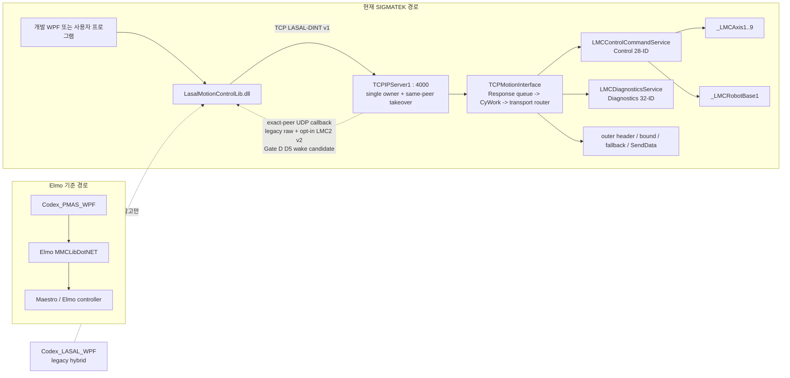

# Elmo Master 현재 아키텍처 및 릴리스 상태 재분석

- 감사일: 2026-07-16
- 2026-08-11 callback reconnect/ownership evidence correction: PC reconnect correction
  `66b5cf2`, observability/fence `f337fec`/`ad7c8b1`, exact display correction
  `af4ab63`, PC-only callback ownership wire harness `bff3bc7` 뒤 current Release SDK는
  `1133/1133`, WPF Release는 `335/335` PASS다.
  `f337fec`/`ad7c8b1` 시점의 WPF `334/334`는 2026-08-10 역사적 스냅샷이다.
  WPF 결과에는 stale-dispatcher replacement-session 회귀와 non-canonical
  `ErrorId=0` short ACK의 zero-retry/full-cleanup/fresh-manual-socket 회귀가 포함된다.
  `LMCConnection`은 exact `0x8080` attempt/retry/ACK/outcome
  evidence와 current-session v2 receiver decision snapshot을 공개한다. LASAL Gate D
  source에는 one-attempt D5 terminal receipt/broker와 `PublishEvent` candidate가 있고
  post-commit C78 Rebuild/Download도 수행됐다. 다만 regenerated `Classes.lcb`
  `6E115876...`가 sequence-4 manifest의 `24402BFA...`와 달라 reviewed rebaseline
  전 PLC 결과는 exploratory다. Gate D는 계속 `ProductionApproved=false`,
  `NeedsRebaseline=true`이며 PC fake-peer/GUI/raw-wire evidence는 PLC causal packet proof가
  아니다. `bff3bc7`의 live mode도 실제 PLC에 실행하지 않았고 reviewed rebaseline,
  exact downloaded checkpoint, pcap과 PLC Watch 전에는 승인되지 않는다.
  Dispatcher에 늦게 도착한 stale/old wake는 diagnostic ignored log를 남길 수 있지만
  retained ticket, operation summary/state, callback counter 또는 `0x7E03`을 바꾸지 못한다.
- 2026-07-31 current override: `main@6537bcf` + working tree에서 SDK Debug/Release
  `1042/1042`, WPF Debug/Release `297/297`다. LASAL
  `Phase5TransportClean / IntegratedReadOwnerDormant`와 dormant Admin
  `0x7D12 SetAxisPosition`, `0x7D13 StartAxisReference` SourceOnly/full static도 PASS했다.
  C# protocol ID는 64개, LASAL dispatcher/wire handled contract는 63개이며
  Admin은 active 4개 + dormant SetPosition/Reference 2개다. 가장 최근 IDE
  Rebuild/Link와 변경 class implementation smoke도 `0 error(s), 20 warning(s)`, Linker
  `Done`, 신규 `CInvalidArgException` 0건으로 PASS했지만 이 증거는 이번
  `0x405C` callback endpoint ownership과 `0x7D12`/`0x7D13` 편집 전 checkpoint다. 현재
  callback+`0x7D12`+`0x7D13` 변경은 fresh IDE Save/Rebuild/Link/implementation smoke가
  다시 필요하다.
  SetPosition capability bit 3은 OFF이고 valid raw request도 `InvalidState/detail 10`, native
  `_LMCAxis.SetPosition` 호출 0회다. Reference capability bit 4도 OFF이고 native
  `_LMCAxis.MoveReference` 호출은 0회다. 둘 다 WPF에는 노출하지 않았다. Axis1 `0x2F00:24 Int32/4` SDO Write는 source/PC
  active다. `0x7E11/0x7E12/0x7E13/0x7E22`는 route/구현됐고 CREVIS read owner는
  coherent 464-byte snapshot과 coupler/input/output client wiring을 갖는다. 그러나 bits
  15~17은 OFF이고 `0x7E23` PLC route는 없다. current PLC cold download와
  Motion/Power/SDO/CREVIS dynamic read live proof는 없다. 아래에서
  full static FAIL, constructor 미완료, current Rebuild 대기로 적힌 문장은 그 이전
  checkpoint의 역사 기록이며 이 override와 현재 판정표를 우선한다.
- 마지막 source 상태 검토: 2026-07-31. 마지막 실기 상태는 2026-07-27 diagnostics D1~D4 single-bank와
  test-profile D5 general-inline SDO Read 활성, group Phase 0 option/position 계약 정합,
  Phase 1 read-only Admin/facade, Phase 2 `0x7D22 GroupMoveLinearRelative` 및 PMAS native
  capture 정렬. 같은 날 Admin/drive read/relative motion/D1 PI/D2 Bulk, 동적 group
  monitor/PowerOff, `0x2051` None/ACS static alias, D5 general-inline 1/2/4-byte와
  TypeMismatch 후 복구 capture PASS. 이후 `0x2047` accepted-then-poll와
  Group/Bulk/Recorder qualification UI source 및 PC build 완료; 해당 신규 경로의 PLC
  live 검증은 아직 없음. 같은 날 Phase 1 checkpoint에서 `TCPMotionInterface.MsgPaser`의
  Admin, diagnostics, registry, axis, Group 50개 command body를 다섯 private family
  handler로 byte-equivalent 분리했고 source/full static 계약을 통과했다. 2026-07-24 no-task
  `LMCControlCommandService`의 class/method/client/generated metadata와
  `GroupMovePos`/`GroupKinematicReady`/확장된 `MoveLinearAbsEx` 선언까지 저장했다. 이어
  Group 11개와 Group-domain Admin 2개 body를 dormant service에 구현하고 command별
  pointer/size/response/native-dispatch 의미 계약을 포함한 SourceOnly 검증을 통과했다.
  이어 Phase 3B source에서 `HandleRequest`의 명시적 13-ID 분기와 `MsgPaser`의 단일
  zero-copy route를 활성화해 SourceOnly/full `Phase3GroupRouted`를 통과했다. Phase 4에서는
  Registry 3개, Axis 8개, Group 11개, Admin 4개의 Control 26개 전체를 service의 exact family
  route로 전환하고 TCP local family caller를 0개로 만들었다. SourceOnly/full
  `Phase4AllControlRouted`를 통과했으며 service object와 관련 network 연결 11개는 그대로다.
  이어 diagnostics `0x7E00` capability를 `LMCDiagnosticsService`로 이동하고 Diagnostics 24개를
  payload-only single-call/single-send 경로로 통합해 SourceOnly/full
  `Phase4DiagnosticsRouted`를 통과했다. 이후 Phase 5 external text cleanup으로
  `TCPMotionInterface` generated server/client/data count를 `4/3/0`, 구현 함수를 8개로 줄이고
  Diagnostics route를 `MsgPaser`에 inline했다. `Comm_Network.lcn`의 TCP direct axis/robot
  연결 10개를 제거해 `ONE_Comm_Network_Table.st` external connection text도 26개에서
  16개로 정리했다. tracked `Classes.lcb`/`Networks.lcb`도 transport-only registration과
  network tuple 계약을 만족해 switch 없는 Phase 5 SourceOnly/full static이 PASS했다.
  2026-07-30 fresh main project에서 current SDO Write/topology/integrated read-owner/same-peer source를
  포함한 Rebuild/Link를 다시 실행해 `0 error(s), 20 warning(s)`, Linker `Done`을 확인했다.
  `LMCSdoExecutor.st` source hash는 build 전후 같았고 변경 class implementation search와
  신규 `CInvalidArgException` 0건도 확인했다. PLC runtime은 아직 완료하지 않았다.
  Phase 3A에서 성공한 Rebuild는 당시
  `ONE_Comm_Network_Table.st`를 당시 network 기준으로 재생성했고 Link, PLC Download,
  project load도 성공했다. 종료 전 `ControlCommands`/`LMCAxis3` implementation search와
  전체 LASAL log의 `CInvalidArgException` 0건도 확인했다. 이 과거 PLC runtime 증거는 route
  활성화 전 checkpoint다. Phase 5 transport-only source는 Compiler/Linker까지 통과했지만,
  이후 same-peer import 전 SDO checkpoint에서 generated `Classes.lcb`의 SDO Write declaration은
  당시 source와 동기화됐고 `Phase5TransportClean` SourceOnly/full static이 PASS했다. 이후
  current topology/same-peer/SDO source도 fresh IDE reload, SourceOnly/full static과
  Rebuild/Link를 통과했다. PLC download와 runtime은 별도 대기 상태다
- 기준 branch: `main`
- 감사 시작 기준 commit: `f8f99a299f72c118c9a243d0165368d666d0cd0f`
- 현재 API 표기: `LasalMotionControlLib 0.9.1-preview`
- 판정: 임시 Phase 4 snapshot의 PC Debug/Release 각 148 tests, 개발 WPF Debug/Release build와
  routed static PASS는 역사적 checkpoint 증거이며 2026-07-31 Phase 5 결과로 대체됐다. 그 SDO
  Write checkpoint와 당시 generated `Classes.lcb`/network metadata는 `Phase5TransportClean`
  SourceOnly/full static을 모두 통과했다. 이전 Phase 5 SDK 검증 스냅샷의 PC Debug/Release 각 649/649 tests가 PASS했고 D5 SDO
  Write target policy, Read/Write-aware quarantine/cleanup과 성공 Write 뒤 exact manual
  readback interlock 계약까지 포함한다. public `ReadSdoInline[Async]`도 1/2/4-byte capability
  preflight, bounded terminal poll, accepted-ticket 보존과 immutable typed result를 제공한다. 그 checkpoint SDK Debug/Release는
  Reference 신규 16개와 fake-RPC stable snapshot 회귀를 포함해 각각 1042/1042 PASS다. 확인된 회귀 범위는 dormant SetPosition 전용 18개와 Axis Stop/Reset/PowerOff, Group Power On/Off accepted-once
  Begin/status-only Resume, Axis Power On accepted observer/mutation 귀속/final publication,
  PowerOff/Reset completion, DS402 drive diagnostics,
  Admin `GroupMoveLinearRelative`, Group Enable hard total-deadline/evidence와 D5 Submit/Cancel의
  delayed-ACK `ResultDiscarded`, accepted Submit evidence, Recorder
  Trigger/Stop 및 Release outcome quarantine을 포함한다. 그 checkpoint 개발 WPF Debug/Release build와
  actual-control smoke는 각각 297/297으로 PASS했다. smoke는 Admin/Drive read-only exact fake-RPC와
  bit-14-only CREVIS 자동 7행/3행 표시,
  configured topology의 `INITIAL/UNCHANGED/CHANGED` canonical 비교, endpoint reset, 실패 및
  stale-session baseline 불변, disconnect 뒤 last-success UTF-8 no-BOM evidence export,
  초기 bit 14 OFF 뒤 수동 Load CREVIS 복구, 일반 RPC와 exact readback pending 중 SDO draft
  유지/명시적 exact Read 복원/non-exact zero-wire 차단 및 Submit 직렬화, manual Write의 비모달
  immutable arm/편집 시 re-arm/exact second-click consume, same-value Write readiness와
  마지막 실행 결과 분리/보존, bits 14~16 fake RPC의 실제 `0x7E13/0x7E22` Health/selected-DI 표시와 output-shadow
  background poll 0회, 늦은 수동 응답 selection/session guard, mixed-I/O output proof 및
  Health/DI channel별 stale/error, D5 contention start gate, 실제 WPF child process의 SDO/DO recovery zero-replay/강제종료
  재복구와 typed v2 SDO restart recovery의 empty-allowlist zero-wire, D4 active journal의
  single-writer/interlock 및 두 번의 강제 종료/restart에서 `0x7E40..0x7E4F` zero-replay와
  byte-identical identity/state 보존, 결정적 Double recovery Guid -> RequestedConfigId와
  ordinary diagnostics interlock에서 분리된 reconnect recovery contract와 semantic journal
  conflict/runtime I/O failure 분리를 검증한다. D4
  qualification/retained-cleanup/reconnect/config-only manual Configure adapter는 구현됐지만 네
  proof/route gate는 모두 `false`이며,
  bits 14~16 fake RPC 검증도 current LASAL handler의 PLC live 증거가 아니며 실제 PLC/Write
  송신은 아니다. Write/topology/integrated read-owner의
  pre-callback/pre-`0x7D12`/pre-`0x7D13` checkpoint는 LASAL Compiler/Linker와
  implementation smoke까지 PASS했다. current callback+`0x7D12`+`0x7D13` source의 fresh IDE
  build/smoke와 PLC packet/runtime/performance 검증은 수행하지 않았다.
  Group/Bulk/Recorder 자동 qualification, Recorder exact/0/0 reconnect-adopt와 read-only
  D5 abort/recovery runner, internal negative-wire 도구는 code/build/test 단계까지만 완료됐으며
  D5에는 submit-outcome unknown quarantine, same-connection BootId/MapRevision mismatch 격리,
  multi-evidence two-ticket recovery proof와 unresolved 상태변경 gate까지 반영됐다.
  PLC live, fault, stale identity, reconnect/adopt/abort/raw rejection wire
  evidence, RT evidence와 장비 안전 matrix가 남아 production
  승인본은 아님
- 2026-07-29 TCP same-peer takeover checkpoint: 외부 테스트 프로젝트에서 사용자가
  비정상 클라이언트 종료/LAN 단선 뒤 동일 IPv4 재접속이 기존 stale socket을 교체하고
  새 연결에서 통신을 재개하는 것을 PLC runtime으로 확인했다. 검증된 `TCPIPServer` source,
  `TCPMotionInterface`, Comm Network와 사람이 검토 가능한 생성 table을 마스터에 선별 반영했다.
  안정 상태의 RPC owner는 하나이며 `MaxConnections=2`의 두 번째 slot은 reconnect candidate다.
  다른 IPv4 거절, peer lookup 실패, NAT/복수 NIC, 반복 soak와 motion 중 takeover는 미검증이다.
  마스터의 LASAL Save/Rebuild/Link 전이므로 current binary metadata와 PLC runtime 증거로 확대하지 않는다.
- 2026-07-27 EtherCAT topology checkpoint: current working source에는 CREVIS
  `GL_9086_11`이 physical `SlaveIndex 0`, 네 Elmo가 `SlaveIndex 1..4`인 configured
  5-slave topology가 생성돼 있다. 사용자가 LASAL build PASS를 보고했고 2026-07-28 `Test2`
  capture에서 `0x7E11` 1회와 `0x7E12` 7회가 실제 응답해 7행/CREVIS 3행이 WPF에 표시됐다.
  이는 static configured inventory wire PASS이며 실제 CREVIS 동적 health/I/O PASS는 아니다. `0x7E11/0x7E12`의 static
  LASAL serializer/TCP route와 bit 14는 source-active이며 BootId 0/nonzero capability는 각각
  `0x00004007`/`0x0000613F`다. topology revision은 `0x15867EEC`, inventory는 7 entries다.
  C# SDK와 개발 WPF topology/node-health/digital-I/O read 및 guarded output-write 화면도 구현됐다.
  WPF는 Connect 뒤 정적 topology를 자동 로드하고 실패 시 이전 행을 폐기하며 실행 binary marker와
  capability/identity 오류를 직접 표시한다. 창 제목과 상단 quick status는 CREVIS topology 경로를
  직접 노출하고 legacy 4-axis 표에는 현재 topology의 `CFG slave`를 별도로 표시한다. auto live monitor는 `CFG` static 열과 `LIVE` sample
  열을 분리한다. owner/session-bound cached capability snapshot을 pinned overload에 전달해 bit
  15/16이 있는 eligible tick마다 추가 `0x7E00` 없이 `0x7E13` 또는 `0x7E22`를 정확히 1회 보내며,
  일반 non-pinned API의 capability refresh+read 계약은 유지한다. 현재 두 bit가 off라 wire request는
  0회다. `Test2` capability는 `0x0000613F`로 bit 14만 켜졌고 bit 15~17은 꺼져 있었으며
  실제 request에도 `0x7E13/0x7E22/0x7E23`이 없었다. background monitor는 output shadow를 갱신하지 않으며 동일 연결에서 bit 15/16이
  내려가면 과거 health/DI 표본을 `UNAVAILABLE`로 폐기하고 summary를 다시 계산한다. current
  source에는 `0x7E13/0x7E22` route/handler, `LMCEcatInputLatch`의 coherent 464-byte snapshot과
  CREVIS coupler/input/output Motion Network client 연결이 있다. 다만 bits 15/16은 OFF이고
  current PLC dynamic live 증거는 없다. `0x7E23` PLC route/handler도 없으며 bit 17은 OFF다.
  원시 분석은
  [Test2 capture audit](LMC_ETHERCAT_TEST2_CAPTURE_AUDIT_2026-07-28.md)에 고정했다.
  SDK의 Signal Catalog와 EtherCAT Topology aggregate는 diagnostics owner/session-bound다. alias PI,
  Bulk Configure, PI Write submit과 topology-bound Health/Digital I/O는 unbound, foreign,
  reconnect-stale aggregate를 capability/data RPC 전에 거부하고 원 session generation을 exchange까지
  유지한다. 로컬 snapshot 조회와 raw topology/I/O observation overload는 유지한다.
- 2026-07-28 Stop/PowerOff send-priority checkpoint: SDK는
  `LMCConnectionOptions.SendPriorityCoordinator`로 명시적으로 주입한 connection과 scope에만
  적용되는 opt-in coordinator를 제공한다. WPF는 모든 새/reconnect connection에 하나의
  coordinator를 공유하고 safety generation을 app gate 대기 전에 선예약한다. `ExchangeCore`는
  mutation callback과 실제 `stream.Write` 직전에 generation을 검증하므로 새 safety 예약 뒤 아직
  쓰지 않은 ordinary RPC와 compound helper의 후속 RPC는 zero-wire
  `LMCSendPreemptedException`으로 끝난다. 최종 검사를 이미 통과한 in-flight RPC는 취소하지 않고
  response/timeout을 확정한 뒤 safety send가 같은 직렬 경로를 얻는다. 앞선 RPC가 transport를
  fault로 전환하면 safety send 성공도 보장하지 않는다. safety ACK 뒤에는 exact command
  generation의 monitor admission을 먼저 예약하며, 더 새 safety 예약은 이전 monitor의 다음 RPC를
  stale로 거부한다. qualification 선점은 `ABORTED`, write 직전 선점된 SDO submit failure context는
  `Submission/NotAttempted`와 ticket 없음이다. 이는 source와 deterministic fake-TCP PC 증거이며
  PLC packet 순서, 실제 정지 시간 또는 장비 안전 인증이 아니다. wire/LASAL source shape와 7-bit
  ASCII custom-source 규칙은 바뀌지 않았다.
- Group Power On/Off의 현재 완료 계약은
  `BeginGroupPowerOnWaitForStableStateAsync`/`BeginGroupPowerOffWaitForStableStateAsync`가
  `0x204A`/`0x204B`를 정확히 한 번 dispatch하고 success ACK와 continuation을 동일
  connection/session/group-reference의 send-priority publication에서 원자 설치하는 것이다. accepted
  observer는 first status 전에 continuation을 durable 계층에 전달한다.
  `ResumeGroupPowerStateWaitForStableStateAsync`는 exact pending continuation으로 `0x2045`만 polling해
  기대 `IsPowerOn`을 성공 응답 3회 연속 확인한다. compound On/Off facade는 Begin/Resume elapsed total
  deadline을 공유한다. timeout/cancel/status failure는 continuation/evidence를 보존하고,
  stale/resolved/concurrent Resume과 pending 위 fresh Begin은 typed zero-wire로 거부된다. later
  same-group mutation은 `LMCGroupPowerInterferenceException`으로 원 transition 귀속을 막는다.
  submission outcome은 `NotAttempted`, `Rejected`, `OutcomeUncertain`, `Accepted`를 분리한다.
- WPF Group Power durable journal은 endpoint IP/port, group name/reference, DiagnosticsBootId,
  MapRevision, 방향과 `ArmedBeforeDispatch`/`AcceptedAwaitingProof`/`RecoveryRequired`/`Resolved`를
  보존한다. fresh On/Off 전에 arm하고 accepted observer에서 첫 status 전에 Accepted를 기록한다.
  restart의 Accepted는 exact endpoint/BootId/MapRevision/read-only lookup reference에서 status-only로
  확인한다. On/Off accepted ACK 직후 child process를 강제 종료한 뒤 새 process가 journal lock을
  재획득하고 `0x204A`/`0x204B` 재전송 없이 `0x2045` 3회만으로 resolve하는 회귀도 포함한다.
  startup Armed 또는 outcome-uncertain Power On은 RecoveryRequired이며 Power On replay와
  status-only resolve를 금지한다. explicit Power Off takeover만 durable On record를 Off record로 원자
  교체하고 PowerOn=False stable proof를 요구한다. uncertain Off는 먼저 status-only false proof를
  수행하며 typed interference 또는 exact successful PowerOn=True 관찰 뒤에만 replacement를 허용한다.
  rejected/pre-wire replacement는 이전 durable Off record와 replacement 권한을 보존한다. active
  record는 endpoint/group 편집, 새 mutation, connected clean Close/reconnect를 차단하고
  exact-identity recovery와 safety/read-only만 허용한다. journal open/lock/write failure도 fail-closed다.
- 수동 `Read Status` 한 번만으로 pending Power On/Off 또는 Enable continuation을 완료하거나
  ACTIVE/profile lock을 승격하지 않는다. safety generation 검증을 통과한 성공 응답은 상태에 맞는
  pending Enable continuation proof에 누적되고 Locked Standby proof가 3/3이면 기존 ACK를 재사용한
  zero-wire Resume으로 완료할 수 있다. Stop/PowerOff safety 예약은
  accepted Group Enable의 누적 status proof를 즉시 초기화하되 ACK와 pending continuation을
  보존한다. 예약 뒤 도착한 status response는 drain 후 `ResultDiscarded`되어 observe되지 않는다.
  예약 전에 SDK completion publication이 끝났지만 WPF 적용 전에 safety가 예약된 좁은 경우만
  recovery-required로 승격한다. connected unresolved 상태에서는 group 이름 변경, group 재조회,
  clean connection/window close, connected reconnect와 새 Power On을 차단한다. 외부 connection
  loss 뒤 reconnect 진입에서는 원 exact group 이름을 보존한 recovery로 승격하고 새 session에서 그
  이름의 group만 다시 조회한다. 명시적 `0x2048 GroupDisable` ACK는 Unlock 요청 접수만 뜻하며
  pending/recovery를 해제하지 않는다. accepted pending과 recovery-required는 exact group identity에서
  PowerOn=True + Disabled/Unlocked 3회 연속 또는 PowerOn=False 3회 연속 proof가 끝난 뒤에만 해제한다.
  Power On 성공만으로는 해제되지
  않으며 어느 경로도 `0x2047`을 replay하지 않는다. 이 항목도 deterministic
  PC/fake-TCP와 WPF smoke 증거이지 PLC runtime 완료 증거가 아니다.
- WPF fresh Group Enable은 endpoint IP/port, group name/reference, DiagnosticsBootId와
  MapRevision을 별도 durable journal에 `0x2047` 전에 기록한다. startup의
  `ArmedBeforeDispatch`는 `RecoveryRequired`로 승격한다. endpoint mismatch는 TCP/RPC 전에,
  group reference mismatch는 read-only lookup 뒤 mutation 전에 차단한다. verified Enable,
  explicit Disable 또는 stable Power Off는 fresh identity와 post-identity safety generation을
  확인한 뒤 durable `Resolved`를 먼저 저장한다. active record 동안 endpoint/group 편집,
  Group Reset/Set Identity와 clean Close를 차단하며 자동 `0x2047` replay는 없다.
- Group Profile Lock journal은 기존 state 1~3을 유지하고 `AcceptedAwaitingProof=4`를 추가해
  format-version 1 record와 backward-compatible하다. SDK Begin accepted observer가 ACK와 exact
  continuation publication 뒤 첫 `0x2045` 전에 이 상태를 durable하게 기록한다. process restart는
  exact endpoint IP/port, group name/reference, DiagnosticsBootId와 MapRevision을 다시 확인한 뒤
  cross-session `WaitForLockedStandbyAsync`의 `0x2045`-only proof만 사용한다. ACK 뒤 첫 status에서
  실제 child process를 Kill한 회귀는 journal single-writer lock 재획득, 새 session의 `0x2047` 0회,
  `0x2045` 3회와 동일 identity `Resolved`를 확인했다. 복구 뒤에도 process-local Set Identity/Home
  Check는 복원하지 않아 Move는 fail-closed하고 Disable 뒤 준비를 다시 수행해야 한다. startup
  Armed는 accepted status-only로 승격하지 않고 기존 safety-only recovery를 유지한다. 이 결과는
  PC/fake-RPC 증거이며 PLC runtime profile lock 또는 hardware proof가 아니다.
- fresh Group Disable도 같은 방향성 journal에 `ExpectedProfileLocked=false`로 wire 전에 arm하고,
  SDK accepted observer가 `0x2048` ACK와 exact continuation을 첫 `0x2045` 전에 durable
  `AcceptedAwaitingProof`로 기록한다. same-process Resume과 cross-session
  `WaitForStableDisabledAsync`는 `0x2045`만 보내 PowerOn + Disabled + !Standby를 기본 3회 연속
  확인한다. ACK 뒤 첫 status 전에 child process를 Kill한 WPF 회귀는 새 session `0x2048` 0회,
  `0x2045` 3회, journal lock 재획득과 동일 identity `Resolved`를 확인했다. stable PowerOff는 더
  새로운 safety mutation으로 pending Disable을 retire하지만 Disable 완료로 보고하지 않는다.
  `0x2048` NACK도 Unlock side effect 가능성을 배제할 수 없어 recovery를 유지한다. 이는 PC/fake-RPC
  증거이며 새 LASAL IDE build/download와 PLC profile unlock/hardware proof는 별도다.
- SDK Group Enable wait는 mutation/status gate 대기, fresh `0x2047`, 모든 `0x2045`와 poll
  delay를 하나의 total deadline으로 제한한다. final write commit 전 cancel/deadline은
  `NotAttempted`, zero wire, reusable connection, mutation/proof 불변이다. actual write commit의
  `onWriteCommitted`에서만 mutation generation을 갱신하고 pending proof를 0으로 reset한다. post-write caller cancel은 response를 drain하고
  accepted ACK/status를 게시한 뒤 typed cancellation을 반환한다. ACK 무응답은
  `OutcomeUncertain`/no-continuation/`Faulted`, status 무응답은
  `Accepted`/exact-pending-continuation/`Faulted`이며 둘 다
  `TransportInvalidatedAtDeadline=true`다. rejected ACK는 `Rejected`/no-continuation이다.
  `BeginGroupEnableWaitForLockedStandbyAsync`는 accepted ACK와 continuation을 먼저 게시하고 accepted
  observer를 정확히 한 번 호출한 뒤에만 helper-owned 첫 `0x2045`를 시작한다. process-local
  continuation이 없는 새 connection은 public `WaitForLockedStandbyAsync`로 `0x2047` 없이
  PowerOn + Locked Standby를 기본 3회 연속 확인한다.
  Group Enable 전용 40개 fake-RPC 회귀가 통과했으며 PLC runtime profile-lock proof는 아니다.

이 문서는 현재 Git source를 다시 대조해 프로젝트 전체의 역할, 구현 범위,
검증 수준과 남은 위험을 한곳에 고정한 기준 문서다. 날짜가 더 오래된 설계·분석
문서와 충돌하면 현재 source, 자동 계약 검사, 이 문서 순서로 판단한다.

## 1. 판정 용어

이 문서에서는 다음 상태를 구분한다.

- **확인**: 현재 Git source, tracked network 또는 이번 감사에서 직접 실행한 빌드로 확인했다.
- **정적 검증**: serializer/parser/source/network의 문자열·offset·shape 계약을 자동 검사했다.
- **미검증**: LASAL IDE, 다운로드된 PLC 또는 실제 장비에서 확인한 증거가 없다.
- **추정**: source 구조로 가능성을 판단했지만 runtime 증거가 없다.

`source-active`, `build PASS`, `static contract PASS`는 PLC 동작 완료와 같은 뜻이 아니다.

## 2. 핵심 결론

| 항목 | 현재 상태 | 판정 |
|---|---|---|
| PMAS/MMCLib 기준 앱 | `Codex_PMAS_WPF` | 비교·벤치마크 기준, LASAL 배포 앱이 아님 |
| 구 LASAL WPF | `Codex_LASAL_WPF` | 실제 TCP 일부와 local simulation/no-op이 섞인 legacy hybrid 참고 앱 |
| 현재 PC API source | `LMC_Library/LMC_API_Delivery/src` | canonical |
| 현재 개발·실기 진단 WPF | `LMC_Library/LasalApiWpfTestApp` | canonical API source ProjectReference 사용 |
| 외부 배포 예제 | `LMC_Library/LMC_API_Distribution` | 내부 PLC 시험 종료 전 동결; 현재 완료 기준에서 제외 |
| 현재 PLC source | `Lasal_PRG/Elmo_EtherCAT_Test_4Axis` | canonical tracked LASAL project |
| current configured EtherCAT source | GL-9086 physical index 0 + Elmo physical index 1..4 | working source/ENI/network와 pre-callback/pre-`0x7D12`/pre-`0x7D13` LASAL IDE build 확인; current overall source rebuild와 PLC download/live는 미검증 |
| single-axis 범위 | descriptor `1..9` | 축 1~4 physical, 축 5~9 simulated |
| Cartesian group move/lock | X/Y/Z/U 축 1~4 | 9축 group interpolation이 아님 |
| 기존 motion/group command | 25개 | 캡처 기반 23 + local motion extension 2 |
| Admin command | active 4개 + dormant 2개 | active `0x7D00` capability, `0x7D10` axis parameter, `0x7D20` group parameter, `0x7D22` group relative move; dormant `0x7D12 SetAxisPosition`, `0x7D13 StartAxisReference` |
| diagnostics PLC test 범위 | D0~D4 single-bank + D5 general-inline | Health/Catalog/PI Read, Bulk, Recorder Ring/Trigger, typed 1/2/4-byte SDO Read test profile |
| diagnostics gated/제한 범위 | D4 Double/D5 Write·extended | D4 two-bank의 네 proof/route gate와 capability bit 6/count 2는 비활성이다. D5 Write는 Axis1 `0x2F00:24 Int32/4`만 PLC/SDK source gate와 allowlist가 활성이고 axis 2~4는 차단된다. fresh IDE build는 PASS했지만 PLC download/UI[24] 소유권/live/pcap은 미검증이다. PI Write, 8/12-byte와 extended result도 비활성이다. |
| C# protocol command ID | 64개 | current source 자동 대조 |
| LASAL dispatcher/wire route | 63개 | capability-advertised active 53 + dormant read-owner `0x7E13/0x7E22` 2 + reserved/dormant 8(진단 6 + Admin SetPosition/Reference 2); `0x7E23`만 C# contract에 있고 PLC route 없음 |
| 요구사항 완전/적응 구현 | 40/65 (61.5%) | 직접 구현 16 + LASAL 적응 구현 24; PLC live 통과율이 아님 |
| 요구사항 부분 구현 포함 | 52/65 (80.0%) | `D16/E24/P12/G9/X4`; 부분/비활성 12 포함, 실제 미구현 9, 흡수/비동등 보류 4 |
| 상위 21개 요구사항 | active 17 + partial/dormant 2 + missing 2 | partial은 `HomeDS402` 목적의 LASAL-native `ReferenceAxis`와 `SetPosition`; missing은 `HomeDS402Ex`, `SetOpMode` |
| CyWork service-executed axis/group control·read·motion command | 18개 | 축 8 + 그룹 10; Admin motion `0x7D22`는 별도, metadata lookup 제외 |
| PC 자동 테스트 | current SDK Debug/Release 각각 1133/1133 PASS; 2026-07-31 baseline은 1042/1042 | 기존 fake-RPC, dormant Admin, recovery, SDO/DS402 계약에 더해 bounded `0x8080` reconnect correction, retained init evidence, immutable callback decision provenance와 PC-only GD-N10A/N13/N14 raw-wire harness 16개를 포함한다. PLC 통합과 별도다. |
| Axis SetPosition | SDK/wire/LASAL dormant fail-closed | request 28 bytes, response 36 bytes, expected-position CAS와 one-shot prepare를 구현했다. capability bit 3 OFF, native call 0, WPF 미노출이며 전용 durable journal/unified ownership/task·max-jump·`IsReferenced` 정책과 PLC proof 전 활성화 금지 |
| Axis Reference | SDK/wire/LASAL dormant fail-closed | `0x7D13`, request 56-byte frame/48-byte payload, response 32-byte frame/24-byte payload, recipe 1/2와 positive `MaxTravel`/`TimeoutMs`를 고정했다. capability bit 4 OFF, native `MoveReference` call 0, WPF 미노출이고 start ACK는 완료가 아니다. physical reference input 연결과 IDE/download/live proof 전 활성화 금지 |
| Stop/PowerOff send priority | SDK opt-in generation coordinator와 WPF shared integration, exact-generation post-ACK monitor reservation 구현 | stale ordinary/compound follow-up zero-wire와 SDO `NotAttempted`, qualification `ABORTED`는 deterministic PC 계약; in-flight RPC 취소, PLC/runtime 정지 순서와 safety certification은 범위 밖 |
| Axis Power On accepted-once recovery | `0x2023(enable=true)`의 may-have-been-sent generation과 성공 ACK, continuation을 원 session/axis에 귀속하고 observer가 durable `AcceptedAwaitingProof`를 저장한다. 같은 process/reconnect/restart 확인은 `0x2028` status-only다. | ACK parse 뒤 continuation publication 전을 포함한 later same-axis mutation은 `LMCAxisPowerOnInterferenceException`과 exact pending을 반환한다. final status/cancel/deadline/generation을 한 coordinator 결정으로 선형화하며 post-write 무응답은 connection을 `Faulted`로 격리한다. unresolved 동안 diagnostics mutation을 차단하고 safety/read-only/cleanup만 허용하며 실제 PLC/축/packet 증거는 별도 |
| Group Power On/Off accepted-once recovery | Begin On/Off가 `0x204A`/`0x204B`를 정확히 1회 보내 ACK+continuation을 session/group/send-priority publication에서 원자 설치하고, 공용 Resume은 `0x2045`의 기대 `IsPowerOn`을 기본 3회 연속 확인한다. compound facade는 elapsed total deadline을 공유한다. | typed pending/interference/submission evidence와 no-replay를 Group Power 전용 fake-RPC 35개로 검증했다. WPF는 endpoint/group/reference/BootId/MapRevision/direction durable journal을 command 전에 arm하고 accepted observer에서 갱신한다. restart Accepted는 exact-identity status-only, uncertain On은 explicit Off takeover, uncertain Off는 status-only false 우선이다. On/Off ACK 직후 child-process Kill/restart에서도 command replay 0회, status 3회, journal lock 재획득을 확인했다. PC/WPF 계약이며 PLC `RobotOn`/`RobotOff`, EtherCAT/drive runtime과 packet 증거는 별도 |
| Group Enable accepted-boundary recovery | Begin이 `0x2047` ACK와 exact continuation을 게시한 뒤 accepted observer를 첫 `0x2045` 전에 호출한다. same-session Resume과 cross-session `WaitForLockedStandbyAsync`는 `0x2045`만 보내 PowerOn + Locked Standby를 기본 3회 연속 확인한다. | WPF journal은 기존 state 1~3과 호환되는 `AcceptedAwaitingProof=4`를 exact endpoint/group/reference/BootId/MapRevision에 묶는다. ACK 뒤 첫 status에서 실제 child process를 Kill한 회귀는 새 session `0x2047` 0회, `0x2045` 3회와 journal lock 재획득/resolve를 확인했다. Set Identity/Home Check는 복원하지 않아 Move는 fail-closed하며 Armed는 safety-only다. SDK 40개 fake-RPC와 WPF process 증거이고 PLC/hardware proof는 별도 |
| Group Disable accepted-boundary recovery | Begin이 `0x2048` ACK와 exact continuation을 원자 게시하고 accepted observer를 첫 `0x2045` 전에 호출한다. ACK는 `UnlockProfile` 접수이며 완료가 아니다. same-session Resume과 cross-session `WaitForStableDisabledAsync`는 `0x2045`만 보내 PowerOn + Disabled + !Standby를 기본 3회 연속 확인한다. | WPF 방향성 journal은 `ExpectedProfileLocked=false`를 wire 전에 저장한다. ACK 뒤 첫 status에서 실제 child process를 Kill한 회귀는 새 session `0x2048` 0회, `0x2045` 3회, journal lock 재획득/resolve를 확인했다. stable PowerOff는 pending Disable을 `SupersededByStablePowerOff`로 retire하되 Disable completion으로 보고하지 않는다. SDK 30개 fake-RPC와 WPF process 증거이고 PLC/hardware proof는 별도 |
| Axis Power Off exact-once stable state | SDK Begin이 `0x2023(enable=false)`를 정확히 1회 송신하고 ACK+mutation generation+continuation을 session/send-priority publication 안에서 원자 설치한다. accepted observer는 mutation gate 해제 뒤 첫 status 전에 continuation을 durable 계층에 넘기고, Resume은 `0x2028`만 polling해 `IsSuccess && PowerOn=false && Standstill=true`를 기본 3회 연속 확인 | WPF 공용 Axis Power v2 journal은 방향을 포함해 command 전에 arm한다. accepted/RecoveryRequired Off restart는 exact endpoint/axis/reference/BootId/MapRevision의 status-only proof이며, 실제 ACK 직후 child-process Kill/restart에서도 `0x2023` 0회, `0x2028` 3회, journal lock 재획득과 동일 identity `Resolved`를 확인했다. confirmed interference 뒤에만 explicit replacement를 허용하고 stale observer/tombstone/connection-loss race는 newer 또는 safety-dominant record를 보존한다. 외부 PLC/client/direct SDO/group과 실제 PLC/축/packet 증거는 별도 |
| Axis Stop exact-once stable Standstill | SDK Begin이 `0x2022`를 정확히 1회 보내 accepted continuation과 process-local axis mutation generation을 게시하고 Resume은 `0x2028`의 `IsSuccess && IsStandstill`만 기본 3회 연속 확인. compound facade는 두 단계를 한 total deadline으로 조합 | WPF는 command-before journal과 accepted observer를 사용한다. accepted restart는 exact endpoint/D0/axis와 final live D0 뒤 status-only로 resolve한다. active Reset takeover는 predecessor를 원자 보존하고 pinned old-session transport를 RPC Close 없이 abort한 뒤 새 connection object에서 identity를 확인해 Stop을 1회 보낸다. pre-wire/NACK는 pending Reset만 복원하고 완료된 Reset은 재활성화하지 않는다. 완료된 Reset 뒤 Stop NACK는 final D0 physical identity가 일치할 때만 resolve하고 실패/mismatch는 exact Stop/predecessor를 `RecoveryRequired`로 보존한다. post-write uncertainty는 Stop recovery 유지, Motion+Stop은 Motion -> Stop 순으로 resolve한다. 실제 PLC/축/packet/물리 정지는 별도 |
| Axis Reset accepted-once completion | Begin이 `0x2024`를 정확히 1회 보내고 accepted continuation을 session/send-priority publication 안에서 설치하며 Resume은 `0x2028`의 successful `AxisErrorId==0`만 기본 3회 연속 확인. compound는 한 elapsed total deadline 공유 | valid NACK는 exact latest mutation reservation을 rollback하고 기존 proof를 보존한다. WPF durable Accepted는 process restart 뒤 command 0/status 3으로 복구하며 final live D0를 재검증한다. observer 저장 실패는 same-session exact pending으로 Resume하고, takeover session mismatch는 current transport를 보존한 채 stale pending을 폐기한다. LASAL AxisErrorId-clear 관찰이며 DS402 Fault bit/`0x603F`/실제 encoder recovery는 별도 |
| Drive DS402 Fault/error diagnostics | `ReadDriveStatus[Async]`의 실제 SDO `0x6041:0` bit 3을 `HasDs402Fault`로 분리하고 `GetDriveErrorCode[Async]`가 `0x603F:0 UInt16/2`를 한 D5 ticket으로 읽음 | 새 opcode/LASAL 구조 없이 기존 `0x7E50/0x7E03`과 capability/identity gate 재사용. `0x2028 StatusWord=0`, LASAL AxisErrorId, DS402 Fault와 `0x603F`를 별도 관측하며 실제 Reset 전후 drive/pcap 증거는 대기 |
| RPC connection/callback ownership | client/metadata/callback/state cleanup을 connection lifetime generation에 귀속하고 `ConnectionStateChanged` 안의 same-instance lifecycle 재진입을 sync/async 모두 즉시 거부. `0x405C` legacy 12/4는 current valid TCP peer만 허용하고 explicit v2 32/20은 BootId/SessionEpoch/cookie/sequence fence를 설치한다. `CurrentSessionGeneration`, retained init evidence와 immutable v2 decision snapshot이 PC provenance를 제공한다. | mismatch re-registration은 기존 tuple을 보존한다. `66b5cf2`는 exact `ErrorId=-1` canonical v2 short failure만 같은 socket에서 한 번 재시도하고 `f337fec`/`ad7c8b1`은 cleanup/UI dispatch 뒤 evidence를 보존·fence한다. `af4ab63`은 `ErrorId=0` short ACK의 zero-retry/full cleanup과 다음 수동 Connect의 새 socket을 고정하고 요청 tuple을 `RequestedCallback`, 실제 UDP bind를 `BoundCallback` 또는 `not-bound`로 구분한다. `bff3bc7`은 GD-N10A/N13/N14를 위한 fail-closed PC raw-wire harness를 제공하지만 actual PLC live 실행은 없다. Gate D sender/broker candidate와 post-commit Rebuild/Download는 존재하지만 current `Classes.lcb` drift와 live 32/20 registration, 52-byte UDP, causal `0x7E03` packet proof가 남아 있다. |
| TCP same-peer takeover | `TCPIPServer1 : TCPIPServer`, port 4000, `MaxConnections=2`, stable RPC owner 1 | 동일 IPv4 candidate가 inherited server FSM에 old socket shutdown을 요청하고 queue/receive/RPC/session을 새 owner로 교체. 외부 테스트 프로젝트 PLC runtime PASS를 마스터 source에 반영했고 current master Rebuild/Link까지 PASS했으나 master PLC download와 다른-IP/fault/soak는 대기 |
| 개발 WPF | D5와 topology/CREVIS read, guarded output-write UI, D4 qualification/cleanup/reconnect/config-only manual Configure adapter 및 durable Axis/motion/Group Power/Group Enable/Group Reset recovery 포함 Release build PASS; `af4ab63` current actual-control smoke 335/335 PASS | VS2019 MSBuild Release 검증이다. 기존 fake-RPC/process recovery에 callback reconnect/evidence와 stale Dispatcher replacement-session 회귀를 포함한다. Single Axis live qualification, actual PLC SDO Write/D5 scenario와 실제 축/Group recovery는 별도다. 2026-07-31 Debug/Release baseline은 297/297이다. |
| 개발 WPF callback override 및 PC wire harness 2026-08-11 | `af4ab63` 기준 RPC init attempt/retry/ACK/outcome, 요청/실제 callback endpoint 구분, accepted v2 registration fence, immutable receiver decision/counter evidence panel과 stale dispatcher fence를 추가했다. `bff3bc7`은 retry 0회의 exact `0x8080/0x405C/0x405D` GD-N10A/N13/N14 PC-only harness와 16개 회귀를 추가했다. SDK current Release `1133/1133`, WPF current Release `335/335` PASS다. | `ErrorId=0` non-canonical short ACK는 재시도 0회, listener/TCP cleanup과 다음 수동 Connect의 새 socket을 요구한다. `RequestedCallback`은 입력 tuple이고 `BoundCallback`은 실제 endpoint 또는 `not-bound`다. stale/old wake는 diagnostic ignored log를 남길 수 있지만 retained ticket, operation summary/state, callback counter 또는 `0x7E03`을 바꾸지 않는다. wire harness PASS도 PC 관측일 뿐이며 reviewed rebaseline, exact downloaded checkpoint, pcap과 PLC Watch 없이는 PLC callback/runtime proof가 아니다. |
| qualification 자동화 | Group/Bulk/Recorder, read-only D5 abort/recovery, D5 contention exact Busy/recovery, timeout/drain, queued-cancel one-shot/race/recovery와 `0x2045` 10,000-call runner code/build PASS. D5는 submit outcome/BootId·MapRevision quarantine, 순수 scope policy, multi-evidence two-ticket recovery proof, unresolved mutation gate와 15~120초 cleanup 포함 | 신규 runner의 PLC live packet 미검증; PC API RPC elapsed는 PLC dispatch/jitter/overrun 증거가 아님 |
| LASAL SourceOnly 정적 계약 | `Phase5TransportClean / IntegratedReadOwnerDormant` PASS | current external `.st/.lcp/.lcn`, same-peer owner 교체·격리, 464-byte coherent snapshot, `0x7E11/12/13/22` route, CREVIS read-owner와 dormant Admin `0x7D12/0x7D13` source 계약을 포함한다. |
| LASAL full static 계약 | `GateDVisualLayout` checkpoint PASS; current tree FAIL | checkpoint generated `Classes.lcb`와 Network 계약은 일치했지만 post-commit Rebuild가 `Classes.lcb`를 `24402BFA...`에서 `6E115876...`로 바꿔 focused/C78 current verification이 실패한다. reviewed rebaseline 전 runtime 결과는 exploratory다. |
| D5 executor 초기화 | constructor declaration/implementation, generated `@STD`, state/buffer 초기화와 Idle publish 계약 PASS | Axis1 `ExpectedSdoWriteAxis=1` static과 IDE build는 PASS했다. actual Busy/Write/runtime 원인은 PLC에서 별도 검증한다. |
| LASAL IDE | 2026-07-30 pre-callback/pre-`0x7D12`/pre-`0x7D13` checkpoint fresh reload Rebuild/Link `0 error(s), 20 warning(s)`, Linker `Done`; changed-class implementation smoke와 신규 `CInvalidArgException=0` PASS | current `0x405C` ownership+`0x7D12`+`0x7D13` 편집의 fresh Save/Rebuild/Link/smoke, `DriveComL2.h` open/load-time 설치 정합과 C78/C81 warning debt, current PLC download/runtime은 별도 |
| Admin IDE/PLC | `0x7D00/10/20/22` live happy-path capture PASS; `0x2047` source/static/current IDE build 완료 | dormant `0x7D12/0x7D13`의 current IDE build/download/live와 새 `0x2047` PLC download/ACK timing 및 invalid/stale/fault는 별도 |
| 기존 motion/group PLC E2E·재캡처 | 25-command 전체 matrix 미완료 | 기존 subset capture PASS; true Buffered/stop-first code/build 완료, live packet은 별도 |
| diagnostics PLC 시험 matrix | D1 Catalog/4 PI, D2 4-entry Bulk, D5 general-inline 1/2/4-byte와 same-BootId TypeMismatch recovery capture PASS | Bulk/Recorder soak, Bulk operator partial/recovery와 Recorder reconnect/adopt code/build만 완료; live soak/fault/reconnect/adopt와 D5 나머지 fault는 별도 |

프로젝트 폴더명에는 `4Axis`가 남아 있지만 현재 의미는 다음처럼 나눠야 한다.

```text
API 및 software axis        1..9
physical Elmo/DS402 axis    1..4
simulated software axis     5..9
Cartesian group move/lock   1..4 (X/Y/Z/U)
```

## 3. 전체 구조



두 경로는 API 이름과 시험 의도를 비교할 수 있지만 wire 호환으로 취급하면 안 된다.
PMAS 캡처에는 LREAL/REAL ABI가 있고 현재 LASAL adapter는 caller가 변환한 DINT를
전송하는 별도 `LASAL-DINT v1` 계약이다.

현재 source에서 control/diagnostics command body는 각각 no-task service가 소유하고
`TCPMotionInterface`는 lifecycle/session, queue, route, outer response와 최종 send만 소유한다.
TCP local family/helper와 direct axis/robot client는 제거됐다. tracked class/network
metadata도 이 구조와 정적으로 일치하지만 LASAL IDE Rebuild/Link와 PLC runtime까지
검증한 상태는 아니다. 최종 transport/control class 분리의 책임, 성능 불변조건과
단계별 network 이행은
[TCPMotionInterface 성능 우선 OOP 분리 설계](LMC_TCP_MOTION_INTERFACE_PERFORMANCE_FIRST_OOP_REFACTOR_DESIGN_2026-07-23.md)를
따른다.

## 4. 디렉터리별 책임

| 경로 | 현재 책임 | 사용 판단 |
|---|---|---|
| `Codex_PMAS_WPF` | Elmo MMCLib 기능, cycle/group benchmark 기준 | 유지 |
| `Codex_LASAL_WPF` | 초기 TCP 이식 실험, PMAS UI parity, benchmark 비교 | 신규 기능 기준으로 사용 금지 |
| `LMC_Library/LMC_API_Delivery/src` | C# API 유일 source | 수정 기준 |
| `LMC_Library/LMC_API_Delivery/tests` | PC request/parser/fake RPC와 LASAL 정적 계약 | 회귀 기준 |
| `LMC_Library/LasalApiWpfTestApp` | 현재 source를 직접 참조하는 개발/실기 앱 | 내부 기준 앱 |
| `LMC_Library/LMC_API_Distribution` | DLL, 독립 예제, 사용자 매뉴얼 | 외부 전달 기준 |
| `LMC_Library/LMC_API/Elmo_API_Packet2` | PMAS packet 근거와 field 분석 | evidence, 현재 LASAL 상태와 분리 |
| `LMC_Library/LMC_API/LMC_API` | `0.9.0-pc-api` 보관본 | 배포·개발 사용 금지 |
| `Lasal_PRG/Elmo_EtherCAT_Test_4Axis` | current PLC adapter, axis/group/network | LASAL 수정 기준 |
| `test/packet_capture`, `test/profile_capture` | packet/profile 실험 증거 | 원본 evidence |
| `test/Reports_PMAS`, `test/Reports_Lasal` | 비교 시험 결과 | 결과 원본 |
| `docs/history/260716` | 대형 작업 히스토리 분할본과 이어하기 요약 | 과거 맥락 |

## 5. PC API와 wire 계약

### 5.1 공개 모델

- `LMCConnection`: TCP/RPC lifecycle, UDP listener, timeout, 상태와 session generation 소유.
  `CurrentSessionGeneration`, cleanup 뒤에도 남는
  `LastRpcSessionInitializationEvidence`, current-session immutable
  `CallbackV2StatisticsChanged` evidence event를 제공
- `LMCCallbackEventArgs`: defensive-copy raw bytes, remote endpoint, received UTC와
  listener-owner `SessionGeneration`; `BelongsTo`/`BelongsToCurrentSession` provenance 제공
- `LMCDiagnostics`: 같은 connection/session/wire를 사용하는 diagnostics capability 진입점
- `LMCAdmin`: active `0x7D00/10/20` read와 `0x7D22` relative motion, dormant/fail-closed
  `0x7D12 SetAxisPosition`과 `0x7D13 StartAxisReference`의 capability/session/one-shot 진입점
- `LMCSingleAxis`: lookup 후 descriptor를 보관하고 축 1~9에 같은 API를 제공한다. physical
  axis 1..4용 dormant `PrepareReferenceAxis`/`ReferenceAxis[Async]` facade도 포함한다
- `LMCGroupAxis`: group descriptor `0x0100`, member/state/power/lock/motion API 제공
- `LMC_Response`와 typed result: frame shape, command status와 error를 분리
- DLL은 UNIT을 자동 변환하지 않음

TCP request/response는 connection별 하나의 exchange gate로 직렬화된다. reconnect 뒤
이전 axis/group object는 stale generation으로 거부된다. async API는 현재 blocking
socket 작업을 `Task.Run`으로 감싸므로 비동기 wire pipelining을 제공하는 구조는 아니다.

### 5.2 command matrix

| 구분 | ID | 기능 | source 상태 |
|---|---|---|---|
| Lifecycle | `0x8080`, `0x405C`, `0x405D` | init, callback 등록, close | source active. `0x405C` 12-byte/4-byte ACK shape 유지, valid current TCP peer + port `1..65535`, first-valid commit/exact-duplicate idempotence/mismatch-preserve 계약. PLC recapture는 대기 |
| Admin active | `0x7D00`, `0x7D10`, `0x7D20`, `0x7D22` | capability, axis/group semantic parameter read, group relative move | source/static + 2026-07-23 live happy path PASS |
| Admin dormant | `0x7D12`, `0x7D13` | bounded SetAxisPosition, LASAL-native ReferenceAxis | SetPosition은 28/36-byte wire, expected-position CAS와 one-shot을 고정한다. Reference는 56-byte request frame/48-byte payload, 32-byte response frame/24-byte payload, recipe 1/2와 positive MaxTravel/TimeoutMs를 고정한다. bits 3/4 OFF, valid raw request `InvalidState/detail 10`, native call 각각 0, WPF 미노출 |
| Diagnostics negotiation | `0x7E00` | capability/envelope | D1~D3 test capability와 static topology bit 14, retained BootId 실패 시 stateful 기능 fail-closed |
| Diagnostics D1 | `0x7E01`, `0x7E02`, `0x7E10`, `0x7E20` | Catalog, Health, PI Read | Catalog와 축 1..4 PI live PASS; Health fault matrix는 별도 |
| Diagnostics topology/I/O extension | `0x7E11`, `0x7E12`, `0x7E13`, `0x7E22`, `0x7E23` | configured topology, node health, digital I/O read와 RT output ticket | `0x7E11/12/13/22` LASAL route/handler, 464-byte coherent snapshot과 CREVIS read-owner wiring 구현; bit 14 active, bits 15/16 dormant/OFF. revision `0x15867EEC`, 7 entries. WPF topology/read와 guarded output-write UI build PASS. `0x7E23` PLC route/handler와 RT output owner는 없고 bit 17 OFF; current dynamic PLC live 없음 |
| Diagnostics D2 | `0x7E30`~`0x7E33` | Bulk configure/status/snapshot/release | 4-entry live PASS; exact 24-entry snapshot/lifecycle 및 operator-only one-slave-offline partial/recovery UI code/build와 PC 순수 판정 PASS, live soak/fault는 별도 |
| Diagnostics D3 | `0x7E40`, `0x7E41`, `0x7E43`~`0x7E49` | single-bank Recorder lifecycle/upload | Single Manual/header/double-download와 reconnect exact/0/0 discovery UI code/build PASS, PLC runtime/wire 미검증 |
| Diagnostics D4 single/Double contract | `0x7E40`~`0x7E4D` | Ring capture, Edge/Window/Mask/forced Trigger와 Double retained/recovery 계약 | Ring forced-trigger/100-cycle soak UI code/build PASS, PLC runtime 미검증. Double 2x1.28 MB dormant source, bank별 identity/state, full Busy, exact all-bank rebind/release isolation, 0x7E4A/4B recovery, 0x7E4C/4D token-qualified ConfigRevision=0 recovery, final Release typed canonical-empty absence와 durable v3 crash-window PC 계약 및 WPF qualification/cleanup/reconnect/config-only manual Configure adapter 구현. legacy v2 ConfigRevision=0은 unbound fail-closed. bit 6/count 2와 네 WPF proof/route gate는 off이고 LASAL build/RAM/jitter/live/pcap 검증 대기 |
| Diagnostics D5 | `0x7E03`, `0x7E04`, `0x7E21`, `0x7E50`, `0x7E51` | PI/SDO ticket/chunk | `0x7E03/04/50` 활성; general-inline 1/2/4-byte와 TypeMismatch recovery packet PASS; `0x7E21/51` reserved |
| Lookup | `0x103C`, `0x1042`, `0x202B` | axis/group lookup, AxisInfo | active |
| Axis control | `0x2023`, `0x2024`, `0x2022` | power, reset, stop | active, 축 1..9. SDK/WPF Power On accepted-once/status-only restart recovery는 PC 구현·검증 단계이며 실제 축 검증은 별도 |
| Axis read | `0x2028`, `0x202E` | status, position | active, 축 1..9 |
| Axis motion | `0x209F`, `0x20A0`, `0x20A2` | absolute, relative, velocity | active, 축 1..9 |
| Group member | `0x20D2` | member info | 16-slot 응답, AxisCount 9 source |
| Group state | `0x2045` | status | active |
| Group lock | `0x2047`, `0x2048` | LockProfile, UnlockProfile | active, 축 1..4 mask |
| Group reset/stop | `0x2049`, `0x2085` | error reset, stop | active |
| Group power | `0x204A`, `0x204B` | RobotOn, RobotOff | project-local extension |
| Group position | `0x2051` | DINT position vector | None/ACS member-slot alias source/static + `09b` live PASS; true transform 아님, MCS/PCS 거부는 live 미검증 |
| Group motion | `0x20A4`, `0x7D22` | MoveLinearAbsolute, MoveLinearRelative | X/Y/Z/U 4축 기존 live PASS; true Buffered/stop-first runner code/build PASS, 신규 live는 별도 |
| Kinematics | `0x20E7` | Cartesian4 identity 설정 | active, dynamic transform 아님 |

현재 C# protocol 고유 ID는 64개이고 LASAL dispatcher route는 63개다. route는 성공 응답
capability-advertised active 53개, dormant read-owner `0x7E13/0x7E22` 2개와
reserved/dormant `0x7E21/0x7E51`, `0x7E4A..0x7E4D`, `0x7D12/0x7D13` 8개로 나뉜다. C# contract에 있으나
LASAL route가 없는 ID는 `0x7E23` 하나다.
Admin active 4개는 source/static active 수에 포함하고 2026-07-23 happy-path PLC capture도
통과했다. dormant `0x7D12/0x7D13` 2개는 handled 수에만 포함하며 native mutation 증거가 아니다.
`0x7D13 StartAxisReference`의 backend 후보는 `_LMCAxis.MoveReference`지만 현재 Motion
Network에는 `HWMin`, `HWMax`, `RefSwitch`, `ZImpulse`, `LatchPos` external physical source가
없다. capability bit 4와 native call을 끄고 WPF에도 노출하지 않는다. 성공 response가 생겨도
reference 시작 수락 ACK일 뿐 완료가 아니며 Maestro/MMCLib `HomeDS402` 또는
`HomeDS402Ex`와 동등한 DS402 homing으로 해석하지 않는다. exact wire와 activation gate는
[Axis Reference LASAL-native dormant 계약](AXIS_REFERENCE_LASAL_NATIVE_DORMANT_CONTRACT_2026-07-31.md)을
따른다.
D5는 first PLC runtime의 same-cycle timeout을 수정했고 Slave 1~4 legacy happy-path 성공 증거를 확보했다. 과거 BootId 6
general-inline capture에서는 두 Submit이 ticket 전 `ResourceBusy`로 거부됐지만,
callback ordering/release source 수정 뒤 `10_DriveRead_Axis1to4`에서 general-inline
Int8/1과 BitField16/2 성공 ticket을 확보했다. 이어
`12_SDO_GeneralInline_4Byte_FailureRecovery`에서 UInt32/4 성공, 의도한 UInt16/2
  TypeMismatch 실패, 같은 BootId 8의 Int8/1 복구 성공을 확보했다. contention과 timeout/drain
  runner와 queued-cancel one-shot/race runner는 PC/WPF code/build/test만 완료됐다. queued cancel live, offline/abort, disconnect/orphan과
  timeout/contention의 live matrix는 남아 production 승인 수치와는
계속 구분한다.
`0x204A/0x204B`, Admin active 4개+dormant 2개와 diagnostics C# 33개
(LASAL handled 32개)는
PMAS 캡처에 없는 LASAL-local extension이다. 18개라는 CyWork 수치는 lifecycle,
diagnostics와 name/member metadata handler를 제외하고 control service가 같은 CyWork
호출 context에서 동기 실행하는 axis/group control·read·motion 명령의 합계다. 축 8개와 그룹 10개이며 Admin motion
`0x7D22`와 fail-closed `0x7D12/0x7D13` route도 같은 CyWork queue를 사용하지만 그 18개에는 포함하지 않는다.
lookup과 `0x20D2`도 `_GetObjName` client metadata를 읽으므로 “전체 client-call
수”라고 부르면 안 된다.

### 5.3 frame과 단위

request header는 8 bytes다.

| Offset | 크기 | 의미 |
|---:|---:|---|
| 0 | 2 | command ID, little-endian |
| 2 | 2 | reserved |
| 4 | 2 | payload length |
| 6 | 2 | opaque object descriptor |

단위 책임은 호출자에 있다.

```text
송신 DINT = 물리값 x PLC application UNIT
표시 물리값 = 수신 DINT / 같은 UNIT
Jerk DINT = (물리 jerk / 1000) x application UNIT
```

현재 tracked network의 `_LMCAxis1..9`는 모두 다음 값이다.

- `ExUnits=8388608`
- `IntUnits=1 mm`, 즉 `10000 DINT`
- `MoveType=_JERK_PROFILE`
- `JMax=75000 mm`
- `SWMinPos=-10000 mm`, `SWMaxPos=10000 mm`

`ExUnits`는 encoder/transmission ratio이며 PC application UNIT이 아니다. 과거
문서의 `IntUnits=10 mm(100000)`은 현재 Git과 다르다.

또한 현재 비율에서 zero offset 기준 signed DINT의 한쪽 raw coordinate 창은 약
`255.9999 mm`다. 따라서 network에 표시된 `±10000 mm` software limit만 보고
실제 도달 가능한 위치 범위가 확보됐다고 판단하면 안 된다. 다운로드된 PLC의
MaxModulo, BinOffset, absolute reference offset과 실제 기계 limit를 함께 읽어야 한다.

## 6. LASAL runtime과 topology

### 6.1 task와 queue

- `TCPMotionInterface`: RealtimeTask false, CyclicTask true, 기본 1 ms
- Phase 5 external text client: `_StdLib`, `ControlCommands`, `Diagnostics` 3개
- Phase 5 external text generated channel: server 4 (`AxisRef`, `CommandID`, `CurrentSock`,
  `Payload`), client 3, data 0
- `LMCControlCommandService`: task 없음, motion client 10 (`LMCAxis1..9`, `LMCRobot`)
- receive accumulator: 2048 bytes
- request buffer: 1328 bytes
- queue payload: 1320 bytes
- queue depth: 8
- TCP server: editable `TCPIPServer` derived from `_TCPIPServer`, port 4000,
  `MaxConnections=2`, `ConnectionsPerRun=1`, `Config=0`

`MaxConnections=2`는 두 클라이언트의 동시 RPC를 허용하는 값이 아니다. 기존 owner가
남아 있는 동안 새 candidate를 accept해 peer IPv4를 비교하기 위한 임시 슬롯이다.
같은 IPv4이면 기존 슬롯을 inherited `_STATE_SHUTDOWN`으로 넘기고 새 소켓을 owner로
게시한다. 다른 IPv4 또는 peer 조회 실패이면 candidate만 종료한다. 늦은 기존 소켓의
data/DISCONNECT는 새 owner 상태를 변경하지 못한다. 실제 close, 목록 삭제와 callback은
원본 `_TCPIPServer` FSM이 수행하며 custom `TCPIPServer`는 `RtWork`/`CyWork`를
override하지 않는다.

현재 `LastTakeoverResult=2`와 `TakeoverCount`는 old-socket shutdown 요청 수락과 새 owner
게시 시점의 값이지 종료 완료 증거가 아니다. 완료는 `RetiringSock=0`,
`ConnectedClients=1`과 새 socket의 실제 초기화/명령 응답을 함께 확인한다. 거절 candidate의
shutdown 요청이 실패하면 자동 재시도하지 않아 두 번째 slot이 남을 수 있으므로
`LastCandidateDisconnectRequestRet`도 runtime 판정에 포함한다.

2026-07-29 사용자 PLC 시험에서는 LAN 단선과 비정상 클라이언트 종료 뒤 같은 IP의
새 연결 takeover가 정상 동작했다. 다른 IP 거절, peer 조회 실패, 100회 반복,
장시간 motion 중 교체와 packet capture는 아직 별도 runtime 검증 대상이다. 상세
절차는
[`ELMO_TCP_SAME_PEER_TAKEOVER_TEST_2026-07-29.md`](ELMO_TCP_SAME_PEER_TAKEOVER_TEST_2026-07-29.md)를
따른다.

`Response()`가 완전한 frame을 queue에 게시하고 non-RT `CyWork()`가 parser를 실행한다.
parser는 control/diagnostics service를 같은 CyWork call context에서 동기 호출하고 transport가
최종 response를 전송한다. interface 전용 RT task, `RtWork()` mailbox와 atomic
state는 현재 사용하지 않는다. 각 `_LMCAxis` object 자체는 1 ms realtime task를
사용하므로 가상축 5개를 포함한 CPU load와 jitter는 PLC에서 확인해야 한다.

위 count와 route는 source와 tracked metadata의 정적 근거다. LASAL IDE Rebuild/Link와
PLC download 전에는 runtime topology 확정값으로 사용하지 않는다.

### 6.2 axis와 group 경계

| 대상 | 축 1..4 | 축 5..9 |
|---|---|---|
| `_LMCAxis` software object | 있음 | 있음 |
| `SimulateMode` | 0 | 1 |
| physical Elmo/DS402 연결 | tracked network에서 확인 | 없음 |
| single-axis descriptor/API | 지원 | 지원 |
| robot software member 연결 | 있음 | 있음 |
| Cartesian SetKin/Lock/Move | 사용 | 사용하지 않음 |

9개 software axis가 robot에 연결돼 있다는 사실과 Cartesian group이 4축이라는
계약을 섞으면 안 된다. 5~9축을 group lock에 단순 추가하면 기존 4좌표 request의
zero padding 때문에 의도하지 않은 0 위치 이동 위험이 있다.

### 6.3 GroupReadActualPosition 계약 확정

`0x2051` handler는 `GetRobotPosition()` 결과 `_LMCPROF_POS` 36 bytes(Pos1..Pos9)를
DINT[16] response slot 1..9에 복사하고, zero-clear된 slot 10..16을 0으로 유지한다.
이는 `GroupMembers`의 9개 software member metadata와 일치한다. Cartesian
Move/SetKin/Lock은 계속 physical X/Y/Z/U 축 1..4만 대상으로 한다.

좌표계는 None(0)/ACS(1)만 no-CalcModel static member-slot alias로 허용한다.
MCS(2)/PCS(3)는 C#에서 RPC 전 `NotSupportedException`, 구 SDK 요청은 PLC에서
`ErrorId=-7`로 거부한다. 알 수 없는 enum은 malformed `-3`이다. C# result의
`CoordinateSystem`은 PLC 응답값이 아니라 요청 enum echo다.

`09b_Group_ReadPosition_None_ACS_2051` live capture에서 coordinate 0/1 요청이 각각
exact 68-byte typed payload를 반환했고, 두 응답은 byte-identical했다. 두 응답 모두
`HeaderStatus=0`, `FunctionStatus=0x4000`, `ErrorId=0`이며 slot 1..4는
`[-999997, -999998, -999997, -999998]`, slot 5..16은 0이었다. 이것은 정의된
None/ACS static member-slot alias의 runtime 계약을 닫는다. true ACS transform가
구현됐다는 뜻이 아니며 MCS/PCS transform 또는 rejection의 live 증거도 아니다.

### 6.4 Axis/Group Stop 반환 의미

LASAL-local Axis `0x2022`는 payload DINT 순서가 `Deceleration`, `Jerk`,
`BufferMode`, `Execute`이고 current 공개 계약은 각각 `>0`, `>=0`, `1`, `1`이다. C# builder는
감속도 0/음수와 음수 jerk를 frame 생성 전에 거부한다. legacy/raw wire도 LASAL service가 같은
semantic 조합을 `ErrorId=-7`로 거부하며 `_LMCAxis.StopMove`를 호출하지 않는다. 정상 ACK는
`_LMCAXIS_CMDERROR`가 all-zero였던 dispatch 결과이지 standstill 완료가 아니다. 실제 완료는
`0x2028`의 안정된 `IsStandstill`을 별도로 확인해야 한다. 이는 SIGMATEK/LASAL 이식 계약이며
PMAS/MMCLib `MMC_Stop` function block의 Stopping/Done lifecycle과 동일하다고 보지 않는다.

SDK Axis Stop은 Begin에서 `0x2022` ACK와 latest session-bound continuation을 게시하고,
Resume에서 `0x2028`만 polling한다. WPF도 이 두 단계를 priority send와 preemptible monitor로
분리했다. 새 Stop/Power Off가 old monitor를 선점해도 old Stop을 자동 replay하지 않는다.
custom stable count, ACK 게시 deadline, concurrent Begin/Resume와 stale/superseded continuation은
zero-wire/no-replay PC 계약으로 고정했다. Stop wait 전용 32개는 later same-axis mutation의 typed
interference, status publication race와 pending 보존, zero-wire/different-axis 비간섭까지 포함한다.

Axis Reset도 accepted-once Begin/Resume으로 분리했다. Begin은 `0x2024`를 한 번 보내고 status를
읽지 않으며 success ACK와 latest continuation을 session/send-priority publication 안에서 원자적으로
설치한다. Resume은 `0x2028`만 polling하고 epoch마다 stable count를 reset하되 누적 poll/last status를
유지한다. compound는 gate/ACK/status/delay를 하나의 elapsed total deadline으로 제한한다.
invalid/concurrent/stale continuation은 zero-wire이고 final proof는 session, send-priority, mutation
generation과 deadline을 함께 선형화한다. proof commit 뒤 late cancel/deadline은 성공을 뒤집지 않고
먼저 관찰된 cancel/deadline은 accepted continuation을 pending으로 남긴다. 전용 회귀는 33개다.

PowerOn/Stop/Reset/PowerOff 귀속용 axis mutation generation은 connection session + `AxisReference`에 묶인
process-local coordinator다. raw sync/async 및 accepted-wait `LMCSingleAxis` write가
may-have-been-sent boundary에 도달할 때 증가한다. PowerOn/Stop/Reset/PowerOff는 pre-wire, status publication과 final
resolution에서 원 generation을 확인하고 later same-axis mutation이면 typed interference와
pending/no-replay로 끝낸다. validation/cancel/preemption zero-wire와 다른 AxisReference는 간섭하지
않는다. intentional post-Reset Power On도 원 Reset 귀속을 무효화하므로 명시적 새 Reset이 필요하다.
외부 PLC logic, 다른 RPC client, direct SDO와 group operation은 이 귀속 범위 밖이다. WPF Reset은
accepted continuation을 command gate 반환 전에 저장하며 failure/preemption 뒤 status-only Resume,
confirmed interference 뒤에만 explicit replacement Reset을 허용한다. durable Accepted record는 exact
endpoint/D0/axis identity와 final live D0를 다시 확인한 뒤 reconnect/restart에서도 `0x2024` replay 없이
status-only로 resolve한다. Armed/outcome-uncertain record에는 이 권한을 부여하지 않는다.

Axis Power On accepted-once 경로도 mutation/status gate, ACK/status exchange와 delay 전체에 total
deadline을 적용한다. post-write 무응답은 transport를 `Faulted`로 격리하며 ACK 전이면
`OutcomeUncertain`, ACK 뒤이면 `Accepted` pending continuation을 보존한다. 재시작용 read-only
Power State wait도 같은 `0x2028` transport deadline을 사용하고 `0x2023`을 replay하지 않는다.
Power On write generation과 ACK/continuation publication 전후의 generation을 대조하며, ACK parse 뒤
continuation publication 전에 같은 축 Move가 wire 경계에 도달한 경우에도 typed interference와 exact
pending을 반환한다. 마지막 stable status, cancel, deadline과 generation은 coordinator lock 안의 한
결정으로 게시되어 late cancel/deadline이 이미 commit된 success를 뒤집지 않는다.

`LMCRobot.StopMove()` 반환은 `_LMCPROFERRORTYPES`가 아니라 `UDINT StopCmdNo`, 즉
정지가 끝날 profile-buffer command index다. 0/비0을 성공/실패로 해석하면 안 된다.
`0x2085` success ACK는 입력 검증, robot client 연결과 method dispatch를 뜻한다.
실제 정지 완료와 profile error는 `0x2045 GroupReadStatus`로 확인한다.

SDK의 `GroupStopAndWaitForStableStandbyAsync`는 한 total deadline에서 `0x2085`를 한 번만
보내고, ACK가 수락된 뒤 `0x2045`만 poll해 `IsStandby`를 기본 3회 연속 확인한다. submission은
`NotAttempted/Rejected/OutcomeUncertain/Accepted`로 분리하며 timeout, cancel, status 오류에도
ACK와 마지막 parsed status를 보존하고 Stop을 자동 재전송하지 않는다. 이 문단은 C# source와
fake-RPC PC 계약을 뜻하며 실제 PLC 정지 완료 시간과 장비 안전 성능은 아직 별도 실기 대상이다.
Stop이 actual RPC write boundary에 도달한 시점에 같은 group의 pending Enable proof를 reset하고
per-group mutation generation을 기록한다. 이후 다른 group mutation이 actual write boundary에
도달하면 원 Stop에 stable Standby proof를 귀속하지 않고 typed interference로 끝낸다. Stop ACK와
status의 최종 publication은 원 connection session에 bind되어 Close/reconnect와 경합한 stale
success도 반환하지 않는다. 마지막 `0x2045` stable proof, cancel, deadline과 mutation generation은
coordinator lock 안의 한 결정으로 게시한다. 먼저 관찰된 cancel은 accepted evidence와 continuation을
가진 `LMCGroupStopWaitCanceledException`, 먼저 관찰된 deadline은 같은 pending/no-replay 경계의
`LMCGroupStopWaitTimeoutException`으로 끝난다. proof commit 뒤 late cancel/deadline은 성공을
뒤집지 않으며 continuation은 `IsCompleted`로 게시된다. WPF Stop-first qualification은 Begin만 reserved generation과 command
gate 안에서 실행하고 accepted continuation을 보존한 뒤 gate를 반환한다. Resume은 preemptible
status-only monitor이며 cleanup도 accepted Stop 뒤 fresh `0x2085`를 보내지 않는다. generic Group
command ACK는 exact session/generation publication을 거친다. Axis Reset, Admin
  `GroupMoveLinearRelative`와 D5 `SubmitSdo`/`CancelOperation`의 delayed ACK는 drain 뒤
  `ResultDiscarded`된다. Group Enable wait는 별도 hard total-deadline과 typed transport evidence를
  사용한다. accepted Submit failure context는 exact ticket/BootId/MapRevision과 immutable request를
  보존한다. CREVIS
  `0x7E13/0x7E22/0x7E23`와 Recorder Configure/Start/Adopt typed result도 동일 publication 경계에
  묶였다. Recorder result가 PLC에서 생성된 뒤 선점되면 exact handle/identity/lease를 recovery-only
  failure context로 보존하며, Start인 경우 source configuration도 함께 격리한다. WPF
  일반/qualification/Double recovery scope는 이를 UI 적용 검사보다 먼저 채택한다. configuration과
  lease는 Release-only이고 identity의 정상 Header/Chunk 사용은 차단되며 Status, 필요 시 Stop,
  Buffer/Configuration Release cleanup만 허용된다.
current SDK Debug/Release는 각각 1133/1133 PASS다. 2026-07-31 baseline은
1042/1042였다. 여기에는 `bff3bc7`의 PC-only callback ownership wire harness 회귀
16개가 포함된다. SetPosition 전용 18개는 strict ErrorId
mismatch와 publication race를 포함하고 Reference 전용 16개는 exact frame, one-shot,
capability-off zero-wire와 exact-session fault를 포함한다. 이는 PC 계약이며
PLC runtime proof가 아니다.

### 6.5 2026-07-27 configured EtherCAT topology와 I/O 경계

current working source의 physical bus order는 아래와 같다.

```text
EtherCAT master
  -> GL_9086_11       SlaveIndex 0
  -> Elmo_11          SlaveIndex 1 / physical axis 1
  -> Elmo_21          SlaveIndex 2 / physical axis 2
  -> Elmo_31          SlaveIndex 3 / physical axis 3
  -> Elmo_41          SlaveIndex 4 / physical axis 4
```

GL-9086에는 Slot 0 `GT-12FA` input 4 bytes (`0x6000:01..04`)와 Slot 1
`GT-22BA` output 4 bytes (`0x7010:01..04`)가 configured돼 있다. slave 순서/identity,
slot/PDO schema와 generated process-image mapping은 고정 configuration이고,
Online/EtherCAT state/AL status, I/O value와 valid/fresh/stale quality만 동적이다.
물리 순서를 바꾸면 LASAL network/ENI를 다시 생성해야 하며 runtime discovery로 public
schema를 바꾸지 않는다.

기존 `0x7E10 ReadEtherCATHealth`는 exact 4-drive subset을 유지한다. 기존 entry의
`SlaveIndex=0..3`은 호환용 legacy drive index이고 actual physical index 0..4가 아니다.
public axis 1..4와 `_LMCAxis1..4 -> Elmo_11..41` 연결도 그대로다. GL-9086을 기존
`0x7E10`의 첫 entry로 넣거나 count를 5로 늘리지 않는다.

actual topology는 `0x7E11/12`, node state/quality는 `0x7E13`, `IOReference`별 digital I/O
value는 `0x7E22`, output mutation은 `0x7E23` RT-owner ticket으로 분리한다. C# SDK contract와
parser/golden test에 더해 현재 LASAL source에는 `0x7E11/12/13/22` route/handler가 있다.
`LMCEcatInputLatch`는 CREVIS coupler/input/output을 포함한 coherent 464-byte snapshot을
publish하고 해당 세 client가 Motion Network에 연결된다. bit 14는 active이고 bits 15/16은
dormant/OFF다. BootId 0/nonzero capability는 `0x00004007`/`0x0000613F`, topology revision은
`0x15867EEC`, inventory는 7 entries다. 사용자가 LASAL build PASS를 보고했고 `Test2` capture는
capability bit 14, `0x7E11/0x7E12`와 exact 7-entry inventory를 wire에서 확인했다. 이 capture
증거는 static inventory에 한정되며 current `0x7E13/0x7E22` PLC response를 입증하지 않는다.
SDK가 반환한 topology aggregate는 owner/session-bound이고 topology-bound Health/I/O는 aggregate의
session generation을 capability 조회부터 data exchange까지 고정한다. unbound, foreign 또는
reconnect-stale topology는 wire 전에 거부한다. raw topology/I/O overload는 observation-only다.

`0x7E13/0x7E22` read-owner source와 network 연결은 구현됐지만 bit 15/16은 PLC download와
raw live qualification 전까지 OFF다. `0x7E23` PLC route/handler와 output RT owner는 없고
bit 17도 OFF다. output write contract는 nonzero mask와 fresh `ExpectedOutputRevision`을
요구하고 향후 RT에서 atomic하게
적용한다. stale topology/BootId/output revision, invalid mask, offline/not-OP,
mailbox/owner 실패와 uncertain outcome에서는 fail-closed하고 자동 replay하지 않는다. 현재 SDK
output allowlist도 empty다. SDK는 topology-bound read가 NodeId/IOReference/direction/width를 검증한
valid Output snapshot만 write-authorizing으로 표시하고 source capability와 BootId를 request에
고정한다. raw read 결과, detached request, reconnect 뒤 stale snapshot과
source/fresh BootId mismatch는 wire 전에 거부한다. status response의 SubmitCycle도 accepted
ticket QueuedCycle과 exact 대조한다. WPF는 submission response loss, disconnect와 terminal-success 뒤
exact full-shadow readback 실패를 unresolved mutation으로 보존해 신규 mutation과 Close를
차단한다. 동일 identity/schema와 새 revision의 전체 shadow를 증명해야 VERIFIED가 되며,
운영자 acknowledgement는 GUI interlock만 해제하고 write 성공을 입증하지 않는다.

current static verifier는 `Eni.xml`의 GL-9086 -> Elmo 4대 order/identity/physical address,
CREVIS process-image/PDO를 EtherCAT network의 SlaveIndex/slot/device/connection 및 7-entry
serializer/revision과 교차검증한다. full static은 generated EtherCAT table까지 확인한다.
ENI/network/serializer/table drift negative fixture 9개도 모두 거부한다. 이것은 configured
source consistency 검사이며 runtime node discovery가 아니다.

현재 bit 14를 검증하는 internal `topology-inventory` scope는 `0x7E11` 1회와 `0x7E12`
7회, 총 8개 raw read만 허용한다. capability identity와 exact `0x15867EEC` 7-entry inventory를
검사하며 `0x7E13/0x7E22/0x7E23`은 보내지 않는다. `Test2` pcap은 동일한 static sequence와
7-entry 응답을 확인했지만 qualification tool의 durable report는 아직 없다.
`LMC_ETHERCAT_T2_IDE_STRUCTURE_HANDOFF_2026-07-28.md`의 client/method/network 구조와
`0x7E13/0x7E22` coherent read owner는 current tracked project에 구현됐고
`IntegratedReadOwnerDormant` SourceOnly/full static 및 IDE Rebuild/Link를 통과했다. 다음 gate는
current PLC download와 read-only raw live qualification이며, 통과 전 bits 15/16은 활성화하지 않는다.

exact contract, local Elmo API 근거와 구현/검증 순서는
[LMC EtherCAT Topology 및 Digital I/O API 설계](LMC_ETHERCAT_TOPOLOGY_AND_IO_API_DESIGN_2026-07-27.md)를
따른다.

## 7. WPF 앱 판정

### 7.1 `Codex_PMAS_WPF`

Elmo MMCLibDotNET을 직접 참조하는 기준 앱이다. API 기능 비교와 생산 cycle
benchmark에 사용한다. Cycle Test의 기본 의미는 같은 motion 조건에서
`이동 -> 완료 확인 -> actor delay -> 복귀 -> 완료 확인 -> actor delay` 전체
생산 cycle 시간과 throughput을 비교하는 것이다. 통신 latency만 재는 시험으로
해석하지 않는다.

### 7.2 `Codex_PMAS_WPF_Version2`

`Codex_PMAS_WPF`를 별도 복제해 현재 LASAL diagnostics 화면과 기능을 PMAS/MMCLib
native API로 비교하기 위한 내부 reference app이다. 직접 MMCLibDotNET을 호출하므로
생성되는 packet은 native `0x10xx/0x11xx/0x20xx`이며 custom `0x7Exx`가 아니다.

2026-07-21 capture 분석으로 Health counter, selected PI Recorder 설정, Recorder
ready/header/range gate를 보완했다. 이 app과 capture는 PMAS 기능 의미와 호출 순서를
확인하는 근거다. LASAL PLC diagnostics wire/runtime 성공 근거 또는 배포 client로
사용하지 않는다. 자세한 결과는
`ELMO_NATIVE_API_PACKET_CAPTURE_ANALYSIS_2026-07-21.md`와
`LMC_NATIVE_CAPTURE_ALIGNMENT_IMPLEMENTATION_DESIGN_2026-07-21.md`를 따른다.

### 7.3 `Codex_LASAL_WPF`

이름과 UI 때문에 현재 LASAL 앱처럼 보이지만 실제로는 legacy hybrid다.

- 일부 command는 `TcpClient`로 전송한다.
- 일부 read/motion은 local state simulation이다.
- 일부 group/override/kinematic API는 no-op 또는 fabricated result다.

빌드는 통과하지만 canonical E2E client로 사용하면 안 된다. PMAS UI 비교와 과거
cycle benchmark 재현 참고 용도로만 남긴다.

### 7.4 현재 개발·배포 앱

- 개발 앱은 `LMC_Library/LasalApiWpfTestApp`이며 API source를 ProjectReference한다.
- 배포 앱은 `LMC_Library/LMC_API_Distribution/02_Example_Program`이며
  `../../01_API/LasalMotionControlLib.dll`만 상대 참조한다.
- 2026-07-21부터 diagnostics 내부 시험 기능은 개발 앱에서 먼저 검증한다. 배포 앱과
  source mirror를 유지하는 것은 현재 완료 기준이 아니다.
- Phase 1의 `Read-only API` 탭은 Admin capability를 먼저 확인한 뒤 physical axis
  1~4의 semantic parameter, group `0x0100` parameter, typed operation mode와
  non-atomic drive status를 실기 확인한다. motion/write command는 포함하지 않는다.
- Group Motion 탭의 `Move Linear Relative`는 별도 Admin `0x7D22`를 사용하며
  absolute와 같은 power/identity/profile-lock, motion-uncertain, Stop과 완료 monitor를
  재사용한다. 2026-07-23 capture에서 Aborting/Buffered 수락과 X/Y/Z/U 축별 왕복,
  Stop/PowerOff recovery가 PASS했다. 이후 true Buffered chaining과 deterministic
  stop-first runner는 code/build 완료했지만 live packet/endpoint 검증은 별도다.
- 기존 Group Motion, Bulk Snapshot, Recorder 탭에는 공통 `QTEST` runner와 scenario별
  입력/cancel/save 영역을 추가했다. Bulk는 exact 24-entry snapshot/lifecycle과
  Group PowerOff/Disabled 기반 one-slave-offline/restore 두 operator checkpoint,
  Recorder는 Single Manual/Ring forced-trigger/trigger soak를 public SDK로 실행한다.
  이 문단은 source/build 상태이며 실제 PLC 성공을 뜻하지 않는다.
- EtherCAT/PI 탭에는 configured 7-entry topology, 선택 node health, CREVIS digital input과
  output shadow를 분리 표시하는 UI가 있다. guarded output write는 Value/Mask, 직전 revision,
  SDK allowlist, bit 17, source owner/session/capability/BootId와 명시적 확인을 모두 요구하고 terminal 뒤 node/topology/IOReference,
  schema, 새 revision과 계산된 전체 shadow를 다시 확인한다. 불명확한 결과는 mutation/Close
  interlock으로 남으며 자동 replay하지 않는다. 운영자 acknowledgement는 GUI interlock 해제일
  뿐 VERIFIED 판정이 아니다. 미송신 preflight와 명시적 RPC/PLC 거절은 SDK failure context로 구분해
  pre-armed GUI interlock을 해제한다. 현재 allowlist/bit 17이 off라 submit은 비활성이다.
  Debug/Release build는 PASS했고 `0x7E13/0x7E22` LASAL source도 dormant 상태로 구현됐다.
  다만 bits 15/16이 OFF이고 current PLC live 증거는 없다. `0x7E23` PLC source도 없다.
- 기본 선택된 auto live monitor는 `CFG`와 `LIVE` 열을 분리하고 bit 15 health 또는 bit 16
  selected DI가 있을 때 owner/session-bound cached capability snapshot을 pinned overload에 전달한다.
  eligible tick은 추가 `0x7E00` 없이 `0x7E13` 또는 `0x7E22`를 정확히 1회 보낸다. 일반
  non-pinned API의 capability refresh+read 계약은 유지한다. 7개 node와 selected input을 순환하고
  foreground/safety/qualification 중에는 건너뛴다. 현재 bit 15/16 off에서는 wire 0회이며
  background output-shadow read나 write-authorizing shadow 갱신은 하지 않는다.
- 수동 Health/DI도 시작 시 capture한 owner/current-session capability snapshot을 pinned overload에
  전달하므로 data read 앞에 추가 `0x7E00`이 없다. current-session commit gate를 통과한
  Auto/Manual Health/DI read attempt만 4,096-entry FIFO journal에 기록하고 overflow의 oldest-drop
  count를 보존한다. failure record는 이전 성공 sample을 복제하지 않으며 `Save Live Evidence`는
  retained/dropped/identity를 포함한 TXT/CSV를 UTF-8 no-BOM으로 저장한다. capability-off는 새
  wire/record가 모두 0이고, stale/late response는 원 request가 이미 송신됐을 수 있지만 record로
  commit하지 않는다. 이 파일은 PC가 파싱한 current-session PLC response와
  read failure evidence이지 physical cable order, 실제 DI 접점, physical DO feedback 또는 PLC
  구현 완전성 증거가 아니다. 현재 `0x7E13/0x7E22` PLC runtime/actual-hardware proof는 없다.
- `Load Topology`는 capability refresh와 configured topology read를 한 동작으로 수행한다. SDO
  editor는 요청을 클릭할 때 immutable request snapshot을 만들므로 submit 중에도 다음 값을 편집할
  수 있고, Write 주소/형식/값 편집은 허용하되 송신은 선택한 SDK allowlist target과 exact match일
  때만 통과한다. pending exact Write readback interlock도 draft editor를 고정하지 않는다. 대신
  `Load Required Exact Readback`으로 원 요청을 명시적으로 복원하고, admission에서 동일
  owner/session/BootId/MapRevision과 exact request만 송신하도록 제한한다. 이 load 전 draft는
  같은 process/connection/session에만 묶어 보존하며 VERIFIED 뒤 editor가 아직 불러온 exact 값
  그대로일 때만 복원한다. load 이후 사용자가 다시 편집했거나 session이 바뀌면 현재 editor를
  덮어쓰지 않는다.
- `04b` capture에서 계산된 55.034초 감시 한도로 20.152초 장시간 absolute move의
  stable InPosition을 확인해 과거 고정 15초 false-timeout을 닫았다. companion TXT가
  0 byte라 화면의 정확한 timeout 문자열은 별도 UI 증거가 아니다.
- `08c` capture/log에서 현재 UI의 Disable -> PowerOff -> final Read Status
  `PowerOn=False` 흐름은 PASS했다. 버튼 label과 `IsEnabled`의 시각 상태는 screenshot
  또는 UI automation으로 별도 확인한다.
- 내부 PLC 시험과 API 계약이 확정된 뒤 검증된 DLL/예제/문서를 배포 폴더로 옮긴다.

## 8. 배포 상태

이 절의 hash/version은 2026-07-16 배포 snapshot 기록이다. 2026-07-21 diagnostics
개발 변경은 아직 배포 폴더에 반영하지 않았으며, 내부 시험 전에는 반영하지 않는다.
배포 version 관리 자동화도 이번 구현의 필수 조건이 아니다.

배포 패키지는 정확히 세 번호 폴더, README와 build가 생성하는
`RELEASE_MANIFEST.md`로 구성한다.

| 폴더 | 내용 |
|---|---|
| `01_API` | `LasalMotionControlLib.dll` |
| `02_Example_Program` | binary-reference WPF source와 `Run` 실행본 |
| `03_API_User_Manual` | 한국어 DOCX/PDF |

이번 감사에서 확인한 세 API DLL의 값은 동일하다.

- Assembly/File version: `0.9.1.0`
- Product version: `0.9.1-preview`
- Size: `72,192 bytes`
- SHA-256: `4603E663A8BA34674BDD68C1DBB293C9FF676F180558EB8BCBE563B3DA878FCE`

2026-07-29부터 `Build-LmcApiDistribution.ps1`는 세 DLL identity를 확인한 뒤
배포 폴더 안에 `RELEASE_MANIFEST.md`를 원자 생성하고 즉시 재검증한다. manifest는
source commit, clean/dirty-preview, DLL version/3복제 identity와 manifest를 제외한
모든 배포 파일의 상대경로·크기·SHA-256을 기록한다. 현재 checkout의 Distribution은
정책 변경 뒤 다시 조립하지 않아 manifest가 아직 없다.

빌드한 working tree에는 ignored `bin/obj`가 생길 수 있다. 그대로 압축하지 말고
배포 script의 cleanup과 manifest 검증이 끝난 뒤 세 번호 폴더, README와 manifest만
전달한다.

외부 DOCX/PDF는 적용 API `0.9.1-preview` 표기는 맞지만 문서 버전은 아직
`1.0`이다. 내부 Markdown 원본은 `1.5`이므로 현재 안전·계약 보완이 외부 manual에
출판되지 않았다. 외부 문서에는 특히 다음 release 경고가 부족하다.

- motion/group 전체 25-command matrix는 미완료지만 2026-07-23 Admin/group relative/
  Stop/PowerOff, D1 Catalog/PI, D2 Bulk와 D5 axis 1~4 happy path는 PASS했다. D3/D4 runtime,
  D1/D2/D5 fault/soak live matrix는 미완료인 non-production preview
- `Close`/`Dispose`/cancellation은 Stop이 아님
- E-stop, software/hardware limit, UNIT, Home 확인 필요
- DLL strong-name/AuthentiCode 서명 없음

현재 외부 전달 전에는 이 경고를 별도 승인 문서로 보완하거나 DOCX/PDF를 개정해야 한다.

## 9. 2026-07-16 감사와 2026-07-20 D0 검증 결과(과거 snapshot)

### 9.1 당시 통과

- PC request golden 8 cases
- response parser 13 cases
- fake RPC/lifecycle 25 cases
- 기존 PC 합계 46/46 PASS
- diagnostics D0 7개 추가 후 현재 PC 합계 53/53 PASS
- LASAL source-only static contract PASS
- LASAL full-network static contract PASS
- `Codex_PMAS_WPF` VS2019 Debug build PASS
- `Codex_LASAL_WPF` VS2019 Debug build PASS
- 현재 개발 WPF Debug build PASS
- binary-reference 배포 WPF Debug build PASS
- 주요 배포 DLL 3개 byte/hash 동일
- `Build-LmcApiDistribution.ps1 -AllowDirty` preview pipeline PASS
  - 2026-07-16 Release rebuild 당시 46 PC tests와 두 LASAL contract 재통과
  - 임시 복사본의 배포 예제 Debug/Release 독립 build 통과
  - 금지된 internal reference scan과 cleanup 통과
  - 외부 manual shape 21 pages 확인; 내용의 안전 경고 부족은 별도 미해결
- 점검 범위의 Markdown relative link scan: broken link 없음

자동 시험의 packet golden에는 PMAS 캡처 근거와 synthetic LASAL-DINT vector가
섞여 있다. synthetic DINT position vector는 실제 PLC golden으로 보지 않는다.
별도로 `09b`의 두 exact 68-byte response는 current PLC의 live static-alias 증거다.

### 9.2 미검증

- 2026-07-30 fresh reload로 current declaration/generated metadata를 다시 읽고 SourceOnly/full
  `Phase5TransportClean / IntegratedReadOwnerDormant`를 우회 옵션 없이 PASS했다.
- current SDO Write/topology/integrated read-owner/same-peer source의 Rebuild/Link는 `0 error(s), 20 warning(s)`,
  Linker `Done`으로 완료됐다. `LMCSdoExecutor.st` build 전후 hash도 동일했다.
- 기존 implementation 검색과 latest 변경 implementation 직접 open smoke는 PASS했고,
  현재 IDE PID의 `CInvalidArgException`은 0건이다.
- `-AllowStaleLasalBinaryMetadata`는 중간 진단 옵션으로만 남기며 current final static PASS에는
  사용하지 않았다.
- 아직 미검증인 범위는 current PLC cold download, source/network/unit/task provenance,
  actual Motion/Power/Axis1 SDO Write runtime과 packet/final-state/readback이다.
- smoke 이후 `%TEMP%/Lasal2.log` 신규 `CInvalidArgException` 부재
- PLC download와 Git network 일치
- CyWork와 motion RT task의 CPU core/priority/jitter
- 축 1..9 각 command 실제 동작
- `0x2047 GroupEnable` accepted-then-poll 수정본의 LASAL IDE build/download와 live ACK 0.
  source/static에서는 same-cycle LockState read를 제거했지만 후행 status와 packet은 아직
  재검증하지 않았다.
- true ACS/MCS/PCS coordinate transform. `09b`는 None/ACS static alias만 live PASS했고,
  MCS/PCS rejection은 source/static 계약만 있으며 live negative capture가 없다.
- true Buffered chaining과 stop-first race의 PLC live packet/final 상태. runner code/build만
  완료했다.
- 신규 command의 invalid/stale/fault packet matrix
- callback endpoint exact-peer/duplicate/mismatch PLC packet, Gate D exact 32/20
  registration과 52-byte UDP, authoritative `0x7E03` causal packet,
  close/reconnect/disarm 및 loss/duplicate/reorder runtime matrix
- multi-PC motion ownership

### 9.3 local evidence inventory

2026-07-16 working tree에서 확인한 원본/분석 자료 규모다. `.gitignore` 대상이
포함될 수 있으므로 Git 추적 파일 수가 아니라 local evidence inventory다.

| 경로 | 파일 수 | 대략 크기 |
|---|---:|---:|
| `LMC_Library/LMC_API/Elmo_API_Packet2` | 50 | 0.20 MiB |
| `test/packet_capture` | 42 | 10.80 MiB |
| `test/profile_capture` | 15 | 1.59 MiB |
| `test/Reports_Lasal` | 31 | 272.21 MiB |
| `test/Reports_PMAS` | 31 | 205.67 MiB |
| `output/pdf/maestro_api_md` | 188 | 4.15 MiB |

기존 캡처는 PMAS wire 근거로 유효하지만 current LASAL-DINT PLC 응답의 실기
golden을 대신하지 않는다.

2026-07-23 current LASAL-DINT Admin/relative/drive/PI/Bulk, dynamic group monitor,
PowerOff와 D5 4-byte/recovery 증거는
[SIGMATEK Phase 1/2 live capture 분석](SIGMATEK_PHASE1_PHASE2_LIVE_CAPTURE_ANALYSIS_2026-07-23.md)을 따른다.

## 10. 발견 사항과 우선순위

### P0: production 승인 전 필수

1. D0-D4와 shadowing을 수정한 D5 general-inline source/network는 최신 정적 계약을
   통과했다. gate-on 첫 download의 same-cycle timeout을 수정했고 BootId 5 후속 캡처에서
   legacy `0x1000:0` Slave 1~4는 모두 43~54 cycles 뒤 Completed/Success와 UInt32
   4-byte 결과를 반환했다. 과거 BootId 6 general-inline 캡처의 `ResourceBusy(9)` 원인은
   source에서 callback ordering과 owned completion 회수 결함으로 확인해 수정했다.
   이후 `10_DriveRead_Axis1to4`에서 general-inline Int8/1과 BitField16/2가 축 1~4에서
   Completed/Success를 반환했다. `12_SDO_GeneralInline_4Byte_FailureRecovery`에서는
   UInt32/4 성공과 동일 BootId TypeMismatch 후 Int8/1 복구도 PASS했다. D5의
    offline/abort, queued cancel, disconnect/orphan, duplicate/late callback과 live
    timeout/contention packet은 아직 없다. contention, timeout/drain과 queued-cancel
    PC/WPF runner 및 계약 시험은 완료됐다.
    Group/Bulk/Recorder qualification source와 build는
   완료했지만 live evidence가 없으므로 motion/group 25-command 전체 matrix, D1/D2
   fault/soak, D3/D4 runtime/reconnect-adopt 및 D4 Double matrix는 별도 수행해야 한다.
2. 다운로드된 PLC의 UNIT, MaxModulo, BinOffset, reference offset과 실제 안전 limit를 확인해야 한다.
3. tracked top-level network에서 `HWMin`, `HWMax`, `Emergency`, `RefSwitch` 외부 연결을
   확인하지 못했다. 이것은 장비에 안전 회로가 없다는 증거는 아니며 PLC/배선에서
   별도로 확인해야 한다.
4. 외부 DOCX/PDF에 preview/전체 motion matrix 미완료/diagnostics fault·soak 미완료/safe-stop 경고를
   반영해야 한다.

### P1: 계약 또는 runtime 위험

1. `GroupReadActualPosition`의 None/ACS static alias는 `09b` live capture까지
   확인했다. true ACS transform는 구현되지 않았고 MCS/PCS rejection은 live negative
   capture가 없어 generic Cartesian position 요구를 충족한 것으로 확대 해석하면 안 된다.
2. callback endpoint exact-peer/mismatch-preserve와 explicit v2 typed schema, Gate D
   D5 terminal sender/broker candidate, bounded PC reconnect와 retained observability까지
   구현됐다. Post-commit master PLC Rebuild/Download는 수행됐지만 generated
   `Classes.lcb`가 manifest identity에서 drift했고 exact 32/20 registration, 52-byte UDP,
   causal `0x7E03`, close/reconnect/disarm 및 fault packet은 아직 없다.
3. TCP adapter는 port 4000, one connection이지만 인증·권한·암호화가 없다. 장비망
   격리와 motion owner 정책이 필요하다.
4. legacy writable server/data channel은 Phase 5 external source에서 제거돼 generated
   server/client/data count가 `4/3/0`이고 tracked `Classes.lcb` record도 동일하다. LASAL
   Compiler/Linker, generated count와 변경 implementation 직접 open smoke를 통과했고 현재
   IDE PID의 `CInvalidArgException`도 0건이다. PLC cold download/runtime 검증은 별도다.

### 2026-07-24 해결된 runtime 위험

1. PC response reader는 58개 SDK command별 hard maximum을 response body read 전에 적용한다.
   최대 정상 payload는 Recorder chunk의 1,972 bytes다. 초과 길이는 allocation/read 전에
   `InvalidDataException`으로 거부하고 transport를 detach해 `Faulted`로 바꾸며, 미등록
   command는 wire 송신 전에 거부한다. 이 response-limit 항목을 추가한 2026-07-24 checkpoint의
     Debug/Release는 각각 304/304였고, 이후 검증 스냅샷은 아래 확인 범위의 649/649이다.
   suite는 exact table, header-only 초과 응답, 최대값 허용과 최대값+1 거부를 검증한다. 이 수는 PC가 인식하는
   capability-off 신규 contract 5개를 포함하며 PLC handled command count가 58이라는 뜻은 아니다.
2. `AxisInfo(0x202B)` 성공 응답의 payload `[0..3]` descriptor를 요청한
   `AxisReference`와 sync/async 모두 대조한다. 불일치는 `InvalidDataException`으로
   거부하고 기존 4-byte command error 의미는 보존한다. PMAS 38개와 SIGMATEK 32개
   capture sample에서 descriptor mismatch 0건을 확인했으며 mismatch 회귀 시험을
    현재 suite에 포함된다.
3. read-only `0x2045` qualification의 요청 수 경계, nearest-rank percentile,
   throughput, SHA-256/raw cleanup, PASS evidence와 FAIL/ABORTED CSV 계약을 UI 독립
   `TransportQualificationAnalysis`로 분리했다. 같은 source를 PC test project에 linked
   compile해 WPF와 시험 코드의 판정 로직이 갈라지지 않게 했다. PASS는 10,000회 이상
   전량 완료, 정상 20-byte/12-byte 응답, 전체 hash와 byte stability를 모두 요구한다.
4. UDP callback handler 예외와 error-handler 예외 뒤 listener 계속 동작, callback
   thread 내부 `CloseConnection`/`Dispose` 재진입 종료를 loopback으로 검증했다. 네 경로는
   deadlock 없이 Disconnected/listener-stopped 상태로 끝났고 production source 수정은
   필요하지 않았다.

### P2: 유지보수·제품화

1. Phase 5 external text 기준 `TCPMotionInterface.st`는 `4/3/0`, 구현 함수 8개이고 local
   family/helper와 TCP direct axis/robot client는 0개다. Control 26-ID와 Diagnostics 26-ID는
   service가 소유하고 Diagnostics transport route는 `MsgPaser`에 inline됐다. `.lcn`의 direct
   연결 10개 제거와 `ONE_Comm_Network_Table.st` external connection 26→16도 반영됐다.
   synchronized SDO declaration을 포함한 `Classes.lcb`/`Networks.lcb`의 switch 없는 final
   static은 PASS했다. LASAL IDE Compiler/Linker와 오류 로그 PASS는 2026-07-24 이전 source의
   역사적 증거이며 current topology source의 Rebuild/Link, implementation smoke와 PLC
   runtime은 대기 상태다.
2. `MsgPaser` 이름 교정은 호환 영향이 있는 별도 commit으로 남아 있다. `LmcConnection.cs`와
   개발 WPF `MainWindow.xaml.cs`도 여전히 책임이 집중돼 있다.
3. topology/D5/Recorder recoverable parser fixed-seed deterministic property test 3개와 opt-in
   eight-family `parser-stress` CLI가 추가됐다. Release `0x7E4C7E4D` total 100,000회는 최대
   1,572-byte raw frame에서 accepted 1,511, exact `InvalidDataException` reject 98,489로 PASS했다.
   runner는 8..1,000,000회와 첫 실패 재현 정보를 지원하지만
   장시간 campaign이나 PLC/runtime fuzz를 대신하지 않는다. D5 quarantine ledger의 bounded
   deterministic concurrency 4개와 RPC lifecycle deterministic race 19개도 같은 한계가 있다.
   callback handler/error handler 예외 격리와 callback thread의 reentrant close/dispose도
   자동 시험을 추가했다.
4. DLL strong-name/AuthentiCode 서명이 없다.
5. Home 실행 API, MoveCircle, generic kinematics, legacy version-1 callback publication,
   추가 callback event type/producer와 multi-PC RPC/motion ownership은 현재 범위 밖이다.

## 11. 문서 권한과 읽는 순서

현재 상태는 다음 순서로 읽는다.

1. 이 문서
2. `docs/architecture/LMC_ETHERCAT_TOPOLOGY_AND_IO_API_DESIGN_2026-07-27.md`
3. `LMC_Library/LMC_API/API_DEVELOPMENT_GUIDE.md`
4. `LMC_Library/LMC_API_Delivery/README.md`
5. `LMC_Library/LMC_API_Delivery/docs/DINT_PACKET_MAP.txt`
6. `LMC_Library/LMC_API_Delivery/docs/NINE_AXIS_DISPATCH_IMPLEMENTATION_2026-07-15.md`
7. current source와 tests

다음 문서는 목적상 과거 snapshot 또는 근거 자료다.

| 문서 | 읽는 방법 |
|---|---|
| `docs/PMAS_LASAL_Integrated_Analysis_2026-04-10.md` | PMAS/초기 dummy 분석 기준선 |
| `LMC_Library/LMC_API/Elmo_API_Packet2/PACKET_ANALYSIS.md` | PMAS packet evidence; 뒤의 LASAL 구현 상태 문구는 최신 source와 대조 |
| `LMC_Library/LMC_API_Delivery/docs/LASAL_COMMAND_QUEUE_RTWORK_DESIGN_2026-07-10.md` | 폐기된 RT mailbox 대안 |
| `LMC_Library/LMC_API_Delivery/docs/LASAL_SOURCE_QUEUE_AND_NETWORK_APPLY_PLAN_2026-07-10.md` | 4축 당시 적용 기록 |
| `LMC_Library/LMC_API/LMC_API/**` | `0.9.0-pc-api` legacy archive, 배포 금지 |

## 12. 권장 실행 순서

1. Phase 0 group option/position source와 `09b` None/ACS static-alias live 결과를
   기준선으로 고정한다. MCS/PCS rejection negative capture는 true transform와
   구분해 별도 시험한다.
2. [2026-07-22 gate-off baseline Rebuild/Link 완료, fixed-source runtime download 확인]
   shadowing 수정 D5 source의 IDE build/implementation smoke와 기준시각 이후 로그를
   별도 증거로 보존한다.
3. 다운로드 전 축 1~9 UNIT/profile/task와 group 연결을 readback한다.
4. physical E-stop, HW/SW limit, reference와 소규모 이동 범위를 승인한다.
5. RPC/lookup부터 축 1~9 read-only command를 재캡처한다.
6. 축별 Power/Move/Stop/PowerOff를 작은 값으로 시험한다.
7. group은 `PowerOn -> power poll -> SetKin -> Lock -> Move -> Stop/InPosition ->
   Unlock -> PowerOff` 순서로 시험한다.
8. 구현된 Group true Buffered/stop-first, D1/D2 24-entry/lifecycle와 D3/D4
   Single/Ring/trigger soak runner부터 pcap/QTEST 쌍으로 실행한다. 이어 기존 motion/group
   25 command의 request/success/expected failure와 상태 완료 근거, D1/D2 fault,
   Recorder reconnect/adopt, D4 Double fail-closed와 D5 offline/abort, timeout, queued cancel,
   disconnect/orphan, contention, Write·extended fail-closed matrix를 분리 저장한다.
9. current 5-slave project와 source-active `0x7E11/0x7E12`를 Rebuild/Link/download해
    configured order, 7-entry topology와 CREVIS PDO를 먼저 확인한다. bit 14 source activation은
    이 live gate의 통과를 뜻하지 않는다. 이미 구현한 `0x7E13/0x7E22`, 464-byte coherent
    snapshot과 CREVIS client/network 연결은 read-only raw live qualification을 통과한 뒤에만
    bits 15/16을 활성화한다. 그 다음 `0x7E23` whole/masked RT output owner/route를 별도로
    구현하고 safety/fault/RT matrix를 통과한 뒤 bit 17을 활성화한다.
10. callback endpoint exact-peer ownership, legacy raw와 승인된 project-local LMC2 v2
    schema를 유지한다. 먼저 current `Classes.lcb` identity를 재현하거나 reviewed strict
    transition으로 rebaseline한 뒤 target PLC에서 duplicate/mismatch, exact 32/20
    registration, 52-byte D5 wake, authoritative `0x7E03` causality,
    close/reconnect/disarm와 loss/duplicate/reorder matrix를 캡처한다. multi-PC RPC/motion
    owner 정책은 별도 승인한다.
11. 외부 DOCX/PDF 안전 경고와 최종 hash/provenance를 갱신한 뒤 production 승인한다.

## 13. production Definition of Done

아래 조건을 모두 충족하기 전에는 `0.9.1-preview`를 production으로 바꾸지 않는다.

- current source commit과 배포 DLL provenance가 기록됨
- Phase 5 PC tests와 `Phase5TransportClean` source/full-network contract 통과
- LASAL IDE Rebuild/Link와 implementation smoke 통과
- 다운로드된 PLC의 source/network/unit/task가 Git과 일치
- 실제 장비 안전 chain과 limit 승인
- single-axis 1..9와 Cartesian group 1..4 적용 범위 승인
- command별 PLC E2E와 packet 재캡처 완료
- callback endpoint ownership의 current PLC duplicate/mismatch와 Gate D exact 32/20
  registration, 52-byte UDP, authoritative `0x7E03` causality,
  close/reconnect/disarm 및 loss/duplicate/reorder capture 완료. 추가 callback producer와
  multi-PC RPC/motion owner는 별도 승인 전까지 명시적으로 범위 제외
- 외부 사용자 매뉴얼에 preview, 안전, UNIT, 상태 polling 제약 반영
- 배포 폴더 cleanup과 hash/version 재확인

## 14. 근거 위치

- PC API source: `LMC_Library/LMC_API_Delivery/src`
- PC tests/static contract: `LMC_Library/LMC_API_Delivery/tests/LasalMotionControlLib.Tests`
- WPF actual-control smoke: `LMC_Library/LasalApiWpfTestApp/LasalApiWpfTestApp.SmokeTests`
- packet map: `LMC_Library/LMC_API_Delivery/docs/DINT_PACKET_MAP.txt`
- LASAL dispatcher: `Lasal_PRG/Elmo_EtherCAT_Test_4Axis/Class/TCPMotionInterface/TCPMotionInterface.st`
- LASAL control service: `Lasal_PRG/Elmo_EtherCAT_Test_4Axis/Class/LMCControlCommandService/LMCControlCommandService.st`
- LASAL diagnostics service: `Lasal_PRG/Elmo_EtherCAT_Test_4Axis/Class/LMCDiagnosticsService/LMCDiagnosticsService.st`
- generated motion table: `Lasal_PRG/Elmo_EtherCAT_Test_4Axis/Network/Motion_Network/ONE_Motion_Network_Table.st`
- canonical motion network: `Lasal_PRG/Elmo_EtherCAT_Test_4Axis/Network/Motion_Network/Motion_Network.lcn`
- current developer guide: `LMC_Library/LMC_API/API_DEVELOPMENT_GUIDE.md`
- distribution builder: `LMC_Library/LMC_API/Build-LmcApiDistribution.ps1`
- internal build/hash snapshot: `LMC_Library/LMC_API_Delivery/docs/BUILD_METADATA_2026-07-16.md`
- 9-axis boundary: `LMC_Library/LMC_API_Delivery/docs/NINE_AXIS_DISPATCH_IMPLEMENTATION_2026-07-15.md`
- SetPosition bounded coordinate correction: `docs/architecture/AXIS_SET_POSITION_BOUNDED_COORDINATE_CORRECTION_2026-07-31.md`
- Axis Reference LASAL-native dormant contract: `docs/architecture/AXIS_REFERENCE_LASAL_NATIVE_DORMANT_CONTRACT_2026-07-31.md`

## 15. 2026-07-21 EtherCAT diagnostics 내부 시험 구현

현재 개발 source의 경계는 다음과 같다.

```text
EtherCAT 1 ms RT cycle
  -> LMCEcatInputLatch (304-byte scalar snapshot, seqlock publish)
     -> D1 Health / 24-entry fixed Catalog / PI Read
     -> D2 same-snapshot Bulk (max 24)
     -> D3 Recorder v1 (single 1,280,000-byte bank, max 24 channels)
        -> D4 single-bank Ring / Edge / Window / Mask / forced Trigger
         -> non-RT TCP status/header/chunk/release/adopt
            -> development WPF plot/CSV

TCPMotionInterface.CyWork
  -> LMCDiagnosticsService
     -> 0x7E11/0x7E12 static topology (revision 0x15867EEC, 7 entries)
     -> D5 one ticket, owner, timeout/cancel/orphan
        -> LMCSdoExecutor1..4 : EtherCAT_SDOBase
           -> Elmo_11..41.ClassState
```

현재 test-profile source의 정상 capability 값은 `DiagnosticsBuild=1`,
`CapabilityBits=0x0000613F`, `MapRevision=0x957F101E`, `CatalogEntryCount=24`,
`MaxSdoDataBytes=4`, nonzero retained
`DiagnosticsBootId`다. BootCounter 초기화/write-readback에 실패하면 BootId를 0으로
두고 capability를 `0x00004007`로 낮춰 D2/D3/D4/D5 bit와 MaxSDO를 광고하지 않는다.
두 값 모두 static topology bit 14를 포함한다. `0x7E13/0x7E22/0x7E23`용 bit 15~17은 0이다.

D4 전체와 D5 전체를 완료로 오인하면 안 된다. D5 Read는 callback ordering/release와
SDO executor 수정 뒤 legacy UInt32/4-byte, `10_DriveRead_Axis1to4.pcapng`의
general-inline Int8/1-byte 및 BitField16/2-byte, `12_SDO_GeneralInline_4Byte_FailureRecovery`
의 UInt32/4-byte와 동일 BootId TypeMismatch recovery pcap을 확보했다. D5 Write,
8-byte와 extended result는 계속 capability-off다.

- C#에는 Ring/Double/Edge/Window/Mask model, `TriggerRecorder`, PI Write, SDO ticket,
  extended SDO result chunk sync/async contract가 있다.
- 개발 WPF에는 general-inline Submit/Status/queued Cancel과 inline result/save UI가 있다.
  extended download scaffold는 현재 policy에서 도달할 수 없다. 같은 앱의 EtherCAT/PI 탭에는
  topology/node-health/CREVIS digital-I/O read와 guarded output-write UI가 있고 Debug/Release
  build를 통과했다. node health/read/write 버튼은 bit 15/16/17과 output allowlist가 off라
  runtime에서 fail-closed한다.
- 개발 WPF의 qualification 영역에는 GroupEnable poll/true Buffered/stop-first,
  Bulk 24-entry snapshot/lifecycle 및 one-slave-offline partial/recovery checkpoint,
  Recorder Single/Ring/trigger soak와 reconnect
  exact/0/0 discovery가 구현되어 직전 Debug/Release build를 통과했다. D5 read-only
  abort/recovery runner도 구현돼 Debug/Release build를 통과했다. Debug visual/startup
  smoke에서는 기존 세 qualification panel
  렌더와 prerequisite 미충족 초기 실행 버튼 disabled를 확인했다. 아직 PLC live
  completion, Bulk partial/recovery, reconnect/adopt 및 D5 abort/recovery wire evidence와
  RT evidence는 없다.
- D5 Submit은 wire 호출 전에 outcome evidence를 arm한다. explicit PLC reject가 아닌
  응답 유실/transport uncertainty는 ticket ID 0 evidence로 보존한다. accepted
  `LMCOperationTicket`은 owner connection, `DiagnosticsBootId`, 실제 제출
  `SubmissionMapRevision`과 terminal deadline을 보존하며 cleanup은 남은 deadline+1초를 반영한
  최소 15초/최대 120초 bound를 사용한다.
- 모든 pending-ticket cleanup은 status/cancel 전에 같은 `LMCConnection`의 capability BootId와
  MapRevision을 선검증한다. 둘 중 하나가 바뀌거나 status가 exact
  `BootIdMismatch`면 old terminal을 추정하지 않고 known ticket을 stale-session quarantine한다.
  stale local session exception도 quarantine한다. 같은 Boot/session의 exact `TicketNotFound`는
  one-terminal-slot 교체 계약상 이전 ticket terminal만 증명하므로 `TERMINAL_INFERRED`,
  outcome `UNKNOWN`으로 해제한다. known/unknown evidence 전체는 stable BootId/MapRevision 아래
  GeneralInline이면 서로 다른 두 `0x6061:0 Int8/1`, legacy SDORead-only이면 서로 다른 두
  `0x1000:0 UInt32/4` ticket의 exact type/length/bytes가 같고 proof 중 목록이 불변일 때만 해제한다.
  UI 독립 `D5SdoRecoveryScopePolicy`는 owner reference+BootId+MapRevision 조합만으로
  scope를 순수 판정하며 MainWindow는 proof 시작 로그와 PASS 로그에 같은 decision을 사용한다.
  owner+BootId+MapRevision이 동질인 경우에만 current owner+identity는
  `same_owner_connection_recovery`, current owner+한 previous identity는
  `new_diagnostics_identity_session`, 한 previous owner+identity는 `new_connection_session`이다.
  owner 또는 submission identity가 섞이면 `mixed_evidence_sessions`이며 same/new session
  proof로 세지 않는다. mixed도 two-ticket application recovery proof와 성공 시 quarantine
  clear는 허용한다. 첫 scope는 disconnect/orphan PASS가 아니다. 한 previous
  owner+identity로 동질인 `new_connection_session`만 decision의
  `NewConnectionRecovery=true`이며 로그의 `newConnectionRecovery=true`가 된다. WPF는 항상
  `orphanQualified=false`다. 이는 새 RPC
  connection에서 application recovery가 성립했다는 뜻일 뿐 PLC 내부 orphan cleanup이나
  late callback을 증명하지 않는다. 실제 orphan PASS에는 known Running old ticket, 실제
  owner loss와 별도 PLC hook/capture가 필요하다. 로그는
  `evidenceBootIds`/`evidenceMapRevisions`, `recoveryBootId`/`recoveryMapRevision`,
  `proofScope`, `mapChangedEvidence`, `sameIdentityEvidence`, `mixedEvidenceSessions`,
  `newConnectionRecovery`, `orphanQualified=false`를 분리한다.
  unresolved 동안 Group Disable 포함 새 mutation/모든 다른 qualification/Close/connected
  reconnect는 차단한다.
  기존 Bulk/Recorder/queued-ticket cleanup, Stop/PowerOff와 read-only는 허용하며 reconnect는
  외부 connection loss 뒤에만 가능하다. Resolve 자체는 same-session/new-Boot에서도 실행한다.
  `D5SdoPendingCleanup` Resolve는 기존 qualification log를 지우지 않고
  `D5_LOG_CONTINUATION`을 이어 써 원래 `FAIL`/`OUTCOME_UNCERTAIN`과 해결 증거를 같은 QTEST
  log에 보존한다.
  Phase 1 drive-read facade는 원래 exception type/stack을 그대로 유지하고 caught exception을
  `LMCDriveReadFailureContext.TryGet`에 전달해 all-failure context를 조회한다. phase는
  `FacadePreflight`, `AxisStatusRead`, `CapabilityPreflight`, `Submission`, `StatusPolling`,
  `ResultMaterialization`의 6개이며 각 SDO attempt의 `GenericSubmissionOutcome`은 공용
  `LMCSdoSubmissionOutcome`의 `NotAttempted`, `Rejected`, `OutcomeUncertain`, `Accepted`이다.
  기존 `SubmissionOutcome`/`LMCSdoReadSubmissionOutcome`은 호환용으로 같은 값을 유지한다.
  snapshot에는 실제 capability의
  `DiagnosticsBootId`/`MapRevision`, 실제 제출 `SubmissionMapRevision`을 가진 accepted ticket과
  마지막 valid status가 포함된다. WPF는
  no-submit/rejected/accepted-terminal이면 guard를 해제하고, uncertain이면 실제 Submit
  identity로 unknown evidence를 보정해 quarantine하며, accepted nonterminal이면 exact ticket을
  보존한다. context 누락/불일치는 fail-closed한다. 수동 `Submit SDO Read`의 raw
  `LMCDiagnostics.SubmitSdo[Async]`도 원래 exception을 보존하고
  `LMCSdoSubmissionFailureContext.TryGet`으로 별도 context를 조회한다. phase는
  `RequestValidation`, `SessionPreflight`, `CapabilityPreflight`, `Submission`,
  `PostSubmissionValidation`의 5개이고 같은 `LMCSdoSubmissionOutcome`을 사용한다. dispatch된
  attempt에는 실제 `DiagnosticsBootId`/`MapRevision`이 들어가며 `Accepted`에는 exact ticket이
  들어간다. manual router는 no-submit/rejected를 disarm하고 uncertain identity를 reconcile해
  quarantine한다. accepted ticket은 manual operation state와 D5 tracker에 모두 보존한 뒤
  disarm하며 context 누락/불일치는 fail-closed한다.
- D5 quarantine 저장은 `MainWindow`의 mutable evidence list에서 UI 독립
  `D5SdoQuarantineLedger`로 이동했다. ledger는 owner-bound opaque handle, immutable deep
  snapshot, entry/global revision과 exact-once disarm을 사용한다. accepted ticket은
  `LMCOperationTicket.BelongsTo`로 `LMCConnection` owner를 확인하고 ticket의
  `DiagnosticsBootId`/`SubmissionMapRevision`을 실제 BootId/MapRevision과 exact match한 뒤
  unknown evidence를 known evidence로 전이해 active state에 보존한다. recovery
  clear는 baseline/candidate evidence 전체 내용·순서·revision 및 candidate current version을
  한 lock에서 확인하고 PASS log callback 성공과 함께 commit한다. proof 자체의 임시
  accepted guard 두 개는 최종 상태가 원복되면 허용하지만 persistent evidence 변경,
  candidate 이후 ABA, log 실패는 clear하지 않는다.
  deterministic concurrency 4개는 각 등록 test를 50회 반복해 candidate snapshot 뒤 clear 전
  mutation, atomic clear 뒤 Arm 보존, callback 예외 뒤 waiter/ledger 재사용과 concurrent
  Disarm exact-once를 bounded wait로 검증하며 `Thread.Sleep`을 사용하지 않는다. 이 추가분은
  PC test뿐이고 production/wire/LASAL 변경이나 PLC live 증거가 아니다.
- D5 pending-ticket cleanup은 `D5SdoPendingCleanupOrchestrator`로 UI에서 분리되어 WPF와 PC
  test가 같은 source를 사용한다. active/current connection 동일성, ticket owner와 저장
  `SubmissionMapRevision`을 dispatch 전에 fail-closed한다. current capability BootId mismatch를
  MapRevision보다 먼저 quarantine하며 두 경우 모두 status/cancel을 보내지 않는다. cached
  terminal은 재조회하지 않고 cached pending은 refresh한다. Queued에서만 cancel하고
  `InvalidState` race와 Running은 terminal까지 기다리며, cancel accepted 뒤 exact
  `Cancelled/Cancelled`를 강제하고 fresh status를 active state에 보존한다. wait는 최소 15초,
  남은 원 deadline+1초, 최대 120초이며 timeout과 같은 `<=` 경계 poll도 유지한다. 9개 PC
  계약 시험과 production WPF adapter 변경은 PASS했지만 wire/LASAL 변경은 없고 PLC live/pcap
  증거도 아니다.
- Recorder qualification cleanup은 final Status가 `Ready` 또는 이미 frozen download가
  시작된 `Uploading`일 때만 buffer/configuration을 자동 Release한다. `Fault`는 자동
  Release하지 않고 identity/resource를 보존하며 명시적 Status/error 진단과 수동 복구가
  필요하다. 보존 ownership은 manual UI에서 quarantine하며 Status 확인 전 mutation을
  막는다. 확인 상태가 Armed/Recording이면 명시적 Release가 Stop -> Ready/Uploading poll
  -> buffer/configuration Release를 수행하고, Fault/Empty는 보존한다. config-only tail은
  Status 없이 Release retry할 수 있다.
  Recorder Trigger/Stop의 delayed ACK는 drain 뒤 `ResultDiscarded`된다. buffer release,
  configuration handle release, recovered configuration lease release와 adopted-identity recorder
  release의 늦은 ACK는 corresponding resource를 `OutcomeUnverified`로 격리해 재사용과
  destructive retry를 차단한다.
- PLC source에는 single-bank Ring과 Edge/Window/Mask/forced Trigger가 구현되어 capability
  bit 5가 켜진다. Double 2x1.28 MB bank와 ownership/rebind/release 코어도 dormant source로
  구현됐지만 store gate와 bit 6/count 2는 off여서 요청은 거부된다. LASAL build/RAM/jitter/live
  검증 전에는 이 gate를 열지 않는다.
- PC에는 Double-bank A/B retained lifecycle, third-Start Busy, A SHA-256 불변성과 보존형
  failure/cancel이 있다. core non-durable orchestrator는 exact unexpected-third handle이 있으면
  explicit unexpected third -> B -> A -> configuration release primitive를 제공하지만 durable WPF
  cleanup 동작과는 구분한다. exact 0x7E4A/4B response-loss 재접속, public Release
  outcome-unverified와 durable v3 intent/confirmed 재시작 복구도 있다. final configuration Release
  응답 유실은 exact nonzero identity의 canonical-empty
  detail 32로 journal을 resolve한다. 새 v3 `ClientTokenV1` 기록의 ConfigRevision=0은 one-shot
  0x7E4C와 read-only 0x7E4D로 actual revision을 durable 확정한 뒤 기존 0x7E4A/4B 경로로
  회수한다. 기존 v2 ConfigRevision=0은 wire token 증거가 없어 자동 해결하지 않는다.
  production WPF qualification adapter는 recovery Guid에서 결정적 nonzero RequestedConfigId를
  만들고 Configure 전에 journal을 arm한다. qualification 결과와 exact scope/coordinator/
  connection/diagnostics context는 같은 session cleanup을 위해 보존하며 자동 Release하지 않는다.
  same-session cleanup은 third Start exact ResourceBusy일 때만 허용한다. exact preflight 뒤
  checkbox 확인을 소비하고 Status를 읽어 필요하면 Stop한 뒤 Ready/Uploading에서 B -> A ->
  configuration 순서로 Release하며, 실패 후에는 다시 확인해야 한다. unexpected third success 또는
  ambiguous outcome이면 same-session Release는 모두 zero-wire이고 disconnect/reconnect exact
  inventory inspection만 허용한다. conflicting inventory는 external/manual recovery로 보존하고 자동
  Release하지 않는다. confirmed-not-applied pending bank/configuration intent는 동일 target의 exact
  intent만 재사용하며 새 intent/다른 target을 금지한다. retained handle이 ACK-success면 wire replay
  없이 durable confirm/resolve한다. reconnect recovery는 ordinary
  diagnostics-ready/Catalog/global mutation interlock과 분리된 capability contract를 사용한다.
  ConfigRevision=0이면 0x7E4D -> 0x7E4A, 그 외에는 0x7E4A부터 시작하고 occupied bank는 exact
  0x7E49, empty configuration은 0x7E4B로 채택한다. 일부 성공한 Adopt handle도 즉시 보존해
  누락된 bank만 재개하며 startup은 journal만 열고 inventory/adopt/release를 자동 replay하지 않는다.
  네 proof/route gate는 모두 `false`다. 따라서 WPF live 버튼과 수동 Double mode는 계속 막혀 있으며,
  bit 6/two-buffer가 광고돼도 Configure와 target-mode-ambiguous Adopt handler는 zero-wire로
  거부한다. 이 상태는 PC code/smoke 계약이고 PLC runtime/pcap 증거가 아니다.
- D5에는 `LMCSdoExecutor : EtherCAT_SDOBase` 파생 adapter 4개,
  `LMCDiagnosticsService` one-ticket/status/queued-cancel/timeout/orphan Read/Write 실행부와 network
  연결이 있다. 정확한 구조는
  `LMC_D5_ETHERCAT_SDO_DERIVED_EXECUTOR_DESIGN_2026-07-22.md`를 따른다.
- test source는 `LMC_DIAG_D5_SDO_READ_ENABLED=TRUE`이며 stable BootId에서 capability
  bit 8 `SDORead`, bit 13 `SDOReadGeneralInline`과 `MaxSdoDataBytes=4`를 광고한다.
  general-inline은 bit 8과 bit 13을 함께 요구한다. `0x7E03/0x7E04/0x7E50`만
  활성이고 bit 7, 9, 12와 `0x7E21/0x7E51`은 계속 0/비활성이다. 같은 `0x7E50`의
  OperationKind 3 Write parser/executor는 구현됐지만 아래 두 Write gate가 FALSE여서 접근할 수 없다.
- Read 입력은 Slave 1..4, nonzero ObjectIndex, 임의 U8 SubIndex, ValueType과 정확히
  일치하는 1/2/4-byte 길이만 허용한다. Write는 exact Int32/4-byte와 중앙 allowlist만
  수용하고, direct DS402 control/target object는 영구 차단한다. 8/12-byte와 extended result는
  꺼져 있다.
- D5 deliberate contention은 UI 독립 `D5SdoContentionQualificationOrchestrator`와 WPF
  `Run D5 Contention -> Recovery`로 구현됐다. canonical probe는 Slave 1..4의
  `0x6061:0 Int8/1`이며 bit 8+13, `MaxSdoDataBytes=4`, nonzero BootId/MapRevision을 요구한다.
  첫 ticket status poll 전에 두 번째 Submit을 보내 exact `Submission/Rejected + ResourceBusy`를
  확인하고, 첫 terminal 뒤 서로 다른 세 번째 ticket의 exact same-value
  `Completed/Success`를 확인한다. 예상 밖 accepted/uncertain evidence는 quarantine하며 세 번째
  Submit을 차단한다. core 12 tests와 GUI capability/in-flight gate smoke는 PASS지만 PLC live
  `23f`와 pcap은 아직 없다.
- D5 timeout/drain recovery는 UI 독립 `D5SdoTimeoutQualificationOrchestrator`와 WPF
  `Run D5 Timeout -> Recovery`로 구현됐다. 같은 canonical Read의 baseline 뒤
  `TimeoutCycles=1` ticket에 exact `Expired/TimedOut`, `OperationErrorId=0`,
  `OperationDetail=0x05040000`, zero result를 요구한다. 늦은 callback drain 중 recovery Submit의
  exact `Submission/Rejected + ResourceBusy`, 동일 request/identity, no-ticket만 25 ms 간격 최대
  600회 재시도한다. 다른 오류, accepted-context 또는 uncertain outcome이면 자동 재시도를 멈추고
  evidence를 보존한다. drain 뒤 distinct recovery ticket의 exact same-value
  `Completed/Success`가 필요하다. PC core/build/smoke 계약이며 PLC timeout/drain packet은 아직 없다.
- D5 queued cancel/recovery는 UI 독립 `D5SdoQueuedCancelQualificationOrchestrator`와 WPF
  `Run D5 Queued Cancel -> Recovery`로 구현됐다. canonical Read Submit 직후 status pre-poll 없이
  `CancelOperation`을 한 번만 보내고 exact `Cancelled/Cancelled`, zero error/detail/result와
  distinct same-value recovery를 요구한다. exact `InvalidState`는 Running race로 terminal까지
  drain하되 recovery Submit 없이 `INCONCLUSIVE`로 분리한다. 불명확한 Cancel 결과는 known
  ticket을 quarantine하며 자동 Cancel/Submit replay를 차단한다. core 10 tests와 GUI
  capability/in-flight gate smoke는 PASS지만 PLC queued window와 packet은 아직 검증하지 않았다.
- 승인한 Write target은 Axis1 Gold drive `UI[24] 0x2F00:24 Int32/4`이며 conservative local
  range는 `-1073741823..1073741823`이다. PLC/SDK global gate와 Axis1 per-axis gate는 TRUE,
  Axis2..4 per-axis gate는 FALSE이고 SDK allowlist는 Axis1 exact target 하나다. public SDO
  Write policy 평가는 approved-target의 immutable snapshot과 cached blocker matrix만 사용하며
  평가 자체는 wire를 보내지 않는다. WPF readiness는 `EVALUATION_WIRE=NONE`, PLC bit 9와
  exact Axis1 target/identity/state blocker를 각각 표시한다.
  실제 Submit은 non-empty SDK target, PLC bit 9, PowerOn=False, Standstill=True,
  stable position과 명시적 확인을 모두 요구한다. PLC의 DS402 검사는 실제 async mailbox
  실행 시점까지 상태를 고정하는 hard interlock이 아니라 submit-time precondition이다.
  Write submission outcome이 불명확하면 Read recovery proof로 격리를 해제하지 않는다.
  Write가 `Completed/Success`여도 동일 target/type/length의 Read 결과 4바이트가 Write 값과
  일치할 때까지 mutation/Close interlock을 유지한다. 이 exact readback 계약은 public
  `LMCSdoWriteVerificationContext`로 SDK에 고정됐고 WPF도 같은 context를 사용한다. accepted ticket의
  immutable submitted request와 supplied Write request를 exact 대조하고, 같은 owner/session의 exact
  `Completed+Success` Write terminal status까지 context 생성에 요구한다. fresh capabilities와 Read
  status도 owner/session provenance가 bind된 객체만 인정하고 fresh capability observation sequence는
  context baseline보다 커야 한다. public factory는 current exact Axis1 singleton allowlist를
  우회하지 않는다.
  SDO Write와 digital output write는 dispatch
  전에 `DiagnosticsMutationJournal`을 `ArmedBeforeDispatch`로 영속화하고 accepted, terminal,
  readback 상태를 순서대로 기록한다. format v2는 SDO의 Slave/Object/SubIndex/Type/Length/Timeout과
  expected bytes를 checksum 범위에 typed metadata로 보존한다. active record는
  `%LOCALAPPDATA%\Elmo\LasalMotionControlApiExample\DiagnosticsMutationJournal\v1`에서 crash/restart
  뒤 복구하며 Write를 자동 replay하지 않는다. legacy v1 SDO record와 승인되지 않은 target은
  protocol recovery를 zero-wire로 거부한다. terminal-success v2 record가 current SDK allowlist의
  exact target과 일치할 때만 운영자가 1회 read-only recovery를 실행할 수 있다. Read 전후의
  fresh BootId/MapRevision과 exact read bytes가 일치하고 같은 record/state의 atomic CAS가
  성공하면 durable `Resolved` tombstone을 먼저 쓴다.
  그 외 record는 물리 확인 checkbox와 명시적 ACK로만 interlock을 해제한다. 이 ACK는 Write 성공 증거가
  아니다. Phase 1 WPF PI Write는 추가로
  `Phase1AllowsPiWrite=false`가 button을 비활성화하고 handler도 다시 거부한다.
  diagnostics mutation admission은 UI 독립 immutable policy로 통합되어 일반 tracked D5,
  live/mutation, Connect/Reconnect, connection/window Close와 정상 qualification의 UI/handler가
  같은 decision을 사용한다. 필수 exact SDO readback과 기존 cleanup/read-only/safety 예외는
  별도 종류로 보존되며 fresh identity와 durable resolve-before-clear 검증은 계속 적용된다.

확인된 범위:

- 이전 C# request/parser/fake-RPC/golden/malformed 검증 스냅샷은 Debug/Release 각각 649/649 PASS.
  Axis/Group lookup은 exact 6-byte/nonzero descriptor 성공과 target/name/reference,
  parsed response 및 defensive-copy raw failure evidence를 typed contract로 고정한다.
  Phase 5 SDK Write target policy, Read/Write-aware quarantine/cleanup과
  원 owner/session/BootId/MapRevision에 묶인 exact manual readback interlock을
  포함하며, 53-command response payload hard limit, AxisInfo descriptor,
  qualification analysis, callback lifecycle, internal negative-wire, D5 abort/recovery analyzer와
  largest variable response의 max/max+1 transport 경계, 신규 EtherCAT topology/I/O golden,
  canonical CRC, capability-off와 empty output allowlist, topology-bound NodeId/DS402/direction/width,
  raw-output snapshot write 차단, stale-session SDO physical acknowledgement 및
  durable resolve-before-clear policy, digital-output fake TCP sync/async
  accepted, 명시적 RPC rejection, response-loss outcome-uncertain과 accepted-session-race,
  Catalog/Topology aggregate provenance, PI Write pre-wire, Double-bank retained lifecycle/release
  uncertainty, exact pending bank/config intent 재사용, read-only inventory 뒤 새 revision/bank의
  pre-mutation 재확인과 retained ACK-success zero-replay confirm/resolve, PLC core reference model
  1개와 semantic header canonicalization 5개,
  D5 contention provenance/recovery 12개, D5 timeout exact
  Expired/drain/recovery 14개, D5 queued-cancel one-shot/race/recovery 10개와 opt-in parser-stress CLI 계약을
  포함한다. 별도 Release fixed-seed `0x7E4C7E4D` 100,000회도 accepted 1,511,
  exact invalid-data reject 98,489로 PASS했지만 PLC/runtime 증거는 아니다.
- 2026-07-31 checkpoint SDK Debug/Release는 각각 1042/1042 PASS다. 신규 SetPosition 18개는 exact
  28/36-byte wire, expected-position CAS, prepare-time one-shot, capability/session pre-wire,
  dormant deterministic reject, Detail 11의 common `ErrorId=-6` + payload `P+24` full native U32,
  strict ErrorId mismatch와 publication race의 exact-session outcome-uncertain fault를 고정한다.
  capability bit 3은 OFF이고 LASAL native SetPosition call은 0회다. `0x7D13` Reference 16개는
  exact 56/32-byte frame, recipe 1/2, positive MaxTravel/Timeout, capability-off zero-wire,
  one-shot/native-reject/exact-session fault 범위를 고정한다.
- 같은 2026-07-31 Phase 5 checkpoint의 D5와 topology/CREVIS read 및 guarded output-write UI 포함 개발 WPF
  Debug/Release build와 actual-control smoke가 각각 297/297 PASS하며 Admin capability/axis/group,
  Drive mode/non-atomic status의 exact request와 non-default axis mapping을 포함하고 full-ready Double contract의 live/manual
  gate와 forced Configure zero-wire, D5 contention/timeout/queued-cancel capability-off/full-capability/in-flight start
  gate, typed v2 SDO restart recovery와 Axis 1 exact `0x2F00:24 Int32/4` 활성/Axis 2..4 및
  비승인 target zero-wire, 잠긴 D4 journal의
  mutation fail-closed와 D4 active journal child process 강제 종료/restart zero-replay, 결정적
  Double recovery Guid -> RequestedConfigId, ordinary interlock에서 분리된 recovery contract와
  semantic journal conflict/runtime I/O failure 분리, CREVIS capability downgrade의 stale LIVE 폐기,
  exact SDO readback pending 중 draft 보존과 explicit exact Read 복원을 포함한다.
  SetAxisPosition은 전용 durable journal/unified axis-group ownership/task·max-jump·`IsReferenced`
  정책과 PLC proof가 없으므로 WPF에 노출하지 않는다. ReferenceAxis도 physical reference
  input과 activation proof가 없어 WPF에 노출하지 않는다.
  qualification/retained-cleanup/reconnect/config-only manual Configure adapter는 구현됐지만 네
  proof/route gate는 모두
  `false`이고 PLC/live/pcap 증거는 아니다.
  Phase 4 temporary snapshot의 qualification UI Debug visual/startup smoke는
  역사적 증거다.
- 그 checkpoint generated `Classes.lcb`, same-peer/network metadata, 신규 SDO Write declaration과
  dormant `0x7D12` source는 source와 동기화됐고 `Phase5TransportClean / IntegratedReadOwnerDormant`
  SourceOnly/full static을 우회 옵션 없이 PASS했다. 이 checkpoint는 464-byte coherent
  snapshot, `0x7E11/12/13/22` route, CREVIS read-owner network wiring과 SetPosition/Reference
  capability-off/native-call-zero 계약을 포함한다.
- 2026-07-30 Phase 5 main project fresh Rebuild/Link는 당시 `0 error(s), 20 warning(s)`, Linker
  `Done`이다. 변경 implementation 직접 open smoke가 성공했고 당시 IDE PID의
  `CInvalidArgException=0`도 확인했다. 이는 callback+`0x7D12`+`0x7D13` 편집 전 역사적
  checkpoint다. 이후 Gate D C78 Rebuild/Download는 수행됐지만 current generated
  `Classes.lcb` drift 때문에 formal equivalence와 PLC callback runtime proof는 여전히 대기다.
- 과거 BootId 6 capture의 Submit 두 건은 `ResourceBusy`로 실패했으나 callback
  ordering/release 수정 뒤 general-inline 1/2/4-byte packet PASS. Ticket 13 UInt32/4
  성공, Ticket 14 TypeMismatch 실패, 같은 BootId 8 Ticket 15 Int8/1 복구까지 확인
- 최신 Rebuild warning은 compile-time constant condition, manual write 차단 override의
  unused input과 C78/C81 compiler-version 차이다.
- `Find in Implementation` 검색 checkpoint와 latest 변경 implementation 직접 open smoke가
  모두 PASS했다.
- D1~D4 single-bank source handler, network wiring, C#/PLC byte offset 교차 확인

LASAL implementation을 외부 편집한 뒤 IDE가 기존 class model을 유지하고 있다면 저장
전에 `Reload Class`를 실행한다. Phase 5 권장 순서는 다음과 같다.

1. IDE 저장/종료와 Git 상태 기록
2. tracked `.st` external text 편집
3. IDE 재열기, 변경 class `Reload Class`와 declaration 동기화
4. Object Network에서 TCP direct 연결 10개 부재와 service 관련 연결 11개 유지를 확인하고
   IDE에서 저장·재생성
5. external text가 덮어써지지 않았는지와 `4/3/0`, 함수 8개, external connection 16개 재확인
6. Rebuild/Link 후 Object Network Server/Client는 `Find in Implementation`으로 class-index
   연결을 확인하고, 변경 function/method는 `Edit Method` 또는 `Enter`로 직접 열어 exact
   Implementation header를 확인한다. smoke 시작 이후 `%TEMP%\Lasal2.log` 신규
   `CInvalidArgException` 0건을 확인한다.
7. `Phase5TransportClean` SourceOnly/full과 PC/WPF Debug/Release 재실행

stale IDE model을 그대로 저장하면 external edit를 덮어쓸 수 있다. 위 검증과 PLC cold
download를 마치기 전에는 Phase 5 구현 완료나 production 승인을 선언하지 않는다.

현재 남은 gate:

- Gate D callback source와 PC consumer/reconnect observability는 candidate로 구현됐고
  `af4ab63`/`bff3bc7` 기준 SDK `1133/1133`과 WPF Release `335/335`가 PASS했다. WPF 결과에는 old-session
  statistics Dispatcher action의 replacement-session 무변경 회귀와 non-canonical
  `ErrorId=0` short ACK의 zero-retry/full-cleanup/fresh-manual-socket 회귀가 포함된다.
  PC suite에는 GD-N10A/N13/N14 raw-wire harness 16개도 포함되지만 actual PLC live 실행은 없다. Post-commit
  Rebuild/Download도 수행됐지만 current `Classes.lcb`가 sequence-4 manifest identity에서
  drift했다. Reviewed rebaseline 전 runtime은 exploratory이며 exact 32/20 registration,
  52-byte UDP와 causal `0x7E03`, disarm/reconnect 및 negative network matrix는 미검증이다

- `0x7E11/0x7E12`와 bit 14의 static 7-entry wire는 `Test2`에서 확인했고
  pre-callback/pre-`0x7D12`/pre-`0x7D13` Rebuild/Link도 PASS했다. 다만 current overall source의 IDE build와
  PLC cold download/runtime provenance는 없다.
  `0x7E13/0x7E22`, 464-byte coherent snapshot과 CREVIS read-owner client/network는
  source/static과 pre-callback/pre-`0x7D12`/pre-`0x7D13` IDE build까지 완료됐지만 bits 15/16은 OFF이고 PLC live는 없다. `0x7E23`
  PLC route/handler는 없고 bit 17도 OFF다
- capability/Catalog/PI와 4-entry Bulk happy path는 live capture PASS; 24-entry/100회와
  lifecycle 및 one-slave-offline partial/recovery runner는 code/build PASS지만 live 실행,
  Health/partial/stale fault capture는 별도
- Recorder Single/Ring/trigger soak와 reconnect exact/0/0 discovery runner는 code/build
  PASS; live 실행/capture, fault matrix와 Double은 별도
- legacy와 general-inline 1/2/4-byte SDO Read 및 TypeMismatch recovery capture 완료.
  read-only abort -> same-Boot recovery WPF runner/analyzer는 code/build/test 완료지만 실제
  PLC abort code/recovery packet과 pcap은 없다. outcome/BootId quarantine과 two-ticket
  recovery proof도 code/build뿐이며 실제 response-loss/reboot/orphan packet은 없다. deliberate
  contention, timeout/drain과 queued-cancel runner도 code/build/test만 완료됐고 실제
  `ResourceBusy`/`Expired`/`Cancelled`/recovery packet은 없다. offline, queued cancel live,
  disconnect/orphan과 duplicate/late callback matrix도 별도
- SDO Write는 Axis1 `UI[24] 0x2F00:24 Int32/4` exact target만 SDK/PLC global 및 per-axis
  source gate가 활성화됐고 fresh LASAL declaration/IDE build까지 PASS했다. 실제 시험 전에는
  사용자 drive program의 `UI[24]` 미사용 소유권, current PLC download/bit 9/identity를 확인하고
  PowerOff/Standstill 상태에서 baseline Read, 사용자 확인 뒤 값 불변 pre-Write guard Read,
  최종 두 번째 안전검사, 동일 4-byte Write 1회와 guarded exact Readback의 서로 다른 4-ticket
  흐름 및 pcap 증거가 필요하다. Axis2..4와 non-exact target의 강제 handler는 zero-wire이고
  실제 PLC/live Write 증거는 없다. pending Write/readback의 typed v2 durable journal과 exact
  read-only 재시작 recovery 정책은 구현됐다. legacy v1 또는 미승인 target은 zero-wire이며 Write를
  replay하지 않는다. PC child process의 안정 지점 강제 종료 뒤 journal reopen과 armed interlock
  보존과 실제 WPF process의 SDO/DO 강제 종료 startup·RPC zero-replay·재복구는 자동 회귀를
  통과했다. production 활성화 전에는 전원 손실 뒤 active record 복구, 물리 확인과 명시적 ACK
  절차를 장비에서 검증해야 한다. journal open/runtime fault와 두 번째
  writer에서는 새 live/mutation command와 tracked D5 read를 차단하되 Stop/PowerOff/Group Stop과
  active durable evidence가 없을 때만 정상 종료를 허용한다. active evidence가 남으면
  connection/window Close도 해소 전까지 차단한다
- `0x7D12 SetAxisPosition`은 28-byte request/36-byte response, expected actual-position CAS,
  prepare-time one-shot과 strict parser까지 PC/static PASS다. Detail 11 native reject는 common
  `ErrorId=-6`과 payload `P+24` full `_LMCAXIS_CMDERROR` U32만 허용하며 다른 ErrorId는
  malformed/outcome-uncertain exact-session fault다. capability bit 3 OFF/native call 0/WPF 미노출을
  유지한다. dedicated durable journal/no-auto-replay, unified axis/group mutation ownership,
  task/core priority, application-approved `SetPositionMaxJump>0`, `IsReferenced` 정책, current
  IDE build/download와 PLC success/expected-failure proof 전에는 활성화하지 않는다
- `0x7D13 StartAxisReference`는 56-byte request frame/48-byte payload, 32-byte response
  frame/24-byte payload, recipe 1/2, mandatory `MaxTravel>0`/`TimeoutMs>0`과 one-shot start ACK
  계약까지만 고정했다. capability bit 4 OFF/native `_LMCAxis.MoveReference` call 0/WPF 미노출을
  유지한다. `HWMin/HWMax/RefSwitch/ZImpulse/LatchPos` physical source, recipe별 required input,
  unified mutation ownership, RT task/core, PLC watchdog Stop, cold-restart origin 정책과 축별
  bench proof 전에는 활성화하지 않는다. ACK는 reference 완료가 아니고 이 slice는
  `HomeDS402`/`HomeDS402Ex` 동등 구현이 아니다
- 위 미확인 D5 fault evidence 전 production 승인 금지
- 1 ms RT jitter, free RAM, 1.28 MB bank hash 불변성 확인
- cable/slave fault의 stale/offline 상태와 malformed TCP response 확인

고객 배포 폴더는 이 내부 시험이 끝난 뒤 갱신한다. 상세 wire와 단계별 완료 기준은
`LMC_ETHERCAT_PI_BULK_RECORDER_IMPLEMENTATION_DESIGN_2026-07-20.md`를 따른다. 실제 PLC
시험 순서는 [LMC diagnostics 내부 PLC 시험 가이드](LMC_DIAGNOSTICS_INTERNAL_PLC_TEST_GUIDE_2026-07-21.md)를
사용한다. 다음 구현/검증 순서와 자동화 경계는
[SIGMATEK 다음 runtime qualification 및 Test UI 설계](SIGMATEK_NEXT_RUNTIME_QUALIFICATION_AND_TEST_UI_DESIGN_2026-07-23.md)를 따른다.
