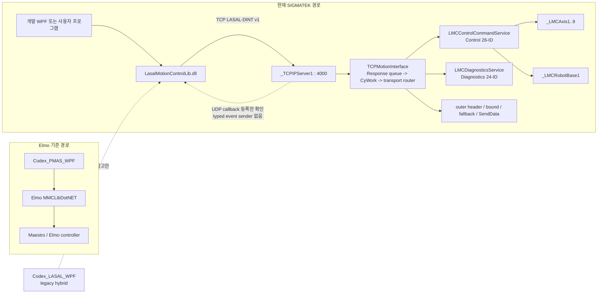

# Elmo Master 현재 아키텍처 및 릴리스 상태 재분석

- 감사일: 2026-07-16
- 마지막 source/실기 상태 검토: 2026-07-27 diagnostics D1~D4 single-bank와
  test-profile D5 general-inline SDO Read 활성, group Phase 0 option/position 계약 정합,
  Phase 1 read-only Admin/facade, Phase 2 `0x7D22 GroupMoveLinearRelative` 및 PMAS native
  capture 정렬. 같은 날 Admin/drive read/relative motion/D1 PI/D2 Bulk, 동적 group
  monitor/PowerOff, `0x2051` None/ACS static alias, D5 general-inline 1/2/4-byte와
  TypeMismatch 후 복구 capture PASS. 이후 `0x2047` accepted-then-poll와
  Group/Bulk/Recorder qualification UI source 및 PC build 완료; 해당 신규 경로의 PLC
  live 검증은 아직 없음. 같은 날 Phase 1 checkpoint에서 `TCPMotionInterface.MsgPaser`의
  Admin, diagnostics, registry, axis, Group 50개 command body를 다섯 private family
  handler로 byte-equivalent 분리했고 source/full static 계약을 통과했다. 2026-07-24 no-task
  `LMCControlCommandService`의 class/method/client/generated metadata와
  `GroupMovePos`/`GroupKinematicReady`/확장된 `MoveLinearAbsEx` 선언까지 저장했다. 이어
  Group 11개와 Group-domain Admin 2개 body를 dormant service에 구현하고 command별
  pointer/size/response/native-dispatch 의미 계약을 포함한 SourceOnly 검증을 통과했다.
  이어 Phase 3B source에서 `HandleRequest`의 명시적 13-ID 분기와 `MsgPaser`의 단일
  zero-copy route를 활성화해 SourceOnly/full `Phase3GroupRouted`를 통과했다. Phase 4에서는
  Registry 3개, Axis 8개, Group 11개, Admin 4개의 Control 26개 전체를 service의 exact family
  route로 전환하고 TCP local family caller를 0개로 만들었다. SourceOnly/full
  `Phase4AllControlRouted`를 통과했으며 service object와 관련 network 연결 11개는 그대로다.
  이어 diagnostics `0x7E00` capability를 `LMCDiagnosticsService`로 이동하고 Diagnostics 24개를
  payload-only single-call/single-send 경로로 통합해 SourceOnly/full
  `Phase4DiagnosticsRouted`를 통과했다. 이후 Phase 5 external text cleanup으로
  `TCPMotionInterface` generated server/client/data count를 `4/3/0`, 구현 함수를 8개로 줄이고
  Diagnostics route를 `MsgPaser`에 inline했다. `Comm_Network.lcn`의 TCP direct axis/robot
  연결 10개를 제거해 `ONE_Comm_Network_Table.st` external connection text도 26개에서
  16개로 정리했다. tracked `Classes.lcb`/`Networks.lcb`도 transport-only registration과
  network tuple 계약을 만족해 switch 없는 Phase 5 SourceOnly/full static이 PASS했다.
  2026-07-24 14:40~14:46 main project LASAL log에서 Compiler/Linker 완료,
  ERROR/FATAL 0건과 `CInvalidArgException` 0건을 확인했다. `Find in Implementation` smoke와
  PLC runtime은 아직 완료하지 않았다.
  Phase 3A에서 성공한 Rebuild는 당시
  `ONE_Comm_Network_Table.st`를 당시 network 기준으로 재생성했고 Link, PLC Download,
  project load도 성공했다. 종료 전 `ControlCommands`/`LMCAxis3` implementation search와
  전체 LASAL log의 `CInvalidArgException` 0건도 확인했다. 이 과거 PLC runtime 증거는 route
  활성화 전 checkpoint다. 현재 Phase 5는 Compiler/Linker까지만 새로 통과했고 PLC runtime은
  사용자의 별도 테스트 폴더 구동시험 결과를 기다린다
- 기준 branch: `main`
- 감사 시작 기준 commit: `f8f99a299f72c118c9a243d0165368d666d0cd0f`
- 현재 API 표기: `LasalMotionControlLib 0.9.1-preview`
- 판정: 임시 Phase 4 snapshot의 PC Debug/Release 각 148 tests, 개발 WPF Debug/Release build와
  routed static PASS는 역사적 checkpoint 증거이며 현재 Phase 5 결과로 대체됐다. 현재 Phase 5
  source/network와 tracked binary metadata는 transport-only 구조로 정적으로 일치하고,
  switch 없는 `Phase5TransportClean` SourceOnly/full이 PASS했다. 현재 Phase 5 worktree의 PC
  Debug/Release 각 260/260 tests가 PASS했다. 직전 256개에 UI 독립 D5 quarantine ledger
  deterministic concurrency 계약 시험 4개가 추가됐다. 개발 WPF build도
  PASS했다. LASAL
  Compiler/Linker는 통과했고 implementation smoke, PLC packet/runtime/performance 검증은
  아직 수행하지 않았다.
  Group/Bulk/Recorder 자동 qualification, Recorder exact/0/0 reconnect-adopt와 read-only
  D5 abort/recovery runner, internal negative-wire 도구는 code/build/test 단계까지만 완료됐으며
  D5에는 submit-outcome unknown quarantine, same-connection BootId/MapRevision mismatch 격리,
  multi-evidence two-ticket recovery proof와 unresolved 상태변경 gate까지 반영됐다.
  PLC live, fault, stale identity, reconnect/adopt/abort/raw rejection wire
  evidence, RT evidence와 장비 안전 matrix가 남아 production
  승인본은 아님

이 문서는 현재 Git source를 다시 대조해 프로젝트 전체의 역할, 구현 범위,
검증 수준과 남은 위험을 한곳에 고정한 기준 문서다. 날짜가 더 오래된 설계·분석
문서와 충돌하면 현재 source, 자동 계약 검사, 이 문서 순서로 판단한다.

## 1. 판정 용어

이 문서에서는 다음 상태를 구분한다.

- **확인**: 현재 Git source, tracked network 또는 이번 감사에서 직접 실행한 빌드로 확인했다.
- **정적 검증**: serializer/parser/source/network의 문자열·offset·shape 계약을 자동 검사했다.
- **미검증**: LASAL IDE, 다운로드된 PLC 또는 실제 장비에서 확인한 증거가 없다.
- **추정**: source 구조로 가능성을 판단했지만 runtime 증거가 없다.

`source-active`, `build PASS`, `static contract PASS`는 PLC 동작 완료와 같은 뜻이 아니다.

## 2. 핵심 결론

| 항목 | 현재 상태 | 판정 |
|---|---|---|
| PMAS/MMCLib 기준 앱 | `Codex_PMAS_WPF` | 비교·벤치마크 기준, LASAL 배포 앱이 아님 |
| 구 LASAL WPF | `Codex_LASAL_WPF` | 실제 TCP 일부와 local simulation/no-op이 섞인 legacy hybrid 참고 앱 |
| 현재 PC API source | `LMC_Library/LMC_API_Delivery/src` | canonical |
| 현재 개발·실기 진단 WPF | `LMC_Library/LasalApiWpfTestApp` | canonical API source ProjectReference 사용 |
| 외부 배포 예제 | `LMC_Library/LMC_API_Distribution` | 내부 PLC 시험 종료 전 동결; 현재 완료 기준에서 제외 |
| 현재 PLC source | `Lasal_PRG/Elmo_EtherCAT_Test_4Axis` | canonical tracked LASAL project |
| single-axis 범위 | descriptor `1..9` | 축 1~4 physical, 축 5~9 simulated |
| Cartesian group move/lock | X/Y/Z/U 축 1~4 | 9축 group interpolation이 아님 |
| 기존 motion/group command | 25개 | 캡처 기반 23 + local motion extension 2 |
| Admin command | 4개 | `0x7D00` capability, `0x7D10` axis parameter, `0x7D20` group parameter, `0x7D22` group relative move |
| diagnostics PLC test 범위 | D0~D4 single-bank + D5 general-inline | Health/Catalog/PI Read, Bulk, Recorder Ring/Trigger, typed 1/2/4-byte SDO Read test profile |
| diagnostics 계약-only/비활성 범위 | D4 Double/D5 Write·extended | D4 Double, PI/SDO Write와 8/12-byte 및 extended result는 비활성 |
| 성공 응답 capable PLC active command | 51개 | 기존 motion/group 25 + diagnostics 22 + Admin 4 |
| dispatcher/wire handled contract | 53개 | active 51 + reserved D5 `0x7E21/0x7E51` 2 |
| CyWork service-executed axis/group control·read·motion command | 18개 | 축 8 + 그룹 10; Admin motion `0x7D22`는 별도, metadata lookup 제외 |
| PC 자동 테스트 | 현재 Phase 5 all-failure-context worktree Debug/Release 각 260/260 PASS | 직전 256개 + UI 독립 D5 quarantine ledger deterministic concurrency 4개; PLC 통합과 별도 |
| 개발 WPF | D5 포함 Debug/Release build 경고 0/오류 0 PASS; Phase 4 Group/Bulk/Recorder visual/startup smoke는 역사적 증거 | D5 panel visual, Phase 5 앱 실행 및 실제 PLC scenario는 별도 |
| qualification 자동화 | Group/Bulk/Recorder, read-only D5 abort/recovery와 `0x2045` 10,000-call runner code/build PASS. D5는 submit outcome/BootId·MapRevision quarantine, 순수 scope policy, multi-evidence two-ticket recovery proof, unresolved mutation gate와 15~120초 cleanup 포함 | 신규 runner의 PLC live packet 미검증; PC API RPC elapsed는 PLC dispatch/jitter/overrun 증거가 아님 |
| LASAL SourceOnly 정적 계약 | Phase 5 default PASS | source와 tracked class registration 일치; binary gate 우회 없음 |
| LASAL full static 계약 | Phase 5 default PASS | source/XML/generated table/tracked network metadata 정적 일치; IDE Compiler/Linker도 2026-07-24 log PASS |
| D5 executor 초기화 | constructor declaration/implementation 미완료 | 자동 zero-init 공식 보장 미확인; current Busy 직접 원인은 아니며 IDE declaration P1 필요 |
| LASAL IDE | Phase 5 main project Compiler/Linker, ERROR/FATAL 0, `CInvalidArgException` 0 PASS | `Find in Implementation` smoke와 PLC download/runtime은 별도 |
| Admin IDE/PLC | `0x7D00/10/20/22` live happy-path capture PASS; `0x2047` source/static 수정 완료 | 새 `0x2047` IDE/download/ACK timing과 invalid/stale/fault는 별도 |
| 기존 motion/group PLC E2E·재캡처 | 25-command 전체 matrix 미완료 | 기존 subset capture PASS; true Buffered/stop-first code/build 완료, live packet은 별도 |
| diagnostics PLC 시험 matrix | D1 Catalog/4 PI, D2 4-entry Bulk, D5 general-inline 1/2/4-byte와 same-BootId TypeMismatch recovery capture PASS | Bulk/Recorder soak, Bulk operator partial/recovery와 Recorder reconnect/adopt code/build만 완료; live soak/fault/reconnect/adopt와 D5 나머지 fault는 별도 |

프로젝트 폴더명에는 `4Axis`가 남아 있지만 현재 의미는 다음처럼 나눠야 한다.

```text
API 및 software axis        1..9
physical Elmo/DS402 axis    1..4
simulated software axis     5..9
Cartesian group move/lock   1..4 (X/Y/Z/U)
```

## 3. 전체 구조



두 경로는 API 이름과 시험 의도를 비교할 수 있지만 wire 호환으로 취급하면 안 된다.
PMAS 캡처에는 LREAL/REAL ABI가 있고 현재 LASAL adapter는 caller가 변환한 DINT를
전송하는 별도 `LASAL-DINT v1` 계약이다.

현재 source에서 control/diagnostics command body는 각각 no-task service가 소유하고
`TCPMotionInterface`는 lifecycle/session, queue, route, outer response와 최종 send만 소유한다.
TCP local family/helper와 direct axis/robot client는 제거됐다. tracked class/network
metadata도 이 구조와 정적으로 일치하지만 LASAL IDE Rebuild/Link와 PLC runtime까지
검증한 상태는 아니다. 최종 transport/control class 분리의 책임, 성능 불변조건과
단계별 network 이행은
[TCPMotionInterface 성능 우선 OOP 분리 설계](LMC_TCP_MOTION_INTERFACE_PERFORMANCE_FIRST_OOP_REFACTOR_DESIGN_2026-07-23.md)를
따른다.

## 4. 디렉터리별 책임

| 경로 | 현재 책임 | 사용 판단 |
|---|---|---|
| `Codex_PMAS_WPF` | Elmo MMCLib 기능, cycle/group benchmark 기준 | 유지 |
| `Codex_LASAL_WPF` | 초기 TCP 이식 실험, PMAS UI parity, benchmark 비교 | 신규 기능 기준으로 사용 금지 |
| `LMC_Library/LMC_API_Delivery/src` | C# API 유일 source | 수정 기준 |
| `LMC_Library/LMC_API_Delivery/tests` | PC request/parser/fake RPC와 LASAL 정적 계약 | 회귀 기준 |
| `LMC_Library/LasalApiWpfTestApp` | 현재 source를 직접 참조하는 개발/실기 앱 | 내부 기준 앱 |
| `LMC_Library/LMC_API_Distribution` | DLL, 독립 예제, 사용자 매뉴얼 | 외부 전달 기준 |
| `LMC_Library/LMC_API/Elmo_API_Packet2` | PMAS packet 근거와 field 분석 | evidence, 현재 LASAL 상태와 분리 |
| `LMC_Library/LMC_API/LMC_API` | `0.9.0-pc-api` 보관본 | 배포·개발 사용 금지 |
| `Lasal_PRG/Elmo_EtherCAT_Test_4Axis` | current PLC adapter, axis/group/network | LASAL 수정 기준 |
| `test/packet_capture`, `test/profile_capture` | packet/profile 실험 증거 | 원본 evidence |
| `test/Reports_PMAS`, `test/Reports_Lasal` | 비교 시험 결과 | 결과 원본 |
| `docs/history/260716` | 대형 작업 히스토리 분할본과 이어하기 요약 | 과거 맥락 |

## 5. PC API와 wire 계약

### 5.1 공개 모델

- `LMCConnection`: TCP/RPC lifecycle, UDP listener, timeout, 상태와 session generation 소유
- `LMCDiagnostics`: 같은 connection/session/wire를 사용하는 diagnostics capability 진입점
- `LMCAdmin`: `0x7D00/10/20` read와 `0x7D22` relative motion의 capability-gated 진입점
- `LMCSingleAxis`: lookup 후 descriptor를 보관하고 축 1~9에 같은 API 제공
- `LMCGroupAxis`: group descriptor `0x0100`, member/state/power/lock/motion API 제공
- `LMC_Response`와 typed result: frame shape, command status와 error를 분리
- DLL은 UNIT을 자동 변환하지 않음

TCP request/response는 connection별 하나의 exchange gate로 직렬화된다. reconnect 뒤
이전 axis/group object는 stale generation으로 거부된다. async API는 현재 blocking
socket 작업을 `Task.Run`으로 감싸므로 비동기 wire pipelining을 제공하는 구조는 아니다.

### 5.2 command matrix

| 구분 | ID | 기능 | source 상태 |
|---|---|---|---|
| Lifecycle | `0x8080`, `0x405C`, `0x405D` | init, callback 등록, close | active |
| Admin | `0x7D00`, `0x7D10`, `0x7D20`, `0x7D22` | capability, axis/group semantic parameter read, group relative move | source/static + 2026-07-23 live happy path PASS |
| Diagnostics negotiation | `0x7E00` | capability/envelope | D1~D3 test capability, retained BootId 실패 시 fail-closed |
| Diagnostics D1 | `0x7E01`, `0x7E02`, `0x7E10`, `0x7E20` | Catalog, Health, PI Read | Catalog와 축 1..4 PI live PASS; Health fault matrix는 별도 |
| Diagnostics D2 | `0x7E30`~`0x7E33` | Bulk configure/status/snapshot/release | 4-entry live PASS; exact 24-entry snapshot/lifecycle 및 operator-only one-slave-offline partial/recovery UI code/build와 PC 순수 판정 PASS, live soak/fault는 별도 |
| Diagnostics D3 | `0x7E40`, `0x7E41`, `0x7E43`~`0x7E49` | single-bank Recorder lifecycle/upload | Single Manual/header/double-download와 reconnect exact/0/0 discovery UI code/build PASS, PLC runtime/wire 미검증 |
| Diagnostics D4 single-bank | `0x7E40`, `0x7E42` | Ring capture, Edge/Window/Mask/forced Trigger | Ring forced-trigger/100-cycle soak UI code/build PASS, PLC runtime 미검증; Double은 거부 |
| Diagnostics D5 | `0x7E03`, `0x7E04`, `0x7E21`, `0x7E50`, `0x7E51` | PI/SDO ticket/chunk | `0x7E03/04/50` 활성; general-inline 1/2/4-byte와 TypeMismatch recovery packet PASS; `0x7E21/51` reserved |
| Lookup | `0x103C`, `0x1042`, `0x202B` | axis/group lookup, AxisInfo | active |
| Axis control | `0x2023`, `0x2024`, `0x2022` | power, reset, stop | active, 축 1..9 |
| Axis read | `0x2028`, `0x202E` | status, position | active, 축 1..9 |
| Axis motion | `0x209F`, `0x20A0`, `0x20A2` | absolute, relative, velocity | active, 축 1..9 |
| Group member | `0x20D2` | member info | 16-slot 응답, AxisCount 9 source |
| Group state | `0x2045` | status | active |
| Group lock | `0x2047`, `0x2048` | LockProfile, UnlockProfile | active, 축 1..4 mask |
| Group reset/stop | `0x2049`, `0x2085` | error reset, stop | active |
| Group power | `0x204A`, `0x204B` | RobotOn, RobotOff | project-local extension |
| Group position | `0x2051` | DINT position vector | None/ACS member-slot alias source/static + `09b` live PASS; true transform 아님, MCS/PCS 거부는 live 미검증 |
| Group motion | `0x20A4`, `0x7D22` | MoveLinearAbsolute, MoveLinearRelative | X/Y/Z/U 4축 기존 live PASS; true Buffered/stop-first runner code/build PASS, 신규 live는 별도 |
| Kinematics | `0x20E7` | Cartesian4 identity 설정 | active, dynamic transform 아님 |

현재 성공 응답 capable PLC active 고유 ID는 51개다. 기존 motion/group 25개,
diagnostics D0~D4 single-bank 19개, test profile에서 활성화한 D5
`0x7E03/0x7E04/0x7E50` 3개와 Admin 4개를 합한 값이다.
reserved `0x7E21/0x7E51`까지 포함한 dispatcher/wire contract는 53개다.
Admin 4개는 source/static active 수에 포함하고 2026-07-23 happy-path PLC capture도
통과했다. D5는 first PLC runtime의 same-cycle timeout을 수정했고 Slave 1~4 legacy happy-path 성공 증거를 확보했다. 과거 BootId 6
general-inline capture에서는 두 Submit이 ticket 전 `ResourceBusy`로 거부됐지만,
callback ordering/release source 수정 뒤 `10_DriveRead_Axis1to4`에서 general-inline
Int8/1과 BitField16/2 성공 ticket을 확보했다. 이어
`12_SDO_GeneralInline_4Byte_FailureRecovery`에서 UInt32/4 성공, 의도한 UInt16/2
TypeMismatch 실패, 같은 BootId 8의 Int8/1 복구 성공을 확보했다. timeout, queued cancel,
offline/abort, disconnect/orphan과 contention matrix는 남아 production 승인 수치와는
계속 구분한다.
`0x204A/0x204B`, Admin 4개와 diagnostics 24개는
PMAS 캡처에 없는 LASAL-local extension이다. 18개라는 CyWork 수치는 lifecycle,
diagnostics와 name/member metadata handler를 제외하고 control service가 같은 CyWork
호출 context에서 동기 실행하는 axis/group control·read·motion 명령의 합계다. 축 8개와 그룹 10개이며 Admin motion
`0x7D22`도 같은 CyWork queue를 사용하지만 그 18개에는 포함하지 않는다.
lookup과 `0x20D2`도 `_GetObjName` client metadata를 읽으므로 “전체 client-call
수”라고 부르면 안 된다.

### 5.3 frame과 단위

request header는 8 bytes다.

| Offset | 크기 | 의미 |
|---:|---:|---|
| 0 | 2 | command ID, little-endian |
| 2 | 2 | reserved |
| 4 | 2 | payload length |
| 6 | 2 | opaque object descriptor |

단위 책임은 호출자에 있다.

```text
송신 DINT = 물리값 x PLC application UNIT
표시 물리값 = 수신 DINT / 같은 UNIT
Jerk DINT = (물리 jerk / 1000) x application UNIT
```

현재 tracked network의 `_LMCAxis1..9`는 모두 다음 값이다.

- `ExUnits=8388608`
- `IntUnits=1 mm`, 즉 `10000 DINT`
- `MoveType=_JERK_PROFILE`
- `JMax=75000 mm`
- `SWMinPos=-10000 mm`, `SWMaxPos=10000 mm`

`ExUnits`는 encoder/transmission ratio이며 PC application UNIT이 아니다. 과거
문서의 `IntUnits=10 mm(100000)`은 현재 Git과 다르다.

또한 현재 비율에서 zero offset 기준 signed DINT의 한쪽 raw coordinate 창은 약
`255.9999 mm`다. 따라서 network에 표시된 `±10000 mm` software limit만 보고
실제 도달 가능한 위치 범위가 확보됐다고 판단하면 안 된다. 다운로드된 PLC의
MaxModulo, BinOffset, absolute reference offset과 실제 기계 limit를 함께 읽어야 한다.

## 6. LASAL runtime과 topology

### 6.1 task와 queue

- `TCPMotionInterface`: RealtimeTask false, CyclicTask true, 기본 1 ms
- Phase 5 external text client: `_StdLib`, `ControlCommands`, `Diagnostics` 3개
- Phase 5 external text generated channel: server 4 (`AxisRef`, `CommandID`, `CurrentSock`,
  `Payload`), client 3, data 0
- `LMCControlCommandService`: task 없음, motion client 10 (`LMCAxis1..9`, `LMCRobot`)
- receive accumulator: 2048 bytes
- request buffer: 1328 bytes
- queue payload: 1320 bytes
- queue depth: 8
- TCP server: port 4000, `MaxConnections=1`

`Response()`가 완전한 frame을 queue에 게시하고 non-RT `CyWork()`가 parser를 실행한다.
parser는 control/diagnostics service를 같은 CyWork call context에서 동기 호출하고 transport가
최종 response를 전송한다. interface 전용 RT task, `RtWork()` mailbox와 atomic
state는 현재 사용하지 않는다. 각 `_LMCAxis` object 자체는 1 ms realtime task를
사용하므로 가상축 5개를 포함한 CPU load와 jitter는 PLC에서 확인해야 한다.

위 count와 route는 source와 tracked metadata의 정적 근거다. LASAL IDE Rebuild/Link와
PLC download 전에는 runtime topology 확정값으로 사용하지 않는다.

### 6.2 axis와 group 경계

| 대상 | 축 1..4 | 축 5..9 |
|---|---|---|
| `_LMCAxis` software object | 있음 | 있음 |
| `SimulateMode` | 0 | 1 |
| physical Elmo/DS402 연결 | tracked network에서 확인 | 없음 |
| single-axis descriptor/API | 지원 | 지원 |
| robot software member 연결 | 있음 | 있음 |
| Cartesian SetKin/Lock/Move | 사용 | 사용하지 않음 |

9개 software axis가 robot에 연결돼 있다는 사실과 Cartesian group이 4축이라는
계약을 섞으면 안 된다. 5~9축을 group lock에 단순 추가하면 기존 4좌표 request의
zero padding 때문에 의도하지 않은 0 위치 이동 위험이 있다.

### 6.3 GroupReadActualPosition 계약 확정

`0x2051` handler는 `GetRobotPosition()` 결과 `_LMCPROF_POS` 36 bytes(Pos1..Pos9)를
DINT[16] response slot 1..9에 복사하고, zero-clear된 slot 10..16을 0으로 유지한다.
이는 `GroupMembers`의 9개 software member metadata와 일치한다. Cartesian
Move/SetKin/Lock은 계속 physical X/Y/Z/U 축 1..4만 대상으로 한다.

좌표계는 None(0)/ACS(1)만 no-CalcModel static member-slot alias로 허용한다.
MCS(2)/PCS(3)는 C#에서 RPC 전 `NotSupportedException`, 구 SDK 요청은 PLC에서
`ErrorId=-7`로 거부한다. 알 수 없는 enum은 malformed `-3`이다. C# result의
`CoordinateSystem`은 PLC 응답값이 아니라 요청 enum echo다.

`09b_Group_ReadPosition_None_ACS_2051` live capture에서 coordinate 0/1 요청이 각각
exact 68-byte typed payload를 반환했고, 두 응답은 byte-identical했다. 두 응답 모두
`HeaderStatus=0`, `FunctionStatus=0x4000`, `ErrorId=0`이며 slot 1..4는
`[-999997, -999998, -999997, -999998]`, slot 5..16은 0이었다. 이것은 정의된
None/ACS static member-slot alias의 runtime 계약을 닫는다. true ACS transform가
구현됐다는 뜻이 아니며 MCS/PCS transform 또는 rejection의 live 증거도 아니다.

### 6.4 GroupStop 반환 의미

`LMCRobot.StopMove()` 반환은 `_LMCPROFERRORTYPES`가 아니라 `UDINT StopCmdNo`, 즉
정지가 끝날 profile-buffer command index다. 0/비0을 성공/실패로 해석하면 안 된다.
`0x2085` success ACK는 입력 검증, robot client 연결과 method dispatch를 뜻한다.
실제 정지 완료와 profile error는 `0x2045 GroupReadStatus`로 확인한다.

## 7. WPF 앱 판정

### 7.1 `Codex_PMAS_WPF`

Elmo MMCLibDotNET을 직접 참조하는 기준 앱이다. API 기능 비교와 생산 cycle
benchmark에 사용한다. Cycle Test의 기본 의미는 같은 motion 조건에서
`이동 -> 완료 확인 -> actor delay -> 복귀 -> 완료 확인 -> actor delay` 전체
생산 cycle 시간과 throughput을 비교하는 것이다. 통신 latency만 재는 시험으로
해석하지 않는다.

### 7.2 `Codex_PMAS_WPF_Version2`

`Codex_PMAS_WPF`를 별도 복제해 현재 LASAL diagnostics 화면과 기능을 PMAS/MMCLib
native API로 비교하기 위한 내부 reference app이다. 직접 MMCLibDotNET을 호출하므로
생성되는 packet은 native `0x10xx/0x11xx/0x20xx`이며 custom `0x7Exx`가 아니다.

2026-07-21 capture 분석으로 Health counter, selected PI Recorder 설정, Recorder
ready/header/range gate를 보완했다. 이 app과 capture는 PMAS 기능 의미와 호출 순서를
확인하는 근거다. LASAL PLC diagnostics wire/runtime 성공 근거 또는 배포 client로
사용하지 않는다. 자세한 결과는
`ELMO_NATIVE_API_PACKET_CAPTURE_ANALYSIS_2026-07-21.md`와
`LMC_NATIVE_CAPTURE_ALIGNMENT_IMPLEMENTATION_DESIGN_2026-07-21.md`를 따른다.

### 7.3 `Codex_LASAL_WPF`

이름과 UI 때문에 현재 LASAL 앱처럼 보이지만 실제로는 legacy hybrid다.

- 일부 command는 `TcpClient`로 전송한다.
- 일부 read/motion은 local state simulation이다.
- 일부 group/override/kinematic API는 no-op 또는 fabricated result다.

빌드는 통과하지만 canonical E2E client로 사용하면 안 된다. PMAS UI 비교와 과거
cycle benchmark 재현 참고 용도로만 남긴다.

### 7.4 현재 개발·배포 앱

- 개발 앱은 `LMC_Library/LasalApiWpfTestApp`이며 API source를 ProjectReference한다.
- 배포 앱은 `LMC_Library/LMC_API_Distribution/02_Example_Program`이며
  `../../01_API/LasalMotionControlLib.dll`만 상대 참조한다.
- 2026-07-21부터 diagnostics 내부 시험 기능은 개발 앱에서 먼저 검증한다. 배포 앱과
  source mirror를 유지하는 것은 현재 완료 기준이 아니다.
- Phase 1의 `Read-only API` 탭은 Admin capability를 먼저 확인한 뒤 physical axis
  1~4의 semantic parameter, group `0x0100` parameter, typed operation mode와
  non-atomic drive status를 실기 확인한다. motion/write command는 포함하지 않는다.
- Group Motion 탭의 `Move Linear Relative`는 별도 Admin `0x7D22`를 사용하며
  absolute와 같은 power/identity/profile-lock, motion-uncertain, Stop과 완료 monitor를
  재사용한다. 2026-07-23 capture에서 Aborting/Buffered 수락과 X/Y/Z/U 축별 왕복,
  Stop/PowerOff recovery가 PASS했다. 이후 true Buffered chaining과 deterministic
  stop-first runner는 code/build 완료했지만 live packet/endpoint 검증은 별도다.
- 기존 Group Motion, Bulk Snapshot, Recorder 탭에는 공통 `QTEST` runner와 scenario별
  입력/cancel/save 영역을 추가했다. Bulk는 exact 24-entry snapshot/lifecycle과
  Group PowerOff/Disabled 기반 one-slave-offline/restore 두 operator checkpoint,
  Recorder는 Single Manual/Ring forced-trigger/trigger soak를 public SDK로 실행한다.
  이 문단은 source/build 상태이며 실제 PLC 성공을 뜻하지 않는다.
- `04b` capture에서 계산된 55.034초 감시 한도로 20.152초 장시간 absolute move의
  stable InPosition을 확인해 과거 고정 15초 false-timeout을 닫았다. companion TXT가
  0 byte라 화면의 정확한 timeout 문자열은 별도 UI 증거가 아니다.
- `08c` capture/log에서 현재 UI의 Disable -> PowerOff -> final Read Status
  `PowerOn=False` 흐름은 PASS했다. 버튼 label과 `IsEnabled`의 시각 상태는 screenshot
  또는 UI automation으로 별도 확인한다.
- 내부 PLC 시험과 API 계약이 확정된 뒤 검증된 DLL/예제/문서를 배포 폴더로 옮긴다.

## 8. 배포 상태

이 절의 hash/version은 2026-07-16 배포 snapshot 기록이다. 2026-07-21 diagnostics
개발 변경은 아직 배포 폴더에 반영하지 않았으며, 내부 시험 전에는 반영하지 않는다.
배포 version 관리 자동화도 이번 구현의 필수 조건이 아니다.

tracked 배포 패키지는 정확히 세 번호 폴더와 README로 구성한다.

| 폴더 | 내용 |
|---|---|
| `01_API` | `LasalMotionControlLib.dll` |
| `02_Example_Program` | binary-reference WPF source와 `Run` 실행본 |
| `03_API_User_Manual` | 한국어 DOCX/PDF |

이번 감사에서 확인한 세 API DLL의 값은 동일하다.

- Assembly/File version: `0.9.1.0`
- Product version: `0.9.1-preview`
- Size: `72,192 bytes`
- SHA-256: `4603E663A8BA34674BDD68C1DBB293C9FF676F180558EB8BCBE563B3DA878FCE`

`Build-LmcApiDistribution.ps1`는 hash를 검증하고 console에 출력하지만 현재
배포 폴더 안에 manifest를 생성하지 않는다. `RELEASE_MANIFEST`와
`BUILD_METADATA` 문자열도 배포 text에서 금지한다. 과거 문서의 “manifest 포함”
설명은 현재 정책과 다르다.

빌드한 working tree에는 ignored `bin/obj`가 생길 수 있다. 그대로 압축하지 말고
배포 script의 cleanup이 끝난 뒤 tracked/cleaned 파일만 전달한다.

외부 DOCX/PDF는 적용 API `0.9.1-preview` 표기는 맞지만 문서 버전은 아직
`1.0`이다. 내부 Markdown 원본은 `1.5`이므로 현재 안전·계약 보완이 외부 manual에
출판되지 않았다. 외부 문서에는 특히 다음 release 경고가 부족하다.

- motion/group 전체 25-command matrix는 미완료지만 2026-07-23 Admin/group relative/
  Stop/PowerOff, D1 Catalog/PI, D2 Bulk와 D5 axis 1~4 happy path는 PASS했다. D3/D4 runtime,
  D1/D2/D5 fault/soak live matrix는 미완료인 non-production preview
- `Close`/`Dispose`/cancellation은 Stop이 아님
- E-stop, software/hardware limit, UNIT, Home 확인 필요
- DLL strong-name/AuthentiCode 서명 없음

현재 외부 전달 전에는 이 경고를 별도 승인 문서로 보완하거나 DOCX/PDF를 개정해야 한다.

## 9. 2026-07-16 감사와 2026-07-20 D0 검증 결과(과거 snapshot)

### 9.1 당시 통과

- PC request golden 8 cases
- response parser 13 cases
- fake RPC/lifecycle 25 cases
- 기존 PC 합계 46/46 PASS
- diagnostics D0 7개 추가 후 현재 PC 합계 53/53 PASS
- LASAL source-only static contract PASS
- LASAL full-network static contract PASS
- `Codex_PMAS_WPF` VS2019 Debug build PASS
- `Codex_LASAL_WPF` VS2019 Debug build PASS
- 현재 개발 WPF Debug build PASS
- binary-reference 배포 WPF Debug build PASS
- 주요 배포 DLL 3개 byte/hash 동일
- `Build-LmcApiDistribution.ps1 -AllowDirty` preview pipeline PASS
  - 2026-07-16 Release rebuild 당시 46 PC tests와 두 LASAL contract 재통과
  - 임시 복사본의 배포 예제 Debug/Release 독립 build 통과
  - 금지된 internal reference scan과 cleanup 통과
  - 외부 manual shape 21 pages 확인; 내용의 안전 경고 부족은 별도 미해결
- 점검 범위의 Markdown relative link scan: broken link 없음

자동 시험의 packet golden에는 PMAS 캡처 근거와 synthetic LASAL-DINT vector가
섞여 있다. synthetic DINT position vector는 실제 PLC golden으로 보지 않는다.
별도로 `09b`의 두 exact 68-byte response는 current PLC의 live static-alias 증거다.

### 9.2 미검증

- Phase 5 source와 tracked metadata를 LASAL IDE에서 Reload Class하고 declaration/Object
  Network 저장·재생성 결과가 그대로 유지되는지 확인
- IDE-generated state에서 TCP direct axis/robot 연결 10개 부재, control service axis/robot
  연결 10개와 TCP `ControlCommands`/`Diagnostics` 연결 유지, external connection 16개 확인
- Phase 5 LASAL IDE Rebuild/Link와 implementation smoke. switch 없는
  `Phase5TransportClean` SourceOnly/full static은 현재 PASS했다.
- `-AllowStaleLasalBinaryMetadata`는 binary registration gate를 우회하는 중간 검사 옵션이며
  현재 final static 결과에는 사용하지 않았다.
- 9축/group 변경 후 LASAL IDE Rebuild/Link
- 변경 class `Find in Implementation` smoke
- smoke 이후 `%TEMP%/Lasal2.log` 신규 `CInvalidArgException` 부재
- PLC download와 Git network 일치
- CyWork와 motion RT task의 CPU core/priority/jitter
- 축 1..9 각 command 실제 동작
- `0x2047 GroupEnable` accepted-then-poll 수정본의 LASAL IDE build/download와 live ACK 0.
  source/static에서는 same-cycle LockState read를 제거했지만 후행 status와 packet은 아직
  재검증하지 않았다.
- true ACS/MCS/PCS coordinate transform. `09b`는 None/ACS static alias만 live PASS했고,
  MCS/PCS rejection은 source/static 계약만 있으며 live negative capture가 없다.
- true Buffered chaining과 stop-first race의 PLC live packet/final 상태. runner code/build만
  완료했다.
- 신규 command의 invalid/stale/fault packet matrix와 UDP typed event payload
- callback sender와 payload schema
- multi-PC motion ownership

### 9.3 local evidence inventory

2026-07-16 working tree에서 확인한 원본/분석 자료 규모다. `.gitignore` 대상이
포함될 수 있으므로 Git 추적 파일 수가 아니라 local evidence inventory다.

| 경로 | 파일 수 | 대략 크기 |
|---|---:|---:|
| `LMC_Library/LMC_API/Elmo_API_Packet2` | 50 | 0.20 MiB |
| `test/packet_capture` | 42 | 10.80 MiB |
| `test/profile_capture` | 15 | 1.59 MiB |
| `test/Reports_Lasal` | 31 | 272.21 MiB |
| `test/Reports_PMAS` | 31 | 205.67 MiB |
| `output/pdf/maestro_api_md` | 188 | 4.15 MiB |

기존 캡처는 PMAS wire 근거로 유효하지만 current LASAL-DINT PLC 응답의 실기
golden을 대신하지 않는다.

2026-07-23 current LASAL-DINT Admin/relative/drive/PI/Bulk, dynamic group monitor,
PowerOff와 D5 4-byte/recovery 증거는
[SIGMATEK Phase 1/2 live capture 분석](SIGMATEK_PHASE1_PHASE2_LIVE_CAPTURE_ANALYSIS_2026-07-23.md)을 따른다.

## 10. 발견 사항과 우선순위

### P0: production 승인 전 필수

1. D0-D4와 shadowing을 수정한 D5 general-inline source/network는 최신 정적 계약을
   통과했다. gate-on 첫 download의 same-cycle timeout을 수정했고 BootId 5 후속 캡처에서
   legacy `0x1000:0` Slave 1~4는 모두 43~54 cycles 뒤 Completed/Success와 UInt32
   4-byte 결과를 반환했다. 과거 BootId 6 general-inline 캡처의 `ResourceBusy(9)` 원인은
   source에서 callback ordering과 owned completion 회수 결함으로 확인해 수정했다.
   이후 `10_DriveRead_Axis1to4`에서 general-inline Int8/1과 BitField16/2가 축 1~4에서
   Completed/Success를 반환했다. `12_SDO_GeneralInline_4Byte_FailureRecovery`에서는
   UInt32/4 성공과 동일 BootId TypeMismatch 후 Int8/1 복구도 PASS했다. D5의
   offline/abort, timeout, queued cancel, disconnect/orphan, duplicate/late callback과
   contention matrix는 아직 없다. Group/Bulk/Recorder qualification source와 build는
   완료했지만 live evidence가 없으므로 motion/group 25-command 전체 matrix, D1/D2
   fault/soak, D3/D4 runtime/reconnect-adopt 및 D4 Double matrix는 별도 수행해야 한다.
2. 다운로드된 PLC의 UNIT, MaxModulo, BinOffset, reference offset과 실제 안전 limit를 확인해야 한다.
3. tracked top-level network에서 `HWMin`, `HWMax`, `Emergency`, `RefSwitch` 외부 연결을
   확인하지 못했다. 이것은 장비에 안전 회로가 없다는 증거는 아니며 PLC/배선에서
   별도로 확인해야 한다.
4. 외부 DOCX/PDF에 preview/전체 motion matrix 미완료/diagnostics fault·soak 미완료/safe-stop 경고를
   반영해야 한다.

### P1: 계약 또는 runtime 위험

1. `GroupReadActualPosition`의 None/ACS static alias는 `09b` live capture까지
   확인했다. true ACS transform는 구현되지 않았고 MCS/PCS rejection은 live negative
   capture가 없어 generic Cartesian position 요구를 충족한 것으로 확대 해석하면 안 된다.
2. callback endpoint 등록은 있지만 LASAL event sender와 typed schema가 없다.
3. TCP adapter는 port 4000, one connection이지만 인증·권한·암호화가 없다. 장비망
   격리와 motion owner 정책이 필요하다.
4. legacy writable server/data channel은 Phase 5 external source에서 제거돼 generated
   server/client/data count가 `4/3/0`이고 tracked `Classes.lcb` record도 동일하다. LASAL
   Compiler/Linker와 오류 로그는 통과했지만 `Find in Implementation` smoke와 generated
   count 최종 확인 전에는 IDE 적용을 완전히 닫지 않는다.

### 2026-07-24 해결된 runtime 위험

1. PC response reader는 53개 command별 hard maximum을 response body read 전에 적용한다.
   최대 정상 payload는 Recorder chunk의 1,972 bytes다. 초과 길이는 allocation/read 전에
   `InvalidDataException`으로 거부하고 transport를 detach해 `Faulted`로 바꾸며, 미등록
   command는 wire 송신 전에 거부한다. 현재 Debug/Release 각 260/260 tests가 exact table,
   header-only 초과 응답, 최대값 허용과 최대값+1 거부를 검증한다.
2. `AxisInfo(0x202B)` 성공 응답의 payload `[0..3]` descriptor를 요청한
   `AxisReference`와 sync/async 모두 대조한다. 불일치는 `InvalidDataException`으로
   거부하고 기존 4-byte command error 의미는 보존한다. PMAS 38개와 SIGMATEK 32개
   capture sample에서 descriptor mismatch 0건을 확인했으며 mismatch 회귀 시험을
   현재 249-test suite에 포함된다.
3. read-only `0x2045` qualification의 요청 수 경계, nearest-rank percentile,
   throughput, SHA-256/raw cleanup, PASS evidence와 FAIL/ABORTED CSV 계약을 UI 독립
   `TransportQualificationAnalysis`로 분리했다. 같은 source를 PC test project에 linked
   compile해 WPF와 시험 코드의 판정 로직이 갈라지지 않게 했다. PASS는 10,000회 이상
   전량 완료, 정상 20-byte/12-byte 응답, 전체 hash와 byte stability를 모두 요구한다.
4. UDP callback handler 예외와 error-handler 예외 뒤 listener 계속 동작, callback
   thread 내부 `CloseConnection`/`Dispose` 재진입 종료를 loopback으로 검증했다. 네 경로는
   deadlock 없이 Disconnected/listener-stopped 상태로 끝났고 production source 수정은
   필요하지 않았다.

### P2: 유지보수·제품화

1. Phase 5 external text 기준 `TCPMotionInterface.st`는 `4/3/0`, 구현 함수 8개이고 local
   family/helper와 TCP direct axis/robot client는 0개다. Control 26-ID와 Diagnostics 24-ID는
   service가 소유하고 Diagnostics transport route는 `MsgPaser`에 inline됐다. `.lcn`의 direct
   연결 10개 제거와 `ONE_Comm_Network_Table.st` external connection 26→16도 반영됐다.
   `Classes.lcb`/`Networks.lcb`까지 포함한 switch 없는 final static은 PASS했고 LASAL IDE
   Compiler/Linker와 오류 로그도 PASS했다. implementation smoke와 PLC runtime은 대기 상태다.
2. `MsgPaser` 이름 교정은 호환 영향이 있는 별도 commit으로 남아 있다. `LmcConnection.cs`와
   개발 WPF `MainWindow.xaml.cs`도 여전히 책임이 집중돼 있다.
3. fuzz/property test와 장시간 reconnect/concurrency 시험은 없다. D5 quarantine ledger의
   bounded deterministic concurrency 4개는 존재하지만 장시간 stress를 대신하지 않는다.
   callback handler/error handler 예외 격리와 callback thread의 reentrant close/dispose도
   자동 시험을 추가했다.
4. DLL strong-name/AuthentiCode 서명이 없다.
5. Home 실행 API, MoveCircle, generic kinematics, typed callback은 현재 범위 밖이다.

## 11. 문서 권한과 읽는 순서

현재 상태는 다음 순서로 읽는다.

1. 이 문서
2. `LMC_Library/LMC_API/API_DEVELOPMENT_GUIDE.md`
3. `LMC_Library/LMC_API_Delivery/README.md`
4. `LMC_Library/LMC_API_Delivery/docs/DINT_PACKET_MAP.txt`
5. `LMC_Library/LMC_API_Delivery/docs/NINE_AXIS_DISPATCH_IMPLEMENTATION_2026-07-15.md`
6. current source와 tests

다음 문서는 목적상 과거 snapshot 또는 근거 자료다.

| 문서 | 읽는 방법 |
|---|---|
| `docs/PMAS_LASAL_Integrated_Analysis_2026-04-10.md` | PMAS/초기 dummy 분석 기준선 |
| `LMC_Library/LMC_API/Elmo_API_Packet2/PACKET_ANALYSIS.md` | PMAS packet evidence; 뒤의 LASAL 구현 상태 문구는 최신 source와 대조 |
| `LMC_Library/LMC_API_Delivery/docs/LASAL_COMMAND_QUEUE_RTWORK_DESIGN_2026-07-10.md` | 폐기된 RT mailbox 대안 |
| `LMC_Library/LMC_API_Delivery/docs/LASAL_SOURCE_QUEUE_AND_NETWORK_APPLY_PLAN_2026-07-10.md` | 4축 당시 적용 기록 |
| `LMC_Library/LMC_API/LMC_API/**` | `0.9.0-pc-api` legacy archive, 배포 금지 |

## 12. 권장 실행 순서

1. Phase 0 group option/position source와 `09b` None/ACS static-alias live 결과를
   기준선으로 고정한다. MCS/PCS rejection negative capture는 true transform와
   구분해 별도 시험한다.
2. [2026-07-22 gate-off baseline Rebuild/Link 완료, fixed-source runtime download 확인]
   shadowing 수정 D5 source의 IDE build/implementation smoke와 기준시각 이후 로그를
   별도 증거로 보존한다.
3. 다운로드 전 축 1~9 UNIT/profile/task와 group 연결을 readback한다.
4. physical E-stop, HW/SW limit, reference와 소규모 이동 범위를 승인한다.
5. RPC/lookup부터 축 1~9 read-only command를 재캡처한다.
6. 축별 Power/Move/Stop/PowerOff를 작은 값으로 시험한다.
7. group은 `PowerOn -> power poll -> SetKin -> Lock -> Move -> Stop/InPosition ->
   Unlock -> PowerOff` 순서로 시험한다.
8. 구현된 Group true Buffered/stop-first, D1/D2 24-entry/lifecycle와 D3/D4
   Single/Ring/trigger soak runner부터 pcap/QTEST 쌍으로 실행한다. 이어 기존 motion/group
   25 command의 request/success/expected failure와 상태 완료 근거, D1/D2 fault,
   Recorder reconnect/adopt, D4 Double fail-closed와 D5 offline/abort, timeout, queued cancel,
   disconnect/orphan, contention, Write·extended fail-closed matrix를 분리 저장한다.
9. callback과 multi-PC 정책은 실제 캡처 또는 승인된 local protocol 후 구현한다.
10. 외부 DOCX/PDF 안전 경고와 최종 hash/provenance를 갱신한 뒤 production 승인한다.

## 13. production Definition of Done

아래 조건을 모두 충족하기 전에는 `0.9.1-preview`를 production으로 바꾸지 않는다.

- current source commit과 배포 DLL provenance가 기록됨
- Phase 5 PC tests와 `Phase5TransportClean` source/full-network contract 통과
- LASAL IDE Rebuild/Link와 implementation smoke 통과
- 다운로드된 PLC의 source/network/unit/task가 Git과 일치
- 실제 장비 안전 chain과 limit 승인
- single-axis 1..9와 Cartesian group 1..4 적용 범위 승인
- command별 PLC E2E와 packet 재캡처 완료
- callback/ownership을 구현하거나 명시적으로 범위 제외
- 외부 사용자 매뉴얼에 preview, 안전, UNIT, 상태 polling 제약 반영
- 배포 폴더 cleanup과 hash/version 재확인

## 14. 근거 위치

- PC API source: `LMC_Library/LMC_API_Delivery/src`
- PC tests/static contract: `LMC_Library/LMC_API_Delivery/tests/LasalMotionControlLib.Tests`
- packet map: `LMC_Library/LMC_API_Delivery/docs/DINT_PACKET_MAP.txt`
- LASAL dispatcher: `Lasal_PRG/Elmo_EtherCAT_Test_4Axis/Class/TCPMotionInterface/TCPMotionInterface.st`
- LASAL control service: `Lasal_PRG/Elmo_EtherCAT_Test_4Axis/Class/LMCControlCommandService/LMCControlCommandService.st`
- LASAL diagnostics service: `Lasal_PRG/Elmo_EtherCAT_Test_4Axis/Class/LMCDiagnosticsService/LMCDiagnosticsService.st`
- generated motion table: `Lasal_PRG/Elmo_EtherCAT_Test_4Axis/Network/Motion_Network/ONE_Motion_Network_Table.st`
- canonical motion network: `Lasal_PRG/Elmo_EtherCAT_Test_4Axis/Network/Motion_Network/Motion_Network.lcn`
- current developer guide: `LMC_Library/LMC_API/API_DEVELOPMENT_GUIDE.md`
- distribution builder: `LMC_Library/LMC_API/Build-LmcApiDistribution.ps1`
- internal build/hash snapshot: `LMC_Library/LMC_API_Delivery/docs/BUILD_METADATA_2026-07-16.md`
- 9-axis boundary: `LMC_Library/LMC_API_Delivery/docs/NINE_AXIS_DISPATCH_IMPLEMENTATION_2026-07-15.md`

## 15. 2026-07-21 EtherCAT diagnostics 내부 시험 구현

현재 개발 source의 경계는 다음과 같다.

```text
EtherCAT 1 ms RT cycle
  -> LMCEcatInputLatch (304-byte scalar snapshot, seqlock publish)
     -> D1 Health / 24-entry fixed Catalog / PI Read
     -> D2 same-snapshot Bulk (max 24)
     -> D3 Recorder v1 (single 1,280,000-byte bank, max 24 channels)
        -> D4 single-bank Ring / Edge / Window / Mask / forced Trigger
         -> non-RT TCP status/header/chunk/release/adopt
            -> development WPF plot/CSV

TCPMotionInterface.CyWork
  -> LMCDiagnosticsService (D5 one ticket, owner, timeout/cancel/orphan)
     -> LMCSdoExecutor1..4 : EtherCAT_SDOBase
        -> Elmo_11..41.ClassState
```

현재 test-profile source의 정상 capability 값은 `DiagnosticsBuild=1`,
`CapabilityBits=0x0000213F`, `MapRevision=0x957F101E`, `CatalogEntryCount=24`,
`MaxSdoDataBytes=4`, nonzero retained
`DiagnosticsBootId`다. BootCounter 초기화/write-readback에 실패하면 BootId를 0으로
두고 D2/D3/D4/D5 bit와 MaxSDO를 광고하지 않는다.

D4 전체와 D5 전체를 완료로 오인하면 안 된다. D5 Read는 callback ordering/release와
SDO executor 수정 뒤 legacy UInt32/4-byte, `10_DriveRead_Axis1to4.pcapng`의
general-inline Int8/1-byte 및 BitField16/2-byte, `12_SDO_GeneralInline_4Byte_FailureRecovery`
의 UInt32/4-byte와 동일 BootId TypeMismatch recovery pcap을 확보했다. D5 Write,
8-byte와 extended result는 계속 capability-off다.

- C#에는 Ring/Double/Edge/Window/Mask model, `TriggerRecorder`, PI Write, SDO ticket,
  extended SDO result chunk sync/async contract가 있다.
- 개발 WPF에는 general-inline Submit/Status/queued Cancel과 inline result/save UI가 있다.
  extended download scaffold는 현재 policy에서 도달할 수 없다.
- 개발 WPF의 qualification 영역에는 GroupEnable poll/true Buffered/stop-first,
  Bulk 24-entry snapshot/lifecycle 및 one-slave-offline partial/recovery checkpoint,
  Recorder Single/Ring/trigger soak와 reconnect
  exact/0/0 discovery가 구현되어 직전 Debug/Release build를 통과했다. D5 read-only
  abort/recovery runner도 구현돼 Debug/Release build를 통과했다. Debug visual/startup
  smoke에서는 기존 세 qualification panel
  렌더와 prerequisite 미충족 초기 실행 버튼 disabled를 확인했다. 아직 PLC live
  completion, Bulk partial/recovery, reconnect/adopt 및 D5 abort/recovery wire evidence와
  RT evidence는 없다.
- D5 Submit은 wire 호출 전에 outcome evidence를 arm한다. explicit PLC reject가 아닌
  응답 유실/transport uncertainty는 ticket ID 0 evidence로 보존한다. accepted
  `LMCOperationTicket`은 owner connection, `DiagnosticsBootId`, 실제 제출
  `SubmissionMapRevision`과 terminal deadline을 보존하며 cleanup은 남은 deadline+1초를 반영한
  최소 15초/최대 120초 bound를 사용한다.
- 모든 pending-ticket cleanup은 status/cancel 전에 같은 `LMCConnection`의 capability BootId와
  MapRevision을 선검증한다. 둘 중 하나가 바뀌거나 status가 exact
  `BootIdMismatch`면 old terminal을 추정하지 않고 known ticket을 stale-session quarantine한다.
  stale local session exception도 quarantine한다. 같은 Boot/session의 exact `TicketNotFound`는
  one-terminal-slot 교체 계약상 이전 ticket terminal만 증명하므로 `TERMINAL_INFERRED`,
  outcome `UNKNOWN`으로 해제한다. known/unknown evidence 전체는 stable BootId/MapRevision 아래
  GeneralInline이면 서로 다른 두 `0x6061:0 Int8/1`, legacy SDORead-only이면 서로 다른 두
  `0x1000:0 UInt32/4` ticket의 exact type/length/bytes가 같고 proof 중 목록이 불변일 때만 해제한다.
  UI 독립 `D5SdoRecoveryScopePolicy`는 owner reference+BootId+MapRevision 조합만으로
  scope를 순수 판정하며 MainWindow는 proof 시작 로그와 PASS 로그에 같은 decision을 사용한다.
  owner+BootId+MapRevision이 동질인 경우에만 current owner+identity는
  `same_owner_connection_recovery`, current owner+한 previous identity는
  `new_diagnostics_identity_session`, 한 previous owner+identity는 `new_connection_session`이다.
  owner 또는 submission identity가 섞이면 `mixed_evidence_sessions`이며 same/new session
  proof로 세지 않는다. mixed도 two-ticket application recovery proof와 성공 시 quarantine
  clear는 허용한다. 첫 scope는 disconnect/orphan PASS가 아니다. 한 previous
  owner+identity로 동질인 `new_connection_session`만 decision의
  `NewConnectionRecovery=true`이며 로그의 `newConnectionRecovery=true`가 된다. WPF는 항상
  `orphanQualified=false`다. 이는 새 RPC
  connection에서 application recovery가 성립했다는 뜻일 뿐 PLC 내부 orphan cleanup이나
  late callback을 증명하지 않는다. 실제 orphan PASS에는 known Running old ticket, 실제
  owner loss와 별도 PLC hook/capture가 필요하다. 로그는
  `evidenceBootIds`/`evidenceMapRevisions`, `recoveryBootId`/`recoveryMapRevision`,
  `proofScope`, `mapChangedEvidence`, `sameIdentityEvidence`, `mixedEvidenceSessions`,
  `newConnectionRecovery`, `orphanQualified=false`를 분리한다.
  unresolved 동안 Group Disable 포함 새 mutation/모든 다른 qualification/Close/connected
  reconnect는 차단한다.
  기존 Bulk/Recorder/queued-ticket cleanup, Stop/PowerOff와 read-only는 허용하며 reconnect는
  외부 connection loss 뒤에만 가능하다. Resolve 자체는 same-session/new-Boot에서도 실행한다.
  `D5SdoPendingCleanup` Resolve는 기존 qualification log를 지우지 않고
  `D5_LOG_CONTINUATION`을 이어 써 원래 `FAIL`/`OUTCOME_UNCERTAIN`과 해결 증거를 같은 QTEST
  log에 보존한다.
  Phase 1 drive-read facade는 원래 exception type/stack을 그대로 유지하고 caught exception을
  `LMCDriveReadFailureContext.TryGet`에 전달해 all-failure context를 조회한다. phase는
  `FacadePreflight`, `AxisStatusRead`, `CapabilityPreflight`, `Submission`, `StatusPolling`,
  `ResultMaterialization`의 6개이며 각 SDO attempt의 `GenericSubmissionOutcome`은 공용
  `LMCSdoSubmissionOutcome`의 `NotAttempted`, `Rejected`, `OutcomeUncertain`, `Accepted`이다.
  기존 `SubmissionOutcome`/`LMCSdoReadSubmissionOutcome`은 호환용으로 같은 값을 유지한다.
  snapshot에는 실제 capability의
  `DiagnosticsBootId`/`MapRevision`, 실제 제출 `SubmissionMapRevision`을 가진 accepted ticket과
  마지막 valid status가 포함된다. WPF는
  no-submit/rejected/accepted-terminal이면 guard를 해제하고, uncertain이면 실제 Submit
  identity로 unknown evidence를 보정해 quarantine하며, accepted nonterminal이면 exact ticket을
  보존한다. context 누락/불일치는 fail-closed한다. 수동 `Submit SDO Read`의 raw
  `LMCDiagnostics.SubmitSdo[Async]`도 원래 exception을 보존하고
  `LMCSdoSubmissionFailureContext.TryGet`으로 별도 context를 조회한다. phase는
  `RequestValidation`, `SessionPreflight`, `CapabilityPreflight`, `Submission`,
  `PostSubmissionValidation`의 5개이고 같은 `LMCSdoSubmissionOutcome`을 사용한다. dispatch된
  attempt에는 실제 `DiagnosticsBootId`/`MapRevision`이 들어가며 `Accepted`에는 exact ticket이
  들어간다. manual router는 no-submit/rejected를 disarm하고 uncertain identity를 reconcile해
  quarantine한다. accepted ticket은 manual operation state와 D5 tracker에 모두 보존한 뒤
  disarm하며 context 누락/불일치는 fail-closed한다.
- D5 quarantine 저장은 `MainWindow`의 mutable evidence list에서 UI 독립
  `D5SdoQuarantineLedger`로 이동했다. ledger는 owner-bound opaque handle, immutable deep
  snapshot, entry/global revision과 exact-once disarm을 사용한다. accepted ticket은
  `LMCOperationTicket.BelongsTo`로 `LMCConnection` owner를 확인하고 ticket의
  `DiagnosticsBootId`/`SubmissionMapRevision`을 실제 BootId/MapRevision과 exact match한 뒤
  unknown evidence를 known evidence로 전이해 active state에 보존한다. recovery
  clear는 baseline/candidate evidence 전체 내용·순서·revision 및 candidate current version을
  한 lock에서 확인하고 PASS log callback 성공과 함께 commit한다. proof 자체의 임시
  accepted guard 두 개는 최종 상태가 원복되면 허용하지만 persistent evidence 변경,
  candidate 이후 ABA, log 실패는 clear하지 않는다.
  deterministic concurrency 4개는 각 등록 test를 50회 반복해 candidate snapshot 뒤 clear 전
  mutation, atomic clear 뒤 Arm 보존, callback 예외 뒤 waiter/ledger 재사용과 concurrent
  Disarm exact-once를 bounded wait로 검증하며 `Thread.Sleep`을 사용하지 않는다. 이 추가분은
  PC test뿐이고 production/wire/LASAL 변경이나 PLC live 증거가 아니다.
- Recorder qualification cleanup은 final Status가 `Ready` 또는 이미 frozen download가
  시작된 `Uploading`일 때만 buffer/configuration을 자동 Release한다. `Fault`는 자동
  Release하지 않고 identity/resource를 보존하며 명시적 Status/error 진단과 수동 복구가
  필요하다. 보존 ownership은 manual UI에서 quarantine하며 Status 확인 전 mutation을
  막는다. 확인 상태가 Armed/Recording이면 명시적 Release가 Stop -> Ready/Uploading poll
  -> buffer/configuration Release를 수행하고, Fault/Empty는 보존한다. config-only tail은
  Status 없이 Release retry할 수 있다.
- PLC에는 single-bank Ring과 Edge/Window/Mask/forced Trigger가 구현되어 capability
  bit 5가 켜진다. Double bank는 아직 없으므로 bit 6은 0이고 요청은 거부된다.
- D5에는 `LMCSdoExecutor : EtherCAT_SDOBase` 파생 adapter 4개,
  `LMCDiagnosticsService` one-ticket/status/queued-cancel/timeout/orphan 실행부와 network
  연결이 있다. 정확한 구조는
  `LMC_D5_ETHERCAT_SDO_DERIVED_EXECUTOR_DESIGN_2026-07-22.md`를 따른다.
- test source는 `LMC_DIAG_D5_SDO_READ_ENABLED=TRUE`이며 stable BootId에서 capability
  bit 8 `SDORead`, bit 13 `SDOReadGeneralInline`과 `MaxSdoDataBytes=4`를 광고한다.
  general-inline은 bit 8과 bit 13을 함께 요구한다. `0x7E03/0x7E04/0x7E50`만
  활성이고 bit 7, 9, 12와 `0x7E21/0x7E51`은 계속 0/비활성이다.
- Read 입력은 Slave 1..4, nonzero ObjectIndex, 임의 U8 SubIndex, ValueType과 정확히
  일치하는 1/2/4-byte 길이만 허용한다. Write, 8/12-byte와 extended result는 꺼져 있다.
- SDK와 PLC write allowlist는 기본 empty로 유지한다. Phase 1 WPF PI Write는 추가로
  `Phase1AllowsPiWrite=false`가 button을 비활성화하고 handler도 다시 거부한다.

확인된 범위:

- 현재 Phase 5 all-failure-context worktree의 C# request/parser/fake-RPC/golden/malformed 테스트
  Debug/Release 각 260/260 PASS. 직전 256개에 UI 독립 D5 quarantine ledger deterministic
  concurrency 계약 시험 4개가 추가됐으며, 53-command response payload hard limit, AxisInfo descriptor,
  qualification analysis, callback lifecycle, internal negative-wire, D5 abort/recovery analyzer와
  largest variable response의 max/max+1 transport 경계를 포함한다.
- 현재 Phase 5 worktree의 D5 포함 개발 WPF Debug/Release build 경고 0/오류 0 PASS.
  Phase 4 temporary snapshot의 qualification UI Debug visual/startup smoke는
  역사적 증거다.
- switch 없는 `Phase5TransportClean` SourceOnly/full PASS. tracked class/network metadata의
  transport-only registration까지 정적으로 확인했다.
- 2026-07-24 14:40~14:46 Phase 5 main project LASAL Compiler/Linker 완료,
  ERROR/FATAL 0건과 `CInvalidArgException` 0건 확인. `Find in Implementation` smoke와
  현재 Phase 5 PLC runtime은 별도 대기
- 과거 BootId 6 capture의 Submit 두 건은 `ResourceBusy`로 실패했으나 callback
  ordering/release 수정 뒤 general-inline 1/2/4-byte packet PASS. Ticket 13 UInt32/4
  성공, Ticket 14 TypeMismatch 실패, 같은 BootId 8 Ticket 15 Int8/1 복구까지 확인
- 최신 Rebuild warning은 compile-time constant condition, manual write 차단 override의
  unused input과 C78/C81 compiler-version 차이다.
- `Find in Implementation` 3건의 과거 smoke는 PASS지만 새 executor를 포함한 최신 smoke는
  별도 실행 대기다.
- D1~D4 single-bank source handler, network wiring, C#/PLC byte offset 교차 확인

LASAL implementation을 외부 편집한 뒤 IDE가 기존 class model을 유지하고 있다면 저장
전에 `Reload Class`를 실행한다. Phase 5 권장 순서는 다음과 같다.

1. IDE 저장/종료와 Git 상태 기록
2. tracked `.st` external text 편집
3. IDE 재열기, 변경 class `Reload Class`와 declaration 동기화
4. Object Network에서 TCP direct 연결 10개 부재와 service 관련 연결 11개 유지를 확인하고
   IDE에서 저장·재생성
5. external text가 덮어써지지 않았는지와 `4/3/0`, 함수 8개, external connection 16개 재확인
6. Rebuild/Link 후 변경 class 앞/중간/뒤 `Find in Implementation` smoke와 smoke 시작 이후
   `%TEMP%\Lasal2.log` 신규 `CInvalidArgException` 0건 확인
7. `Phase5TransportClean` SourceOnly/full과 PC/WPF Debug/Release 재실행

stale IDE model을 그대로 저장하면 external edit를 덮어쓸 수 있다. 위 검증과 PLC cold
download를 마치기 전에는 Phase 5 구현 완료나 production 승인을 선언하지 않는다.

현재 남은 gate:

- capability/Catalog/PI와 4-entry Bulk happy path는 live capture PASS; 24-entry/100회와
  lifecycle 및 one-slave-offline partial/recovery runner는 code/build PASS지만 live 실행,
  Health/partial/stale fault capture는 별도
- Recorder Single/Ring/trigger soak와 reconnect exact/0/0 discovery runner는 code/build
  PASS; live 실행/capture, fault matrix와 Double은 별도
- legacy와 general-inline 1/2/4-byte SDO Read 및 TypeMismatch recovery capture 완료.
  read-only abort -> same-Boot recovery WPF runner/analyzer는 code/build/test 완료지만 실제
  PLC abort code/recovery packet과 pcap은 없다. outcome/BootId quarantine과 two-ticket
  recovery proof도 code/build뿐이며 실제 response-loss/reboot/orphan packet은 없다. offline,
  timeout, queued cancel, disconnect/orphan, duplicate/late callback과 contention matrix도 별도
- 위 미확인 D5 fault evidence 전 production 승인 금지
- 1 ms RT jitter, free RAM, 1.28 MB bank hash 불변성 확인
- cable/slave fault의 stale/offline 상태와 malformed TCP response 확인

고객 배포 폴더는 이 내부 시험이 끝난 뒤 갱신한다. 상세 wire와 단계별 완료 기준은
`LMC_ETHERCAT_PI_BULK_RECORDER_IMPLEMENTATION_DESIGN_2026-07-20.md`를 따른다. 실제 PLC
시험 순서는 [LMC diagnostics 내부 PLC 시험 가이드](LMC_DIAGNOSTICS_INTERNAL_PLC_TEST_GUIDE_2026-07-21.md)를
사용한다. 다음 구현/검증 순서와 자동화 경계는
[SIGMATEK 다음 runtime qualification 및 Test UI 설계](SIGMATEK_NEXT_RUNTIME_QUALIFICATION_AND_TEST_UI_DESIGN_2026-07-23.md)를 따른다.
