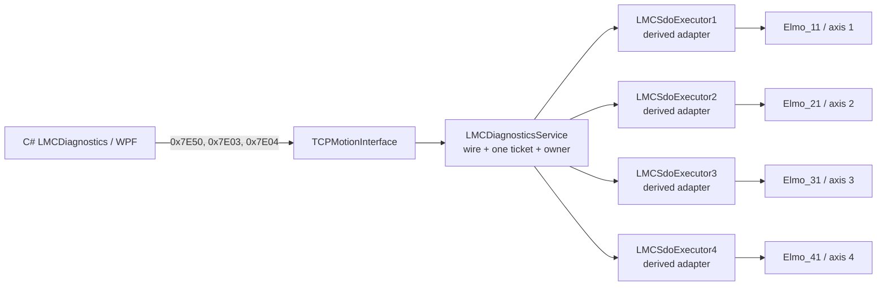
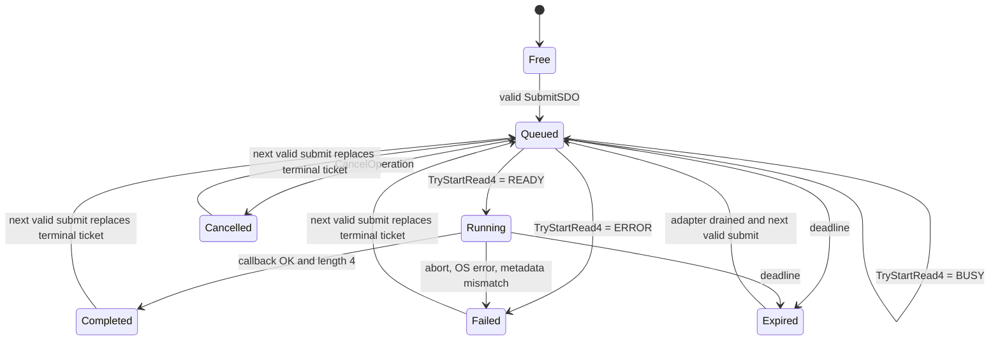

# LMC D5 EtherCAT SDO 파생 Executor 구조 설계

- 기준일: 2026-07-22
- 대상: `Lasal_PRG/Elmo_EtherCAT_Test_4Axis`, C# `LMCDiagnostics` D5 계약
- 구현 증분: 물리 축 1-4, `0x1000:0`, UInt32, 4-byte SDO Read-only
- 현재 capability baseline: `CapabilityBits=0x0000003F`, `MaxSdoDataBytes=0`
- 현재 구현 상태: source/network와 IDE Rebuild/Link 완료, capability gate off,
  PLC download/runtime 미검증

## 1. 결론

`EtherCAT_SDOBase`를 그대로 운영 API로 사용하지 않는다. 다음 혼합 구조를 사용한다.

1. `LMCSdoExecutor : EtherCAT_SDOBase` 파생 class를 만든다.
2. 축별로 `LMCSdoExecutor1..4` 네 object를 두고 각 object의 inherited `toSlave`를
   `Elmo_11..41.ClassState`에 1:1로 연결한다.
3. 파생 class는 EtherCAT mailbox transport adapter 역할만 한다.
4. `LMCDiagnosticsService`가 D5 wire, 전역 한 개 ticket, BootId, MapRevision,
   TCP session owner, retry, timeout, cancel과 결과 보존을 전담한다.
5. `TCPMotionInterface.CyWork`는 `LMCDiagnosticsService.ProcessOperations`를 호출해
   queued/running operation을 진행한다.

이 구조는 사용자가 요청한 LASAL Derive Class를 사용한다. 다만 base의
`ParaReadWrite::Write`와 `ParaValue`를 그대로 쓰는 방식은 채택하지 않는다. 파생
class 안에서 inherited `toSlave.StartReadSDO`를 전용 private buffer와 함께 직접 호출하고,
callback을 override해 실제 길이와 abort code를 보존한다.



## 2. 확인된 현재 계약

2026-07-22 현재 canonical tracked project에 `EtherCAT_SDOBase` 기반 topology와
`LMCSdoExecutor`, service one-ticket 실행부 및 4축 network 연결이 반영돼 있다. 같은 날
10:53 LASAL IDE Rebuild/Link가 compile/link error 0으로 끝났고 generated network table도
full-network 정적 계약과 일치한다. 이 결과는 PLC download 또는 실제 drive mailbox 응답을
검증한 것은 아니다.

### 2.1 `EtherCAT_SDOBase`

현재 사용자가 추가한 `EtherCAT_SDOBase.st`에서 다음을 확인했다.

- `ParaReadWrite`, `ParaIndex`, `ParaSubIndex`, `ParaLength`, `ParaValue`, `Timeout` 등
  수동 조작용 server를 공개한다.
- numeric read는 4-byte `ParaValue`를 buffer로 사용한다.
- numeric write는 4-byte `ParaValue` pointer에 검증되지 않은 `ParaLength`를 전달한다.
  따라서 `ParaLength > 4`인 write를 운영 경로로 사용하면 안 된다.
- `StartReadSDO`의 반환값이 `READY`가 아니면 `BUSY`와 `ERROR`를 구분하지 않고
  `ClassState=ERROR`로 합친다. bounded retry에 필요한 정보가 사라진다.
- `ECAT_M_SDO_CALLBACK`은 다음 정보를 제공한다.

| callback field | 의미 |
|---|---|
| `aPara[0]` | callback version, 현재 1 |
| `aPara[1]` | EtherCAT OS return code |
| `aPara[2]` | read=0, write=1 |
| `aPara[3]` | object index |
| `aPara[4]` | sub-index |
| `aPara[5]` | 실제 전송 길이 |
| `aPara[6]` | SDO abort code |

### 2.2 lower-level `ECAT_Slave_Base`

`ECAT_Slave_Base::StartReadSDO`는 아래 계약을 이미 제공한다.

- slave가 PREOP 이상이고 pointer가 유효하면 요청 접수를 시도한다.
- `READY`: mailbox 요청을 접수했다. operation 완료를 뜻하지 않는다.
- `BUSY`: 해당 slave SDO channel을 사용 중이다. 이후 재시도할 수 있다.
- `ERROR`: offline/invalid input 등으로 시작할 수 없다.
- 완료 callback에서 실제 길이와 SDO abort code를 전달한다.
- 실행 중 SDO를 안전하게 강제 취소하는 공개 API는 없다.

현재 EtherCAT network의 `NoSDOBuffer=0`을 first slice에서 유지한다. vendor queue에
caller buffer pointer를 쌓지 않고 `BUSY`를 service가 명시적으로 처리하기 위해서다.

### 2.3 현재 D5 PC/wire 계약

C# SDK에는 이미 다음 public contract가 있다.

- `SubmitSdo`
- `GetOperationStatus`
- `CancelOperation`
- ticket/state/outcome model
- 4/8/12-byte inline result parser

PLC에는 capability gate 뒤의 one-ticket 실행부, derived executor callback mailbox,
status/cancel과 orphan/drain 처리가 구현돼 있다. 다만
`LMC_DIAG_D5_SDO_READ_ENABLED=FALSE`라 `0x7E03/0x7E04/0x7E50`은 현재 정상 capability와
동일하게 `UnsupportedFeature`로 닫혀 있다. Wire offset과 enum은 기존 계약을 변경하지
않으며 첫 slice는 기존 4-byte inline 경로의 부분집합이다.

## 3. 대안 비교와 선택 이유

| 구조 | 장점 | 문제 | 판정 |
|---|---|---|---|
| plain `EtherCAT_SDOBase` object를 service가 원격 채널로 조작 | 새 class가 적음 | BUSY/ERROR 손실, 공유 `Para*` race, ticket/callback identity 없음, write buffer 위험 | 사용 금지 |
| standalone `LMCSdoTransport`가 `ECAT_Slave_Base` client 4개를 직접 소유 | inherited 수동 채널이 없어 가장 깨끗함 | 사용자가 추가한 base와 1:1 slave wiring을 재사용하지 않음 | fallback |
| `LMCSdoExecutor : EtherCAT_SDOBase` + `LMCDiagnosticsService` composition | Derive 요구 충족, 1:1 slave wiring, actual-length callback 재사용 | unsafe base 실행 경로를 반드시 override/격리해야 함 | 채택 |
| ticket/session까지 축별 derived object에 구현 | 축별 독립성 | ticket state가 4곳에 중복되고 global one-ticket 정책과 TCP owner가 분산됨 | 사용 금지 |

채택안의 상속 이점은 inherited `toSlave`와 vendor callback ABI 재사용이다. 상속된
수동 UI를 재사용하는 것이 아니다. 현재 manual-channel override와 base command
forwarding은 generated VMT, 정적 계약과 IDE compile에서 확인됐다. 향후 vendor class
변경으로 이 계약을 유지할 수 없으면 standalone transport로 전환하되 wire와 service
state machine은 그대로 유지한다.

## 4. `LMCSdoExecutor` 책임과 interface

### 4.1 역할

한 object는 한 physical slave의 SDO transport만 담당한다.

- 최대 한 개 active request
- fixed 4-byte read buffer
- `READY/BUSY/ERROR` 시작 결과 보존
- callback metadata 검증
- cross-task safe single-slot result publication
- 늦은 callback 폐기와 drain 상태 관리

다음은 executor의 책임이 아니다.

- TicketId 발급
- BootId/MapRevision 검증
- TCP session ownership
- `0x7Exx` request/response serialization
- global one-ticket 선택
- capability 광고

### 4.2 구현된 LASAL public method

declaration은 LASAL IDE에서 생성했으며 현재 signature는 다음과 같다. 새 identifier,
comment와 string은 모두 7-bit ASCII로 유지한다.

```text
TryStartRead4(
  OperationToken : UDINT,
  ObjectIndex    : HINT,
  SubIndex       : HSINT,
  TimeoutMs      : UDINT
) : iprStates

CopyCompletion(
  ExpectedToken  : UDINT,
  pDest          : ^LMCSdoExecutorResult,
  DestSize       : UDINT
) : DINT

MarkOrphan(
  ExpectedToken  : UDINT
) : DINT

IsReusable() : BOOL
```

`TryStartRead4`는 다음 순서로 동작한다.

1. token이 0이 아닌지와 adapter가 `Idle`인지 확인한다.
2. private buffer와 이전 publication을 0으로 초기화한다.
3. expected read/index/sub-index/length=4/token을 먼저 고정한다.
4. inherited `toSlave.StartReadSDO`를 `CompleteAccess=0`, private buffer,
   `pCallback=THIS`로 호출한다.
5. `READY`일 때만 `Running`과 active token을 확정한다.
6. `BUSY`와 `ERROR`는 그대로 caller에 반환하고 active로 전환하지 않는다.

### 4.3 반드시 override할 method

#### `ParaReadWrite::Write`

base method를 호출하지 않는다. 파생 object에서는 수동 channel write가 SDO를 시작하지
못하게 fail-closed 처리한다. D5 실행은 오직 `TryStartRead4`로 들어온다.

`ParaType::Write`와 `ParaString::Write`도 base의 수동 surface를 완전히 격리하도록
no-op override했다. 다른 inherited `Para*` 값이 바뀌더라도 executor는 그 값을 입력이나
결과 buffer로 사용하지 않는다.

#### `ClassState::NewInst`

`ECAT_M_SDO_CALLBACK`을 파생 class가 완전히 처리한다. 아래 중 하나라도 맞지 않으면
성공으로 publish하지 않고 adapter를 `Quarantined`로 둔다.

- callback version=1
- active adapter state=`Running` 또는 `Orphaned`
- read/write flag=read
- index/sub-index가 active request와 일치
- active token이 non-zero
- 성공 callback이면 actual length=4

다른 command는 실제 LASAL base-call 문법인
`EtherCAT_SDOBase::NewInst(pPara, pResult)`로 전달한다. SDO callback은 base에 다시
전달하지 않는다.

### 4.4 private state

개념적인 fixed state는 다음과 같다.

```text
AdapterState       Idle / Arming / Running / ResultReady / Orphaned / Quarantined
ActiveToken        UDINT
ActiveIndex        UINT
ActiveSubIndex     USINT
ActiveLength       UINT (=4)
ReadBuffer         BYTE[4]
PublishSequence    UDINT
PublishedResult    LMCSdoExecutorResult (fixed 32 bytes)
```

동적 메모리를 사용하지 않는다. inherited `ParaValue`와 `ParaString`은 production
buffer로 사용하지 않는다.

## 5. callback mailbox와 task 경계

EtherCAT callback writer와 TCP diagnostics reader가 같은 task/order에서 실행된다고
가정하지 않는다. 단순 `BOOL ResultReady`만으로 publish하지 않는다.

구현 publication은 single-writer/single-reader seqlock이다.

1. callback이 `PublishSequence`를 odd로 전환한다.
2. OS result, abort, actual length, token과 4-byte data를 기록한다.
3. `PublishSequence`를 even으로 전환해 마지막에 publish한다.
4. service는 첫 sequence가 even인지 확인하고 result를 복사한다.
5. 복사 후 sequence를 다시 읽어 같은 even 값일 때만 결과를 소비한다.
6. token이 현재 ticket의 operation token과 다르면 결과를 폐기하고 quarantine한다.

callback에서는 TCP 호출, 동적 allocation, logging loop나 긴 처리를 하지 않는다.
필요한 raw debug 값은 fixed fields에 남기고 non-RT service가 읽는다.

timeout이나 disconnect 후 late callback이 올 수 있으므로 private buffer는 callback 또는
명시적인 slave reconnect/reset 전까지 재사용하지 않는다. late callback이 끝나지 않은
adapter는 새 ticket을 받지 않는다.

## 6. `LMCDiagnosticsService` one-ticket model

### 6.1 추가 client

```text
SdoAxis1 : CltChCmd_LMCSdoExecutor
SdoAxis2 : CltChCmd_LMCSdoExecutor
SdoAxis3 : CltChCmd_LMCSdoExecutor
SdoAxis4 : CltChCmd_LMCSdoExecutor
```

`SlaveReference=1..4`를 위 client에 고정 매핑한다. object name lookup이나 raw pointer를
wire로 노출하지 않는다.

### 6.2 ticket state

service는 다음 fixed state 한 벌만 가진다.

```text
NextTicketId
TicketId
OwnerSessionEpoch
TicketBootId
TicketMapRevision
OperationToken
OperationKind
OperationState
OperationOutcome
SlaveReference
ObjectIndex
SubIndex
ValueType
RequestedLength
TimeoutCycles
SubmitCycle
CompletionCycle
OperationErrorId
OperationDetail
ResultLength
ResultData[4]
InternalDrainState
```

`OperationToken`은 executor callback 식별용 local generation이다. wire TicketId와 같게
사용해도 되지만 별도 non-zero counter로 두는 편이 late callback과 ticket lifecycle을
분리하기 쉽다.

TicketId는 0을 발급하지 않는다. 같은 BootId에서 wrap된 ID를 재사용하지 않고 exhaustion
시 fail-closed한다.

### 6.3 공개 상태 머신



내부적으로 `OrphanWaiting`과 `DrainWaiting`을 둔다. 이 두 상태는 wire enum에 추가하지
않는다.

- `Queued`의 `BUSY`는 오류가 아니다. deadline까지 RT cycle당 최대 한 번 재시도한다.
- `Running`에 대한 Cancel은 `InvalidState(19)`다. 현재 안전한 physical cancel API가 없다.
- terminal status는 같은 owner가 조회할 수 있도록 다음 성공한 Submit 전까지 보존한다.
- 다음 Submit이 terminal slot을 교체하면 이전 TicketId는 `TicketNotFound(23)`이다.
- expired operation의 callback이 아직 오지 않았다면 새 Submit을 `ResourceBusy(9)`로
  거부한다.

### 6.4 scheduling과 timeout

`TCPMotionInterface.CyWork`의 loop 횟수를 EtherCAT cycle로 간주하지 않는다.
`ProcessOperations`는 active ticket이 있을 때 `LMCEcatInputLatch.CopySnapshot`의 published
RT cycle을 사용한다.

- SubmitCycle과 CompletionCycle은 latch cycle counter를 사용한다.
- start retry는 새 latch cycle을 처음 관측했을 때 최대 한 번 수행한다.
- wrap-safe `Elapsed = CurrentCycle - SubmitCycle` unsigned 계산을 사용한다.
- BUSY 대기 시간도 `TimeoutCycles`에 포함한다.
- first slice의 허용 timeout은 `1..60000` cycles로 제한한다.
- 현재 `BaseCycleTimeUs=1000`이므로 start 시 남은 cycle과 SDO timeout ms가 같다.
- 일반식은 `ceil(RemainingCycles * BaseCycleTimeUs / 1000)`이며 overflow를 검사한다.

wire deadline이 먼저 끝나면 `Expired/TimedOut`으로 확정한다. 이미 Running이면 adapter를
drain 상태로 유지하고 late callback 결과를 버린다. callback이 오지 않으면 adapter를
억지로 재사용하지 않고 `ResourceBusy`를 유지한다.

정확히 `Elapsed=TimeoutCycles`인 cycle에서 이미 publish된 completion은 timeout보다 먼저
소비한다. `Elapsed>TimeoutCycles`에 소비된 결과는 adapter 정리를 위해 읽되 public
결과로 노출하지 않고 `Expired/TimedOut`으로 확정한다.

## 7. first-slice policy

PLC가 최종 권한을 가진 compile-time allowlist를 적용한다. C# SDK도 같은 first-slice
allowlist를 mirror해 잘못된 요청을 송신 전에 차단한다.

| field | 허용값 |
|---|---|
| SlaveReference | 1, 2, 3, 4 |
| OperationFlags | 0, Read |
| ObjectIndex | `0x1000` |
| SubIndex | 0 |
| ValueType | UInt32=5 |
| DataLength | 4 |
| CompleteAccess | wire에 없으며 내부에서 0 고정 |
| TimeoutCycles | 1..60000 |

다음은 계속 차단한다.

- SDO Write
- PI Write
- 8/12-byte SDO Read
- 4 bytes 초과 result와 `0x7E51`
- complete access
- 둘 이상의 global active ticket
- control word, target position/velocity/torque 등 motion-affecting object

## 8. wire 처리

### 8.1 `SubmitSDO (0x7E50)`

request는 정확히 32 bytes다.

| offset | type | field | first-slice validation |
|---:|---|---|---|
| P0..7 | - | common request | schema/flags/request id 검사 |
| P8 | U32 | ExpectedMapRevision | `0x957F101E` exact |
| P12 | U16 | SlaveReference | 1..4 |
| P14 | U16 | OperationFlags | 0 only |
| P16 | U16 | ObjectIndex | `0x1000` |
| P18 | U8 | SubIndex | 0 |
| P19 | U8 | ValueType | UInt32=5 |
| P20 | U32 | TimeoutCycles | 1..60000 |
| P24 | U16 | DataLength | 4 |
| P26 | U16 | Reserved | 0 |
| P28 | U32 | DiagnosticsBootId | current non-zero BootId exact |

성공 response는 기존 C# parser가 요구하는 32-byte ticket response다. 실제 mailbox를
같은 RPC에서 시작하거나 기다리지 않는다.

```text
P0..15  common success response
P16     TicketId, non-zero
P20     OperationKind=SDORead(2)
P22     OperationState=Queued(1)
P24     SubmitCycle
P28     DiagnosticsBootId
```

### 8.2 `GetOperationStatus (0x7E03)`

request는 정확히 16 bytes다.

```text
P8   TicketId
P12  DiagnosticsBootId
```

response는 기존 64-byte layout을 유지한다.

| wire state | State/Outcome | ErrorId | Detail | result |
|---|---|---:|---|---|
| Queued | 1/0 | 0 | 0 | none |
| Running | 2/0 | 0 | 0 | none |
| Completed | 3/1 | 0 | 0 | UInt32 4 bytes inline |
| Failed, SDO abort | 4/2 | -32000 | actual abort code | none |
| Failed, local/OS error | 4/2 | -32001 | local detail or raw OS result | none |
| Cancelled | 5/3 | 0 | 0 | none |
| Expired | 6/4 | 0 | `0x05040000` | none |

Completed일 때만 아래 결과를 채운다.

```text
P40 ResultLength       = 4
P44 ResultValueType    = UInt32(5)
P45 ResultDataLength   = 4
P46 Reserved           = 0
P48..51 ResultData
P52..59 zero
P60 DiagnosticsBootId
```

그 외 상태는 result length/type/data와 unused tail을 전부 0으로 반환한다.

### 8.3 `CancelOperation (0x7E04)`

request는 정확히 16 bytes다. 같은 owner의 `Queued` ticket만 취소한다.

```text
P0..15 common success response
P16    TicketId
P20    OperationState=Cancelled(5)
P22    OperationOutcome=Cancelled(3)
P24    DiagnosticsBootId
```

Running 또는 terminal ticket cancel은 common error `InvalidState(19)`로 반환한다.

### 8.4 validation/error mapping

ticket 생성 전 오류는 common domain error다.

| condition | DetailCode |
|---|---:|
| request size/reserved/flags/slave/timeout 범위 오류 | BoundsInvalid=12 |
| MapRevision mismatch | MapRevisionMismatch=3 |
| BootId mismatch | BootIdMismatch=25 |
| Write request | UnsupportedFeature=2 |
| 8/12-byte 또는 더 큰 read | CapacityExceeded=20 |
| allowlist 밖 object/sub-index | ReadDenied=6 |
| value type mismatch | TypeMismatch=5 |
| active/draining slot 존재 | ResourceBusy=9 |
| executor client/network 미연결 | NotReady=11 |
| ticket 없음 | TicketNotFound=23 |
| 다른 session owner | HandleOrGenerationStale=10 |

ticket 접수 후 발생한 start error, abort, timeout과 result contract 오류는 RPC 자체 성공과
분리해 operation terminal status로 보고한다.

executor 내부 validation code는 wire DetailCode로 그대로 노출하지 않는다. actual-length
불일치만 `TypeMismatch(5)`로 매핑하고 version/state/direction/index/sub-index/token
불일치는 `InternalError(24)`로 매핑한다. `ECAT_Slave_Base`가 start 실패 때 raw OS result와
합성 general abort `0x08000000`을 함께 주는 경우에는 raw OS result를 우선 보존한다. 그
외 실제 SDO abort는 `ErrorId=-32000`과 actual abort code로 보존한다.

## 9. disconnect와 orphan 처리

`TCPMotionInterface`가 전달하는 `NotifySessionClosed(SessionEpoch)`에서 다음을 수행한다.

- owner의 `Queued`: 내부 취소 후 즉시 slot 회수
- owner의 `Running`: executor에 `MarkOrphan`, wire ticket을 외부에 노출하지 않고
  `OrphanWaiting`으로 전환
- owner의 terminal ticket: drain이 없으면 즉시 slot 회수; late callback drain 중이면
  public ticket만 숨기고 operation token과 drain state는 callback까지 유지
- 다른 owner의 ticket: 변경하지 않음

Orphan callback은 token, read flag, index, sub-index를 확인한 뒤 결과를 폐기하고 adapter와
slot을 회수한다. 그 전까지 새 session의 Submit은 `ResourceBusy`다. session close가
buffer lifetime을 끝내지 않는다.

## 10. network 구조

현재 production network에는 plain `EtherCAT_SDOBase1..4`가 남아 있지 않다.
`LMCSdoExecutor1..4` 네 object가 `Visualized=false`이고 remote surface 없이 배치돼
있으며, 아래 두 단계 연결이 generated table까지 생성됐다.

```text
EtherCAT_Network
  LMCSdoExecutor1.toSlave -> Elmo_11.ClassState
  LMCSdoExecutor2.toSlave -> Elmo_21.ClassState
  LMCSdoExecutor3.toSlave -> Elmo_31.ClassState
  LMCSdoExecutor4.toSlave -> Elmo_41.ClassState

Comm_Network
  LMCDiagnosticsService1.SdoAxis1 -> LMCSdoExecutor1.ClassState
  LMCDiagnosticsService1.SdoAxis2 -> LMCSdoExecutor2.ClassState
  LMCDiagnosticsService1.SdoAxis3 -> LMCSdoExecutor3.ClassState
  LMCDiagnosticsService1.SdoAxis4 -> LMCSdoExecutor4.ClassState
```

네 executor object는 계속 `Visualized=false`, `Remotely=false`로 유지한다. 수동 smoke가
필요하면 debug 전용 구성에서만 plain `EtherCAT_SDOBase`를 사용한다. 같은 drive에 manual
base와 production executor를 동시에 활성화하지 않는다.

class 생성, base class 지정, channel declaration과 network connection은 LASAL IDE에서
수행한다. 생성된 `.st`의 user implementation 영역만 외부 편집기로 수정한다. IDE가 열린
상태에서 외부 수정했다면 implementation editor를 저장하기 전에 `Reload Class`로 디스크
source를 다시 읽는다. stale IDE model을 저장하면 외부 수정 implementation을 덮어쓸 수
있으므로, 안전한 순서는 `IDE 저장/종료` -> `외부 편집` -> `IDE 재열기 또는 Reload
Class` -> `Rebuild` -> `Find in Implementation smoke`다.

## 11. capability gate

구현 중과 정적 시험 중에는 다음을 유지한다.

```text
CapabilityBits  = 0x0000003F
MaxSdoDataBytes = 0
```

`LMC_DIAG_D5_SDO_READ_ENABLED` compile-time gate를 사용한다. 1-5를 만족한 뒤 test
build에서만 gate를 열어 6-7을 검증하고, 6-7까지 만족해야 production capability를
승인한다.

1. executor 4개 client가 모두 연결됨
2. non-zero retained DiagnosticsBootId 정상
3. C# golden/parser test 통과
4. LASAL static contract 통과
5. LASAL IDE Rebuild/Link와 implementation smoke 통과
6. PLC의 success/busy/error/abort/timeout/cancel/disconnect 시험 통과
7. packet capture와 trace 증거 보존

승인 후 광고값은 다음뿐이다.

```text
CapabilityBits  = 0x0000013F
MaxSdoDataBytes = 4
```

bit 7 `PIWrite`, bit 9 `SDOWrite`, bit 12 `ExtendedSdoResultChunk`는 계속 0이다.

## 12. 구현 순서

### Phase 0. source 회귀 복구 완료

사용자가 LASAL IDE에서 새 class/network를 저장하는 동안 tracked implementation의
일부가 이전 상태로 덮였다. 다음을 사용자 변경과 병합해 복구했다.

- `LMCDiagnosticsService`: `0x7E03`, `0x7E04`, `0x7E50` gated handler와 실행부
- `LMCRecorderStore`: terminal `StopRecorder` idempotent 처리

2026-07-22 `Verify-LasalContract.ps1` source-only/full-network, PC 자동 시험 103/103과
WPF Debug/Release build를 통과했다. 최신 source/network는 10:53 LASAL IDE
Rebuild/Link도 error 0으로 통과했다. 별도의 최신 `Find in Implementation` smoke와 PLC
runtime 시험은 아직 수행하지 않았다.

### Phase 1. LASAL class/network skeleton 완료

- LASAL IDE에서 `LMCSdoExecutor`를 `EtherCAT_SDOBase` derived class로 생성
- public method/variables/override declaration 추가
- plain base object 4개를 derived object 4개로 교체
- inherited `toSlave`와 service `SdoAxis1..4` 연결
- IDE Rebuild/Link 완료; 최신 class implementation smoke는 별도 잔여 gate

### Phase 2. adapter transport source 완료

- fixed 4-byte buffer
- `TryStartRead4`의 `READY/BUSY/ERROR` 보존
- manual trigger override
- callback metadata 검증
- atomic/seqlock result publication
- orphan/drain/quarantine 처리

source와 정적 계약 및 IDE compile까지 완료했지만 capability는 계속 off다.

### Phase 3. one-ticket executor와 wire source 완료

- service fixed ticket state
- `ProcessOperations`
- exact `0x7E50`, `0x7E03`, `0x7E04` success/error serializer
- MapRevision/BootId/session/allowlist validation
- terminal replacement와 TicketId exhaustion 처리
- `NotifySessionClosed` orphan lifecycle

### Phase 4. PC/static regression 완료

- SDK의 first-slice read allowlist mirror
- fake RPC의 queued/running/completed/failed/cancelled/expired/stale test
- DINT map과 LASAL contract script 갱신
- WPF Debug/Release build 완료; 실제 UI ticket flow smoke는 PLC runtime 단계에서 수행

### Phase 5. PLC runtime와 capability 승인 미완료

- static/IDE gate 뒤 test build에서 bit 8을 임시 활성화해 아래 시험 매트릭스 실행
- packet/trace/log 보존
- 모든 runtime gate 후 production bit 8과 MaxSdo=4 승인

## 13. 검증 매트릭스

| test | expected result |
|---|---|
| axis 1-4 `0x1000:0` | 각 축 UInt32 4-byte Completed |
| Submit 직후 status | Queued 또는 Running |
| drive SDO channel BUSY | bounded retry 후 Running 또는 Expired |
| immediate start ERROR/offline | Failed, local error detail |
| 실제 SDO abort | Failed, 실제 abort code 보존 |
| actual length != 4 | Failed, TypeMismatch |
| callback metadata mismatch | Failed/InternalError 후 adapter quarantine |
| queued cancel | Cancelled response와 Cancelled status |
| running cancel | common error InvalidState=19 |
| timeout before start | Expired/TimedOut, adapter reusable |
| timeout after start | Expired/TimedOut, late callback 전까지 drain |
| queued 중 disconnect | owner slot 즉시 회수 |
| running 중 disconnect | 결과 폐기, callback 전 새 Submit ResourceBusy |
| late orphan callback | 결과 미노출, adapter/slot 회수 |
| 다른 session의 status/cancel | HandleOrGenerationStale |
| stale BootId | BootIdMismatch |
| unknown TicketId | TicketNotFound |
| 8/12-byte raw request | CapacityExceeded |
| Write raw request | UnsupportedFeature |
| allowlist 밖 object | ReadDenied |
| type mismatch | TypeMismatch |
| TicketId 0/wrap | 0 미발급, wrap 재사용 없이 fail-closed |
| capability before approval | `0x3F`, MaxSdo=0 |
| capability after all gates | `0x13F`, MaxSdo=4 |

PLC runtime 시험 전까지 이 설계, PC/WPF build, LASAL 정적 계약과 10:53 IDE
Rebuild/Link 결과를 실제 EtherCAT SDO 동작 완료 증거로 사용하지 않는다. 현재 광고값은
계속 `0x3F`, `MaxSdoDataBytes=0`이다.

## 14. 구현 및 변경 파일

LASAL IDE와 구현:

- `Lasal_PRG/Elmo_EtherCAT_Test_4Axis/Class/LMCSdoExecutor/LMCSdoExecutor.st`
- `Lasal_PRG/Elmo_EtherCAT_Test_4Axis/Class/LMCDiagnosticsService/LMCDiagnosticsService.st`
- `Lasal_PRG/Elmo_EtherCAT_Test_4Axis/Class/TCPMotionInterface/TCPMotionInterface.st`
- LASAL class registration/include 파일
- `Network/EtherCAT_Network/EtherCAT_Network.lcn`
- `Network/Comm_Network/Comm_Network.lcn`

PC와 계약:

- `LMC_Library/LMC_API_Delivery/src/LmcDiagnosticsD5*.cs`
- `LMC_Library/LMC_API_Delivery/tests/LasalMotionControlLib.Tests/**`
- `LMC_Library/LMC_API_Delivery/docs/DINT_PACKET_MAP.txt`
- `LMC_Library/LMC_API_Delivery/tests/LasalMotionControlLib.Tests/Verify-LasalContract.ps1`
- 관련 architecture/release status 문서

wire layout 자체를 바꾸지 않으므로 C# serializer/parser 재설계는 필요 없다. C# 변경의
핵심은 first-slice policy mirror와 terminal/error regression test 보강이다.
