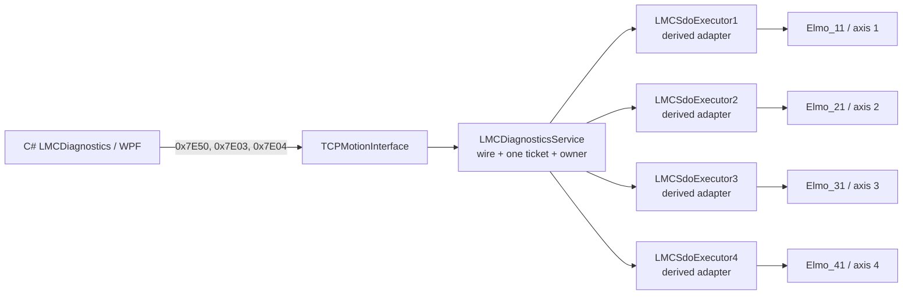
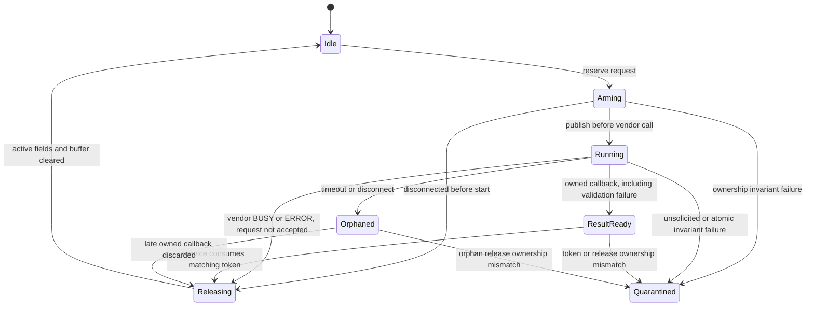
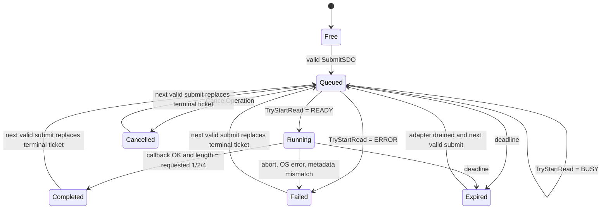

# LMC D5 EtherCAT SDO 파생 Executor 구조 설계

- 기준일: 2026-07-22
- 대상: `Lasal_PRG/Elmo_EtherCAT_Test_4Axis`, C# `LMCDiagnostics` D5 계약
- 구현 증분: 물리 축 1-4, nonzero Index, Sub-index 0-255, typed 1/2/4-byte
  general-inline SDO Read-only
- 현재 test-profile source: `CapabilityBits=0x0000213F`, `MaxSdoDataBytes=4`
- 현재 구현 상태: first runtime의 same-cycle timeout 결함을 수정한 뒤 Slave 1~4
  `0x1000:0` legacy vector는 43~54 cycles 뒤 모두 Completed/Success를 반환했다.
  과거 BootId 6 general-inline capture의 `ResourceBusy(9)` 결함도 callback ordering과
  executor 회수 source에서 수정했다. 이후 사용자가 general-inline 1/2/4-byte PLC
  runtime 정상 동작을 확인했다. 최종 확인 신규 pcap/log와 fault matrix는 없다.
  `LMCSdoExecutor` private state의 명시적 constructor
  초기화는 LASAL IDE declaration 작업이 필요한 별도 P1 release gate다.

## 1. 결론

`EtherCAT_SDOBase`를 그대로 운영 API로 사용하지 않는다. 다음 혼합 구조를 사용한다.

1. `LMCSdoExecutor : EtherCAT_SDOBase` 파생 class를 만든다.
2. 축별로 `LMCSdoExecutor1..4` 네 object를 두고 각 object의 inherited `toSlave`를
   `Elmo_11..41.ClassState`에 1:1로 연결한다.
3. 파생 class는 EtherCAT mailbox transport adapter 역할만 한다.
4. `LMCDiagnosticsService`가 D5 wire, 전역 한 개 ticket, BootId, MapRevision,
   TCP session owner, retry, timeout, cancel과 결과 보존을 전담한다.
5. `TCPMotionInterface.CyWork`는 `LMCDiagnosticsService.ProcessOperations`를 호출해
   queued/running operation을 진행한다.

이 구조는 사용자가 요청한 LASAL Derive Class를 사용한다. 다만 base의
`ParaReadWrite::Write`와 `ParaValue`를 그대로 쓰는 방식은 채택하지 않는다. 파생
class 안에서 inherited `toSlave.StartReadSDO`를 전용 private buffer와 함께 직접 호출하고,
callback을 override해 실제 길이와 abort code를 보존한다.



## 2. 확인된 현재 계약

2026-07-22 현재 canonical tracked project에 `EtherCAT_SDOBase` 기반 topology와
`LMCSdoExecutor`, service one-ticket 실행부 및 4축 network 연결이 반영돼 있다. LASAL
IDE에서 갱신한 `Classes.lcb`도 `TryStartRead` declaration과 일치해 SourceOnly와 full
static 계약이 모두 PASS한다. 10:53 LASAL IDE Rebuild/Link error 0 기록은 이전 gate-off
baseline이며, 최신 callback-ordering/release 수정 source의 IDE Rebuild/Link와 PLC
runtime 성공을 뜻하지 않는다.

### 2.1 `EtherCAT_SDOBase`

현재 사용자가 추가한 `EtherCAT_SDOBase.st`에서 다음을 확인했다.

- `ParaReadWrite`, `ParaIndex`, `ParaSubIndex`, `ParaLength`, `ParaValue`, `Timeout` 등
  수동 조작용 server를 공개한다.
- numeric read는 4-byte `ParaValue`를 buffer로 사용한다.
- numeric write는 4-byte `ParaValue` pointer에 검증되지 않은 `ParaLength`를 전달한다.
  따라서 `ParaLength > 4`인 write를 운영 경로로 사용하면 안 된다.
- `StartReadSDO`의 반환값이 `READY`가 아니면 `BUSY`와 `ERROR`를 구분하지 않고
  `ClassState=ERROR`로 합친다. bounded retry에 필요한 정보가 사라진다.
- `ECAT_M_SDO_CALLBACK`은 다음 정보를 제공한다.

| callback field | 의미 |
|---|---|
| `aPara[0]` | callback version, 현재 1 |
| `aPara[1]` | EtherCAT OS return code |
| `aPara[2]` | read=0, write=1 |
| `aPara[3]` | object index |
| `aPara[4]` | sub-index |
| `aPara[5]` | 실제 전송 길이 |
| `aPara[6]` | SDO abort code |

### 2.2 lower-level `ECAT_Slave_Base`

`ECAT_Slave_Base::StartReadSDO`는 아래 계약을 이미 제공한다.

- slave가 PREOP 이상이고 pointer가 유효하면 요청 접수를 시도한다.
- `READY`: mailbox 요청을 접수했다. operation 완료를 뜻하지 않는다.
- `BUSY`: 해당 slave SDO channel을 사용 중이다. 이후 재시도할 수 있다.
- `ERROR`: offline/invalid input 등으로 시작할 수 없다.
- 완료 callback에서 실제 길이와 SDO abort code를 전달한다.
- 실행 중 SDO를 안전하게 강제 취소하는 공개 API는 없다.

현재 EtherCAT network의 `NoSDOBuffer=0`을 general-inline profile에서도 유지한다. vendor queue에
caller buffer pointer를 쌓지 않고 `BUSY`를 service가 명시적으로 처리하기 위해서다.

### 2.3 현재 D5 PC/wire 계약

C# SDK에는 이미 다음 public contract가 있다.

- `SubmitSdo`
- `GetOperationStatus`
- `CancelOperation`
- ticket/state/outcome model
- 1/2/4/8/12-byte inline result parser

PLC에는 one-ticket 실행부, derived executor callback mailbox, status/cancel과
orphan/drain 처리가 구현돼 있다. test source는
`LMC_DIAG_D5_SDO_READ_ENABLED=TRUE`로 `0x7E03/0x7E04/0x7E50`, bit 8
`SDORead`와 bit 13 `SDOReadGeneralInline`을 활성화했다. Wire offset은 변경하지
않으며 기존 `0x1000:0` UInt32/4-byte request도 같은 general-inline 경로의 부분집합이다.
이 활성화는 runtime 시험용이며 production 승인 증거가 아니다.

## 3. 대안 비교와 선택 이유

| 구조 | 장점 | 문제 | 판정 |
|---|---|---|---|
| plain `EtherCAT_SDOBase` object를 service가 원격 채널로 조작 | 새 class가 적음 | BUSY/ERROR 손실, 공유 `Para*` race, ticket/callback identity 없음, write buffer 위험 | 사용 금지 |
| standalone `LMCSdoTransport`가 `ECAT_Slave_Base` client 4개를 직접 소유 | inherited 수동 채널이 없어 가장 깨끗함 | 사용자가 추가한 base와 1:1 slave wiring을 재사용하지 않음 | fallback |
| `LMCSdoExecutor : EtherCAT_SDOBase` + `LMCDiagnosticsService` composition | Derive 요구 충족, 1:1 slave wiring, actual-length callback 재사용 | unsafe base 실행 경로를 반드시 override/격리해야 함 | 채택 |
| ticket/session까지 축별 derived object에 구현 | 축별 독립성 | ticket state가 4곳에 중복되고 global one-ticket 정책과 TCP owner가 분산됨 | 사용 금지 |

채택안의 상속 이점은 inherited `toSlave`와 vendor callback ABI 재사용이다. 상속된
수동 UI를 재사용하는 것이 아니다. 현재 manual-channel override와 base command
forwarding은 generated VMT, 정적 계약과 IDE compile에서 확인됐다. 향후 vendor class
변경으로 이 계약을 유지할 수 없으면 standalone transport로 전환하되 wire와 service
state machine은 그대로 유지한다.

## 4. `LMCSdoExecutor` 책임과 interface

### 4.1 역할

한 object는 한 physical slave의 SDO transport만 담당한다.

- 최대 한 개 active request
- fixed 4-byte-capacity read buffer와 request별 1/2/4-byte active length
- `READY/BUSY/ERROR` 시작 결과 보존
- callback metadata 검증
- cross-task safe single-slot result publication
- 늦은 callback 폐기와 drain 상태 관리

다음은 executor의 책임이 아니다.

- TicketId 발급
- BootId/MapRevision 검증
- TCP session ownership
- `0x7Exx` request/response serialization
- global one-ticket 선택
- capability 광고

### 4.2 구현된 LASAL public method

declaration은 LASAL IDE에서 생성했으며 현재 signature는 다음과 같다. 새 identifier,
comment와 string은 모두 7-bit ASCII로 유지한다.

```text
TryStartRead(
  OperationToken : UDINT,
  ObjectIndex    : UINT,
  SubIndex       : USINT,
  ReadLength     : UINT,
  TimeoutMs      : UDINT
) : iprStates

CopyCompletion(
  ExpectedToken  : UDINT,
  pDest          : ^LMCSdoExecutorResult,
  DestSize       : UDINT
) : DINT

MarkOrphan(
  ExpectedToken  : UDINT
) : DINT

IsReusable() : BOOL
```

`TryStartRead`는 다음 순서로 동작한다.

1. token, `ReadLength=1/2/4`, timeout 범위와 adapter가 `Idle`인지 확인한다.
2. atomic `Idle -> Arming`으로 request ownership을 예약한다.
3. private buffer와 이전 publication을 0으로 초기화하고 expected
   index/sub-index/requested length/token을 고정한다.
4. vendor request가 다른 task에 보이기 전에 atomic `Arming -> Running`을 publish한다.
5. inherited `toSlave.StartReadSDO`를 `CompleteAccess=0`, private buffer,
   `pCallback=THIS`로 호출한다. unsigned wire index/sub-index는 vendor signature에서만
   `HINT/HSINT`로 bit-preserving cast한다.
6. `READY`는 `Running`을 유지한다. `BUSY/ERROR`는 vendor가 request를 접수하지 않았다는
   lower-level 계약에 따라 atomic `Running -> Releasing -> Idle`로 private state를
   지운 뒤 원래 반환값을 caller에 전달한다.
7. 위 atomic ownership이 예상과 다르면 buffer를 재사용하지 않고 hard quarantine한다.

### 4.3 반드시 override할 method

#### `ParaReadWrite::Write`

base method를 호출하지 않는다. 파생 object에서는 수동 channel write가 SDO를 시작하지
못하게 fail-closed 처리한다. D5 실행은 오직 `TryStartRead`로 들어온다.

`ParaType::Write`와 `ParaString::Write`도 base의 수동 surface를 완전히 격리하도록
no-op override했다. 다른 inherited `Para*` 값이 바뀌더라도 executor는 그 값을 입력이나
결과 buffer로 사용하지 않는다.

#### `ClassState::NewInst`

`ECAT_M_SDO_CALLBACK`을 파생 class가 완전히 처리한다. callback이 현재 non-zero active
token을 가진 `Running` request에 속하면 metadata validation 실패도 owned completion이다.
성공으로 오인하지 않고 validation code와 함께 `ResultReady`로 publish하며, service가
소비한 뒤 `Releasing -> Idle`로 회수한다.

- callback version=1
- active adapter state=`Running` 또는 `Orphaned`
- read/write flag=read
- index/sub-index가 active request와 일치
- active token이 non-zero
- 성공 callback이면 actual length=requested active length 1/2/4

`Orphaned` callback은 public ticket 결과로 publish하지 않는다. callback 도착은 vendor가
private buffer ownership을 끝냈다는 뜻이므로 metadata 성공 여부와 관계없이 atomic
`Orphaned -> Releasing -> Idle`로 폐기·회수한다. active token이 없거나 adapter가
`Running/Orphaned`가 아닌 상태의 unsolicited/duplicate callback, token mismatch와 atomic
ownership 실패는 어느 request의 buffer인지 안전하게 증명할 수 없어 hard quarantine한다.

다른 command는 실제 LASAL base-call 문법인
`EtherCAT_SDOBase::NewInst(pPara, pResult)`로 전달한다. SDO callback은 base에 다시
전달하지 않는다.

### 4.4 private state

개념적인 fixed state는 다음과 같다.

```text
AdapterState       Idle / Arming / Running / ResultReady / Orphaned / Quarantined / Releasing
ActiveToken        UDINT
ActiveIndex        UINT
ActiveSubIndex     USINT
ActiveLength       UINT (=1/2/4)
ReadBuffer         BYTE[4]
PublishSequence    UDINT
PublishedResult    LMCSdoExecutorResult (fixed 32 bytes)
```

내부 adapter 전이는 다음과 같다.



동적 메모리를 사용하지 않는다. inherited `ParaValue`와 `ParaString`은 production
buffer로 사용하지 않는다.

### 4.5 deterministic initialization release gate

현재 `LMCSdoExecutor`에는 class constructor가 없다. 설치된 LASAL CLASS 2 도움말은
constructor를 object data memory 생성 직후 호출되어 private variable을 초기화하는
method로 설명하지만, constructor가 없는 derived object의 private memory가 항상 0으로
시작한다는 계약은 확인되지 않았다. legacy runtime에서 네 executor가 실제 ticket을
처리한 사실은 해당 download가 정상 초기 상태였다는 실험 근거지만 언어/runtime 계약을
대체하지 않는다. 이 누락은 6.8절 `ResourceBusy`의 직접 원인으로 확정된 것은 아니다.

AGENTS 규칙에 따라 declaration과 generated `@STD` wiring은 외부 편집으로 만들지 않는다.
LASAL IDE에서 `LMCSdoExecutor`에 class와 같은 이름의 constructor를 추가하고 저장한 뒤,
IDE를 종료하고 implementation을 외부에서 다음 계약으로 작성한다.

```text
AdapterState    := Idle
ActiveToken     := 0
ActiveIndex     := 0
ActiveSubIndex  := 0
ActiveLength    := 0
ReadBuffer      := all zero
PublishSequence := 0
PublishedResult := all zero
ret_code        := C_OK
```

저장 결과에는 `FUNCTION LMCSdoExecutor` declaration, generated `@STD`의
`ret_code := LMCSdoExecutor()` 호출과 `FUNCTION LMCSdoExecutor::LMCSdoExecutor`
implementation이 함께 있어야 한다. 그 뒤 SourceOnly/full static assertion을 constructor
계약까지 확장하고 IDE Rebuild/Link, fresh download 후 6.8절 연속 재시험을 수행한다.

## 5. callback mailbox와 task 경계

EtherCAT callback writer와 TCP diagnostics reader가 같은 task/order에서 실행된다고
가정하지 않는다. 단순 `BOOL ResultReady`만으로 publish하지 않는다.

구현 publication은 single-writer/single-reader seqlock이다.

1. callback이 `PublishSequence`를 odd로 전환한다.
2. OS result, abort, actual length, token과 4-byte data를 기록한다.
3. `PublishSequence`를 even으로 전환해 마지막에 publish한다.
4. service는 첫 sequence가 even인지 확인하고 result를 복사한다.
5. 복사 후 sequence를 다시 읽어 같은 even 값일 때만 결과를 소비한다.
6. token이 현재 ticket의 operation token과 다르면 buffer ownership을 증명할 수 없으므로
   hard quarantine한다.
7. 일치하는 owned completion은 validation 성공/실패와 무관하게
   `ResultReady -> Releasing -> Idle`로 한 번만 소비한다.

callback에서는 TCP 호출, 동적 allocation, logging loop나 긴 처리를 하지 않는다.
필요한 raw debug 값은 fixed fields에 남기고 non-RT service가 읽는다.

timeout이나 disconnect 후 late callback이 올 수 있으므로 private buffer는 callback 전까지
재사용하지 않는다. `Orphaned` callback이 도착하면 결과를 버리고
`Releasing -> Idle`로 회수한다. callback이 오지 않은 adapter는 새 ticket을 받지 않는다.
`Releasing`은 active fields와 buffer를 지우는 동안 `Idle`이 먼저 노출되는 것을 막는
내부 전용 상태이며 wire state에는 추가하지 않는다.

## 6. `LMCDiagnosticsService` one-ticket model

### 6.1 추가 client

```text
SdoAxis1 : CltChCmd_LMCSdoExecutor
SdoAxis2 : CltChCmd_LMCSdoExecutor
SdoAxis3 : CltChCmd_LMCSdoExecutor
SdoAxis4 : CltChCmd_LMCSdoExecutor
```

`SlaveReference=1..4`를 위 client에 고정 매핑한다. object name lookup이나 raw pointer를
wire로 노출하지 않는다.

### 6.2 ticket state

service는 다음 fixed state 한 벌만 가진다.

```text
NextTicketId
TicketId
OwnerSessionEpoch
TicketBootId
TicketMapRevision
OperationToken
OperationKind
OperationState
OperationOutcome
SlaveReference
ObjectIndex
SubIndex
ValueType
RequestedLength
TimeoutCycles
SubmitCycle
CompletionCycle
OperationErrorId
OperationDetail
ResultLength
ResultData[4]
InternalDrainState
```

`OperationToken`은 executor callback 식별용 local generation이다. wire TicketId와 같게
사용해도 되지만 별도 non-zero counter로 두는 편이 late callback과 ticket lifecycle을
분리하기 쉽다.

TicketId는 0을 발급하지 않는다. 같은 BootId에서 wrap된 ID를 재사용하지 않고 exhaustion
시 fail-closed한다.

### 6.3 공개 상태 머신



내부적으로 `OrphanWaiting`과 `DrainWaiting`을 둔다. 이 두 상태는 wire enum에 추가하지
않는다.

- `Queued`의 `BUSY`는 오류가 아니다. deadline까지 RT cycle당 최대 한 번 재시도한다.
- `Running`에 대한 Cancel은 `InvalidState(19)`다. 현재 안전한 physical cancel API가 없다.
- terminal status는 같은 owner가 조회할 수 있도록 다음 성공한 Submit 전까지 보존한다.
- 다음 Submit이 terminal slot을 교체하면 이전 TicketId는 `TicketNotFound(23)`이다.
- expired operation의 callback이 아직 오지 않았다면 새 Submit을 `ResourceBusy(9)`로
  거부한다.

### 6.4 scheduling과 timeout

`TCPMotionInterface.CyWork`의 loop 횟수를 EtherCAT cycle로 간주하지 않는다.
`ProcessOperations`는 active ticket이 있을 때 `LMCEcatInputLatch.CopySnapshot`의 published
RT cycle을 사용한다.

- SubmitCycle과 CompletionCycle은 latch cycle counter를 사용한다.
- start retry는 새 latch cycle을 처음 관측했을 때 최대 한 번 수행한다.
- wrap-safe `Elapsed = CurrentCycle - SubmitCycle` unsigned 계산을 사용한다.
- BUSY 대기 시간도 `TimeoutCycles`에 포함한다.
- general-inline Read의 허용 timeout은 `1..60000` cycles로 제한한다.
- 현재 `BaseCycleTimeUs=1000`이므로 start 시 남은 cycle과 SDO timeout ms가 같다.
- 일반식은 `ceil(RemainingCycles * BaseCycleTimeUs / 1000)`이며 overflow를 검사한다.

wire deadline이 먼저 끝나면 `Expired/TimedOut`으로 확정한다. 이미 Running이면 adapter를
drain 상태로 유지하고 late callback 결과를 버린다. callback이 오지 않으면 adapter를
억지로 재사용하지 않고 `ResourceBusy`를 유지한다.

정확히 `Elapsed=TimeoutCycles`인 cycle에서 이미 publish된 completion은 timeout보다 먼저
소비한다. `Elapsed>TimeoutCycles`에 소비된 결과는 adapter 정리를 위해 읽되 public
결과로 노출하지 않고 `Expired/TimedOut`으로 확정한다.

### 6.5 2026-07-22 immediate-timeout 회귀와 수정

`test/packet_capture/SIGMATEK_API_Analyze/SDO_Test.pcapng`
(SHA-256 `0C5C3983ACC0270B9E890A0968F40E11E31C3DA758F2E7D26E9DD63035233496`)에서
Slave 1, `0x1000:0`, UInt32, 4-byte, `TimeoutCycles=1000` 요청이 Ticket 11로
Queued 됐다. 이어진 wire의 `0x7E03` 조회 5회는 모두 아래 terminal 결과였다.

```text
State=Expired, Outcome=TimedOut, DetailCode=0x05040000
SubmitCycle=1443742, CompletionCycle=1443742, ResultLength=0
```

캡처된 first-slice request shape에서 PC serializer, request offset과 RPC transport는
정상이다. 캡처의 same-cycle 결과와 수정 전 gate-on source 순서를 함께 비교하면, 결함은
LASAL이
식별자를 대소문자 구분 없이 해석하는데 `HandleRequest` 로컬
`sdoSlaveReference/sdoObjectIndex/sdoSubIndex/sdoTimeoutCycles`가 ticket-state class member
`SdoSlaveReference/SdoObjectIndex/SdoSubIndex/SdoTimeoutCycles`를 가린 데 있다. ticket
생성부의 대입이 로컬 자기 대입이 되어 class member timeout이 0으로 남고 수정 전
gate-on source 순서에서는 `ProcessOperations`가 `0 >= 0`을 만족해 `TryStartRead4` 전에 Expired로
확정한다. 배포 binary identity와 실제 executor 진입 여부의 직접 증거는 PLC trace로
별도 확인한다.

수정 계약은 다음과 같다.

1. 충돌하는 request 로컬을 각각 `requestSdoSlaveReference`,
   `requestSdoObjectIndex`, `requestSdoSubIndex`, `requestSdoTimeoutCycles`로 바꾼다.
2. parse, validation, executor selection은 request 로컬만 사용한다.
3. ticket 생성 시 request 로컬을 ticket-state `Sdo*` class member에 명시적으로 복사한다.
4. 정적 계약은 `LMCDiagnosticsService` class member와 implementation FUNCTION의 모든
   `VAR*` 선언을 case-insensitive 비교하고 하나라도 충돌하면 실패한다.
5. `TimeoutCycles=1000` 정상 시험에서 same-cycle Expired를 허용하지 않는다. 별도 유도
   timeout은 unsigned `CompletionCycle - SubmitCycle >= 1000`이어야 한다.

이 캡처에는 EtherCAT `0x88A4` 프레임이 없고 실행 경로도 start 전에 끝났으므로 실제
mailbox read 증거가 아니다. 수정본 재시험은 terminal TCP 응답과 executor callback/PLC
trace 또는 별도 EtherCAT 관측 증거를 함께 보존한다.

### 6.6 2026-07-22 수정본 Slave 4 재시험

`test/packet_capture/SIGMATEK_API_Analyze/SDO_Test2.pcapng`
(SHA-256 `39E99C7FBB88CE283444B0959FCCDBA922F0C0D2515D73F551BFC0F301FA970C`)에서
Slave 4의 같은 요청은 Ticket 5로 Queued 된 뒤 다음 terminal 결과를 반환했다.

```text
State=Completed, Outcome=Success, ErrorId=0, DetailCode=0
SubmitCycle=92042, CompletionCycle=92096, Delta=54 cycles
ResultType=UInt32, ResultLength=4, Data=92 01 02 00
```

Base cycle 1000 us 기준 실행 시간은 약 54 ms로 요청 timeout 1000 cycles 안이다.
GetOperationStatus 3회는 같은 terminal 결과를 반환했다. 이전 same-cycle timeout이
사라졌고 derived executor의 성공 callback이 ticket과 inline response까지 전달됐다.

BootId는 이전 4에서 5로 바뀌었다. 캡처의 동작은 수정본 download와 일치하지만 pcap만으로
배포 binary hash나 IDE build/smoke log까지 증명하지는 않는다. 또한 이 캡처에는 EtherCAT
`0x88A4` frame이 없으므로 실제 mailbox frame 자체는 독립 관측되지 않았다. 직접 통과
이 캡처 자체의 직접 범위는 Slave 4 happy path 하나다. Slave 1~3은 6.7절 후속
capture에서 통과했고 failure/timeout/cancel/orphan은 남아 있다.

### 6.7 2026-07-22 Slave 1~3 재시험과 4축 완료 판정

`test/packet_capture/SIGMATEK_API_Analyze/SDO_Test_Slave123.pcapng`
(SHA-256 `FF9CE905EE716DCDFC87205B99D9423EBD3E17258ECE6CD73026A2FC604FA49A`)에서
Slave 1~3도 같은 `0x1000:0`, UInt32, 4-byte, timeout 1000 cycles 요청을 통과했다.

| Slave | Ticket | SubmitCycle | CompletionCycle | Delta | 결과 |
|---:|---:|---:|---:|---:|---|
| 1 | 6 | 987464 | 987507 | 43 | Completed/Success |
| 2 | 7 | 990944 | 990995 | 51 | Completed/Success |
| 3 | 8 | 993897 | 993940 | 43 | Completed/Success |

세 축 모두 ErrorId/Detail 0, UInt32, ResultLength 4, data `92 01 02 00`을 반환했다.
6.6절의 Slave 4 delta 54 cycles 결과와 합치면 물리축 1~4 first-slice Read-only
happy path는 완료다. BUSY, abort/offline, timeout, cancel/orphan과 fail-closed는
production qualification으로 남으며 Write/extended는 이번 완료 범위가 아니다.

### 6.8 2026-07-22 general-inline ResourceBusy 실패와 source 수정

`test/packet_capture/SIGMATEK_API_Analyze/SDO_Test_Error.pcapng`
(SHA-256 `79E4540D21CA353C38D031F2A7D34DCFD0E4D4C44B4179025E3ABC774D81BFA5`)의
BootId 6 PLC는 `CapabilityBits=0x0000213F`, MaxSDO=4를 세 번 동일하게 광고했다.
그러나 캡처된 Submit은 다음 두 건뿐이며 모두 ticket 할당 전 common domain error로
끝났다.

| RequestId | 실제 wire request | 응답 |
|---:|---|---|
| 14 | Slave 1, `0x6061:0`, UInt16/2 | `ErrorId=-32000`, `ResourceBusy(9)` |
| 16 | Slave 1, `0x6061:0`, Int8/1 | `ErrorId=-32000`, `ResourceBusy(9)` |

첫 건은 의도한 Int8/1 vector가 아니라 실제 wire에서 UInt16/2였다. 두 번째는 Int8/1
shape가 맞지만 이미 Busy gate에서 거부됐다. ticket과 `GetOperationStatus`가 없으며
`0x6041:0`, `0x1018:1`, EtherCAT `0x88A4` frame도 이 capture에는 없다. 따라서 이
자료로 general-inline mailbox 실행이나 typed 결과를 판정할 수 없다.

실패 당시 source에는 owned validation failure가 `Quarantined`로 publish된 뒤
`CopyCompletion`에서 `Idle`로 회수되지 않는 결함과, vendor call 뒤에야 `Running`을
publish하는 callback race window가 있었다. 이것은 source에서 확인한 결함이다. 반면
wire DetailCode 9는 active/draining slot과 executor non-reusable gate를 구분하지 않으며
최초 accepted request/callback도 capture 범위 밖이다. 그러므로 최초 quarantine이
ARMING race, actual-length mismatch 또는 다른 callback validation 중 무엇으로 발생했는지는
추정으로 남긴다.

수정 source는 4.2~4.4절의 `Running-before-vendor-call`, `Releasing=6`, owned validation
failure의 `ResultReady` publication/소비 후 release, orphan callback release와 unsolicited
hard quarantine 계약을 적용했다. `Classes.lcb` declaration도 동기화돼 full static 계약은
PASS했다. 최신 source의 LASAL IDE Rebuild/Link, PLC download와 아래 연속 재시험은 아직
수행하지 않았다.

1. `0x6061:0` Int8/1
2. `0x6041:0` BitField16/2
3. `0x1018:1` UInt32/4
4. 같은 BootId에서 `0x6061:0` Int8/1 반복
5. object 실제 길이와 다른 `0x6061:0` UInt16/2 실패 뒤, 재부팅 없이 올바른 Int8/1 재시도

정상 세 vector는 Queued ticket과 terminal `Completed/Success`, 요청과 같은 result
type/length를 반환해야 한다. 의도한 실패가 terminal Failed로 끝난 뒤에도 같은 executor가
재사용 가능해야 하며, 실제 active/draining 구간 밖의 영구 `ResourceBusy`는 FAIL이다.

## 7. general-inline Read policy

PLC가 최종 권한을 가진 bounded shape policy를 적용한다. C# SDK도 같은
general-inline policy를 mirror해 잘못된 요청을 송신 전에 차단한다. bit 8만 광고하는
기존 PLC에는 legacy `0x1000:0` UInt32/4-byte request만 허용하고, 그 밖의 general
request에는 bit 13 `SDOReadGeneralInline`을 요구한다.

| field | 허용값 |
|---|---|
| SlaveReference | 1, 2, 3, 4 |
| OperationFlags | 0, Read |
| ObjectIndex | `0x0001..0xFFFF` |
| SubIndex | `0..255` |
| ValueType / DataLength | Bool/Int8/UInt8/BitField8 = 1 byte |
| ValueType / DataLength | Int16/UInt16/BitField16 = 2 bytes |
| ValueType / DataLength | Int32/UInt32/Real32/BitField32 = 4 bytes |
| CompleteAccess | wire에 없으며 내부에서 0 고정 |
| TimeoutCycles | 1..60000 |

다음은 계속 차단한다.

- SDO Write
- PI Write
- 8/12-byte SDO Read
- 4 bytes 초과 result와 `0x7E51`
- complete access
- 둘 이상의 global active ticket
- ObjectIndex 0, 지원하지 않는 ValueType 또는 type/length 불일치

## 8. wire 처리

### 8.1 `SubmitSDO (0x7E50)`

request는 정확히 32 bytes다.

| offset | type | field | general-inline validation |
|---:|---|---|---|
| P0..7 | - | common request | schema/flags/request id 검사 |
| P8 | U32 | ExpectedMapRevision | `0x957F101E` exact |
| P12 | U16 | SlaveReference | 1..4 |
| P14 | U16 | OperationFlags | 0 only |
| P16 | U16 | ObjectIndex | nonzero |
| P18 | U8 | SubIndex | 0..255 |
| P19 | U8 | ValueType | supported 8/16/32-bit type |
| P20 | U32 | TimeoutCycles | 1..60000 |
| P24 | U16 | DataLength | type과 일치하는 1, 2 또는 4 |
| P26 | U16 | Reserved | 0 |
| P28 | U32 | DiagnosticsBootId | current non-zero BootId exact |

성공 response는 기존 C# parser가 요구하는 32-byte ticket response다. 실제 mailbox를
같은 RPC에서 시작하거나 기다리지 않는다.

```text
P0..15  common success response
P16     TicketId, non-zero
P20     OperationKind=SDORead(2)
P22     OperationState=Queued(1)
P24     SubmitCycle
P28     DiagnosticsBootId
```

### 8.2 `GetOperationStatus (0x7E03)`

request는 정확히 16 bytes다.

```text
P8   TicketId
P12  DiagnosticsBootId
```

response는 기존 64-byte layout을 유지한다.

| wire state | State/Outcome | ErrorId | Detail | result |
|---|---|---:|---|---|
| Queued | 1/0 | 0 | 0 | none |
| Running | 2/0 | 0 | 0 | none |
| Completed | 3/1 | 0 | 0 | 요청 type과 일치하는 1/2/4 bytes inline |
| Failed, SDO abort | 4/2 | -32000 | actual abort code | none |
| Failed, local/OS error | 4/2 | -32001 | local detail or raw OS result | none |
| Cancelled | 5/3 | 0 | 0 | none |
| Expired | 6/4 | 0 | `0x05040000` | none |

Completed일 때만 아래 결과를 채운다.

```text
P40 ResultLength       = 4
P44 ResultValueType    = UInt32(5)
P45 ResultDataLength   = 4
P46 Reserved           = 0
P48..51 ResultData
P52..59 zero
P60 DiagnosticsBootId
```

그 외 상태는 result length/type/data와 unused tail을 전부 0으로 반환한다.

### 8.3 `CancelOperation (0x7E04)`

request는 정확히 16 bytes다. 같은 owner의 `Queued` ticket만 취소한다.

```text
P0..15 common success response
P16    TicketId
P20    OperationState=Cancelled(5)
P22    OperationOutcome=Cancelled(3)
P24    DiagnosticsBootId
```

Running 또는 terminal ticket cancel은 common error `InvalidState(19)`로 반환한다.

### 8.4 validation/error mapping

ticket 생성 전 오류는 common domain error다.

| condition | DetailCode |
|---|---:|
| request size/reserved/flags/slave/timeout 범위 오류 | BoundsInvalid=12 |
| MapRevision mismatch | MapRevisionMismatch=3 |
| BootId mismatch | BootIdMismatch=25 |
| Write request | UnsupportedFeature=2 |
| 8/12-byte 또는 더 큰 read | CapacityExceeded=20 |
| allowlist 밖 object/sub-index | ReadDenied=6 |
| value type mismatch | TypeMismatch=5 |
| active/draining slot 존재 또는 선택 executor non-reusable | ResourceBusy=9 |
| executor client/network 미연결 | NotReady=11 |
| ticket 없음 | TicketNotFound=23 |
| 다른 session owner | HandleOrGenerationStale=10 |

ticket 접수 후 발생한 start error, abort, timeout과 result contract 오류는 RPC 자체 성공과
분리해 operation terminal status로 보고한다.

executor 내부 validation code는 wire DetailCode로 그대로 노출하지 않는다. owned
actual-length 불일치는 `TypeMismatch(5)`로, direction/index/sub-index 등 owned metadata
불일치는 `InternalError(24)`로 terminal Failed에 매핑한 뒤 adapter를 release한다.
active token이 없거나 ownership/token atomic invariant가 깨진 unsolicited callback은
public completion으로 만들지 않고 hard quarantine한다. `ECAT_Slave_Base`가 start 실패 때
raw OS result와 합성 general abort `0x08000000`을 함께 주는 경우에는 raw OS result를
우선 보존한다. 그 외 실제 SDO abort는 `ErrorId=-32000`과 actual abort code로 보존한다.

## 9. disconnect와 orphan 처리

`TCPMotionInterface`가 전달하는 `NotifySessionClosed(SessionEpoch)`에서 다음을 수행한다.

- owner의 `Queued`: 내부 취소 후 즉시 slot 회수
- owner의 `Running`: executor에 `MarkOrphan`, wire ticket을 외부에 노출하지 않고
  `OrphanWaiting`으로 전환
- owner의 terminal ticket: drain이 없으면 즉시 slot 회수; late callback drain 중이면
  public ticket만 숨기고 operation token과 drain state는 callback까지 유지
- 다른 owner의 ticket: 변경하지 않음

Orphan callback은 public 결과로 노출하지 않는다. callback 도착으로 vendor의 private
buffer ownership이 끝났음을 확인한 뒤 metadata 성공 여부와 관계없이
`Orphaned -> Releasing -> Idle`로 adapter와 slot을 회수한다. 그 전까지 새 session의
Submit은 `ResourceBusy`다. session close 자체가 buffer lifetime을 끝내지는 않는다.

## 10. network 구조

현재 production network에는 plain `EtherCAT_SDOBase1..4`가 남아 있지 않다.
`LMCSdoExecutor1..4` 네 object가 `Visualized=false`이고 remote surface 없이 배치돼
있으며, 아래 두 단계 연결이 generated table까지 생성됐다.

```text
EtherCAT_Network
  LMCSdoExecutor1.toSlave -> Elmo_11.ClassState
  LMCSdoExecutor2.toSlave -> Elmo_21.ClassState
  LMCSdoExecutor3.toSlave -> Elmo_31.ClassState
  LMCSdoExecutor4.toSlave -> Elmo_41.ClassState

Comm_Network
  LMCDiagnosticsService1.SdoAxis1 -> LMCSdoExecutor1.ClassState
  LMCDiagnosticsService1.SdoAxis2 -> LMCSdoExecutor2.ClassState
  LMCDiagnosticsService1.SdoAxis3 -> LMCSdoExecutor3.ClassState
  LMCDiagnosticsService1.SdoAxis4 -> LMCSdoExecutor4.ClassState
```

네 executor object는 계속 `Visualized=false`, `Remotely=false`로 유지한다. 수동 smoke가
필요하면 debug 전용 구성에서만 plain `EtherCAT_SDOBase`를 사용한다. 같은 drive에 manual
base와 production executor를 동시에 활성화하지 않는다.

class 생성, base class 지정, channel declaration과 network connection은 LASAL IDE에서
수행한다. 생성된 `.st`의 user implementation 영역만 외부 편집기로 수정한다. IDE가 열린
상태에서 외부 수정했다면 implementation editor를 저장하기 전에 `Reload Class`로 디스크
source를 다시 읽는다. stale IDE model을 저장하면 외부 수정 implementation을 덮어쓸 수
있으므로, 안전한 순서는 `IDE 저장/종료` -> `외부 편집` -> `IDE 재열기 또는 Reload
Class` -> `Rebuild` -> `Find in Implementation smoke`다.

## 11. capability gate

현재 runtime 시험용 source는 다음을 광고한다.

```text
CapabilityBits  = 0x0000213F
MaxSdoDataBytes = 4
```

`LMC_DIAG_D5_SDO_READ_ENABLED` compile-time gate를 사용한다. 현재 gate는 test
source에서 열었으며 1-4는 정적으로 확인했다. gate-on source로 5를 다시 확인하고
6-7까지 만족해야 production capability를 승인한다.

1. executor 4개 client가 모두 연결됨
2. non-zero retained DiagnosticsBootId 정상
3. C# golden/parser test 통과
4. LASAL static contract 통과
5. LASAL IDE Rebuild/Link와 implementation smoke 통과
6. PLC의 success/busy/error/abort/timeout/cancel/disconnect 시험 통과
7. packet capture와 trace 증거 보존

runtime 시험과 승인 후에도 광고 범위는 다음보다 넓어지지 않는다.

```text
CapabilityBits  = 0x0000213F
MaxSdoDataBytes = 4
```

bit 8 `SDORead`와 bit 13 `SDOReadGeneralInline`은 함께 1이다. bit 13은 bit 8과
`MaxSdoDataBytes=4`를 요구한다. bit 7 `PIWrite`, bit 9 `SDOWrite`, bit 12
`ExtendedSdoResultChunk`는 계속 0이다.

## 12. 구현 순서

### Phase 0. source 회귀 복구 완료

사용자가 LASAL IDE에서 새 class/network를 저장하는 동안 tracked implementation의
일부가 이전 상태로 덮였다. 다음을 사용자 변경과 병합해 복구했다.

- `LMCDiagnosticsService`: `0x7E03`, `0x7E04`, `0x7E50` gated handler와 실행부
- `LMCRecorderStore`: terminal `StopRecorder` idempotent 처리

2026-07-22 이후 통합 수정 source는 PC 자동 시험 Debug/Release 각 135/135, WPF
Debug/Release build와 각 3초 startup smoke 및 `Verify-LasalContract.ps1` SourceOnly를
통과했다. LASAL IDE에서 저장한
`Classes.lcb`가 `TryStartRead` declaration과 동기화돼 full static 계약도 PASS한다.
10:53 LASAL IDE Rebuild/Link 0 error는 shadowing 수정 전 gate-off baseline 결과다.
이후 legacy Slave 1~4 재시험은 PASS했다. 6.8절의 BootId 6 general-inline Submit은
`ResourceBusy`로 FAIL했지만 callback ordering/release source 수정 뒤 사용자가
general-inline 1/2/4-byte PLC runtime 정상 동작을 확인했다. 최종 확인에 대한 신규
pcap/log와 fault matrix는 남아 있다.

### Phase 1. LASAL class/network skeleton 완료

- LASAL IDE에서 `LMCSdoExecutor`를 `EtherCAT_SDOBase` derived class로 생성
- public method/variables/override declaration 추가
- plain base object 4개를 derived object 4개로 교체
- inherited `toSlave`와 service `SdoAxis1..4` 연결
- shadowing 수정 전 gate-off baseline IDE Rebuild/Link 완료
- 수정 source의 BootId 5 download와 Slave 1~4 runtime PASS; 최신 IDE build/smoke log는 미보존

### Phase 2. adapter transport source 완료

- fixed 4-byte-capacity buffer와 request별 1/2/4-byte length
- `TryStartRead`의 `READY/BUSY/ERROR` 보존
- vendor call 전에 `Running` publish, private cleanup용 `Releasing` 상태
- manual trigger override
- callback metadata 검증
- atomic/seqlock result publication
- owned validation failure와 orphan callback release, unsolicited hard quarantine

source와 정적 계약을 완료하고 test capability를 켰다. legacy vector의 Slave 1~4와
callback recovery 수정본 general-inline 1/2/4-byte runtime은 사용자 실기 확인을
통과했다. fault/cancel/orphan matrix와 최종 확인 신규 pcap/log는 남아 있다.

### Phase 3. one-ticket executor와 wire source 완료

- service fixed ticket state
- `ProcessOperations`
- exact `0x7E50`, `0x7E03`, `0x7E04` success/error serializer
- MapRevision/BootId/session/allowlist validation
- terminal replacement와 TicketId exhaustion 처리
- `NotifySessionClosed` orphan lifecycle

### Phase 4. PC/static regression 완료

- SDK의 general-inline read shape/type policy와 legacy bit8-only compatibility
- fake RPC의 queued/running/completed/failed/cancelled/expired/stale test
- DINT map과 LASAL contract script 갱신
- WPF Debug/Release build와 각 3초 startup smoke 완료; 실제 UI ticket flow는 PLC runtime 단계에서 수행

### Phase 5. legacy/general-inline happy path 완료, fault qualification 진행 중

- bit 8 + bit 13/MaxSDO=4 general-inline test source 활성화 완료
- gate-on 첫 runtime: FAIL, Ticket 11 same-cycle Expired/TimedOut
- request-local/member shadowing 수정과 일반 정적 회귀검사 반영
- 수정본 후속 runtime: Slave 4 Ticket 5 Completed/Success, 54 cycles, UInt32 4-byte PASS
- 수정본 후속 runtime: Slave 1~3 Ticket 6~8 Completed/Success, 43/51/43 cycles PASS
- 물리축 1~4 legacy `0x1000:0` UInt32/4-byte happy path 완료
- BootId 6 general-inline capture: `0x6061:0` UInt16/2와 Int8/1 Submit이 모두
  ticket 전 `ResourceBusy(9)`로 FAIL; `0x6041/0x1018`은 capture에 없음
- callback ordering, owned completion release와 orphan release source 수정 및 full static PASS
- 수정 source의 general-inline 1/2/4-byte 연속 성공은 사용자 실기 확인 PASS;
  최종 확인 신규 pcap/log와 실패 뒤 무재부팅 재사용 증거는 없음
- failure/timeout/cancel/orphan qualification 대기
- 최신 IDE build/smoke log와 추가 packet/trace/log 보존
- 모든 runtime gate 후 production bit 8 + bit 13과 MaxSdo=4 승인

## 13. 검증 매트릭스

| test | expected result |
|---|---|
| legacy axis 1-4 `0x1000:0` | 각 축 UInt32 4-byte Completed; 기존 capture PASS |
| general Index/SubIndex | nonzero Index와 SubIndex 0..255의 확인된 read-only object가 Completed |
| 1/2/4-byte typed read | ValueType과 exact length가 일치하고 같은 길이의 inline result 반환 |
| Submit response | Queued |
| first status poll | Queued, Running 또는 유효한 terminal; 빠른 성공은 바로 Completed 가능 |
| drive SDO channel BUSY | bounded retry 후 Running 또는 Expired |
| immediate start ERROR/offline | Failed, local error detail |
| 실제 SDO abort | Failed, 실제 abort code 보존 |
| actual length != requested length | Failed, TypeMismatch |
| owned callback metadata mismatch | Failed/InternalError 후 adapter release; 다음 정상 Submit 가능 |
| callback actual length mismatch 뒤 재사용 | Failed/TypeMismatch 후 같은 slave 정상 요청이 재부팅 없이 진행 |
| unsolicited/duplicate callback 또는 token/atomic ownership mismatch | hard quarantine, 새 Submit ResourceBusy |
| queued cancel | Cancelled response와 Cancelled status |
| running cancel | common error InvalidState=19 |
| timeout before start | Expired/TimedOut, adapter reusable |
| timeout after start | Expired/TimedOut, late callback 전까지 drain |
| timeout propagation regression | 정상 1000-cycle read는 SubmitCycle과 같은 cycle에 Expired 금지; 유도 timeout delta >= 1000 |
| queued 중 disconnect | owner slot 즉시 회수 |
| running 중 disconnect | 결과 폐기, callback 전 새 Submit ResourceBusy |
| late orphan callback | 결과 미노출, adapter/slot 회수 |
| 다른 session의 status/cancel | HandleOrGenerationStale |
| stale BootId | BootIdMismatch |
| unknown TicketId | TicketNotFound |
| 8/12-byte raw request | CapacityExceeded |
| Write raw request | UnsupportedFeature |
| ObjectIndex 0 | BoundsInvalid |
| type mismatch | TypeMismatch |
| TicketId 0/wrap | 0 미발급, wrap 재사용 없이 fail-closed |
| fail-closed BootId 0/disconnected | D1-only 또는 baseline envelope, MaxSdo=0 |
| legacy bit8-only capability | `0x13F`, `0x1000:0` UInt32/4-byte compatibility only |
| current test source, stable BootId | `0x213F`, MaxSdo=4 |
| production approval after all gates | `0x213F`, MaxSdo=4 |

첫 PLC runtime은 immediate-timeout 결함을 확인했고 수정 후 Slave 1~4 legacy vector의
terminal success를 확보했다. BootId 6 general-inline capture는 capability와 request
shape까지만 확인했고 Submit이 `ResourceBusy`로 거부된 과거 실패 증거다. source에서
callback ordering/release 결함을 수정한 뒤 사용자가 nondefault Index/SubIndex와
1/2/4-byte runtime 정상 동작을 확인했다. 최종 성공 pcap/log, 실패 뒤 executor 재사용,
fault/cancel/orphan matrix 및 EtherCAT mailbox frame의 독립 관측은 production
qualification으로 남아 있다.

## 14. 구현 및 변경 파일

LASAL IDE와 구현:

- `Lasal_PRG/Elmo_EtherCAT_Test_4Axis/Class/LMCSdoExecutor/LMCSdoExecutor.st`
- `Lasal_PRG/Elmo_EtherCAT_Test_4Axis/Class/LMCDiagnosticsService/LMCDiagnosticsService.st`
- `Lasal_PRG/Elmo_EtherCAT_Test_4Axis/Class/TCPMotionInterface/TCPMotionInterface.st`
- LASAL class registration/include 파일
- `Network/EtherCAT_Network/EtherCAT_Network.lcn`
- `Network/Comm_Network/Comm_Network.lcn`

PC와 계약:

- `LMC_Library/LMC_API_Delivery/src/LmcDiagnosticsD5*.cs`
- `LMC_Library/LMC_API_Delivery/tests/LasalMotionControlLib.Tests/**`
- `LMC_Library/LMC_API_Delivery/docs/DINT_PACKET_MAP.txt`
- `LMC_Library/LMC_API_Delivery/tests/LasalMotionControlLib.Tests/Verify-LasalContract.ps1`
- 관련 architecture/release status 문서

wire layout 자체를 바꾸지 않으므로 C# serializer/parser 재설계는 필요 없다. C# 변경의
핵심은 general-inline shape/type policy, bit13 capability dependency, legacy bit8-only
compatibility와 terminal/error regression test 보강이다.
