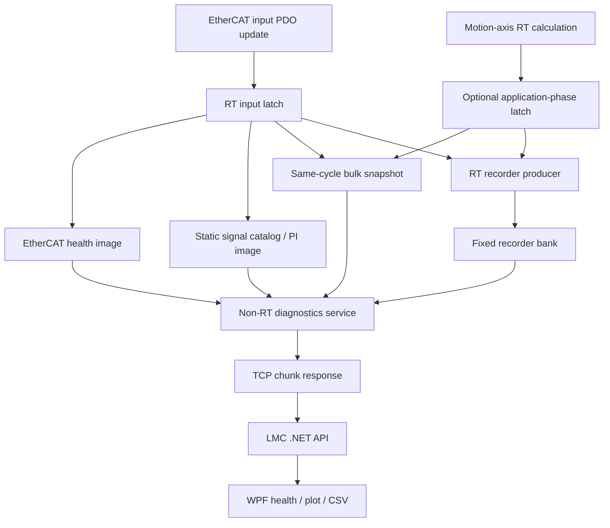
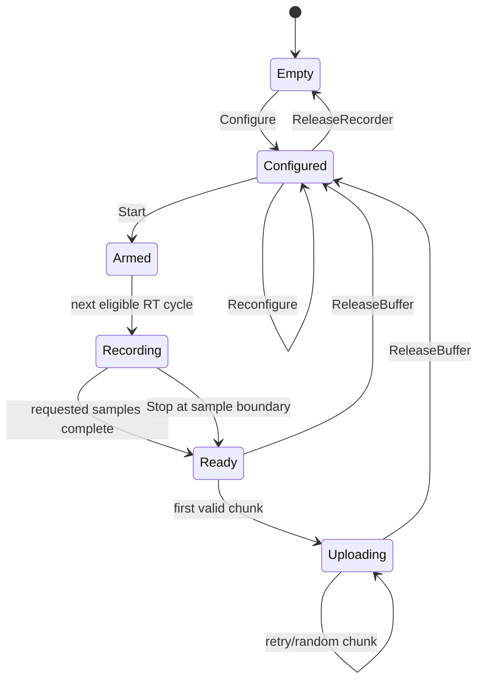

# LMC EtherCAT PI/Bulk/Recorder Implementation Design

- 작성일: 2026-07-20
- 상태: D1~D3 internal test source 활성, D4/D5 public contract 구현·PLC fail-closed,
  D6 후속, LASAL IDE 재빌드·implementation smoke 통과, PLC 실장 검증 대기
- 적용 대상:
  - `Lasal_PRG/Elmo_EtherCAT_Test_4Axis`
  - `LMC_Library/LMC_API_Delivery/src`
  - `LMC_Library/LasalApiWpfTestApp`
- protocol 명칭: `LASAL-DINT Diagnostics v1`

## 1. 결론

LASAL PLC에서 Elmo의 PI, Bulk Read, Recorder에 대응하는 기능을 구현한다.
구현 코어는 다음처럼 분리한다.



핵심 결정은 아래와 같다.

1. RT 경로는 PDO 갱신 뒤 고정된 1 ms task에서 실행한다.
2. RT 경로에는 동적 메모리, 문자열, TCP, 파일 I/O, SDO, mutex 대기를 넣지 않는다.
3. Signal Catalog는 정적 테이블이며 wire에는 `SignalId`와 raw 32-bit 값을 사용한다.
4. Bulk는 TCP 요청 시 각 변수를 읽지 않는다. RT가 동일 cycle에 만든 immutable
   snapshot을 Non-RT가 읽는다.
5. Recorder v1은 단일 고정 bank, manual start, finite length, no-trigger로 시작한다.
   설계 상한은 32채널이지만 현재 source 구현 상한은 고정 Catalog와 같은 24채널이다.
6. Recorder 데이터는 `recordId + bufferId + offset + count + sequence` 기반으로
   기본 1,280-byte data chunk를 전송한다. 실기 검증 뒤 capability 값으로만 상향한다.
7. PI Write는 v1에서 꺼 둔다. 이후 allowlist, type/range/state/ownership 검사를
   통과한 항목만 허용한다.
8. SDO는 RT Recorder와 분리하고 ticket 기반 비동기 service로 구현한다.
9. 현재 인스턴스 기반 `LMCConnection`은 유지한다. Elmo식 static/handle facade는
   마지막 호환 계층으로만 추가하며 이번 구현 범위에는 넣지 않는다.

이 문서는 구현할 구조와 단계별 완료 조건을 정한 기준이다. 현재 internal test source는
D1 Health/Catalog/PI Read, D2 Bulk, D3 single-bank manual Recorder를 광고하도록
구성됐다. D4/D5 public C# contract와 WPF test path도 준비됐지만 PLC capability는 0이며
exact request에 `UnsupportedFeature`를 반환한다. 모든 단계는 실제 PLC runtime 검증 전이다.

### 1.1 Elmo API와의 기능 대응

| Elmo/MMCLib 사용 형태 | LASAL-DINT Diagnostics v1 |
|---|---|
| `GetPIVarInfoByAlias` | Catalog info/chunk에서 alias와 metadata 조회 |
| `ReadPIVar` | `ReadPI(SignalId)`로 최신 cyclic image 조회 |
| `WritePIVar` | D5 `SubmitPIWrite`, 기본 비활성/allowlist |
| `MMC_ConfigBulkRead` | `ConfigureBulk` |
| `MMC_PerformBulkRead` | `ReadBulkSnapshot` |
| `BeginRecording` | `ConfigureRecorder` + `StartRecorder` |
| `GetRecordingStatus` | `GetRecorderStatus` |
| `StopRecording` | `StopRecorder` |
| `GetRecordingDataHeader` | `GetRecorderHeader` |
| `GetRecordingData(from,to,buffer)` | `ReadRecorderChunk(offset,count,bufferId)` |

대응 목표는 사용자 기능과 호출 흐름이다. Elmo 내부 signal number, command ID,
packet binary를 복제하는 것이 아니다.

### 1.2 범위와 제외 범위

이번 설계에 포함한다.

- EtherCAT master/slave health
- 현재 활성 PDO와 PLC/motion 신호의 정적 Catalog
- read-only PI와 동일-cycle Bulk
- 1 ms RT Recorder, chunk upload, WPF plot/CSV
- 이후 제한적 PI/SDO Write

이번 설계로 대체할 수 없거나 별도 기능으로 둔다.

- drive 내부 servo loop의 1 ms보다 빠른 신호
- raw EtherCAT datagram/Wireshark급 frame capture
- 실행 중 동적 PDO remapping
- Maestro/MMCLib 전체 binary wire 복제
- 현재 `LMCConnection` core의 static 전환

LASAL Data Analyzer와 PLC Trace는 개발·시운전 중 RT 순서, jitter, channel 값을
검증하는 도구로 사용한다. 이 도구가 현재 WPF PI/Bulk/Recorder API나 배포 runtime
contract를 대신한다고 간주하지 않는다.

### 1.3 2026-07-21 구현 상태

아래 표의 `source 구현`은 코드와 network 정의가 존재한다는 뜻이다. `wire 활성` 또는
`PLC 실장 검증 완료`를 뜻하지 않는다.

| 단계 | 현재 분류 | 현재 source 범위 | wire 상태와 남은 조건 |
|---|---|---|---|
| D0 | 구현됨 | common envelope, capability parser/model, `0x7E00` PLC handler, sync/async PC API | active. service 연결 시 D1, nonzero BootId일 때 D2/D3 capability 광고 |
| D1 | internal test source 활성 | 4축 x 활성 PDO 6개인 24-entry Catalog, Health, PI Read, 304-byte RT latch와 seqlock copy | `LMC_DIAG_D1_ENABLED=TRUE`, capability bit 0~2 광고. PLC runtime 검증 대기 |
| D2 | internal test source 활성 | 최대 24-entry Bulk configure/status/snapshot/release, 동일 latch snapshot, session owner 검사 | retained `DiagnosticsBootCounter`에서 nonzero BootId가 발급될 때 bit 3 광고 |
| D3 | internal test source 활성 | 1,280,000-byte 단일 bank, 최대 24채널, manual/no-trigger, finite capture, status/header/chunk/release/adopt | nonzero BootId일 때 bit 4 광고. PLC RAM/jitter/chunk/adopt 검증 대기 |
| D4 | public contract 구현 / PLC fail-closed | C# Ring/Double/Edge/Window/Mask model, `TriggerRecorder` sync/async, WPF 설정/호출 | PLC ring/trigger/double bank 미구현, bit 5~6=0, exact `0x7E42` request에 UnsupportedFeature |
| D5 | public contract 구현 / PLC fail-closed | PI Write, SDO ticket/status/cancel, extended result chunk sync/async와 WPF flow | PLC allowlist/ticket/drive dispatcher 미구현, bit 7~9/12=0, exact reserved request에 UnsupportedFeature |
| D6 | 후속 설계 | 현재 instance 기반 `LMCConnection` 유지 | static/handle facade 미구현; PLC와 wire 안정화 뒤 C# compatibility layer로만 추가 |

D0 PLC test build의 정상 capability는 다음과 같다.

```text
DiagnosticsBuild     = 1
CapabilityBits       = 0x0000001F  // D1-D3, normal retained BootId path
MapRevision          = 0x957F101E
DiagnosticsBootId    = nonzero retained generation
MaxRequestPayload    = 1320
MaxResponsePayload   = 2040
MaxChunkData         = 1280
```

retentive counter가 wrap/fault이거나 service가 없으면 stateful bit 3~4는 0으로 내려간다.
D1 service가 연결된 상태에서는 bit 0~2를 유지할 수 있다.

현재 source의 실행 경로는 다음과 같다.

1. `LMCEcatInputLatch1.ClassSvr`는 별도 주기 속성을 갖지 않고
   `_LMCAxis1.LMCPreRtWorkTrigger`에 연결된다. 이 trigger로 실행되는
   `LMCEcatInputLatch.RtWork`가 4축 Health와 24개 PDO 값을 하나의 304-byte image에
   기록하고, 짝수 publish sequence를 공개한 직후 `LMCRecorderStore.AppendSnapshot`을
   호출한다. Recorder sample copy에는 문자열, 동적 할당, TCP 또는 파일 I/O가 없다.
2. `Motion_Network`에는 `LMCRecorderStore1`이 정확히 한 개 있고 RT latch client가
   이 store에 연결된다. `Comm_Network`에서는 `LMCDiagnosticsService1`이 같은 store에
   연결되어 TCP command를 non-RT에서 처리한다.
3. Recorder chunk는 `ReadRecorderChunk(0x7E46)`에서 최대 1,280 data bytes씩
   `recordId + bufferId + offset + sequence + diagnosticsBootId`를 포함해 반환한다.
4. TCP close, socket disconnect 또는 send failure는 종료 직전 session epoch를
   `PendingClosedSessionEpoch`에 보존한다. 다음 `CyWork`가
   `NotifySessionClosed`를 호출하여 Bulk owner를 정리하고 Recorder owner를
   `ClosedSessionEpoch`으로 표시한다. 이후 `AdoptRecorder(0x7E49)`가 동일 BootId와
   record/buffer identity를 검사해 새 session epoch로 소유권을 넘기는 구조다.

코드 근거:

- [LMCEcatInputLatch.st](../../Lasal_PRG/Elmo_EtherCAT_Test_4Axis/Class/LMCEcatInputLatch/LMCEcatInputLatch.st)의
  `RtWork`, 304-byte image publish, `AppendSnapshot`
- [LMCRecorderStore.st](../../Lasal_PRG/Elmo_EtherCAT_Test_4Axis/Class/LMCRecorderStore/LMCRecorderStore.st)의
  `g_LMCRecorderData`, `AppendSnapshot`, `HandleRequest`, `NotifySessionClosed`
- [LMCDiagnosticsService.st](../../Lasal_PRG/Elmo_EtherCAT_Test_4Axis/Class/LMCDiagnosticsService/LMCDiagnosticsService.st)의
  D1~D3 enable 상수, Catalog/Bulk handler, Recorder delegation
- [TCPMotionInterface.st](../../Lasal_PRG/Elmo_EtherCAT_Test_4Axis/Class/TCPMotionInterface/TCPMotionInterface.st)의
  capability response, diagnostics dispatch, `PendingClosedSessionEpoch`
- [Motion_Network.lcn](../../Lasal_PRG/Elmo_EtherCAT_Test_4Axis/Network/Motion_Network/Motion_Network.lcn)과
  [Comm_Network.lcn](../../Lasal_PRG/Elmo_EtherCAT_Test_4Axis/Network/Comm_Network/Comm_Network.lcn)의
  `LMCRecorderStore1` 및 두 client connection
- [LmcDiagnosticsD5.cs](../../LMC_Library/LMC_API_Delivery/src/LmcDiagnosticsD5.cs)의
  PI Write fail-closed와 empty SDO write allowlist

retained nonzero `DiagnosticsBootId`는 hidden `DiagnosticsBootCounter` server
(`Retentive=File`)를 첫 diagnostics request에서 한 번 증가시키고 read-back 확인하는
방식으로 구현했다. wrap 또는 write/read-back 불일치는 BootId 0으로 fail-closed한다.
이 server와 `GetDiagnosticsBootId`가 추가된 현재 source는 LASAL IDE Rebuild/Link
0 error로 확인했다. C78 project와 C81 library/compiler version mismatch warning 3건은
남아 있다. `Find in Implementation`은 InputLatch, RecorderStore,
TCPMotionInterface.Diagnostics 3건이 성공했고 smoke 기준 이후 `Lasal2.log`의 신규
`CInvalidArgException`은 0건이다. PLC download, System Trace RT ordering, packet
capture, recorder RAM/jitter, disconnect/adopt 및 chunk hash 시험은 남아 있다.
이 검증이 끝나기 전에는 D1~D3를 production 완료 또는 PLC 실장 완료로 분류하지 않는다.

## 2. 확인된 현재 기준

### 2.1 Task와 wire 한계

| 항목 | 현재 확인값 | 설계 영향 |
|---|---:|---|
| EtherCAT ENI cycle | 1,000 us | Recorder 최소 sample period는 1 ms |
| `_LMCAxis1..9` | RT 1 ms | application signal도 최고 1 ms |
| `TCPMotionInterface` | CyWork 1 ms, RT 아님 | TCP는 RT sample source가 될 수 없음 |
| request payload 최대 | 1,320 bytes | 큰 config도 이 크기 이내여야 함 |
| request staging | 1,328 bytes | 8-byte header 포함 |
| receive accumulator | 2,048 bytes | 다중 frame 누적 parser 유지 |
| send staging | 2,048 bytes | response 전체를 2,048 bytes 미만으로 제한 |
| TCP request execution | connection당 직렬 | chunk 단위로 다른 RPC가 끼어들 수 있게 함 |

근거:

- [HW_Network.lcn](../../Lasal_PRG/Elmo_EtherCAT_Test_4Axis/Network/HW_Network/HW_Network.lcn)
  의 `EtherCATBusCycleTime=1000`
- [Eni.xml](../../Lasal_PRG/Elmo_EtherCAT_Test_4Axis/Network/Eni.xml)의
  `CycleTime=1000`
- [Motion_Network.lcn](../../Lasal_PRG/Elmo_EtherCAT_Test_4Axis/Network/Motion_Network/Motion_Network.lcn)의
  `_LMCAxis1..9` `RealTime="1 ms"`
- [TCPMotionInterface.st](../../Lasal_PRG/Elmo_EtherCAT_Test_4Axis/Class/TCPMotionInterface/TCPMotionInterface.st)의
  `_TCPMI_REQUEST_ENTRY.PayloadData[0..1319]`, `ReceiveBuf[0..2047]`,
  `RequestBuf[0..1327]`, `Sendbuf[0..2047]`
- [LmcConnection.cs](../../LMC_Library/LMC_API_Delivery/src/LmcConnection.cs)의
  connection별 `sync` gate와 header/payload exact read

### 2.2 실제 EtherCAT RT 순서

현재 source에서 확인되는 실행 의미는 다음과 같다.

```text
HwControl RT PreScan
  -> ECAT_Master_Base::UpdateRt
     -> input frame lock/update
     -> 모든 slave input PDO를 class memory로 복사
     -> 각 DS402 UpdateRt
     -> frame/health 판정
  -> 일반 RT object (_LMCAxis1..9, robot 등)
  -> HWRtPostScan (RealIndex 1073741824)
     -> output PDO를 transmit image로 복사
     -> frame unlock/send
```

`ECAT_DS402Base::MapPDODataRd`는 input PDO를 복사한 뒤 `UpdateRt()`를 호출하고,
`MapPDODataWr`는 `UpdateRtPostScan()` 뒤 output PDO를 송신 image로 복사한다.

따라서 한 개 drive callback 안에서 Recorder를 실행하면 그 drive 값은 최신이어도
다른 drive가 아직 갱신되지 않았을 수 있다. 여러 축의 같은-cycle 보장을 위해서는
모든 input PDO callback이 끝난 뒤 중앙 RT latch가 한 번 실행되어야 한다.

### 2.3 현재 실제 활성 PDO

`ECAT_DS402Base`에 server가 존재한다는 사실과 현재 ESI/PDO mapping에서 cyclic하게
갱신된다는 사실은 같지 않다. 물리축 1~4에 현재 `AddPDOEntry()`로 등록된 신호는
각 축마다 아래 6개다.

| 방향 | 신호 | Index:SubIndex | v1 access |
|---|---|---|---|
| Master -> Drive | Target Position | `0x607A:0` | Read only API |
| Master -> Drive | Digital Outputs | `0x60FE:1` | Read only API |
| Master -> Drive | ControlWord | `0x6040:0` | Read only API |
| Drive -> Master | Actual Position | `0x6064:0` | Read only |
| Drive -> Master | Digital Inputs | `0x60FD:0` | Read only |
| Drive -> Master | StatusWord | `0x6041:0` | Read only |

근거는 [Elmo_1.st](../../Lasal_PRG/Elmo_EtherCAT_Test_4Axis/Class/Elmo_1/Elmo_1.st)의
`AddPDOEntry()` 6개이며 `Elmo_2..4`도 같은 구조다.

다음 항목은 `ECAT_DS402Base`에 server가 있지만 현재 PDO에는 없다.

- Actual Velocity `0x606C`
- Actual Torque `0x6077`
- Following Error `0x60F4`
- Target Velocity `0x60FF`
- Target Torque `0x6071`

이 신호를 v1 Catalog에 `ActivePdo`로 표시하면 안 된다. 추후 ENI/PDO를 변경해
실제 cyclic mapping이 생긴 revision에서만 활성화한다. SDO로 읽을 수 있다는 이유로
1 ms PI/Recorder 신호로 표시해서도 안 된다.

D1 Catalog에는 이 비활성 DS402 항목을 recordable SignalId로 발급하지 않는다.
요청 alias가 없으면 `SignalNotFound`를 반환하며 자동 SDO fallback을 하지 않는다.

축 5~9는 1 ms RT에서 동작하지만 현재 `SimulateMode=1`인 software axis다.
Catalog에서는 `MotionAxis` source로 분류하고 PDO index/subindex는 `N/A`로 둔다.

### 2.4 현재 바로 읽을 수 있는 Health

Master 공개 server:

- `EtherCATState`
- `MissedFrameCounter`
- `FrameTimeTask0`
- `FrameTimeMaxTask0`
- `Act_RtTime`, `Min_RtTime`, `Max_RtTime`
- `Synchron`

Slave 1~4 공개 server:

- `Online`
- `EtherCATState`
- `SlaveState`
- `AL_StatusCode`
- `ClassState`
- DS402 `StateWord`, `AxError`

`MissedFrameCounter`는 누적 total이 아니라 연속 invalid/stale cycle 수다. 값이 0보다
크면 해당 cycle에는 input PDO callback이 실행되지 않아 직전 정상 PDO 값이 남을 수
있다. v1은 원래 값을 `ConsecutiveInvalidCycles`로 노출하고, 별도의 custom 누적
counter를 `InvalidCycleTotal`로 만든다.

현재 `MissingFrameBehaviour=3`이므로 3회 연속 invalid frame에서 master error
정책이 작동한다. Health UI는 이 threshold와 현재 counter를 분리해 표시한다.

현재 public server만으로 cyclic expected/actual WKC 상세값을 계속 읽을 수는 없다.
WKC별 상세 진단은 vendor hook 또는 master 파생 구현을 확인한 뒤 v2 capability로
추가한다.

## 3. RT와 Non-RT 경계

| 동작 | RT 1 ms | Non-RT CyWork/TCP | PC |
|---|:---:|:---:|:---:|
| PDO/health raw 값 latch | O | X | X |
| cycle counter/timestamp publish | O | X | X |
| Bulk same-cycle copy | O | X | X |
| Recorder sample append | O | X | X |
| trigger 비교 | v2에서 O | X | X |
| SignalId 검증/config compile | X | O | X |
| 문자열/alias 처리 | X | O | O |
| TCP frame 생성/송신 | X | O | X |
| Recorder chunk read | X | O | O |
| SDO request 진행 | X | O | X |
| plot/CSV/file | X | X | O |

RT에서 금지할 항목:

- `Malloc`, `new`, 가변 길이 container
- 문자열 비교, formatting, logging
- TCP/UDP send, file write
- SDO/mailbox 요청
- Non-RT가 보유할 수 있는 mutex/semaphore 대기
- 데이터 수에 비례해 상한이 없는 loop

모든 RT loop는 compile-time 최대값을 가져야 한다. v1 기준 상한은
`MAX_DIAG_CHANNELS=32`다.

## 4. LASAL class 분리

새 custom source의 선언, 구현, 식별자, 문자열, 주석과 LASAL IDE object/channel 이름은
모두 7-bit ASCII로 작성한다.

### 4.1 `LMCDiagnosticsTypes`

공유 상수와 고정 구조체만 둔다.

```text
Signal catalog entry
RT source slot
Snapshot header/entry
Recorder config/header/status
Recorder buffer ownership
Diagnostic result/status enum
Protocol version/capability bits
```

큰 data array와 동작 코드는 이 class에 넣지 않는다.

### 4.2 `LMCEcatInputLatch`

1 ms RT producer다.

책임:

1. 모든 input PDO 갱신 뒤 cycle counter 증가
2. master/slave health latch
3. 물리축 PDO raw image latch
4. `INPUT_MAPPED` Bulk shadow publish
5. `INPUT_MAPPED` Recorder sample append
6. stale/invalid 상태 계산

vendor `ECAT_Master_Base`, `ECAT_DS402Base`, `Elmo_1..4` source는 직접 수정하지 않는다.
우선 같은 RT task의 companion object로 구현한다.

필수 실행 순서:

```text
all EtherCAT input callbacks
  < LMCEcatInputLatch
  < motion-axis calculation
  < HWRtPostScan
```

LASAL IDE의 실행 순서와 System Trace로 이 순서가 증명되지 않으면 production으로
표시하지 않는다.

현재 `EtherCAT_PLC`는 `ECAT_Master_Base`를 내부 `_base` object로 합성하며 public
`UpdateRt()` override 지점을 직접 노출하지 않는다. 따라서 companion object로
순서를 보장할 수 없다고 해서 `EtherCAT_PLC`를 단순 상속해 override하면 안 된다.
fallback은 다음 중 vendor/LASAL IDE가 지원하는 방식이 확인될 때만 사용한다.

1. project-owned `ECAT_Master_Base` 파생 class에 post-input hook을 추가하고 custom
   master wrapper의 `_base`를 그 class로 교체
2. SIGMATEK가 제공하는 공식 post-input callback/hook 연결

두 방법 모두 확인되지 않으면 fallback을 추정 구현하지 않고 RT ordering blocker로
남긴다. vendor base source를 직접 수정하는 것은 fallback이 아니다.

### 4.3 `LMCMotionSnapshotRt`

축 1~9와 robot의 application 계산 결과를 기록할 선택적 두 번째 RT producer다.

- 실행 phase: motion 계산 뒤, EtherCAT output PostScan 전
- capture phase: `PRE_OUTPUT`
- 축 1~4: physical motion axis
- 축 5~9: software/simulated axis
- v1 EtherCAT raw Recorder와 독립적으로 enable 가능

`INPUT_MAPPED`와 `PRE_OUTPUT` 신호는 의미가 다르다.

| Capture phase | Actual Position | Target/ControlWord |
|---|---|---|
| `INPUT_MAPPED` | 이번 수신 frame | 직전 cycle에 송신한 값 |
| `PRE_OUTPUT` | 이번 수신 frame 기반 계산값 | 이번 cycle에 곧 송신할 값 |

Catalog entry와 record header에 반드시 `capturePhase`를 넣는다. v1 Bulk/Recorder
configuration은 한 phase의 신호만 허용한다. phase가 섞이면
`MixedCapturePhase`로 거부한다.

### 4.4 `LMCRecorderStore`

Recorder의 고정 data bank와 ownership만 관리한다.

v1:

```text
FREE -> WRITING -> READY -> UPLOADING -> FREE
```

- RT는 `WRITING` bank만 쓴다.
- header와 data를 모두 쓴 뒤 release memory barrier와 atomic state write로
  `READY`를 마지막에 publish한다.
- Non-RT는 `READY -> UPLOADING` 전환에 성공한 immutable bank만 읽는다.
- Non-RT는 acquire semantics로 `READY/UPLOADING`을 읽은 뒤에만 header/data를 읽는다.
- upload 중인 bank를 RT가 다시 쓰지 않는다.
- release 전에는 새 record를 시작하지 않는다.
- RT는 bank가 없을 때 기다리지 않고 `Busy`를 반환한다.

기존 `cRingBuffer`는 constructor에서 메모리를 할당하고 RT/Non-RT 간 mutex 없는 사용
조건도 이 구조와 맞지 않으므로 재사용하지 않는다.

### 4.5 `LMCDiagnosticsService`

Non-RT CyWork service다.

책임:

- capability와 Catalog 응답
- config의 SignalId/type/phase/range 검증
- RT config double-buffer publish
- PI/Bulk immutable snapshot read
- Recorder configure/start/stop/status/header/chunk/release
- SDO ticket state machine
- protocol payload 생성

이 service는 RT producer가 쓰는 bank를 수정하지 않는다.

### 4.6 `TCPMotionInterface`

기존 class는 transport/dispatcher facade로 유지한다.

- diagnostics command를 `LMCDiagnosticsService` client로 전달
- request queue와 session validation 유지
- 반환받은 bounded payload를 `Sendbuf`로 송신

Catalog, EtherCAT object 연결, Recorder buffer, trigger 구현을 현재 3,000행 이상의
`TCPMotionInterface.st`에 직접 넣지 않는다.

## 5. Signal Catalog / PI 설계

### 5.1 ID와 revision

`SignalId`는 unsigned 32-bit opaque ID다. 숫자 범위는 관리 편의를 위해 나누지만
PC가 bit를 해석해 source를 추론해서는 안 된다.

| 범위 | 용도 |
|---|---|
| `0x00010000..0x0001FFFF` | system/EtherCAT master health |
| `0x00020000..0x0002FFFF` | EtherCAT slave health |
| `0x00100000..0x001FFFFF` | physical-axis PDO/raw signal |
| `0x00200000..0x002FFFFF` | motion-axis application signal |
| `0x00300000..0x003FFFFF` | PLC application diagnostic signal |

Catalog 변경 규칙:

1. 기존 ID의 의미나 type을 바꾸지 않는다.
2. 의미가 바뀌면 새 ID를 발급한다.
3. table 변경 때 `mapRevision`을 바꾼다.
4. `mapRevision`은 offline에서 table bytes의 CRC32로 생성해 상수로 넣는다.
5. config/write request는 자신이 조회한 `mapRevision`을 다시 보낸다.
6. 불일치하면 `MapRevisionMismatch`로 거부하고 PC가 Catalog를 다시 받는다.
7. 활성 Catalog의 `mapRevision=0`은 금지한다. canonical CRC가 우연히 0이면
   `0xFFFFFFFF`를 deterministic substitute로 사용한다.

### 5.2 Catalog entry

Catalog의 논리 필드는 다음과 같다.

```text
signalId            UDINT
catalogIndex        UINT
sourceKind          BYTE
sourceIndex         BYTE
dataType            BYTE
byteWidth           BYTE
unitCode            UINT
accessFlags         UINT
signalFlags         UINT
pdoIndex            UINT
pdoSubIndex         BYTE
pdoDirection        BYTE
scaleNumerator      DINT
scaleDenominator    DINT
minimumRaw          DINT
maximumRaw          DINT
alias               fixed ASCII[40]
```

wire entry는 아래 80 bytes로 고정한다. `alias`는 Non-RT Catalog 응답에서만
다룬다.

| Entry offset | Type | Field |
|---:|---|---|
| 0 | UDINT | `signalId` |
| 4 | UINT | `catalogIndex` |
| 6 | BYTE | `sourceKind` |
| 7 | BYTE | `sourceIndex` |
| 8 | BYTE | `dataType` |
| 9 | BYTE | `byteWidth` |
| 10 | UINT | `unitCode` |
| 12 | UINT | `accessFlags` |
| 14 | UINT | `signalFlags` |
| 16 | UINT | `pdoIndex` |
| 18 | BYTE | `pdoSubIndex` |
| 19 | BYTE | `pdoDirection` |
| 20 | DINT | `scaleNumerator` |
| 24 | DINT | `scaleDenominator` |
| 28 | DINT | `minimumRaw` |
| 32 | DINT | `maximumRaw` |
| 36 | CHAR[40] | fixed ASCII `alias` |
| 76 | UDINT | reserved, zero |

필수 flag:

- `Readable`
- `WritableByPolicy`
- `Recordable`
- `BulkReadable`
- `ActivePdo`
- `PhysicalAxis`
- `SoftwareAxis`
- `InputMappedPhase`
- `PreOutputPhase`

v1 value는 모두 raw 32-bit slot 하나로 정규화한다.

- DINT: 32-bit 그대로
- UDINT/bit field: bit pattern 그대로
- INT/UINT/BOOL: 32-bit로 sign/zero extend
- REAL: IEEE-754 bit pattern
- LREAL/LINT/ULINT: v1 Recorder 대상에서 제외

`scaleNumerator/scaleDenominator`는 표시 metadata다. DLL packet builder가 자동으로
motion unit을 변환하지 않는 기존 정책은 유지한다. WPF가 사용자가 선택한 표시 단위로
변환할 때만 이 metadata를 사용한다. `scaleDenominator`는 항상 0이 아니어야 한다.

### 5.3 v1 PI Read

PI Read는 SDO read가 아니다. RT가 publish한 최신 cyclic image에서 하나의
`SignalId`를 읽는다.

응답에는 아래를 포함한다.

```text
mapRevision
signalId
capturePhase
cycleCounter
timestampUs
rawValue32
valueType
entryStatus
```

데이터 유효 기본식:

```text
masterState == OP
AND consecutiveInvalidCycles == 0
AND slaveOnline == 1                 // slave source인 경우
AND slaveState == OP                 // slave source인 경우
AND alStatusCode == 0                // slave source인 경우
```

상태 bit:

- `Valid`
- `StaleFrame`
- `MasterNotOperational`
- `SlaveOffline`
- `SlaveNotOperational`
- `AlError`
- `NotMapped`
- `SourceUnavailable`

값이 stale일 때 raw slot에는 마지막 정상값이 남아 있을 수 있으므로 status를 무시하면
안 된다.

`EntryStatus.Valid`은 단독 상태다. bit 0이 1이면 bit 1..7은 모두 0이어야 한다.
frame stale, master 비-OP, slave offline/비-OP, AL error는 RPC 오류가 아니라 성공
response의 entry status로 반환하고 마지막 raw 값을 함께 보낼 수 있다. 반대로
`SignalNotFound`, `TypeMismatch`, `ReadDenied`, `MapRevisionMismatch`는 common-only domain
error다. `ReadPI`는 `ResponseFlags.Partial`을 사용하지 않는다.

### 5.4 D1 고정 PDO Catalog

D1 Catalog는 현재 `Elmo_1..4::SetPDOSettings()`에 실제 등록된 6개 PDO만 축별로
광고한다. software axis 5~9는 PDO가 아니고 D1 input latch만으로 동일 phase를 보장할
수 없으므로 D1 Catalog에서 제외한다. software axis는 D2의 별도 `PRE_OUTPUT` snapshot과
capability bit 10이 구현된 뒤 추가한다.

ID와 index는 다음 식으로 고정한다.

```text
SignalId     = 0x00100000 | (PhysicalAxis << 8) | SignalCode
CatalogIndex = (PhysicalAxis - 1) * 6 + (SignalCode - 1)
PhysicalAxis = SourceIndex = 1..4
```

| Code | Alias suffix | SourceKind | ValueType / width | UnitCode | PDO | Direction |
|---:|---|---:|---|---:|---|---:|
| 1 | `target_position_last_tx` | 5 PdoOutputLastTx | 4 Int32 / 4 | 1 PositionCounts | `0x607A:0` | 1 MasterToDrive |
| 2 | `digital_outputs_last_tx` | 5 PdoOutputLastTx | 8 BitField32 / 4 | 0 NoneRaw | `0x60FE:1` | 1 MasterToDrive |
| 3 | `control_word_last_tx` | 5 PdoOutputLastTx | 7 BitField16 / 2 | 0 NoneRaw | `0x6040:0` | 1 MasterToDrive |
| 4 | `actual_position` | 4 PdoInput | 4 Int32 / 4 | 1 PositionCounts | `0x6064:0` | 2 DriveToMaster |
| 5 | `digital_inputs` | 4 PdoInput | 8 BitField32 / 4 | 0 NoneRaw | `0x60FD:0` | 2 DriveToMaster |
| 6 | `status_word` | 4 PdoInput | 7 BitField16 / 2 | 0 NoneRaw | `0x6041:0` | 2 DriveToMaster |

alias는 `axis{PhysicalAxis}.{Alias suffix}` 소문자 ASCII다. 예를 들어 첫 ID는
`0x00100101`, alias는 `axis1.target_position_last_tx`다. 24개 entry 모두
`AccessFlags=0x000D` (`Readable|Recordable|BulkReadable`),
`SignalFlags=0x000B` (`ActivePdo|PhysicalAxis|InputMappedPhase`), scale은 `1/1`이다.
Int32 min/max는 `0x80000000/0x7FFFFFFF`, BitField16은 `0/65535`, BitField32는
`0/0xFFFFFFFF` bit pattern으로 canonicalize한다. `UnitCode` v1은 0 `NoneRaw`,
1 `PositionCounts`만 정의한다.

위 규칙으로 직렬화한 24 x 80 = 1,920 canonical bytes의 CRC-32/ISO-HDLC와 D1
`MapRevision`은 `0x957F101E`다. entry, alias, flag, min/max 중 하나라도 바뀌면 이 값을
offline에서 다시 계산하고 C#, PLC, golden packet을 함께 갱신한다.

### 5.5 PI Write

public C# API에는 `SubmitPIWrite` sync/async와 28-byte wire builder/parser가 있다.
그러나 현재 SDK compile-time allowlist와 PLC allowlist는 모두 empty이고 PLC capability도
false이므로 요청은 fail-closed한다. 후속 PLC 구현에서 아래 조건을 모두 만족할 때만
실제 write를 허용한다.

1. PLC 전역 `DiagnosticWriteEnable=1`
2. Catalog `WritableByPolicy=1`
3. 별도 compile-time allowlist에 ID 존재
4. exact type 일치
5. min/max 범위 통과
6. current session이 control owner
7. 축 상태가 해당 write 정책을 만족
8. 한 cycle에 한 번의 bounded handoff로 기존 owner class를 통해 반영

기본 영구 금지 항목:

- DS402 `ControlWord`
- `TargetPosition`
- `TargetVelocity`
- `TargetTorque`
- profile enable/lock과 충돌하는 내부 motion 변수

이 값은 raw PDO에 직접 쓰지 않고 기존 DS402/motion command 경로를 사용한다.

`SubmitPIWrite (0x7E21)` request contract:

```text
P0..7   common request
P8      UDINT  ExpectedMapRevision
P12     UDINT  SignalId
P16     BYTE   ValueType
P17..19 BYTE   Reserved=0
P20     UDINT  RawValue32
P24     UDINT  DiagnosticsBootId
```

향후 성공 response는 32-byte operation ticket response다. 현재 PLC는 정확한 28-byte
request만 수용한 뒤 `UnsupportedFeature` common response를 반환하며 SDK는 empty
allowlist에서 wire 송신 전에 차단한다.

## 6. EtherCAT Health 설계

v1 Health snapshot header:

```text
mapRevision
capturePhase=INPUT_MAPPED
cycleCounter
timestampUsLow
timestampUsHigh
masterState
consecutiveInvalidCycles
invalidCycleTotal
frameTimeUs
frameTimeMaxUs
rtTimeUs
rtTimeMaxUs
slaveCount
snapshotSequence
```

slave entry:

```text
slaveIndex
physicalAxis
online
etherCATState
slaveStateBits
alStatusCode
classState
ds402StatusWord
axisError
lastValidCycle
lastStateChangeCycle
```

`timestampUs`는 wall clock이 아니라 controller boot 이후 monotonic 진단 시간이다.
wire에서는 low/high 32-bit로 나눈다. 구현 전에 LASAL toolchain의 64-bit 연산 및
정렬을 확인한다. 확인 전에도 `cycleCounter`와 `samplePeriodUs`가 ordering의 기준이며,
PC는 그 값으로 상대 시간을 복원할 수 있다. `cycleCounter` 자체는 UDINT이며 1 ms에서
약 49.7일마다 wrap된다. PC는 두 값의 차이를 unsigned modular delta로 계산한다.

timestamp 구현은 `OS_READMICROSEC()`의 32-bit low 값이 이전 값보다 작아질 때 high
word를 증가시키는 O(1) extension을 기본안으로 한다. low/high는 snapshot publish
sequence 안에서 함께 복사해 torn read를 막는다.

현재 master의 `MissedFrameCounter`는 연속 invalid cycle이므로 custom
`invalidCycleTotal`은 다음 규칙으로 누적한다.

```text
if current frame is invalid/stale:
    invalidCycleTotal += 1
```

`frame loss event count`와 `invalid cycle total`을 같은 이름으로 표시하지 않는다.
원인별 WKC, PRE/POST return code가 필요하면 별도 capability로 추가한다.

## 7. 동일 cycle Bulk Snapshot

### 7.1 Configure

Non-RT service가 다음을 검사한다.

- `mapRevision` 일치
- entry count `1..32`
- 모든 SignalId가 존재하고 `BulkReadable`
- 모든 entry가 같은 `capturePhase`
- v1 지원 type/width
- duplicate 허용 여부: v1은 거부

검증된 config는 inactive config bank에 쓴 뒤 generation을 publish한다. RT는 cycle
경계에서 새 generation을 한 번만 받아 active config로 바꾼다. RT에서 SignalId나
문자열을 검색하지 않는다.

### 7.2 Publish

RT는 seqlock 형태의 double shadow를 사용한다.

```text
1. publishSequence를 odd로 변경
2. header와 최대 32 entry를 고정 순서로 복사
3. publishSequence를 even으로 변경
4. active shadow index를 publish
```

Non-RT는 sequence 전후가 같은 even 값일 때만 사용한다. 변경되면 bounded retry 후
`Busy`를 반환한다. RT가 Non-RT reader를 기다리는 구조는 금지한다.

32-bit atomic control word는 4-byte 정렬을 보장한다. `pack(1)` 구조의 중간 주소에
atomic word를 놓지 않는다. publish 전에 vendor atomic/memory barrier를 사용하고,
`volatile`만으로 cross-task ordering을 보장했다고 간주하지 않는다.

### 7.3 Bulk 결과

header:

```text
result/status
mapRevision
configId
configRevision
capturePhase
cycleCounter
timestampUsLow/High
entryCount
snapshotSequence
snapshotFlags
```

entry는 16 bytes다. `SignalId`를 32-bit로 유지해 Elmo Recorder/Bulk의 기존
32-bit signal 식별자 사용 형태와 future namespace를 보존한다.

```text
signalId       4
rawValue32     4
valueType      1
entryStatus    1
reserved       2
detailCode     4
```

TCP 요청을 처리하는 시점에 entry를 하나씩 PLC object에서 읽지 않는다. 반드시 이미
publish된 한 snapshot의 값만 반환한다.

## 8. RT Recorder

### 8.1 v1 기능

| 항목 | v1 |
|---|---|
| 최대 채널 | 32 |
| value 폭 | 채널당 4 bytes |
| 기본 sample period | 1 ms |
| down-sampling | `samplePeriodCycles * BaseCycleTimeUs` |
| trigger | manual/no-trigger |
| 길이 | finite sample count 필수 |
| buffer | single fixed bank |
| layout | sample-major |
| upload | immutable TCP chunks |
| reconnect resume | recordId/bufferId가 유지되는 동안 가능 |

위 표의 32채널은 최종 v1 설계 상한이다. 2026-07-21 현재 PLC source는 24-entry
고정 Catalog에 맞춰 `LMC_RECORDER_MAX_CHANNELS=24`, 고정 data bank
`1,280,000 bytes`로 구현되어 있다. 따라서 현재 구현은 아래 Memory profile의
`Standard` bank 크기를 사용하되 채널 수는 24가 상한이다. 32채널 확대는 Catalog와
snapshot layout, request/response contract, RT jitter를 함께 재검증한 뒤 진행한다.
현재 `MaxRecorderSamples=320,000` capability는 1채널일 때의 절대 상한이다. 실제
`AcceptedCapacity`는 `min(requestedCapacity, floor(1,280,000 / (channelCount * 4)))`다.
따라서 16채널은 20,000 samples, 24채널은 13,333 samples가 현재 bank 상한이다.

v1 state machine:



`Configure`는 `configId/configRevision`만 만들고 record ID를 발급하지 않는다.
`Start(configId, configRevision)`가 bank를 예약하고 새 `recordId/bufferId`를 즉시
반환한다. 실제 `startCycle`은 다음 eligible RT cycle에 확정된다. `Stop`도 flag만
전달하며 RT가 현재 sample을 완성한 뒤 bank를 freeze한다.

`ReleaseBuffer`는 frozen bank만 비우고 같은 configuration으로 다시 Start할 수 있게
한다. `ReleaseRecorder`는 READY/UPLOADING/WRITING bank가 없을 때만 configuration과
owner를 제거한다.

### 8.2 Data layout

```text
data[(sampleIndex * channelCount) + channelIndex] : DINT
```

sample-major를 사용하면 RT가 한 sample을 연속 주소에 쓰고, PC가 같은 시간축의 모든
채널을 한 번에 받기 쉽다.

일반 record는 sample마다 timestamp를 저장하지 않는다.

```text
sampleCycle = startCycle + sampleIndex * samplePeriodCycles
relativeTimeUs = sampleIndex * samplePeriodUs
samplePeriodUs = samplePeriodCycles * BaseCycleTimeUs
```

실제 per-cycle jitter timestamp가 필요하면 `System.TimestampUsLow` 또는 RT duration을
별도 signal channel로 선택한다. 이 channel도 32개 한도에 포함한다.

### 8.3 Memory profile

```text
32 channels * 4 bytes * 31,250 samples
= 4,000,000 bytes
= 약 3.81 MiB / bank
```

full double bank는 8,000,000 bytes, 약 7.63 MiB다. header, alignment, config,
snapshot memory는 별도다.

권장 build profile:

| Profile | Channels | Samples | Data/bank |
|---|---:|---:|---:|
| Small | 8 | 10,000 | 320,000 B |
| Standard | 16 | 20,000 | 1,280,000 B |
| Max candidate | 32 | 31,250 | 4,000,000 B |

현재 1,280,000-byte source에서 `Standard`는 그대로 가능하다. 24채널 상한 시험은
13,333 samples(1,279,968 B)로 수행한다. `Max candidate`는 4,000,000-byte bank로
확대한 후에만 가능한 후속 profile이며 현재 PLC에 요청하면 accepted capacity가
요청값보다 작아진다.

v1 첫 PLC 시험은 `Standard` 이하로 시작하고 다음을 측정한 뒤 Max를 확정한다.

- download 후 실제 free RAM
- recorder off/on `Act_RtTime`, `Max_RtTime`
- EtherCAT frame time/max
- invalid/missed cycle 증가 여부
- 32채널 loop의 worst-case execution time

메모리는 initialization 때 고정한다. 동적 할당을 쓰는 경우에도 Init에서 한 번만
수행하고 실패하면 class initialization을 실패시킨다. RT에서는 절대 할당하지 않는다.

### 8.4 Record identity와 disconnect

frozen capture header 최소 필드:

```text
protocolVersion
diagnosticsBootId
recordId
bufferId
configId
mapRevision
configRevision
capturePhase
channelCount
sampleCount
capacitySamples
samplePeriodUs
startCycle
endCycle
startTimestampUsLow/High
stopReason
overflowCount
dataCrcPolicy
signalIds[32]
```

현재 `state`와 `ownerSessionEpoch`는 capture data가 아니라 mutable control 상태이므로
별도 status response에서 반환한다.

- stateful capability를 공개하는 build의 `diagnosticsBootId`는 0이 아닌 32-bit
  diagnostics server generation이다. retained counter를 diagnostics resource table
  초기화 때 한 번 증가시키며 같은 값을 다시 발급하지 않는다. 다음 값이 0으로
  wrap되면 diagnostics initialization을 실패시킨다. schema v1에서 retained counter를
  0으로 reset하는 것은 금지한다. 단순 RT microsecond clock이나 TCP session epoch를
  BootId로 쓰지 않는다.
- D0/D1처럼 stateful capability bit가 모두 0인 build는 `diagnosticsBootId=0`을
  `StableBootIdUnavailable` sentinel로 반환할 수 있다. 이때 C#은 어떤 resource handle도
  만들거나 reconnect resume을 허용하지 않는다. Bulk/Recorder/PI Write/SDO capability를
  하나라도 켜려면 먼저 nonzero retained BootId를 구현하고 검증해야 한다.
- `recordId`는 0을 제외하고 한 `diagnosticsBootId` 동안 단조 증가하는 32-bit ID다.
  다음 값이 0으로 wrap되면 해당 boot에서는 모든 새 Start를 `ResourceBusy`로
  거부한다. release된 ID도 같은 boot에서 재사용하지 않는다.
- `bufferId`는 v1에서 0, v2 double bank에서 0 또는 1이다.
- `diagnosticsBootId + recordId + bufferId`가 모두 일치해야 chunk를 읽는다. 단조
  증가하는 `recordId`가 같은 boot에서 재사용된 bank의 generation 역할을 한다.
- TCP disconnect가 발생해도 finite capture는 끝까지 진행하고 `READY`로 보존한다.
- 재접속한 PC는 capability의 `diagnosticsBootId`를 먼저 비교하고 header를 다시 읽은
  뒤 임의 offset부터 재개할 수 있다. 모든 Recorder identity request도 BootId를
  보내므로 capability 확인과 chunk 요청 사이의 reboot race를 server가 거부한다.
- completed record는 명시적 `ReleaseBuffer` 전까지 덮어쓰지 않는다.
- v1에는 무한 기록을 넣지 않아 orphan recorder를 만들지 않는다.
- diagnostics service 재초기화 또는 PLC reboot 때 BootId가 바뀌며 모든 이전 record
  identity는 무효다. reconnect resume은 이 경계를 통과하지 않는다.

### 8.5 v2 trigger와 double buffer

v1 검증 뒤 추가한다.

- pre-trigger ring
- rising/falling edge
- signed/unsigned window in/out
- bit mask set/clear
- trigger sample/cycle 저장
- post-trigger sample count
- 두 번째 immutable bank

두 bank가 모두 `READY/UPLOADING`이면 새 record는 `Busy`다. RT가 old data를
자동 overwrite하거나 upload를 기다리지 않는다.

## 9. TCP protocol

### 9.1 Namespace와 negotiation

기존 canonical C#/PLC dispatcher에서 사용하지 않는 `0x7E00..0x7EFF`를
`LASAL-DINT Diagnostics v1` local extension으로 예약한다. 이 ID는 Maestro wire
호환 명령이라고 부르지 않는다. Elmo의 전체 비공개 command namespace와 충돌하지
않는다는 것까지 증명한 것은 아니므로 다른 server에 이 ID를 보내지 않는다.

첫 호출은 capability negotiation이다. PC는 지원 bit, protocol version,
Catalog schema, buffer/chunk 한계를 받은 뒤에만 후속 명령을 사용한다.

기존 little-endian outer header 8 bytes는 변경하지 않는다.

```text
Request:  +0 CommandId U16, +2 Reserved U16,
          +4 PayloadLength U16, +6 Reference U16
Response: +0 HeaderStatus U16, +2 PayloadLength U16,
          +4 Reserved U32
```

Diagnostics connection-level command의 request `Reference`는 0이다. signal, bulk,
record, buffer, ticket 식별자는 payload에서만 전달한다.

제안 command map은 기능군마다 범위를 분리한다.

| Command | ID | Phase |
|---|---:|---|
| GetDiagnosticsCapabilities | `0x7E00` | D0 |
| GetSignalCatalogInfo | `0x7E01` | D1 |
| GetSignalCatalogChunk | `0x7E02` | D1 |
| GetOperationStatus | `0x7E03` | D5 ticket 공통 |
| CancelOperation | `0x7E04` | D5 ticket 공통 |
| ReadEtherCATHealth | `0x7E10` | D1 |
| ReadPI | `0x7E20` | D1 |
| SubmitPIWrite | `0x7E21` | D5, default disabled |
| ConfigureBulk | `0x7E30` | D2 |
| ReadBulkStatus | `0x7E31` | D2 |
| ReadBulkSnapshot | `0x7E32` | D2 |
| ReleaseBulk | `0x7E33` | D2 |
| ConfigureRecorder | `0x7E40` | D3 |
| StartRecorder | `0x7E41` | D3 |
| TriggerRecorder | `0x7E42` | D4 public contract, PLC capability off |
| StopRecorder | `0x7E43` | D3 |
| ReadRecorderStatus | `0x7E44` | D3 |
| ReadRecorderHeader | `0x7E45` | D3 |
| ReadRecorderChunk | `0x7E46` | D3 |
| ReleaseRecorderBuffer | `0x7E47` | D3/D4 |
| ReleaseRecorder | `0x7E48` | D3 |
| AdoptRecorder | `0x7E49` | D3 reconnect |
| SubmitSDO | `0x7E50` | D5 |
| ReadSDOResultChunk | `0x7E51` | D5 extended-result public contract, PLC capability off |

command ID는 C# `LmcProtocol.cs`, PLC dispatcher와
`DINT_PACKET_MAP.txt`에 같은 commit으로 추가한다.

### 9.2 Capability response

`GetDiagnosticsCapabilities` request는 common request 8 bytes만 보낸다. 구형 PLC가
`0x7E00`에 기존 unknown-command error를 반환하면 C#은 diagnostics 미지원으로
판정한다.

response:

```text
P0..15  common response
P16     UDINT  DiagnosticsBuild
P20     UDINT  CapabilityBits
P24     UDINT  MapRevision
P28     UINT   CatalogEntryCount
P30     UINT   MaxBulkSignals
P32     UINT   MaxRecorderChannels
P34     UINT   RecorderBufferCount
P36     UDINT  MaxRecorderSamples
P40     UDINT  BaseCycleTimeUs
P44     UINT   MaxRequestPayloadBytes
P46     UINT   MaxResponsePayloadBytes
P48     UINT   MaxChunkDataBytes
P50     UINT   CatalogEntryStride
P52     UINT   SignalValueEntryStride
P54     UINT   Reserved
P56     UDINT  RecorderBytesPerBank
P60     UINT   MaxSdoDataBytes
P62     UINT   Reserved
P64     UDINT  DiagnosticsBootId
```

`DiagnosticsBootId`는 diagnostics resource table이 초기화될 때마다 바뀌는 불투명
server generation이다. C#은 capability를 connection generation에 묶어 보관하고,
이 값이 달라지면 기존 Bulk/Recorder/ticket handle을 전부 폐기한다. 단,
`CapabilityBits`의 stateful bit 3..9와 12가 모두 0인 D0/D1 build만 0 sentinel을
허용한다. stateful bit가 켜진 response에서 0이면 malformed capability로 거부한다.

`CapabilityBits`:

```text
bit 0  EtherCATHealth
bit 1  SignalCatalog
bit 2  PIRead
bit 3  BulkSnapshot
bit 4  RecorderSingleBank
bit 5  RecorderTrigger
bit 6  RecorderDoubleBank
bit 7  PIWrite
bit 8  SDORead
bit 9  SDOWrite
bit 10 ApplicationPhaseSnapshot
bit 11 ExtendedWkcDiagnostics
bit 12 ExtendedSdoResultChunk
```

미구현 기능은 command ID가 예약되어 있어도 capability bit를 0으로 반환한다.

D1 capability 의존 규칙은 다음과 같다.

- `PIRead` bit 2가 1이면 `SignalCatalog` bit 1도 반드시 1이다.
- 활성 D1 Catalog는 `MapRevision=0x957F101E`, `CatalogEntryCount=24`,
  `CatalogEntryStride=80`, `SignalValueEntryStride=16`을 반환한다.
- `SignalCatalog` bit가 0이면 `PIRead`도 0이고 D1 command는
  `UnsupportedFeature`로 거부한다.
- source 등록, RT latch ordering trace, LASAL Rebuild/Link, malformed packet test 중
  하나라도 미완료면 bits 0..2를 모두 0으로 유지한다.
- D1은 stateful resource가 없으므로 `DiagnosticsBootId=0`을 계속 허용한다.

### 9.3 Response 크기

PLC `Sendbuf` 2,048 bytes는 8-byte response header를 포함한다. 이론상 payload
상한은 2,040 bytes지만 direct send의 partial write가 session fault가 되고 현재 기존
최대 response가 1,358 bytes이므로 diagnostics v1 기본값은 더 보수적으로 둔다.

```text
DefaultMaxChunkDataBytes = 1,280
RecorderChunkFrameBytes = 8 + 52 + 1,280 = 1,340
AbsoluteCandidateMaxChunkDataBytes = 1,920
```

1,280은 4-byte aligned이며 32채널 record에서 정확히 10 samples를 담는다.

```text
32 * 4 * 10 = 1,280 bytes
```

미래 32채널/31,250-sample profile은 3,125 chunk다. PLC가 현재 CyWork cycle당
request 하나를 처리하므로
4 MB upload의 구조적 최저시간은 약 3.125초에 TCP/WPF overhead를 더한 값이다.

capability response에 `MaxChunkDataBytes`를 넣는다. 실제 PLC packet capture와 partial
send 시험을 통과한 build만 이 값을 최대 1,920까지 올릴 수 있다. 큰 응답을 한
packet에 맞추기 위해 기존 `Sendbuf`를 확대하지 않는다.

### 9.4 Common envelope와 오류

모든 offset은 outer 8-byte frame header를 제외한 payload 기준이다.

request 공통 8 bytes:

```text
P0  UINT   SchemaVersion = 1
P2  UINT   RequestFlags
P4  UDINT  RequestId             // nonzero, 0 is reserved
```

response 공통 16 bytes:

```text
P0   UINT   SchemaVersion = 1
P2   UINT   ResponseFlags
P4   UINT   CommandStatus       // 0=success, 1=error
P6   INT    ErrorId
P8   UDINT  echoed RequestId
P12  UDINT  DetailCode
```

정상 dispatch된 response outer header status는 0으로 유지한다. framing, session,
unknown-command 오류는 기존 4-byte short error response를 사용한다.

`RequestId=0`은 `BoundsInvalid`로 거부한다. payload 길이가 잘못됐더라도 공통
8 bytes가 모두 들어온 요청은 해당 `RequestId`를 오류 response에 echo한다. 공통
envelope 자체가 8 bytes보다 짧으면 읽을 ID가 없으므로 0을 반환할 수 있다.

Diagnostics domain 오류는 다음과 같이 고정한다.

```text
CommandStatus = 1
ErrorId       = -32000        // LMC_DIAGNOSTICS_ERROR
DetailCode    = operation-specific reason
```

D1 `0x7E01`, `0x7E02`, `0x7E10`, `0x7E20`의 domain error response payload는
정확히 common response 16 bytes다. 성공 response 크기로 zero-fill하지 않는다. D0
`GetDiagnosticCapabilities`의 기존 68-byte error response는 D0 wire 호환을 위해
그대로 유지한다.

일부 Bulk entry만 실패하면 RPC 전체는 성공이다. `ResponseFlags.Partial`과 entry별
status/detail을 사용한다.

### 9.5 Numeric contract와 CRC

모든 multi-byte 정수와 REAL bit pattern은 little-endian이다. 예약 필드는 송신 시
0으로 쓰고 수신 시 v1에서는 무시한다.

`DetailCode`:

| 값 | 이름 | 값 | 이름 |
|---:|---|---:|---|
| 0 | None | 13 | MixedCapturePhase |
| 1 | UnsupportedSchema | 14 | BufferNotFrozen |
| 2 | UnsupportedFeature | 15 | BufferOverwritten |
| 3 | MapRevisionMismatch | 16 | RtMailboxFull |
| 4 | SignalNotFound | 17 | SdoAbort |
| 5 | TypeMismatch | 18 | SlaveOffline |
| 6 | ReadDenied | 19 | InvalidState |
| 7 | WriteDenied | 20 | CapacityExceeded |
| 8 | UnsafeWriteBlocked | 21 | RecordNotFound |
| 9 | ResourceBusy | 22 | BufferIdentityMismatch |
| 10 | HandleOrGenerationStale | 23 | TicketNotFound |
| 11 | NotReady | 24 | InternalError |
| 12 | BoundsInvalid | 25 | BootIdMismatch |

고정 enum:

| Enum | 값 |
|---|---|
| `SourceKind` | 0 Invalid, 1 System, 2 EtherCATMaster, 3 EtherCATSlave, 4 PdoInput, 5 PdoOutputLastTx, 6 MotionAxis, 7 PlcApplication |
| `ValueType` | 0 Invalid, 1 Bool, 2 Int16, 3 UInt16, 4 Int32, 5 UInt32, 6 Real32, 7 BitField16, 8 BitField32 |
| `CapturePhase` | 0 None, 1 InputMapped, 2 PreOutput |
| `PdoDirection` | 0 None, 1 MasterToDrive, 2 DriveToMaster |
| `BulkState` | 0 Empty, 1 Pending, 2 Active, 3 Failed |
| `RecorderState` | 0 Empty, 1 Configured, 2 Armed, 3 Recording, 4 Ready, 5 Uploading, 6 Fault |
| `StopReason` | 0 None, 1 SampleCountComplete, 2 UserStop, 3 TriggerComplete, 4 Capacity, 5 Error |
| `BufferMode` | 0 Single, 1 Ring, 2 Double |
| `TriggerType` | 0 Manual, 1 Edge, 2 Window, 3 Mask |
| `TriggerOperator` | 0 None, 1 RisingEdge, 2 FallingEdge, 3 EnterWindow, 4 ExitWindow, 5 MaskAllSet, 6 MaskAnySet, 7 MaskAllClear |
| `OperationState` | 0 Free, 1 Queued, 2 Running, 3 Completed, 4 Failed, 5 Cancelled, 6 Expired |
| `OperationKind` | 0 None, 1 PIWrite, 2 SDORead, 3 SDOWrite |
| `OperationStatus` | 0 NoneOrPending, 1 Success, 2 Failed, 3 Cancelled, 4 TimedOut |
| `DataEncoding` | 1 SampleMajorRaw32LE |
| `DataCrcPolicy` | 0 None, 1 Crc32IsoHdlc |
| `UnitCode` | 0 NoneRaw, 1 PositionCounts |

bit field:

| Field | Bits |
|---|---|
| `AccessFlags` | bit0 Readable, bit1 WritableByPolicy, bit2 Recordable, bit3 BulkReadable |
| `SignalFlags` | bit0 ActivePdo, bit1 PhysicalAxis, bit2 SoftwareAxis, bit3 InputMappedPhase, bit4 PreOutputPhase, bit5 HealthSignal |
| `EntryStatus` | bit0 Valid, bit1 StaleFrame, bit2 MasterNotOperational, bit3 SlaveOffline, bit4 SlaveNotOperational, bit5 AlError, bit6 NotMapped, bit7 SourceUnavailable |
| `RequestFlags` | v1은 0만 허용 |
| `ResponseFlags` | bit0 Partial, bit1 LastChunk |
| `CatalogFlags` | bit0 FixedStride, bit1 AliasAscii7Bit, bit2 CanonicalCrc, bit3 OpaqueSignalId; D1은 `0x0000000F` |
| `MasterFlags` | bit0 MasterOperational, bit1 InvalidFrameActive; 나머지는 D1에서 0 |
| `SnapshotFlags` | bit0 SameCycle, bit1 InputMappedPhase, bit2 PreOutputPhase; bit1/bit2는 동시에 설정 금지 |
| `HeaderFlags` | bit0 CaptureComplete, bit1 TriggerPresent, bit2 UserStopped, bit3 DataCrcPresent |
| `OperationFlags` | bit0 Write; 0이면 Read, bit1..15는 v1에서 0 |

CRC는 둘 다 `CRC-32/ISO-HDLC`를 사용한다.

```text
polynomial normal   = 0x04C11DB7
polynomial reflected= 0xEDB88320
initial value       = 0xFFFFFFFF
reflect input/output= true
final XOR           = 0xFFFFFFFF
```

`mapRevision` coverage는 `catalogIndex` 오름차순의 80-byte Catalog entry 전체를
연결한 bytes다. 모든 정수는 little-endian, alias는 ASCII NUL padding, reserved는
0으로 canonicalize한다. 활성 Catalog의 CRC 결과 0은 `0xFFFFFFFF`로 치환한다.
`dataCrc32` coverage는 Recorder chunk의 `Data[]` bytes만이다.

### 9.6 Catalog chunk

`GetSignalCatalogInfo` request payload는 정확히 common request 8 bytes다.

`GetSignalCatalogInfo` response:

```text
P0..15  common response
P16     UDINT  MapRevision
P20     UINT   TotalCount
P22     UINT   EntryStride=80
P24     UINT   AliasBytes=40
P26     UINT   SignalIdBytes=4
P28     UDINT  CatalogFlags
P32     UDINT  CrcKind=1              // Crc32IsoHdlc
```

alias 검색은 C#이 Catalog를 받은 뒤 ordinal ASCII 비교로 수행한다. PLC에서 매번
문자열 alias 검색 RPC를 실행하지 않는다.

`GetSignalCatalogChunk` request:

```text
P0..7   common request
P8      UDINT  ExpectedMapRevision, 0=current accepted
P12     UINT   StartIndex
P14     UINT   MaxEntries, v1 <= 16
```

`MaxEntries`는 1..16이다. `StartIndex <= TotalCount`를 허용하고,
`StartIndex == TotalCount`이면 `ReturnedCount=0`, `LastChunk=1`을 반환한다. 그 외에는
`ReturnedCount=min(MaxEntries, TotalCount-StartIndex)`이며 각 entry의
`CatalogIndex=StartIndex+i`여야 한다. `LastChunk`는
`StartIndex+ReturnedCount==TotalCount`일 때만 1이고 Catalog chunk에서 `Partial`은
항상 0이다. `ExpectedMapRevision=0`은 low-level wire에서 current를 뜻하지만 public
`GetSignalCatalog()`은 info에서 받은 nonzero revision을 모든 chunk에 exact하게 보낸다.

response:

```text
P0..15  common response
P16     UDINT  MapRevision
P20     UINT   StartIndex
P22     UINT   ReturnedCount
P24     UINT   TotalCount
P26     UINT   EntryStride = 80
P28     CatalogEntry[ReturnedCount]
```

최대 16 entry이면 payload 1,308 bytes, outer header 포함 1,316 bytes다.

### 9.7 EtherCAT Health wire

`ReadEtherCATHealth` request payload는 정확히 common request 8 bytes다. D1 response는
구성 상태와 관계없이 `SlaveCount=4`, `SlaveIndex=0..3`, `PhysicalAxis=1..4` 순서를
유지한다. EtherCAT state 숫자는 vendor 값 `None=0`, `Init=1`, `PreOp=2`, `Boot=3`,
`SafeOp=4`, `Op=8`을 그대로 쓴다. LASAL DINT `Online`은 0/1로 정규화하고
`AL_StatusCode`는 low 16 bits를 wire UINT로 보낸다.

`ReadEtherCATHealth` response:

```text
P0..15  common response
P16     UDINT  MapRevision
P20     UINT   CapturePhase=INPUT_MAPPED
P22     UINT   SlaveCount
P24     UDINT  CycleCounter
P28     UDINT  TimestampLow
P32     UDINT  TimestampHigh
P36     UINT   MasterState
P38     UINT   MasterFlags
P40     UDINT  ConsecutiveInvalidCycles
P44     UDINT  InvalidCycleTotal
P48     UDINT  FrameTimeUs
P52     UDINT  FrameTimeMaxUs
P56     UDINT  RtTimeUs
P60     UDINT  RtTimeMaxUs
P64     UDINT  SnapshotSequence
P68     UINT   SlaveEntryStride=32
P70     UINT   Reserved
P72     SlaveHealthEntry[SlaveCount]
```

32-byte slave entry:

```text
+0   UINT   SlaveIndex
+2   UINT   PhysicalAxis
+4   BYTE   Online
+5   BYTE   EtherCATState
+6   UINT   ALStatusCode
+8   UDINT  SlaveStateBits
+12  UDINT  ClassState
+16  UDINT  DS402StatusWord
+20  UDINT  AxisError
+24  UDINT  LastValidCycle
+28  UDINT  LastStateChangeCycle
```

4-slave response payload는 200 bytes다.

### 9.8 PI/Bulk value entry

공통 16-byte value entry:

```text
+0   UDINT  SignalId
+4   UDINT  RawValue32
+8   BYTE   ValueType
+9   BYTE   EntryStatus
+10  UINT   Reserved
+12  UDINT  DetailCode
```

`ReadPI` request/response:

```text
Request
P0..7   common request
P8      UDINT  ExpectedMapRevision
P12     UDINT  SignalId
P16     BYTE   ExpectedType, 0=catalog type accepted
P17     BYTE[3] Reserved

Response
P0..15  common response
P16     UDINT  MapRevision
P20     UINT   CapturePhase
P22     UINT   Reserved
P24     UDINT  CycleCounter
P28     UDINT  TimestampLow
P32     UDINT  TimestampHigh
P36     SignalValueEntry[1]
```

`ExpectedMapRevision=0`은 low-level wire에서 current를 뜻한다. public
`ReadPI(signalId)`는 session Catalog revision을 사용하며 아직 Catalog가 없으면 먼저
Catalog info를 조회한다. 응답 revision은 요청한 nonzero revision과 exact match여야
한다. `ExpectedType=0`은 Catalog type을 사용하고, nonzero면 exact match만 허용한다.
reserved bytes, unknown enum/flag bits, `Partial`, `LastChunk`는 v1 PI response에서
허용하지 않는다.

`ConfigureBulk` request/response:

```text
Request
P0..7   common request
P8      UDINT  ExpectedMapRevision
P12     UDINT  RequestedBulkId, 0=allocate
P16     UINT   SignalCount, 1..32
P18     UINT   Reserved
P20     UDINT  SignalId[SignalCount]

Response
P0..15  common response
P16     UDINT  BulkId
P20     UDINT  ConfigRevision
P24     UDINT  MapRevision
P28     UINT   BulkState
P30     UINT   SignalCount
P32     UDINT  ActivationCycle
```

`ReadBulkStatus`, `ReadBulkSnapshot`, `ReleaseBulk` request는 모두 다음 identity를
보낸다.

```text
P0..7   common request
P8      UDINT  BulkId
P12     UDINT  ConfigRevision
P16     UDINT  MapRevision
```

`ReadBulkSnapshot` response는 아래 고정 header 뒤 value entry를 보낸다.

```text
P0..15  common response
P16     UDINT  BulkId
P20     UDINT  ConfigRevision
P24     UDINT  MapRevision
P28     UDINT  CycleCounter
P32     UDINT  TimestampLow
P36     UDINT  TimestampHigh
P40     UINT   EntryCount
P42     UINT   EntryStride = 16
P44     BYTE   CapturePhase
P45     BYTE[3] Reserved
P48     UDINT  SnapshotSequence
P52     UDINT  SnapshotFlags
P56     SignalValueEntry[EntryCount]
```

32채널 response payload는 `56 + 32 * 16 = 568 bytes`다. `CapturePhase`는 모든
entry가 실제로 sample된 단일 phase이며 `SnapshotFlags`의 phase bit와 일치해야 한다.
publish seqlock의 안정된 even 값을 `SnapshotSequence`로 반환한다.

### 9.9 Recorder configure/header

`ConfigureRecorder` request:

```text
P0..7   common request
P8      UDINT  ExpectedMapRevision
P12     UDINT  RequestedConfigId, 0=allocate
P16     UINT   SamplePeriodCycles, >=1
P18     UINT   ChannelCount, 1..32
P20     UDINT  SampleCapacity
P24     BYTE   BufferMode, 0=single, 1=ring, 2=double
P25     BYTE   TriggerType, 0=manual/no-trigger
P26     BYTE   TriggerValueType
P27     BYTE   Reserved
P28     UDINT  PreTriggerSamples
P32     UDINT  PostTriggerSamples
P36     UDINT  TriggerSignalId
P40     BYTE   TriggerOperator
P41     BYTE[3] Reserved
P44     UDINT  TriggerValue
P48     UDINT  TriggerMask
P52     UDINT  DiagnosticsBootId
P56     UDINT  SignalId[ChannelCount]
```

D3는 `BufferMode=0`, `TriggerType=0`만 허용한다. 사용하지 않는
`TriggerValueType`, `PreTriggerSamples`, `PostTriggerSamples`, `TriggerSignalId`,
`TriggerOperator`, `TriggerValue`, `TriggerMask`는 모두 0이어야 하며 아니면
`UnsupportedFeature`를 반환한다. wire 위치는 D4를 위해 예약한다.

D4 public contract는 `BufferMode=1/2`와 edge/window/mask trigger를 동일 configure
frame에 직렬화한다. Window trigger는 별도 wire field를 늘리지 않고
`TriggerValue=lower bound`, `TriggerMask=upper bound`로 해석한다. 현재 PLC는 D4
capability bit를 광고하지 않으며 이 값들을 실행하지 않는다.

`TriggerRecorder (0x7E42)` request는 Start/Stop과 같은 28-byte recorder identity다.

```text
P0..7   common request
P8      UDINT  RecordId
P12     UDINT  BufferId
P16     UDINT  MapRevision
P20     UDINT  OwnerSessionEpoch
P24     UDINT  DiagnosticsBootId
```

향후 PLC 성공 response는 정확히 common response 16 bytes다. 현재 PLC는 위 길이와
reserved 규칙을 먼저 검증한 뒤 `UnsupportedFeature` common response를 반환한다.

configure response:

```text
P0..15  common response
P16     UDINT  ConfigId
P20     UDINT  ConfigRevision
P24     UDINT  MapRevision
P28     UDINT  AcceptedCapacity
P32     UDINT  ReservedDataBytes
P36     UINT   RecorderState=Configured
P38     UINT   ChannelCount
P40     UINT   SampleStrideBytes
P42     UINT   RecorderBufferCount
P44     UINT   CapturePhase
P46     UINT   Reserved
P48     UDINT  OwnerSessionEpoch
P52     UDINT  DiagnosticsBootId
```

`StartRecorder` request/response:

```text
Request
P0..7   common request
P8      UDINT  ConfigId
P12     UDINT  ConfigRevision
P16     UDINT  MapRevision
P20     UDINT  OwnerSessionEpoch
P24     UDINT  DiagnosticsBootId

Response
P0..15  common response
P16     UDINT  RecordId
P20     UDINT  BufferId
P24     UINT   RecorderState=Armed
P26     UINT   Reserved
P28     UDINT  OwnerSessionEpoch
P32     UDINT  AcceptedStartCycle       // 0이면 status/header에서 확정
P36     UDINT  DiagnosticsBootId
```

`StopRecorder`, `ReadRecorderStatus`, `ReadRecorderHeader` request는 각각 아래
identity를 보낸다. Stop만 owner generation을 필수로 검사하고 read는 0을 허용한다.

```text
P0..7   common request
P8      UDINT  RecordId
P12     UDINT  BufferId
P16     UDINT  MapRevision
P20     UDINT  OwnerSessionEpoch
P24     UDINT  DiagnosticsBootId
```

status response:

```text
P0..15  common response
P16     UDINT  RecordId
P20     UDINT  BufferId
P24     UDINT  ConfigId
P28     UDINT  ConfigRevision
P32     UDINT  MapRevision
P36     UINT   RecorderState
P38     BYTE   CapturePhase
P39     BYTE   StopReason
P40     UDINT  SampleCount
P44     UDINT  Capacity
P48     UDINT  TriggerIndex
P52     UDINT  StartCycle
P56     UDINT  EndCycle
P60     UDINT  DroppedSamples
P64     UDINT  OverflowCount
P68     UDINT  OwnerSessionEpoch
P72     UDINT  DiagnosticsBootId
```

immutable recorder header response:

`ReadRecorderHeader`는 state가 `Ready` 또는 `Uploading`일 때만 성공한다. 아래 capture
metadata는 bank가 release될 때까지 바뀌지 않는다. 현재 state와 owner epoch는 mutable
status이므로 이 header에 넣지 않고 `ReadRecorderStatus`에서만 반환한다.

```text
P0..15  common response
P16     UDINT  DiagnosticsBootId
P20     UDINT  RecordId
P24     UDINT  BufferId
P28     UDINT  ConfigId
P32     UDINT  ConfigRevision
P36     UDINT  MapRevision
P40     BYTE   CapturePhase
P41     BYTE   StopReason
P42     UINT   HeaderFlags
P44     UDINT  SampleCount
P48     UDINT  Capacity
P52     UINT   ChannelCount
P54     UINT   SampleStrideBytes
P56     UDINT  SamplePeriodUs
P60     BYTE   DataEncoding, 1=sample-major raw32 LE
P61     BYTE   DataCrcPolicy
P62     UINT   Reserved
P64     UDINT  TriggerIndex, none=0xFFFFFFFF
P68     UDINT  StartCycle
P72     UDINT  TriggerCycle
P76     UDINT  EndCycle
P80     UDINT  StartTimestampLow
P84     UDINT  StartTimestampHigh
P88     UDINT  TriggerTimestampLow
P92     UDINT  TriggerTimestampHigh
P96     UDINT  EndTimestampLow
P100    UDINT  EndTimestampHigh
P104    UDINT  DroppedSamples
P108    UDINT  OverflowCount
P112    UDINT  SignalId[ChannelCount]
```

`SamplePeriodUs = SamplePeriodCycles * BaseCycleTimeUs`로 Configure 때 overflow를
검사해 확정한다. 따라서 capture 해석은 현재 PLC 설정을 다시 추측하지 않고 frozen
header 값만 사용한다.

### 9.10 Recorder chunk

request payload:

| Offset | Type | Field |
|---:|---|---|
| 0 | 8 bytes | common request envelope |
| 8 | UDINT | recordId |
| 12 | UDINT | bufferId |
| 16 | UDINT | offsetSample |
| 20 | UINT | requestedSampleCount |
| 22 | UINT | reserved |
| 24 | UDINT | sequence |
| 28 | UDINT | diagnosticsBootId |

response payload의 fixed header는 52 bytes다.

| Offset | Type | Field |
|---:|---|---|
| 0 | 16 bytes | common response envelope |
| 16 | UDINT | recordId |
| 20 | UDINT | bufferId |
| 24 | UDINT | offsetSample |
| 28 | UINT | returnedSampleCount |
| 30 | UINT | channelCount |
| 32 | UDINT | sequence |
| 36 | UDINT | totalSamples |
| 40 | UINT | sampleStrideBytes |
| 42 | UINT | dataByteCount |
| 44 | UDINT | dataCrc32 |
| 48 | UDINT | diagnosticsBootId |
| 52 | BYTE[] | sample-major raw data |

`sequence`는 request/response correlation용이다. TCP 재시도나 reconnect 뒤에도 같은
offset을 다시 요청할 수 있어야 하므로 server-side strict next-sequence 조건은 두지
않는다. `ResponseFlags.LastChunk`로 마지막 chunk를 표시한다. stale data 차단은
boot/record/buffer identity로 수행한다.

`dataCrc32`는 application-level corruption 및 잘못된 chunk 조립을 검출한다. TCP
reliability를 대신하는 재전송 protocol은 아니다.

### 9.11 Session과 resource ownership

현재 TCP server는 `MaxConnections=1`이며 C#도 connection당 exchange 하나를
직렬화한다. D1~D3에서 별도 upload socket을 가정하지 않는다.

| Resource | v1 policy |
|---|---|
| Health/Catalog/PI Read | 현재 정상 session에서 공유 read |
| Bulk config | session-scoped, reconnect 뒤 다시 configure |
| Bulk snapshot | config owner session이 read/release |
| Recorder configure/start/stop | 단일 recorder owner만 허용 |
| Frozen Recorder bank | immutable, reconnect 뒤 record identity로 resume 가능 |
| PI/SDO Write | motion/control owner와 write policy 모두 필요 |

finite Recorder는 TCP disconnect로 중단하지 않는다. 새 single session은
`recordId/bufferId`를 제시해 frozen bank를 계속 내려받을 수 있다. disconnect 시
control owner는 orphaned 상태가 된다. 새 session이 stop/release 권한을 넘겨받으려면
`AdoptRecorder`를 명시적으로 호출해야 하며, server는 이전 owner session이 닫혔고
identity가 일치할 때만 새 `OwnerSessionEpoch`를 반환한다.

resource release request:

```text
ReleaseRecorderBuffer:
P8  RecordId U32, P12 BufferId U32, P16 MapRevision U32,
P20 OwnerSessionEpoch U32, P24 DiagnosticsBootId U32

ReleaseRecorder:
P8  ConfigId U32, P12 ConfigRevision U32, P16 MapRevision U32,
P20 OwnerSessionEpoch U32, P24 DiagnosticsBootId U32

AdoptRecorder:
P8  RecordId U32, P12 BufferId U32, P16 DiagnosticsBootId U32

AdoptRecorder response:
P0..15 common response
P16 DiagnosticsBootId U32, P20 RecordId U32, P24 BufferId U32,
P28 OwnerSessionEpoch U32, P32 RecorderState U16, P34 Reserved U16
```

`ReleaseRecorderBuffer`는 bank만 `FREE`로 만들고 configuration을 유지한다.
`ReleaseRecorder`는 모든 bank가 `FREE`이고 recorder가 idle일 때 configuration과
ownership을 제거한다.

향후 multi-PC가 구현되면 read 공유와 control owner를 분리한다. upload 전용 두 번째
connection은 session table과 `MaxConnections` 정책이 먼저 구현되지 않는 한 추가하지
않는다.

## 10. SDO ticket 설계

SDO는 PI/Bulk/Recorder와 별도 기능이다. Recorder sample loop에서는 절대 SDO를
실행하지 않는다.

```text
PC SubmitSdo
  -> immediate ticketId
  -> Non-RT PLC queue
  -> existing DS402 async SDO mechanism
  -> status/result polling
```

ticket state:

```text
Free -> Queued -> Running -> Completed
                         -> Failed
                         -> Cancelled
                         -> Expired
```

`SubmitSDO` request의 v1 고정 부분:

```text
P0..7   common request
P8      UDINT  ExpectedMapRevision
P12     UINT   SlaveReference
P14     UINT   OperationFlags       // read/write
P16     UINT   ObjectIndex
P18     BYTE   SubIndex
P19     BYTE   ValueType
P20     UDINT  TimeoutCycles
P24     UINT   DataLength
P26     UINT   Reserved
P28     UDINT  DiagnosticsBootId
P32     BYTE[] WriteData             // read이면 길이 0
```

read에서는 `DataLength`가 원하는 4/8/12-byte 길이이고 `WriteData` 배열만 0 bytes다.
write에서는 `WriteData` 길이가 `DataLength`와 정확히 같아야 한다.

submit response는 즉시 실행 결과가 아니라 ticket만 반환한다.

```text
P0..15  common response
P16     UDINT  TicketId
P20     UINT   OperationKind
P22     UINT   OperationState=Queued
P24     UDINT  QueuedCycle
P28     UDINT  DiagnosticsBootId
```

`GetOperationStatus`와 `CancelOperation` request:

```text
P0..7   common request
P8      UDINT  TicketId
P12     UDINT  DiagnosticsBootId
```

`GetOperationStatus` response:

```text
P0..15  common response
P16     UDINT  TicketId
P20     UINT   OperationKind
P22     UINT   OperationState
P24     UDINT  SubmitCycle
P28     UDINT  CompletionCycle
P32     UINT   OperationStatus
P34     INT    OperationErrorId
P36     UDINT  OperationDetail       // SDO abort code 등
P40     UDINT  ResultLength
P44     BYTE   ResultValueType
P45     BYTE   ResultDataLength      // v1: 0, 4, 8, 12
P46     UINT   Reserved
P48     BYTE[12] ResultData
P60     UDINT  DiagnosticsBootId
```

poll RPC가 성공한 것과 SDO operation이 성공한 것을 구분한다. SDO 실패는
`OperationState=Failed`와 `OperationDetail`의 abort code로 반환한다.
SDO Read가 `Completed/Success`이면 `ResultLength`, `ResultDataLength`와
`ResultData`가 일치해야 하며 사용하지 않는 tail bytes는 0이다. PI/SDO Write와
미완료 operation은 `ResultDataLength=0`으로 반환한다.

`CancelOperation` response:

```text
P0..15  common response
P16     UDINT  TicketId
P20     UINT   OperationState
P22     UINT   OperationStatus
P24     UDINT  DiagnosticsBootId
```

D5 v1 cancel은 아직 실행되지 않은 `Queued` ticket에만 성공한다. `Running`은 drive
mailbox state machine을 강제 중단하지 않고 `InvalidState`를 반환하며 caller가 완료를
poll한다.

v1 후속 상한:

- queue depth: compile-time fixed
- 한 slave당 active SDO: 1
- request/result data: 4, 8 또는 12 bytes
- timeout: request마다 bounded
- completed ticket retention: bounded count/time

현재 `ECAT_DS402Base::AddASyncEntryDS402`는 atomic active flag로 drive당 한 요청만
허용하고, `bsDataInfo`에 따라 4/8/12-byte SDO를 시작한다. 향후
`LMCDiagnosticsService`는 이 함수를 감싼 adapter를 통해서만 요청하고
busy/start-failure return code를 ticket 상태로 변환한다. 12 bytes 이하 결과는
`GetOperationStatus`에 inline한다. Public C# API와 WPF에는 더 큰 결과를 받는
`ReadSDOResultChunk (0x7E51)` contract도 구현했지만 현재 PLC dispatcher와 capability
bit 12는 꺼져 있다.

`ReadSDOResultChunk` request/response contract:

```text
request (28 bytes)
P0..7   common request
P8      UDINT  TicketId
P12     UDINT  OffsetBytes
P16     UINT   RequestedByteCount
P18     UINT   Reserved=0
P20     UDINT  Sequence
P24     UDINT  DiagnosticsBootId

success response (48 bytes + data)
P0..15  common response
P16     UDINT  TicketId
P20     UDINT  OffsetBytes
P24     UINT   ReturnedByteCount
P26     UINT   Reserved=0
P28     UDINT  Sequence
P32     UDINT  TotalResultLength
P36     UDINT  DataCrc32
P40     UDINT  DiagnosticsBootId
P44     BYTE   ValueType
P45..47 BYTE   Reserved=0
P48     BYTE[] ResultData
```

마지막 범위만 response `LastChunk` flag를 세우며 각 chunk CRC-32를 검증한다. 현재
PLC는 정확한 28-byte request에 `UnsupportedFeature` common response를 반환한다.

D5 v1 `DataLength`는 정확히 4, 8, 12 중 하나여야 하고
`bsDataInfo=(DataLength/4)-1`로 변환한다. 1/2-byte 논리값은 `ValueType`에 따라
4 bytes로 sign/zero extension하며 wire의 남는 상위 bytes를 0 또는 sign bit로
canonicalize한다. 12 bytes 초과는 `CapacityExceeded`다. 더 큰 mailbox transfer는
기존 DS402 async mechanism을 재사용하는 범위가 아니므로 별도 설계 없이는 지원하지
않는다.

ticket은 session-scoped fixed slot pool을 사용하고 0을 발급하지 않는다. disconnect
시 queued operation은 취소하고 in-flight operation은 drive mailbox가 정리된 뒤 결과를
폐기한다. Recorder RT task는 ticket 상태를 기다리지 않는다.

SDO write는 PI Write allowlist와 별도 allowlist를 사용한다. EtherCAT slave가 OP이고
motion 중이어도 안전하다고 가정하지 않는다. object index별 축 상태 정책을 둔다.

## 11. C# public API 설계

현재 .NET Framework 4.8/C# 7.3과 인스턴스 connection 모델을 유지한다.

권장 새 source:

```text
LmcDiagnosticsProtocol.cs
LmcDiagnosticsModels.cs
LmcDiagnostics.cs
LmcRecorderDownload.cs
```

`LMCConnection`이 diagnostics 객체를 소유한다.

```csharp
public LMCDiagnostics Diagnostics { get; }
```

주요 API shape:

```csharp
LMCDiagnosticCapabilities GetCapabilities();
Task<LMCDiagnosticCapabilities> GetCapabilitiesAsync(CancellationToken token);

LMCSignalCatalog GetSignalCatalog();
Task<LMCSignalCatalog> GetSignalCatalogAsync(CancellationToken token);

LMCSignalValue ReadPI(uint signalId);
Task<LMCSignalValue> ReadPIAsync(uint signalId, CancellationToken token);

LMCBulkConfiguration ConfigureBulk(IReadOnlyList<uint> signalIds);
LMCBulkSnapshot ReadBulk(LMCBulkConfiguration configuration);
void ReleaseBulk(LMCBulkConfiguration configuration);

LMCRecorderConfigurationHandle ConfigureRecorder(
    LMCRecorderConfiguration configuration);
LMCRecorderIdentity StartRecorder(
    LMCRecorderConfigurationHandle configuration);
void StopRecorder(LMCRecorderIdentity identity);
LMCRecorderStatus GetRecorderStatus(LMCRecorderIdentity identity);
LMCRecorderHeader GetRecorderHeader(LMCRecorderIdentity identity);
LMCRecorderChunk ReadRecorderChunk(LMCRecorderChunkRequest request);
LMCRecorderIdentity AdoptRecorder(
    uint diagnosticsBootId,
    uint recordId,
    uint bufferId);
void ReleaseRecorderBuffer(LMCRecorderIdentity identity);
void ReleaseRecorder(LMCRecorderConfigurationHandle configuration);

Task<LMCRecorderData> DownloadRecorderAsync(
    LMCRecorderIdentity identity,
    IProgress<LMCRecorderDownloadProgress> progress,
    CancellationToken token);

// D5; capability와 write policy가 허용할 때만 사용
LMCOperationTicket SubmitPIWrite(LMCPIWriteRequest request);
LMCOperationTicket SubmitSdo(LMCSdoRequest request);
LMCOperationStatus GetOperationStatus(LMCOperationTicket ticket);
void CancelOperation(LMCOperationTicket ticket);
```

`LMCBulkConfiguration`은 `DiagnosticsBootId + BulkId + ConfigRevision + MapRevision`을
보존한다. Bulk wire resource는 session-scoped지만 C#은 BootId가 달라진 handle을
새 connection에서 보내기 전에 거부한다. `LMCRecorderConfigurationHandle`은
`DiagnosticsBootId + ConfigId + ConfigRevision + MapRevision + OwnerSessionEpoch`,
`LMCRecorderIdentity`는 여기에 `RecordId + BufferId`를 더한다. public `BufferId`와
`DiagnosticsBootId` type은 wire와 같은 `uint`다.
`LMCOperationTicket`은 `DiagnosticsBootId + TicketId + OperationKind`를 보존하고
다른 connection 또는 BootId에서 재사용하지 않는다.

모든 operation은 기존처럼 sync/async가 같은 builder/parser/wire를 사용한다. Async는
별도 UDP protocol이 아니다.

`DownloadRecorderAsync`는 한 번에 하나의 chunk exchange만 수행한다. 전체 upload
동안 connection lock을 잡지 않아 health/motion request가 chunk 사이에 들어올 수
있게 한다.

현재 `ExchangeAsync`가 내부적으로 `Task.Run`을 사용하므로 chunk마다 3,000개 이상의
`Task.Run`을 만드는 구현은 피한다. high-level downloader는 worker task 하나에서
동기 `Exchange`를 chunk별로 호출하고 각 exchange가 connection gate를 반환하게 한다.

현재 `ExchangeAsync`는 bytes가 전송된 뒤 cancellation되면 connection을 무효화한다.
고수준 downloader의 Cancel은 connection을 보존하기 위해 in-flight chunk를
receive timeout까지 완료하고 chunk 사이에서 token을 확인하는 방식으로 구현한다.

.NET Framework 4.8이므로 public contract에 `IAsyncEnumerable<T>`를 요구하지 않는다.
progress callback 또는 chunk callback을 사용한다.

DLL은 raw 값과 metadata를 반환한다. plot/CSV를 위해 자동으로 motion unit을 바꾸지
않는다.

## 12. WPF 설계

canonical test app인 `LMC_Library/LasalApiWpfTestApp`에 다음 tab을 추가한다.

### 12.1 EtherCAT Health

- master state, consecutive invalid cycles, invalid total
- current/max frame time, current/max RT time
- slave 1~4 Online/ESM/AL/DS402 상태
- 기본 polling 250~500 ms
- 1 ms마다 UI element를 갱신하지 않음

### 12.2 Signal Catalog / PI / Bulk

- Catalog revision과 capability 표시
- physical PDO, motion axis, software axis filter
- `ActivePdo`, read/write, type, unit, scale 표시
- 선택 1개 PI Read
- 최대 32개 Bulk configuration
- snapshot cycle/timestamp와 entry status 표시

### 12.3 Recorder

- 채널 선택, sample period cycles, sample count
- memory estimate와 예상 duration 표시
- configure/start/stop/status
- chunk download progress와 retry
- channel별 plot enable/disable
- CSV export

수십만~백만 point를 WPF UI에 그대로 bind하지 않는다.

1. 원본 `int[]` 또는 channel array는 background model에 보존
2. 화면 폭 기준 min/max envelope down-sampling
3. zoom 영역만 다시 decimate
4. UI update는 Dispatcher에서 batch 처리

CSV는 PC에서만 저장한다. 파일에는 최소 다음 metadata를 남긴다.

```text
diagnosticsBootId, recordId, bufferId, mapRevision
capturePhase, startCycle, samplePeriodUs
SignalId, alias, raw type, unit, scale
sampleIndex, relativeTimeUs, raw values
```

plot library는 DLL dependency로 넣지 않는다. WPF 전용 adapter로 격리하고 .NET 4.8,
license, offline package 가능 여부를 확인한 뒤 선택한다.

## 13. Static/handle facade는 후속 구현

현재 `LMCConnection` instance가 TCP session, timeout, callback listener, session
generation과 disposal을 소유하는 구조를 바꾸지 않는다.

Elmo식 사용법이 필요할 때 다음 별도 facade를 마지막에 추가한다.

```text
LMC static compatibility facade
  -> handle registry (slot + generation)
  -> existing LMCConnection instance
  -> existing LMCDiagnostics instance
```

조건:

- core API를 static으로 재작성하지 않음
- handle에 generation을 포함해 reconnect 후 stale handle 차단
- diagnostics handle에는 PLC의 `DiagnosticsBootId`도 보존해 service 재초기화 차단
- registry와 connection disposal의 thread safety 보장
- duplicate close/id reuse 시험
- static method도 instance method와 같은 wire/builder/parser 사용
- Elmo `MMCConnection`과 binary/source 호환이라고 주장하지 않음

이 계층은 EtherCAT Health/PI/Bulk/Recorder wire와 PLC 구현이 안정화된 뒤 별도
compatibility milestone로 진행한다.

## 14. 구현 단계

### D0. Contract와 skeleton

현재 상태: 구현됨. `LMCDiagnosticsService`가 연결되면 D1 capability를, retained
nonzero `DiagnosticsBootId` 초기화까지 성공하면 D2/D3 capability를 함께 광고한다.

- command range/capability/version 확정
- D0 stateless `DiagnosticsBootId=0` sentinel과 client 검증 구현
- `LMCDiagnosticsTypes`, service/client channel skeleton
- C# model/builder/parser skeleton
- golden/malformed packet test
- 기존 25 command regression

검증 상태: PC golden/malformed contract test와 LASAL source-only/full-network contract가
통과했다. 현재 BootCounter 변경을 포함한 LASAL IDE Rebuild/Link는 0 error이며,
implementation smoke 3건과 신규 `CInvalidArgException` 0건을 확인했다.

### D1. Health + read-only Catalog/PI

현재 상태: internal test source 활성. RT latch, 24-entry Catalog, Health/PI handler와
PC API가 구현됐고 `LMC_DIAG_D1_ENABLED=TRUE`다. PLC runtime fault 시험은 아직이다.

- central RT input latch
- master/slave health
- 활성 PDO 6개/축 Catalog
- physical 1~4만 D1 Catalog에 광고
- software 5~9는 PDO가 아님을 구분하고 D2 `PRE_OUTPUT` snapshot 전까지 광고하지 않음
- Catalog chunk와 PI Read
- WPF Health/Catalog tab

남은 완료 기준: cable/slave fault에서 value status가 stale/offline으로 바뀌며 직전
raw 값을 정상값으로 오인하지 않는지 PLC에서 확인한다.

### D2. Bulk Snapshot

현재 상태: internal test source 활성. session-scoped 최대 24-entry
configure/status/snapshot/release와 동일 latch seqlock read가 있고
`LMC_DIAG_D2_ENABLED=TRUE`다. retained `DiagnosticsBootCounter` 기반 nonzero BootId는
source와 IDE class database에 반영됐으며 PLC 시험이 남아 있다.

- retained nonzero `DiagnosticsBootId` generation과 wrap-fail 규칙 PLC 검증
- config double bank
- same-cycle RT shadow
- seqlock Non-RT read
- 목표 최대 32 entry, 현재 source 상한 24 entry
- WPF cycle/status 표시

남은 완료 기준: 현재 상한 24개 entry의 cycleCounter가 하나이고 TCP handler가 live
object를 개별 read하지 않는지 PLC capture로 확인한다. 32개 확대는 후속 상한 조정이다.

### D3. Recorder v1

현재 상태: internal test source 활성. 단일 1,280,000-byte bank, 최대 24채널,
manual/no-trigger capture와 chunk/release/adopt 경로가 있고
`LMC_DIAG_D3_ENABLED=TRUE`다. BootId 초기화 실패 시에는 bit 4를 내리고 store가
fail-closed한다.

- single fixed bank
- 목표 1~32채널, 현재 source 1~24채널, finite length, divider
- configure/start/stop/status/header/chunk/release
- reconnect/resume
- WPF download/plot/CSV

남은 완료 기준: 현재 bank에 맞는 16채널/20,000 samples와
24채널/13,333 samples가 설정한 divider에 맞게 기록되고, 반환된
`AcceptedCapacity`를 PC가 준수하며, upload 중 bank hash가 변하지 않고 RT jitter/RAM
상한을 만족하는지 PLC에서 확인한다. 32채널/31,250 samples는 bank를 4,000,000 bytes로
확대한 후의 별도 완료 기준이다.

### D4. Recorder v2

현재 상태: public C# contract와 개발용 WPF 설정/호출 경로는 구현, PLC는 미구현이다.
`0x7E42`는 정확한 request를 검증한 뒤 `UnsupportedFeature`를 반환하고
trigger/ring/double-bank capability bit 5~6은 0이다.

- pre-trigger ring
- edge/window/mask trigger
- double bank
- trigger cycle/header
- long upload 중 다음 capture

완료 기준: 두 bank ownership이 겹치지 않고 full 상태에서 RT가 block되지 않는다.

### D5. 제한적 PI/SDO Write

현재 상태: public C# contract/model과 개발용 WPF ticket/chunk flow는 구현,
PLC 실행 queue는 미구현이다. SDK와 PLC write allowlist는 기본 empty이고 capability
bit 7~9/12는 0이므로 write와 extended result는 fail-closed한다.

- global default off
- allowlist, type/range/state/owner 검사
- SDO fixed ticket queue
- audit/status

완료 기준: ControlWord/Target 계열 direct write가 항상 거부되고 허용된 항목도 owner와
축 상태가 맞지 않으면 적용되지 않는다.

### D6. Static compatibility facade

현재 상태: 후속 설계. 구현하지 않았다.

- handle registry adapter
- static sync/async wrapper
- stale handle/dispose/concurrency test

PLC와 wire 변경 없이 C# compatibility layer만 추가한다.

## 15. 검증 계획

### 15.1 정적/PC 자동 검증

- `LmcProtocol.cs` golden request/response bytes
- 모든 length/offset boundary
- malformed/truncated/oversized response
- Catalog revision mismatch
- duplicate/unknown SignalId
- mixed capture phase
- Bulk seqlock retry/Busy
- chunk first/middle/last, retry, random access
- CRC mismatch
- record/buffer identity mismatch
- fake server reconnect/resume
- 기존 API regression
- `dotnet build` 또는 MSBuild

### 15.2 LASAL IDE 검증

2026-07-21 current source 결과:

- Rebuild/Link: 0 error, 3 warnings(C78 project와 C81 library/compiler version mismatch)
- `Find in Implementation`: InputLatch, RecorderStore,
  TCPMotionInterface.Diagnostics 3건 PASS
- smoke 기준 이후 `%TEMP%\Lasal2.log` 신규 `CInvalidArgException`: 0건
- source-only/full-network contract: PASS
- PC test: 100/100 PASS
- 개발 WPF Debug/Release `TreatWarningsAsErrors`: PASS

- project-owned custom source만 변경
- Rebuild/Link
- channel declaration/member/`@CT_`/`@STD`/network 일치
- 변경 class `Find in Implementation` smoke
- smoke 시작 뒤 `%TEMP%\Lasal2.log` 신규 `CInvalidArgException` 없음
- actual RT order 확인

### 15.3 PLC/실기 검증

baseline과 8/16/32 channel에서 각각 측정한다.

- `Act_RtTime`, `Max_RtTime`
- EtherCAT frame time/max
- invalid/stale cycle total
- Recorder sample count/duration
- TCP chunk throughput
- motion 중 Recorder on/off 비교
- cable disconnect, slave offline, AL error
- TCP disconnect/reconnect/resume
- buffer full/release
- actual packet capture와 문서 offset 비교

RT jitter와 free RAM의 수치 합격선은 baseline을 먼저 확보한 뒤 정한다. 측정 없이
32채널/31,250 samples를 production 상한으로 선언하지 않는다.

PLC 다운로드 이후의 상세 시험 순서와 기록 항목은
[LMC diagnostics 내부 PLC 시험 가이드](LMC_DIAGNOSTICS_INTERNAL_PLC_TEST_GUIDE_2026-07-21.md)를
따른다.

## 16. 구현 시 함께 바꿔야 할 파일

Protocol 변경 한 건은 최소 아래를 같은 commit에서 맞춘다.

```text
Lasal_PRG/.../Class/LMCDiagnostics*/...
Lasal_PRG/.../Class/TCPMotionInterface/TCPMotionInterface.st
Lasal_PRG/.../Network/Comm_Network/Comm_Network.lcn
Lasal_PRG/.../Network/Motion_Network/Motion_Network.lcn 또는 HW_Network
LMC_Library/LMC_API_Delivery/src/LmcProtocol.cs
LMC_Library/LMC_API_Delivery/src/LmcDiagnosticsProtocol.cs
LMC_Library/LMC_API_Delivery/src/LmcDiagnosticsModels.cs
LMC_Library/LMC_API_Delivery/src/LmcDiagnostics.cs
LMC_Library/LMC_API_Delivery/docs/DINT_PACKET_MAP.txt
LMC_Library/LasalApiWpfTestApp/**
request/parser/fake-server tests
```

LASAL CodeGenerator header가 있는 `.st`는 generated declaration과
`//{{LSL_IMPLEMENTATION` 영역을 구분한다. IDE class/channel 추가 없이 generated
table을 손으로 일부만 고치는 방식은 금지한다.

## 17. 아직 측정 또는 vendor 확인이 필요한 항목

아래는 구현 전에 확인되지 않은 사실로 남긴다.

1. CP313 download 후 실제 free RAM과 4 MB class/static bank 허용 여부
2. companion RT object의 정확한 RealIndex와 모든 PDO callback 뒤 실행 보장
3. LASAL 64-bit timestamp extension 연산/정렬과 wire serialization
4. current/expected cyclic WKC를 안전하게 얻는 public/vendor hook
5. raw EtherCAT datagram capture vendor hook
6. LASAL Data Analyzer/PLC Trace의 target runtime/license 범위
7. WPF plot library와 배포 license
8. D4 double bank를 켤 때 실제 RT jitter와 memory 상한

이 항목은 가능성을 부정하는 blocker가 아니다. D1/D2/D3 production 완료 조건에서
수치와 실행 순서를 확정하기 위한 검증 gate다.

## 18. 관련 문서

- [Current project architecture and release status](ELMO_MASTER_CURRENT_ARCHITECTURE_AND_RELEASE_STATUS_2026-07-16.md)
- [API structure decision](../../LMC_Library/LMC_API_Delivery/docs/API_STRUCTURE_DECISION_2026-07-09.md)
- [API development backlog](../../LMC_Library/LMC_API_Delivery/docs/API_DEVELOPMENT_BACKLOG_2026-07-10.md)
- [LASAL command queue / RtWork design](../../LMC_Library/LMC_API_Delivery/docs/LASAL_COMMAND_QUEUE_RTWORK_DESIGN_2026-07-10.md)
- [LASAL CyWork-only TCP execution](../../LMC_Library/LMC_API_Delivery/docs/LASAL_CYWORK_ONLY_TCP_EXECUTION_DESIGN_2026-07-13.md)
- [Current packet map](../../LMC_Library/LMC_API_Delivery/docs/DINT_PACKET_MAP.txt)
- [LASAL coding rules](SIGMATEK_LASAL_coding_rules.md)
- [LASAL programming method study](SIGMATEK_LASAL_programming_method_study.md)
- [LASAL programming error prevention guide](SIGMATEK_LASAL_programming_error_prevention_guide.md)
