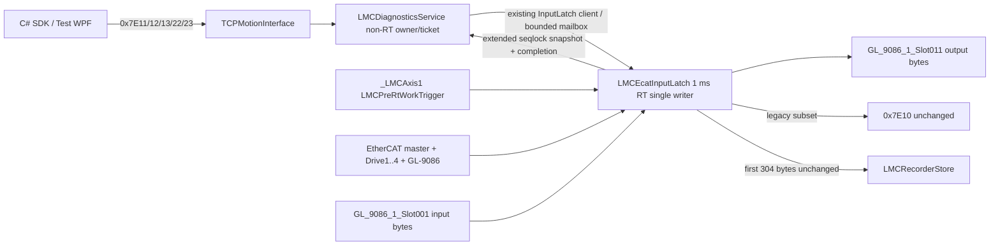

# LMC EtherCAT Topology 및 Digital I/O API 설계

- 기준일: 2026-07-27
- 최종 source 검토: 2026-07-29
- 대상: `Elmo_EtherCAT_Test_4Axis`의 configured EtherCAT topology, CREVIS GL-9086
  digital I/O, C# SDK와 개발 WPF
- 상태: C# SDK contract/PC test, LASAL `0x7E11/0x7E12` static topology serializer와
  TCP route, 개발 WPF topology/read 및 guarded output-write 화면을 구현함. source에서
  bit 14는 active지만 `0x7E13/0x7E22/0x7E23`과 bit 15~17은 미구현/off이며 SDK
  output allowlist도 empty라 runtime submit은 fail-closed
- 현재 source snapshot: GL-9086 1개와 Elmo drive 4개가 포함된 5-slave 구성
- 증거 경계: 저장소의 LASAL/C# source, generated ENI/network와 local Elmo Maestro API
  Markdown만 사용했다. 외부 Web 자료는 사용하지 않았다.

## 1. 결론

현재 working source의 configured physical order는 다음과 같다.

```text
EtherCAT master
  -> GL_9086_11       physical SlaveIndex 0
  -> Elmo_11          physical SlaveIndex 1 / physical axis 1
  -> Elmo_21          physical SlaveIndex 2 / physical axis 2
  -> Elmo_31          physical SlaveIndex 3 / physical axis 3
  -> Elmo_41          physical SlaveIndex 4 / physical axis 4
```

이 구성에 적용할 API 원칙은 아래 여섯 가지다.

1. slave 순서, Vendor/Product/Revision, PDO index/sub-index, I/O 폭과 module schema는
   **configured topology**다. runtime에서 임의 장치를 발견해 public schema를 바꾸지 않는다.
2. Online, EtherCAT state, AL status, snapshot age와 valid/stale 같은 상태·quality만
   **동적 데이터**다.
3. 기존 `0x7E10 ReadEtherCATHealth`는 4개 Elmo drive subset과 exact 200-byte 응답을
   그대로 유지한다. 기존 entry의 `SlaveIndex=0..3`은 wire 호환을 위한 legacy drive slot이며,
   GL-9086 추가 뒤의 physical EtherCAT SlaveIndex로 재해석하지 않는다.
4. actual configured node inventory와 physical bus `MasterSlaveIndex`는 신규 `0x7E11/0x7E12`, node별
   상태는 `0x7E13`, digital I/O snapshot은 `0x7E22`에서 분리한다.
5. output write는 `0x7E23` ticket과 하나의 PLC RT owner를 통해서만 실행한다. whole-word와
   atomic masked write를 지원하되 PC read-modify-write와 channel 직접 쓰기는 허용하지 않는다.
6. 현재 source는 static topology용 bit 14만 active다. `0x7E00`은 BootId가 0이면
   `CapabilityBits=0x00004007`, nonzero이면 `0x0000613F`를 반환한다. node health,
   digital I/O read/write용 bit 15~17은 0이다.

현재 static topology 계약은 `TopologyRevision=0x15867EEC`, 7 entries(5 slaves + 2 slot
modules), `MaxEntriesPerChunk=1`이다. C# `GetEtherCATTopology()`은 이 광고값을 따라
`0x7E12`를 7회 호출해 전체 topology를 조립한다. `Test2` raw capture에서 bit 14,
`0x7E11` 1회와 `0x7E12` 7회의 exact 7-entry 응답을 확인했으므로 configured static
inventory wire path는 PASS다.

개발 WPF는 이 configured 응답을 current-session SDK aggregate와 detached evidence snapshot으로
분리한다. detached snapshot은 topology header와 ordered entry의 모든 public semantic field를
canonical text와 SHA-256으로 고정한다. 같은 PLC endpoint의 성공 reload는
`INITIAL/UNCHANGED/CHANGED`와 ordered diff를 표시하고, endpoint 변경은 새 `INITIAL`로 시작한다.
load 실패, disconnect, replaced-session late response는 표시용 current aggregate를 폐기하지만 마지막
성공 baseline/TXT evidence는 교체하지 않는다. TXT는 명시적으로 configured schema only이며 runtime
discovery, physical cable order, live node health/DI/DO 증거가 아니다.

사용자는 current project의 LASAL build PASS를 보고했지만 독립적인 IDE build/download/smoke
로그는 보존되지 않았다. 또한 이 static 증거는 `0x7E13/0x7E22/0x7E23` dynamic node health,
digital I/O read/write 또는 physical I/O correlation PASS를 뜻하지 않는다.

## 2. 확인한 현재 topology

### 2.1 5개 EtherCAT slave

현재 `Network/Eni.xml`과 `EtherCAT_Network.lcn`의 설정은 아래와 같다.

| 순서 | LASAL object | Physical SlaveIndex | PhysAddr | AutoIncAddr | Vendor ID | Product code | Revision | Physical axis |
|---:|---|---:|---:|---:|---:|---:|---:|---:|
| 1 | `GL_9086_11` | 0 | 1001 | 0 | 669 | 1196200070 | 65536 | 0 |
| 2 | `Elmo_11` | 1 | 1002 | -1 | 154 | 198948 | 66592 | 1 |
| 3 | `Elmo_21` | 2 | 1003 | -2 | 154 | 198948 | 66592 | 2 |
| 4 | `Elmo_31` | 3 | 1004 | -3 | 154 | 198948 | 66592 | 3 |
| 5 | `Elmo_41` | 4 | 1005 | -4 | 154 | 198948 | 66592 | 4 |

근거:

- `Network/Eni.xml`: GL-9086은 line 163부터, 네 Elmo는 line 819, 2613, 4406,
  6199부터 정의된다.
- `Network/EtherCAT_Network/EtherCAT_Network.lcn`: bus connection은 line
  1897~1903에 있다.
- `Network/EtherCAT_Network/ONE_EtherCAT_Network_Table.st`: GL-9086
  `SlaveIndex=0`은 line 479, Elmo `SlaveIndex=1..4`는 line 434, 440, 446, 452다.
- `Class/GL_9086_1/GL_9086_1.st`: Vendor/Product 검사는 line 6~7, 270~271이다.
- `Class/Elmo_1/Elmo_1.st`: Vendor/Product 검사는 line 6~7, 659~660이다.

`SlaveIndex`는 compile/configuration init value다. `ECAT_Slave_Base`는 이 값을
`ECAT_M_LOGIN_SLAVE`에 전달하고, ENI의 identity를 받은 뒤 derived class의
Vendor/Product 검사와 대조한다. 실제 배선 순서가 위 configured order와 다르면 API가
동적으로 순서를 보정하는 구조가 아니다.

### 2.2 CREVIS slot과 PDO schema

GL-9086 아래 configured module은 두 개다.

| Slot | Module | ModuleIdent | 방향 | PDO object | 폭 |
|---:|---|---:|---|---|---:|
| 0 | `GT-12FA` | 1196692218 | Input | `0x6000:01..04` | 4 bytes |
| 1 | `GT-22BA` | 1196696250 | Output | `0x7010:01..04` | 4 bytes |

근거:

- `Class/GL_9086_1/GL_9086_1.st` line 122~131
- `Class/GL_9086_1_Slot00/GL_9086_1_Slot00.st` line 8~15, 174~208
- `Class/GL_9086_1_Slot01/GL_9086_1_Slot01.st` line 8~15, 290~324

현재 ENI process image에서 CREVIS input/output 네 byte는 bit offset
`696, 704, 712, 720`에 있고 첫 Elmo는 bit 728부터 시작한다. HEAD의 첫 Elmo는 bit
592부터였으므로 물리 node 추가 뒤 raw offset이 단순 4-byte 증가한 것이 아니다.
application source가 이 offset을 직접 사용해서는 안 된다.

`ECAT_Slave_Base.AddPDOEntry`는 index/sub-index를 등록하고 runtime init에서
`OS_ECATM_IOVAR_GETBYPDO(SlaveIndex, Index, SubIndex)`로 generated ENI mapping을
조회한다. 따라서 다음 두 문장은 동시에 참이다.

- PDO/schema와 ENI process-image layout은 configured topology에 고정된다.
- application class는 generated raw bit offset을 하드코딩하지 않고 ENI mapping handle을
  runtime에 해석한다.

물리 순서, module 또는 PDO selection을 바꿀 때는 LASAL hardware/network configuration과
ENI를 다시 생성해야 한다. runtime discovery만으로 schema가 변하지 않는다.

### 2.3 axis mapping은 유지

`Motion_Network.lcn` line 4747~4790은 `_LMCAxis1..4`와 `Elmo_11..41`의 연결을
그대로 유지한다. `LMCSdoExecutor1..4`도 Elmo object name에 연결돼 있다. 따라서 GL-9086을
physical SlaveIndex 0에 삽입해도 public axis 1..4를 2..5로 바꾸지 않는다.

현재 source 검색에서 `GL_9086_1_Slot001.InputS_Byte0..3`과
`GL_9086_1_Slot011.OutputS_Byte0..3`을 사용하는 RT application logic은 확인되지 않았다.
public API에는 7-entry static topology를 반환하는 `0x7E11/0x7E12`까지만 연결됐고,
node health/digital I/O data source와 RT ownership은 아직 없다.

## 3. 고정 schema와 동적 상태의 경계

| 항목 | 분류 | 변경 조건 | API 규칙 |
|---|---|---|---|
| configured slave count/order | 고정 | LASAL network/ENI 재생성 | topology revision에 포함 |
| physical SlaveIndex | 고정 | slave 순서 변경 | topology entry에서만 노출 |
| Vendor/Product/Revision | 고정 기대값 | device/class 변경 | runtime actual identity와 대조 |
| PDO index/sub-index와 bit width | 고정 | ESI/module/PDO 설정 변경 | raw mapping은 internal; public entry는 module identity와 byte width로 표현 |
| process-image raw bit offset | generated 고정값 | ENI 재생성 | public API에 노출하거나 저장하지 않음 |
| physical axis mapping | 고정 application mapping | Motion Network 변경 | topology entry의 `PhysicalAxis`로 노출 |
| Online/EtherCAT state/AL status | 동적 | 매 RT snapshot | node-health quality와 함께 반환 |
| digital input value | 동적 | 매 input latch | valid mask, capture cycle과 함께 반환 |
| output shadow value | 동적 PLC-owned state | RT output owner가 변경 | physical feedback으로 표현하지 않음 |
| snapshot valid/fresh/stale | 동적 quality | source와 cycle age | value와 분리하지 않고 함께 반환 |

신규 API는 nonzero `TopologyRevision`을 사용한다. v1 값은 아래 ordered public topology
entry 96-byte 전체의 deterministic CRC32다.

- opaque `NodeId`, `ParentNodeId`, canonical topology index와 `MasterSlaveIndex`
- node kind/flags, SDO/physical-axis/slot reference
- Vendor/Product/Revision/Serial과 configured slot module identity
- public input/output byte width, ASCII name와 `IOReference`

`PhysAddr/AutoIncAddr`, raw process-image offset와 PDO index/sub-index는 v1 public entry에
노출하지 않고 CRC에도 별도 field로 넣지 않는다. 이 값들은 generated ENI와 LASAL mapping의
build/static 증거로 검증한다. 즉 `TopologyRevision`은 ENI 파일 전체 hash가 아니라 public API
topology identity다.

`TopologyRevision`은 기존 24-entry signal catalog의 `MapRevision=0x957F101E`와 다른
identity다. 둘을 같은 값으로 가정하지 않는다. topology 또는 I/O schema가 바뀌면 old
topology object와 pending output ticket은 stale로 거부한다.

## 4. legacy `0x7E10` 호환 정책

현재 `0x7E10 ReadEtherCATHealth`는 다음 계약으로 고정돼 있다.

- exact request payload: 8 bytes
- exact success response payload: 200 bytes
- `SlaveCount=4`, entry stride 32
- entry `SlaveIndex=0..3`, `PhysicalAxis=1..4`
- data source: `LMCEcatInputLatch.Drive1..4`

LASAL serializer는 `LMCDiagnosticsService.st` line 1362~1406에서 네 entry를 만들고,
C# parser는 `LmcDiagnosticsD1Protocol.cs` line 336~352에서 위 순서를 exact하게 검사한다.

GL-9086 추가 뒤에도 이 field를 physical EtherCAT SlaveIndex로 바꾸지 않는다. 호환
문서에서는 아래처럼 해석한다.

```text
0x7E10 entry.SlaveIndex  = LegacyDriveIndex 0..3
0x7E10 entry.PhysicalAxis = PhysicalAxis 1..4
0x7E11/12 MasterSlaveIndex = actual configured index 0..4
```

따라서 기존 SDK/WPF와 packet golden은 그대로 유지되고, GL-9086 및 actual node inventory는
신규 command만 사용한다. `0x7E10` response count를 5로 늘리거나 첫 entry를 GL-9086으로
바꾸는 것은 호환 파괴다.

## 5. local Elmo API 근거와 차이

Elmo 기준은 저장소의 `output/pdf/maestro_api_md`만 확인했다.

| Local Elmo API | local 문서 근거 | 이 설계에 사용한 의미 | 그대로 복제하지 않는 부분 |
|---|---|---|---|
| `MMC_GetEthercatCommStatistics` | `chunks/063_p1590-p1612_21.7.9-MMC_GetCommStatistics.md` line 139~303 | slave ID 선택, SII Vendor/Product/Revision/Serial, master/slave state와 diagnostic state가 분리됨 | API shape와 최대 76개 배열을 복제하지 않음 |
| `MMC_GetCommDiagnosticsEx` | `chunks/062_p1552-p1589_Chapter-21-EtherCAT-Drive-Communication.md` line 272~308 | primary/redundancy slave count와 network/link state가 동적 diagnostics임 | SIGMATEK project는 현재 redundancy graph를 제공하지 않음 |
| `MMC_ECATIOReadDigitalInput` | 같은 chunk line 737~820 | 한 호출에서 최대 64-bit digital input word를 읽음 | current v1은 configured slot `IOReference`, direction/width와 quality를 추가함 |
| `MMC_ECATIOWriteDigitalOutput` | 같은 chunk line 992~1069 | 한 호출에서 최대 64-bit digital output word를 씀 | masked write, ticket/RT owner와 fail-closed policy는 LASAL-local 확장 |

local 문서에서 EtherCAT physical topology graph를 반환하는 public API는 확인하지 못했다.
따라서 `0x7E11/0x7E12`는 Elmo packet 또는 ABI parity 주장이 아니라 configured LASAL
topology를 안전하게 공개하기 위한 project-local extension이다.

`MMC_NetworkInfoCmd`의 detailed node list는 CANbus 근거이므로 이 EtherCAT 설계의
증거로 사용하지 않는다.

## 6. command와 capability 예약

### 6.1 제안 command ID

| Command | ID | 목적 | 현재 상태 |
|---|:---:|---|---|
| `GetEtherCATTopologyInfo` | `0x7E11` | topology revision, count와 entry stride 조회 | SDK와 LASAL static handler/TCP route 구현, bit 14 active; 사용자 LASAL build PASS 보고와 `Test2` static wire PASS |
| `GetEtherCATTopologyChunk` | `0x7E12` | configured node entry chunk 조회 | SDK와 LASAL static handler/TCP route 구현, bit 14 active; `Test2` exact 7-entry static wire PASS |
| `ReadEtherCATNodeHealth` | `0x7E13` | actual node 하나의 동적 state/quality 조회 | SDK contract만 구현, LASAL handler/data source 미구현, bit 15 off |
| `ReadDigitalIO` | `0x7E22` | I/O reference 하나의 input 또는 output-shadow 조회 | SDK contract만 구현, LASAL handler/data source 미구현, bit 16 off |
| `SubmitDigitalOutputWrite` | `0x7E23` | atomic masked/whole-word output write ticket 제출 | SDK contract만 구현, PLC RT owner/handler 미구현, bit 17 off |

`0x7E10`, `0x7E20`, reserved `0x7E21`과 충돌하지 않는다. `0x7E23`은 general PI Write
`0x7E21`을 활성화하는 것이 아니며, configured digital-output `IOReference`와 mask만 허용하는 별도
고정 schema다.

### 6.2 제안 capability bit

| Bit | 이름 | 의존성 | 현재 값 |
|---:|---|---|---:|
| 14 | `EtherCATTopology` | `0x7E11/12` handler와 nonzero topology revision | 1(source) |
| 15 | `EtherCATNodeHealth` | bit 14와 RT state/quality snapshot | 0 |
| 16 | `DigitalIORead` | bit 14, configured I/O schema와 RT snapshot | 0 |
| 17 | `DigitalIOWrite` | bit 14~16, nonzero BootId, RT owner와 write policy | 0 |

의존 capability가 없으면 SDK가 command를 송신하기 전에 fail-closed한다.
`TopologyRevision=0`은 revision-bearing read/write를 거부하고, nonzero `DiagnosticsBootId`는
stateful `0x7E23`에만 필수다. 현재 `0x7E11/0x7E12`는
`TopologyRevision=0x15867EEC`의 static source를 반환한다. BootId 0 경로의 capability는
`0x00004007`, nonzero 경로는 `0x0000613F`이며 둘 다 bit 14를 포함한다.
protocol/API read 계약과 별개로 internal dormant qualification 도구는 17개 raw read가 같은 PLC
실행 identity에 속했다는 증거를 만들기 위해 시작/종료 시 동일한 nonzero `DiagnosticsBootId`를
추가로 요구한다. 이는 bit 14 또는 production read API의 일반 전제조건이 아니다.

`0x7E13/0x7E22/0x7E23`은 LASAL handler와 data source가 없고 bit 15~17도 0이다. 특히
`0x7E13/0x7E22`를 구현하려면 LASAL IDE에서 기존 `LMCEcatInputLatch`에 CREVIS coupler와
input/output slot client channels, 네 output observation 변수와
`CopyTopologyIoSnapshot`/`AdvanceOutputRevision` method declaration을 먼저 추가해야 한다.
이 IDE 구조 단계에서는 method body를 비워 두며 live snapshot/output owner 구현은 다음
checkpoint에서 외부 편집한다.

## 7. wire schema v1

모든 값은 little-endian이다. 기존 outer 8-byte header와 diagnostics common request/response를
재사용한다. outer header Reference `[6]`은 0이어야 한다.

```text
Common request payload, 8 bytes
P0  U16 SchemaVersion = 1
P2  U16 RequestFlags = 0
P4  U32 RequestId, nonzero

Common response payload, 16 bytes
P0  U16 SchemaVersion = 1
P2  U16 ResponseFlags
P4  U16 CommandStatus
P6  I16 ErrorId
P8  U32 RequestId echo
P12 U32 DetailCode
```

### 7.1 `0x7E11 GetEtherCATTopologyInfo`

Request는 exact 8 bytes, success response는 exact 44 bytes다.

| Offset | Type | Field | v1 규칙 |
|---:|---|---|---|
| P16 | U32 | `TopologyRevision` | canonical entry byte 전체의 nonzero CRC32 |
| P20 | U16 | `TotalNodeCount` | slave와 공개 slot module을 합한 수 |
| P22 | U16 | `EntryStride` | 96 |
| P24 | U16 | `MaxEntriesPerChunk` | 1..16 |
| P26 | U16 | `ConfiguredSlaveCount` | current source=5 |
| P28 | U16 | `SlotModuleCount` | current source=2 |
| P30 | U16 | `PhysicalAxisCount` | current source=4 |
| P32 | U32 | `TopologyFlags` | fixed stride, ASCII name, canonical CRC, opaque NodeId |
| P36 | U32 | `CrcKind` | `Crc32IsoHdlc` |
| P40 | U32 | reserved | 0 |

`TopologyRevision`은 기존 signal `MapRevision`과 별개다. CRC 결과가 0이면 wire identity는
`0xFFFFFFFF`를 사용한다.

### 7.2 `0x7E12 GetEtherCATTopologyChunk`

Request는 exact 16 bytes다.

| Offset | Type | Field |
|---:|---|---|
| P8 | U32 | `ExpectedTopologyRevision` |
| P12 | U16 | `StartIndex` |
| P14 | U16 | `MaxEntries`, 1..16 |

Success response는 `28 + 96*N` bytes, 최대 1,564 bytes다.

| Offset | Type | Field |
|---:|---|---|
| P16 | U32 | `TopologyRevision` |
| P20 | U16 | `StartIndex` echo |
| P22 | U16 | `ReturnedCount` |
| P24 | U16 | `TotalNodeCount` |
| P26 | U16 | `EntryStride=96` |
| P28 | bytes | node entries |

`ReturnedCount`는 `min(requested MaxEntries, TotalNodeCount-StartIndex)`와 정확히 같아야 하고,
`LastChunk` response flag는 마지막 range에만 존재한다.

Node entry v1:

| Entry offset | Type | Field | 규칙 |
|---:|---|---|---|
| E0 | U32 | `NodeId` | nonzero opaque ID; physical index로 추정하지 않음 |
| E4 | U32 | `ParentNodeId` | EtherCAT slave=0, slot module=부모 coupler ID |
| E8 | U16 | `TopologyIndex` | canonical ordered index |
| E10 | U16 | `MasterSlaveIndex` | slave=0..4, slot module=`0xFFFF` |
| E12 | U8 | `NodeKind` | 1=`EtherCATSlave`, 2=`SlotModule` |
| E13 | U8 | reserved | 0 |
| E14 | U16 | `NodeFlags` | slave-index, SDO, axis, input/output, DS402, coupler, digital-I/O flags |
| E16 | U16 | `SdoSlaveReference` | 미지원=0 |
| E18 | U16 | `PhysicalAxisReference` | non-axis=0, Elmo=1..4 |
| E20 | U16 | `SlotIndex` | slave=`0xFFFF`, slot module=0..N |
| E22 | U16 | reserved | 0 |
| E24 | U32 | `VendorId` | configured expected identity, nonzero |
| E28 | U32 | `ProductCode` | configured expected identity/module, nonzero |
| E32 | U32 | `RevisionNumber` | configured expected identity |
| E36 | U32 | `SerialNumber` | configured expected identity |
| E40 | U16 | `InputBytes` | 공개 input 폭, 없으면 0 |
| E42 | U16 | `OutputBytes` | 공개 output 폭, 없으면 0 |
| E44 | byte[48] | `Name` | NUL-terminated 7-bit ASCII, 남는 byte 0 |
| E92 | U32 | `IOReference` | public digital I/O가 없으면 0 |

slave와 slot module을 별도 entry로 둬 GL-9086 아래 GT-12FA/GT-22BA의 방향과 폭을 정확히
표현한다. v1의 general digital I/O API는 이 allowlist 대상만 사용하며, Elmo drive internal
PDO를 unrestricted drive output API로 확장하지 않는다.

완성 topology parser는 slave `MasterSlaveIndex`가 나타나는 순서대로 `0..N-1`인지,
`PhysicalAxisReference`, `SdoSlaveReference`, `IOReference`가 각 domain에서 중복되지 않는지,
같은 부모 아래 `SlotIndex`가 중복되지 않는지 검사한다. nonzero `IOReference` entry는 input 또는
output byte가 하나 이상 있어야 하고 방향별 최대 8 bytes다. 하나의 `IOReference`가 양방향을
가리키는 경우 `ExpectedDirection`으로 방향을 선택하고 해당 `InputBytes`/`OutputBytes * 8`을
expected bit width로 사용한다.

### 7.3 `0x7E13 ReadEtherCATNodeHealth`

Request는 exact 16 bytes다.

| Offset | Type | Field |
|---:|---|---|
| P8 | U32 | `TopologyRevision` |
| P12 | U32 | `NodeId` |

Success response는 exact 72 bytes다.

| Offset | Type | Field | 의미 |
|---:|---|---|---|
| P16 | U32 | `TopologyRevision` | request와 exact match |
| P20 | U32 | `NodeId` | request와 exact match |
| P24 | U16 | `CapturePhase` | `InputMapped(1)` |
| P26 | U16 | `HealthFlags` | configured/detected/identity/data/DS402 구분 |
| P28 | U32 | `CycleCounter` | coherent RT snapshot cycle |
| P32 | U64 | `TimestampMicroseconds` | snapshot timestamp |
| P40 | U32 | `SnapshotSequence` | nonzero even coherent publish sequence |
| P44 | U8 | `Online` | 0 또는 1 |
| P45 | U8 | `EtherCATState` | raw configured node state |
| P46 | U16 | `ALStatusCode` | raw AL status |
| P48 | U32 | `SlaveState` | LASAL slave state |
| P52 | U32 | `ClassState` | LASAL object/class state |
| P56 | U32 | `DS402StatusWord` | drive만 의미 있음 |
| P60 | U32 | `AxisError` | drive만 의미 있음 |
| P64 | U32 | `LastValidCycle` | 마지막 data-valid cycle |
| P68 | U32 | `LastStateChangeCycle` | 마지막 상태 변경 cycle |

`HealthFlags` bit 0..5는 각각 `Configured`, `Detected`, `IdentityMatched`, `DataValid`,
`DataDefaulted`, `DS402DataPresent`다. `Configured`는 항상 있어야 하고 `Online == Detected`,
detected node는 nonzero EtherCAT state를 가져야 한다. offline node의 state는 0이다.
`DataValid`와 `DataDefaulted` 중 정확히 하나만 존재한다. valid data는 detected/identity match를
요구한다. 노드 offline, identity mismatch, 기본값 대체와 실제 유효 데이터를 별개로 표현한다.
`DS402DataPresent`는 Elmo drive의 `DataValid` 상태에서만 켜며, 그 외에는 response의
DS402StatusWord와 AxisError를 0으로 정규화한다.
RT source 자체가 없으면 가짜 정상/0 data를 만들지 않고 기존 `NotReady` 또는 신규 I/O
reference/domain error로 거부한다.

여기서 wire `Online`은 native `ECAT_Slave_Base.Online`을 그대로 복사하는 필드가 아니다.
vendor `Online` server는 `EtherCATState=OP`이고 `ClassState=_ClassOk`일 때만 1이므로 PREOP/SAFEOP
중에도 존재하는 slave를 offline으로 오판한다. wire `Detected/Online`은 `_NoHardware`가 아닌
physical-present 상태에서 1로 유도하고, `_NoHardware`이면 vendor가 `EtherCATState=INIT`를 남겨도
wire state를 0으로 정규화한다. native `Online`은 `DataValid`/operational 판정에만 사용한다.
`IdentityMatched`는 configured ENI Vendor/Product 값을 live readback으로 오인하지 않고
source client 연결, `ClassState=_ClassOk`와 `SlaveState`의 `0x0020` identity-error bit가 0인지를
보수적으로 대조한다. source client가 끊겼거나 master가 OP가 아니거나
`MissedFrameCounter<>0`이면 node health도 `DataValid`가 아니라 `DataDefaulted`다.
extended snapshot은 source client가 끊긴 record의 `ClassState`를 `0xFFFFFFFF`로 기록한다.
`0x7E13`은 이 sentinel과 `_NoHardware`를 모두 undetected로 처리하고 wire Online/state를 0으로
정규화한다.
master `MissedFrameCounter`가 nonzero이면 PDO server가 직전 값을 유지할 수 있으므로 I/O는
`StaleFrame`/`DataDefaulted`, `ValidMask=0`, response `Value=0`으로 내보낸다. output read는 PLC
software shadow 확인이며 실제 단자 전압 feedback이 아니다.

### 7.4 `0x7E22 ReadDigitalIO`

Request는 exact 20 bytes다. input과 output shadow는 각각 별도 `IOReference`로 읽는다.

| Offset | Type | Field |
|---:|---|---|
| P8 | U32 | `TopologyRevision` |
| P12 | U32 | `IOReference` |
| P16 | U8 | `ExpectedDirection` | 1=input, 2=output |
| P17 | U8 | `ExpectedBitWidth` | 1..64, current CREVIS=32 |
| P18 | U16 | reserved | 0 |

Success response는 exact 56 bytes다.

| Offset | Type | Field | 규칙 |
|---:|---|---|---|
| P16 | U32 | `TopologyRevision` | request와 exact match |
| P20 | U32 | `IOReference` | request와 exact match |
| P24 | U32 | `NodeId` | owning topology node |
| P28 | U8 | `Direction` | request와 exact match |
| P29 | U8 | `BitWidth` | request와 exact match |
| P30 | U16 | `StatusFlags` | 아래 quality flags |
| P32 | U64 | `Value` | Byte0가 least-significant byte |
| P40 | U64 | `ValidMask` | bit width 범위의 유효 bit |
| P48 | U32 | `CycleCounter` | RT snapshot cycle |
| P52 | U32 | `OutputRevision` | input=0, output shadow=nonzero CAS revision |

`StatusFlags`는 `Valid`, `StaleFrame`, `MasterNotOperational`, `NodeOffline`,
`NodeNotOperational`, `AlError`, `SourceUnavailable`, `IdentityMismatch`, `DataDefaulted`다.
`Valid` snapshot은 다른 fault flag와 결합하지 않고 `ValidMask`가 bit-width 전체 mask여야 한다.
invalid snapshot은 nonzero fault status와 `ValidMask=0`을 요구한다. invalid/defaulted 값은
quality 없이 실제 측정값으로 취급하지 않는다.

### 7.5 `0x7E23 SubmitDigitalOutputWrite`

Request는 exact 40 bytes다.

| Offset | Type | Field | 규칙 |
|---:|---|---|---|
| P8 | U32 | `TopologyRevision` | current exact revision |
| P12 | U32 | `IOReference` | compile-time SDK와 PLC allowlist 모두 통과해야 함 |
| P16 | U64 | `Value` | mask 밖 bit는 0인 canonical form |
| P24 | U64 | `Mask` | nonzero; whole-word는 output valid mask 전체 |
| P32 | U32 | `ExpectedOutputRevision` | 직전 output read의 nonzero CAS revision |
| P36 | U32 | `DiagnosticsBootId` | capability의 current nonzero generation |

Success response는 기존 exact 32-byte operation ticket을 재사용하고
`OperationKind=DigitalOutputWrite(4)`를 추가한다. ticket의
`SubmissionTopologyRevision`은 request revision이며 기존 PI/SDO ticket의
`SubmissionMapRevision` 의미는 유지한다. status/cancel은 기존 `0x7E03/0x7E04`를 사용하고,
successful terminal은 `ResultLength=0`이다. 적용된 output shadow와 새 revision은 같은
topology identity에서 `0x7E22`를 다시 읽어 확인한다.

적용 규칙:

```text
Mask != 0
(Mask & ~OutputValidMask) == 0
(Value & ~Mask) == 0
ExpectedOutputRevision == CurrentOutputRevision
NewOutput = (OldOutput & ~Mask) | (Value & Mask)
```

whole-word는 `Mask == OutputValidMask`인 같은 연산이다. OldOutput 확인과 write는 같은 RT
owner의 한 cycle transaction에서 수행한다. PC read-modify-write는 허용하지 않고, stale
revision은 mutation 없이 거부한다. 현재 SDK compile-time output allowlist는 empty이므로
capability가 잘못 켜져도 `0x7E23`을 송신하지 않는다.

### 7.6 신규 detail code

기존 diagnostics detail 0..25 뒤에 아래 code를 SDK catalog에 추가했다. 현재 LASAL
`0x7E12` handler는 topology revision 불일치에 `TopologyRevisionMismatch(26)`을 사용한다.
`0x7E13/0x7E22/0x7E23` handler가 없으므로 code 27~31의 target-side 사용은 아직 없다.

| Code | 이름 | 사용 조건 |
|---:|---|---|
| 26 | `TopologyRevisionMismatch` | expected/current revision 불일치 |
| 27 | `NodeNotFound` | configured `NodeId` 없음 |
| 28 | `IOReferenceNotFound` | configured public `IOReference` 없음/방향 불일치 |
| 29 | `OutputRevisionMismatch` | expected/current output revision 불일치 |
| 30 | `OutputMaskInvalid` | mask/value canonical 또는 valid-mask 위반 |
| 31 | `RTOwnerUnavailable` | mailbox/owner 연결 또는 RT execution 불가 |

길이, reserved, enum 범위 오류는 기존 `BoundsInvalid(12)`, queue 점유는
`ResourceBusy(9)`, write policy 차단은 `WriteDenied(7)` 또는
`UnsafeWriteBlocked(8)`, BootId 불일치는 `BootIdMismatch(25)`, offline은
`SlaveOffline(18)`을 유지한다.

## 8. C# public API 설계

구현한 surface:

```csharp
LMCEtherCATTopologyInfo GetEtherCATTopologyInfo();
Task<LMCEtherCATTopologyInfo> GetEtherCATTopologyInfoAsync(
    CancellationToken token);
LMCEtherCATTopologyChunk GetEtherCATTopologyChunk(
    uint expectedTopologyRevision, ushort startIndex, ushort maxEntries);
Task<LMCEtherCATTopologyChunk> GetEtherCATTopologyChunkAsync(
    uint expectedTopologyRevision,
    ushort startIndex,
    ushort maxEntries,
    CancellationToken token);
LMCEtherCATTopology GetEtherCATTopology();
Task<LMCEtherCATTopology> GetEtherCATTopologyAsync(CancellationToken token);

LMCEtherCATNodeHealth ReadEtherCATNodeHealth(
    uint topologyRevision, uint nodeId);
Task<LMCEtherCATNodeHealth> ReadEtherCATNodeHealthAsync(
    uint topologyRevision,
    uint nodeId,
    CancellationToken token);

LMCEtherCATNodeHealth ReadEtherCATNodeHealth(
    uint nodeId,
    LMCEtherCATTopology topology);
Task<LMCEtherCATNodeHealth> ReadEtherCATNodeHealthAsync(
    uint nodeId,
    LMCEtherCATTopology topology,
    CancellationToken token);

LMCDigitalIOValue ReadDigitalIO(LMCDigitalIOReadRequest request);
Task<LMCDigitalIOValue> ReadDigitalIOAsync(
    LMCDigitalIOReadRequest request,
    CancellationToken token);

LMCDigitalIOValue ReadDigitalIO(
    LMCEtherCATTopology topology,
    LMCDigitalIOReadRequest request);
Task<LMCDigitalIOValue> ReadDigitalIOAsync(
    LMCEtherCATTopology topology,
    LMCDigitalIOReadRequest request,
    CancellationToken token);

LMCDigitalOutputWriteRequest CreateDigitalOutputWriteRequest(
    LMCDigitalIOValue outputSnapshot,
    ulong value,
    ulong mask);

IReadOnlyList<uint> GetApprovedDigitalOutputWriteReferences();
LMCOperationTicket SubmitDigitalOutputWrite(
    LMCDigitalOutputWriteRequest request);
Task<LMCOperationTicket> SubmitDigitalOutputWriteAsync(
    LMCDigitalOutputWriteRequest request,
    CancellationToken token);
```

모델 규칙:

- topology와 node entry는 immutable snapshot이다. `GetEtherCATTopology[Async]`가 반환한
  aggregate는 diagnostics owner와 connection session generation에 bind되며
  `BelongsTo`/`BelongsToCurrentSession`으로 확인한다. topology-bound Health/Digital I/O는
  unbound, foreign, reconnect-stale aggregate를 capability/read RPC 전에 거부하고 검증한
  topology session generation을 실제 exchange까지 유지한다. raw overload와 로컬 validator는
  observation-only 호환 경로다.
- `NodeId`, `IOReference`, `PhysicalAxisReference`, `MasterSlaveIndex`는 서로 다른 identity다.
  `MasterSlaveIndex=0`은 정상 첫 slave이며 absent sentinel은 `0xFFFF`다.
- topology/node/value model은 `TopologyRevision`을 보존한다. facade가 반환한 digital I/O
  value는 diagnostics owner, connection session generation, source capability bits와
  `DiagnosticsBootId`도 고정한다. raw overload 결과는 observation-only이며 topology-bound
  overload만 NodeId/IOReference/direction/width 검증 뒤 `HasValidatedTopologyBinding=true`를
  보존한다. parser-only value는 detached protocol artifact다.
- topology revision은 모든 요청에 명시하고 PLC가 current revision과 대조한다. 현재 SDK는
  nonzero/canonical shape를 검사하고 `0x7E12` LASAL handler는 stale revision을 code 26으로
  거부한다. `0x7E13/0x7E22/0x7E23`의 같은 검사는 해당 PLC handler 구현 뒤 적용된다.
- input/output value와 valid mask는 `ulong`을 사용한다. current 32-bit module도 64-bit
  contract의 low bits만 사용한다.
- 실행 가능한 output write request는 `CreateDigitalOutputWriteRequest`로 현재 session의
  topology-bound valid Output snapshot에서만 만든다. raw read snapshot은 write-authorizing
  provenance가 없으므로 wire 전에 거부한다. request는 `Value`, nonzero `Mask`, 직전 read의 nonzero
  `ExpectedOutputRevision`과 immutable source snapshot provenance를 함께 보존한다. wire golden용
  public raw constructor는 호환을 위해 유지하지만 detached request라 실제 submit은 거부한다.
- capability dependency, zero identity, zero mask, mask 밖 value, zero output revision과 empty
  output allowlist, foreign/stale session, source/fresh BootId 불일치는 SDK가 command 송신 전에
  거부한다. advertised topology에 없는 node/I/O,
  out-of-range writable mask, stale topology/output revision/BootId와 runtime quality는
  `0x7E13/0x7E22/0x7E23` PLC handler가 구현될 때 다시 검사한다.
- `0x7E10`의 기존 `LMCEtherCATSlaveHealth.SlaveIndex` public shape는 호환을 위해 유지하되
  문서에는 `LegacyDriveIndex` 의미를 명시한다. actual physical index는 새 topology model만
  사용한다.

## 9. RT ownership과 fail-closed write

제안 runtime 구조는 다음과 같다.



별도 RT service를 새로 만들지 않고 기존 `LMCEcatInputLatch`를 통합 RT owner로 확장한다.
이 class는 이미 `RealtimeTask=true`, `_LMCAxis1.LMCPreRtWorkTrigger`, atomic seqlock,
`SnapshotBytes[0..511]`, master와 Drive1..4 client를 가진다. 현재 공개/recorder 범위는
0..303뿐이므로 304..463에 CREVIS 상태를 추가해 기존 304-byte ABI를 보존한다.
책임은 아래로 제한한다.

- CREVIS input byte와 output shadow를 매 RT cycle에 한 번 읽는다.
- 기존 `PublishSequence`로 legacy 304 bytes와 extended 464 bytes를 함께 coherent publish한다.
- output request mailbox를 cycle당 최대 한 건 소비하고 expected/current output revision을
  비교한다.
- whole/masked 계산과 네 output byte write를 같은 owner context에서 수행한다.
- applied/failed completion token을 non-RT service에 게시한다.
- topology revision, BootId, ticket token과 owner session이 일치하지 않으면 적용하지 않는다.
- recorder에는 계속 `SnapshotSize:=304`만 넘겨 recorder sample ABI를 바꾸지 않는다.

### 9.1 다음 LASAL IDE 구조 작업

`0x7E13/0x7E22` 구현을 계속하려면 사용자가 LASAL IDE에서 아래 선언과 연결을 먼저
생성한다. generated `.lcb`, `.lcn`, `ONE_*_Table.st`, channel header와 `.lcp` 등록은 외부
편집기로 합성하지 않는다. 실제 IDE 입력 순서는
`LMC_ETHERCAT_T2_IDE_STRUCTURE_HANDOFF_2026-07-28.md`를 따른다.

기존 `LMCEcatInputLatch` class에 아래 required client를 추가한다. 기존 `EcatMaster`,
`Drive1..4`, `RecorderStore`, `PublishSequence`, `SnapshotBytes[0..511]`, `RtWork`와
`CopySnapshot`은 유지한다. IDE 저장 직후 `IdeStructureReady`로 generated 구조만 검증한 다음
`IntegratedReadOwnerDormant` 구현을 진행하고 bit 15/16은 계속 0으로 둔다. raw command live 검증 뒤 두 read capability를 켜고
`IntegratedReadOwner`로 전환한 다음 `IntegratedOutputOwnerDormant` mailbox 구조를 추가한다.

- read checkpoint required client: `Coupler : CltChCmd_GL_9086_1`
- read checkpoint required client: `InputSlot : CltChCmd_GL_9086_1_Slot00`
- read checkpoint required client: `OutputSlot : CltChCmd_GL_9086_1_Slot01`
- read checkpoint variable: `OutputRevision : UDINT`
- read checkpoint variable: `OutputObserved : BOOL`
- read checkpoint variable: `OutputPreviousValid : BOOL`
- read checkpoint variable: `OutputPreviousValue : UDINT`
- read checkpoint method: `CopyTopologyIoSnapshot(pDest:^Void, DestSize:UDINT) : Result:DINT`
- read checkpoint method: `AdvanceOutputRevision() : Revision:UDINT`
- dormant output variable: `OutputMailboxState : UDINT`
- dormant output variable: `OutputRequestBytes : ARRAY[0..47] OF USINT`
- dormant output variable: `OutputCompletionSequence : UDINT`
- dormant output variable: `OutputCompletionBytes : ARRAY[0..31] OF USINT`
- dormant output implementation constants: `LMC_ECAT_IO_TOPOLOGY_REVISION=0x15867EEC`,
  `LMC_ECAT_IO_OUTPUT_REFERENCE=0x00010002`, `LMC_ECAT_IO_OUTPUT_VALID_MASK=0xFFFFFFFF`
- dormant output method: `TryQueueOutputWrite(OperationToken:UDINT, TopologyRevision:UDINT,
  DiagnosticsBootId:UDINT, OwnerSessionEpoch:UDINT, IOReference:UDINT, ValueLow:UDINT,
  ValueHigh:UDINT, MaskLow:UDINT, MaskHigh:UDINT, ExpectedOutputRevision:UDINT) :
  ret_code:iprStates`
- dormant output method: `CopyOutputCompletion(ExpectedToken:UDINT, pDest:^Void, DestSize:UDINT) :
  Result:DINT`
- dormant output method: `CancelQueuedOutput(ExpectedToken:UDINT) : Result:DINT`
- dormant output method: `IsOutputReusable() : Ready:BOOL`

위 method ABI와 implementation local 폭도 계약이다. token/revision/value/mask, atomic state와 모든
seqlock sequence는 `UDINT`, result는 `DINT`, status/health flag는 `UINT`, connection/quality/claim
flag는 `BOOL`, `TryQueueOutputWrite` 결과는 `iprStates`를 사용한다. 특히 I/O status를 `USINT`로
줄이면 `DataDefaulted=0x0100`이 사라지고, token/sequence를 `UINT`로 줄이면 exact-token CAS와
seqlock wrap 검사가 깨지므로 허용하지 않는다.

single mailbox state는 아래 값과 publish 순서를 사용한다.

| State | 값 | 소유자/의미 |
|---|---:|---|
| `IDLE` | 0 | 새 request를 받을 수 있음 |
| `WRITING_REQUEST` | 1 | non-RT producer가 request payload 작성 중 |
| `READY` | 2 | 완성된 request가 RT claim 대기 중 |
| `RUNNING` | 3 | RT owner가 CAS claim 후 payload를 읽고 검증/apply 중 |
| `WRITING_COMPLETION` | 4 | RT owner가 completion seqlock publish 중 |
| `COMPLETION_READY` | 5 | non-RT consumer가 exact token completion을 회수할 수 있음 |

producer는 `IDLE -> WRITING_REQUEST` CAS 성공 뒤 48 bytes를 전부 쓰고 atomic set으로만
`READY`를 publish한다. `TryQueueOutputWrite`는 시작 시 `ERROR`를 기본 반환하고 이 publish가
끝난 뒤에만 `READY`를 반환한다. RT는 `READY -> RUNNING` CAS 성공 뒤에만 request를 읽는다. 성공/실패
모두 exact token completion을 남긴다. RT는 `RUNNING -> WRITING_COMPLETION` CAS 성공 뒤
completion 32 bytes 전체를 nonzero odd/even `OutputCompletionSequence` 사이에 작성하고
`COMPLETION_READY`를 publish한다. sequence wrap 결과 0은 건너뛰며 completion의 high/reserved
두 word는 0이다. consumer는 같은 nonzero even sequence의 32 bytes와 token을 확인하고
`COMPLETION_READY -> IDLE` CAS가 성공한 경우에만 consume 성공을 반환한다.
`CopyOutputCompletion`과 `CancelQueuedOutput`은 시작 시 `Result=-2`를 기본값으로 두고 exact
state/token/sequence/CAS가 모두 성공한 마지막 지점에서만 `Result=0`을 반환한다.
queued cancel은 exact token을 확인한 뒤 `READY -> WRITING_REQUEST` CAS 반환값도 반드시
`READY`인지 확인하고 나서만 `IDLE`로 반환한다. RT가 먼저 `READY -> RUNNING`을 claim한 경우
cancel은 실패를 반환하며 mailbox를 덮어쓰지 않는다. completion이 회수되기 전에는 다음 request를
받지 않고, 실패 request도 자동 재시도하거나 버리지 않는다.
RT claim 뒤에는 48 bytes의 token, topology revision, BootId, owner session epoch, IOReference,
value/mask low-high, expected output revision과 두 reserved word를 모두 local로 복사해 다시 검증한다.
topology/IO identity 불일치, zero BootId/owner, nonzero high/reserved, invalid current output quality와
stale revision에서는 네 output byte를 쓰지 않고 failure completion을 게시한다.
RT cycle은 `outputRequestClaimed=FALSE`로 시작한다. current-cycle source/quality/output observation을
모두 만든 뒤 READY CAS를 시도하고, claim branch 안에서만 request validation과 physical apply를
수행한다. 이 branch를 닫은 뒤 request 유무와 무관하게 464-byte snapshot과 final even
`PublishSequence`를 매 cycle 게시한다. canonical tail은 `final even -> RecorderStore 304-byte append
-> state:=READY -> if outputRequestClaimed completion publish` 순서다. 따라서 mailbox가 비어 있는
cycle에도 snapshot seqlock은 반드시 닫히고, completion CAS mismatch가 기존 RT tail을 건너뛰지 않는다.

request payload layout은 `Token, TopologyRevision, BootId, OwnerSessionEpoch, IOReference,
ValueLow, ValueHigh, MaskLow, MaskHigh, ExpectedOutputRevision, Reserved0, Reserved1`의 12개
`UDINT`다. completion은 `Token, Result, DetailCode, AppliedCycle, OutputRevision,
OutputValueLow, OutputValueHigh=0, Reserved=0`의 8개 32-bit word이며 `Result`만 `DINT`, 나머지는
`UDINT`다.

64-bit wire 값은 C78 호환을 위해 low/high `UDINT` 두 개로 전달한다. `CopySnapshot`은 기존
304-byte copy contract를 그대로 유지하고 새 `CopyTopologyIoSnapshot`만 exact 464 bytes를
복사한다. `RtWork`는 offset 304..463을 모두 기록한 뒤 기존 even `PublishSequence`를 게시하고,
recorder에 기존 304 bytes만 append한 다음 `state:=READY`를 게시한다. claimed completion branch는
그 뒤에만 실행한다.
각 source client의 `IsClientConnected(...) <> 0` 결과를 cycle당 한 번 local BOOL로 고정하고
그 local connection branch 안에서만 읽는다. disconnected coupler/slot은
어떤 `Read()`도 호출하지 않고 ClassState `0xFFFFFFFF`, raw bus state와 I/O byte 0을 기록한다.
이전 cycle PDO나 class state를 유지해 정상처럼 보이게 하지 않는다. offset 304..460의 모든 field는
odd `PublishSequence` 게시 뒤 정확히 한 번 기록하고 final even sequence 게시 전에 완료한다.
writer는 atomic current+1을 nonzero odd로 보정해 열고, `writeSequence+1`을 zero일 때 2로 건너뛴
even 값으로 offset 44와 atomic sequence에 동일하게 게시한다. odd open부터 even close 사이에는
어떤 `RETURN`도 허용하지 않는다.
`CopyTopologyIoSnapshot`은 copy 전에 even sequence인지, copy 뒤 같은 nonzero even sequence인지
모두 확인한다. 시작 `Result=-1`, invalid pointer/size `Result=-2`, `retryCount=0`에서 최대 3회만
시도하며 매 실패 시 retry를 증가시킨다. 정확히 `pDest <- SnapshotBytes[0..463]` 방향으로 복사하고
세 번 모두 실패하면 성공값을 만들지 않는다.

extended snapshot v1의 내부 offset은 아래로 고정한다. 이 layout은 PLC class 사이의 내부
ABI이며 TCP wire offset과 혼동하지 않는다.

| Offset | Type | Field |
|---:|---|---|
| 304..339 | 36 bytes | GL-9086 coupler health record |
| 340..375 | 36 bytes | GT-12FA input-slot health record |
| 376..411 | 36 bytes | GT-22BA output-slot health record |
| 412 | UDINT | input value low, Byte0 least significant |
| 416 | UDINT | input value high, current=0 |
| 420 | UDINT | input valid-mask low |
| 424 | UDINT | input valid-mask high, current=0 |
| 428 | UINT | input status flags |
| 430 | UINT | reserved, zero |
| 432 | UDINT | input capture cycle |
| 436 | UDINT | output software shadow low, Byte0 least significant |
| 440 | UDINT | output software shadow high, current=0 |
| 444 | UDINT | output valid-mask low |
| 448 | UDINT | output valid-mask high, current=0 |
| 452 | UINT | output status flags |
| 454 | UINT | reserved, zero |
| 456 | UDINT | output capture/apply cycle |
| 460 | UDINT | nonzero output CAS revision |

각 36-byte health record는 기존 Drive1..4 health record와 동일한 내부 모양을 쓴다:
native `Online`, EtherCAT state, SlaveState, AL status, ClassState, DS402 status, AxisError,
LastValidCycle, LastStateChangeCycle 순서다. non-drive의 DS402 status와 AxisError는 0이다.
slot module에는 별도 Online/EtherCAT/Slave/AL channel이 없으므로 해당 네 값은 parent coupler의
raw 상태를 사용하고 ClassState만 각 slot에서 읽는다. `CopyTopologyIoSnapshot`은
`DestSize < 464`를 거부하고 기존 `PublishSequence` 전/후가 같은 nonzero even 값일 때만 464
bytes를 반환한다.

producer RHS도 offset 계약의 일부다. coupler record는 native online, parent EtherCAT/slave/AL,
coupler ClassState, zero DS402/error와 coupler last-valid/change cycle을 순서대로 기록한다. input/output
slot record는 앞 네 parent 값을 공유하되 각자의 slot ClassState와 last-valid/change cycle을 사용한다.
I/O record는 각각 value, zero high half, valid mask, zero high half, status, zero reserved, current cycle을
기록하고 output record 끝에는 `OutputRevision`을 기록한다. health record나 input/output source를 서로
바꾸거나 고정 zero로 채우는 구현은 layout type과 크기가 맞아도 유효하지 않다.
parent coupler source가 끊겼거나 `_NoHardware`/sentinel/nonzero-state 조건을 만족하지 못하면 parent
online/EtherCAT/slave/AL 값을 0으로 정규화한다. slot `Detected`는 slot ClassState만으로 만들지 않고
이 정규화된 parent physical/source presence와 slot client/ClassState를 모두 요구한다. slot
`IdentityMatched`는 여기에 parent coupler ClassState=`_ClassOk`, slot ClassState=`_ClassOk`와 parent
SlaveState identity-error bit clear를 모두 요구한다. 따라서 parent class fault에서 slot health와 I/O
quality가 서로 다르게 정상으로 보이지 않는다.
I/O status는 매 cycle 0에서 시작해 stale `0x0002`, master non-OP `0x0004`, node offline
`0x0008`, node non-OP `0x0010`, AL error `0x0020`, source unavailable `0x0040`, identity mismatch
`0x0080`을 exact 원인에서 조립한다. 오류가 하나라도 있으면 `DataDefaulted=0x0100`, value/mask 0이며,
오류가 없을 때만 `Valid=1`과 full mask다. last-valid cycle은 이 valid 조건에서만 갱신하고,
last-state-change cycle은 해당 health record의 다섯 상태 field가 바뀐 cycle에서만 갱신한다.
parent EtherCAT state가 OP여도 native `Online=0`이면 node non-OP `0x0010`이며 output write에 사용할
수 없다. 반대로 PREOP/SAFEOP physical node는 Detected이지만 DataValid는 아니다.

`OutputRevision`은 owner 초기화 시 1로 시작해 invalid output response에도 항상 nonzero다. 첫
관측 publish는 그 값을 유지한다. 첫 관측 뒤 observed shadow가 owner 밖에서 바뀌거나 output
validity가 invalid/valid 사이에서 전환되면 증가시켜 disconnect 전 snapshot의 CAS가 reconnect 뒤
재사용되지 않게 한다. 성공적으로 apply된 모든 write도 동일 값을 다시 쓴 경우까지 revision을
증가시킨다. 성공 apply block은 네 byte write 직후 같은 cycle에서 `outputValue`와
`OutputPreviousValue`를 `newOutputValue`로, `OutputPreviousValid`를 TRUE로 갱신한 다음 revision을
증가시킨다. 그렇지 않으면 다음 관측 cycle에서 같은 변경을 다시 감지해 revision이 이중 증가할 수
있다. 증가 결과가 0이면 1로 건너뛴다.

기존 `LMCDiagnosticsService.InputLatch` client를 그대로 사용한다. 신규 diagnostics client나
Comm Network 연결은 만들지 않는다. `0x7E13`의 Elmo 1..4 health는 기존 0..303 snapshot,
GL-9086 coupler와 두 slot-module health 및 `0x7E22/0x7E23`은 304..463의 확장 snapshot,
output observation state와 revision method를 사용한다.

같은 class에 private method
`HandleEtherCATTopologyIoRequest(CommandId:UINT, pRequest:^USINT, RequestSize:UDINT,
pResponse:^USINT, ResponseCapacity:UDINT, CallerSessionEpoch:UDINT,
CurrentDiagnosticsBootId:UDINT) : ResponseSize:DINT`를 추가한다. 현재
`LMCDiagnosticsService::HandleRequest`는 UTF-8 기준 32,466 bytes라 32,768-byte gate까지
302 bytes만 남아 있다. 따라서 `0x7E11/0x7E12` 기존 body를 이 helper로 옮기고
`0x7E13/0x7E22/0x7E23`도 helper에 구현한다. top-level `HandleRequest`에 새 case body를
직접 계속 붙이지 않는다.
top-level route는 현재 `CommandId`, request/response pointer와 size/capacity, caller epoch,
`currentBootId`를 그대로 helper에 전달하고 helper `ResponseSize`를 받은 즉시 `RETURN`한다. helper는
`InputLatch` 연결 상태를 case dispatch 전에 한 번 BOOL로 캡처한다. `0x7E13/0x7E22/0x7E23`은
연결이 없으면 detail 11을 만들고 어떤 latch method도 호출하지 않는다. helper 내부의 모든 local
오류는 P4 status=1, P6 `LMC_DIAG_ERROR_ID`, P12 detail, `ResponseSize=16`의 공통 envelope로 직접
직렬화한다.
각 command case는 exact `RequestSize`와 최소 `ResponseCapacity`를 먼저 검사한 뒤에만
`pRequest`를 읽는다. request field는 정해진 offset에서 정확히 한 번 local로 복사하고, 이후 검사는
`detailCode=0`인 sticky stage에서만 진행한다. `0x7E13/0x7E22`의 success payload와
`ResponseSize`는 coherent snapshot copy가 성공한 마지막 payload stage에서만 기록하며, 그 뒤에
응답을 덮어쓰는 tail이나 조기 `RETURN`을 두지 않는다.
helper는 `0x7E13`의 일곱 NodeId를 각각 snapshot offset 304, 64, 100, 136, 172, 340,
376에만 매핑하고 72-byte response의 P16..P68을 모두 명시적으로 채운다. `0x7E22`는
`0x00010001/Input/32`와 `0x00010002/Output/32`만 허용하고 reserved/direction/width를 검사한 뒤
각각 input offset 412/420/428/432와 output offset 436/444/452/456/460을 exact 56-byte wire에
직렬화한다. 첫 selector case에서 reference/direction/width와 NodeId를 fail-fast로 확정한 뒤에만
coherent copy를 수행하고, 두 번째 payload case는 copy 성공 뒤에만 snapshot offset을 읽는다.
`0x7E13` unknown NodeId는 detail 27, `0x7E22` unknown IOReference 또는 direction/width mismatch는
detail 28로 거부한다.

`0x7E23` handler는 request BootId가 current nonzero BootId와 정확히 같은지, U64 high halves가
0인지, mask가 configured valid mask 안인지 확인한다. queue 직전 464-byte snapshot에서 master OP,
missed-frame zero, output slot online/OP/ClassOk/AL zero, exact Valid status/mask와 expected revision을
다시 확인한다. `TryQueueOutputWrite`가 `READY`를 반환한 경우에만 kind 4 queued ticket을 게시한다.
queue 전 `NextTicketId`와 `NextOperationToken`의 최대값/zero guard를 거쳐 새 값을 각각 한 번만
할당하고, mailbox에는 새 token을 전달한다. `READY` 뒤에만 `TicketId`, `OperationToken`,
`OwnerSessionEpoch`, `TicketBootId`, `TicketMapRevision`, submit cycle과 terminal/result 초기값을
공유 ticket state에 보관한다. queue 실패가 이전 ticket identity를 재사용하거나 새 ticket을
외부에 노출해서는 안 된다.
`0x7E23`도 exact 40-byte request와 32-byte response capacity를 여덟 request field read보다 먼저
검사한다. identity, capability, session, drain, global/module gate, U64 high half, mask/value,
snapshot quality와 CAS revision 검사는 순서가 고정된 sticky stage다. 최종 executable stage는
`TryQueueOutputWrite`이며, `READY` 결과 arm 안에서만 shared ticket과 32-byte success response를
게시한다. queue 이후의 공통 tail이 detail, ticket identity 또는 response를 다시 바꾸면 안 된다.
shared SDO drain state가 nonzero인 동안 `0x7E23`은 busy로 거부하고 새 ticket/token으로 기존 late
callback drain identity를 덮어쓰지 않는다. accepted kind 4에서만 drain state를 0으로 고정한다.
kind 4 ticket은 `LMC_DIAG_ECAT_IO_TIMEOUT_CYCLES=1000`의 고정 deadline을 사용한다. exact completion을
회수했을 때는 service가 앞서 복사한 current cycle이 아니라 completion payload의 RT
`AppliedCycle - SubmitCycle`로 deadline을 판정한다. completion이 없는 deadline에는 snapshot current
cycle을 사용해 exact token으로
`CancelQueuedOutput`을 먼저 시도하고 CAS가 성공해 READY request를 제거한 경우에만
`Expired/TimedOut`으로 종료한다. CAS가 실패하면 RT가 이미 claim했을 수 있으므로 ticket을 Queued로
유지하고 exact completion을 계속 회수한다. `AppliedCycle`이 deadline과 같으면 completion이 우선하고,
deadline 뒤에 service가 회수했더라도 `AppliedCycle`이 deadline 이내면 실제 Result를 보존한다.
`AppliedCycle`이 deadline 뒤인 completion은 consume해 mailbox를 해제한 뒤 `Expired/TimedOut`으로
종료한다. unexpected completion-copy failure도 queued cancel 성공 때만
`Failed`가 되며 CAS-lost mailbox와 ticket은 자동 재사용하지 않는다.
Cancel command와 session-close cleanup도 `CancelQueuedOutput` CAS가 성공한 경우에만 Cancelled로
전환한다. 두 경로 모두 kind 4를 먼저 분기하고 generic SDO queued/running cleanup은 `else`에 둔다.
RT가 먼저 RUNNING을 claim했거나 cancel CAS가 실패하면 ticket/token을 지우지 않고 해당 operation을
실제 completion까지 유지한다.

소유권은 method 내부뿐 아니라 class 전체 기준으로 검사한다. `SnapshotBytes`와
`PublishSequence`는 `LMCEcatInputLatch::RtWork`만 변경하고 모든 snapshot field write는 odd/even
writer interval 안에 있어야 한다. `OutputRevision` 증가는 `AdvanceOutputRevision` 호출로만 수행한다.
`OutputRequestBytes`는 `TryQueueOutputWrite`, `OutputCompletionBytes`와
`OutputCompletionSequence`는 RT publish와 `CopyOutputCompletion` read contract, mailbox state 전이는
정해진 producer/RT/consumer CAS 지점만 소유한다. CREVIS `OutputS_Byte0..3.Write()` 호출은
`RtWork`의 accepted apply branch 외에는 존재할 수 없다.
source 연결 capture, health/quality field, `OutputObserved`, `OutputPreviousValid`와
`OutputPreviousValue`도 정해진 RT 초기화·관측·성공 apply 지점 외에서 변경하지 않는다. cancellation과
session-close의 kind 4 branch는 generic operation mutation과 상호 배타적이어야 하며, CAS-lost 뒤에는
detail이나 retained ticket identity를 tail에서 초기화하지 않는다.

`Motion_Network`에는 아래 object와 연결을 생성한다.

- 기존 `_LMCAxis1.LMCPreRtWorkTrigger -> LMCEcatInputLatch1.ClassSvr` 유지
- 기존 master, Drive1..4와 RecorderStore 연결 유지
- `LMCEcatInputLatch1.Coupler -> GL_9086_11.ClassState`
- `LMCEcatInputLatch1.InputSlot -> GL_9086_1_Slot001.ClassState`
- `LMCEcatInputLatch1.OutputSlot -> GL_9086_1_Slot011.ClassState`

이 구조를 LASAL IDE에서 저장한 다음에만 `LMCEcatInputLatch`와 `LMCDiagnosticsService`의
implementation 영역을 외부 편집기로 구현한다. `LMCPreRtWorkTrigger`는 단일 client이므로 다른
service로 옮기거나 두 번째 연결을 합성하지 않는다.

정적 검증기는 `-TopologyIoCheckpoint`를 아래처럼 단계별로 사용한다.

```powershell
# 현재 static topology만 있는 source
Verify-LasalContract.ps1 ... -TopologyIoCheckpoint StaticTopologyOnly

# IDE client/network와 declaration/method stub 생성 직후, live route/bit는 없음
Verify-LasalContract.ps1 ... -TopologyIoCheckpoint IdeStructureReady

# IDE client/network와 0x7E13/0x7E22 read owner 구현 뒤, bit 15/16은 off
Verify-LasalContract.ps1 ... -TopologyIoCheckpoint IntegratedReadOwnerDormant

# raw live node/DI 검증 뒤 bit 15/16 활성
Verify-LasalContract.ps1 ... -TopologyIoCheckpoint IntegratedReadOwner

# 0x7E23 single mailbox 구현 뒤, write capability는 계속 off
Verify-LasalContract.ps1 ... -TopologyIoCheckpoint IntegratedOutputOwnerDormant
```

`StaticTopologyOnly`는 부분적으로 손으로 만든 client/method를 거부한다. `IdeStructureReady`는
세 CREVIS client, exact Motion Network 연결, 네 변수와 implementation stub이 있는 세 method를
요구하고 live route와 bit 15~17은 금지한다. dormant read 단계는 세 CREVIS
client, Motion Network 연결, exact 464-byte seqlock과 diagnostics helper/route를 모두 요구하면서
capability bit 15/16을 0으로 고정한다. 이 상태에서는 public SDK가 신규 read를 송신하지 않으며,
명시적인 raw qualification request로만 live 검증한다. active read 단계는 동일 구현에 bit 15/16
활성값을 추가로 요구한다. dormant output 단계는 atomic single mailbox, masked apply, ticket
status/cancel/session-close를 추가로 요구하면서 bit 17과 SDK allowlist가 닫힌 상태를 강제한다.

`LMCDiagnosticsService`는 public ticket, timeout, queued cancel, TCP owner와 terminal 상태를
소유한다. 통합 RT latch는 TCP socket, C# request 또는 WPF 상태를 알지 않는다.
RT owner는 mailbox claim 직후 `Result=-1`, `DetailCode=0`으로 시작하고 physical output byte
write와 shadow/revision publish가 모두 성공한 branch에서만 `Result=0`으로 바꾼다. 실패
`Result`에 detail이 남지 않았다면 internal-contract failure `24`로 정규화한다.
RT snapshot writer open/close, source preparation과 offset 304..460 publish는 매 cycle top-level에서
조건 없이 실행한다. legacy `RecorderStore.AppendSnapshot`과 `state:=READY`까지 끝낸 뒤에만 claimed
output completion을 publish한다. completion CAS mismatch의 `RETURN`이 recorder append나 READY
publication을 건너뛰어서는 안 된다.
`ProcessOperations`는 `CopyOutputCompletion` 반환값이 0일 때만 completion payload를 읽는다.
kind 4는 generic 304-byte SDO snapshot/queued/running path보다 먼저 독립 branch에서 처리하고 끝에서
반드시 `RETURN`한다. 이 branch는 먼저 exact 464-byte snapshot을 복사해 RT cycle clock을 얻는다.
snapshot copy 또는 `InputLatch` 연결이 일시 실패하면 operation을 terminal 실패로 바꾸지 않고 그대로
pending/quarantine 상태로 반환한다. mailbox가 READY/RUNNING인 채 public ticket만 Failed로 끝나는
상태를 만들지 않는다.
kind 4 public state는 mailbox READY/RUNNING을 추정해 `Running`으로 바꾸지 않고 completion 전까지
`Queued`로 유지한다. 그래야 Cancel/Notify가 exact-token CAS를 시도할 수 있다. `-2`는 deadline 전에는
pending으로 유지하고, snapshot current cycle이 deadline에 도달하면 queued cancel 성공 때만
`Expired/TimedOut`으로 전환한다. CAS가 실패하면 terminal로 바꾸지 않는다. completion을 회수한
경우에는 payload offset 12의 RT `AppliedCycle`을 먼저 읽고 `AppliedCycle - SubmitCycle`이 timeout보다
큰지 판정한다. service snapshot이 deadline 뒤여도 `AppliedCycle`이 deadline 이내면 실제 completion이
우선하고, `AppliedCycle`이 deadline 뒤인 경우에만 timeout으로 분류한다. 그 밖의 nonzero 반환도 exact-token queued
cancel 성공 때만 internal-contract failure `24`로 terminal 처리한다. 회수된 completion offset 4의 `Result=0`인 경우만
`Completed/Success`로 바꾼다. nonzero Result는 `Failed/Failed`로 보존하고 offset 8의
`DetailCode`를 public operation detail로 전달한다. failure detail이 0이면 internal-contract
failure `24`로 대체하며, RT failure completion을 성공으로 승격하지 않는다.

fail-closed 규칙:

1. capability와 `LMC_DIAG_ECAT_IO_WRITE_GLOBAL_ENABLED`,
   `LMC_DIAG_ECAT_IO_WRITE_GT22BA_ENABLED` 기본값은 FALSE다.
2. 허용 target은 configured GT-22BA output slot-module `IOReference`와 exact valid mask뿐이다.
3. target offline/not OP, identity mismatch, stale snapshot, invalid topology/BootId, mailbox full,
   owner 불일치에서는 output byte를 변경하지 않는다.
4. validation 실패나 queued cancel은 어떤 bit도 적용하지 않는다.
5. accepted request를 자동 재시도하거나 reconnect 뒤 replay하지 않는다.
6. transport가 끊겨 apply 여부를 확정하지 못하면 outcome을 성공으로 추정하지 않는다. SDK/WPF는
   같은 owner/BootId/topology identity에서 terminal 또는 운영자 승인된 recovery 전까지 다음
   output mutation을 차단한다.
7. physical cable loss 시 실제 output safe state는 EtherCAT device/project의 watchdog/safe-output
   설정으로 검증해야 한다. API가 자동 0 출력을 보장한다고 문서화하지 않는다.

## 10. 구현 목록

### T0 - current 5-slave configuration 고정

- 사용자는 current `Elmo_EtherCAT_Test_4Axis`의 LASAL build PASS를 보고했다. 독립적인
  Rebuild/Link log와 implementation smoke 기록은 보존되지 않았다.
- `Test2` static response에서 GL-9086, Elmo 4개와 slot module 2개의 configured order를 확인했다.
- `HwVisualConfigMngr.xml`과 actual `.lcn` 연결 표시 및 dynamic online state는 별도로 재확인한다.
- `GL_9086_1_Slot001.InputS_Byte0..3`와
  `GL_9086_1_Slot011.OutputS_Byte0..3`가 online에서 접근 가능한지 확인한다.
- bit 14 static inventory gate는 `Test2` wire로 확인했다. 이 결과로 bit 15~17 또는 dynamic
  topology/I/O capability를 열지 않는다.

### T1 - contract와 PC model - 완료

수정 대상:

- `LMC_Library/LMC_API_Delivery/src/LmcProtocol.cs`
- `LMC_Library/LMC_API_Delivery/src/LmcDiagnosticsModels.cs`
- `LMC_Library/LMC_API_Delivery/src/LmcResponsePayloadLimits.cs`
- 신규 `LmcDiagnosticsTopologyIoModels.cs`
- 신규 `LmcDiagnosticsTopologyIoProtocol.cs`
- 신규 `LmcDiagnosticsTopologyIo.cs`
- `LMC_Library/LMC_API_Delivery/docs/DINT_PACKET_MAP.txt`
- `LMC_Library/LMC_API_Delivery/tests/LasalMotionControlLib.Tests/**`

exact golden, malformed invariant, topology CRC, capability dependency/off, legacy
`0x7E10` 호환, empty output allowlist와 operation ticket 회귀를 구현했다. C# public method는
capability가 없으면 신규 command를 송신하지 않는다. 2026-07-28 VS2019 MSBuild 기준 전체
Debug/Release 각각 `649/649`가 PASS했다. 여기에는 Axis/Group typed lookup, Group Enable accepted ACK/stable status/continuation/Disable 선형화 31개, safety reservation과 수동 Group Status validate/observe의 원자적 직렬화, drain/`ResultDiscarded`, pending proof reset과 ACK 보존, Group Power 단일 명령·`0x2045` 3회 안정 확인·pending zero-replay 계약, public bounded inline SDO Read 9개와 terminal-before-cancel/nonterminal last-status 보존, `0x7E13` sync/async FakeRpc,
`0x7E13/0x7E22` facade pre-wire gate와 topology-bound NodeId/DS402/direction/width 검증,
owner/session-bound pinned capability snapshot을 사용한 health/DI actual one-wire 2개와
foreign/unbound/stale/missing-bit/payload-limit/topology-request pre-wire guard 1개와
Catalog/Topology aggregate provenance, topology session pinning 및 PI Write pre-wire,
output submit 결과 문맥, detached/stale/BootId pre-wire
거부와 operation status의 exact SubmitCycle identity가 포함된다. 추가된 fake TCP 범위는
sync/async accepted, 명시적 RPC rejection, response-loss outcome-uncertain,
accepted-session-race와 mutation journal 8개 회귀(강제 종료와 parent stdin EOF 포함)다. 추가한 12개
`ReferenceModel.EtherCATIo.*` 테스트는 Byte0 LSB, presence/OP quality, missed-frame defaulting,
exact master/native-online/AL/offline cause matrix, slot parent-health와
parent-absent/slot-ClassOk 부정 회귀, output revision/masked write/single mailbox를 고정하지만 PLC
runtime 증거는 아니다. 별도 fixed-seed property 2개는 topology info/chunk/health/I/O와 D5
variable-inline parser의 length/reserved/enum/identity/width 변형이 bounded parse 또는 명시적
fail-closed 예외로만 끝나는지 검사한다. opt-in `parser-stress` CLI 계약 3개는 같은 범위의
여섯 family를 total round-robin으로 변이하며 raw frame을 최대 1,572 bytes로 제한한다.
Release `0xC0FFEE01` 10,000회는 accepted 186, exact `InvalidDataException` reject 9,814로
PASS했지만 PLC 또는 EtherCAT runtime 증거는 아니다.
교차 기능인 Group Power 완료도 같은 증거 경계를 따른다. `0x204A`/`0x204B`는 정확히
한 번만 전송하고 `WaitForPowerStateAsync`가 `0x2045`의 기대 `IsPowerOn` 값을 성공 응답
3회 연속 확인한다. pending 검증 재개는 status read만 수행하고 원 power command를
replay하지 않는다. 수동 `Read Status` 한 번만으로 pending Power On/Off 또는 Enable continuation을
완료하거나 ACTIVE/profile lock을 승격하지 않는다. 다만 safety generation 검증을 통과한 성공
응답은 상태에 맞는 pending Enable continuation proof에 누적되고 Locked Standby proof가 3/3이면
기존 ACK를 재사용한 zero-wire Resume으로 완료할 수 있다. Stop/PowerOff safety 예약은 pending Enable의 누적 proof를
즉시 초기화하되 accepted ACK와 continuation을 보존한다. 예약 뒤 도착한 수동 Group Status 응답은
drain 후 `ResultDiscarded`되어 observe되지 않는다. 예약 전에 SDK completion publication이
끝났지만 WPF 적용 전에 safety가 예약된 좁은 경우만 recovery-required로 승격한다. connected
unresolved 상태에서는 group 이름 변경, group 재조회, clean connection/window close, connected
reconnect와 새 Power On을 차단한다. 외부 connection loss 뒤 reconnect 진입에서는 원 exact group
이름을 보존한 recovery로 승격하고 새 session에서 그 이름의 group만 다시 조회한다. accepted
pending은 같은 group/session에서 성공한 명시적 `0x2048 GroupDisable` ACK, PowerOn=True +
Disabled/Unlocked 3회 연속 또는 PowerOn=False 3회 연속 proof로 해제한다. recovery-required는
성공한 `0x2048 GroupDisable` ACK 또는 보존한 exact recovery group의 PowerOn=False 3회 연속
proof로만 해제한다. Power On 성공만으로는 해제되지 않으며 어느 경로도 `0x2047`을 replay하지
않는다. PLC runtime 확인은 별도다.
추가한 internal `topology-io-qualify --scope topology-inventory`는 current bit 14 source에서
production SDK의 fail-closed gate를 우회하지 않은 채 raw `0x7E11` 1회와 `0x7E12` 7회만
허용한다. 총 8개 request로 capability identity와 current 7-entry topology를 검증하고
`0x7E13/0x7E22/0x7E23` 및 mutation command를 보내지 않는다. 향후
`integrated-read-owner-dormant` scope는 bit 15/16 off인 구현을 대상으로 7-node health와
input/output 두 read를 포함한 17-request sequence를 별도 검증한다. live 실행법과 증거 경계는
`LMC_Library/LMC_API_Delivery/docs/TOPOLOGY_IO_QUALIFICATION_TOOL_2026-07-28.md`에 고정했다.
`Test2` raw capture에서는 capability `0x0000613F`, revision `0x15867EEC`, `0x7E11` 1회와
`0x7E12` 7회의 exact 7-entry 응답이 확인됐다. 이는 static configured inventory live 증거이며
`0x7E13/0x7E22/0x7E23` dynamic I/O 증거는 아니다. 상세 분석은
[`LMC_ETHERCAT_TEST2_CAPTURE_AUDIT_2026-07-28.md`](LMC_ETHERCAT_TEST2_CAPTURE_AUDIT_2026-07-28.md)에 있다.

### T2 - PLC read-only topology와 node health - 부분 완료

수정 대상:

- `Class/LMCDiagnosticsService/LMCDiagnosticsService.st`
- `Class/LMCEcatInputLatch/LMCEcatInputLatch.st`
- LASAL IDE에서 기존 두 class에 추가할 client/variable/method declaration
- 관련 `Motion_Network.lcn`과 generated table
- `Classes.lcb`, `Networks.lcb`, channel include와 project registration
- `LMC_Library/LMC_API_Delivery/tests/LasalMotionControlLib.Tests/Verify-LasalContract.ps1`

현재 source에는 아래 항목이 구현돼 있다.

- `LMCDiagnosticsService.st`의 7-entry static topology serializer
- `0x7E11/0x7E12` exact handler와 `TCPMotionInterface.st` route
- `TopologyRevision=0x15867EEC`, `MaxEntriesPerChunk=1`
- bit 14 source active: BootId 0=`0x00004007`, nonzero=`0x0000613F`
- C# 전체 topology download의 7회 `0x7E12` chunk fetch
- `Verify-LasalContract.ps1`의 ENI -> EtherCAT network -> 7-entry serializer 교차검증과
  full generated-table 검증. slave order/identity/physical address, CREVIS process-image/PDO,
  SlaveIndex, slot/device/connection 및 vendor/product mapping을 고정하고 9개 negative fixture로
  각 drift를 거부한다.

남은 항목은 `0x7E13/0x7E22` coherent snapshot과 LASAL IDE에서 기존
`LMCEcatInputLatch`에 추가할 CREVIS client/method/network 구조다. generated `.lcn`,
`ONE_*_Table.st`, `.lcb`, channel header는 LASAL에서 구조를 생성한 뒤 검증하며 외부에서
임의로 손으로 합성하지 않는다.
사용자가 LASAL build PASS를 보고했고 `Test2` capture로 static live inventory는 확인했다.
PLC download 절차 자체의 보존 로그와 dynamic node/I/O 증거는 별도다.

### T3 - RT output owner와 ticket, write capability off

- `LMCEcatInputLatch`에 single-writer mailbox와 atomic whole/masked apply를 추가한다.
- `LMCDiagnosticsService`에 `0x7E23`, `OperationKind=4`, status/cancel/timeout/owner 처리를
  추가한다.
- PLC global gate, per-node gate와 exact valid mask allowlist를 모두 FALSE로 둔다.
- SDK allowlist도 empty로 둔다.
- no-owner, offline, stale, invalid mask와 contention에서 output image 불변을 정적으로 확인한다.

### T4 - 개발 WPF - topology/read, auto live monitor와 guarded write UI 완료

수정 대상:

- `LMC_Library/LasalApiWpfTestApp/LasalApiWpfTestApp/MainWindow.xaml`
- `LMC_Library/LasalApiWpfTestApp/LasalApiWpfTestApp/MainWindow.TopologyIo.cs`
- 관련 `MainWindow.Diagnostics.cs` partial과 project registration

현재 화면은 configured topology와 actual `MasterSlaveIndex`, 선택 node health, digital input과
output shadow를 분리 표시한다. capability, connection, idle, selection과 I/O width를 만족하지
않으면 read 버튼을 disabled하고 handler도 capability를 재검사한다.
Connect 성공 뒤 capability를 자동으로 새로 읽고 bit 14가 있으면 `0x7E11/0x7E12`를 호출한다.
`Load CREVIS / Topology`도 같은 순서로 수동 재시도한다. load 시작과 실패 시 이전 topology
행, selection과 output shadow를 폐기하고 capability bits, DiagnosticsBuild, BootId,
MapRevision과 오류를 같은 화면에 남기므로 구 session의 성공 행을 current처럼 표시하지 않는다.
connection state가 Connected를 벗어나도 같은 표시 state를 즉시 폐기하며, await 뒤 늦은 topology
response는 current connection reference와 IsConnected를 commit 직전에 다시 대조한다.
창 제목과 시작 로그에는 실행 파일 경로/build UTC 및
`CREVIS_TOPOLOGY_AUTOLOAD_EDITABLE_SDO_DRAFT_V2` marker를
기록해 구버전 binary를 구분한다. 이 auto-load는 configured read-only 조회뿐이며 bit 15~17이나 live
node/I/O data를 대신하지 않는다.

상단 `Load CREVIS / Topology`와 quick status는 아래 상세 topology summary를 그대로 미러링한다.
legacy `0x7E10` 표는 wire-compatible Elmo slot 0..3을 유지하고, 별도 `CFG slave` 열에 current
topology의 Elmo slave 1..4를 표시한다. CREVIS는 이 legacy 표에 삽입하지 않는다.

`Auto refresh live state`는 configured `CFG` 열과 sampled `LIVE` 열을 분리한다. bit 15 node
health 또는 bit 16 selected DI가 있을 때 owner/session-bound cached capability snapshot을 pinned
SDK overload에 전달한다. eligible tick의 실제 wire는 별도 `0x7E00` refresh 없이 `0x7E13` 또는
`0x7E22` 정확히 1회다. 일반 non-pinned API의 capability refresh+read 계약은 유지한다. 7개 node를
round-robin하며 선택된 input read를 사이에 넣는다. foreground/safety/qualification/in-flight와
bounded retry backoff 중에는 송신하지 않는다. disconnect, topology reload와 selection 변경은
generation을 무효화해 late response를 폐기하며 진행 중 SDK transport request를 취소하지 않는다.
현재 bit 15/16이 모두 off이므로 checkbox가 기본 선택돼 있어도 wire request는 0회다. background
monitor는 output shadow를 읽거나 `selectedDigitalOutputShadow`를 갱신하지 않는다. 따라서
output-write provenance는 계속 명시적 사용자 output-shadow read에서만 생성된다.
동일 연결에서 capability bit 15/16이 내려가면 기존 row의 health/DI sample을 즉시 폐기하고
`UNAVAILABLE`로 바꾸며 상단/상세 summary를 현재 capability로 재계산한다. capability refresh
뒤 과거 LIVE 값이 current처럼 남지 않는다.

수동 Health/DI/DO도 connection, topology, row와 selection generation을 await 전후로 대조한다.
Health와 DI는 시작 시 capture한 owner/current-session capability snapshot을 pinned overload에
전달하므로 data read 앞에 추가 `0x7E00`을 보내지 않는다.
selection만 바뀐 성공 응답은 원래 행 cache만 갱신하고 새 선택 상세나 output shadow를 건드리지
않는다. session/topology가 무효화된 늦은 성공/실패는 UI mutation 없이 operation failure로
보고한다. Health와 DI의 error, stale 값과 cycle은 채널별로 유지해 한 채널 성공이 다른 채널의
오류를 지우지 않는다. mixed-I/O 행에서 자동 DI는 write-authorizing output shadow 상세를
덮지 않으며, 명시적 수동 DI 또는 current read 실패는 기존 shadow, revision과 confirmation을
해제해 숨은 오래된 증거로 Submit할 수 없게 한다.

Auto/Manual Health/DI의 성공/실패는 current-session commit gate를 통과한 실제 read attempt만
process-local `TopologyIoLiveEvidenceJournal`에 기록한다. 4,096-entry FIFO가 가득 차면 oldest
record를 버리고 `DroppedOldestCount`를 증가시킨다. failure record에는 이전 성공 sample의 value,
cycle, quality 또는 state를 복제하지 않는다. 화면은 retained/dropped/last-sequence를 표시하고
`Save Live Evidence`로 immutable snapshot을 TXT 또는 CSV UTF-8 no-BOM으로 저장한다. capability
bit 15/16 off와 busy/backoff skip은 새 live wire와 record가 모두 0이다. stale/late response는
원 request가 이미 송신됐을 수 있지만 record로 commit하지 않는다. export의 성공 record는 PC가
파싱하고 current-session gate를 통과한 PLC response임을
뜻할 뿐 physical cable order, 실제 DI 전압/접점, physical DO feedback 또는 PLC 구현 완전성을
증명하지 않는다. 현재 `0x7E13/0x7E22` PLC runtime 및 actual-hardware proof는 여전히 없다.

masked output write 화면도 추가했다. Value/Mask와 직전 output revision을 별도 표시하고 아래
조건을 모두 만족해야 submit할 수 있다.

- bit 14~17 capability dependency
- compile-time SDK output allowlist
- 선택 node의 output bundle과 nonzero `IOReference`
- valid output-shadow와 nonzero `OutputRevision`
- 현재 diagnostics owner/session, source capability bit 14~17과 stable source/fresh BootId 일치
- mask가 현재 `ValidMask` 범위 안이고 value가 mask 밖에서 zero인 canonical form
- single diagnostics operation slot과 명시적 사용자 확인

성공 terminal ticket 뒤에는 동일 ticket/topology/IOReference로 `0x7E22`를 다시 읽는다.
`NodeId`, `BitWidth`, `ValidMask`, nonzero 새 `OutputRevision`을 대조하고 전체 shadow가
`(OldOutput & ~Mask) | (Value & Mask)`와 정확히 같아 unmasked bit가 보존됐을 때만
`VERIFIED`로 판정한다. submission 응답 유실, disconnect, readback 실패나 불일치는 unresolved
mutation으로 유지해 신규 mutation과 Close를 차단하고 자동 replay하지 않는다. 나중의 exact
reread로도 증명할 수 없으면 물리 출력을 별도 확인한 운영자만 명시적으로 acknowledgement할
수 있다. GUI는 물리 출력과 PLC output shadow를 독립 확인했다는 별도 checkbox와 경고 확인창을
모두 요구한다. 새 write, shadow read, tuple/selection 변경과 uncertainty 상태 전환은 checkbox를
초기화한다. 이 acknowledgement는 GUI interlock만 해제하며 write 성공 증거가 아니다.

SDK submission failure context가 `NotAttempted` 또는 명시적 RPC/PLC `Rejected`라고 증명한 경우에는
GUI가 pre-armed interlock을 해제한다. socket write 뒤 결과 불명과 accepted ticket 뒤 session
검증 실패는 interlock을 유지한다. 예외 원형은 바꾸지 않으며 자동 replay하지 않는다.

SDO Write와 digital output write는 dispatch 전에 `DiagnosticsMutationJournal`을
`ArmedBeforeDispatch`로 영속화하고 accepted, terminal, readback 상태를 순차 기록한다. active
record는 `%LOCALAPPDATA%\Elmo\LasalMotionControlApiExample\DiagnosticsMutationJournal\v1`에서
crash/restart 뒤 복구하며 자동 replay하지 않는다. exact readback으로 해소할 수 없는 record는
물리 확인 checkbox와 명시적 ACK로만 `Resolved` tombstone을 남긴다. 이 ACK는 write 성공
증거가 아니다. journal open/runtime fault와 두 번째 writer에서는 새 live/mutation command와
tracked D5 read를 차단하고 Stop/PowerOff/Group Stop은 유지한다. 정상 종료는 active durable
evidence가 없을 때만 허용하고, active evidence가 남으면 connection/window Close도 차단한다.

현재 SDK allowlist가 empty이고 PLC bit 17도 off이므로 controls는 표시되지만 submit은
fail-closed 상태다. VS2019 isolated Debug/Release build와 별도 STA actual-control smoke는
각각 통과했다. smoke는 VS2019 MSBuild current Release 125/125이며 Admin/Drive read-only exact fake-RPC와 실제 Connect event로 bit-14-only
7-node topology의 7행/CREVIS 3행 표시, 초기 bit 14 OFF 뒤 수동 Load CREVIS 복구, bits
14~16에서 `0x7E13` Health와 selected-DI `0x7E22` 표시, output-shadow background poll 0회,
capability downgrade의 stale LIVE 폐기, late-response selection/session guard, mixed-I/O output
proof와 Health/DI channel별 stale/error, 일반 diagnostics RPC와 exact Write readback pending 중
SDO draft 보존, 명시적 exact Read 복원, non-exact zero-wire 차단과 Submit 직렬화를 검증한다. 실제 WPF child
process에서 SDO/DO unresolved startup의 `0x7E50/0x7E23`
zero-replay, single-writer/Close 차단과 강제 종료 뒤 동일 journal 재복구도 확인한다. 실제 PLC나
SDO/DO Write는 송신하지 않는다.
Group profile-lock도 별도 durable journal을 사용한다. fresh `0x2047` 전에 endpoint IP/port,
group name/reference, BootId와 MapRevision을 arm하고 재시작 시 RecoveryRequired로 승격한다.
endpoint mismatch는 TCP/RPC 0회, reference mismatch는 lookup 이후 group mutation 0회이며,
verified Enable/Disable/PowerOff는 fresh identity와 post-identity safety generation을 확인한 뒤
durable resolve를 volatile clear보다 먼저 수행한다. 이 역시 fake-TCP/WPF 회귀이며 PLC runtime
profile-lock 증거는 아니다.
same-value SDO Write qualification도 두 번째 안전검사와 값 불변 pre-Write guard를 포함한
서로 다른 4-ticket PC 흐름만 검증했다. current all-false/empty gate의 강제 handler는
zero-wire이며 PLC/live Write 증거가 아니다.
`0x7E13/0x7E22/0x7E23` capability가 off인 현재 WPF build 성공은 runtime 조회나 write 성공을
뜻하지 않는다.

### T5 - 단계별 capability 활성

설계상 활성 순서는 아래와 같다.

1. topology source/parser/live inventory PASS 뒤 bit 14
2. node disconnect/recovery quality PASS 뒤 bit 15
3. DI pattern과 output-shadow read PASS 뒤 bit 16
4. RT whole/masked/fault/ownership/safety matrix PASS 뒤 bit 17

bit 17은 bit 14~16, nonzero BootId와 exact write policy를 모두 요구한다. read capability를
활성화했다고 write가 자동 활성화되지 않는다.

`IdeStructureReady`는 IDE-generated client/network/declaration이 존재하지만 live route는 아직 없는
중간 checkpoint다. 현재 source에는 세 CREVIS client가 없어 이 단계에도 도달하지 않았다.
`IntegratedReadOwnerDormant`는 `0x7E13/0x7E22` route, handler와 RT source가 모두 존재하지만
bit 15/16은 0인 다음 checkpoint다. 구현 뒤 raw qualification으로 node/DI gate를
통과한 경우에만 `IntegratedReadOwner`와 public SDK read를 활성화한다.

`Test2`는 1번 static topology inventory gate의 wire 응답을 확인했다. 다만 보존된 LASAL
IDE build/download/smoke log는 없고 이 결과를 dynamic production-ready 판정으로 확대하지 않는다.
bit 15~17은 계속 0이다.

## 11. 검증 gate

| Gate | 시험 | 합격 기준 |
|---|---|---|
| source topology | ENI, `.lcn`, generated table과 class PDO 교차 확인 | 5 slaves, GL=0, Elmo=1..4, Vendor/Product/slot/PDO exact |
| legacy wire | 기존 `0x7E10` golden/parser/fake RPC | exact 200 bytes, count 4, drive index 0..3 byte-identical |
| new wire | 각 command exact golden/malformed/truncated/trailing | 모든 offset/length/reserved/detail exact |
| topology source | `0x7E11/12` serializer, route와 C# download | revision `0x15867EEC`, ordered 7 entries, chunk limit 1과 7회 fetch exact |
| capability-off | bit 15~17 raw exact request와 public facade | public RPC 전 fail-fast; 미구현 PLC command mutation 0 |
| LASAL IDE | Reload/Rebuild/Link와 implementation smoke | error 0, 신규 `CInvalidArgException` 0 |
| inventory live | `0x7E11/12` | ordered 7 entries(5 slaves + 2 slot modules)와 configured identity exact |
| node health | 정상, GL/각 Elmo disconnect/reconnect | topology revision 불변, state/quality만 변화, stale/offline 구분 |
| legacy coexistence | GL 포함 구성에서 `0x7E10` | Elmo axis 1..4 subset 유지, GL 미삽입 |
| DI | 32개 input test pattern | bit/byte order, valid mask, capture cycle와 physical input 일치 |
| output whole | bounded safe test pattern | 한 RT apply, terminal Success, shadow와 physical output 일치 |
| output masked | 각 byte/교차 mask와 concurrent request | unmasked bit 보존, single owner, no lost update |
| invalid write | zero/out-of-range mask, stale topology/BootId, offline/not OP | ticket 거부/실패, output image 불변 |
| uncertain outcome | response loss/disconnect/cold restart | 자동 replay 없음, mutation interlock와 명시적 recovery |
| WPF configured evidence | same/changed/endpoint-change/failed/stale reload와 TXT 저장 | INITIAL/UNCHANGED/CHANGED exact, last-success baseline 불변, UTF-8 no-BOM, configured-only 경계 |
| RT | 1 ms task jitter/overrun, mailbox contention | 승인된 jitter/overrun 기준, queue bound와 one-write-per-cycle 유지 |
| packet evidence | pcap/QTEST와 PLC log | request/ticket/status/readback/identity를 한 scenario로 보존 |

2026-07-28 PC-side 검증 스냅샷에서는 SDK 전체 Debug/Release test가 각각 `649/649` 통과했다.
WPF Debug/Release build가 통과했고 actual-control smoke도 각각 `59/59` PASS했다.
`git diff --check`도 통과했다. 사용자는 LASAL build PASS를 보고했고
`Test2`에서 static inventory wire 응답을 확인했다. 독립적인 IDE build/download/smoke 로그와
inventory 이후의 dynamic node/I/O gate는 아직 확보하지 않았다.

## 12. 완료와 비완료 판정

다음 상태는 서로 다르다.

- CREVIS class/network source 존재: configured source snapshot
- `0x7E11/0x7E12` LASAL source와 bit 14 존재: static handler/capability source snapshot
- 개발 WPF Debug/Release PASS: PC UI build 증거
- LASAL Rebuild/Link PASS: compile/integration 증거
- PLC에서 5 slave OP: physical topology runtime 증거
- topology/health/DI handler와 matching live response PASS: read-only API runtime 증거
- output write capability active: RT owner와 write safety matrix까지 통과한 상태

현재는 configured source snapshot, C# SDK contract/PC 자동 테스트, LASAL
`0x7E11/0x7E12` static handler/TCP route, bit 14 source activation, 사용자가 보고한 LASAL build PASS,
`Test2` static inventory wire response와 WPF 7행/CREVIS 3행 표시까지 존재한다. runtime mutation은 fail-closed다.
`0x7E13/0x7E22/0x7E23`, `LMCEcatInputLatch` CREVIS client/mailbox 확장과 live evidence는
없다. bit 15~17과 SDK output allowlist도 닫혀 있다.

따라서 static topology wire path는 확인됐지만 dynamic read owner와 production I/O 지원은 아니다.
`0x7E13/0x7E22` 구현, bit 15/16, GL/slot 상태·DI 변화 capture와 11절의 후속 증거가 없으면
read-only dynamic topology runtime 완료나 production I/O 지원으로 분류하지 않는다.
