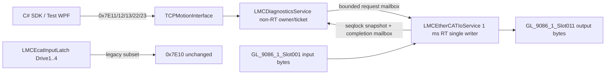

# LMC EtherCAT Topology 및 Digital I/O API 설계

- 기준일: 2026-07-27
- 대상: `Elmo_EtherCAT_Test_4Axis`의 configured EtherCAT topology, CREVIS GL-9086
  digital I/O, C# SDK와 개발 WPF
- 상태: C# SDK contract scaffold와 PC parser/golden test 구현. PLC/LASAL handler, 개발 WPF와
  capability 활성은 아직 구현하지 않음
- 현재 source snapshot: GL-9086 1개와 Elmo drive 4개가 포함된 5-slave 구성
- 증거 경계: 저장소의 LASAL/C# source, generated ENI/network와 local Elmo Maestro API
  Markdown만 사용했다. 외부 Web 자료는 사용하지 않았다.

## 1. 결론

현재 working source의 configured physical order는 다음과 같다.

```text
EtherCAT master
  -> GL_9086_11       physical SlaveIndex 0
  -> Elmo_11          physical SlaveIndex 1 / physical axis 1
  -> Elmo_21          physical SlaveIndex 2 / physical axis 2
  -> Elmo_31          physical SlaveIndex 3 / physical axis 3
  -> Elmo_41          physical SlaveIndex 4 / physical axis 4
```

이 구성에 적용할 API 원칙은 아래 여섯 가지다.

1. slave 순서, Vendor/Product/Revision, PDO index/sub-index, I/O 폭과 module schema는
   **configured topology**다. runtime에서 임의 장치를 발견해 public schema를 바꾸지 않는다.
2. Online, EtherCAT state, AL status, snapshot age와 valid/stale 같은 상태·quality만
   **동적 데이터**다.
3. 기존 `0x7E10 ReadEtherCATHealth`는 4개 Elmo drive subset과 exact 200-byte 응답을
   그대로 유지한다. 기존 entry의 `SlaveIndex=0..3`은 wire 호환을 위한 legacy drive slot이며,
   GL-9086 추가 뒤의 physical EtherCAT SlaveIndex로 재해석하지 않는다.
4. actual configured node inventory와 physical bus `MasterSlaveIndex`는 신규 `0x7E11/0x7E12`, node별
   상태는 `0x7E13`, digital I/O snapshot은 `0x7E22`에서 분리한다.
5. output write는 `0x7E23` ticket과 하나의 PLC RT owner를 통해서만 실행한다. whole-word와
   atomic masked write를 지원하되 PC read-modify-write와 channel 직접 쓰기는 허용하지 않는다.
6. 신규 capability bit는 PLC handler와 data source가 구현되고 실기 검증되기 전까지 전부
   0이다. 현재 `0x7E00`의 `CapabilityBits=0x0000213F`에는 아래 신규 기능이 포함되지 않는다.

현재 CREVIS class/PDO/network source가 working tree에 생성돼 있다는 사실은 LASAL build,
PLC download 또는 실제 I/O PASS를 뜻하지 않는다.

## 2. 확인한 현재 topology

### 2.1 5개 EtherCAT slave

현재 `Network/Eni.xml`과 `EtherCAT_Network.lcn`의 설정은 아래와 같다.

| 순서 | LASAL object | Physical SlaveIndex | PhysAddr | AutoIncAddr | Vendor ID | Product code | Revision | Physical axis |
|---:|---|---:|---:|---:|---:|---:|---:|---:|
| 1 | `GL_9086_11` | 0 | 1001 | 0 | 669 | 1196200070 | 65536 | 0 |
| 2 | `Elmo_11` | 1 | 1002 | -1 | 154 | 198948 | 66592 | 1 |
| 3 | `Elmo_21` | 2 | 1003 | -2 | 154 | 198948 | 66592 | 2 |
| 4 | `Elmo_31` | 3 | 1004 | -3 | 154 | 198948 | 66592 | 3 |
| 5 | `Elmo_41` | 4 | 1005 | -4 | 154 | 198948 | 66592 | 4 |

근거:

- `Network/Eni.xml`: GL-9086은 line 163부터, 네 Elmo는 line 819, 2613, 4406,
  6199부터 정의된다.
- `Network/EtherCAT_Network/EtherCAT_Network.lcn`: bus connection은 line
  1897~1903에 있다.
- `Network/EtherCAT_Network/ONE_EtherCAT_Network_Table.st`: GL-9086
  `SlaveIndex=0`은 line 479, Elmo `SlaveIndex=1..4`는 line 434, 440, 446, 452다.
- `Class/GL_9086_1/GL_9086_1.st`: Vendor/Product 검사는 line 6~7, 270~271이다.
- `Class/Elmo_1/Elmo_1.st`: Vendor/Product 검사는 line 6~7, 659~660이다.

`SlaveIndex`는 compile/configuration init value다. `ECAT_Slave_Base`는 이 값을
`ECAT_M_LOGIN_SLAVE`에 전달하고, ENI의 identity를 받은 뒤 derived class의
Vendor/Product 검사와 대조한다. 실제 배선 순서가 위 configured order와 다르면 API가
동적으로 순서를 보정하는 구조가 아니다.

### 2.2 CREVIS slot과 PDO schema

GL-9086 아래 configured module은 두 개다.

| Slot | Module | ModuleIdent | 방향 | PDO object | 폭 |
|---:|---|---:|---|---|---:|
| 0 | `GT-12FA` | 1196692218 | Input | `0x6000:01..04` | 4 bytes |
| 1 | `GT-22BA` | 1196696250 | Output | `0x7010:01..04` | 4 bytes |

근거:

- `Class/GL_9086_1/GL_9086_1.st` line 122~131
- `Class/GL_9086_1_Slot00/GL_9086_1_Slot00.st` line 8~15, 174~208
- `Class/GL_9086_1_Slot01/GL_9086_1_Slot01.st` line 8~15, 290~324

현재 ENI process image에서 CREVIS input/output 네 byte는 bit offset
`696, 704, 712, 720`에 있고 첫 Elmo는 bit 728부터 시작한다. HEAD의 첫 Elmo는 bit
592부터였으므로 물리 node 추가 뒤 raw offset이 단순 4-byte 증가한 것이 아니다.
application source가 이 offset을 직접 사용해서는 안 된다.

`ECAT_Slave_Base.AddPDOEntry`는 index/sub-index를 등록하고 runtime init에서
`OS_ECATM_IOVAR_GETBYPDO(SlaveIndex, Index, SubIndex)`로 generated ENI mapping을
조회한다. 따라서 다음 두 문장은 동시에 참이다.

- PDO/schema와 ENI process-image layout은 configured topology에 고정된다.
- application class는 generated raw bit offset을 하드코딩하지 않고 ENI mapping handle을
  runtime에 해석한다.

물리 순서, module 또는 PDO selection을 바꿀 때는 LASAL hardware/network configuration과
ENI를 다시 생성해야 한다. runtime discovery만으로 schema가 변하지 않는다.

### 2.3 axis mapping은 유지

`Motion_Network.lcn` line 4747~4790은 `_LMCAxis1..4`와 `Elmo_11..41`의 연결을
그대로 유지한다. `LMCSdoExecutor1..4`도 Elmo object name에 연결돼 있다. 따라서 GL-9086을
physical SlaveIndex 0에 삽입해도 public axis 1..4를 2..5로 바꾸지 않는다.

현재 source 검색에서 `GL_9086_1_Slot001.InputS_Byte0..3`과
`GL_9086_1_Slot011.OutputS_Byte0..3`을 사용하는 application logic은 확인되지 않았다.
즉 현재 변경은 hardware/PDO 노출 단계이고 public API/RT ownership은 아직 없다.

## 3. 고정 schema와 동적 상태의 경계

| 항목 | 분류 | 변경 조건 | API 규칙 |
|---|---|---|---|
| configured slave count/order | 고정 | LASAL network/ENI 재생성 | topology revision에 포함 |
| physical SlaveIndex | 고정 | slave 순서 변경 | topology entry에서만 노출 |
| Vendor/Product/Revision | 고정 기대값 | device/class 변경 | runtime actual identity와 대조 |
| PDO index/sub-index와 bit width | 고정 | ESI/module/PDO 설정 변경 | raw mapping은 internal; public entry는 module identity와 byte width로 표현 |
| process-image raw bit offset | generated 고정값 | ENI 재생성 | public API에 노출하거나 저장하지 않음 |
| physical axis mapping | 고정 application mapping | Motion Network 변경 | topology entry의 `PhysicalAxis`로 노출 |
| Online/EtherCAT state/AL status | 동적 | 매 RT snapshot | node-health quality와 함께 반환 |
| digital input value | 동적 | 매 input latch | valid mask, capture cycle과 함께 반환 |
| output shadow value | 동적 PLC-owned state | RT output owner가 변경 | physical feedback으로 표현하지 않음 |
| snapshot valid/fresh/stale | 동적 quality | source와 cycle age | value와 분리하지 않고 함께 반환 |

신규 API는 nonzero `TopologyRevision`을 사용한다. v1 값은 아래 ordered public topology
entry 96-byte 전체의 deterministic CRC32다.

- opaque `NodeId`, `ParentNodeId`, canonical topology index와 `MasterSlaveIndex`
- node kind/flags, SDO/physical-axis/slot reference
- Vendor/Product/Revision/Serial과 configured slot module identity
- public input/output byte width, ASCII name와 `IOReference`

`PhysAddr/AutoIncAddr`, raw process-image offset와 PDO index/sub-index는 v1 public entry에
노출하지 않고 CRC에도 별도 field로 넣지 않는다. 이 값들은 generated ENI와 LASAL mapping의
build/static 증거로 검증한다. 즉 `TopologyRevision`은 ENI 파일 전체 hash가 아니라 public API
topology identity다.

`TopologyRevision`은 기존 24-entry signal catalog의 `MapRevision=0x957F101E`와 다른
identity다. 둘을 같은 값으로 가정하지 않는다. topology 또는 I/O schema가 바뀌면 old
topology object와 pending output ticket은 stale로 거부한다.

## 4. legacy `0x7E10` 호환 정책

현재 `0x7E10 ReadEtherCATHealth`는 다음 계약으로 고정돼 있다.

- exact request payload: 8 bytes
- exact success response payload: 200 bytes
- `SlaveCount=4`, entry stride 32
- entry `SlaveIndex=0..3`, `PhysicalAxis=1..4`
- data source: `LMCEcatInputLatch.Drive1..4`

LASAL serializer는 `LMCDiagnosticsService.st` line 1362~1406에서 네 entry를 만들고,
C# parser는 `LmcDiagnosticsD1Protocol.cs` line 336~352에서 위 순서를 exact하게 검사한다.

GL-9086 추가 뒤에도 이 field를 physical EtherCAT SlaveIndex로 바꾸지 않는다. 호환
문서에서는 아래처럼 해석한다.

```text
0x7E10 entry.SlaveIndex  = LegacyDriveIndex 0..3
0x7E10 entry.PhysicalAxis = PhysicalAxis 1..4
0x7E11/12 MasterSlaveIndex = actual configured index 0..4
```

따라서 기존 SDK/WPF와 packet golden은 그대로 유지되고, GL-9086 및 actual node inventory는
신규 command만 사용한다. `0x7E10` response count를 5로 늘리거나 첫 entry를 GL-9086으로
바꾸는 것은 호환 파괴다.

## 5. local Elmo API 근거와 차이

Elmo 기준은 저장소의 `output/pdf/maestro_api_md`만 확인했다.

| Local Elmo API | local 문서 근거 | 이 설계에 사용한 의미 | 그대로 복제하지 않는 부분 |
|---|---|---|---|
| `MMC_GetEthercatCommStatistics` | `chunks/063_p1590-p1612_21.7.9-MMC_GetCommStatistics.md` line 139~303 | slave ID 선택, SII Vendor/Product/Revision/Serial, master/slave state와 diagnostic state가 분리됨 | API shape와 최대 76개 배열을 복제하지 않음 |
| `MMC_GetCommDiagnosticsEx` | `chunks/062_p1552-p1589_Chapter-21-EtherCAT-Drive-Communication.md` line 272~308 | primary/redundancy slave count와 network/link state가 동적 diagnostics임 | SIGMATEK project는 현재 redundancy graph를 제공하지 않음 |
| `MMC_ECATIOReadDigitalInput` | 같은 chunk line 737~820 | 한 호출에서 최대 64-bit digital input word를 읽음 | current v1은 configured slot `IOReference`, direction/width와 quality를 추가함 |
| `MMC_ECATIOWriteDigitalOutput` | 같은 chunk line 992~1069 | 한 호출에서 최대 64-bit digital output word를 씀 | masked write, ticket/RT owner와 fail-closed policy는 LASAL-local 확장 |

local 문서에서 EtherCAT physical topology graph를 반환하는 public API는 확인하지 못했다.
따라서 `0x7E11/0x7E12`는 Elmo packet 또는 ABI parity 주장이 아니라 configured LASAL
topology를 안전하게 공개하기 위한 project-local extension이다.

`MMC_NetworkInfoCmd`의 detailed node list는 CANbus 근거이므로 이 EtherCAT 설계의
증거로 사용하지 않는다.

## 6. command와 capability 예약

### 6.1 제안 command ID

| Command | ID | 목적 | 현재 상태 |
|---|:---:|---|---|
| `GetEtherCATTopologyInfo` | `0x7E11` | topology revision, count와 entry stride 조회 | SDK contract 구현, PLC/capability off |
| `GetEtherCATTopologyChunk` | `0x7E12` | configured node entry chunk 조회 | SDK contract 구현, PLC/capability off |
| `ReadEtherCATNodeHealth` | `0x7E13` | actual node 하나의 동적 state/quality 조회 | SDK contract 구현, PLC/capability off |
| `ReadDigitalIO` | `0x7E22` | I/O reference 하나의 input 또는 output-shadow 조회 | SDK contract 구현, PLC/capability off |
| `SubmitDigitalOutputWrite` | `0x7E23` | atomic masked/whole-word output write ticket 제출 | SDK contract 구현, PLC/capability off |

`0x7E10`, `0x7E20`, reserved `0x7E21`과 충돌하지 않는다. `0x7E23`은 general PI Write
`0x7E21`을 활성화하는 것이 아니며, configured digital-output `IOReference`와 mask만 허용하는 별도
고정 schema다.

### 6.2 제안 capability bit

| Bit | 이름 | 의존성 | 현재 값 |
|---:|---|---|---:|
| 14 | `EtherCATTopology` | `0x7E11/12` handler와 nonzero topology revision | 0 |
| 15 | `EtherCATNodeHealth` | bit 14와 RT state/quality snapshot | 0 |
| 16 | `DigitalIORead` | bit 14, configured I/O schema와 RT snapshot | 0 |
| 17 | `DigitalIOWrite` | bit 14~16, nonzero BootId, RT owner와 write policy | 0 |

의존 capability가 없으면 SDK가 command를 송신하기 전에 fail-closed한다.
`TopologyRevision=0`은 revision-bearing read/write를 거부하고, nonzero `DiagnosticsBootId`는
stateful `0x7E23`에만 필수다. RT source 미연결은 future PLC handler가 거부한다. PLC dispatcher에
reserved handler만 먼저 추가한 단계에서는 exact request에 diagnostics
`UnsupportedFeature(2)`를 반환하고 bit를 올리지 않는다.

현재 capability `0x0000213F`와 active command count는 이 예약으로 바뀌지 않는다.

## 7. wire schema v1

모든 값은 little-endian이다. 기존 outer 8-byte header와 diagnostics common request/response를
재사용한다. outer header Reference `[6]`은 0이어야 한다.

```text
Common request payload, 8 bytes
P0  U16 SchemaVersion = 1
P2  U16 RequestFlags = 0
P4  U32 RequestId, nonzero

Common response payload, 16 bytes
P0  U16 SchemaVersion = 1
P2  U16 ResponseFlags
P4  U16 CommandStatus
P6  I16 ErrorId
P8  U32 RequestId echo
P12 U32 DetailCode
```

### 7.1 `0x7E11 GetEtherCATTopologyInfo`

Request는 exact 8 bytes, success response는 exact 44 bytes다.

| Offset | Type | Field | v1 규칙 |
|---:|---|---|---|
| P16 | U32 | `TopologyRevision` | canonical entry byte 전체의 nonzero CRC32 |
| P20 | U16 | `TotalNodeCount` | slave와 공개 slot module을 합한 수 |
| P22 | U16 | `EntryStride` | 96 |
| P24 | U16 | `MaxEntriesPerChunk` | 1..16 |
| P26 | U16 | `ConfiguredSlaveCount` | current source=5 |
| P28 | U16 | `SlotModuleCount` | current source=2 |
| P30 | U16 | `PhysicalAxisCount` | current source=4 |
| P32 | U32 | `TopologyFlags` | fixed stride, ASCII name, canonical CRC, opaque NodeId |
| P36 | U32 | `CrcKind` | `Crc32IsoHdlc` |
| P40 | U32 | reserved | 0 |

`TopologyRevision`은 기존 signal `MapRevision`과 별개다. CRC 결과가 0이면 wire identity는
`0xFFFFFFFF`를 사용한다.

### 7.2 `0x7E12 GetEtherCATTopologyChunk`

Request는 exact 16 bytes다.

| Offset | Type | Field |
|---:|---|---|
| P8 | U32 | `ExpectedTopologyRevision` |
| P12 | U16 | `StartIndex` |
| P14 | U16 | `MaxEntries`, 1..16 |

Success response는 `28 + 96*N` bytes, 최대 1,564 bytes다.

| Offset | Type | Field |
|---:|---|---|
| P16 | U32 | `TopologyRevision` |
| P20 | U16 | `StartIndex` echo |
| P22 | U16 | `ReturnedCount` |
| P24 | U16 | `TotalNodeCount` |
| P26 | U16 | `EntryStride=96` |
| P28 | bytes | node entries |

`ReturnedCount`는 `min(requested MaxEntries, TotalNodeCount-StartIndex)`와 정확히 같아야 하고,
`LastChunk` response flag는 마지막 range에만 존재한다.

Node entry v1:

| Entry offset | Type | Field | 규칙 |
|---:|---|---|---|
| E0 | U32 | `NodeId` | nonzero opaque ID; physical index로 추정하지 않음 |
| E4 | U32 | `ParentNodeId` | EtherCAT slave=0, slot module=부모 coupler ID |
| E8 | U16 | `TopologyIndex` | canonical ordered index |
| E10 | U16 | `MasterSlaveIndex` | slave=0..4, slot module=`0xFFFF` |
| E12 | U8 | `NodeKind` | 1=`EtherCATSlave`, 2=`SlotModule` |
| E13 | U8 | reserved | 0 |
| E14 | U16 | `NodeFlags` | slave-index, SDO, axis, input/output, DS402, coupler, digital-I/O flags |
| E16 | U16 | `SdoSlaveReference` | 미지원=0 |
| E18 | U16 | `PhysicalAxisReference` | non-axis=0, Elmo=1..4 |
| E20 | U16 | `SlotIndex` | slave=`0xFFFF`, slot module=0..N |
| E22 | U16 | reserved | 0 |
| E24 | U32 | `VendorId` | configured expected identity, nonzero |
| E28 | U32 | `ProductCode` | configured expected identity/module, nonzero |
| E32 | U32 | `RevisionNumber` | configured expected identity |
| E36 | U32 | `SerialNumber` | configured expected identity |
| E40 | U16 | `InputBytes` | 공개 input 폭, 없으면 0 |
| E42 | U16 | `OutputBytes` | 공개 output 폭, 없으면 0 |
| E44 | byte[48] | `Name` | NUL-terminated 7-bit ASCII, 남는 byte 0 |
| E92 | U32 | `IOReference` | public digital I/O가 없으면 0 |

slave와 slot module을 별도 entry로 둬 GL-9086 아래 GT-12FA/GT-22BA의 방향과 폭을 정확히
표현한다. v1의 general digital I/O API는 이 allowlist 대상만 사용하며, Elmo drive internal
PDO를 unrestricted drive output API로 확장하지 않는다.

완성 topology parser는 slave `MasterSlaveIndex`가 나타나는 순서대로 `0..N-1`인지,
`PhysicalAxisReference`, `SdoSlaveReference`, `IOReference`가 각 domain에서 중복되지 않는지,
같은 부모 아래 `SlotIndex`가 중복되지 않는지 검사한다. nonzero `IOReference` entry는 input 또는
output byte가 하나 이상 있어야 하고 방향별 최대 8 bytes다. 하나의 `IOReference`가 양방향을
가리키는 경우 `ExpectedDirection`으로 방향을 선택하고 해당 `InputBytes`/`OutputBytes * 8`을
expected bit width로 사용한다.

### 7.3 `0x7E13 ReadEtherCATNodeHealth`

Request는 exact 16 bytes다.

| Offset | Type | Field |
|---:|---|---|
| P8 | U32 | `TopologyRevision` |
| P12 | U32 | `NodeId` |

Success response는 exact 72 bytes다.

| Offset | Type | Field | 의미 |
|---:|---|---|---|
| P16 | U32 | `TopologyRevision` | request와 exact match |
| P20 | U32 | `NodeId` | request와 exact match |
| P24 | U16 | `CapturePhase` | `InputMapped(1)` |
| P26 | U16 | `HealthFlags` | configured/detected/identity/data/DS402 구분 |
| P28 | U32 | `CycleCounter` | coherent RT snapshot cycle |
| P32 | U64 | `TimestampMicroseconds` | snapshot timestamp |
| P40 | U32 | `SnapshotSequence` | nonzero even coherent publish sequence |
| P44 | U8 | `Online` | 0 또는 1 |
| P45 | U8 | `EtherCATState` | raw configured node state |
| P46 | U16 | `ALStatusCode` | raw AL status |
| P48 | U32 | `SlaveState` | LASAL slave state |
| P52 | U32 | `ClassState` | LASAL object/class state |
| P56 | U32 | `DS402StatusWord` | drive만 의미 있음 |
| P60 | U32 | `AxisError` | drive만 의미 있음 |
| P64 | U32 | `LastValidCycle` | 마지막 data-valid cycle |
| P68 | U32 | `LastStateChangeCycle` | 마지막 상태 변경 cycle |

`HealthFlags` bit 0..5는 각각 `Configured`, `Detected`, `IdentityMatched`, `DataValid`,
`DataDefaulted`, `DS402DataPresent`다. `Configured`는 항상 있어야 하고 `Online == Detected`,
detected node는 nonzero EtherCAT state를 가져야 한다. offline node의 state는 0이다.
`DataValid`와 `DataDefaulted` 중 정확히 하나만 존재한다. valid data는 detected/identity match를
요구한다. 노드 offline, identity mismatch, 기본값 대체와 실제 유효 데이터를 별개로 표현한다.
RT source 자체가 없으면 가짜 정상/0 data를 만들지 않고 기존 `NotReady` 또는 신규 I/O
reference/domain error로 거부한다.

### 7.4 `0x7E22 ReadDigitalIO`

Request는 exact 20 bytes다. input과 output shadow는 각각 별도 `IOReference`로 읽는다.

| Offset | Type | Field |
|---:|---|---|
| P8 | U32 | `TopologyRevision` |
| P12 | U32 | `IOReference` |
| P16 | U8 | `ExpectedDirection` | 1=input, 2=output |
| P17 | U8 | `ExpectedBitWidth` | 1..64, current CREVIS=32 |
| P18 | U16 | reserved | 0 |

Success response는 exact 56 bytes다.

| Offset | Type | Field | 규칙 |
|---:|---|---|---|
| P16 | U32 | `TopologyRevision` | request와 exact match |
| P20 | U32 | `IOReference` | request와 exact match |
| P24 | U32 | `NodeId` | owning topology node |
| P28 | U8 | `Direction` | request와 exact match |
| P29 | U8 | `BitWidth` | request와 exact match |
| P30 | U16 | `StatusFlags` | 아래 quality flags |
| P32 | U64 | `Value` | Byte0가 least-significant byte |
| P40 | U64 | `ValidMask` | bit width 범위의 유효 bit |
| P48 | U32 | `CycleCounter` | RT snapshot cycle |
| P52 | U32 | `OutputRevision` | input=0, output shadow=nonzero CAS revision |

`StatusFlags`는 `Valid`, `StaleFrame`, `MasterNotOperational`, `NodeOffline`,
`NodeNotOperational`, `AlError`, `SourceUnavailable`, `IdentityMismatch`, `DataDefaulted`다.
`Valid` snapshot은 다른 fault flag와 결합하지 않고 `ValidMask`가 bit-width 전체 mask여야 한다.
invalid snapshot은 nonzero fault status와 `ValidMask=0`을 요구한다. invalid/defaulted 값은
quality 없이 실제 측정값으로 취급하지 않는다.

### 7.5 `0x7E23 SubmitDigitalOutputWrite`

Request는 exact 40 bytes다.

| Offset | Type | Field | 규칙 |
|---:|---|---|---|
| P8 | U32 | `TopologyRevision` | current exact revision |
| P12 | U32 | `IOReference` | compile-time SDK와 PLC allowlist 모두 통과해야 함 |
| P16 | U64 | `Value` | mask 밖 bit는 0인 canonical form |
| P24 | U64 | `Mask` | nonzero; whole-word는 output valid mask 전체 |
| P32 | U32 | `ExpectedOutputRevision` | 직전 output read의 nonzero CAS revision |
| P36 | U32 | `DiagnosticsBootId` | capability의 current nonzero generation |

Success response는 기존 exact 32-byte operation ticket을 재사용하고
`OperationKind=DigitalOutputWrite(4)`를 추가한다. ticket의
`SubmissionTopologyRevision`은 request revision이며 기존 PI/SDO ticket의
`SubmissionMapRevision` 의미는 유지한다. status/cancel은 기존 `0x7E03/0x7E04`를 사용하고,
successful terminal은 `ResultLength=0`이다. 적용된 output shadow와 새 revision은 같은
topology identity에서 `0x7E22`를 다시 읽어 확인한다.

적용 규칙:

```text
Mask != 0
(Mask & ~OutputValidMask) == 0
(Value & ~Mask) == 0
ExpectedOutputRevision == CurrentOutputRevision
NewOutput = (OldOutput & ~Mask) | (Value & Mask)
```

whole-word는 `Mask == OutputValidMask`인 같은 연산이다. OldOutput 확인과 write는 같은 RT
owner의 한 cycle transaction에서 수행한다. PC read-modify-write는 허용하지 않고, stale
revision은 mutation 없이 거부한다. 현재 SDK compile-time output allowlist는 empty이므로
capability가 잘못 켜져도 `0x7E23`을 송신하지 않는다.

### 7.6 신규 detail code

기존 diagnostics detail 0..25 뒤에 아래 code를 SDK catalog에 추가했다. PLC handler는 아직
없으므로 현재 target이 이 code를 반환하지는 않는다.

| Code | 이름 | 사용 조건 |
|---:|---|---|
| 26 | `TopologyRevisionMismatch` | expected/current revision 불일치 |
| 27 | `NodeNotFound` | configured `NodeId` 없음 |
| 28 | `IOReferenceNotFound` | configured public `IOReference` 없음/방향 불일치 |
| 29 | `OutputRevisionMismatch` | expected/current output revision 불일치 |
| 30 | `OutputMaskInvalid` | mask/value canonical 또는 valid-mask 위반 |
| 31 | `RTOwnerUnavailable` | mailbox/owner 연결 또는 RT execution 불가 |

길이, reserved, enum 범위 오류는 기존 `BoundsInvalid(12)`, queue 점유는
`ResourceBusy(9)`, write policy 차단은 `WriteDenied(7)` 또는
`UnsafeWriteBlocked(8)`, BootId 불일치는 `BootIdMismatch(25)`, offline은
`SlaveOffline(18)`을 유지한다.

## 8. C# public API 설계

구현한 surface:

```csharp
LMCEtherCATTopologyInfo GetEtherCATTopologyInfo();
Task<LMCEtherCATTopologyInfo> GetEtherCATTopologyInfoAsync(
    CancellationToken token);
LMCEtherCATTopologyChunk GetEtherCATTopologyChunk(
    uint expectedTopologyRevision, ushort startIndex, ushort maxEntries);
Task<LMCEtherCATTopologyChunk> GetEtherCATTopologyChunkAsync(
    uint expectedTopologyRevision,
    ushort startIndex,
    ushort maxEntries,
    CancellationToken token);
LMCEtherCATTopology GetEtherCATTopology();
Task<LMCEtherCATTopology> GetEtherCATTopologyAsync(CancellationToken token);

LMCEtherCATNodeHealth ReadEtherCATNodeHealth(
    uint topologyRevision, uint nodeId);
Task<LMCEtherCATNodeHealth> ReadEtherCATNodeHealthAsync(
    uint topologyRevision,
    uint nodeId,
    CancellationToken token);

LMCDigitalIOValue ReadDigitalIO(LMCDigitalIOReadRequest request);
Task<LMCDigitalIOValue> ReadDigitalIOAsync(
    LMCDigitalIOReadRequest request,
    CancellationToken token);

IReadOnlyList<uint> GetApprovedDigitalOutputWriteReferences();
LMCOperationTicket SubmitDigitalOutputWrite(
    LMCDigitalOutputWriteRequest request);
Task<LMCOperationTicket> SubmitDigitalOutputWriteAsync(
    LMCDigitalOutputWriteRequest request,
    CancellationToken token);
```

모델 규칙:

- topology와 node entry는 immutable snapshot이다.
- `NodeId`, `IOReference`, `PhysicalAxisReference`, `MasterSlaveIndex`는 서로 다른 identity다.
  `MasterSlaveIndex=0`은 정상 첫 slave이며 absent sentinel은 `0xFFFF`다.
- topology/node/value model은 `TopologyRevision`을 보존한다. per-call facade와 operation
  ticket은 별도로 connection session generation을 고정한다.
- topology revision은 모든 요청에 명시하고 PLC가 current revision과 대조한다. 현재 SDK는
  nonzero/canonical shape까지만 검사하므로 stale revision 자체는 future PLC가 거부한다.
- input/output value와 valid mask는 `ulong`을 사용한다. current 32-bit module도 64-bit
  contract의 low bits만 사용한다.
- output write request는 `Value`, nonzero `Mask`, 직전 read의 nonzero
  `ExpectedOutputRevision`을 함께 보존한다.
- capability dependency, zero identity, zero mask, mask 밖 value, zero output revision과 empty
  output allowlist는 SDK가 command 송신 전에 거부한다. advertised topology에 없는 node/I/O,
  out-of-range writable mask, stale topology/output revision/BootId와 runtime quality는 future
  PLC handler가 다시 검사한다.
- `0x7E10`의 기존 `LMCEtherCATSlaveHealth.SlaveIndex` public shape는 호환을 위해 유지하되
  문서에는 `LegacyDriveIndex` 의미를 명시한다. actual physical index는 새 topology model만
  사용한다.

## 9. RT ownership과 fail-closed write

제안 runtime 구조는 다음과 같다.



`LMCEtherCATIoService`는 제안 class 이름이며 아직 source가 없다. 책임은 아래로 제한한다.

- CREVIS input byte와 output shadow를 매 RT cycle에 한 번 읽는다.
- coherent snapshot을 seqlock 또는 동등한 single-writer publish 방식으로 내보낸다.
- output request mailbox를 cycle당 최대 한 건 소비하고 expected/current output revision을
  비교한다.
- whole/masked 계산과 네 output byte write를 같은 owner context에서 수행한다.
- applied/failed completion token을 non-RT service에 게시한다.
- topology revision, BootId, ticket token과 owner session이 일치하지 않으면 적용하지 않는다.

`LMCDiagnosticsService`는 public ticket, timeout, queued cancel, TCP owner와 terminal 상태를
소유한다. RT service는 TCP socket, C# request 또는 WPF 상태를 알지 않는다.

fail-closed 규칙:

1. capability와 global/per-node write gate 기본값은 FALSE다.
2. 허용 target은 configured GT-22BA output slot-module `IOReference`와 exact valid mask뿐이다.
3. target offline/not OP, identity mismatch, stale snapshot, invalid topology/BootId, mailbox full,
   owner 불일치에서는 output byte를 변경하지 않는다.
4. validation 실패나 queued cancel은 어떤 bit도 적용하지 않는다.
5. accepted request를 자동 재시도하거나 reconnect 뒤 replay하지 않는다.
6. transport가 끊겨 apply 여부를 확정하지 못하면 outcome을 성공으로 추정하지 않는다. SDK/WPF는
   같은 owner/BootId/topology identity에서 terminal 또는 운영자 승인된 recovery 전까지 다음
   output mutation을 차단한다.
7. physical cable loss 시 실제 output safe state는 EtherCAT device/project의 watchdog/safe-output
   설정으로 검증해야 한다. API가 자동 0 출력을 보장한다고 문서화하지 않는다.

## 10. 구현 목록

### T0 - current 5-slave configuration 고정

- 사용자가 current `Elmo_EtherCAT_Test_4Axis`를 LASAL에서 Rebuild/Link한다.
- GL-9086과 Elmo 4개가 configured order대로 인식되는지 확인한다.
- `HwVisualConfigMngr.xml`과 actual `.lcn` 연결 표시를 재확인한다.
- `GL_9086_1_Slot001.InputS_Byte0..3`와
  `GL_9086_1_Slot011.OutputS_Byte0..3`가 online에서 접근 가능한지 확인한다.
- 이 단계에서는 신규 TCP capability를 켜지 않는다.

### T1 - contract와 PC model, capability off - 완료

수정 대상:

- `LMC_Library/LMC_API_Delivery/src/LmcProtocol.cs`
- `LMC_Library/LMC_API_Delivery/src/LmcDiagnosticsModels.cs`
- `LMC_Library/LMC_API_Delivery/src/LmcResponsePayloadLimits.cs`
- 신규 `LmcDiagnosticsTopologyIoModels.cs`
- 신규 `LmcDiagnosticsTopologyIoProtocol.cs`
- 신규 `LmcDiagnosticsTopologyIo.cs`
- `LMC_Library/LMC_API_Delivery/docs/DINT_PACKET_MAP.txt`
- `LMC_Library/LMC_API_Delivery/tests/LasalMotionControlLib.Tests/**`

exact golden, malformed invariant, topology CRC, capability dependency/off, legacy
`0x7E10` 호환, empty output allowlist와 operation ticket 회귀를 구현했다. C# public method는
capability가 없으면 신규 command를 송신하지 않는다. 2026-07-27 VS2019 MSBuild 기준 전체
Debug/Release가 각각 `286/286` PASS했다. PLC handler와 live path 증거는 T2 이후다.

### T2 - PLC read-only topology와 node health

수정 대상:

- `Class/LMCDiagnosticsService/LMCDiagnosticsService.st`
- topology constants/record를 소유할 신규 ASCII-only include 또는 class
- 신규 `Class/LMCEtherCATIoService/LMCEtherCATIoService.st`
- LASAL IDE에서 생성할 class declaration/object/channel/network
- 관련 `Comm_Network.lcn`, `Motion_Network.lcn`과 generated table
- `Classes.lcb`, `Networks.lcb`, channel include와 project registration
- `tools/Verify-LasalContract.ps1`

먼저 `0x7E11/12/13/22` read-only handler와 coherent snapshot을 구현한다. generated
`.lcn`, `ONE_*_Table.st`, `.lcb`, channel header는 LASAL에서 구조를 생성한 뒤 검증하며
외부에서 임의로 손으로 합성하지 않는다.

### T3 - RT output owner와 ticket, 계속 capability off

- `LMCEtherCATIoService`에 single-writer mailbox와 atomic whole/masked apply를 추가한다.
- `LMCDiagnosticsService`에 `0x7E23`, `OperationKind=4`, status/cancel/timeout/owner 처리를
  추가한다.
- PLC global gate, per-node gate와 exact valid mask allowlist를 모두 FALSE로 둔다.
- SDK allowlist도 empty로 둔다.
- no-owner, offline, stale, invalid mask와 contention에서 output image 불변을 정적으로 확인한다.

### T4 - 개발 WPF

수정 대상:

- `LMC_Library/LasalApiWpfTestApp/LasalApiWpfTestApp/MainWindow.xaml`
- 관련 `MainWindow.*.cs` partial

화면은 configured topology, actual `MasterSlaveIndex`, legacy drive index, node health quality,
input/output word를 분리 표시한다. output은 capability와 모든 gate가 닫혀 있으면 controls를
disabled하고 handler도 재검사한다. masked write는 mask/value를 별도 표시하고 terminal 뒤
`0x7E22` output shadow readback을 기록한다.

### T5 - 단계별 capability 활성

활성 순서는 아래와 같다.

1. topology source/parser/live inventory PASS 뒤 bit 14
2. node disconnect/recovery quality PASS 뒤 bit 15
3. DI pattern과 output-shadow read PASS 뒤 bit 16
4. RT whole/masked/fault/ownership/safety matrix PASS 뒤 bit 17

bit 17은 bit 14~16, nonzero BootId와 exact write policy를 모두 요구한다. read capability를
활성화했다고 write가 자동 활성화되지 않는다.

## 11. 검증 gate

| Gate | 시험 | 합격 기준 |
|---|---|---|
| source topology | ENI, `.lcn`, generated table과 class PDO 교차 확인 | 5 slaves, GL=0, Elmo=1..4, Vendor/Product/slot/PDO exact |
| legacy wire | 기존 `0x7E10` golden/parser/fake RPC | exact 200 bytes, count 4, drive index 0..3 byte-identical |
| new wire | 각 command exact golden/malformed/truncated/trailing | 모든 offset/length/reserved/detail exact |
| capability-off | raw exact request와 public facade | public RPC 전 fail-fast; PLC reserved handler는 UnsupportedFeature, mutation 0 |
| LASAL IDE | Reload/Rebuild/Link와 implementation smoke | error 0, 신규 `CInvalidArgException` 0 |
| inventory live | `0x7E11/12` | ordered 7 entries(5 slaves + 2 slot modules)와 configured identity exact |
| node health | 정상, GL/각 Elmo disconnect/reconnect | topology revision 불변, state/quality만 변화, stale/offline 구분 |
| legacy coexistence | GL 포함 구성에서 `0x7E10` | Elmo axis 1..4 subset 유지, GL 미삽입 |
| DI | 32개 input test pattern | bit/byte order, valid mask, capture cycle와 physical input 일치 |
| output whole | bounded safe test pattern | 한 RT apply, terminal Success, shadow와 physical output 일치 |
| output masked | 각 byte/교차 mask와 concurrent request | unmasked bit 보존, single owner, no lost update |
| invalid write | zero/out-of-range mask, stale topology/BootId, offline/not OP | ticket 거부/실패, output image 불변 |
| uncertain outcome | response loss/disconnect/cold restart | 자동 replay 없음, mutation interlock와 명시적 recovery |
| RT | 1 ms task jitter/overrun, mailbox contention | 승인된 jitter/overrun 기준, queue bound와 one-write-per-cycle 유지 |
| packet evidence | pcap/QTEST와 PLC log | request/ticket/status/readback/identity를 한 scenario로 보존 |

## 12. 완료와 비완료 판정

다음 상태는 서로 다르다.

- CREVIS class/network source 존재: configured source snapshot
- LASAL Rebuild/Link PASS: compile/integration 증거
- PLC에서 5 slave OP: physical topology runtime 증거
- topology/health/DI capability active: read-only API runtime 증거
- output write capability active: RT owner와 write safety matrix까지 통과한 상태

현재는 configured source snapshot과 C# SDK contract/PC 자동 테스트까지 존재한다. PLC/LASAL
handler, RT I/O owner, 개발 WPF와 live evidence는 없다. capability bit 14~17과 SDK output
allowlist는 모두 닫혀 있으므로 실제 topology/I/O API가 동작하는 상태가 아니다. T0, T2~T5와
11절의 증거가 없으면 PLC API 구현 완료나 production I/O 지원으로 분류하지 않는다.
