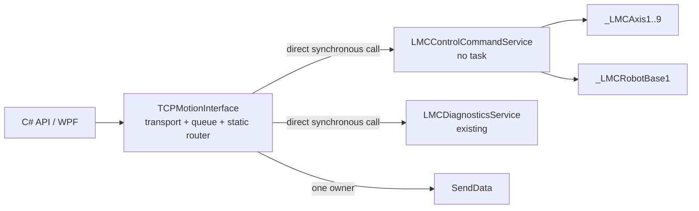

# TCPMotionInterface 성능 우선 OOP 분리 설계

- 작성일: 2026-07-23
- 대상: `Lasal_PRG/Elmo_EtherCAT_Test_4Axis`
- 상태: Phase 5 transport-only 외부 text cleanup 적용. `TCPMotionInterface` generated
  server/client/data count는 `4/3/0`, 구현 함수는 8개이고 Diagnostics route는
  `MsgPaser`에 inline됐다. TCP direct axis/robot 연결 10개를 `.lcn` text에서 제거하고
  `ONE_Comm_Network_Table.st` external connection text를 26개에서 16개로 줄였다. tracked
  `Classes.lcb`/`Networks.lcb`도 transport-only registration과 network tuple 계약을 만족해
  switch 없는 `Phase5TransportClean` SourceOnly/full static이 PASS했다. 2026-07-30 current
  worktree는 `Phase5TransportClean / IntegratedReadOwnerDormant`, `ExpectedSdoWriteAxis=1`
  SourceOnly/full static, PC Debug/Release 1006/1006와 개발 WPF
  Debug/Release 278/278을 통과했다. fresh LASAL IDE Rebuild/Link는 `0 errors / 20 warnings`,
  Linker Done이고 변경 implementation 직접 open smoke도 성공했다. 현재 IDE PID의
  `CInvalidArgException`은 0건이다. 이 checkpoint는 `0x7E11/12/13/22` route, coherent
  464-byte snapshot과 CREVIS read-owner wiring을 포함하지만 bits 15~17은 OFF다. `0x7E23`
  PLC route도 없고 PLC download/runtime은 아직 검증하지 않았다
- 우선순위: PLC 주기 성능 > wire 호환성 > 유지보수성 > 구현 편의

## 1. 목적

`TCPMotionInterface`에 누적된 TCP lifecycle, request queue, RPC session, Admin,
object lookup, single-axis, group, diagnostics routing과 response 송신 책임을 분리한다.
분리는 객체 수 자체를 늘리는 것이 목적이 아니다. 다음 네 가지를 동시에 만족해야 한다.

1. 기존 `LASAL-DINT v1` request/response byte 계약을 변경하지 않는다.
2. 별도 task, mailbox, 주기 지연과 frame copy를 추가하지 않는다.
3. `TCPMotionInterface`를 transport와 static routing 책임으로 제한한다.
4. 명령 family 구현을 작고 탐색 가능한 method/class로 분리한다.

이 문서는 최종 구조와 단계별 이행 계약을 고정한다. 현재 기능 범위와 runtime 검증
상태는 [현재 아키텍처 및 릴리스 상태](ELMO_MASTER_CURRENT_ARCHITECTURE_AND_RELEASE_STATUS_2026-07-16.md)를
같이 본다.

## 2. 확인된 기준선

2026-07-23 Phase 1 직전 source 기준은 다음과 같다.

| 항목 | 기준선 |
|---|---:|
| `TCPMotionInterface.st` 전체 | 3,665 lines, 124,284 bytes |
| `MsgPaser` | 1,937 lines, 67,081 bytes |
| Group family | 11 command IDs, 약 24 KB |
| request queue | depth 8 |
| 실행량 | `CyWork`에서 scan당 최대 1 request |
| 기존 request copy | queue → `ActiveRequest` → `RequestBuf` |
| TCP 송신 소유자 | `TCPMotionInterface.SendData` |
| diagnostics domain | `LMCDiagnosticsService`로 이미 동기 위임 |

Phase 1 적용 후 확인값은 다음과 같다.

| 함수 | 크기 | 상태 |
|---|---:|---|
| `MsgPaser` | 44,784 bytes | Group aggregate route만 보유 |
| `HandleGroupCommands` | 23,926 bytes | Group 11개 본문 보유 |

Phase 1b 적용 당시 UTF-8 source block 확인값은 다음과 같다. LASAL 저장으로 line
ending이 CRLF로 정규화됐으므로 Phase 1 수치와 단순 증감 비교하지 않는다.

| 함수 | 당시 크기 | 상태 |
|---|---:|---|
| `MsgPaser` | 5,392 bytes | session gate, lifecycle 3개, family aggregate route만 보유 |
| `HandleAdminCommands` | 15,049 bytes | Admin 4개 본문 보유 |
| `HandleDiagnosticsCommands` | 4,745 bytes | diagnostics 24개 route/capability 본문 보유 |
| `HandleRegistryCommands` | 8,072 bytes | registry/info 3개 본문 보유 |
| `HandleAxisCommands` | 11,219 bytes | axis 8개 본문 보유 |
| `HandleGroupCommands` | 24,581 bytes | Group 11개 본문 보유 |

Phase 5 cleanup 후의 현재 source inventory는 다음과 같다. tracked `Classes.lcb`/
`Networks.lcb` registration도 이 구조와 정적으로 일치하지만 LASAL IDE Rebuild/Link와
PLC download를 수행한 runtime 증거는 아니다.

| 항목 | 외부 text 상태 |
|---|---:|
| `TCPMotionInterface` generated server/client/data count | `4/3/0` |
| `TCPMotionInterface` 구현 함수 | 8개 |
| TCP local domain/family/helper 함수 | 0개 |
| TCP direct axis/robot client 및 `.lcn` 연결 | 0개 |
| Comm Network generated external connection text | 16개, cleanup 전 26개 |

이 크기 제한은 LASAL compiler의 공식 hard limit가 아니다. 구현이 다시 비대해지는 것을
조기에 막기 위한 이 저장소의 정적 계약이다.

## 3. 결정

### 3.1 선택 패턴

최종 패턴은 **Static Router + synchronous no-task Domain Service**다.

- `TCPMotionInterface`: transport/session/FIFO/static family router/유일한 `SendData`
- `LMCControlCommandService`: Admin, registry, axis, group 명령의 검증과 실행
- `LMCDiagnosticsService`: 기존 diagnostics D0~D5 처리 유지
- family 내부 분기: private method의 `case`, 직접 호출

`LMCControlCommandService`는 task를 갖지 않는다. `TCPMotionInterface.CyWork`가 service
method를 동기 호출하므로 request는 기존과 같은 scan에서 처리된다.

### 3.2 제외한 패턴

| 대안 | 제외 이유 |
|---|---|
| 명령별 객체/Command pattern | 객체와 VMT 간접 호출이 command 수만큼 늘고 LASAL network가 과도하게 커짐 |
| 이벤트 버스/Observer | 실행 순서와 response ownership이 불명확해지고 queue가 하나 더 필요함 |
| 별도 control task + mailbox | 최소 1 scan 지연, 동기화와 copy가 추가됨 |
| reflection/문자열 기반 dispatch | 주기 경로의 문자열 탐색과 실패 모드가 증가함 |
| 상속 계층 확대 | transport와 motion domain은 is-a 관계가 아니며 base 변경 영향이 커짐 |
| service별 request/response array | request와 최대 2 KB response copy가 추가됨 |

상속은 vendor class contract를 확장할 때만 사용한다. 이 분리는 조합과 required client
연결이 맞다.

## 4. 목표 구조



현재 source와 tracked metadata 기준으로 `TCPMotionInterface`는 axis/robot client를 직접
소유하지 않고 한 command ID의 실행 소유자도 하나뿐이다. 다만 이 구조를 최종 production
network라고 부르려면 LASAL IDE에서 Reload/저장 후 generated table, Rebuild/Link와 PLC
download를 다시 확인해야 한다.

## 5. command ownership

current C# protocol inventory 62개와 LASAL dispatcher route 61개를 다음처럼 구분한다.
capability-advertised active route는 53개이고, dormant read-owner 2개와
reserved/dormant 6개가 더해진다. `0x7E23`은 C# contract에만 있고 LASAL route가 없다.

| 소유자 | family | command IDs | 수량 |
|---|---|---|---:|
| Transport | lifecycle | `0x8080`, `0x405C`, `0x405D` | 3 |
| Control | Admin general | `0x7D00`, `0x7D10` | 2 |
| Control | Group-domain Admin | `0x7D20`, `0x7D22` | 2 |
| Control | registry/info | `0x103C`, `0x1042`, `0x202B` | 3 |
| Control | axis | `0x2022`, `0x2023`, `0x2024`, `0x2028`, `0x202E`, `0x209F`, `0x20A0`, `0x20A2` | 8 |
| Control | group | `0x20D2`, `0x2047`, `0x2048`, `0x2049`, `0x204A`, `0x204B`, `0x2085`, `0x20A4`, `0x2045`, `0x2051`, `0x20E7` | 11 |
| Diagnostics | capability-advertised active family | `0x7E00`~`0x7E51`의 active 24개 ID | 24 |
| Diagnostics | dormant read owner | `0x7E13`, `0x7E22` | 2 |
| Diagnostics | reserved/dormant | `0x7E21`, `0x7E51`, `0x7E4A`~`0x7E4D` | 6 |
| LASAL route 합계 |  |  | 61 |
| C#-only | LASAL route 없음 | digital output write `0x7E23` | 1 |
| C# protocol ID 합계 |  |  | 62 |

`0x7E00` capability frame은 최종적으로 diagnostics owner에 포함한다. 이행 중 현재
transport에 남아 있는 capability 조립도 별도 phase에서 service로 이동하며 wire
payload는 바꾸지 않는다.

## 6. 호출 계약

### 6.1 외부 service method

`LMCControlCommandService.ClassSvr`에 다음 global method를 둔다.

```text
HandleRequest(
  CommandId       : UINT,
  Reference       : UINT,
  pRequestFrame   : ^USINT,
  RequestFrameSize: UDINT,
  pResponseFrame  : ^USINT,
  ResponseCapacity: UDINT
) -> ResponseSize : DINT
```

- request pointer는 `TCPMotionInterface.RequestBuf[0]`을 직접 가리킨다.
- response pointer는 `TCPMotionInterface.Sendbuf[0]`을 직접 가리킨다.
- size는 8-byte outer header를 포함한 전체 frame 크기다.
- service가 기존 offset 그대로 response frame을 작성한다.
- `ResponseSize > 0`이면 transport가 `SendData`를 정확히 한 번 호출한다.
- `ResponseSize <= 0` 또는 capacity 위반이면 transport가 공통 fail-closed error를 만든다.
- service는 socket, queue, session close와 `SendData`에 접근하지 않는다.

이 계약은 추가 frame copy 없이 기존 body를 단계적으로 옮길 수 있게 한다. private
family handler는 아래의 고정 ABI로 같은 pointer/size를 직접 전달받는다. class variable에
caller pointer를 보존하거나 별도 request/response frame을 만들지 않는다.

```text
HandleAdminCommands(
  CommandId, Reference, pRequestFrame, RequestFrameSize,
  pResponseFrame, ResponseCapacity
) -> ResponseSize

HandleRegistryCommands(...same ABI...) -> ResponseSize
HandleAxisCommands(...same ABI...) -> ResponseSize
HandleGroupCommands(...same ABI...) -> ResponseSize

MoveLinearAbsEx(
  Reference, pResponseFrame, ResponseCapacity,
  pRequestFrame, RequestFrameSize
) -> ResponseSize

GroupReadStatus(
  pResponseFrame, ResponseCapacity
) -> ResponseSize
```

타입은 `HandleRequest`와 동일하게 `CommandId/Reference : UINT`, frame pointer는
`^USINT`, size/capacity는 `UDINT`, `ResponseSize : DINT`다. 이 순서와 타입은 LASAL
declaration과 정적 계약에서 함께 고정한다.

### 6.2 router

router는 command range 추론이 아니라 명시적 ID 목록을 사용한다. reserved gap이나
향후 extension이 잘못된 service로 들어가는 것을 막기 위해서다.

```text
case CommandID of
  lifecycle IDs:
    HandleTransportCommand();

  26 control IDs:
    responseSize := ControlCommands.HandleRequest(...);

  24 diagnostics IDs:
    responseSize := Diagnostics.HandleRequest(...);

  else
    BuildUnsupportedCommandResponse();
end_case;
```

service의 `HandleRequest`도 Admin/registry/axis/group의 네 묶음만 고정 분기한다. family
handler 호출은 private direct method로 유지하고 command별 객체 호출은 만들지 않는다.

## 7. 상태와 의존성 소유권

| 상태/의존성 | 최종 소유자 |
|---|---|
| socket, connected client, RPC registration | `TCPMotionInterface` |
| session epoch와 close ordering | `TCPMotionInterface` |
| ingress parser, depth-8 queue, active request | `TCPMotionInterface` |
| `RequestBuf`, `Sendbuf`, 유일한 `SendData` | `TCPMotionInterface` |
| axis/group command scratch와 last status | `LMCControlCommandService` |
| object-name buffers와 registry readiness | `LMCControlCommandService` |
| `LMCAxis1..9`, `LMCRobot` clients | `LMCControlCommandService` |
| Bulk/Recorder/SDO ticket와 BootId | `LMCDiagnosticsService` 및 기존 하위 service |

외부에서 관측되는 상태를 옮길 때 초기값과 reset 시점도 함께 옮긴다. TCP session close가
control state를 무효화해야 하는 항목이 확인되면 `NotifySessionClosed`를 명시적으로
추가한다. 근거 없이 모든 motion state를 disconnect 때 초기화하지 않는다.

## 8. 성능 불변조건

다음은 설계 권고가 아니라 구현 gate다.

1. 새 realtime/cyclic/background task를 만들지 않는다.
2. 기존 depth-8 queue와 scan당 최대 1 request 정책을 유지한다.
3. 기존 queue copy 외 request/response array copy를 추가하지 않는다.
4. control request당 domain service global call은 최대 1회다.
5. family 내부는 private direct method와 정적 `case`만 사용한다.
6. heap allocation, 문자열 dispatch, 주기별 object-name discovery를 금지한다.
7. TCP 송신은 `TCPMotionInterface.SendData`만 수행한다.
8. accepted command와 후속 status poll 순서를 바꾸지 않는다.
9. diagnostics `ProcessOperations`는 기존 request 처리 뒤 순서를 유지한다.

정적 size gate는 service의 custom implementation method와 final `MsgPaser` 각각에
`32,768 bytes` 기준을 유지한다. Phase 1b의 다섯 local family handler는 Phase 5 source에서
제거됐다. switch 없는 `Phase5TransportClean` default checkpoint가 최종 size와 tracked
method registration을 확인해 PASS했다. LASAL IDE compiler의 실제 수용 여부는 Rebuild/Link로
별도 확인한다.

### 8.1 2026-08-05 custom method-size debt ratchet

아래 표는 2026-08-05 pre-split 기준이다. 당시 6개 custom service class의 qualified
implementation `93`개를 raw/LF/all-CRLF UTF-8로 전수 계산했다. vendor/framework class는
이 debt ledger에 섞지 않는다. 새 method는 세 크기 중 하나라도 `32768` 이상이면 실패한다.
pre-split 초과 method는 아래 7개만 baseline debt로 인정하되,
어느 크기 차원도 현재 baseline보다 증가할 수 없다. 분할로 줄어들거나 사라지는 것은 허용한다.

| Class | Method | raw | LF | all-CRLF |
|---|---|---:|---:|---:|
| `LMCControlCommandService` | `ReserveAxisOwnership` | 79880 | 77732 | 79881 |
| `LMCRecorderStore` | `HandleRequest` | 75829 | 75249 | 77210 |
| `LMCEcatInputLatch` | `RtWork` | 73392 | 71906 | 73766 |
| `LMCControlCommandService` | `PublishAxisOwnership` | 65118 | 63444 | 65119 |
| `LMCControlCommandService` | `RollbackAxisOwnership` | 50103 | 48798 | 50104 |
| `LMCControlCommandService` | `PublishAxisOwnershipDs402Receipt` | 47506 | 46336 | 47507 |
| `LMCControlCommandService` | `PublishAxisOwnershipPreemptionCleanup` | 37128 | 36143 | 37129 |

`LMCControlCommandService.HandleAxisCommands`는 all-CRLF `32700` bytes로 여유가 `68` bytes뿐이다.
`HandleRequest`도 `32575` bytes다. verifier는 30000 bytes 이상 method를 내림차순으로 출력해
초과 전의 근접 위험도 보이게 한다.

검증기는
`LMC_Library/LMC_API_Delivery/tests/LasalMotionControlLib.Tests/Verify-LasalCustomMethodSizeBudget.ps1`이다.
direct self-test는 baseline shrink/removal 허용과 exact-threshold 신규 debt/baseline growth 거부를
포함해 `5/5`를 통과한다. pre-split tree는 six classes, `93` methods, under-limit `86`,
baseline debt `7`이었다. Section 8.2의 preemption-cleanup split 뒤 `94/88/6`, Section 8.3의
DS402 receipt split 뒤 당시 inventory는 `95/90/5`가 됐다. retired receipt debt 재발 fixture를
추가한 당시 self-test는 `6/6` PASS다. 전체 `Verify-LasalContract.ps1`도 이 ratchet을 호출하므로
별도 실행 누락으로 size gate를 우회할 수 없다.

2026-08-11 current roll-up에서는 cleanup, receipt, rollback에 이어
`PublishAxisOwnership`도 raw/LF/all-CRLF `26265/26265/26996`으로 일반 `<32768` gate에
들어왔다. 따라서 historical debt 7개 중 아래 3개만 baseline으로 남긴다.

| Class | Method | current raw | current LF | current all-CRLF |
|---|---|---:|---:|---:|
| `LMCControlCommandService` | `ReserveAxisOwnership` | 77731 | 77731 | 79879 |
| `LMCRecorderStore` | `HandleRequest` | 75829 | 75249 | 77210 |
| `LMCEcatInputLatch` | `RtWork` | 72907 | 71437 | 73287 |

Current inventory는 six classes / methods/under-limit/debt `101/98/3`이고 PS5.1과 PS7
current scan이 동일하다. self-test는 `8/8` PASS하며 retired `PublishAxisOwnership`의 raw,
LF, all-CRLF 각 차원이 exact `32768`에 닿는 세 fixture를 모두 신규 debt로 거부한다. 이
ratchet은 retired method가 다시 32 KiB debt로 돌아가는 것을 막는 PC 정적 계약일 뿐
LASAL compile, generated metadata 또는 PLC runtime 증거가 아니다.

2026-08-05 `ReserveAxisOwnership`의 미선언 `preemptRecordBase` 5곳을 같은 function에 이미 선언된
`probeRecordBase`로 교정한 직후 당시 `LMCControlCommandService.st` SHA-256은
`C976CD364010EEFDFDDA8D7BC6D7655293DAD221FBEC908D50E5805CE4AFF072`다. 이 교정은 public ABI,
local 수, 호출과 write 순서를 바꾸지 않고 debt baseline만 세 차원에서 각각 10 bytes 줄였다.
아래 8.2~8.5의 whole-source planned SHA와 reverse-inline target
`ACCDD97A171A5D054F1115A7CDFA0B0C83FCF165FF59ED75E5C180D448C64AD3`은 이 P0 교정 전 계산
snapshot이다. 해당 split을 실제 적용할 때 current baseline으로 다시 계산해야 하며, current 승인값으로
재사용하지 않는다. 8.6의 Reserve 계획은 교정 후 source를 기준으로 다시 계산했다.

아래 순서는 2026-08-05 pre-split 진행 계획이었다. hidden channel 1개와 private helper 8개의
generated declaration, default SourceOnly, C78 baseline을 고정한 뒤 초과 폭이 가장 작은
`PublishAxisOwnershipPreemptionCleanup`부터 reverse-inline proof와 semantic negative fixture를
갖춰 분할한다. 이 첫 split은 Section 8.2와 같이 source에 적용됐고 source/build/IDE/PC 최종 검증도
완료됐다.
그 뒤 DS402 receipt, rollback, general publication, reservation 순서로 Control debt를 줄이고,
RT `RtWork`와 Recorder `HandleRequest`는 독립 단계로 다룬다.

2026-08-07 결정으로 Recorder 추가 개발은 중단했다. 기존 Recorder 구현과 시험 자산은 보존하지만
`LMCRecorderStore.HandleRequest` size debt, 새 wire 기능, qualification 확대는 현재 backlog에서
제외한다. SIGMATEK과 데이터 경로/대역폭을 협의하고 사용자가 명시적으로 재개할 때만 이 설계 문서를
먼저 갱신한 뒤 별도 tranche로 개발한다.

### 8.2 2026-08-06 preemption-cleanup split applied and statically verified

이 절의 split은 current LASAL source와 generated declaration에 적용됐고, split-aware semantic
verifier, generated ABI/private metadata, C78 Rebuild, implementation smoke와 PC/WPF regression까지
완료됐다. 이 완료 판정은 source/build/IDE/PC 범위이며 PLC download와 실축 runtime 완료를 뜻하지
않는다.

`PublishAxisOwnershipPreemptionCleanup`에서 replacement tuple을 읽기만 하는 validator를 아래
private helper로 분리했다. declaration과 implementation header 모두 `GLOBAL`/
`VIRTUAL GLOBAL`이 없다. ABI의 인자, 타입과 순서는 다음과 같다.

```text
ValidateAxisOwnershipPreemptionReplacement
  PreemptedAdmissionToken : UDINT
  PreemptedOwnerGeneration : UDINT
  OldCommand : DINT
  OldOwnerKind : DINT
  OldResourceKind : DINT
  OldIdentitySize : UDINT
  Result : BOOL
```

원본 추출 범위는 pre-IDE source의 `singletonToken := 0;`부터
`tupleValid := replacementValid;`까지였다. 7,678-byte 추출 block SHA-256은
`95D07F6EDEC47747606F4A2DEBDF2AF240C2F872EA638C2B176B9203335C053E`다. parent에는 helper
호출이 단 한 번 남아 원 public input과 이미 검증·표본한 old tuple만 by-value로
넘기고 `tupleValid`에 결과를 대입한다.

다음 15개 local은 parent에서 helper로 이동했다.

`probeAxisIndex`, `probeAxisBit`, `replacementRecordBase`, `replacementHeaderBase`,
`singletonToken`, `singletonGeneration`, `singletonMask`, `replacementIdentitySize`,
`replacementTailSize`, `replacementTailOffset`, `replacementPackedCommand`,
`replacementPackedOwner`, `replacementFound`, `replacementValid`, `replacementStateValid`

helper는 기존 순서로 `OwnershipState`와 `OwnershipIdentityState`를 읽지만 persistent
write를 하지 않는다. source-level reverse-inline 검토에서 parent의 persistent mutation 26개와
순서, normal commit의 root-magic clear/commit-last, public Result domain은 변하지 않았다.
current Result assignment histogram도 `-1 x1`, `-2 x5`, `-3 x8`, `0 x1`, `1 x1`로
pre-split과 같다. reverse-inline byte proof와 focused negative fixture `38/38`이 이 경계를
독립적으로 고정하며, post-build SourceOnly/full static도 모두 PASS했다.

current source에 size verifier와 동일 FUNCTION block 규칙을 적용한 실측값은 다음과 같다.

- existing GLOBAL adapter: raw/LF/all-CRLF `29277/28500/29301`
- new private helper: raw/LF/all-CRLF `7933/7933/8142`
- six custom classes total: methods `94`, under-limit `88`, baseline debt `6`

따라서 기존 cleanup method은 32 KiB debt에서 벗어났고 parent/helper 모두 일반
`<32768` gate 대상이다. pre-split source SHA-256은
`D044E29218255E5859FACB1831B5B33E6E3EAEF34AB9758E4B1EDDA9CEF6CF5E`, IDE declaration
저장 후 implementation 적용 전 snapshot은
`2F690EA15DEC5F5F3C93DE8A36D10AA47DEB70942CC4F97BDEC9D0EA184B7BA2`, current implementation source는
`3BCA660E4569E8EA6222CD81EA683BF7D9BD2A007AB2464162DF5673FDB3EEBE`다.
final C78 Rebuild가 생성한 current `Classes.lcb` SHA-256은
`D82728DC9C2AC703BF7461E14709C98082A7F3436555A8DB58924D36149E1EDE`며,
`Comm_Network.lcn`은
`55284463115C04B3EDFA380C0CF3766F652C6E3D944F9582E692963C0575516B`로 pre-split과 같다.

첫 C78 Rebuild는 `TCPMotionInterface.st` implementation marker 직후의 독립 토큰 `U`/`UDINT` 때문에
`E0016` 1건으로 실패했다. 두 stray line만 제거해 tracked prefix와 같게 복구했고, 같은 결함을 막는
prefix negative fixture를 추가했다. ownership activation focused fixture는 `287/287` PASS했다.
두 번째 Rebuild는 2026-08-06 17:16 KST에 C78/ARM, `0 errors / 55 coded warnings`, Linker Done으로
완료됐다. warning histogram은 `W0069=35`, `W0072=17`, `W0073=3`이며 C78 project/C81 library
호환 경고 6줄은 별도다. `TCPMotionInterface`, `LMCControlCommandService`, `LMCDiagnosticsService`는
각각 한 번 compile됐고 Download/Connect 흔적은 없다.

smoke에서는 세 class가 각각 `Open Implementation Editor`로 열렸고 smoke 시작 이후
`CInvalidArgException=0`이다. SDK Debug `1082/1082`, WPF Debug Rebuild와 smoke `330/330`, post-build
SourceOnly/full static도 PASS했다. 남은 gate는 PLC download, restart 후 reconstruction,
retained-state recovery와 실축 runtime 확인이다.

### 8.3 2026-08-06 DS402 owner-receipt Stage-87 split applied and statically verified

이 절의 split은 current LASAL source와 generated declaration에 적용됐다. split-aware semantic
verifier, generated private ABI/`Classes.lcb`, method-size ratchet와 waiver 없는 full SourceOnly까지
PASS했다. 다만 이 checkpoint 뒤 C78 Rebuild와 implementation smoke는 아직 실행하지 않았다.
아래 public ABI와 pre-split fence 설명은 적용 전 기준을 기록하며, 뒤의 current 결과가 이를 대체한다.

현재 public ABI는 다음 순서로 고정한다.

```text
PublishAxisOwnershipDs402Receipt
  AxisMask : UDINT
  AdmissionToken : UDINT
  OwnerGeneration : UDINT
  ReportKind : UINT
  ReportValue0 : UDINT
  ReportValue1 : UDINT
  ObservationCycle : UDINT
  pDs402State : ^void
  Ds402StateSize : UDINT
  Result : DINT
```

pre-split verifier는 comment/string을 제거한 provider에서 외부 `pState` typed write,
`Ownership*State` write, persistent destination `_memset/_memcpy`를 실행 순서대로 수집한다. current
inventory는 정확히 `77`개, whitespace 제거/invariant lowercase/`|` join 길이는 `3547`, UTF-8
SHA-256은 `95A9EAF512D0F4DCB5B406F2FB8B1B433A420A8C729C722AF3BC7C41B93388BA`다.
Result assignment와 `RETURN;` token inventory는 `62`개, joined 길이 `621`, SHA-256
`DD95D7B15C57C4E768882CDE310B69FF581EB54390DEB9D87B982E09DAD3AA59`로 별도 고정한다.
모든 focused assertion 뒤에는 comment/string/whitespace/case를 제외한 provider 전체 semantic token
길이 `35988`, SHA-256
`3744AF0E5470B753EB12EAA3301FD7BB94F38350ED523B732F81827D8184D4E4` ratchet을 둔다. 이는 알려진
의미 assertion을 대체하지 않고 아직 모델링하지 않은 branch/call/control-flow drift를 마지막에 막는다.
단순 hash에만 의존하지 않고 아래 의미를 별도로 검사한다.

- `pState : ^USINT` 단일 local pointer/단일 초기화, exact input-guard prefix, 허용 call histogram,
  입력/identity validation 전 persistent publication 금지와 client/clock 재표본 금지
- receipt magic, PREPARED/CLEAR/COMPLETE/ROLLBACK phase와 Stage-87 magic/stage의 exact external ABI 값
- retained state, identity, observer, common record, singleton의 exact token/generation pair
- first/partial receipt의 `Validate -> magic -> PREPARED -> kind -> generation commit -> adoption clear`
- PREPARED와 COMPLETE replay의 단일 immediate-return branch
- identity, observer, singleton, record 순서의 retained phase publication과 root invalidation/body clear
- idle record magic 복원 뒤 COMPLETE를 마지막 persistent mutation으로 commit
- public Result exact sequence/domain `-3/-2/-1/0/1/2`, validator result 전달 한 곳과
  Result/RETURN control-flow inventory

기존 provider 음성 fixture `17`개에 early retained/direct-pointer write, token/generation 교차,
validation 전 magic과 validator-result 우회, pointer alias/reassignment, early return/input-guard bypass,
unexpected ownership call, trailing ABI input, replay mutation, clear/commit 역전, write-after-COMPLETE,
함수명과 external receipt ABI constant drift 등 `38`개를 추가했다.

- pre-split focused provider fixture `55/55` reject
- current split-aware focused provider fixture `67/67` reject
- current method-size debt ratchet self-test `6/6` PASS
- waiver 없는 full `-SourceOnly -ExpectedSdoWriteAxis 1` exit `0` PASS; six classes / `95` methods /
  under-limit `90` / baseline debt `5`

current split에서는 Stage-87 tokenless recovery의 닫힌 always-return 분기 전체만 아래 private
helper로 분리했다. `GLOBAL` 또는 `VIRTUAL GLOBAL`이 없고, generated `Classes.lcb` flags는
`0x00000000`이다.

```text
HandleAxisOwnershipDs402ReceiptStage87Recovery
  pState : ^USINT
  activeIndex : DINT
  AxisMask : UDINT
  ReportKind : UINT
  ReportValue0 : UDINT
  ReportValue1 : UDINT
  ObservationCycle : UDINT
  Result : DINT
```

helper는 `activeIndex`에서 `axisIndex`, `recordBase`, `recordByteBase`만 다시 계산하고, 이미 검증·표본한
`pState`와 by-value input만 사용한다. public `AdmissionToken`과 `OwnerGeneration`은 tokenless 분기에서
항상 0이므로 helper ABI에 넣지 않는다. 분기 안의 15개 explicit return, 16개 Result assignment와
Stage-87 `pState` mutation 순서는 그대로 helper가 소유하며 common ownership surface는 읽기만 한다.
normal durable receipt path는 adapter에 byte-unchanged로 남긴다.

기존 outer wrapper를 제외한 branch 588줄은 한 tab만 deindent해 byte-preserving 이동했다. helper를
제거하고 call을 원 branch로 reverse-inline하면 post-IDE/pre-split source SHA-256
`BAB60FF1891F424B132C52EF3FBF5D099AB010BFF1D7E812648DFA7BF619BE7A`를 byte-exact 복원한다.
split-aware fence는 adapter 감소만 보지 않고 다음 transitive inventory를 함께 검사한다.

- local inventory: adapter `35`, helper `42`
- persistent mutation: adapter `28`, helper `49`, transitive `77`
- adapter/helper/transitive mutation SHA-256:
  `91A354E4243C20A7EFD1FCF326B04CDDD99CE80BCAF9F3ED8F7D7B4F5C5EB0E4`,
  `3E30219133119237C9115F267CDEA3CC186759E96DC7DBCD517305FB06AC2F17`,
  `95A9EAF512D0F4DCB5B406F2FB8B1B433A420A8C729C722AF3BC7C41B93388BA`
- helper Result sequence
  `-2|-3|-2|-3|-1|-3|-3|-3|-3|-3|-3|0|2|2|-1|-3`, explicit `RETURN` `15`
- public adapter raw/LF/all-CRLF `21836/21279/21837`
- private helper raw/LF/all-CRLF `26182/25531/26183`

두 method 모두 `32768` 미만이다. current `LMCControlCommandService.st`는 `606348` bytes,
SHA-256 `DA93EB01DBF7E842C36EE22E1ACBF6277D60C0E12C58B93A24BA870976321FCF`다. declaration 입력 뒤
pre-Rebuild `Classes.lcb` SHA-256은
`DC71B0F8B8A493B84D2BE0A294408E462FEF87D758F28F9AA8C50C1F32124B7B`였다. C78 Rebuild와
Save All이 generated database를 다시 기록한 뒤 current SHA-256은
`9147D2185860FE2082777013FC944248196B686402FE88F7EF52FAB9875301E0`이며, post-save waiver 없는
SourceOnly가 exit `0`으로 private helper ABI와 generated metadata를 다시 확인했다. Network는
바뀌지 않았고 `Comm_Network.lcn` SHA-256은
`55284463115C04B3EDFA380C0CF3766F652C6E3D944F9582E692963C0575516B`다.

2026-08-07 LASAL Class 2 `02.03.001`에서 C78/ARM Rebuild는 `26318.1 ms`에 성공했다. IDE 집계는
`0 errors / 55 warnings`다. rebuild log의 WARN line은 source warning `55`개(`W 0069=35`,
`W 0072=17`, `W 0073=3`)와 C78/C81 compiler/library version warning `6`개를 합쳐 `61`개이며
ERROR/FATAL과 `CInvalidArgException`은 0개다. 실제
`Comm_Network.LMCControlCommandService1.LMCAxis1` channel에서 `Find in Implementation`을 실행해
`29` hits, `1` matched file / `3` searched files로 `302.2 ms`에 성공했고 smoke 시작 이후
`CInvalidArgException=0`이다. Save All과 IDE 종료도 성공했고 Download는 수행하지 않았다. 따라서
receipt split의 static/C78/IDE smoke gate는 닫혔으며 남은 증거는 PLC download/restart/runtime다.

### 8.4 post-C78 ownership rollback split implementation checkpoint

2026-08-07에 private declaration을 LASAL IDE로 저장한 뒤 implementation 적용 전 source를 별도
baseline으로 고정했다. 이 post-IDE/pre-implementation snapshot은 `606820` bytes, SHA-256
`DAA8E134CE6E67BA47D6B30530F0FB9DBEF041A1B355466472872975897C3DF0`이다. 같은 시점
`Classes.lcb`는 `8429648` bytes, SHA-256
`2AEFD0B004B9F0CE1688077FC5B842AB46B893C811A8951DF2E7F8CDF23406A5`이며 helper declaration과
empty implementation stub가 존재한다. Network 세 파일은 변경되지 않았다.

현재 implementation은 DAA8 baseline에서 만든 exact candidate를 적용한 상태다. current Control의
LASAL IDE CRLF checkpoint는 `608436` bytes, SHA-256
`A51E716363E8DB38E7BE6D849BC2C29D4FE7B51E801D5704BA7F95D73CCC8753`이고 Git canonical LF는
`591670` bytes, SHA-256
`7EAB9F0E71A85C1459FD01A381859D9EC5095949D536E78B056A67BE91C2D1BE`다. planner의 whole-source
결과는 두 projection 모두 exact다. public ABI는 다음 exact order로 유지된다.

```text
RollbackAxisOwnership
  AdmissionToken : UDINT
  OwnerGeneration : UDINT
  CallerSessionEpoch : UDINT
  RequestSequence : UDINT
  Reason : DINT
  Result : DINT
```

LASAL IDE가 생성한 helper는 private이며 `GLOBAL`/`VIRTUAL GLOBAL`이 없다. exact ABI는 다음과 같다.

```text
ValidateAxisOwnershipRollbackPreemptBank
  ExpectedAxisMask : UDINT
  pRestoreContext : ^void
  RestoreContextSize : UDINT
  Result : DINT
```

generated class declaration은 canonical LF/all-CRLF `207/216`, canonical LF SHA-256
`4BC23CE3F6FAC1F2E18CBC5D2AF7E2C27111834B8064E322AB5C6E66D0FD44E4`다. implementation 적용은
이 declaration과 pre-Rebuild `Classes.lcb`를 바꾸지 않았고 Network hash도 다음과 같이 유지했다.

- `Comm_Network.lcn`: `55284463115C04B3EDFA380C0CF3766F652C6E3D944F9582E692963C0575516B`
- `ONE_Comm_Network_Table.st`: `18F8B7100E82A2DA9AE68831CA4AF1B53B5D5135DE45FF25879665059D75D04D`
- `Networks.lcb`: `56537B95F8CA50245357C383BC4CAE1EC29AD32258368D2E450E1637128D2AFF`

DAA8 monolithic baseline에서 `RollbackAxisOwnership`은 line `5032..6337`, byte0
`[180762,230865)`, raw/LF/all-CRLF `50103/48798/50104`, SHA-256
`2A88838417913B76449739447AAA8175157EAF8A370CC53F7FF916A3F25FF745`다. 안전한 extraction은
두 번째 `preemptBankValid := TRUE;`인 line `5375..5879`, byte0 `[192424,212796)`,
raw/LF/all-CRLF `20372/19867/20372`, SHA-256
`9A6EFE09CBE17D062802245E06974BF80AA7268D95489DEB8C137A0E1F68A62C`다. 첫 번째 동일 block은
empty-bank 검사이므로 이동하지 않았다. 바깥 `if restorePreempt then`/`end_if` line `5374`/`5880`은
adapter에 남겼다. line `5375..6233`으로 넓힌 `34935/34076/34935` boundary는 hard limit을 넘고
lease validation, live mutation과 destructive bank invalidation을 섞으므로 계속 금지한다.

extraction은 local `45`개를 참조하고 그중 `23`개가 extraction-only다. helper는 persistent write,
`_memset`, `_memcpy`, client/clock call 없이 retained state를 기존 순서로 읽고 `_memcmp` 세 번과
`TO_UDINT` 아홉 번을 수행한다. `pRestoreContext <> NIL`, size exact `40`, `ExpectedAxisMask` 범위
`1..0x1FF`를 검사하고 full validation 성공 뒤에만 다음 10개 UDINT slot을 게시한다.

| UDINT slot | 의미 |
|---:|---|
| 0 | restored Group active 0/1 |
| 1 | mask |
| 2 | token |
| 3 | generation |
| 4 | session |
| 5 | sequence |
| 6 | identity size |
| 7 | command bit pattern |
| 8 | reference bit pattern |
| 9 | admission-mode bit pattern |

적용된 exact candidate는 다음과 같다.

- public adapter canonical LF/all-CRLF `29124/29922`, canonical LF SHA-256
  `8855AEEAE9B617CEAC1D10C7CC4ADB7F4D0536D108592560CE0D39ACF344AFAC`
- private helper canonical LF/all-CRLF `21451/22046`, canonical LF SHA-256
  `AE6AD76007725544FBC57D8D60DF5C483CD3381149A1D14C424C96BCBEE0AF09`
- adapter call/map canonical LF/all-CRLF `758/776`, canonical LF SHA-256
  `66E328773321E978F63BF13F3080E77193D27D69E704081A7205D366EC76FF55`
- helper context write는 validation 성공 뒤 offset `0,4,...,36`에 정확히 `10`개이고 persistent write는
  `0`이다.
- adapter의 persistent write `79`, public Result assignment `15`, `RETURN` `14`는 유지된다.
- adapter/helper를 원 validation block과 empty stub로 reverse-inline하면 DAA8 source를 byte-exact
  복원한다.

DAA8 one-shot planner self-test는 expected rejection reason을 확인하는 `18/18` negative fixture와
positive candidate를 통과했다. current A51E를 입력할 때는 byte-ratcheted monolith evidence에서 DAA8을
메모리 역인라인하며, IDE CRLF와 fresh-checkout LF 입력 모두 같은 `18/18`을 통과한다. A51E 적용 뒤
current composite verifier는 planner를 post-state gate로
재사용하지 않고 adapter/helper exact ABI, read/mutation/call/result fence와 이동한 fixture scope를 직접
검사한다. 현재 증거는 다음과 같다.

1. rollback split verifier: `20/20` expected semantic negative fixture reject, current adapter/helper accept
2. ownership aggregate: `287/287` negative fixture reject
3. method-size inventory: six classes / methods/under-limit/debt `96/92/4`
4. waiver 없는 `Verify-LasalContract.ps1 -SourceOnly -ExpectedSdoWriteAxis 1`: exit `0` PASS

2026-08-07 11:39 KST에 canonical project를 Save All한 뒤 C78/ARM Rebuild를 수행하고 LASAL을
종료했다. baseline 이후 `Lasal2.log`의 단일 PID `36152` 세션에서 C78/ARM header, 필수 custom ST
6개 각 1회 compile, Linker `Done`, command success를 확인했다. rebuild command window의 compiler
error는 `0`, coded warning은 `55`개(`W0069=35`, `W0072=17`, `W0073=3`)이고 result 뒤 C78/C81
compatibility warning은 `6`개다. capture한 입력 8개는 build 뒤에도 byte-exact이며 append 전체의
`CInvalidArgException`과 download/online command는 `0`이다. project load 중 rebuild 전에 발생한
MotionLib include `E0015` 한 건은 rebuild command window 밖이고 load와 rebuild는 모두 성공 종료했다.

Rebuild가 생성한 `Classes.lcb`는 `8430171` bytes, SHA-256
`3B5D814F566F20D49D8033CC6E6F735A1503D91B7A3D5F87D3E6339FECC3421B`이고 root project LCB는
`634514` bytes, SHA-256
`417B225C0003AB267C7A2E7D86B61832948AAB62DBF9963F228535E00DD9FA0E`다. helper 이름은 detailed ABI
record와 compiler compact symbol entry에 각각 한 번 존재하지만, method tag `0x0B`, private flags
`0`, input count `3`이 붙는 exact ABI record는 한 개뿐이다. 그 565-byte SHA-256은 기존 ratchet
`094573D70AC34005F1072D5FE88D705CD2D63BD8F4B3A16068228D97EFB4F337`와 같다. verifier는 whole DB의
단순 이름 유일성 대신 이 exact header-qualified record가 한 개인지 검사하도록 교정했다. 교정 뒤
`Verify-LasalContract.ps1 -ExpectedSdoWriteAxis 1`은 waiver 없이 exit `0`으로 full static PASS했고
verifier SHA-256은
`D9C4AD42C27EFA8C40284623B28CDAE3C816AB9A72EFF25548C7E6102E1B3670`다.

따라서 actual C78 build는 raw log로 확인됐다. 다만 별도 GUI Build Output transcript를 캡처하지 않아
strict dual-evidence verifier는 아직 닫히지 않았다. 요청한 `RollbackAxisOwnership`과
`ValidateAxisOwnershipRollbackPreemptBank` 두 exact method의 `Edit Method`/`Enter` direct-open도
로그와 final OpenViews로 증명되지 않는다. append 전체의 `CInvalidArgException=0`은 확인했지만
두 direct-open action의 증거를
대체하지 않는다. download/restart와 PLC/실축 runtime도 아직 수행하지 않았다. 상세 raw-log 증거는
`test/Reports_Lasal/C78_20260807_rollback_split_rebaseline/postbuild_raw_log_audit.json`이다.

이 분할은 size debt만 제거하며 durable rollback receipt를 추가하지 않는다. mutation 시작 뒤 전원 차단을
재개하는 journal이 없으므로 static invalidate-before-write/magic-last ordering은 crash recovery 증거가
아니다. durable power-loss recovery는 별도 설계와 runtime 검증 없이는 완료로 부르지 않는다.

### 8.5 post-C78 ownership publish split plan

이 절도 **미적용 계획**이다. current `PublishAxisOwnership` source, public ABI와 mutation/control-flow
순서를 전용 semantic fence로 먼저 고정했다. LASAL source, generated declaration, Network와 Section 17
handoff는 변경하지 않았다. Section 17 external inspection, default SourceOnly와 C78 baseline이 닫히기
전에는 아래 private helper를 IDE에 선언하거나 source에 적용하지 않는다.

current public ABI는 다음 exact order다.

```text
PublishAxisOwnership
  AxisMask : UDINT
  AdmissionToken : UDINT
  OwnerGeneration : UDINT
  ReportKind : UINT
  ReportValue0 : UDINT
  ReportValue1 : UDINT
  ObservationCycle : UDINT
  Result : DINT
```

pre-split fence는 public declaration/implementation의 exact ABI와 모든 same-name `FUNCTION` header
inventory, local pointer 부재, client/clock 재표본 금지, exact call histogram `_memcmp=3`, `_memcpy=2`,
`_memset=18`, `sizeof=4`, `TO_DINT=8`, `TO_UDINT=48`, `UpdateAxisRebaseRequiredState=1`을 고정한다.
method가 사용하는 `68`개 define은 각각 단일 canonical value만 허용한다. whole control source의 모든
hash-led preprocessor line은 `#define` 또는 exact-order `#pragma usingLtd _LMCAxis`,
`_LMCRobotBase`, `LMCEcatInputLatch` 세 줄만 허용하며 line splice도 금지한다. 따라서 include,
conditional, undef/redefinition, `#error`, line marker, 임의 pragma, executable-identifier macro와
form-feed/vertical-tab 주입을 semantic hash 밖에서 우회할 수 없다. 전체 define inventory도 `167`개,
joined length `6237`, SHA-256
`455C87BB8B4BEA396585B8EFD6A5D233FD7F5BB9A3B0870FAD8D3F7C62814B7F`로 고정해 macro-expanded
same-name header 주입을 막는다. 한 번의 leftmost lexical scan으로 string/comment delimiter 순서를
보존하고, exact class block 안의 public declaration, publish가 참조하는 persistent member array 8개,
세 pragma, generated table, macro region과 qualified implementation의 상대 위치도 고정한다.

- local declaration inventory `93`개, joined length `2162`, SHA-256
  `FF2AD6EE2FADB9C3C42C74D1BA671D477BAF7409907E99BBF1F7A021D24A19E5`
- direct/bulk persistent destination mutation inventory `83`개, joined length `4848`, SHA-256
  `86AC17C8D876F87826F98F9EE160F4711E02A6BC82327E07CE1D75C064F53B99`
- retained rebase helper call을 합치면 semantic mutation event는 `84`개다. helper 내부
  `AxisRebaseRequiredState` write/read-back도 split 뒤 transitive contract에 포함한다.
- Result assignment `24`개와 `RETURN;` `23`개의 합성 inventory는 `47`개, joined length `483`,
  SHA-256 `92C5659611A0A4F3B7086490BD2623B2370230D477DEBC76F267D5F9428F6CBD`
- whitespace-free whole-method semantic length `50046`, SHA-256
  `FB6B7BE724A2AA4091004890B40B2A11E9AF35471C23CCE9738CDABA9CDDDE16`
- comment/format 변화는 허용하되 token 경계를 보존하는 lexical inventory `9672`개, joined length
  `59717`, SHA-256 `59B54CCFBA25322103DA85FDF0C92C9BC8EEAA28026A2935B35C989CABEF785A`
- 2026-08-05 pre-split verifier baseline은 focused publish fixture `69/69` reject,
  comment-only positive fixture accept
- 같은 pre-split baseline의 ownership aggregate `271/271` reject, integrated five-waiver full
  `-SourceOnly -ExpectedSdoWriteAxis 1` PASS; six classes / `93` methods / under-limit `86` /
  unchanged baseline debt `7`
- current method canonical-LF/all-CRLF-with-terminal-EOL `63444/65119`, canonical-LF SHA-256
  `688241F3FD3DE43DC9B95B7A4AB0E7160C2F31D7FCFD4529AC18E8946E034F18`
- 2026-08-07 current Control source는 IDE CRLF `608436` bytes / SHA-256
  `A51E716363E8DB38E7BE6D849BC2C29D4FE7B51E801D5704BA7F95D73CCC8753`, canonical LF
  `591670` bytes / SHA-256
  `7EAB9F0E71A85C1459FD01A381859D9EC5095949D536E78B056A67BE91C2D1BE`다.

이 fence는 current semantics를 보존하는 근거이지 self-contained authorization 또는 crash-atomicity
증거가 아니다.

- LMC Home receipt는 retained state를 쓰는 **same-service-instance warm continuation**이다. cold restart
  durable journal이 아니다.
- 일반 multi-axis `clearOwner`, `restoreLease`, bank destruction은 단계 journal이 없고 replay-idempotent하지
  않다. group magic-last도 invalidation marker일 뿐 transaction recovery가 아니다.
- 함수 진입 자체는 table magic, BootId/startup proof, global corruption latch를 재검증하지 않고,
  command/owner/resource/admission mapping과 허용 current phase를 완전히 재분류하지 않는다. 안전성은
  Reserve/Commit과 production caller sequencing/whitelist를 전제로 한다.
- 2026-08-05 pre-fix production baseline은 call site `21`, Result 소비 `10`, OPEN `11`이었다. 특히
  `-2` 뒤 retained owner가 남을 수 있어 당시 미소비 호출은 publish 완료 증거가 아니었다. 후속 caller
  tranche 뒤 2026-08-07 current source는 call `19`, assigned `19`, consumed `19`, OPEN `0`이며
  `21/10/11`은 synthetic regression fixture에만 남는다.
- `ReportKind=SAFETY_PREEMPT`는 current production caller가 `0`개다. `ObservationCycle=0`은 current
  production path에서 의도적으로 사용하므로 nonzero gate를 추가하지 않는다.

### 8.5.1 production caller Result-consumption matrix

2026-08-05 pre-fix source를 exact identifier로 전수 확인한 결과 `PublishAxisOwnership` production
call site는 `21`개다. 모든 call은 local result에 대입하지만, 실제 분기에서 결과를 소비하는 곳은
`10`개이고 대입 뒤 검사하지 않는 곳은 `11`개다. 별도 public API인
`PublishAxisOwnershipPreemptionCleanup`과 `PublishAxisOwnershipDs402Receipt` caller는 이 수에 넣지
않는다.

| # | current caller | operation/context | ReportKind | current Result 처리 |
|---:|---|---|---|---|
| 1 | Control `HandleRequest:1965` | safety 관리 명령 DS402 drain과 rollback 실패 | `QUARANTINE` | **미소비** |
| 2 | Control `HandleRequest:2311` | `0x20E7` commit 성공 | `TERMINAL_SUCCESS` | `<>0`이면 internal failure |
| 3 | Control `HandleRequest:2344` | 관리 명령 비정상 결과와 rollback 실패 | `QUARANTINE` | `<>0`이면 global quarantine |
| 4 | Control `ProcessAxisOwnership:8593` | unsupported retained ordinary axis | `QUARANTINE` | `<>0`이면 global quarantine |
| 5 | Control `ProcessAxisOwnership:8883` | ordinary terminal/timeout | dynamic | `<>0`이면 global quarantine |
| 6 | Control `ProcessAxisZeroHome:12153` | `0x7D13` FINALIZE first receipt | dynamic | PREPARED/result 분기 |
| 7 | Control `ProcessAxisZeroHome:12190` | `0x7D13` receipt completion | dynamic | `-4` retry와 `1` COMPLETE 분기 |
| 8 | Diagnostics `ProcessEncoderMaintenance:3558` | `0x7E53` SDO dispatch | `DISPATCH` | `<>0`이면 accepted-write drain |
| 9 | Diagnostics `ProcessEncoderMaintenance:3728` | encoder verify success | `TERMINAL_SUCCESS` | `0`만 release, 나머지 quarantine |
| 10 | Diagnostics `ProcessEncoderMaintenance:3768` | encoder abort/safe failure | `TERMINAL_SAFE_FAILURE` | `0`만 release, 나머지 quarantine |
| 11 | Diagnostics `ProcessEncoderMaintenance:3873` | encoder local quarantine | `QUARANTINE` | **미소비** |
| 12 | Diagnostics `ProcessAxisDs402Home:5746` | `0x7D15` first SDO dispatch | `DISPATCH` | `0`만 dispatch marker |
| 13 | Diagnostics `HandleAxisDs402HomeCleanupStages:6554` | cleanup timeout | `QUARANTINE` | **미소비** |
| 14 | Diagnostics `HandleAxisDs402HomeCleanupStages:7025` | post-dispatch non-success | `QUARANTINE` | **미소비** |
| 15 | TCP `CyWork:455` | disconnect cleanup rollback 실패 | `QUARANTINE` | **미소비** |
| 16 | TCP `HandleControlSafetyDrainPending:1375` | PREPARE invalid/timeout rollback 실패 | `QUARANTINE` | **미소비** |
| 17 | TCP `HandleControlSafetyDrainPending:1485` | RETAIN invalid rollback 실패 | `QUARANTINE` | **미소비** |
| 18 | TCP `HandleControlSafetyDrainPending:1518` | TERMINAL malformed response | `QUARANTINE` | **미소비** |
| 19 | TCP `MsgPaser:1984` | diagnostics unexpected response rollback 실패 | `QUARANTINE` | **미소비** |
| 20 | TCP `MsgPaser:2426` | ownership control exact-failure rollback 실패 | `QUARANTINE` | **미소비** |
| 21 | TCP `MsgPaser:2452` | ownership control malformed response rollback 실패 | `QUARANTINE` | **미소비** |

후속 full-nesting 감사에서 #20과 #21은 정상 caller debt가 아니라 **같은 reservation의 이중
finalization**으로 판정됐다. `LMCControlCommandService.HandleRequest`는 exact failure를 반환하기 전에
이미 해당 tuple을 rollback하고, success에서는 commit한다. 또한 safety-drain pending `Result=1`은
`ownershipSafetyPumpRejected=TRUE` 때문에 일반 finalizer에 들어가지 않고 tuple을 보존한다. 따라서
Control이 request당 유일한 commit/rollback authority이고, TCP는 Control terminal response 뒤
`RollbackAxisOwnership` 또는 `PublishAxisOwnership`을 다시 호출하면 안 된다. 다음 source tranche에서
#20/#21과 두 result local을 제거하면 generic production inventory는 `19`가 된다.

provider의 current Result 의미는 다음과 같다.

| Result | current 의미 | caller 계약 |
|---:|---|---|
| `-1` | invalid public input | programming/ABI failure로 fail closed |
| `-2` | exact tuple 불일치 또는 대상 owner 없음 | retained owner가 남을 수 있으므로 완료/clear 금지 |
| `-3` | identity, bank, receipt 또는 lease corruption | provider가 항상 global latch를 쓴다고 가정하지 않고 local tuple/terminal 진행을 보존 |
| `-4` | exact Home cleanup 뒤 rebase retained word clear/readback retry 필요 | 동일 Home FINALIZE tuple만 retry; success나 quarantine으로 변환 금지 |
| `0` | 일반 publish 완료 또는 Home PREPARED | ReportKind과 Home receipt phase를 함께 판정 |
| `1` | exact Home receipt COMPLETE | Home terminal에서만 허용 |

historical source의 미소비 `11`개는 모두 `QUARANTINE` publication이다. 그중 #20/#21은 소비 로직을
추가할 대상이 아니라 제거할 이중 finalizer이고, 남는 9개의 정상 Result domain은 정확히 `{0}`이다.
`-1/-2/-3/-4/+1`을 완료로 받아들이지 않는다. 특히 다음 dominance를 만족하기 전에는 caller debt가
닫힌 것이 아니다.

1. TCP #20/#21은 제거하고, 남는 TCP 5곳은 nonzero 결과에서 exact pending/active request tuple을
   지우지 않고 close/failure fence를 유지한다. publication 성공 증거 없이 `Reserved` clear, terminal
   처리 또는 정상 response 송신을 진행하지 않는다.
2. Diagnostics 3곳은 stage `101`만으로 common owner quarantine 완료를 주장하지 않는다. nonzero
   publication 결과와 exact owner tuple을 retained recovery surface에 보존하는 방식을 먼저 정한다.
3. Control 1곳은 이미 global corruption latch를 설정하더라도 quarantine publication 결과를 즉시
   검사한다. 실패 시 exact tuple 보존과 상위 결과 전달 위치를 구현 전에 고정한다.
4. 어느 caller도 `-2` 뒤 request/owner tuple을 clear하거나 fresh admission을 허용하지 않는다.

caller 계약은 provider method-size split과 별도 semantic tranche다. 별도
`Assert-LasalAxisOwnershipPublishCallerContract`를 추가해 최종 call site `19`, 소비 `19`, context별 허용
result domain과 result-check dominance를 고정한다. negative fixture는 최소한 result check 삭제,
check-before-clear 순서 역전, nonzero 수용, tuple erase, premature terminal/`SendData`, Home `-4`
quarantine 변환을 각각 거부해야 한다. Section 17 C78 `0 errors / 55 warnings`와 implementation smoke가
닫히기 전에는 이 caller source 변경이나 아래 provider split을 시작하지 않는다.

2026-08-05 pre-C78 단계에는 production source를 바꾸지 않고 선행 inventory ratchet만 추가했다.
`Assert-LasalAxisOwnershipPublishCallerInventory`는 세 source를 lexical scan해 exact production call
`21`, assigned result `21`, 이미 소비하는 caller `10`, 미소비 OPEN debt `11`과 각 receiver `DINT`를
고정한다. 동일 local을 재사용하는 함수는 각 call 종료부터 같은 local의 다음 assignment 전까지만
def-use window로 사용한다. 기존 publish focused self-test는 provider negative `69/69`와 caller inventory
negative `8/8`을 거부하고 comment-only fake call을 허용하며, default SourceOnly도 같은
`21/10/11 OPEN` 기준으로 PASS했다.

이 ratchet은 **syntactic inventory evidence일 뿐 fail-closed 완료 증거가 아니다**. source tranche 전
current `11` 감소는 baseline drift로 거부한다. post-C78 caller fix를 적용할 때는 숫자만 낮추지 않고 위의 최종
`Assert-LasalAxisOwnershipPublishCallerContract`로 확장해 call별 Result domain, check dominance,
retained tuple 보존과 terminal/response 금지를 함께 증명해야 한다.

### 8.5.2 post-C78 caller fail-closed implementation contract

2026-08-05 후속 C78 `0 errors / 55 warnings`, canonical download와 BootId `0x1B`의 4축 LMC Home
연속 성공으로 Section 8.5.1의 pre-C78 대기는 끝났다. 다음 source tranche는 provider split보다 먼저
TCP의 중복 finalizer 2곳을 제거하고, 남는 19개 caller 중 OPEN 9곳의 Result 소비를 닫는다. 이 tranche는
기존 function body와 state storage만 사용하며 새 class function/channel/Network declaration을 추가하지
않는다.

#### TCP single rollback authority와 남는 5곳의 restart-only publish-failure latch

먼저 `MsgPaser`의 `controlReserved` terminal 처리에서 `controlExactFailure`와 malformed response에
대해 수행하던 두 rollback/publication block을 제거한다. exact accepted response와 exact failure
response는 Control이 이미 commit/rollback을 끝냈으므로 그대로 전달한다. 둘 다 아닌 malformed
response만 ownership mutation 없이 deterministic 24-byte, status `1`, error `-31000`, detail `42`로
다시 만든다. `controlRollbackResult`와 `controlPublishResult` local 및 초기화도 함께 제거한다.

그 뒤 TCP에 남는 다섯 호출은 모두 `QUARANTINE` publication이고 정상 Result domain은 `{0}`이다.
`-1/-2/-3/-4/+1`은
재시도 가능한 transient 결과로 해석하지 않는다. 특히 `-2` 뒤에는 exact retained owner가 남을 수
있으므로 같은 cyclic scan 또는 다음 scan에서 native handler, rollback, publication을 다시 실행하지
않는다.

`ActiveRequest.Reserved`에 다음 새 internal state를 정의한다.

```text
0 = no pending transport ownership continuation
1 = authenticated safety-drain continuation
2 = ownership publication failed; callback fence armed, evidence commit pending
3 = evidence committed and close claimed; restart-only transport latch
```

각 TCP caller는 `PublishAxisOwnership` 직후, request clear/response construction/`SendData`보다 먼저
Result를 검사한다. Result가 0이 아니면 `ActiveRequest.Reserved := 2`를 먼저 쓰고
`ActiveRequestValid := TRUE`로 exact request를 보존한 뒤 해당 function에서 즉시 반환한다. `CyWork`
자체 caller는 반환 전에 output `state := READY`를 쓴다. 이 최소 arm sequence는 delayed callback을 즉시
`Reserved >= 2` fence에 가두며 wire response, request clear와 native replay를 수행하지 않는다.

`CyWork`는 session-close notify/rollback block보다 먼저 `Reserved = 2`를 검사한다. phase 2이면
`ActiveRequestValid := TRUE`를 다시 보강하고 다음 순서로 중앙 evidence/close claim을 한 번 commit한다.

1. `IngressBlocked := TRUE`, `IngressFaultPending := FALSE`,
   `IngressFaultCloseRequired := TRUE`
2. failure origin `IngressFaultSocket/Epoch/Error :=
   ActiveRequest.Socket/ActiveRequest.SessionEpoch/-8`
3. `PendingClosedSessionEpoch=0`일 때 active request session epoch 보존
4. close target을 current `CurrentSock`에서 local snapshot
5. `ActiveRequest.Reserved := 3`을 close API보다 먼저 commit
6. snapshot이 0이 아닐 때만 asynchronous close를 최대 한 번 요청

phase 3에서는 위 side effect를 반복하지 않는다. 기존 session-close block 조건에는
`ActiveRequest.Reserved < 2`를 추가해 phase 2/3과 corrupt high value가 notify/transport rollback으로
들어가지 못하게 한다. 그 뒤 기존 순서의 `ProcessAxisZeroHome`, `ProcessAxisOwnership`,
`Diagnostics.ProcessOperations` background pump를 한 번씩 그대로 호출하고, dequeue보다 앞에서
`Reserved >= 2`이면 `state := READY; RETURN`한다. transport dequeue와 `MsgPaser`만 실행하지 않는다.
publication 실패 때문에 이미 dispatch된 Home/SDO/DS402 cleanup까지 멎어서는 안 된다.
background service가 자기 retained state를 진행하는 것은 허용하지만 TCP transport가 동일 native
handler/rollback/publication을 직접 재실행하거나 `ActiveRequest`를 지우는 것은 금지한다.

failure origin은 retained `ActiveRequest.Socket/SessionEpoch`, close target은 latch commit 순간의
`CurrentSock` snapshot으로 구분한다. takeover가 먼저 끝났더라도 transport 전체가 restart-only latch이므로
그 시점의 current socket을 닫는다. socket이 0이면 already closed로 취급한다. close claim을 API보다 먼저
commit하므로 task resume에서도 close를 반복하지 않는다. claim 직후 API 직전 중단은 socket이 남을 수
있지만 ingress는 영구 차단되고 restart recovery만 허용되므로 fail-closed다.

`ConnSocketInfo`는 `Reserved >= 2`일 때 새 connection candidate를 peer lookup,
`takeCandidate/takeover` 결정과 `CurrentSock := dSock`보다 전에 즉시 close하고 session owner로 승격하지
않는다. current socket의 disconnect callback은 기존 socket/client
accounting과 `PendingClosedSessionEpoch` 보존을 수행하되, 두 ingress-clear block 모두
`Reserved < 2` guard 아래에서만 실행한다. disconnect body는 latch 중
`ActiveRequest.Reserved/ActiveRequestValid`, retained request tuple과
`IngressFaultSocket/Epoch/Error` provenance를 clear하거나 `_memset`하지 않는다. 이 latch의 recovery는
새 요청이나 cyclic retry가 아니라 PLC/project restart와 startup reconciliation이다.

TCP class에 별도 constructor/reset implementation은 없으므로 project restart가 latch를 해제한다는 조건은
LASAL object reconstruction의 ordinary variable zero-init에 의존한다. C78 Rebuild만으로 이를 runtime
증명했다고 간주하지 않고, restart 뒤 `ActiveRequest.Reserved=0`, 새 연결/요청 성공을 activation gate에서
확인한다.

`Response`도 payload parse나 ingress fault field write보다 먼저 `Reserved >= 2`를 검사하고 반환한다.
publication 실패 직전에 이미 예약된 delayed read callback이 `IngressFaultError=-8`, socket/epoch와
close-required latch를 덮어쓰는 경로를 허용하지 않는다. `ConnSocketInfo` disconnect의 두 clear block과
connect의 fresh-session reset도 모두 같은 latch guard 또는 candidate-reject branch의 지배를 받는다.

#### Control 1곳과 request당 단일 rollback authority

`HandleRequest`의 DS402 safety-drain rollback failure path는 이미 `OwnershipState[24]` global corruption
latch를 publication 전에 설정하고 exact owner tuple을 보존한다. `ownershipPublishResult`를 immediate
`<> 0` 분기에서 소비하고, nonzero이면 latch를 계속 유지한 채 기존 internal-failure response로 상위
TCP에 전달한다. publication 결과 확인보다 앞서 handler/native call 또는 tuple clear로 진행하지 않는다.
이 변경은 all-CRLF 32 KiB ceiling의 남은 공간 안에서 수행하며 새 helper를 추가하지 않는다.

`ownershipSafetyPumpRejected=TRUE`인 safety-drain/Home-proof branch는
`ownershipArmed & (ownershipSafetyPumpRejected = FALSE) & (ownershipValidationResult = 0)` finalizer
gate를 통과하지 않는다. non-pending failure는 앞선 explicit rollback 하나만 수행하고, pending
`Result=1`은 rollback 없이 TCP RETAIN continuation으로 넘어간다. TCP는 이 Control terminal 결과를
다시 finalization하지 않는다.

#### Diagnostics generic 3곳과 preemption-cleanup 4곳

`ProcessEncoderMaintenance`의 quarantine publication은 정상 domain `{0}`이다. nonzero 결과는 이미
보존된 axis reference, admission token, owner generation, session과 request sequence를 지우지 않고
`EncoderMaintenanceState[190]`에 exact Result, `[191]`에 failure marker `1`을 기록한다. stage 101은
restart-only quarantine로 유지한다. 두 slot은 current source에서 사용하지 않으며 새 Arm 시 기존
`[188..191]` clear에 포함된다.

`HandleEncoderMaintenancePreemption`의 두 cleanup publication도 허용 domain 밖 Result를 같은
`[190]/[191]` exact Result/marker pair에 남긴다. `[190] := Result`를 먼저 쓰고 기존 failure
detail/native를 쓴 뒤 `[191] := 1` marker를 commit하고
`EncoderMaintenanceState[152] := LMC_DIAG_ENCODER_STAGE_QUARANTINED`를 마지막 terminal stage로 쓴다.
`0` 또는 exact replay `1`에는 publish-failure marker를 만들지 않는다.

`HandleAxisDs402HomeCleanupStages`에는 새 state slot을 추가하지 않는다. `[118]`은 service start,
`[119]`는 adoption magic/cleanup start time으로 이미 쓰이므로 `[119]` 단독 값은 publication failure
증거가 아니다. stage 101로 terminal commit할 때만 기존 두 slot을 tag/value pair로 재사용한다.
`[119] := exact Result`를 먼저 쓰고
`[118] := LMC_DIAG_DS402_PUBLISH_FAILURE_MAGIC(0x50424631, "PBF1")` tag를 쓴 뒤
`[92] := 101`을 마지막에 commit한다. exact tuple은 `[120..124]`, failure detail/native는
`[107..108]`에 계속 남긴다. publication 외 이유로 stage 101에 들어가면 failure magic을 쓰지 않는다.

- generic `PublishAxisOwnership(QUARANTINE)` 정상 domain은 `{0}`이다.
- `PublishAxisOwnershipPreemptionCleanup`은 네 production caller 모두 `{0,1}`을 성공으로 허용한다.
  `1`은 exact replay이므로 failure detail이나 quarantine publication failure로 바꾸지 않는다.
  `HandleEncoderMaintenancePreemption`의 두 caller는 각각 local terminal record와 quarantine detail을
  `0`과 동일하게 처리하고, `HandleAxisDs402HomeCleanupStages`의 두 caller도 safe local terminal
  record 또는 restart-only quarantine을 `0`과 동일하게 유지한다.
- cleanup stage의 허용 domain 밖 Result만 `[119]/[118]` value/tag로 기록한 뒤 stage 101에서
  restart-only로 고정한다.

#### Verifier 전환 조건

기존 `Assert-LasalAxisOwnershipPublishCallerInventory`의 `21/10/11 OPEN` baseline은 변경 전 historical
source 증거로만 남긴다. source 변경과 같은
tranche에서 `Assert-LasalAxisOwnershipPublishCallerContract`로 교체한다. 최종 PASS는 다음을 모두
증명해야 한다.

교체 대상은 default SourceOnly production invocation과
`-AxisOwnershipPublishVerifierSelfTestOnly`의 current-production invocation 두 곳 모두다. legacy
`21/10/11` inventory는 synthetic regression fixture에만 남기며 실제 source entry point가 target checker를
우회해서는 안 된다.

1. production call `19`, assigned Result `19`, consumed Result `19`, OPEN `0`
2. 기존 OPEN에서 남은 9개 QUARANTINE call의 exact success domain `{0}`
3. TCP Result check가 request clear, terminal response와 `SendData`를 지배함
4. `Reserved>=2` fence와 `2 -> 3` close claim이 CyWork notify/dequeue, Response mutation과
   ConnSocketInfo takeover/clear를 지배함
5. Diagnostics nonzero Result가 tuple clear 전 value/tag/terminal 순서로 exact recovery slot에 기록됨
6. preemption cleanup 네 caller가 replay success `1`을 허용하고 허용 domain 밖 값만 failure로 처리함
7. Control nonzero branch가 global corruption latch와 exact tuple을 보존함
8. Control terminal response 뒤 TCP `controlReserved` scope의 rollback/publication이 0회이고,
   malformed response만 exact 24-byte detail `42`로 정규화됨

negative fixture는 result check 삭제, `<> 0`을 반대로 변경, check-before-clear 순서 역전,
`Reserved>=2` 제거, `Reserved:=3`을 close API 뒤로 이동, background pump freeze, latch 뒤 `SendData`,
delayed Response의 latch overwrite,
disconnect callback의 latch clear, candidate takeover 허용,
Diagnostics recovery write 제거, DS402 tuple erase, 네 preemption caller 중 하나라도 replay `1`을
failure로 변환하는 변경, Encoder preemption Result/marker/stage commit 삭제, TCP control rollback 또는
publication 재삽입, malformed response를 success/pass-through로 바꾸는 변경을 각각 거부한다.
이 contract와 full SourceOnly, C78 Rebuild, implementation smoke가 모두 PASS하기 전에는 ordinary
ownership/DS402 Home atomic activation이나 provider method split으로 넘어가지 않는다.

한 helper만으로는 current all-CRLF `65119` bytes를 안전하게 두 method ceiling 안에 분산할 여유가
`415` bytes뿐이다. closed extraction의 ABI/call/local overhead를 넣을 수 없으므로 post-C78 minimum은
아래 **private helper 두 개**다. 둘 다 `GLOBAL` 또는 `VIRTUAL GLOBAL`로 만들지 않는다.

```text
HandleAxisOwnershipPublishHomeReceipt
  AxisMask : UDINT
  AdmissionToken : UDINT
  OwnerGeneration : UDINT
  ReportKind : UINT
  ReportValue0 : UDINT
  ReportValue1 : UDINT
  ObservationCycle : UDINT
  Result : DINT

PrepareAxisOwnershipPublishDecision
  AxisMask : UDINT
  AdmissionToken : UDINT
  OwnerGeneration : UDINT
  ReportKind : UINT
  ExpectedSession : UDINT
  ExpectedSequence : UDINT
  ExpectedCommandId : DINT
  ExpectedReference : DINT
  ExpectedAdmissionMode : DINT
  ExpectedOwnerKind : DINT
  Result : DINT
```

첫 helper는 current retained Home receipt branch 전체를 소유한다. 진입 시 `Result:=2`를 두고 `2`만
general publish continue를 뜻한다. 기존 `-4/-3/0/1` 결과, Home state read/write와
`UpdateAxisRebaseRequiredState` 호출 순서는 그대로 유지한다. adapter는 public input guard 직후 정확히
한 번 호출하고 `Result<>2`이면 그대로 반환하며 state를 재표본하지 않는다.

둘째 helper는 preempt root/bank/special replacement 검증부터 restore-lease read-only 검증까지를
소유한다. 이미 표본·검증한 expected tuple을 by value로 받고, 성공 `Result`의 bit 0/1/2에 각각
`preemptRootValid`, `forceQuarantine`, `restoreLease`를 반환한다. 음수는 기존 error다. adapter는 이
결과를 local에만 매핑한 뒤 `destroyBanks` 계산부터 계속하며 두 validator가 끝나기 전 persistent main
commit을 시작하지 않는다.

2026-08-07 LASAL Save All 뒤 실제 post-IDE/pre-split source를 캡처했다. 물리 파일은 CRLF
`609947` bytes / SHA-256
`C636265238F44D73FDC483309BFB1FF48384EFCD7AF44EE487071CB467281AE5`, canonical LF projection은
`593113` bytes / SHA-256
`F923D5F5A2649B33911072537BFF4B9CB597FAB1C3C8E1D956C8AB5F3C80B2DC`다. 두 private declaration은
`//Tables:` 직전에 Home -> Decision 순서로 있고, 같은 순서의 qualified empty implementation stub은
source EOF에 있다. 이 capture가 실제 CodeGenerator header와 separator의 기준이다.

그 snapshot을 LF로 정규화한 뒤 external implementation split을 적용했다. final C78 Rebuild 뒤에도
canonical source는 LF `594938` bytes / SHA-256
`8715896406D3B99185C40FBE9C2F0E29170C2D57E1E58792515172EBDDC81E65`로 byte-exact 유지됐다. 같은 text의
all-CRLF expected projection `611837` bytes / SHA-256
`B6A3D9368AA5A81ADD58B002A8504607443ACDAA6AD176E8193FFEBEC9552636`은 실제 post-build source가
아니라 projection 진단값이다. terminal EOL을 제외한 current method canonical-LF 크기와 SHA-256은
다음과 같다.

- public adapter: `26265` bytes,
  `355A0EA77E13D0CA612BDBD9FA0A55FCA5233B33D3C4DEAC91F5BAEED2B108BE`
- Home helper: `15035` bytes,
  `EF68864255B888F8E579AE066BB65C1313349B8BE44E0FCEB402FE2DF4DCC849`
- decision helper: `24708` bytes,
  `75804F7C0681D51416E75C55D54038162E71768EAFF00C4057F8200D138FC377`

세 method는 모두 `32768` bytes 미만이다. 해당 2026-08-07 tranche의 custom method inventory는 `98/95/3`
(전체/under-limit/baseline debt)이다. post-build generated/project/Network ratchet은 다음과 같다.

- `Classes.lcb`: `8434505` bytes / SHA-256
  `CA5CE9AB4B6AFB498D55CF6E5D3460A2C35D54FF8E4FE9C9D3B59636C3603F78`;
  Split helper record `1/1`, exact private ABI, ordered input `7/10`, 각 output `Result : DINT`
- project `.lcb`: `634514` bytes / SHA-256
  `438DE310CA23C672B52F57483159520887890C17A76B2AE288B7707F4549A919`
- Network available/union `23/23`, pre-build 대비 drift `0`, inventory SHA-256
  `B80867C9A0E1EF8CBB380F118B92E4E0B54B9705AA676E955A6C1CCB7A74C759`

final C78/ARM Rebuild는 2026-08-07 16:31:49~16:32:12에 실행됐다. compiler 집계는
`0 errors / 61 warnings`, `Compiler Done` 2회, `Linker Done`, command succeeded이며 경과시간은
`23.5 s`다. 이 final build window보다 앞선 project-load `E0015`와 첫 persistence write 실패는 이전
시도 이력으로 별도 보존한다. 둘을 final rebuild 오류로 합산하지 않으며, 반대로 final 성공이 이전 시도
실패가 없었다는 뜻도 아니다. 최종 source/Classes/project hash와 command 결과가 후속 성공 상태다.
관련 `Lasal2.log` 전체의 `CInvalidArgException`은 `0`건이다.

changed-class smoke로 class-level `InputLatch`와 `LMCAxis1`의 `Find in Implementation`이 성공했다.
첨부 결과는 `29` hits, `1` matched file / `3` searched files이며 large result presentation은 검색 실패가
아니다. 이 증거는 변경 class의 implementation search smoke로 승인하지만 새 Home/Decision helper를
직접 검색했다고 주장하지 않는다.

Publish focused static contract와 split-aware TW19 negative `37/37`, pre-build waiver 없는 full
`-SourceOnly -ExpectedSdoWriteAxis 1`은 PASS했다. Rebuild 뒤 generated metadata를 다시 읽은 full
`Verify-LasalContract.ps1 -ExpectedSdoWriteAxis 1`도 `236.9`초에 Split exact private ABI `1/1`로 PASS했다.
따라서 source/static/C78/link/generated/changed-class smoke gate는 닫혔다. PLC download, reconnect 및
실축 runtime proof는 아직 수행하지 않았다.

body split만 reverse하면 generated declaration과 qualified empty stub을 유지한 채 post-IDE PRE인
canonical LF `F923D5F5...` / physical CRLF `C6362652...`를 복원한다. generated declaration/stub까지
별도로 제거해야만 더 오래된 canonical LF `7EAB9F0E...` / IDE CRLF `A51E7163...`로 돌아간다.
과거 A51E monolith 대상 Home `15027`, decision `24697` bytes와 whole-source
`A2934DA0...` / `C4B93F2D...`는 실제 IDE capture 전에 계산한 superseded planning simulation일 뿐이며
current 승인값으로 사용하지 않는다.

### 8.6 post-C78 ownership reservation split plan

이 절은 **미적용 계획**이다. 2026-08-05 P0 교정 직후 당시
`ReserveAxisOwnership`의 public ABI와 실행 의미를 전용 semantic/structural fence로 먼저 고정했다.
LASAL generated declaration, Network와 Section 17의 hidden channel 1개 + private helper 8개 handoff는
변경하지 않았다. Section 17 external inspection, default SourceOnly와 C78 baseline이 닫히기 전에는 아래
두 helper를 IDE에 선언하거나 tracked source에 적용하지 않는다.

2026-08-11 current pre-split handoff는 다음 값으로 2026-08-05 snapshot을 대체한다.

- `LMCControlCommandService.st`: `594938` bytes, `31` methods, SHA-256
  `8715896406D3B99185C40FBE9C2F0E29170C2D57E1E58792515172EBDDC81E65`
- `ReserveAxisOwnership`: raw/LF/all-CRLF `77731/77731/79879`, raw block SHA-256
  `37968C3AE00433485E35A49B1F10CBF5FEE0AEA47891D729F93627C103385A03`
- focused PS5.1/PS7 reserve fixture `62/62` PASS
- local/mutation/result inventory SHA-256
  `55ACBC2438AE68FAE362C479F4B9EB2ADD3F416180DBE863AD78729BE9F4DFF1` /
  `BBBDA2CFB2BD1763D08D26EC7AF10E0CC18D0A57DEF34A91461B1ABA56869361` /
  `5F438EDB025A88529A2C14326DCC1FEDE9D19ED44A56FAC3645E4B7AF8AF1154`
- whole-method semantic/lexical SHA-256은 각각
  `9E0A14511F49B47D174CECC978749BAE5C8B4D42D5E934A020BEC2158322C85E` /
  `F13EDA75E7EFF379D407E88EC5CE2C37BA3445A3FED0C7D59B3DB9C53517246F`
- 두 planned private helper 이름은 current class declaration과 implementation에 `0`건이며
  외부 편집기로 generated declaration을 만들지 않는다.

다음 적용 tranche의 선행조건은 clean tracked source와 reviewed Gate D transition을 먼저
확보하고 LASAL IDE에서 두 private method declaration을 생성·저장하는 것이다. 그 직후 저장된
source/generated ABI를 다시 pin하고 current body에서 extraction/call map/reverse-inline proof를
재계산한다. 현재 dirty `Classes.lcb`와 exit `3` STOP 상태에서는 IDE Save/Rebuild/Download 또는
implementation-only split을 수행하지 않는다.

P0 교정은 function 안에서 선언되지 않은 `preemptRecordBase` 5개 참조를 이미 선언되어 같은 record
base 의미로 사용되는 `probeRecordBase`로 바꾼 것이다. public/class ABI, local 수, call/write/result 순서는
변하지 않았다. 교정 직후 2026-08-05 snapshot 값은 다음과 같으며 위 current handoff가 이를
대체한다.

- `LMCControlCommandService.st` SHA-256
  `C976CD364010EEFDFDDA8D7BC6D7655293DAD221FBEC908D50E5805CE4AFF072`
- `ReserveAxisOwnership` raw/LF/all-CRLF `79880/77732/79881` bytes
- raw block SHA-256
  `4ABD82FF0BC73FA343F6D1ACFA0FA951FA09B12BD2E2DAD1D9D76621DA0B7BFC`

current public ABI는 다음 exact order다.

```text
ReserveAxisOwnership
  CommandId : UINT
  Reference : UINT
  RequestedAxisMask : UDINT
  OwnerKind : UINT
  ResourceKind : UINT
  AdmissionMode : UINT
  CallerSessionEpoch : UDINT
  RequestSequence : UDINT
  pIdentity : ^void
  IdentitySize : UDINT
  pEffectiveAxisMask : ^UDINT
  pAdmissionToken : ^UDINT
  pOwnerGeneration : ^UDINT
  Result : DINT
```

아래 pre-split fence 수치는 2026-08-05 snapshot의 설계 근거다. Current 적용 시에는 위 current
hash를 입력으로 다시 산출한다. fence는 class/implementation의 exact thirteen-input/one-output ABI, qualified Control
implementation header 26개와 모든 lexical `END_FUNCTION` token의 strict alternating order를 고정한다.
따라서 function을 macro 앞, 가짜 이웃 사이, 다른 function 내부로 옮기거나 orphan 종료 token을 남기는
relocation을 허용하지 않는다. shared publish closure를 재사용해 exact class block, generated table,
three-pragma/macro/preprocessor inventory와 comment/string masking도 함께 고정한다.

- local declaration `81`개, joined length `1817`, SHA-256
  `55AC47497D5CA174A5837D094607699207F2AE8E6DA761C9F67ED86EF48BFF1`
- exact call histogram `_memcmp=4`, `_memcpy=7`, `_memset=8`,
  `CopyAxisOwnershipPreemption=2`, `ReadAxisRebaseRequiredMask=1`, `sizeof=7`, `TO_DINT=14`,
  `TO_UDINT=45`, `ValidateAxisOwnershipIdentity=2`; client/clock call은 `0`
- ambient clock sample은 `ops.tAbsolute` read exact `2`개만 허용
- persistent/output mutation `110`개, joined length `7306`, SHA-256
  `BBBDA1315DD5D184A3DB2F9CB55BE264022726743E8B4060B6FC9629D7609361`
- Result assignment sequence `56`개, Result/RETURN 합성 token `127`개, joined length `1246`,
  SHA-256 `5F438C3D4FEE2F1F024D9AA84025C21AB3C6CB69488B2D12556855B861686154`
- whitespace-free whole-method semantic length `60886`, SHA-256
  `9E0A14511F49B47D174CECC978749BAE5C8B4D42D5E934A020BEC2158322C85E`
- lexical token `11839`개, joined length `72724`, SHA-256
  `F13EDA75E7EFF379D407E88EC5CE2C37BA3445A3FED0C7D59B3DB9C53517246F`
- corruption latch write exact `9`개, lease/preempt/live/axis/group magic-last publication과 최종 output
  singleton/order를 고정
- focused reserve fixture `62/62` reject, comment-only positive fixture accept
- ownership aggregate `271/271` reject. `HandleRequest` 자체의 균형 잡힌 body-only semantic 변경은
  Reserve ABI/body/top-level availability를 바꾸지 않으므로 이 fence의 의도적 비범위다. 이를 동결하려면
  별도 `HandleRequest` semantic/lexical fence가 필요하다.
- latest integrated five-waiver
  `-SourceOnly -ExpectedSdoWriteAxis 1` PASS; six classes / `93` methods / under-limit `86` /
  unchanged baseline debt `7`, size self-test `5/5` PASS

current production caller는 모두 `TCPMotionInterface` 안의 exact 세 곳이다.

1. diagnostics common path는 DS402에서 `Result=0`만 native 진입을 허용한다. encoder `0x7E53`은
   Reserve 실패 뒤 diagnostics handler까지 호출될 수 있지만 downstream token/identity gate가 실행을
   fail-close한다. 이때 ownership 세부 `-2/-3`은 encoder detail `9`로 축약된다.
2. LMC current-position-zero Home은 `Result=0`만 허용하고 나머지는 detail `41/42`로 종료해 service를
   호출하지 않는다.
3. ordinary Axis/Group path는 음수만 거부하고 `0/+1/+2`를 repeated-safety helper에 전달한다. `+1`은
   native ACK 없이 종료하고 `+2`는 PowerOff escalation을 한 번 수행하는 current policy다.

한 helper만으로는 2026-08-05 snapshot의 all-CRLF `79881` bytes를 두 method ceiling 아래로 나눌 수 없다. helper 한
개의 이론적 수용량보다 추출해야 할 body가 overhead 전부터 `14347` bytes 크다. post-C78 minimum은
아래 **private helper 두 개**다. 둘 다 `GLOBAL` 또는 `VIRTUAL GLOBAL`로 만들지 않는다.

```text
ValidateAxisOwnershipReserveSurface
  CommandId : UINT
  Reference : UINT
  RequestedAxisMask : UDINT
  OwnerKind : UINT
  ResourceKind : UINT
  AdmissionMode : UINT
  InitialIdentitySize : UDINT
  EffectiveAxisMask : UDINT
  SafetyPreemption : BOOL
  pReferenceAxisMask : ^UDINT
  pIdentitySize : ^UDINT
  pIdentityPackedCommand : ^UDINT
  pIdentityPackedOwner : ^UDINT
  pRepeatRootPresent : ^BOOL
  pRepeatPreemptedToken : ^UDINT
  pRepeatPreemptedGeneration : ^UDINT
  pLeaseAvailable : ^BOOL
  Result : DINT
```

```text
PrepareAxisOwnershipReserveDecision
  CommandId : UINT
  Reference : UINT
  OwnerKind : UINT
  CallerSessionEpoch : UDINT
  pIdentity : ^void
  EffectiveAxisMask : UDINT
  ReferenceAxisMask : UDINT
  InputGroupLeaseTransition : BOOL
  InputGroupStopTransition : BOOL
  InputSafetyPreemption : BOOL
  InitialForceQuarantine : BOOL
  InputRepeatRootPresent : BOOL
  RepeatFound : BOOL
  RepeatRecordBase : DINT
  InitialRepeatPreemptedToken : UDINT
  InitialRepeatPreemptedGeneration : UDINT
  pForceQuarantine : ^BOOL
  pCleanupRequiredMask : ^UDINT
  pRepeatMode : ^DINT
  pRepeatAxisMask : ^UDINT
  pRepeatAdmissionToken : ^UDINT
  pRepeatOwnerGeneration : ^UDINT
  pRepeatPreemptedToken : ^UDINT
  pRepeatPreemptedGeneration : ^UDINT
  pExistingGeneration : ^UDINT
  pLeaseCapture : ^BOOL
  pPreemptCapture : ^BOOL
  pPreemptedGroupOwner : ^BOOL
  pExistingGroupActive : ^BOOL
  Result : DINT
```

첫 helper는 input/identity shape, reference/effective mask, existing-bank shape와 repeat-root surface를
검증한다. 둘째 helper는 selected owner/repeat/preemption/lease decision을 persistent publication 전에
완성한다. adapter와 helper는 기존 local `probeRecordBase : DINT`를 그대로 사용하며 새
`preemptRecordBase` 식별자를 도입하지 않는다. helper 출력 pointer capacity/alias는 LASAL ABI가 별도로
보장하지 않으므로 adapter가 exact local address만 전달하는 one-call contract로 고정한다.

2026-08-05 교정 source를 대상으로 한 in-memory 계획 크기와 reverse proof는 다음과 같다.

- surface extraction lines `2549..3244`: raw/LF/all-CRLF `25718/25022/25718`, SHA-256
  `6DFC99CA7F5DA568F3877F46740FB81B9D83C8F1DC38B6BC8F5E1AD48042DA83`
- decision extraction lines `3359..4013`: raw/LF/all-CRLF `25325/24670/25325`, SHA-256
  `69777B21E4B20EE17A7E58501739EFCEBE7F9EED25B14A7FD625447BF7EAA7CA`
- planned adapter raw/LF/all-CRLF `31060/30216/31061`, raw block SHA-256
  `A2CAC3FCC5C9AACD08FCAA848229C1478BC2E8832A067C2BC9EE2D44A9AD5924`
- planned surface helper raw/LF/all-CRLF `28151/27372/28152`, raw block SHA-256
  `A6C50F93FB743C9374F917452E32DE0F2FC9213D531E2597D5BAFAAC17C70584`
- planned decision helper raw/LF/all-CRLF `29254/28471/29255`, raw block SHA-256
  `B15C844EFDD36CE3AFB709020765CF8EE95B29A2B60964FACF09736FC0592B5F`
- surface call/map all-CRLF `801` bytes, SHA-256
  `9ED45E39343E97D099CF9CE0B59FF98DF25B29A14F300AB45FAE4ECAE5869379`
- decision call/map all-CRLF `1357` bytes, SHA-256
  `6737F75586BFD5270C62D9E03074B7F3C00EC1498788BF6A563BF26D69F77D53`
- planned whole Control source SHA-256
  `88EFF5F607AB415834F9C9A86741D77CF2DCBBE69A73CFEB9B09B6EEF40A94C6`

두 helper declaration/local/call-map을 제거하고 두 원 block을 reverse-inline하면 당시 Control source
SHA-256 `C976CD364010EEFDFDDA8D7BC6D7655293DAD221FBEC908D50E5805CE4AFF072`를 byte-exact 복원한다.
이 planned sizes/hashes는 current source에 적용할 값이 아니다. 실제 split 뒤에는 public adapter + 두 private helper의 합성 read/write/call/result inventory,
one-call dominance, persistent first-write dominance, pointer target singleton과 reverse-inline proof를 새로
승인하고 baseline debt를 제거한다.

이 split은 size debt만 제거한다. Reserve publication은 backup/main bank를 쓰지만 단일 durable
receipt/replay journal이 없고 warm reconciler도 전체 Reserve transaction replay가 아니다. magic-last는
fail-closed 구조 증거이지 crash-atomic proof가 아니다. caller session tuple과 identity blob도 인증된
보안 주체가 아니며 token/generation은 `2^32` wrap 뒤 `1`로 진행한다. 따라서 C78 compile, cold download,
same-BootId single-axis 실행, repeat/preemption 및 power-loss 증거 없이 reservation runtime 완료로 부르지
않는다.

## 9. 프로토콜 및 동작 불변조건

- `LmcProtocol.cs`와 `DINT_PACKET_MAP.txt`의 command ID, endian, byte offset을 유지한다.
- response outer header와 command별 payload 길이를 유지한다.
- stale session request는 실행하지 않는다.
- close ACK를 보낸 뒤 session epoch를 증가시키는 순서를 유지한다.
- ingress fault response는 fault 이전에 accept된 request 뒤에 보낸다.
- D5 submit 처리 뒤 `Diagnostics.ProcessOperations` 순서를 유지한다.
- `0x2047`은 native acceptance를 반환하고 완료는 `0x2045` poll로 확인한다.
- `0x7D22`와 group motion의 configured/powered/locked gate를 유지한다.
- unknown command는 현재 공통 `-4` 응답을 유지한다.

## 10. 단계별 구현

### Phase 0 — 계약 동결

- current source/full static 계약과 PC tests를 baseline으로 보존한다.
- command 53개 ownership 표와 wire 문서를 고정한다.
- 완료 상태: 완료.

### Phase 1 — 동일 class의 Group method 분리

- LASAL IDE에서 `TCPMotionInterface.HandleGroupCommands` private method를 생성한다.
- Group 11개 case body를 byte 동등하게 이동한다.
- `MsgPaser`에는 한 개 aggregate route만 둔다.
- method size와 단일 caller 계약을 자동 검사한다.
- 완료 상태: 2026-07-23 구현 완료, SourceOnly/full static PASS.

이 phase는 즉시 `Find in Implementation` 탐색 단위를 줄이고 다음 class migration의
diff를 작게 만든다. wire와 network는 바뀌지 않는다.

### Phase 1b — 동일 class의 나머지 family method 분리

- LASAL IDE에서 `HandleAdminCommands`, `HandleDiagnosticsCommands`,
  `HandleRegistryCommands`, `HandleAxisCommands` private method를 생성한다.
- 기존 case body를 byte 동등하게 이동하고 `MsgPaser`에는 aggregate route만 둔다.
- lifecycle `0x8080`, `0x405C`, `0x405D`와 session gate는 transport에 남긴다.
- 완료 상태: 2026-07-23 구현 완료, SourceOnly/full static PASS.

이 단계도 class/network/task/frame copy를 추가하지 않는다. 다음 service 이관 시 family별
diff와 LASAL 탐색 범위를 줄이기 위한 안전한 중간 구조다.

### Phase 2 — no-task service 골격과 network

- `LMCControlCommandService` class를 IDE에서 생성한다.
- task/automatic 속성을 모두 끈다.
- `ClassSvr`, `LMCAxis1..9`, `LMCRobot` channel을 만든다.
- `TCPMotionInterface`에 required client `ControlCommands`를 추가한다.
- `Comm_Network`에 service object와 연결을 추가한다.
- 초기에는 command route를 바꾸지 않고 generated metadata/full static부터 통과시킨다.

완료 상태(2026-07-24): class 속성, `ClassSvr`, required axis/robot client 10개,
global/private method ABI, `TCPMotionInterface.ControlCommands`와 generated class/header
metadata까지 저장했다. 이어 `GroupMovePos : _LMCPROF_POS`,
`GroupKinematicReady : BOOL`, 그리고 `MoveLinearAbsEx`의
`pRequestFrame : ^USINT`/`RequestFrameSize : UDINT` 입력 선언도 LASAL IDE에서 저장했다.
Phase 2 구조 저장 시점에는 service method가 모두 `ResponseSize := -1`인 fail-closed
골격이었다. 이후 Phase 3A에서 Group-domain body를 준비했지만 그 checkpoint에서는
`HandleRequest`, registry, axis가 계속 fail-closed이고 `ControlCommands.HandleRequest`
호출도 0개라 기존 command route가 유지됐다.

`Comm_Network`에는 task 없는 `LMCControlCommandService1` 객체 한 개와 incoming 1개,
axis/robot outgoing 10개를 합한 관련 연결 11개가 저장됐다. 성공 Rebuild가 삭제됐던
`ONE_Comm_Network_Table.st`를 현재 network 기준으로 재생성했고, Link, PLC Download와
project load까지 성공했다. 따라서 선언 저장 직후의 미연결 `ControlCommands` 오류와
cascade 한 건은 해소됐다. 이 Download는 dormant service의 compile/topology 증거이며
service runtime route 증거는 아니다.

Phase 3A 최종 checkpoint에서 SourceOnly/full `Phase3GroupDormant`, PC Debug/Release 각 148개,
개발 WPF Debug/Release build가 모두 PASS했다. IDE 종료 전 `TCPMotionInterface`의
`ControlCommands`, `LMCAxis3` implementation search도 성공했고 전체
`%TEMP%\Lasal2.log`의 `CInvalidArgException`은 0건이다.

### Phase 3 — Group domain 원자 이동

- Group 11개와 Group 상태를 공유하는 `0x7D20`, `0x7D22`를 같은 checkpoint에서
  service로 이동한다. 둘만 transport에 남기면 Group state owner가 둘로 갈라진다.
- `HandleGroupCommands`, `HandleAdminCommands`의 두 Group-domain case와
  `MoveLinearAbsEx`, `GroupReadStatus` helper/state를 service로 이동한다.
- 모든 직접 `SendData`를 `ResponseSize` 반환으로 바꾼다.
- `TCPMotionInterface`의 13-ID aggregate route를 service call로 교체한다.
- 13개 ID 각각 local/service 중 실행 소유자가 정확히 하나인지 검증한다.
- 호출되지 않는 `ClampLRealToDint`는 이 phase의 이동 대상이 아니다.

#### Phase 3A — dormant body 준비

network route를 활성화하기 전에는 service의 Group-domain body를 외부 편집기로
작성할 수 있다. 단, `TCPMotionInterface`의 기존 13-ID route를 그대로 두고 service의
`HandleRequest`도 fail-closed로 유지한다. 이렇게 하면 새 body는 PLC 주기 경로에서 도달할
수 없으므로 legacy owner와 이중 실행되지 않는다. 이 단계의 목적은 큰 body 이동 diff와
network route 변경 diff를 분리하는 것이다. 구현 완료를 의미하지 않으며 wire/runtime
승인도 아니다.

이동 대상의 outer header 포함 frame 크기는 다음과 같이 고정한다. 응답 크기는 정상
contract의 최대 total size이며, legacy error path의 더 짧은 응답과 status 위치도 기존
body 그대로 유지한다.

| ID | 명령 | request total bytes | response max total bytes |
|---|---|---:|---:|
| `0x20D2` | GetGroupMembersInfo | 9 | 1,358 |
| `0x2047` | GroupEnable/ProfileLock | 9 | 16 |
| `0x2048` | GroupDisable/ProfileUnlock | 9 | 16 |
| `0x2049` | GroupReset | 9 | 16 |
| `0x204A` | GroupPowerOn | 9 | 16 |
| `0x204B` | GroupPowerOff | 9 | 16 |
| `0x2085` | GroupStop | 24 | 16 |
| `0x20A4` | MoveLinearAbsoluteEx | 104 | 16 |
| `0x2045` | GroupReadStatus | 16 | 20 |
| `0x2051` | GroupReadActualPosition | 16 | 76 |
| `0x20E7` | SetKinTransformCartesian4Axis | 1,328 | 12 |
| `0x7D20` | ReadGroupParameters | 20 | 40 |
| `0x7D22` | GroupMoveLinearRelative | 112 | 24 |

Phase 3A에서 허용하는 persistent Group state는 `GroupKinematicReady`와 motion call에
필요한 `GroupMovePos`뿐이다. 나머지 parser/status scratch는 method local로 둔다. service는
`SendData`, socket, queue, `RequestBuf`, `Sendbuf`, `CurrentSock`를 참조하지 않고 전달받은
pointer에 직접 읽고 쓴다.

완료 상태(2026-07-24): 위 13개 command body와 두 helper를 service에 구현했다. legacy
transport의 13-ID route와 service `HandleRequest` fail-closed를 유지해 실행 owner는 여전히
legacy 하나뿐이다. service pointer ABI는 각 dereference 전에 total frame size를 먼저
확인하고, response capacity가 부족하면 native side effect 없이 `ResponseSize = -1`로
반환한다. command별 request/response offset, outer status, native dispatch와 helper state를
service body 자체에서 검사하는 `Phase3GroupDormant` 의미 검증도 추가했다. 외부 편집한
implementation은 이후 LASAL Rebuild/Link/Download를 통과했다. 다만 public route가
fail-closed이므로 신규 body의 PLC runtime 승인을 뜻하지 않는다.

#### Phase 3B — network 확인 후 원자 route 전환

service object와 11개 연결, generated network table, dormant full static gate는 2026-07-24
완료됐다. 그 상태에서 위 13개 ID의 transport local route를
`ControlCommands.HandleRequest` 한 번으로 바꾸고, legacy/service owner가 ID별 정확히 하나인지
검사한다. 일부 ID만 전환하는 상태는 허용하지 않는다.

이 route는 `MsgPaser` method-local `controlResponseSize : DINT` 하나만 사용한다. request와
response를 복사하지 않고 `RequestBuf[0]`, `Sendbuf[0]` pointer를 그대로 전달하며
`RequestFrameSize := Payload + 8`, `ResponseCapacity := sizeof(Sendbuf)`로 호출한다. 반환값이
`1..sizeof(Sendbuf)` 범위면 service가 만든 frame을 유지한다. 연결 실패나 범위 밖 반환이면
transport가 공통 12-byte `status=1/error=-1` frame으로 덮어쓰고
`controlResponseSize := 12`로 바꾼다. 두 경로는 분기 뒤의 공통 `SendData` 한 번으로만
전송한다. 이 규칙으로 channel call, frame copy와 send call을 각각 최소화한다.

source 완료 상태(2026-07-24): service `HandleRequest`가 Group 11개와 Admin 2개만 명시적으로
분기하고, `MsgPaser`는 해당 13개 ID를 하나의 zero-copy service route로 전달한다.
`0x7D00`, `0x7D10`은 기존 Admin handler에 남고 Registry/Axis service route는 계속
fail-closed다. verifier 기본 checkpoint와 MSBuild target은 `Phase3GroupRouted`로 바꿨으며
SourceOnly/full network 계약은 PASS했다. PC/WPF, LASAL Rebuild/Link/Download와 PLC
packet/performance 검증은 사용자의 구현 우선 결정에 따라 보류했다.

온라인 hot-switch에서는 기존 `TCPMotionInterface.GroupKinematicReady` 값이 별도 service
state로 승계되지 않는다. runtime 검증은 cold download/restart 후 새 session에서 `0x20E7`을
다시 수행하는 조건으로 시작한다. route 전 legacy 성능 baseline은 source 전환 전에 측정하지
않았으므로, 비교 시험 때 pre-route revision `65f8000`을 별도로 배포해 같은 조건으로 측정한다.

### Phase 4 — Axis, registry, remaining Admin 이동

- axis 8개와 helper/state를 이동한다.
- registry/info 3개를 이동한다.
- remaining Admin `0x7D00`, `0x7D10`을 마지막으로 이동한다.
- family마다 source/full static, PC tests와 capture regression을 통과시킨다.

source 완료 상태(2026-07-24): service `HandleRequest`가 Control 26개를 Registry 3개,
Axis 8개, Group 11개, Admin 4개의 정확한 family set으로 분기한다. `MsgPaser`는 26개를
하나의 zero-copy `ControlCommands.HandleRequest` call과 공통 `SendData`로 전달하며 네 local
family handler caller는 0개다. Phase 4 checkpoint에서는 rollback과 Phase 5 선언 정리를
위해 기존 TCP body/client/state를 남겨 뒀다. `Phase4AllControlRouted` SourceOnly/full static과
임시 Phase 4 snapshot의 PC Debug/Release 각 148 tests, 개발 WPF Debug/Release build는
통과했다. 이 결과는 현재 Phase 5 결과로 대체됐으며 IDE/PLC 증거가 아니다.

### Phase 4D — Diagnostics 24-ID 단일 service route

Phase 4D source 완료 상태(2026-07-24): `0x7E00` capability payload 생성을
`LMCDiagnosticsService.HandleRequest`로 이동했다. Diagnostics 24개 모두 기존 payload-only
zero-copy ABI를 사용했다. 이 checkpoint에서 TCP의 `HandleDiagnosticsCommands`는 outer
8-byte header, 16..2040-byte response bound, 12-byte transport fallback과 공통
`SendData` 한 번만 소유했다.
service response는 68 bytes이고 TCP total frame은 76 bytes다. service method는 32,768-byte
gate 미만이며 `Phase4DiagnosticsRouted` SourceOnly/full static을 통과했다.

required Diagnostics client가 끊긴 비정상 topology에서는 기존 local degraded capability
76-byte 응답 대신 12-byte transport `-1`을 반환한다. 정상 연결 경로는 기존 byte layout과
동등하며 이 fault-path 변경은 service 단일 owner를 유지하기 위한 승인된 정책이다.

### Phase 5 — transport 정리와 성능 승인

- 외부 text cleanup에서 `TCPMotionInterface`의 axis/robot clients, domain server/state와
  local family/helper implementation을 제거했다. generated channel count는 `4/3/0`, 최종
  구현 함수는 8개다.
- `HandleDiagnosticsCommands`를 제거하고 Diagnostics 24-ID route를 `MsgPaser`에 inline했다.
  transport에는 outer header, response bound, fallback과 최종 `SendData`만 남겼다.
- `Comm_Network.lcn`의 TCP direct axis/robot 연결 10개를 제거하고 control service의
  axis/robot 연결 10개와 TCP의 `ControlCommands`/`Diagnostics` service 연결을 유지했다.
  `ONE_Comm_Network_Table.st` external connection text는 26개에서 16개로 정리했다.
- tracked `Classes.lcb`/`Networks.lcb`의 scoped class/network record도 위 transport-only
  구조와 일치한다. TCP object의 제거 대상 member와 direct axis/robot tuple은 0개이고,
  control service의 axis/robot tuple 10개는 유지된다.
- verifier/csproj에 `Phase5TransportClean`을 구현했다. current Axis 1 SDO Write source도
  `Classes.lcb`와 동기화되어 `-AllowStaleLasalBinaryMetadata` 없이
  `-TopologyIoCheckpoint IntegratedReadOwnerDormant -ExpectedSdoWriteAxis 1` SourceOnly/full
  static을 통과한다. coherent 464-byte snapshot, `0x7E11/12/13/22` handler와 CREVIS
  coupler/input/output network wiring도 이 checkpoint에 포함된다.
- 현재 Phase 5 worktree에서 PC Debug/Release 각 1006/1006 tests와 개발 WPF Debug/Release
  actual-control smoke 각 278/278이 PASS했다.
- PC response reader는 62개 protocol command ID 각각의 정상 최대 payload를 body read 전에 검사한다.
  가장 큰 정상 payload는 Recorder chunk의 1,972 bytes이고, 초과 선언은 stream desync를
  막기 위해 transport를 즉시 `Faulted`로 전환한다. 미등록 command는 wire 송신 전에
  fail-closed한다.
- `AxisInfo(0x202B)` 성공 응답은 payload descriptor와 요청 AxisReference를 sync/async
  모두 대조한다. PMAS 38개와 SIGMATEK 32개 capture sample의 canonical field를 기준으로
  mismatch를 fail-closed하며 기존 short command error 의미는 유지한다.
- 개발 WPF의 read-only `0x2045` runner는 기본 warm-up 100회와 측정 10,000회를 순차
  실행한다. 시작 전과 실행 중 매 응답에서 Group InPosition, exact 20-byte frame과 측정
  구간 byte stability를 요구하고 raw hash/percentile/부분 실패를 CSV로 보존한다. 표시 수치는
  command gate 획득 후부터 API 응답 완료까지의 `PC_API_RPC_ELAPSED`이며 UI dispatch/gate
  wait를 제외하지만 PLC 내부 dispatch, task jitter와 overrun은 측정하지 않는다.
- runner의 count/percentile/throughput/hash/PASS/partial CSV 판정은 UI 독립 helper로
  분리하고 WPF와 PC test project가 같은 source를 compile한다. 최소/최대 count,
  nearest-rank, 안정/불안정 raw, 10,000-sample PASS evidence와 zero-sample FAIL/ABORTED
  CSV를 자동 검증한다. callback handler 예외와 callback-thread close/dispose 재진입
  loopback도 포함하며 이 검증은 PLC 내부 성능 증거가 아니다.
- `MsgPaser`를 transport/session/static router 수준으로 축소하고 올바른 이름으로
  바꾸는 것은 별도 호환 commit에서 수행한다.
- 동일 PLC/build에서 전후 성능과 packet regression을 비교한다.

## 11. LASAL IDE 배치 가이드

사용자가 Phase 2 객체 배치를 수행할 때 다음 이름을 그대로 사용한다.

소유권 경계는 명확하다. service object 생성과 Object Network 연결은 사용자가 LASAL IDE에서
수행한다. 외부 편집 단계에서는 `.lcn`을 직접 합성하거나 연결을 추정하지 않는다. 사용자가
배치·저장하고 LASAL을 완전히 종료한 뒤에만 source/정적 계약 작업을 재개한다.

1. class: `LMCControlCommandService`
2. class properties:
   - `RealtimeTask=false`
   - `CyclicTask=false`
   - `BackgroundTask=false`
   - `Automatic=false`
   - `SharedCommandTable=true`
3. server: 기본 `ClassSvr`
4. required clients:
   - `LMCAxis1` ... `LMCAxis9`
   - `LMCRobot`
   - 정확히 10개이며 `_StdLib` client는 만들지 않는다. 이동 본문의 `MemCpy`는 direct
     `_memcpy`로 치환한다.
5. global method: `HandleRequest`
6. private methods:
   - `HandleAdminCommands`
   - `HandleRegistryCommands`
   - `HandleAxisCommands`
   - `HandleGroupCommands`
   - `MoveLinearAbsEx`
   - `GroupReadStatus`
7. `TCPMotionInterface` required client: `ControlCommands`
8. `Comm_Network` object: `LMCControlCommandService1`
9. connections:
   - `TCPMotionInterface1.ControlCommands -> LMCControlCommandService1.ClassSvr`
   - `LMCControlCommandService1.LMCAxis1..9 -> _LMCAxis1..9.Control`
   - `LMCControlCommandService1.LMCRobot -> _LMCRobotBase1.Control`

Phase 2에서는 rollback을 위해 기존 TCP axis/robot 연결을 유지했다. Phase 5 외부
`Comm_Network.lcn` text에서는 TCP direct 연결 10개를 제거하고 위 service 관련 연결 11개를
유지했다. tracked `Classes.lcb`/`Networks.lcb`도 이 정적 topology와 일치하며 2026-07-30
fresh LASAL reload/Rebuild/Link와 full static까지 PASS했다. 이 결과는 PLC download/runtime
증거가 아니다.

## 12. 검증과 승인 기준

### Phase 5 자동 검증

`Phase5TransportClean / IntegratedReadOwnerDormant` checkpoint는 구현됐다. current Axis1
SDO Write policy는 `ExpectedSdoWriteAxis=1`이며 SourceOnly와 switch 없는 full static이
모두 PASS한다.
`-AllowStaleLasalBinaryMetadata`는 중간 진단 옵션으로만 남기며 current final 결과에는
사용하지 않았다.

2026-07-30 current 검증 결과는 다음과 같다.

- SourceOnly/full `Phase5TransportClean / IntegratedReadOwnerDormant`: PASS
- PC Debug/Release: 각 1006/1006 PASS
- 개발 WPF Debug/Release smoke: 각 278/278 PASS
- fresh LASAL Rebuild/Link: `0 error(s), 20 warning(s)`, Linker `Done`
- implementation smoke: 기존 executor/service 검색과 latest 변경 implementation 직접 open PASS
- 현재 IDE PID `CInvalidArgException`: 0건
- `git diff --check`: PASS
- 위 결과는 current PLC download 또는 runtime Motion/Power/SDO Write/CREVIS dynamic read
  증거가 아니다. bits 15~17은 OFF이고 `0x7E23` PLC route는 없다

```powershell
powershell.exe -NoProfile -NonInteractive -ExecutionPolicy Bypass `
  -File "LMC_Library/LMC_API_Delivery/tests/LasalMotionControlLib.Tests/Verify-LasalContract.ps1" `
  -RepositoryRoot "." -SourceOnly `
  -ControlServiceCheckpoint Phase5TransportClean `
  -TopologyIoCheckpoint IntegratedReadOwnerDormant `
  -ExpectedSdoWriteAxis 1

powershell.exe -NoProfile -NonInteractive -ExecutionPolicy Bypass `
  -File "LMC_Library/LMC_API_Delivery/tests/LasalMotionControlLib.Tests/Verify-LasalContract.ps1" `
  -RepositoryRoot "." `
  -ControlServiceCheckpoint Phase5TransportClean `
  -TopologyIoCheckpoint IntegratedReadOwnerDormant `
  -ExpectedSdoWriteAxis 1
```

- current Phase 5 SDO Write source 기준 전체 C# request/parser tests Debug/Release 각
  1006/1006 PASS. SDK Write target policy, Read/Write-aware quarantine/cleanup과 성공 Write 뒤
  원 owner/session/BootId/MapRevision에 묶인 exact manual readback interlock 계약을 포함한다.
  pending cleanup orchestrator는 owner/current connection, ticket owner와 저장 MapRevision을
  dispatch 전에 fail-closed하고 capability BootId를 우선 판정한 뒤 Map mismatch를
  status/cancel 없이 quarantine한다. cached terminal status/cancel 무송신/cached pending refresh,
  Queued-only cancel과 `InvalidState` race, Running wait, exact `Cancelled/Cancelled`, fresh status와
  command exception 보존, 최소 15초/남은 deadline+1초/최대 120초 및 `<=` 경계를 검사한다.
  production WPF adapter는 같은 source를 호출하지만 wire/LASAL 변경이나 PLC live/pcap 증거는
  아니다. 직전 ledger concurrency 4개는 각 등록 test를 50회 반복해 candidate snapshot 뒤 clear 전 mutation,
  atomic clear 뒤 Arm 보존, callback 예외 뒤 waiter/ledger 재사용과 concurrent Disarm
  exact-once를 bounded wait로 검증하며 `Thread.Sleep`을 사용하지 않는다.
- D5 WPF runner는 transport/domain 분리를 유지한 public API 경로로 Submit 전 outcome
  guard/unknown-ticket quarantine, same-connection BootId·MapRevision/exact `BootIdMismatch` quarantine,
  stale local session quarantine과 capability별 two-ticket recovery proof를 구현했다.
  GeneralInline은 `0x6061:0 Int8/1`, legacy SDORead-only는 `0x1000:0 UInt32/4`의 서로 다른
  두 ticket에서 exact type/length/bytes를 확인한다. 같은 Boot/session의 exact
  `TicketNotFound`는 terminal-slot 교체 계약상 이전 ticket terminal만 증명하고 outcome
  `UNKNOWN`으로 해제한다. unresolved mutation gate와 원 deadline을 반영한 15~120초 cleanup을
  구현했다. UI 독립 `D5SdoRecoveryScopePolicy`는 owner reference+BootId+MapRevision 조합으로
  `same_owner_connection_recovery`, `new_diagnostics_identity_session`,
  `new_connection_session`, `mixed_evidence_sessions`를 순수 판정한다. MainWindow는 proof 시작
  로그와 PASS 로그에 같은 decision을 사용한다. mixed도 two-ticket application recovery
  proof와 성공 시 quarantine clear는 허용하지만 same/new session 증거로 세지 않는다. 한
  previous owner+identity로 동질인 `new_connection_session`만 decision의
  `NewConnectionRecovery=true`이고 로그의 `newConnectionRecovery=true`가 된다.
  `same_owner_connection_recovery`는 disconnect/orphan PASS가 아니다. WPF는 항상
  `orphanQualified=false`를 기록한다. 실제 orphan PASS에는 known Running old ticket, 실제
  owner loss와 별도 PLC hook/capture가 필요하다. Group Disable 포함 새 mutation은 막되 기존
  resource cleanup, Stop/PowerOff와 read-only는 허용한다. `D5SdoPendingCleanup` Resolve는
  `D5_LOG_CONTINUATION`으로 원래 qualification log에 이어 쓴다. drive-read facade는 원래
  exception type/stack을 보존하면서 `LMCDriveReadFailureContext.TryGet`으로
  `FacadePreflight`/`AxisStatusRead`/`CapabilityPreflight`/`Submission`/`StatusPolling`/
  `ResultMaterialization`의 6개 phase와 `GenericSubmissionOutcome`의 공용
  `LMCSdoSubmissionOutcome` 값을 제공한다. 기존 `SubmissionOutcome`/
  `LMCSdoReadSubmissionOutcome`은 호환용으로 같은 값을 유지한다. 각 attempt에는
  실제 capability `DiagnosticsBootId`/`MapRevision`, ticket과
  마지막 status가 보존된다. WPF는 no-submit/rejected/terminal guard를 해제하고 uncertain은
  실제 Submit identity로 quarantine하며 accepted nonterminal exact ticket을 보존한다. context
  누락/불일치는 fail-closed한다. 수동 raw `SubmitSdo[Async]`도 원래 exception에 연결된
  `LMCSdoSubmissionFailureContext.TryGet` context를 제공한다. 5개 phase는
  `RequestValidation`/`SessionPreflight`/`CapabilityPreflight`/`Submission`/
  `PostSubmissionValidation`이고 같은 `LMCSdoSubmissionOutcome`을 사용한다. 실제
  `DiagnosticsBootId`/`MapRevision`을 기록하며, WPF manual router는 no-submit/rejected를
  disarm하고 uncertain identity를 reconcile해 quarantine한다. accepted exact ticket은 manual
  operation state와 D5 tracker에 보존한 뒤 disarm하며 context 누락/불일치는 fail-closed한다.
  quarantine evidence는 operation kind를 보존하고 Read recovery proof로 Write uncertainty를
  해제하지 않는다. `0x7E50` exact Int32/4-byte Write executor/API/WPF 경로는 구현됐고
  Axis1 `UI[24] 0x2F00:24`만 SDK/PLC global+per-axis gate와 SDK allowlist가 active다.
  Axis2..4, non-exact target, missing capability bit 9와 불충분한 identity/state는 fail-closed한다.
  Phase 1 PI Write는 SDK empty allowlist와
  WPF button/handler로 이중 차단한다. PLC live/pcap 증거는 아직 없다.
- 개발 WPF Debug/Release build 경고 0/오류 0 PASS
- `git diff --check` PASS
- command ID별 owner 정확히 1개
- `Response`/`CyWork`에서 domain helper 직접 호출 금지
- control/diagnostics service에서 `SendData`, socket, queue 접근 금지
- transport에서 axis/robot client와 local domain/helper 접근 금지

### LASAL IDE 검증

1. IDE를 닫은 상태에서 변경 전 Git 상태와 external text inventory를 기록한다.
2. IDE를 열고 변경 class를 Reload Class한 뒤 declaration을 동기화한다.
3. Object Network에서 TCP direct axis/robot 10개가 없고 service 관련 연결 11개가 유지되는지
   확인한 뒤 저장·재생성한다. 외부에서 `.lcn`을 합성하지 않는다.
4. 저장 후 `.st` implementation이 이전 내용으로 덮어써지지 않았는지 확인하고 generated
   server/client/data `4/3/0`, 함수 8개, network external connection 16개를 다시 센다.
5. Rebuild/Link error 0건을 확인한다.
6. Object Network Server/Client는 `Find in Implementation`으로 class-index/source 연결을
   확인하고, 변경 function/method는 `Edit Method` 또는 `Enter`로 직접 열어 exact
   Implementation header를 확인한다. smoke 시작 이후 `%TEMP%\Lasal2.log` 신규
   `CInvalidArgException` 0건을 확인한다.
7. 그 뒤에만 PLC download/cold restart를 수행하고 새 session에서 `0x20E7`부터 packet
   regression을 시작한다.

### 성능 승인

동일 controller, task cycle, compiler와 build 옵션에서 전후를 비교한다.

- 10,000회 이상 control request dispatch 측정
- task overrun 0회
- dispatch P95가 기준선 대비 5% 이상 악화되지 않을 것
- command throughput이 기준선의 98% 미만으로 떨어지지 않을 것
- response frame과 command status가 byte-for-byte 동일할 것

수치는 목표 gate이며 아직 PLC에서 측정된 결과가 아니다. WPF의 `0x2045` runner는
PC API RPC elapsed를 별도 수집할 수 있지만 network/API 처리 시간이 섞인 보조 지표다.
PLC dispatch 구간, task jitter와 overrun은 PLC 내부 측정으로 분리한다.

## 13. 남은 작업과 병행 테스트 계획

병행은 작업 흐름 기준이다. `TCPIPServer1.MaxConnections=2`는 same-peer reconnect
candidate를 임시 accept하기 위한 값이고 stable PLC motion owner는 하나다. 따라서 실제
PLC 송신 시험 두 개를 동시에 실행하지 않는다. PC/static 검증과 문서·capture
분석은 병행할 수 있지만 PLC write/motion 시험은 한 세션씩 직렬화한다.

2026-07-24 이후 LASAL 변경·시험 순서는 다음으로 고정한다. 개발 source는 main 저장소의
`Lasal_PRG/Elmo_EtherCAT_Test_4Axis`에서만 수정한다. 변경 준비 후 사용자가 main project를
빌드해 오류를 확인하고, 통과한 `Elmo_EtherCAT_Test_4Axis` 폴더만
`C:\work\Elmo\Elmo_Master_test`로 복사한 뒤 그 복사본에서 장비 시험한다. 개발 작업은
test 폴더를 수정하거나 자동 동기화하지 않는다.

| 흐름 | 다음 작업 | 같이 수행할 검증 | 완료 조건 |
|---|---|---|---|
| A. Phase 5 재검증 | current Phase 5 source/static/IDE 결과 보존 완료 | `Phase5TransportClean` SourceOnly/full, PC/WPF Debug/Release, current SDO Write declaration, Compiler/Linker와 implementation smoke PASS | current PLC download와 장비 결과 보존 대기 |
| B. legacy/신규 성능 비교 | pre-route `65f8000`을 배포해 legacy baseline을 얻고 같은 PLC/build 조건에서 routed source 재측정 | 1 ms cycle jitter/overrun, dispatch P95, throughput, RAM, 10,000회 이상 soak | 12절 성능 gate 충족 및 원시 로그 보존 |
| C. packet 회귀 | read-only/identity를 먼저 확인한 뒤 저속 Group command를 안전 순서로 실행 | 정상·잘못된 size/reference/mode, Power/Enable/Stop, disconnect/reconnect, response byte 비교 | 기존 golden과 byte/status 동일, 이중 실행·stale session 0 |
| D. Phase 5 IDE 확인 | source와 tracked metadata의 `4/3/0`, 함수 8개, TCP direct 연결 0개, network external 16개 정적 계약과 fresh Rebuild/Link PASS | implementation smoke와 source hash 보존 확인 완료 | IDE가 외부 구현을 보존하고 smoke까지 최종 구조를 수용함 — PASS |
| E. 9축 network | 새 `PosController5..9`와 `_LMCAxis5..9.LMCController` 연결을 축별 점검 | generated table, simulated axis position/status, axis-order readback | 1..9 매핑과 `0x2028`/`0x202E` 값 일치 |
| F. diagnostics qualification | Group route 변경과 독립된 runner backlog 수행 | Bulk/Recorder와 read-only D5 abort/recovery code/build 완료. Axis1 exact allowlist SDO Write는 source/PC/IDE active. CREVIS 464-byte read owner와 `0x7E13/0x7E22` route는 source/static/IDE build 완료, bits 15/16 OFF. D5 quarantine, two-ticket Read recovery proof, unresolved mutation gate와 deadline-aware cleanup 포함; PLC live/pcap, CREVIS raw read, SDO Read fault matrix와 Axis1 same-value Write/readback 수행 대기 | happy path가 아닌 fault/soak, read-owner와 Write 복구 원시 결과까지 보존 |

Phase 4 source 구현을 baseline보다 먼저 진행했으므로 B는 `65f8000`과 routed revision을
각각 cold download해 같은 조건으로 비교한다. 현재 Phase 5 `Phase5TransportClean`
SourceOnly/full static, SDO Write declaration, Compiler/Linker와 implementation smoke는 PASS했고
current PLC download/runtime은 대기 상태다. A/C/F의 PLC 실행은 서로 병렬
실행하지 않고, 장비 정지·저속·무부하 조건과 motion owner를 먼저 확인한다. static PASS만으로
production 승인하지 않는다.

## 14. rollback

- Phase 1/1b: 해당 aggregate route를 원래 same-class case body로 되돌린다.
- Phase 3/4 checkpoint rollback은 승인된 pre-cleanup revision을 사용한다. Phase 5 source에는
  local family handler와 TCP direct client가 없으므로 일부 route만 임의로 되살리지 않는다.
- Phase 5 rollback은 `TCPMotionInterface.st`, service source, class declaration,
  `Comm_Network`와 generated metadata를 같은 pre-cleanup checkpoint로 함께 복원한다.
- wire/API change가 없으므로 C# DLL rollback은 필요하지 않아야 하지만 request/parser
  regression은 rollback revision에서도 다시 확인한다.
- project metadata를 되돌릴 때 `.st`만 수정하지 말고 IDE 등록과 network를 같은
  checkpoint로 복원한다.

## 15. 관련 기준

- [현재 아키텍처 및 릴리스 상태](ELMO_MASTER_CURRENT_ARCHITECTURE_AND_RELEASE_STATUS_2026-07-16.md)
- [LASAL 코딩 규칙](SIGMATEK_LASAL_coding_rules.md)
- [LASAL 프로그래밍 방법 연구](SIGMATEK_LASAL_programming_method_study.md)
- [LASAL 오류 예방 가이드](SIGMATEK_LASAL_programming_error_prevention_guide.md)
- [CyWork-only TCP 실행 설계](../../LMC_Library/LMC_API_Delivery/docs/LASAL_CYWORK_ONLY_TCP_EXECUTION_DESIGN_2026-07-13.md)
- [DINT packet map](../../LMC_Library/LMC_API_Delivery/docs/DINT_PACKET_MAP.txt)
- [정적 계약 검사](../../LMC_Library/LMC_API_Delivery/tests/LasalMotionControlLib.Tests/Verify-LasalContract.ps1)
