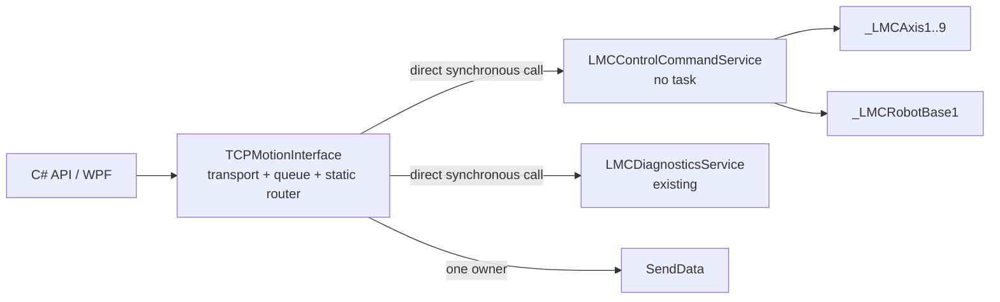

# TCPMotionInterface 성능 우선 OOP 분리 설계

- 작성일: 2026-07-23
- 대상: `Lasal_PRG/Elmo_EtherCAT_Test_4Axis`
- 상태: 설계 확정, Phase 1/1b·Phase 2·Phase 3A 완료, Phase 3B 원자 route 전환 대기
- 우선순위: PLC 주기 성능 > wire 호환성 > 유지보수성 > 구현 편의

## 1. 목적

`TCPMotionInterface`에 누적된 TCP lifecycle, request queue, RPC session, Admin,
object lookup, single-axis, group, diagnostics routing과 response 송신 책임을 분리한다.
분리는 객체 수 자체를 늘리는 것이 목적이 아니다. 다음 네 가지를 동시에 만족해야 한다.

1. 기존 `LASAL-DINT v1` request/response byte 계약을 변경하지 않는다.
2. 별도 task, mailbox, 주기 지연과 frame copy를 추가하지 않는다.
3. `TCPMotionInterface`를 transport와 static routing 책임으로 제한한다.
4. 명령 family 구현을 작고 탐색 가능한 method/class로 분리한다.

이 문서는 최종 구조와 단계별 이행 계약을 고정한다. 현재 기능 범위와 runtime 검증
상태는 [현재 아키텍처 및 릴리스 상태](ELMO_MASTER_CURRENT_ARCHITECTURE_AND_RELEASE_STATUS_2026-07-16.md)를
같이 본다.

## 2. 확인된 기준선

2026-07-23 Phase 1 직전 source 기준은 다음과 같다.

| 항목 | 기준선 |
|---|---:|
| `TCPMotionInterface.st` 전체 | 3,665 lines, 124,284 bytes |
| `MsgPaser` | 1,937 lines, 67,081 bytes |
| Group family | 11 command IDs, 약 24 KB |
| request queue | depth 8 |
| 실행량 | `CyWork`에서 scan당 최대 1 request |
| 기존 request copy | queue → `ActiveRequest` → `RequestBuf` |
| TCP 송신 소유자 | `TCPMotionInterface.SendData` |
| diagnostics domain | `LMCDiagnosticsService`로 이미 동기 위임 |

Phase 1 적용 후 확인값은 다음과 같다.

| 함수 | 크기 | 상태 |
|---|---:|---|
| `MsgPaser` | 44,784 bytes | Group aggregate route만 보유 |
| `HandleGroupCommands` | 23,926 bytes | Group 11개 본문 보유 |

Phase 1b 적용 후 현재 UTF-8 source block 확인값은 다음과 같다. LASAL 저장으로 line
ending이 CRLF로 정규화됐으므로 Phase 1 수치와 단순 증감 비교하지 않는다.

| 함수 | 현재 크기 | 상태 |
|---|---:|---|
| `MsgPaser` | 5,392 bytes | session gate, lifecycle 3개, family aggregate route만 보유 |
| `HandleAdminCommands` | 15,049 bytes | Admin 4개 본문 보유 |
| `HandleDiagnosticsCommands` | 4,745 bytes | diagnostics 24개 route/capability 본문 보유 |
| `HandleRegistryCommands` | 8,072 bytes | registry/info 3개 본문 보유 |
| `HandleAxisCommands` | 11,219 bytes | axis 8개 본문 보유 |
| `HandleGroupCommands` | 24,581 bytes | Group 11개 본문 보유 |

이 크기 제한은 LASAL compiler의 공식 hard limit가 아니다. 구현이 다시 비대해지는 것을
조기에 막기 위한 이 저장소의 정적 계약이다.

## 3. 결정

### 3.1 선택 패턴

최종 패턴은 **Static Router + synchronous no-task Domain Service**다.

- `TCPMotionInterface`: transport/session/FIFO/static family router/유일한 `SendData`
- `LMCControlCommandService`: Admin, registry, axis, group 명령의 검증과 실행
- `LMCDiagnosticsService`: 기존 diagnostics D0~D5 처리 유지
- family 내부 분기: private method의 `case`, 직접 호출

`LMCControlCommandService`는 task를 갖지 않는다. `TCPMotionInterface.CyWork`가 service
method를 동기 호출하므로 request는 기존과 같은 scan에서 처리된다.

### 3.2 제외한 패턴

| 대안 | 제외 이유 |
|---|---|
| 명령별 객체/Command pattern | 객체와 VMT 간접 호출이 command 수만큼 늘고 LASAL network가 과도하게 커짐 |
| 이벤트 버스/Observer | 실행 순서와 response ownership이 불명확해지고 queue가 하나 더 필요함 |
| 별도 control task + mailbox | 최소 1 scan 지연, 동기화와 copy가 추가됨 |
| reflection/문자열 기반 dispatch | 주기 경로의 문자열 탐색과 실패 모드가 증가함 |
| 상속 계층 확대 | transport와 motion domain은 is-a 관계가 아니며 base 변경 영향이 커짐 |
| service별 request/response array | request와 최대 2 KB response copy가 추가됨 |

상속은 vendor class contract를 확장할 때만 사용한다. 이 분리는 조합과 required client
연결이 맞다.

## 4. 목표 구조



최종 production network에서 `TCPMotionInterface`는 axis/robot client를 직접 소유하지
않는다. 이행 중에는 아직 이동하지 않은 family 때문에 기존 연결을 임시 유지할 수
있지만 한 command ID의 실행 소유자는 항상 하나뿐이어야 한다.

## 5. command ownership

dispatcher/wire contract 53개를 다음처럼 고정한다.

| 소유자 | family | command IDs | 수량 |
|---|---|---|---:|
| Transport | lifecycle | `0x8080`, `0x405C`, `0x405D` | 3 |
| Control | Admin general | `0x7D00`, `0x7D10` | 2 |
| Control | Group-domain Admin | `0x7D20`, `0x7D22` | 2 |
| Control | registry/info | `0x103C`, `0x1042`, `0x202B` | 3 |
| Control | axis | `0x2022`, `0x2023`, `0x2024`, `0x2028`, `0x202E`, `0x209F`, `0x20A0`, `0x20A2` | 8 |
| Control | group | `0x20D2`, `0x2047`, `0x2048`, `0x2049`, `0x204A`, `0x204B`, `0x2085`, `0x20A4`, `0x2045`, `0x2051`, `0x20E7` | 11 |
| Diagnostics | D0~D5 reserved family | `0x7E00`~`0x7E51`의 정의된 24개 ID | 24 |
| 합계 |  |  | 53 |

`0x7E00` capability frame은 최종적으로 diagnostics owner에 포함한다. 이행 중 현재
transport에 남아 있는 capability 조립도 별도 phase에서 service로 이동하며 wire
payload는 바꾸지 않는다.

## 6. 호출 계약

### 6.1 외부 service method

`LMCControlCommandService.ClassSvr`에 다음 global method를 둔다.

```text
HandleRequest(
  CommandId       : UINT,
  Reference       : UINT,
  pRequestFrame   : ^USINT,
  RequestFrameSize: UDINT,
  pResponseFrame  : ^USINT,
  ResponseCapacity: UDINT
) -> ResponseSize : DINT
```

- request pointer는 `TCPMotionInterface.RequestBuf[0]`을 직접 가리킨다.
- response pointer는 `TCPMotionInterface.Sendbuf[0]`을 직접 가리킨다.
- size는 8-byte outer header를 포함한 전체 frame 크기다.
- service가 기존 offset 그대로 response frame을 작성한다.
- `ResponseSize > 0`이면 transport가 `SendData`를 정확히 한 번 호출한다.
- `ResponseSize <= 0` 또는 capacity 위반이면 transport가 공통 fail-closed error를 만든다.
- service는 socket, queue, session close와 `SendData`에 접근하지 않는다.

이 계약은 추가 frame copy 없이 기존 body를 단계적으로 옮길 수 있게 한다. private
family handler는 아래의 고정 ABI로 같은 pointer/size를 직접 전달받는다. class variable에
caller pointer를 보존하거나 별도 request/response frame을 만들지 않는다.

```text
HandleAdminCommands(
  CommandId, Reference, pRequestFrame, RequestFrameSize,
  pResponseFrame, ResponseCapacity
) -> ResponseSize

HandleRegistryCommands(...same ABI...) -> ResponseSize
HandleAxisCommands(...same ABI...) -> ResponseSize
HandleGroupCommands(...same ABI...) -> ResponseSize

MoveLinearAbsEx(
  Reference, pResponseFrame, ResponseCapacity,
  pRequestFrame, RequestFrameSize
) -> ResponseSize

GroupReadStatus(
  pResponseFrame, ResponseCapacity
) -> ResponseSize
```

타입은 `HandleRequest`와 동일하게 `CommandId/Reference : UINT`, frame pointer는
`^USINT`, size/capacity는 `UDINT`, `ResponseSize : DINT`다. 이 순서와 타입은 LASAL
declaration과 정적 계약에서 함께 고정한다.

### 6.2 router

router는 command range 추론이 아니라 명시적 ID 목록을 사용한다. reserved gap이나
향후 extension이 잘못된 service로 들어가는 것을 막기 위해서다.

```text
case CommandID of
  lifecycle IDs:
    HandleTransportCommand();

  26 control IDs:
    responseSize := ControlCommands.HandleRequest(...);

  24 diagnostics IDs:
    responseSize := Diagnostics.HandleRequest(...);

  else
    BuildUnsupportedCommandResponse();
end_case;
```

service의 `HandleRequest`도 Admin/registry/axis/group의 네 묶음만 고정 분기한다. family
handler 호출은 private direct method로 유지하고 command별 객체 호출은 만들지 않는다.

## 7. 상태와 의존성 소유권

| 상태/의존성 | 최종 소유자 |
|---|---|
| socket, connected client, RPC registration | `TCPMotionInterface` |
| session epoch와 close ordering | `TCPMotionInterface` |
| ingress parser, depth-8 queue, active request | `TCPMotionInterface` |
| `RequestBuf`, `Sendbuf`, 유일한 `SendData` | `TCPMotionInterface` |
| axis/group command scratch와 last status | `LMCControlCommandService` |
| object-name buffers와 registry readiness | `LMCControlCommandService` |
| `LMCAxis1..9`, `LMCRobot` clients | `LMCControlCommandService` |
| Bulk/Recorder/SDO ticket와 BootId | `LMCDiagnosticsService` 및 기존 하위 service |

외부에서 관측되는 상태를 옮길 때 초기값과 reset 시점도 함께 옮긴다. TCP session close가
control state를 무효화해야 하는 항목이 확인되면 `NotifySessionClosed`를 명시적으로
추가한다. 근거 없이 모든 motion state를 disconnect 때 초기화하지 않는다.

## 8. 성능 불변조건

다음은 설계 권고가 아니라 구현 gate다.

1. 새 realtime/cyclic/background task를 만들지 않는다.
2. 기존 depth-8 queue와 scan당 최대 1 request 정책을 유지한다.
3. 기존 queue copy 외 request/response array copy를 추가하지 않는다.
4. control request당 domain service global call은 최대 1회다.
5. family 내부는 private direct method와 정적 `case`만 사용한다.
6. heap allocation, 문자열 dispatch, 주기별 object-name discovery를 금지한다.
7. TCP 송신은 `TCPMotionInterface.SendData`만 수행한다.
8. accepted command와 후속 status poll 순서를 바꾸지 않는다.
9. diagnostics `ProcessOperations`는 기존 request 처리 뒤 순서를 유지한다.

정적 size gate는 현재 `MsgPaser`와 다섯 local family handler 모두 `32,768 bytes`
이하다. 최종 분리 후 새 custom implementation method에도 같은 제한을 유지한다. 초과하면
method family를 더 나눈다.

## 9. 프로토콜 및 동작 불변조건

- `LmcProtocol.cs`와 `DINT_PACKET_MAP.txt`의 command ID, endian, byte offset을 유지한다.
- response outer header와 command별 payload 길이를 유지한다.
- stale session request는 실행하지 않는다.
- close ACK를 보낸 뒤 session epoch를 증가시키는 순서를 유지한다.
- ingress fault response는 fault 이전에 accept된 request 뒤에 보낸다.
- D5 submit 처리 뒤 `Diagnostics.ProcessOperations` 순서를 유지한다.
- `0x2047`은 native acceptance를 반환하고 완료는 `0x2045` poll로 확인한다.
- `0x7D22`와 group motion의 configured/powered/locked gate를 유지한다.
- unknown command는 현재 공통 `-4` 응답을 유지한다.

## 10. 단계별 구현

### Phase 0 — 계약 동결

- current source/full static 계약과 PC tests를 baseline으로 보존한다.
- command 53개 ownership 표와 wire 문서를 고정한다.
- 완료 상태: 완료.

### Phase 1 — 동일 class의 Group method 분리

- LASAL IDE에서 `TCPMotionInterface.HandleGroupCommands` private method를 생성한다.
- Group 11개 case body를 byte 동등하게 이동한다.
- `MsgPaser`에는 한 개 aggregate route만 둔다.
- method size와 단일 caller 계약을 자동 검사한다.
- 완료 상태: 2026-07-23 구현 완료, SourceOnly/full static PASS.

이 phase는 즉시 `Find in Implementation` 탐색 단위를 줄이고 다음 class migration의
diff를 작게 만든다. wire와 network는 바뀌지 않는다.

### Phase 1b — 동일 class의 나머지 family method 분리

- LASAL IDE에서 `HandleAdminCommands`, `HandleDiagnosticsCommands`,
  `HandleRegistryCommands`, `HandleAxisCommands` private method를 생성한다.
- 기존 case body를 byte 동등하게 이동하고 `MsgPaser`에는 aggregate route만 둔다.
- lifecycle `0x8080`, `0x405C`, `0x405D`와 session gate는 transport에 남긴다.
- 완료 상태: 2026-07-23 구현 완료, SourceOnly/full static PASS.

이 단계도 class/network/task/frame copy를 추가하지 않는다. 다음 service 이관 시 family별
diff와 LASAL 탐색 범위를 줄이기 위한 안전한 중간 구조다.

### Phase 2 — no-task service 골격과 network

- `LMCControlCommandService` class를 IDE에서 생성한다.
- task/automatic 속성을 모두 끈다.
- `ClassSvr`, `LMCAxis1..9`, `LMCRobot` channel을 만든다.
- `TCPMotionInterface`에 required client `ControlCommands`를 추가한다.
- `Comm_Network`에 service object와 연결을 추가한다.
- 초기에는 command route를 바꾸지 않고 generated metadata/full static부터 통과시킨다.

완료 상태(2026-07-24): class 속성, `ClassSvr`, required axis/robot client 10개,
global/private method ABI, `TCPMotionInterface.ControlCommands`와 generated class/header
metadata까지 저장했다. 이어 `GroupMovePos : _LMCPROF_POS`,
`GroupKinematicReady : BOOL`, 그리고 `MoveLinearAbsEx`의
`pRequestFrame : ^USINT`/`RequestFrameSize : UDINT` 입력 선언도 LASAL IDE에서 저장했다.
Phase 2 구조 저장 시점에는 service method가 모두 `ResponseSize := -1`인 fail-closed
골격이었다. 이후 Phase 3A에서 Group-domain body를 준비했지만 `HandleRequest`, registry,
axis는 계속 fail-closed이고 `ControlCommands.HandleRequest` 호출도 0개라 기존 command
route가 유지된다.

`Comm_Network`에는 task 없는 `LMCControlCommandService1` 객체 한 개와 incoming 1개,
axis/robot outgoing 10개를 합한 관련 연결 11개가 저장됐다. 성공 Rebuild가 삭제됐던
`ONE_Comm_Network_Table.st`를 현재 network 기준으로 재생성했고, Link, PLC Download와
project load까지 성공했다. 따라서 선언 저장 직후의 미연결 `ControlCommands` 오류와
cascade 한 건은 해소됐다. 이 Download는 dormant service의 compile/topology 증거이며
service runtime route 증거는 아니다.

최종 checkpoint에서 SourceOnly/full `Phase3GroupDormant`, PC Debug/Release 각 148개,
개발 WPF Debug/Release build가 모두 PASS했다. IDE 종료 전 `TCPMotionInterface`의
`ControlCommands`, `LMCAxis3` implementation search도 성공했고 전체
`%TEMP%\Lasal2.log`의 `CInvalidArgException`은 0건이다.

### Phase 3 — Group domain 원자 이동

- Group 11개와 Group 상태를 공유하는 `0x7D20`, `0x7D22`를 같은 checkpoint에서
  service로 이동한다. 둘만 transport에 남기면 Group state owner가 둘로 갈라진다.
- `HandleGroupCommands`, `HandleAdminCommands`의 두 Group-domain case와
  `MoveLinearAbsEx`, `GroupReadStatus` helper/state를 service로 이동한다.
- 모든 직접 `SendData`를 `ResponseSize` 반환으로 바꾼다.
- `TCPMotionInterface`의 13-ID aggregate route를 service call로 교체한다.
- 13개 ID 각각 local/service 중 실행 소유자가 정확히 하나인지 검증한다.
- 호출되지 않는 `ClampLRealToDint`는 이 phase의 이동 대상이 아니다.

#### Phase 3A — dormant body 준비

network route를 활성화하기 전에는 service의 Group-domain body를 외부 편집기로
작성할 수 있다. 단, `TCPMotionInterface`의 기존 13-ID route를 그대로 두고 service의
`HandleRequest`도 fail-closed로 유지한다. 이렇게 하면 새 body는 PLC 주기 경로에서 도달할
수 없으므로 legacy owner와 이중 실행되지 않는다. 이 단계의 목적은 큰 body 이동 diff와
network route 변경 diff를 분리하는 것이다. 구현 완료를 의미하지 않으며 wire/runtime
승인도 아니다.

이동 대상의 outer header 포함 frame 크기는 다음과 같이 고정한다. 응답 크기는 정상
contract의 최대 total size이며, legacy error path의 더 짧은 응답과 status 위치도 기존
body 그대로 유지한다.

| ID | 명령 | request total bytes | response max total bytes |
|---|---|---:|---:|
| `0x20D2` | GetGroupMembersInfo | 9 | 1,358 |
| `0x2047` | GroupEnable/ProfileLock | 9 | 16 |
| `0x2048` | GroupDisable/ProfileUnlock | 9 | 16 |
| `0x2049` | GroupReset | 9 | 16 |
| `0x204A` | GroupPowerOn | 9 | 16 |
| `0x204B` | GroupPowerOff | 9 | 16 |
| `0x2085` | GroupStop | 24 | 16 |
| `0x20A4` | MoveLinearAbsoluteEx | 104 | 16 |
| `0x2045` | GroupReadStatus | 16 | 20 |
| `0x2051` | GroupReadActualPosition | 16 | 76 |
| `0x20E7` | SetKinTransformCartesian4Axis | 1,328 | 12 |
| `0x7D20` | ReadGroupParameters | 20 | 40 |
| `0x7D22` | GroupMoveLinearRelative | 112 | 24 |

Phase 3A에서 허용하는 persistent Group state는 `GroupKinematicReady`와 motion call에
필요한 `GroupMovePos`뿐이다. 나머지 parser/status scratch는 method local로 둔다. service는
`SendData`, socket, queue, `RequestBuf`, `Sendbuf`, `CurrentSock`를 참조하지 않고 전달받은
pointer에 직접 읽고 쓴다.

완료 상태(2026-07-24): 위 13개 command body와 두 helper를 service에 구현했다. legacy
transport의 13-ID route와 service `HandleRequest` fail-closed를 유지해 실행 owner는 여전히
legacy 하나뿐이다. service pointer ABI는 각 dereference 전에 total frame size를 먼저
확인하고, response capacity가 부족하면 native side effect 없이 `ResponseSize = -1`로
반환한다. command별 request/response offset, outer status, native dispatch와 helper state를
service body 자체에서 검사하는 `Phase3GroupDormant` 의미 검증도 추가했다. 외부 편집한
implementation은 이후 LASAL Rebuild/Link/Download를 통과했다. 다만 public route가
fail-closed이므로 신규 body의 PLC runtime 승인을 뜻하지 않는다.

#### Phase 3B — network 확인 후 원자 route 전환

service object와 11개 연결, generated network table, full static gate는 2026-07-24
완료됐다. 다음 한 checkpoint에서 위 13개 ID의 transport local route를
`ControlCommands.HandleRequest` 한 번으로 바꾸고, legacy/service owner가 ID별 정확히 하나인지
검사한다. 일부 ID만 먼저 전환하거나 full-static 실패 상태에서 route를 활성화하지 않는다.

이 route는 `MsgPaser` method-local `controlResponseSize : DINT` 하나만 사용한다. request와
response를 복사하지 않고 `RequestBuf[0]`, `Sendbuf[0]` pointer를 그대로 전달하며
`RequestFrameSize := Payload + 8`, `ResponseCapacity := sizeof(Sendbuf)`로 호출한다. 반환값이
`1..sizeof(Sendbuf)` 범위면 service가 만든 frame을 유지한다. 연결 실패나 범위 밖 반환이면
transport가 공통 12-byte `status=1/error=-1` frame으로 덮어쓰고
`controlResponseSize := 12`로 바꾼다. 두 경로는 분기 뒤의 공통 `SendData` 한 번으로만
전송한다. 이 규칙으로 channel call, frame copy와 send call을 각각 최소화한다.

### Phase 4 — Axis, registry, remaining Admin 이동

- axis 8개와 helper/state를 이동한다.
- registry/info 3개를 이동한다.
- remaining Admin `0x7D00`, `0x7D10`을 마지막으로 이동한다.
- family마다 source/full static, PC tests와 capture regression을 통과시킨다.

### Phase 5 — transport 정리와 성능 승인

- `TCPMotionInterface`의 axis/robot clients와 domain state/helper를 제거한다.
- `MsgPaser`를 transport/session/static router 수준으로 축소하고 올바른 이름으로
  바꾸는 것은 별도 호환 commit에서 수행한다.
- 임시 dual network connection을 제거한다.
- 동일 PLC/build에서 전후 성능과 packet regression을 비교한다.

## 11. LASAL IDE 배치 가이드

사용자가 Phase 2 객체 배치를 수행할 때 다음 이름을 그대로 사용한다.

소유권 경계는 명확하다. service object 생성과 Object Network 연결은 사용자가 LASAL IDE에서
수행한다. 외부 편집 단계에서는 `.lcn`을 직접 합성하거나 연결을 추정하지 않는다. 사용자가
배치·저장하고 LASAL을 완전히 종료한 뒤에만 source/정적 계약 작업을 재개한다.

1. class: `LMCControlCommandService`
2. class properties:
   - `RealtimeTask=false`
   - `CyclicTask=false`
   - `BackgroundTask=false`
   - `Automatic=false`
   - `SharedCommandTable=true`
3. server: 기본 `ClassSvr`
4. required clients:
   - `LMCAxis1` ... `LMCAxis9`
   - `LMCRobot`
   - 정확히 10개이며 `_StdLib` client는 만들지 않는다. 이동 본문의 `MemCpy`는 direct
     `_memcpy`로 치환한다.
5. global method: `HandleRequest`
6. private methods:
   - `HandleAdminCommands`
   - `HandleRegistryCommands`
   - `HandleAxisCommands`
   - `HandleGroupCommands`
   - `MoveLinearAbsEx`
   - `GroupReadStatus`
7. `TCPMotionInterface` required client: `ControlCommands`
8. `Comm_Network` object: `LMCControlCommandService1`
9. connections:
   - `TCPMotionInterface1.ControlCommands -> LMCControlCommandService1.ClassSvr`
   - `LMCControlCommandService1.LMCAxis1..9 -> _LMCAxis1..9.Control`
   - `LMCControlCommandService1.LMCRobot -> _LMCRobotBase1.Control`

Phase 2에서는 기존 TCP axis/robot 연결을 삭제하지 않는다. 각 family 이동과 검증이
끝난 뒤 Phase 5에서 제거한다. 배치·저장 뒤 LASAL을 종료한 상태에서 implementation을
외부 편집한다.

위 8~9번 배치와 generated table 확인은 완료됐다. 현재 객체에는 task가 없고
`ONE_Comm_Network_Table.st`의 service metadata와 관련 연결 11개를 full static 계약으로
확인했다. 기존 TCP axis/robot 연결은 Phase 5 전까지 유지한다.

## 12. 검증과 승인 기준

### 매 phase 자동 검증

```powershell
powershell.exe -NoProfile -NonInteractive -ExecutionPolicy Bypass `
  -File "LMC_Library/LMC_API_Delivery/tests/LasalMotionControlLib.Tests/Verify-LasalContract.ps1" `
  -RepositoryRoot "." -SourceOnly `
  -ControlServiceCheckpoint Phase3GroupDormant

powershell.exe -NoProfile -NonInteractive -ExecutionPolicy Bypass `
  -File "LMC_Library/LMC_API_Delivery/tests/LasalMotionControlLib.Tests/Verify-LasalContract.ps1" `
  -RepositoryRoot "." `
  -ControlServiceCheckpoint Phase3GroupDormant
```

- 전체 C# request/parser tests PASS
- `git diff --check` PASS
- command ID별 owner 정확히 1개
- `Response`/`CyWork`에서 domain helper 직접 호출 금지
- control service에서 `SendData`, socket, queue 접근 금지
- transport에서 최종 axis/robot client 접근 금지

### LASAL IDE 검증

- project build
- 변경 class 각각 `Find in Implementation`
- smoke 시작 이후 `%TEMP%\Lasal2.log` 신규 `CInvalidArgException` 0건
- PLC download 후 기존 packet regression

### 성능 승인

동일 controller, task cycle, compiler와 build 옵션에서 전후를 비교한다.

- 10,000회 이상 control request dispatch 측정
- task overrun 0회
- dispatch P95가 기준선 대비 5% 이상 악화되지 않을 것
- command throughput이 기준선의 98% 미만으로 떨어지지 않을 것
- response frame과 command status가 byte-for-byte 동일할 것

수치는 목표 gate이며 아직 PLC에서 측정된 결과가 아니다. PC round-trip에는 network
지연이 섞이므로 PLC dispatch 구간 측정과 packet 시간을 분리한다.

## 13. 남은 작업과 병행 테스트 계획

병행은 작업 흐름 기준이다. `_TCPIPServer1.MaxConnections=1`이고 같은 PLC motion owner를
공유하므로 실제 PLC 송신 시험 두 개를 동시에 실행하지 않는다. PC/static 검증과 문서·capture
분석은 병행할 수 있지만 PLC write/motion 시험은 한 세션씩 직렬화한다.

| 흐름 | 다음 작업 | 같이 수행할 검증 | 완료 조건 |
|---|---|---|---|
| A. Phase 3B route | Group 11개와 Admin 2개를 `HandleRequest` 한 번으로 원자 전환 | SourceOnly/full `Phase3GroupRouted`, 148 PC tests, WPF Debug/Release build | 13-ID owner가 각각 정확히 하나, 공통 `SendData` 한 번, malformed fail-closed |
| B. legacy/신규 성능 비교 | route 전 legacy baseline을 먼저 저장하고 같은 PLC/build 조건에서 전환 후 재측정 | 1 ms cycle jitter/overrun, dispatch P95, throughput, RAM, 10,000회 이상 soak | 12절 성능 gate 충족 및 원시 로그 보존 |
| C. packet 회귀 | read-only/identity를 먼저 확인한 뒤 저속 Group command를 안전 순서로 실행 | 정상·잘못된 size/reference/mode, Power/Enable/Stop, disconnect/reconnect, response byte 비교 | 기존 golden과 byte/status 동일, 이중 실행·stale session 0 |
| D. Phase 4/5 | Axis, registry, 남은 Admin을 family 단위 이동 후 legacy direct client/state 정리 | family별 static/PC/capture 회귀와 매 단계 LASAL Rebuild/Link/smoke | transport가 session/FIFO/router/send만 소유 |
| E. 9축 network | 새 `PosController5..9`와 `_LMCAxis5..9.LMCController` 연결을 축별 점검 | generated table, simulated axis position/status, axis-order readback | 1..9 매핑과 `0x2028`/`0x202E` 값 일치 |
| F. diagnostics qualification | Group route 변경과 독립된 runner backlog 수행 | Bulk 24-entry/100회, Recorder soak/reconnect/adopt, SDO offline/abort/timeout/cancel/contention | happy path가 아닌 fault/soak 원시 결과까지 보존 |

Phase 3B 전에 즉시 필요한 것은 B의 legacy 성능 baseline과 안전 시험 조건 확정이다. C와 F의
PLC 실행은 서로 병렬 실행하지 않고, 장비 정지·저속·무부하 조건과 motion owner를 먼저
확인한다. static/PC PASS만으로 production 승인하지 않는다.

## 14. rollback

- Phase 1/1b: 해당 aggregate route를 원래 same-class case body로 되돌린다.
- Phase 3/4: 해당 family route만 local handler로 되돌린다.
- service와 기존 TCP client 연결은 family 검증이 끝날 때까지 함께 유지한다.
- wire/API change가 없으므로 C# DLL rollback은 필요하지 않아야 한다.
- project metadata를 되돌릴 때 `.st`만 수정하지 말고 IDE 등록과 network를 같은
  checkpoint로 복원한다.

## 15. 관련 기준

- [현재 아키텍처 및 릴리스 상태](ELMO_MASTER_CURRENT_ARCHITECTURE_AND_RELEASE_STATUS_2026-07-16.md)
- [LASAL 코딩 규칙](SIGMATEK_LASAL_coding_rules.md)
- [LASAL 프로그래밍 방법 연구](SIGMATEK_LASAL_programming_method_study.md)
- [LASAL 오류 예방 가이드](SIGMATEK_LASAL_programming_error_prevention_guide.md)
- [CyWork-only TCP 실행 설계](../../LMC_Library/LMC_API_Delivery/docs/LASAL_CYWORK_ONLY_TCP_EXECUTION_DESIGN_2026-07-13.md)
- [DINT packet map](../../LMC_Library/LMC_API_Delivery/docs/DINT_PACKET_MAP.txt)
- [정적 계약 검사](../../LMC_Library/LMC_API_Delivery/tests/LasalMotionControlLib.Tests/Verify-LasalContract.ps1)
