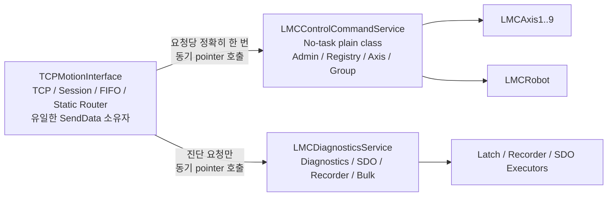

> Image output: image/jpeg
>
> Image output: image/jpeg
>
> 재현됐습니다. 원하는 방식으로 접근할 수 있습니다.
>
> 지금 `Ctrl+F → Show in Find Results 체크 → 0x2047 검색`을 실행하니 결과가 `TCPMotionInterface.st (2390): 0x2047:` 한 줄로 표시됐고, 그 줄을 더블클릭하자 실제 `TCPMotionInterface::MsgPaser`의 해당 구현 위치로 이동했습니다. 현재 LASAL 화면도 그 위치에 그대로 두었습니다. 이제 `Find in Implementation` 자체의 형식 변경 가능 여부만 마지막으로 구분하겠습니다.
>
> MCP tool call
>
> node_repl.js
>
> ```json
> {
>   "title": "클래스 정의 경로 검색 가능 여부 확인",
>   "code": "globalThis.classTreeState = await sky.get_window_state({window:targetWindow,include_screenshot:true,include_text:true});\n{\n const lines=(classTreeState.accessibility?.tree||\"\").split(\"\\n\");\n nodeRepl.write(lines.filter(x=>/TCPMotionInterface|Client|LMCAxis3|Class View|콘솔 트리/.test(x)).slice(-80).join(\"\\n\"));\n}"
> }
> ```
>
> ```text
> Window: "Lasal Class 2 (02.03.001) - {Elmo_EtherCAT_Test_4Axis} - TCPMotionInterface", App: Lasal2.exe.
> 	0 창 Lasal Class 2 (02.03.001) - {Elmo_EtherCAT_Test_4Axis} - TCPMotionInterface Secondary Actions: Raise
> 			2 창 TCPMotionInterface Secondary Actions: Raise ID: 65285
> 					4 창 FUNCTION VIRTUAL GLOBAL TCPMotionInterface::CyWork VAR_INPUT EAX : UDINT; END_VAR VAR_OUTPUT state (EAX) : UDINT; END_VAR VAR currentEpoch : UDINT; sendRet : DINT; END_VAR // The ordinary TCP server and this interface run in one cyclic task. // Response publishes the queue before this CyWork consumes it. if (PendingClosedSessionEpoch <> 0) IsClientConnected(#Diagnostics) then Diagnostics.NotifySessionClosed( SessionEpoch:=PendingClosedSessionEpoch); PendingClosedSessionEpoch := 0; end_if; currentEpoch := SessionEpoch; // MsgPaser resolves object names on demand in this CyWork context. CyWork // performs no periodic string discovery or retry loop. if (ActiveRequestValid = TRUE) & (ActiveRequest.SessionEpoch <> currentEpoch) then ActiveRequestValid := FALSE; end_if; // The queue has one cyclic owner, so enum states use direct transitions. if ActiveRequestValid = FALSE then if RequestQueue[QueueReadIndex$DINT].State = TCPMI_QUEUE_READY then RequestQueue[QueueReadIndex$DINT].State := TCPMI_QUEUE_ACTIVE; _StdLib.MemCpy( dest:=#ActiveRequest, source:=#RequestQueue[QueueReadIndex$DINT], size:=sizeof(ActiveRequest) ); RequestQueue[QueueReadIndex$DINT].State := TCPMI_QUEUE_FREE; QueueReadIndex := (QueueReadIndex + 1) mod 8; ActiveRequestValid := TRUE; end_if; end_if; if ActiveRequestValid = TRUE then if ActiveRequest.SessionEpoch = currentEpoch then _memset(dest:=#RequestBuf, usByte:=0, cntr:=sizeof(RequestBuf)); RequestBuf[0]$UINT := ActiveRequest.CommandId; RequestBuf[4]$UINT := ActiveRequest.PayloadLength; RequestBuf[6]$UINT := ActiveRequest.Reference; if ActiveRequest.PayloadLength > 0 then _StdLib.MemCpy( dest:=#RequestBuf[8], source:=#ActiveRequest.PayloadData[0], size:=ActiveRequest.PayloadLength ); end_if; CommandID := TO_DINT(ActiveRequest.CommandId); AxisRef := TO_DINT(ActiveRequest.Reference); Payload := TO_DINT(ActiveRequest.PayloadLength); CurrentSock := ActiveRequest.Socket; MsgPaser(); end_if; ActiveRequestValid := FALSE; end_if; if IsClientConnected(#Diagnostics) then Diagnostics.ProcessOperations(); end_if; // Fault responses are ordered after every request accepted before the fault. if (ActiveRequestValid = FALSE) & (IngressFaultPending = TRUE) & (RequestQueue[QueueReadIndex$DINT].State <> TCPMI_QUEUE_READY) then if IngressFaultEpoch <> currentEpoch then IngressFaultPending := FALSE; if (IngressFaultCloseRequired = FALSE) & (IngressDiscardRemaining = 0) then IngressBlocked := FALSE; end_if; else _memset(dest:=#Sendbuf, usByte:=0, cntr:=sizeof(Sendbuf)); Sendbuf[0]$UINT := 1; Sendbuf[2]$UINT := 4; Sendbuf[4]$UDINT := 0; Sendbuf[8]$UINT := 1; Sendbuf[10]$INT := IngressFaultError; sendRet := SendData( pData:=#Sendbuf[0], udSize:=12, dSocket:=IngressFaultSocket, bDirect:=TRUE ); if sendRet = 12 then IngressFaultPending := FALSE; if (IngressFaultCloseRequired = FALSE) & (IngressDiscardRemaining = 0) then IngressBlocked := FALSE; end_if; else IngressFaultPending := FALSE; IngressBlocked := TRUE; IngressFaultCloseRequired := TRUE; end_if; end_if; end_if; state := READY; END_FUNCTION FUNCTION VIRTUAL GLOBAL TCPMotionInterface::ConnSocketInfo VAR_INPUT dSock : DINT; InfoPara1 : DINT; InfoPara2 : DINT; END_VAR case InfoPara1 of TCP_SVR_SOCK_INFO_CONNECT : ConnectedClients +=1; if CurrentSock = 0 then CurrentSock := dSock; SessionEpoch += 1; if SessionEpoch = 0 then SessionEpoch := 1; end_if; IngressBlocked := FALSE; IngressFaultPending := FALSE; IngressFaultCloseRequired := FALSE; IngressDiscardRemaining := 0; ID: 10000
> 						5 스크롤 막대 세로 ID: NonClientVerticalScrollBar
> 						11 스크롤 막대 가로 ID: NonClientHorizontalScrollBar
> 					19 스크롤 막대 세로 ID: NonClientVerticalScrollBar
> 					24 스크롤 막대 가로 ID: NonClientHorizontalScrollBar
> 					32 스크롤 막대 세로 ID: NonClientVerticalScrollBar
> 					37 스크롤 막대 가로 ID: NonClientHorizontalScrollBar
> 					45 스크롤 막대 세로 ID: NonClientVerticalScrollBar
> 					52 스크롤 막대 세로 ID: NonClientVerticalScrollBar
> 					57 스크롤 막대 가로 ID: NonClientHorizontalScrollBar
> 						66 스크롤 막대 세로 ID: NonClientVerticalScrollBar
> 						72 스크롤 막대 가로 ID: NonClientHorizontalScrollBar
> 			80 텍스트 TCPMotionInterface::MsgPaser
> 		176 Tab Class View ID: 895543056
> 				178 콘솔 트리 (selectable) Elmo_EtherCAT_Test_4Axis
> 					179 콘솔 트리 (selectable) External
> 					180 콘솔 트리 (selectable) Sigmatek
> 					181 콘솔 트리 (selectable) _TCPIPServer_RT
> 					182 콘솔 트리 (selectable) Elmo_1
> 					183 콘솔 트리 (selectable) Elmo_2
> 					184 콘솔 트리 (selectable) Elmo_3
> 					185 콘솔 트리 (selectable) Elmo_4
> 					186 콘솔 트리 (selectable) LMCDiagnosticsService
> 					187 콘솔 트리 (selectable) LMCEcatInputLatch
> 					188 콘솔 트리 (selectable) LMCRecorderStore
> 					189 콘솔 트리 (selectable) LMCSdoExecutor
> 					190 콘솔 트리 (selectable) TCPMotionInterface
> The focused UI element is 4 창 FUNCTION VIRTUAL GLOBAL TCPMotionInterface::CyWork VAR_INPUT EAX : UDINT; END_VAR VAR_OUTPUT state (EAX) : UDINT; END_VAR VAR currentEpoch : UDINT; sendRet : DINT; END_VAR // The ordinary TCP server and this interface run in one cyclic task. // Response publishes the queue before this CyWork consumes it. if (PendingClosedSessionEpoch <> 0) IsClientConnected(#Diagnostics) then Diagnostics.NotifySessionClosed( SessionEpoch:=PendingClosedSessionEpoch); PendingClosedSessionEpoch := 0; end_if; currentEpoch := SessionEpoch; // MsgPaser resolves object names on demand in this CyWork context. CyWork // performs no periodic string discovery or retry loop. if (ActiveRequestValid = TRUE) & (ActiveRequest.SessionEpoch <> currentEpoch) then ActiveRequestValid := FALSE; end_if; // The queue has one cyclic owner, so enum states use direct transitions. if ActiveRequestValid = FALSE then if RequestQueue[QueueReadIndex$DINT].State = TCPMI_QUEUE_READY then RequestQueue[QueueReadIndex$DINT].State := TCPMI_QUEUE_ACTIVE; _StdLib.MemCpy( dest:=#ActiveRequest, source:=#RequestQueue[QueueReadIndex$DINT], size:=sizeof(ActiveRequest) ); RequestQueue[QueueReadIndex$DINT].State := TCPMI_QUEUE_FREE; QueueReadIndex := (QueueReadIndex + 1) mod 8; ActiveRequestValid := TRUE; end_if; end_if; if ActiveRequestValid = TRUE then if ActiveRequest.SessionEpoch = currentEpoch then _memset(dest:=#RequestBuf, usByte:=0, cntr:=sizeof(RequestBuf)); RequestBuf[0]$UINT := ActiveRequest.CommandId; RequestBuf[4]$UINT := ActiveRequest.PayloadLength; RequestBuf[6]$UINT := ActiveRequest.Reference; if ActiveRequest.PayloadLength > 0 then _StdLib.MemCpy( dest:=#RequestBuf[8], source:=#ActiveRequest.PayloadData[0], size:=ActiveRequest.PayloadLength ); end_if; CommandID := TO_DINT(ActiveRequest.CommandId); AxisRef := TO_DINT(ActiveRequest.Reference); Payload := TO_DINT(ActiveRequest.PayloadLength); CurrentSock := ActiveRequest.Socket; MsgPaser(); end_if; ActiveRequestValid := FALSE; end_if; if IsClientConnected(#Diagnostics) then Diagnostics.ProcessOperations(); end_if; // Fault responses are ordered after every request accepted before the fault. if (ActiveRequestValid = FALSE) & (IngressFaultPending = TRUE) & (RequestQueue[QueueReadIndex$DINT].State <> TCPMI_QUEUE_READY) then if IngressFaultEpoch <> currentEpoch then IngressFaultPending := FALSE; if (IngressFaultCloseRequired = FALSE) & (IngressDiscardRemaining = 0) then IngressBlocked := FALSE; end_if; else _memset(dest:=#Sendbuf, usByte:=0, cntr:=sizeof(Sendbuf)); Sendbuf[0]$UINT := 1; Sendbuf[2]$UINT := 4; Sendbuf[4]$UDINT := 0; Sendbuf[8]$UINT := 1; Sendbuf[10]$INT := IngressFaultError; sendRet := SendData( pData:=#Sendbuf[0], udSize:=12, dSocket:=IngressFaultSocket, bDirect:=TRUE ); if sendRet = 12 then IngressFaultPending := FALSE; if (IngressFaultCloseRequired = FALSE) & (IngressDiscardRemaining = 0) then IngressBlocked := FALSE; end_if; else IngressFaultPending := FALSE; IngressBlocked := TRUE; IngressFaultCloseRequired := TRUE; end_if; end_if; end_if; state := READY; END_FUNCTION FUNCTION VIRTUAL GLOBAL TCPMotionInterface::ConnSocketInfo VAR_INPUT dSock : DINT; InfoPara1 : DINT; InfoPara2 : DINT; END_VAR case InfoPara1 of TCP_SVR_SOCK_INFO_CONNECT : ConnectedClients +=1; if CurrentSock = 0 then CurrentSock := dSock; SessionEpoch += 1; if SessionEpoch = 0 then SessionEpoch := 1; end_if; IngressBlocked := FALSE; IngressFaultPending := FALSE; IngressFaultCloseRequired := FALSE; IngressDiscardRemaining := 0; ID: 10000.
> ```
>
> Image output: image/jpeg
>
> Image output: image/jpeg
>
> MCP tool call
>
> node_repl.js
>
> ```json
> {
>   "title": "TCPMotionInterface 클래스 메뉴 확인",
>   "code": "await sky.click({window:targetWindow,x:1260,y:382,mouse_button:\"right\"});\nawait new Promise(r=>setTimeout(r,200));\nglobalThis.classMenu = await sky.get_window_state({window:targetWindow,include_screenshot:true,include_text:true});\n{\n const lines=(classMenu.accessibility?.tree||\"\").split(\"\\n\");\n nodeRepl.write(lines.filter(x=>/메뉴 항목|Implementation|Object|Client|Open|Reload|Find/i.test(x)).slice(-80).join(\"\\n\"));\n}"
> }
> ```
>
> ```text
> 					4 창 FUNCTION VIRTUAL GLOBAL TCPMotionInterface::CyWork VAR_INPUT EAX : UDINT; END_VAR VAR_OUTPUT state (EAX) : UDINT; END_VAR VAR currentEpoch : UDINT; sendRet : DINT; END_VAR // The ordinary TCP server and this interface run in one cyclic task. // Response publishes the queue before this CyWork consumes it. if (PendingClosedSessionEpoch <> 0) IsClientConnected(#Diagnostics) then Diagnostics.NotifySessionClosed( SessionEpoch:=PendingClosedSessionEpoch); PendingClosedSessionEpoch := 0; end_if; currentEpoch := SessionEpoch; // MsgPaser resolves object names on demand in this CyWork context. CyWork // performs no periodic string discovery or retry loop. if (ActiveRequestValid = TRUE) & (ActiveRequest.SessionEpoch <> currentEpoch) then ActiveRequestValid := FALSE; end_if; // The queue has one cyclic owner, so enum states use direct transitions. if ActiveRequestValid = FALSE then if RequestQueue[QueueReadIndex$DINT].State = TCPMI_QUEUE_READY then RequestQueue[QueueReadIndex$DINT].State := TCPMI_QUEUE_ACTIVE; _StdLib.MemCpy( dest:=#ActiveRequest, source:=#RequestQueue[QueueReadIndex$DINT], size:=sizeof(ActiveRequest) ); RequestQueue[QueueReadIndex$DINT].State := TCPMI_QUEUE_FREE; QueueReadIndex := (QueueReadIndex + 1) mod 8; ActiveRequestValid := TRUE; end_if; end_if; if ActiveRequestValid = TRUE then if ActiveRequest.SessionEpoch = currentEpoch then _memset(dest:=#RequestBuf, usByte:=0, cntr:=sizeof(RequestBuf)); RequestBuf[0]$UINT := ActiveRequest.CommandId; RequestBuf[4]$UINT := ActiveRequest.PayloadLength; RequestBuf[6]$UINT := ActiveRequest.Reference; if ActiveRequest.PayloadLength > 0 then _StdLib.MemCpy( dest:=#RequestBuf[8], source:=#ActiveRequest.PayloadData[0], size:=ActiveRequest.PayloadLength ); end_if; CommandID := TO_DINT(ActiveRequest.CommandId); AxisRef := TO_DINT(ActiveRequest.Reference); Payload := TO_DINT(ActiveRequest.PayloadLength); CurrentSock := ActiveRequest.Socket; MsgPaser(); end_if; ActiveRequestValid := FALSE; end_if; if IsClientConnected(#Diagnostics) then Diagnostics.ProcessOperations(); end_if; // Fault responses are ordered after every request accepted before the fault. if (ActiveRequestValid = FALSE) & (IngressFaultPending = TRUE) & (RequestQueue[QueueReadIndex$DINT].State <> TCPMI_QUEUE_READY) then if IngressFaultEpoch <> currentEpoch then IngressFaultPending := FALSE; if (IngressFaultCloseRequired = FALSE) & (IngressDiscardRemaining = 0) then IngressBlocked := FALSE; end_if; else _memset(dest:=#Sendbuf, usByte:=0, cntr:=sizeof(Sendbuf)); Sendbuf[0]$UINT := 1; Sendbuf[2]$UINT := 4; Sendbuf[4]$UDINT := 0; Sendbuf[8]$UINT := 1; Sendbuf[10]$INT := IngressFaultError; sendRet := SendData( pData:=#Sendbuf[0], udSize:=12, dSocket:=IngressFaultSocket, bDirect:=TRUE ); if sendRet = 12 then IngressFaultPending := FALSE; if (IngressFaultCloseRequired = FALSE) & (IngressDiscardRemaining = 0) then IngressBlocked := FALSE; end_if; else IngressFaultPending := FALSE; IngressBlocked := TRUE; IngressFaultCloseRequired := TRUE; end_if; end_if; end_if; state := READY; END_FUNCTION FUNCTION VIRTUAL GLOBAL TCPMotionInterface::ConnSocketInfo VAR_INPUT dSock : DINT; InfoPara1 : DINT; InfoPara2 : DINT; END_VAR case InfoPara1 of TCP_SVR_SOCK_INFO_CONNECT : ConnectedClients +=1; if CurrentSock = 0 then CurrentSock := dSock; SessionEpoch += 1; if SessionEpoch = 0 then SessionEpoch := 1; end_if; IngressBlocked := FALSE; IngressFaultPending := FALSE; IngressFaultCloseRequired := FALSE; IngressDiscardRemaining := 0; ID: 10000
> 						5 스크롤 막대 세로 ID: NonClientVerticalScrollBar
> 						11 스크롤 막대 가로 ID: NonClientHorizontalScrollBar
> 					19 스크롤 막대 세로 ID: NonClientVerticalScrollBar
> 					24 스크롤 막대 가로 ID: NonClientHorizontalScrollBar
> 					32 스크롤 막대 세로 ID: NonClientVerticalScrollBar
> 					37 스크롤 막대 가로 ID: NonClientHorizontalScrollBar
> 					45 스크롤 막대 세로 ID: NonClientVerticalScrollBar
> 					52 스크롤 막대 세로 ID: NonClientVerticalScrollBar
> 					57 스크롤 막대 가로 ID: NonClientHorizontalScrollBar
> 						66 스크롤 막대 세로 ID: NonClientVerticalScrollBar
> 						72 스크롤 막대 가로 ID: NonClientHorizontalScrollBar
> 				101 메뉴 항목 Macros
> 				103 메뉴 항목 Layouts
> 				106 메뉴 항목 Toolbar Options
> 				109 메뉴 항목 Toolbar Options
> 				113 메뉴 항목 Online Connection
> 				123 메뉴 항목 Toolbar Options
> 				125 메뉴 항목 Target Architecture
> 				132 단추 Open a file (Strg+Shift+O)
> 				135 단추 Open project (Strg+O)
> 				142 메뉴 항목 (disabled) Undo (Strg+Z)
> 				143 메뉴 항목 (disabled) Redo (Strg+Y)
> 				147 메뉴 항목 FILE
> 				148 메뉴 항목 EDIT
> 				149 메뉴 항목 VIEW
> 				150 메뉴 항목 PROJECT
> 				151 메뉴 항목 BUILD
> 				152 메뉴 항목 DEBUG
> 				153 메뉴 항목 ANALYZE
> 				154 메뉴 항목 TOOLS
> 				155 메뉴 항목 EXTRAS
> 				156 메뉴 항목 WINDOW
> 				157 메뉴 항목 HELP
> 					200 스크롤 막대 세로 ID: NonClientVerticalScrollBar
> 					214 custom Objectsize
> The focused UI element is 4 창 FUNCTION VIRTUAL GLOBAL TCPMotionInterface::CyWork VAR_INPUT EAX : UDINT; END_VAR VAR_OUTPUT state (EAX) : UDINT; END_VAR VAR currentEpoch : UDINT; sendRet : DINT; END_VAR // The ordinary TCP server and this interface run in one cyclic task. // Response publishes the queue before this CyWork consumes it. if (PendingClosedSessionEpoch <> 0) IsClientConnected(#Diagnostics) then Diagnostics.NotifySessionClosed( SessionEpoch:=PendingClosedSessionEpoch); PendingClosedSessionEpoch := 0; end_if; currentEpoch := SessionEpoch; // MsgPaser resolves object names on demand in this CyWork context. CyWork // performs no periodic string discovery or retry loop. if (ActiveRequestValid = TRUE) & (ActiveRequest.SessionEpoch <> currentEpoch) then ActiveRequestValid := FALSE; end_if; // The queue has one cyclic owner, so enum states use direct transitions. if ActiveRequestValid = FALSE then if RequestQueue[QueueReadIndex$DINT].State = TCPMI_QUEUE_READY then RequestQueue[QueueReadIndex$DINT].State := TCPMI_QUEUE_ACTIVE; _StdLib.MemCpy( dest:=#ActiveRequest, source:=#RequestQueue[QueueReadIndex$DINT], size:=sizeof(ActiveRequest) ); RequestQueue[QueueReadIndex$DINT].State := TCPMI_QUEUE_FREE; QueueReadIndex := (QueueReadIndex + 1) mod 8; ActiveRequestValid := TRUE; end_if; end_if; if ActiveRequestValid = TRUE then if ActiveRequest.SessionEpoch = currentEpoch then _memset(dest:=#RequestBuf, usByte:=0, cntr:=sizeof(RequestBuf)); RequestBuf[0]$UINT := ActiveRequest.CommandId; RequestBuf[4]$UINT := ActiveRequest.PayloadLength; RequestBuf[6]$UINT := ActiveRequest.Reference; if ActiveRequest.PayloadLength > 0 then _StdLib.MemCpy( dest:=#RequestBuf[8], source:=#ActiveRequest.PayloadData[0], size:=ActiveRequest.PayloadLength ); end_if; CommandID := TO_DINT(ActiveRequest.CommandId); AxisRef := TO_DINT(ActiveRequest.Reference); Payload := TO_DINT(ActiveRequest.PayloadLength); CurrentSock := ActiveRequest.Socket; MsgPaser(); end_if; ActiveRequestValid := FALSE; end_if; if IsClientConnected(#Diagnostics) then Diagnostics.ProcessOperations(); end_if; // Fault responses are ordered after every request accepted before the fault. if (ActiveRequestValid = FALSE) & (IngressFaultPending = TRUE) & (RequestQueue[QueueReadIndex$DINT].State <> TCPMI_QUEUE_READY) then if IngressFaultEpoch <> currentEpoch then IngressFaultPending := FALSE; if (IngressFaultCloseRequired = FALSE) & (IngressDiscardRemaining = 0) then IngressBlocked := FALSE; end_if; else _memset(dest:=#Sendbuf, usByte:=0, cntr:=sizeof(Sendbuf)); Sendbuf[0]$UINT := 1; Sendbuf[2]$UINT := 4; Sendbuf[4]$UDINT := 0; Sendbuf[8]$UINT := 1; Sendbuf[10]$INT := IngressFaultError; sendRet := SendData( pData:=#Sendbuf[0], udSize:=12, dSocket:=IngressFaultSocket, bDirect:=TRUE ); if sendRet = 12 then IngressFaultPending := FALSE; if (IngressFaultCloseRequired = FALSE) & (IngressDiscardRemaining = 0) then IngressBlocked := FALSE; end_if; else IngressFaultPending := FALSE; IngressBlocked := TRUE; IngressFaultCloseRequired := TRUE; end_if; end_if; end_if; state := READY; END_FUNCTION FUNCTION VIRTUAL GLOBAL TCPMotionInterface::ConnSocketInfo VAR_INPUT dSock : DINT; InfoPara1 : DINT; InfoPara2 : DINT; END_VAR case InfoPara1 of TCP_SVR_SOCK_INFO_CONNECT : ConnectedClients +=1; if CurrentSock = 0 then CurrentSock := dSock; SessionEpoch += 1; if SessionEpoch = 0 then SessionEpoch := 1; end_if; IngressBlocked := FALSE; IngressFaultPending := FALSE; IngressFaultCloseRequired := FALSE; IngressDiscardRemaining := 0; ID: 10000.
> ```
>
> Image output: image/jpeg
>
> Image output: image/jpeg
>
> Image output: image/jpeg
>
> Image output: image/jpeg
>
> Image output: image/jpeg
</details>

됩니다. 제가 앞서 `Find in Implementation`이 정상이라고 판단한 것은 틀렸습니다.

지금 직접 확인한 결과:

- `TCPMotionInterface` Implementation에서 `Ctrl+F`
- `Show in Find Results` 체크
- `0x2047` 검색
- `Find Results 1`에 [TCPMotionInterface.st:2390](./Lasal_PRG/Elmo_EtherCAT_Test_4Axis/Class/TCPMotionInterface/TCPMotionInterface.st:2390)이 한 행으로 표시
- 더블클릭하면 실제 구현부 `MsgPaser`의 1914행으로 정상 이동

`2390 → 1914` 차이는 `.st` 전체 행 번호와 LASAL Implementation 전용 행 번호의 차이입니다.

반면 현재 `Find in Implementation` 결과는 고장 난 상태입니다. 행 번호 대신 `1`, `4`처럼 잘못 매핑되고, 열 때 로그에도 다음 경고가 남습니다.

```text
Close implementation because line number is in declaration.
```

별도의 “line mode” 설정은 없습니다. 즉시 사용할 때는 다음 방법이 정확합니다.

1. Implementation을 연다.
2. `Ctrl+F`
3. `Show in Find Results` 체크
4. 검색어 입력
5. `Find Results 1`의 각 행을 더블클릭

현재 LASAL 화면도 `0x2047` 구현 위치에 그대로 두었습니다.

`Find in Implementation` 자체가 망가진 유력 원인은 `TCPMotionInterface::MsgPaser` 단일 구현 블록이 약 67KB로 64KiB를 넘은 것입니다. 이를 기존처럼 완전히 복구하려면 `MsgPaser`를 여러 멤버 함수로 분리하는 작업이 필요합니다. 다만 64KiB 제한은 증거가 강한 원인 후보이며, 공식 제한 문서는 아직 확인되지 않았습니다. 파일은 수정하지 않았습니다.

> 니말이 맞다. 지금 TCPMotionInterface에 너무 많은 기능이 들어가 있는거 같다. 이 내용을 기능별로 이원화 시켜서 관리할 수 있도록 OOP 설계를 해야 될꺼 같다. 지금 가능한 성능에 가장 효율 좋은 패턴을 이용하여 구현할 수 있도록 디자인 패턴을 설계해봐. 이 패턴이 너무 많은 호출 같은걸 이용해서 성능 저하가 되면 안돼.. 지금 우리가 가장 중요한 것은 이 프로젝트에 성능이 뛰어나게 해야되는게 최우선 과제이긴 함. 그래서 코드가 길어져야된다면 어쩔수 없지만, 이 코드를 너무 길게만 하면 유지보수 및 확장성에 문제가 생길 수 있으니 가장 베스트 구조로 해서 설계를 해봐

<details><summary>5 previous messages</summary>

> 맞습니다. `TCPMotionInterface`가 TCP 수신, 세션/큐, 프로토콜 파싱, 명령별 정책, 모션·진단 실행까지 한 클래스에 몰려 있어 현재는 성능 문제가 아니라 “단일 구현 블록 크기와 변경 영향 범위”가 먼저 한계에 닿았습니다.
>
> 이번 설계에서는 다형성·동적 디스패치·메시지 복사를 남발하지 않고, RT 경로를 기준으로 호출 깊이와 메모리 복사 횟수를 계산하겠습니다. 현재 `MsgPaser`의 명령군·데이터 소유권·CyWork 실행 순서를 먼저 수치화한 뒤, LASAL에서 실제로 구현 가능한 저비용 구조로 확정하겠습니다.
>
> 현재 코드에서 이미 좋은 기준 구현이 하나 확인됐습니다. `LMCDiagnosticsService.HandleRequest()`는 요청/응답 버퍼 포인터를 동기 호출로 넘기고 응답 길이만 반환하므로, 클래스가 분리돼도 1,320바이트 payload를 다시 복사하지 않습니다. 이 zero-copy 경계를 Axis/Group 쪽에도 재사용하는 방향이 가장 유력합니다.
>
> 반대로 Command/Chain-of-Responsibility처럼 명령마다 객체를 만들거나 여러 handler를 순차 탐색하는 패턴은 이 PLC에는 맞지 않습니다. 정확한 LASAL 호출·task 제약도 공식 자료와 교차 확인하겠습니다.
>
> <details><summary>Searched the web</summary>
>
> Searched the web for `site:sigmatek-automation.com LASAL CLASS 2 object oriented programming client server methods manual PDF ...`
>
> </details>
>
> Context compaction
>
> Source: automatic
> Status: completed
>
> 현재 코드 기준으로 보면, 성능을 해치지 않는 핵심은 “클래스를 많이 만드는 것”이 아니라 `TCP 전송 계층 + 동기식 도메인 서비스`로 경계를 고정하는 것입니다. 특히 새 서비스가 별도 CyWork나 큐를 갖지 않고 호출자의 1 ms CyWork 안에서 포인터로 처리하도록 설계하고 있습니다.
</details>

결론부터 말하면, 가장 적합한 구조는 **`Static Router + No-task Domain Service` 조합**입니다.

클래스를 명령마다 만드는 Command Pattern이나 깊은 상속 구조는 사용하지 않습니다. `TCPMotionInterface`는 TCP 전송만 담당하고, 실제 모션 명령은 하나의 서비스 객체로 분리하는 방식입니다.

## 현재 문제

현재 [TCPMotionInterface.st](./Lasal_PRG/Elmo_EtherCAT_Test_4Axis/Class/TCPMotionInterface/TCPMotionInterface.st:940)의 `MsgPaser()`는 다음 상태입니다.

- 1,937줄
- 약 67,081바이트
- `TCPMotionInterface.st` 전체는 약 124KB
- TCP 수신, 세션, FIFO, 프로토콜 파싱, Axis, Group, Admin, Diagnostics, 응답 생성까지 한 클래스에 혼재

`MsgPaser()` 크기와 기존 `Find in Implementation` 예외의 연관성은 매우 높습니다. 다만 “ST 함수 소스 64KiB 제한”은 공식 문서에서 확인되지 않았으므로 확정된 컴파일러 제한으로 표현하면 안 됩니다.

성능 측면에서는 함수 호출 하나보다 현재 [CyWork](./Lasal_PRG/Elmo_EtherCAT_Test_4Axis/Class/TCPMotionInterface/TCPMotionInterface.st:479)의 다음 복사 비용이 더 큽니다.

- Queue entry 전체 → `ActiveRequest`
- `RequestBuf` 전체 초기화
- 최대 1,320바이트 payload → `RequestBuf`
- 서비스 처리 전후의 반복적인 `Sendbuf` 초기화

## 최종 권장 구조



### 1. `TCPMotionInterface`

계속 `_TCPIPServerInterface`를 상속합니다.

담당 기능:

- `Response()` TCP ingress와 frame 조립
- FIFO와 session epoch
- RPC initialization/callback/close
- ingress fault와 partial-send quarantine
- 한 CyWork당 요청 한 건 처리
- 정적 command-domain routing
- 유일한 `SendData()` 호출자

로컬 명령은 아래 3개만 남깁니다.

- `0x8080`: RPC Initialize
- `0x405C`: Callback Register
- `0x405D`: Session Close

### 2. 신규 `LMCControlCommandService`

상속하지 않는 일반 LASAL class이며 별도 CyWork/RT task를 갖지 않습니다.

명령 26개를 담당합니다.

- Admin: `0x7D00`, `0x7D10`, `0x7D20`, `0x7D22`
- Registry: `0x103C`, `0x1042`
- Axis: `0x2022`, `0x2023`, `0x2024`, `0x202B`, `0x2028`, `0x202E`, `0x209F`, `0x20A0`, `0x20A2`
- Group: `0x2045`, `0x2047~0x204B`, `0x2051`, `0x2085`, `0x20A4`, `0x20D2`, `0x20E7`

내부는 object를 더 만들지 않고 private non-virtual 함수로 나눕니다.

```text
HandleRequest
